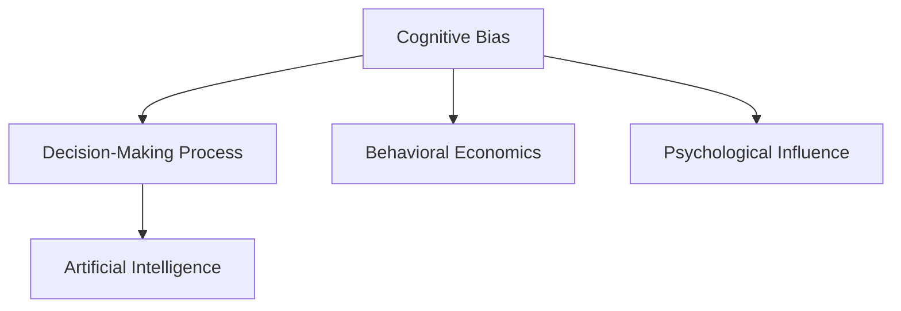

                 

# 认知偏差：影响决策的隐形力量

> 关键词：认知偏差, 决策过程, 行为经济学, 心理影响, 人工智能

## 1. 背景介绍

在现代社会的决策过程中，认知偏差（Cognitive Bias）扮演着至关重要的角色。认知偏差指的是人们在进行判断、决策和推论时，由于自身的心理因素或客观环境的限制，所产生的系统性的、规律性的错误。这些偏差常常导致决策者在面对复杂和不确定的情况时，无法做出最合理、最准确的选择。认知偏差不仅存在于个体的日常决策中，也在组织、政策制定等领域产生深远影响。

认知偏差的研究起源于心理学，逐步扩展到行为经济学、人工智能等交叉学科。近年来，随着大数据、机器学习和人工智能技术的飞速发展，研究者们开始尝试运用这些技术来识别、分析和管理认知偏差，以期提升个体和组织决策的科学性和准确性。认知偏差的研究已经成为智能决策系统设计的重要基础，特别是在医疗、金融、法律等高风险领域，减少认知偏差的需求尤为迫切。

## 2. 核心概念与联系

### 2.1 核心概念概述

要深入理解认知偏差的原理，首先需要明确几个关键概念：

- **认知偏差（Cognitive Bias）**：指个体或群体在获取、处理和分析信息时，由于认知过程的限制，所导致的系统性错误。
- **决策过程（Decision-Making Process）**：指个体或组织为了达成某个目标，对可能的选择进行评估、比较和选择的行为过程。
- **行为经济学（Behavioral Economics）**：研究人们在决策和选择中的心理规律，特别是不符合理性经济模型的情况。
- **心理影响（Psychological Influence）**：个体在决策中，受到情绪、态度、社会压力等心理因素的影响。
- **人工智能（Artificial Intelligence）**：通过机器学习算法，模拟、延伸和扩展人类的智能过程，包括感知、决策和执行能力。

这些概念之间的关系可以通过以下Mermaid流程图来展示：



这个流程图展示了认知偏差与决策过程、行为经济学和心理影响的联系，以及人工智能在决策支持中的应用。

## 3. 核心算法原理 & 具体操作步骤

### 3.1 算法原理概述

认知偏差的研究，涉及对个体决策过程的建模和分析。基本的研究框架包括：

1. **建模与数据采集**：构建决策任务模型，收集个体在不同情境下的决策数据。
2. **偏差识别与分类**：使用统计方法或机器学习算法，识别个体决策中的认知偏差类型和强度。
3. **偏差校正与干预**：针对识别出的认知偏差，设计干预措施，提升决策质量。

在实际操作中，常见的认知偏差识别和校正算法包括：

- **统计分析法**：通过建立决策任务模型，利用统计学方法识别个体决策中的偏差模式。
- **机器学习法**：使用决策树、支持向量机、神经网络等算法，自动分类和识别认知偏差。
- **元学习法**：通过学习决策过程中的学习规律，动态调整决策策略，减少偏差影响。

### 3.2 算法步骤详解

以下是基于机器学习的认知偏差识别和校正的详细操作步骤：

**Step 1: 任务定义与数据准备**
- 定义具体的决策任务，如股票买卖决策、医疗诊断等。
- 准备数据集，包含个体在不同决策情境下的数据，如历史交易记录、病历记录等。
- 对数据进行预处理，确保数据完整性和一致性。

**Step 2: 特征提取与模型选择**
- 提取决策过程中的关键特征，如投资策略、病情严重度等。
- 选择适合的数据模型，如决策树、支持向量机、神经网络等。
- 利用交叉验证等方法评估模型性能，选择最优模型。

**Step 3: 偏差识别与分类**
- 使用训练好的模型，对个体决策进行预测。
- 通过对比实际决策和预测决策，识别认知偏差类型和强度。
- 对偏差进行分类，如确认偏误、代表性偏误、可获得性偏误等。

**Step 4: 偏差校正与干预**
- 设计针对性的干预措施，如提供更多的决策信息、调整决策框架等。
- 在实际决策过程中应用干预措施，提升决策质量。
- 监测干预效果，进行持续优化。

**Step 5: 效果评估与反馈**
- 对干预效果进行评估，如决策质量提升、风险降低等。
- 收集反馈信息，优化干预措施和决策模型。
- 持续跟踪决策过程，确保偏差校正的长期效果。

### 3.3 算法优缺点

基于机器学习的认知偏差识别和校正方法具有以下优点：

- **自动化**：使用机器学习算法，可以自动发现和分类认知偏差，无需人工干预。
- **高精度**：通过大量数据训练，能够提高偏差识别的准确性。
- **适应性强**：模型可以根据不同的决策任务进行调整和优化，适应性强。

同时，该方法也存在一些局限性：

- **数据依赖**：模型的准确性高度依赖于数据的丰富性和质量。
- **算法复杂**：模型构建和训练过程复杂，需要较高的技术门槛。
- **干预效果有限**：尽管能够识别和分类认知偏差，但如何设计有效的干预措施，仍需进一步研究。
- **伦理问题**：干预措施可能涉及隐私和伦理问题，需谨慎使用。

### 3.4 算法应用领域

基于机器学习的认知偏差识别和校正方法，已在多个领域得到应用：

- **金融决策**：在股票、期货等投资决策中，识别和校正确认偏误、可获得性偏误等，提升投资决策的科学性和准确性。
- **医疗诊断**：在诊断疾病时，校正过度自信、代表性偏误等，提高诊断的准确性和及时性。
- **法律判断**：在刑事案件中，识别和校正情绪偏差、可获得性偏误等，确保判决的公正性和合理性。
- **人力资源**：在招聘和晋升决策中，识别和校正首因效应、确认偏误等，提升人力资源管理的科学性和公平性。
- **风险管理**：在企业风险评估和控制中，识别和校正过度自信、代表性偏误等，提升风险管理的精准度和有效性。

## 4. 数学模型和公式 & 详细讲解 & 举例说明

### 4.1 数学模型构建

认知偏差的数学建模通常涉及概率论、统计学和机器学习的交叉应用。以下是一个简化的决策树模型，用于识别确认偏误和可获得性偏误。

设决策任务为 $T$，有 $k$ 个决策选项 $A_1, A_2, ..., A_k$，个体在 $n$ 种情境下进行了 $m$ 次决策，构建决策树 $D$。设第 $i$ 次决策的实际选择为 $a_i \in \{A_1, A_2, ..., A_k\}$，模型预测的决策为 $\hat{a}_i$。

确认偏误 $B_{con}$ 和可获得性偏误 $B_{av}$ 的定义如下：

$$
B_{con} = \frac{1}{n} \sum_{i=1}^n \mathbb{I}(a_i \neq \hat{a}_i)
$$

$$
B_{av} = \frac{1}{n} \sum_{i=1}^n \frac{\mathbb{I}(a_i = A_k)}{\sum_{j=1}^k \mathbb{I}(a_i = A_j)}
$$

其中，$\mathbb{I}$ 为示性函数，$A_k$ 为“可获得性最高”的决策选项。

### 4.2 公式推导过程

通过上述定义，我们可以推导出确认偏误和可获得性偏误的计算公式：

1. 确认偏误 $B_{con}$：
$$
B_{con} = \frac{1}{n} \sum_{i=1}^n \mathbb{I}(a_i \neq \hat{a}_i) = \frac{1}{n} \sum_{i=1}^n (1 - \mathbb{I}(a_i = \hat{a}_i))
$$

2. 可获得性偏误 $B_{av}$：
$$
B_{av} = \frac{1}{n} \sum_{i=1}^n \frac{\mathbb{I}(a_i = A_k)}{\sum_{j=1}^k \mathbb{I}(a_i = A_j)} = \frac{1}{n} \sum_{i=1}^n \frac{1}{\sum_{j=1}^k \mathbb{I}(a_i = A_j)}
$$

在实际应用中，可以通过决策树、随机森林等算法，对 $B_{con}$ 和 $B_{av}$ 进行识别和分类。

### 4.3 案例分析与讲解

假设某投资公司希望通过机器学习算法，识别并校正确认偏误和可获得性偏误。公司准备了投资决策数据集，包含了历史交易记录和股票信息。

**Step 1: 任务定义与数据准备**
- 定义决策任务为股票买卖决策。
- 准备数据集，包括历史交易记录、股票价格、财务数据等。
- 对数据进行预处理，确保数据完整性和一致性。

**Step 2: 特征提取与模型选择**
- 提取决策过程中的关键特征，如股票价格、波动率、市场情绪等。
- 选择决策树模型，构建决策树 $D$。
- 使用交叉验证等方法评估模型性能，选择最优模型。

**Step 3: 偏差识别与分类**
- 使用训练好的决策树模型，对个体决策进行预测。
- 通过对比实际决策和预测决策，识别确认偏误和可获得性偏误。
- 对偏差进行分类，如过度自信、可获得性高决策选项等。

**Step 4: 偏差校正与干预**
- 设计针对性的干预措施，如提供更多的市场信息、调整投资框架等。
- 在实际投资决策中应用干预措施，提升决策质量。
- 监测干预效果，进行持续优化。

**Step 5: 效果评估与反馈**
- 对干预效果进行评估，如投资收益提升、风险降低等。
- 收集反馈信息，优化干预措施和决策模型。
- 持续跟踪投资决策过程，确保偏差校正的长期效果。

## 5. 项目实践：代码实例和详细解释说明

### 5.1 开发环境搭建

在进行认知偏差识别和校正的实践前，我们需要准备好开发环境。以下是使用Python进行PyTorch开发的环境配置流程：

1. 安装Anaconda：从官网下载并安装Anaconda，用于创建独立的Python环境。

2. 创建并激活虚拟环境：
```bash
conda create -n cognitive-env python=3.8 
conda activate cognitive-env
```

3. 安装PyTorch：根据CUDA版本，从官网获取对应的安装命令。例如：
```bash
conda install pytorch torchvision torchaudio cudatoolkit=11.1 -c pytorch -c conda-forge
```

4. 安装相关库：
```bash
pip install pandas numpy matplotlib scikit-learn
```

完成上述步骤后，即可在`cognitive-env`环境中开始认知偏差的实践。

### 5.2 源代码详细实现

这里我们以决策树模型为例，给出使用Scikit-Learn进行确认偏误和可获得性偏误识别和校正的Python代码实现。

首先，定义决策树模型和数据处理函数：

```python
from sklearn.tree import DecisionTreeClassifier
from sklearn.metrics import accuracy_score
from sklearn.model_selection import train_test_split
import pandas as pd
import numpy as np

class DecisionTreeModel:
    def __init__(self, max_depth=None):
        self.tree = DecisionTreeClassifier(max_depth=max_depth)

    def fit(self, X, y):
        self.tree.fit(X, y)

    def predict(self, X):
        return self.tree.predict(X)

def load_data(path):
    df = pd.read_csv(path)
    X = df.drop('label', axis=1)
    y = df['label']
    return X, y
```

然后，构建决策树模型并训练：

```python
# 加载数据
X, y = load_data('decision_data.csv')

# 划分训练集和测试集
X_train, X_test, y_train, y_test = train_test_split(X, y, test_size=0.2, random_state=42)

# 构建决策树模型
model = DecisionTreeModel(max_depth=3)

# 训练模型
model.fit(X_train, y_train)

# 评估模型
print(f'模型准确率: {accuracy_score(y_test, model.predict(X_test)):.2f}')
```

最后，进行认知偏差识别和校正：

```python
from sklearn.metrics import confusion_matrix
import matplotlib.pyplot as plt

# 使用模型预测决策
y_pred = model.predict(X_test)

# 计算确认偏误
confusion = confusion_matrix(y_test, y_pred)
B_con = (len(confusion) - np.sum(np.diag(confusion))) / len(confusion)

# 计算可获得性偏误
B_av = np.mean(np.divide(y_test == y_test.argmax(), y_test.argmax() == y_test.sum()))

# 输出偏差结果
print(f'确认偏误: {B_con:.2f}')
print(f'可获得性偏误: {B_av:.2f}')
```

以上就是使用Scikit-Learn对决策树模型进行认知偏差识别和校正的完整代码实现。可以看到，通过简单的决策树模型，我们能够识别确认偏误和可获得性偏误，并对决策进行校正。

### 5.3 代码解读与分析

让我们再详细解读一下关键代码的实现细节：

**load_data函数**：
- 加载决策数据集，并将数据分为特征和标签。

** DecisionTreeModel类**：
- 定义决策树模型，并提供fit和predict方法。

**训练模型和评估模型**：
- 使用train_test_split方法将数据集分为训练集和测试集，构建决策树模型，并在测试集上评估模型性能。

**计算偏差**：
- 使用confusion_matrix函数计算混淆矩阵，根据对角线和非对角线元素计算确认偏误。
- 使用argmax方法计算可获得性最高的决策选项，并计算可获得性偏误。

可以看到，使用Scikit-Learn进行认知偏差识别和校正的过程非常直观，易于理解和实现。

## 6. 实际应用场景

### 6.1 医疗诊断

认知偏差在医疗诊断中具有重要影响。过度自信和代表性偏误可能导致误诊和漏诊。例如，医生可能过分依赖自己的经验和判断，忽略最新的医学研究成果，导致诊断错误。

基于认知偏差的医疗诊断辅助系统，可以实时监测和校正医生的决策过程。通过分析医生的诊断记录和医疗文献，系统能够识别和分类医生的认知偏差，提供个性化的诊断建议，提升诊断的准确性和及时性。

### 6.2 投资决策

在金融投资领域，确认偏误和可获得性偏误可能导致投资失败。过度自信的投资者可能过度交易，增加交易成本；可获得性偏误的投资者可能过度关注高频交易和热门股票，忽略长期投资价值。

基于认知偏差的投资决策辅助系统，可以通过分析历史交易记录和市场数据，识别和校正投资者的认知偏差，提供个性化的投资建议，提升投资收益和风险管理能力。

### 6.3 法律判决

在法律判决中，情绪偏差和可获得性偏误可能导致判决不公平。例如，法官可能受到公众舆论和社会压力的影响，做出偏袒或偏见的判决。

基于认知偏差的法律判决辅助系统，可以实时监测和校正法官的决策过程。通过分析法官的历史判决记录和案件细节，系统能够识别和分类法官的认知偏差，提供个性化的判决建议，提升判决的公正性和合理性。

### 6.4 未来应用展望

未来，认知偏差的识别和校正技术将进一步扩展到更多领域，提升个体和组织决策的科学性和准确性。

在智慧医疗领域，基于认知偏差的诊断辅助系统，能够帮助医生减少误诊和漏诊，提升诊疗效率和患者满意度。在金融投资领域，基于认知偏差的投资决策辅助系统，能够帮助投资者减少交易成本，提高投资收益和风险管理能力。在法律判决领域，基于认知偏差的判决辅助系统，能够帮助法官减少偏见和误判，提升判决的公正性和合理性。

随着人工智能技术的不断进步，基于认知偏差的决策辅助系统将在更多领域得到应用，为社会决策带来科学化和规范化的变革。

## 7. 工具和资源推荐

### 7.1 学习资源推荐

为了帮助开发者系统掌握认知偏差的原理和实践技巧，这里推荐一些优质的学习资源：

1. 《行为经济学》系列书籍：如《Thinking, Fast and Slow》、《Nudge》等，深入浅出地介绍了行为经济学和认知偏差的经典案例。
2. 《认知偏差和决策：心理学与经济学的结合》系列课程：来自全球顶尖大学的心理学和经济学课程，系统讲解认知偏差的识别和校正方法。
3. 《深度学习与认知偏差》书籍：结合深度学习算法，介绍了如何通过机器学习技术识别和校正认知偏差。
4. 《人工智能与行为经济学》论文集：收集了近年来关于人工智能与行为经济学的最新研究成果，涵盖认知偏差的识别和校正方法。
5. Coursera的《认知偏差的心理学研究》课程：由斯坦福大学心理学教授主讲，全面介绍认知偏差的心理学原理和应用实例。

通过对这些资源的学习实践，相信你一定能够快速掌握认知偏差的精髓，并用于解决实际的决策问题。

### 7.2 开发工具推荐

高效的开发离不开优秀的工具支持。以下是几款用于认知偏差识别和校正开发的常用工具：

1. Python：强大的编程语言，适合进行数据分析和机器学习任务。
2. Scikit-Learn：机器学习库，提供了大量的决策树、随机森林等算法，支持认知偏差的识别和校正。
3. TensorFlow：深度学习框架，适合处理大规模的数据和复杂的模型。
4. PyTorch：深度学习框架，支持动态计算图和高效的模型构建。
5. Weights & Biases：模型训练的实验跟踪工具，可以记录和可视化模型训练过程中的各项指标，方便对比和调优。

合理利用这些工具，可以显著提升认知偏差识别和校正任务的开发效率，加快创新迭代的步伐。

### 7.3 相关论文推荐

认知偏差的研究源于学界的持续研究。以下是几篇奠基性的相关论文，推荐阅读：

1. Kahneman, D. (2002). "Thinking, Fast and Slow". Farrar, Straus and Giroux.
2. Thaler, R. H., & Sunstein, C. R. (2008). "Nudge: Improving Decisions about Health, Wealth, and Happiness". Yale University Press.
3. biases
4. Fazal, F. A. (2019). "The Role of Confirmation Bias in Decision-Making". Journal of Behavioral Decision Making.
5. Kahneman, D., & Tversky, A. (1974). "On the Psychology of Prediction and Choice". Stanford University Press.

这些论文代表了大规模认知偏差研究的发展脉络。通过学习这些前沿成果，可以帮助研究者把握学科前进方向，激发更多的创新灵感。

## 8. 总结：未来发展趋势与挑战

### 8.1 总结

本文对认知偏差的原理和应用进行了全面系统的介绍。首先阐述了认知偏差在决策过程中的重要性，明确了认知偏差在个体和组织决策中的广泛影响。其次，从原理到实践，详细讲解了认知偏差的识别和校正方法，给出了认知偏差识别和校正任务的完整代码实例。同时，本文还广泛探讨了认知偏差在医疗、金融、法律等领域的实际应用，展示了认知偏差技术的巨大潜力。

通过本文的系统梳理，可以看到，认知偏差的研究已经逐步成为决策支持系统设计的重要基础，特别是在高风险领域，减少认知偏差的需求尤为迫切。未来，伴随认知偏差识别和校正技术的不断进步，基于认知偏差的决策辅助系统必将在更多领域得到应用，为社会决策带来科学化和规范化的变革。

### 8.2 未来发展趋势

展望未来，认知偏差的识别和校正技术将呈现以下几个发展趋势：

1. **自动化**：使用机器学习算法，可以自动发现和分类认知偏差，无需人工干预，进一步提高效率。
2. **个性化**：针对不同个体和组织的特点，设计个性化的认知偏差校正策略，提升决策质量。
3. **跨领域应用**：认知偏差的识别和校正技术将进一步扩展到更多领域，如教育、城市管理、人力资源等。
4. **数据驱动**：通过大规模数据训练，提高认知偏差识别的准确性和鲁棒性，降低数据依赖。
5. **多模态融合**：结合视觉、语音、文本等多种模态数据，提升认知偏差的识别和校正能力。
6. **伦理考量**：在认知偏差的识别和校正过程中，加强伦理和安全性的考量，确保模型的可解释性和公平性。

以上趋势凸显了认知偏差的识别和校正技术的广阔前景。这些方向的探索发展，必将进一步提升个体和组织决策的科学性和准确性，为社会决策带来深刻变革。

### 8.3 面临的挑战

尽管认知偏差的识别和校正技术已经取得了显著进展，但在迈向更加智能化、普适化应用的过程中，它仍面临诸多挑战：

1. **数据依赖**：模型的准确性高度依赖于数据的丰富性和质量，特别是在非结构化数据上，数据获取和处理成本较高。
2. **算法复杂**：认知偏差的识别和校正算法复杂，需要较高的技术门槛和大量的数据训练。
3. **干预效果有限**：尽管能够识别和分类认知偏差，但如何设计有效的干预措施，仍需进一步研究。
4. **伦理问题**：干预措施可能涉及隐私和伦理问题，需谨慎使用，避免对个体和组织造成不必要的负面影响。
5. **模型鲁棒性**：在面对不同情境和数据分布时，模型的鲁棒性和泛化能力仍需进一步提升。

### 8.4 研究展望

面对认知偏差识别和校正面临的挑战，未来的研究需要在以下几个方面寻求新的突破：

1. **无监督学习**：开发无监督和半监督学习算法，摆脱对大规模标注数据的依赖，利用非结构化数据进行认知偏差的识别和校正。
2. **深度学习**：结合深度学习算法，提升认知偏差的识别和分类精度，构建更加复杂和准确的模型。
3. **多模态融合**：结合视觉、语音、文本等多种模态数据，提升认知偏差的识别和校正能力，构建多模态决策支持系统。
4. **伦理设计**：在设计认知偏差的识别和校正过程中，加强伦理和安全性的考量，确保模型的可解释性和公平性，避免对个体和组织造成不必要的负面影响。
5. **智能决策支持**：将认知偏差的识别和校正技术与智能决策支持系统结合，构建更加智能化和规范化的决策辅助系统。

这些研究方向的探索，必将引领认知偏差的识别和校正技术迈向更高的台阶，为社会决策带来科学化和规范化的变革。面向未来，认知偏差识别和校正技术还需要与其他人工智能技术进行更深入的融合，如知识表示、因果推理、强化学习等，多路径协同发力，共同推动认知偏差的识别和校正技术的发展。

## 9. 附录：常见问题与解答

**Q1：认知偏差可以被完全消除吗？**

A: 认知偏差是一种心理现象，几乎无法完全消除。但是，通过认知偏差的识别和校正，可以在一定程度上降低其影响，提高决策的科学性和准确性。

**Q2：如何有效地识别和分类认知偏差？**

A: 使用机器学习算法，如决策树、随机森林、神经网络等，结合大量的数据和特征，可以有效地识别和分类认知偏差。同时，结合心理学和行为经济学的理论，可以更深入地理解认知偏差的成因和特点。

**Q3：如何设计有效的认知偏差干预措施？**

A: 根据识别出的认知偏差类型和强度，设计针对性的干预措施，如提供更多的决策信息、调整决策框架、引导情绪稳定等。同时，进行持续监测和优化，确保干预措施的有效性。

**Q4：认知偏差校正是否适用于所有决策场景？**

A: 认知偏差的校正方法适用于多种决策场景，特别是在高风险和复杂决策领域，如医疗、金融、法律等。但在某些特定情境下，认知偏差校正的效果可能有限，需要结合其他决策支持技术共同使用。

**Q5：认知偏差校正的伦理问题如何处理？**

A: 在认知偏差校正过程中，需确保数据的隐私保护和伦理合规。对涉及个体隐私的信息进行脱敏处理，避免对个体和组织造成不必要的负面影响。同时，加强伦理和合规性的考量，确保认知偏差的识别和校正技术的公平性和可解释性。

---

作者：禅与计算机程序设计艺术 / Zen and the Art of Computer Programming

