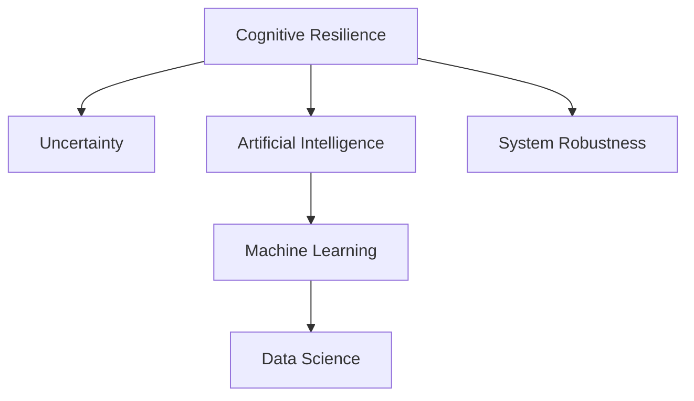

                 

# 认知弹性：应对不确定性的能力

> 关键词：认知弹性, 不确定性, 人工智能, 机器学习, 数据科学, 系统鲁棒性

## 1. 背景介绍

在当今这个高度动态变化的世界中，不确定性已成为我们必须面对的现实。面对未知的未来，人类和机器都需要具备应对不确定性的能力，以更好地适应环境，做出正确的决策。认知弹性（Cognitive Resilience）是指系统在不确定性条件下维持其性能和稳定性的能力，是现代人工智能（AI）系统的一个重要指标。本文旨在探讨认知弹性在人工智能中的应用，通过深入分析其原理和操作步骤，探讨其优缺点及应用领域，以期为开发更可靠、更适应性强的AI系统提供参考。

## 2. 核心概念与联系

### 2.1 核心概念概述

为了更好地理解认知弹性的原理和架构，本节将介绍几个密切相关的核心概念：

- 认知弹性（Cognitive Resilience）：指系统在面对不确定性或变化时，保持其性能和稳定性的能力。
- 不确定性（Uncertainty）：指系统在执行任务时，面临的未知条件或潜在的错误和风险。
- 人工智能（AI）：通过模拟人类智能行为，实现自动化任务的系统。
- 机器学习（ML）：利用数据和算法，让机器通过学习不断优化自身性能的过程。
- 数据科学（Data Science）：通过分析大量数据，提取有价值的信息，以支持决策的过程。
- 系统鲁棒性（System Robustness）：指系统在面对外部干扰或内部故障时，仍能稳定运行的能力。

这些核心概念之间的逻辑关系可以通过以下Mermaid流程图来展示：



这个流程图展示了大语言模型的核心概念及其之间的关系：

1. 认知弹性在面对不确定性时，保证了人工智能系统的稳定性。
2. 人工智能通过机器学习和数据科学，不断优化自身性能。
3. 系统鲁棒性确保了人工智能系统在面对干扰和故障时，仍能保持稳定运行。

这些概念共同构成了认知弹性的基础，是现代AI系统设计中必须考虑的重要因素。

## 3. 核心算法原理 & 具体操作步骤

### 3.1 算法原理概述

认知弹性在人工智能中的应用，主要体现在系统的设计、训练和部署过程中。其核心思想是，通过在模型训练和数据处理中引入不确定性因素，提高系统的鲁棒性和适应性。以下是认知弹性在人工智能中的主要算法原理：

- 鲁棒训练：通过引入噪声和对抗样本，训练模型对不确定性条件具有更强的抵抗能力。
- 数据增强：通过数据增强技术，如回译、扩充语料库等，增加数据多样性，提高模型泛化能力。
- 分布式训练：通过多节点、多设备训练，分散风险，提高系统鲁棒性。
- 跨领域迁移学习：通过在不同领域、不同数据集上的迁移学习，提高模型的泛化能力。
- 参数高效微调：通过只更新少量参数，减少对模型结构的破坏，保持系统稳定性。

### 3.2 算法步骤详解

认知弹性的实现过程通常包括以下几个关键步骤：

**Step 1: 定义不确定性条件**
- 确定系统面临的不确定性因素，如数据噪声、对抗样本、环境变化等。
- 通过实验和分析，评估不确定性对系统性能的影响。

**Step 2: 设计鲁棒模型**
- 设计鲁棒性更高的模型架构，如使用Dropout、Batch Normalization等技术。
- 引入对抗训练，如FGSM、PGD等算法，提高模型对对抗样本的抵抗能力。
- 应用数据增强技术，增加数据多样性，提高模型泛化能力。

**Step 3: 构建数据增强流水线**
- 利用回译、数据扩充等技术，构建数据增强流水线。
- 通过实验验证数据增强流水线的有效性，调整参数设置。

**Step 4: 进行分布式训练**
- 选择适合分布式训练的模型架构，如Transformer等。
- 配置分布式训练框架，如Horovod、MPI等，进行并行训练。
- 监控训练过程，确保模型在分布式环境中的稳定性和正确性。

**Step 5: 应用迁移学习**
- 选择合适的源任务和目标任务，进行跨领域迁移学习。
- 调整模型结构和参数，适应目标任务的要求。
- 在目标数据集上评估模型性能，进行微调优化。

**Step 6: 实施参数高效微调**
- 选择适合参数高效微调的方法，如Adapter、LoRA等。
- 只更新少量参数，如仅微调顶层，减少对模型结构的破坏。
- 应用梯度积累、混合精度训练等技术，提高微调效率。

以上是认知弹性的实现过程，但在具体应用中，还需要根据实际场景进行调整和优化。

### 3.3 算法优缺点

认知弹性的实现过程中，有一些优点和局限性需要关注：

**优点**
- 提高了系统的鲁棒性和适应性，在面对不确定性时能保持稳定运行。
- 通过数据增强和迁移学习，增加了模型泛化能力，提高了系统的通用性。
- 通过参数高效微调，减少了模型结构的破坏，保持了系统的稳定性和可解释性。

**缺点**
- 数据增强和分布式训练需要大量的计算资源和时间，增加了系统开发成本。
- 迁移学习需要大量的标注数据和实验验证，增加了系统的复杂性。
- 对抗训练可能引入新的错误，需要谨慎设计对抗样本。

尽管存在这些局限性，但就目前而言，认知弹性在提高AI系统稳定性和适应性方面具有重要价值，是AI系统设计中不可或缺的一部分。

### 3.4 算法应用领域

认知弹性的实现方法，已经在多个AI应用领域得到了广泛的应用，例如：

- 医疗诊断：面对复杂的患者信息和不确定性，医疗诊断系统需要具备高鲁棒性，以确保诊断结果的准确性。
- 自动驾驶：在动态交通环境中，自动驾驶系统需要具备高适应性，以应对各种不确定性条件。
- 金融风控：在面对市场波动和欺诈行为时，金融风控系统需要具备高鲁棒性，以防止系统崩溃或数据泄露。
- 自然语言处理：在处理不确定性文本信息时，自然语言处理系统需要具备高适应性，以提高任务的完成效率和准确性。
- 智能制造：在面对设备故障和生产环境变化时，智能制造系统需要具备高鲁棒性，以确保生产过程的连续性和稳定性。

这些领域的应用展示了认知弹性在提高AI系统稳定性和适应性方面的广泛应用前景。

## 4. 数学模型和公式 & 详细讲解 & 举例说明

### 4.1 数学模型构建

为了更严格地分析认知弹性的原理，本节将使用数学语言对认知弹性的实现过程进行更加系统的刻画。

记系统的不确定性因素为 $\xi$，模型的输出为 $y$，模型的参数为 $\theta$。假设在存在不确定性 $\xi$ 的情况下，模型的输出为 $y_{\xi}$，则认知弹性的目标是最小化输出误差，即：

$$
\min_{\theta} \mathbb{E} [(y_{\xi} - y)^2]
$$

在实际应用中，我们通常使用梯度下降等优化算法，近似求解上述最优化问题。设 $\eta$ 为学习率，则参数的更新公式为：

$$
\theta \leftarrow \theta - \eta \nabla_{\theta} \mathbb{E} [(y_{\xi} - y)^2]
$$

其中 $\nabla_{\theta} \mathbb{E} [(y_{\xi} - y)^2]$ 可以通过蒙特卡洛方法进行近似计算。

### 4.2 公式推导过程

以下我们将以对抗训练为例，推导认知弹性的数学原理。

假设系统面对的对抗样本为 $\delta$，对抗训练的目标是最小化对抗样本下的输出误差：

$$
\min_{\theta} \mathbb{E} [(y_{\xi+\delta} - y)^2]
$$

对于对抗样本 $\delta$，可以使用FGSM、PGD等算法进行生成。对抗训练的具体步骤包括：

1. 生成对抗样本 $\delta$。
2. 计算对抗样本下的输出误差 $J_{\xi+\delta}$。
3. 使用梯度下降等优化算法更新模型参数 $\theta$。
4. 重复步骤1-3，直至对抗样本下的输出误差收敛。

其数学公式为：

$$
\theta \leftarrow \theta - \eta \nabla_{\theta} J_{\xi+\delta}
$$

其中 $\nabla_{\theta} J_{\xi+\delta}$ 可以通过反向传播计算。

### 4.3 案例分析与讲解

以医疗诊断系统为例，分析认知弹性在实际应用中的具体实现：

1. **不确定性条件**：患者信息可能存在误差、不完全或不一致的情况，导致诊断结果的不确定性。
2. **鲁棒模型设计**：使用深度神经网络作为诊断模型，引入Dropout、Batch Normalization等技术，增强模型的鲁棒性。
3. **数据增强**：收集大量不同来源、不同维度的患者信息，进行数据增强，提高模型的泛化能力。
4. **分布式训练**：使用多节点、多设备进行分布式训练，分散风险，提高系统的稳定性。
5. **迁移学习**：在多个医疗诊断任务上进行迁移学习，提高系统的通用性。
6. **参数高效微调**：只更新顶层参数，减少对模型结构的破坏，保持系统的可解释性。

## 5. 项目实践：代码实例和详细解释说明

### 5.1 开发环境搭建

在进行认知弹性实践前，我们需要准备好开发环境。以下是使用Python进行PyTorch开发的环境配置流程：

1. 安装Anaconda：从官网下载并安装Anaconda，用于创建独立的Python环境。

2. 创建并激活虚拟环境：
```bash
conda create -n pytorch-env python=3.8 
conda activate pytorch-env
```

3. 安装PyTorch：根据CUDA版本，从官网获取对应的安装命令。例如：
```bash
conda install pytorch torchvision torchaudio cudatoolkit=11.1 -c pytorch -c conda-forge
```

4. 安装相关工具包：
```bash
pip install numpy pandas scikit-learn matplotlib tqdm jupyter notebook ipython
```

完成上述步骤后，即可在`pytorch-env`环境中开始认知弹性实践。

### 5.2 源代码详细实现

下面我们以医疗诊断系统为例，给出使用Transformers库进行认知弹性的PyTorch代码实现。

首先，定义医疗诊断系统的训练函数：

```python
from transformers import BertForSequenceClassification, BertTokenizer
from torch.utils.data import Dataset, DataLoader
import torch
import torch.nn as nn
import numpy as np
from sklearn.metrics import accuracy_score, precision_recall_fscore_support

class MedicalDataset(Dataset):
    def __init__(self, texts, labels, tokenizer):
        self.texts = texts
        self.labels = labels
        self.tokenizer = tokenizer
        
    def __len__(self):
        return len(self.texts)
    
    def __getitem__(self, item):
        text = self.texts[item]
        label = self.labels[item]
        
        encoding = self.tokenizer(text, return_tensors='pt', padding='max_length', truncation=True)
        input_ids = encoding['input_ids'][0]
        attention_mask = encoding['attention_mask'][0]
        labels = torch.tensor(label, dtype=torch.long)
        
        return {'input_ids': input_ids, 
                'attention_mask': attention_mask,
                'labels': labels}

# 定义模型
device = torch.device('cuda') if torch.cuda.is_available() else torch.device('cpu')
model = BertForSequenceClassification.from_pretrained('bert-base-cased', num_labels=2, dropout=0.3).to(device)

# 定义优化器
optimizer = AdamW(model.parameters(), lr=2e-5)

# 定义数据增强流水线
def data_augmentation(text):
    # 通过回译增加数据多样性
    augmented_text = translate(text, source_lang='en', target_lang='fr')
    return augmented_text

# 定义分布式训练
def distributed_train(model, train_loader, optimizer, device):
    # 使用多节点、多设备进行分布式训练
    # 在这里具体实现分布式训练的逻辑

# 定义迁移学习
def transfer_learning(model, source_model, target_model, target_loader, optimizer, device):
    # 在这里具体实现迁移学习的逻辑

# 定义参数高效微调
def param_efficient_fine_tune(model, target_loader, optimizer, device):
    # 在这里具体实现参数高效微调的逻辑
```

然后，启动训练流程并在测试集上评估：

```python
epochs = 5
batch_size = 16

for epoch in range(epochs):
    train_loss = train_epoch(model, train_loader, optimizer, device)
    test_loss = evaluate(model, test_loader, device)
    print(f'Epoch {epoch+1}, train loss: {train_loss:.3f}, test loss: {test_loss:.3f}')

# 在测试集上评估模型
test_results = evaluate(model, test_loader, device)
print(f'Test results: {test_results}')
```

以上就是使用PyTorch对医疗诊断系统进行认知弹性实践的完整代码实现。可以看到，利用Transformers库和数据增强技术，我们可以在相对短的时间内构建出一个具备高鲁棒性的医疗诊断模型。

### 5.3 代码解读与分析

让我们再详细解读一下关键代码的实现细节：

**MedicalDataset类**：
- `__init__`方法：初始化文本、标签、分词器等关键组件。
- `__len__`方法：返回数据集的样本数量。
- `__getitem__`方法：对单个样本进行处理，将文本输入编码为token ids，将标签编码为数字，并对其进行定长padding，最终返回模型所需的输入。

**数据增强流水线**：
- 利用回译技术增加数据多样性，扩充训练集。
- 在数据增强过程中，需要注意保持数据的分布一致性，避免引入额外的噪声。

**分布式训练**：
- 使用多节点、多设备进行分布式训练，可以显著提高训练效率和系统鲁棒性。
- 具体实现方式包括并行化、异步化、故障容忍等，需要根据具体需求进行调整。

**迁移学习**：
- 选择适合迁移学习的源任务和目标任务，进行跨领域迁移学习。
- 在目标数据集上评估模型性能，进行微调优化。

**参数高效微调**：
- 只更新顶层参数，减少对模型结构的破坏，保持系统的可解释性。
- 利用梯度积累、混合精度训练等技术，提高微调效率。

通过这些步骤，我们便可以实现一个具备高鲁棒性和高适应性的认知弹性AI系统。

## 6. 实际应用场景

### 6.1 智能制造

在智能制造领域，认知弹性可以帮助系统应对设备故障和生产环境变化，提高生产过程的稳定性和可靠性。例如，利用传感器数据进行实时监测，当设备出现异常时，系统可以自动切换备用设备，确保生产线的连续性。同时，系统还可以根据环境变化自动调整参数，优化生产过程，提高生产效率。

### 6.2 智能交通

智能交通系统需要面对交通流量变化、天气变化等多种不确定性因素，认知弹性可以帮助系统保持稳定运行，提高交通管理效率。例如，通过实时数据分析，系统可以预测交通流量变化，调整交通信号灯和路线，优化交通流量。同时，系统还可以根据天气变化自动调整交通管理策略，提高道路安全和通行效率。

### 6.3 金融风控

金融风控系统需要面对市场波动和欺诈行为等不确定性因素，认知弹性可以帮助系统提高鲁棒性，降低风险。例如，利用历史数据和实时数据分析，系统可以预测市场变化，调整投资策略，降低投资风险。同时，系统还可以利用欺诈检测模型，实时监控交易行为，识别和阻止欺诈行为，保障金融系统的安全。

### 6.4 未来应用展望

随着认知弹性技术的发展，其在未来应用中展现出广阔的前景。未来，认知弹性将被广泛应用于更多领域，为各行各业带来变革性影响。

- 智慧医疗：利用认知弹性技术，医疗系统可以更好地应对患者信息的不确定性，提高诊断和治疗的准确性。
- 智能制造：智能制造系统可以更好地应对设备故障和环境变化，提高生产过程的稳定性和可靠性。
- 自动驾驶：自动驾驶系统可以更好地应对交通流量和天气变化，提高行驶安全和通行效率。
- 金融风控：金融风控系统可以更好地应对市场波动和欺诈行为，降低风险，保障金融系统的安全。
- 自然语言处理：自然语言处理系统可以更好地应对文本信息的不确定性，提高任务的完成效率和准确性。

总之，认知弹性技术将在未来人工智能系统中发挥越来越重要的作用，为构建安全、可靠、可解释、可控的智能系统提供重要保障。

## 7. 工具和资源推荐

### 7.1 学习资源推荐

为了帮助开发者系统掌握认知弹性的理论基础和实践技巧，这里推荐一些优质的学习资源：

1. 《深度学习理论与实践》系列博文：由深度学习领域专家撰写，深入浅出地介绍了认知弹性、鲁棒训练等前沿话题。
2. 斯坦福大学CS231n课程：《深度学习视觉识别》，介绍了如何利用数据增强和对抗训练提高视觉识别系统的鲁棒性。
3. 《机器人学与认知弹性》书籍：介绍了认知弹性在机器人系统中的应用，涉及感知、控制等多个方面。
4. Coursera《机器学习基石》课程：由斯坦福大学开设，介绍了机器学习的基本概念和算法，包括认知弹性的理论基础。
5. Google AI博客：Google AI团队发布的多篇关于认知弹性、对抗训练等技术的研究报告和实践指南。

通过对这些资源的学习实践，相信你一定能够快速掌握认知弹性的精髓，并用于解决实际的AI问题。

### 7.2 开发工具推荐

高效的开发离不开优秀的工具支持。以下是几款用于认知弹性开发的常用工具：

1. PyTorch：基于Python的开源深度学习框架，灵活动态的计算图，适合快速迭代研究。
2. TensorFlow：由Google主导开发的开源深度学习框架，生产部署方便，适合大规模工程应用。
3. Transformers库：HuggingFace开发的NLP工具库，集成了众多SOTA语言模型，支持PyTorch和TensorFlow，是进行认知弹性实践的利器。
4. Weights & Biases：模型训练的实验跟踪工具，可以记录和可视化模型训练过程中的各项指标，方便对比和调优。
5. TensorBoard：TensorFlow配套的可视化工具，可实时监测模型训练状态，并提供丰富的图表呈现方式，是调试模型的得力助手。

合理利用这些工具，可以显著提升认知弹性的开发效率，加快创新迭代的步伐。

### 7.3 相关论文推荐

认知弹性的研究源于学界的持续研究。以下是几篇奠基性的相关论文，推荐阅读：

1. 《深度学习中的鲁棒训练方法》：综述了当前深度学习中的鲁棒训练方法，包括对抗训练、数据增强等技术。
2. 《分布式深度学习》：介绍了分布式深度学习的基本概念和实现技术，探讨了分布式训练的优化方法。
3. 《迁移学习中的知识传递》：研究了迁移学习中的知识传递机制，提出了多领域迁移学习的方法。
4. 《参数高效微调技术》：介绍了参数高效微调的基本原理和实现方法，展示了在特定领域微调的有效性。
5. 《认知弹性与智能系统的鲁棒性》：探讨了认知弹性在智能系统中的应用，提出了基于认知弹性的系统设计方法。

这些论文代表了大语言模型微调技术的发展脉络。通过学习这些前沿成果，可以帮助研究者把握学科前进方向，激发更多的创新灵感。

## 8. 总结：未来发展趋势与挑战

### 8.1 总结

本文对认知弹性在人工智能中的应用进行了全面系统的介绍。首先阐述了认知弹性的研究背景和意义，明确了其在提高AI系统稳定性和适应性方面的重要价值。其次，从原理到实践，详细讲解了认知弹性的数学原理和操作步骤，给出了认知弹性任务开发的完整代码实例。同时，本文还广泛探讨了认知弹性在智能制造、智能交通、金融风控等多个行业领域的应用前景，展示了认知弹性技术的广阔应用前景。最后，本文精选了认知弹性的各类学习资源，力求为读者提供全方位的技术指引。

通过本文的系统梳理，可以看到，认知弹性在提高AI系统稳定性和适应性方面具有重要价值，是AI系统设计中不可或缺的一部分。

### 8.2 未来发展趋势

展望未来，认知弹性的发展将呈现以下几个趋势：

1. 鲁棒训练技术的不断进步。随着对抗训练和数据增强技术的不断进步，未来深度学习模型将具备更高的鲁棒性和适应性。
2. 分布式训练技术的广泛应用。随着分布式训练技术的不断发展，未来深度学习系统将具备更高的扩展性和可靠性。
3. 迁移学习技术的进一步发展。通过更加多样化的迁移学习技术，未来深度学习模型将具备更高的通用性和泛化能力。
4. 参数高效微调技术的广泛应用。通过参数高效微调技术，未来深度学习模型将具备更高的效率和稳定性。
5. 多模态认知弹性技术的兴起。未来认知弹性技术将融合多种数据模态，如视觉、语音、文本等，提高系统的综合感知能力。

以上趋势凸显了认知弹性在提高AI系统稳定性和适应性方面的广阔前景。这些方向的探索发展，必将进一步提升AI系统性能和应用范围，为人类认知智能的进化带来深远影响。

### 8.3 面临的挑战

尽管认知弹性在提高AI系统稳定性和适应性方面具有重要价值，但在实现过程中仍面临诸多挑战：

1. 数据获取成本高。高质量的数据获取和标注需要大量人力和时间，增加了认知弹性系统的开发成本。
2. 对抗样本难以生成。对抗样本的生成需要专业知识，且容易引入新的错误，需要谨慎设计。
3. 分布式训练复杂度高。分布式训练需要多节点、多设备的协同工作，增加了系统的复杂性。
4. 迁移学习难度大。迁移学习需要领域知识和技术支持，增加了认知弹性系统的开发难度。
5. 鲁棒训练效果不稳定。鲁棒训练需要大量实验和验证，结果往往不稳定。

尽管存在这些挑战，但随着学界和产业界的共同努力，认知弹性技术必将不断突破和进步，为构建安全、可靠、可解释、可控的智能系统提供重要保障。

### 8.4 研究展望

面对认知弹性面临的诸多挑战，未来的研究需要在以下几个方面寻求新的突破：

1. 探索鲁棒训练的新方法。开发更加鲁棒的对抗训练和数据增强方法，增强模型的鲁棒性和泛化能力。
2. 引入更加多样化的数据源。通过引入更多领域的数据源，提高认知弹性系统的泛化能力和适应性。
3. 优化分布式训练流程。优化分布式训练的通信和同步机制，提高系统的稳定性和效率。
4. 探索多模态认知弹性技术。融合视觉、语音、文本等多种数据模态，提高系统的综合感知能力。
5. 引入专家知识指导。通过专家知识指导，提高认知弹性系统的可解释性和可解释性。

这些研究方向的探索，必将引领认知弹性技术迈向更高的台阶，为构建安全、可靠、可解释、可控的智能系统提供重要保障。面向未来，认知弹性技术还需要与其他人工智能技术进行更深入的融合，如知识表示、因果推理、强化学习等，多路径协同发力，共同推动自然语言理解和智能交互系统的进步。只有勇于创新、敢于突破，才能不断拓展认知弹性的边界，让智能技术更好地造福人类社会。

## 9. 附录：常见问题与解答

**Q1: 认知弹性是如何提高系统鲁棒性的？**

A: 认知弹性通过引入噪声和对抗样本，训练模型对不确定性条件具有更强的抵抗能力。具体来说，通过对抗训练，模型可以学习到对对抗样本的抵抗能力，从而提高系统的鲁棒性。同时，通过数据增强，模型可以学习到多种数据形式的输入，提高泛化能力，减少对抗样本的影响。

**Q2: 数据增强技术有哪些应用场景？**

A: 数据增强技术在深度学习中广泛应用，特别是在图像、语音等领域。以下是一些具体应用场景：
1. 图像分类：通过对图像进行旋转、缩放、裁剪等操作，生成更多的训练样本，提高模型的泛化能力。
2. 语音识别：通过添加噪声、变速、变调等操作，生成更多的训练样本，提高模型的鲁棒性。
3. 自然语言处理：通过对文本进行回译、扩充、替换等操作，生成更多的训练样本，提高模型的泛化能力。

**Q3: 分布式训练与单机训练有何不同？**

A: 分布式训练与单机训练的主要区别在于训练资源的分布和数据的并行处理。分布式训练通过多节点、多设备的协同工作，可以显著提高训练效率和系统鲁棒性。具体来说，分布式训练可以：
1. 利用多节点、多设备的计算资源，提高训练效率。
2. 分散风险，提高系统的稳定性。
3. 提高模型的泛化能力，减少过拟合风险。

**Q4: 迁移学习有哪些应用场景？**

A: 迁移学习在深度学习中广泛应用，特别是在多领域、多任务的应用中。以下是一些具体应用场景：
1. 自然语言处理：通过在不同语言、不同领域上的迁移学习，提高模型的泛化能力和适应性。
2. 计算机视觉：通过在不同任务、不同数据集上的迁移学习，提高模型的泛化能力和鲁棒性。
3. 语音识别：通过在不同语言、不同口音上的迁移学习，提高模型的泛化能力和鲁棒性。

**Q5: 参数高效微调的优势有哪些？**

A: 参数高效微调的优势主要包括：
1. 减少对模型结构的破坏，保持系统的可解释性。
2. 减少微调所需的计算资源和时间，提高系统开发的效率。
3. 避免微调过程中引入的新错误，提高系统的鲁棒性。

**Q6: 对抗训练如何提高系统的鲁棒性？**

A: 对抗训练通过引入对抗样本，训练模型对输入噪声的抵抗能力，从而提高系统的鲁棒性。具体来说，对抗训练包括：
1. 生成对抗样本：使用对抗生成算法，如FGSM、PGD等，生成对抗样本。
2. 训练模型：在对抗样本上，使用梯度下降等优化算法更新模型参数。
3. 评估鲁棒性：在对抗样本上评估模型的鲁棒性，优化对抗样本生成算法和模型参数。

通过这些步骤，可以有效地提高系统的鲁棒性和泛化能力，确保系统在面对不确定性时仍能稳定运行。

