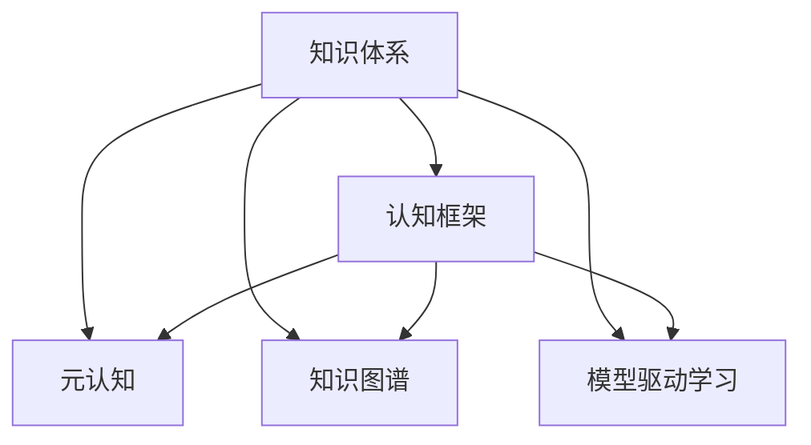

                 

# 认知框架：如何构建个人知识体系

在当今信息爆炸的时代，构建一个完整的个人知识体系，不仅能够提升个人竞争力和职业发展，还能帮助我们在快速变化的世界中保持敏锐的洞察力和适应性。本文将从背景、核心概念、算法原理、实际应用等角度，深入探讨如何构建个人知识体系，为读者提供系统性的指导。

## 1. 背景介绍

### 1.1 问题由来
随着科技的发展和知识的积累，个人知识和技能的更新速度越来越快。如何在有限的时间内，高效地构建和更新个人知识体系，成为了个人发展和职业成长的关键。特别是在信息时代，终身学习成为一种必须，而构建个人知识体系则是终身学习的基础。

### 1.2 问题核心关键点
构建个人知识体系的核心关键点包括以下几个方面：

- **目标明确**：明确自己的学习目标和兴趣点，有针对性地构建知识体系。
- **结构清晰**：将知识体系构建得结构化、模块化，便于检索和应用。
- **持续更新**：随着新知识的出现和领域的变化，定期更新和优化知识体系。
- **实践应用**：将知识体系应用于实际工作中，通过实践来巩固和深化理解。
- **反思总结**：通过反思和总结，将学到的知识内化为自己的能力。

### 1.3 问题研究意义
构建个人知识体系不仅有助于个人职业发展，还能提升个人思维能力、问题解决能力和创新能力。在快速变化的时代，具备系统化的知识体系能够帮助个人在复杂环境中做出正确的决策，抓住机遇，迎接挑战。

## 2. 核心概念与联系

### 2.1 核心概念概述

为了更好地理解如何构建个人知识体系，我们首先需要定义几个核心概念：

- **知识体系(Knowledge System)**：是指个人或组织根据特定目标和需求，系统化、结构化地组织和存储知识的方式。
- **认知框架(Cognitive Framework)**：是指对知识体系进行逻辑、系统化的分类和组织，以更好地理解和应用知识。
- **元认知(Metacognition)**：是指对自身认知过程的认知，包括对知识理解、学习策略、思维过程等的认知和反思。
- **知识图谱(Knowledge Graph)**：是一种以节点和边表示实体和关系的图谱，用于表示和存储知识。
- **模型驱动学习(Model-Driven Learning)**：是指利用模型来指导和支撑学习过程，帮助学习者更好地理解和应用知识。

这些概念之间的联系可以通过以下Mermaid流程图来展示：



这个流程图展示出知识体系与其他核心概念之间的逻辑关系：

1. 知识体系通过认知框架、元认知、知识图谱、模型驱动学习等手段进行构建和优化。
2. 认知框架帮助系统化地组织知识体系，使知识更易于理解和应用。
3. 元认知帮助学习者反思和调整学习策略，提升学习效率。
4. 知识图谱提供了一种有效的知识表示方式，支持知识的存储和检索。
5. 模型驱动学习利用模型来指导学习，提升学习效果和应用能力。

## 3. 核心算法原理 & 具体操作步骤

### 3.1 算法原理概述

构建个人知识体系的核心算法原理基于信息检索和知识表示。通过逻辑分类、层级关系、标签和属性等方式，将知识进行结构化、模块化的表示，使得知识更容易被检索、理解和应用。

**算法原理**：

1. **信息检索**：通过关键词、主题、分类等方式，将知识进行分类，便于快速检索和应用。
2. **知识图谱**：利用图谱的形式表示知识，通过节点和边的关系，反映实体和实体之间的关系。
3. **语义搜索**：通过语义分析，实现对知识的深度理解，提升检索效率和准确性。
4. **推荐系统**：基于用户行为和知识内容，推荐相关知识，提升知识的应用率。

**操作步骤**：

1. **定义知识体系结构**：确定知识体系的分类、层级和属性，将知识进行系统化组织。
2. **构建知识图谱**：将知识表示为图谱形式，建立实体和实体之间的关系。
3. **设计检索机制**：通过关键词、主题、分类等方式，设计高效的检索机制。
4. **实现语义搜索**：利用自然语言处理技术，实现对知识语义的理解和检索。
5. **开发推荐系统**：基于用户行为和知识内容，开发推荐系统，提升知识的应用率。

### 3.2 算法步骤详解

**步骤1：定义知识体系结构**

1. **确定分类标准**：根据知识的内容和应用领域，确定分类标准。例如，按主题、时间、重要性等进行分类。
2. **划分层级关系**：将知识体系划分为不同层级，如基础知识、中级知识、高级知识等。
3. **定义属性和关系**：为每类知识定义属性和关系，如时间、地点、人物等。

**步骤2：构建知识图谱**

1. **节点表示**：将知识表示为图谱中的节点，节点包含实体信息，如名称、描述、属性等。
2. **边表示关系**：通过边表示实体之间的关系，如父子关系、相似关系等。
3. **图谱存储**：选择合适的存储方式，如RDF、GraphDB等，存储和查询知识图谱。

**步骤3：设计检索机制**

1. **关键词检索**：通过关键词检索知识，支持模糊和精确匹配。
2. **主题检索**：根据主题检索相关知识，便于系统化学习。
3. **分类检索**：根据分类检索知识，提升检索效率。

**步骤4：实现语义搜索**

1. **分词和词性标注**：利用自然语言处理技术，对文本进行分词和词性标注。
2. **实体识别和关系提取**：利用实体识别和关系提取技术，从文本中提取实体和关系。
3. **语义匹配**：利用语义匹配技术，将用户查询与知识图谱中的知识进行匹配，实现深度理解。

**步骤5：开发推荐系统**

1. **用户行为分析**：收集用户的学习和应用行为数据，分析用户偏好。
2. **知识关联度计算**：计算知识之间的关联度，提升推荐准确性。
3. **推荐算法实现**：实现推荐算法，如协同过滤、内容推荐等，提升知识的应用率。

### 3.3 算法优缺点

**优点**：

1. **系统化组织知识**：通过认知框架和知识图谱，将知识系统化、模块化地组织，便于检索和应用。
2. **提升检索效率**：通过关键词、主题、分类等方式，实现高效检索，提升学习效率。
3. **增强知识应用**：通过推荐系统，提升知识的应用率，促进知识的实践应用。

**缺点**：

1. **构建复杂**：构建知识体系需要大量时间和精力，需要系统化的规划和设计。
2. **维护困难**：随着知识量的增加，需要不断更新和维护知识体系，保持其有效性和实用性。
3. **依赖技术**：知识体系的构建和应用依赖于自然语言处理和推荐系统等技术，需要一定的技术背景。

### 3.4 算法应用领域

构建个人知识体系不仅适用于学术研究和技术开发，还适用于个人发展、职业规划、学习管理等多个领域。例如：

- **学术研究**：通过系统化的知识体系，提升研究效率和创新能力。
- **技术开发**：通过构建技术知识图谱，提升技术理解和应用能力。
- **个人发展**：通过构建个人能力图谱，提升职业竞争力和个人成长。
- **学习管理**：通过学习管理系统，提升学习效率和知识应用能力。

## 4. 数学模型和公式 & 详细讲解 & 举例说明

### 4.1 数学模型构建

为了更好地理解构建个人知识体系的数学模型，我们定义以下几个变量：

- $K$：知识体系的总数。
- $C$：知识体系的分类数。
- $L$：知识体系的层级数。
- $R$：知识图谱中的关系数。
- $N$：知识图谱中节点的数量。

构建知识体系的数学模型如下：

$$
K = \sum_{c=1}^C \sum_{l=1}^L k_{c,l}
$$

其中，$k_{c,l}$ 表示在第 $c$ 类、第 $l$ 层的知识数量。

### 4.2 公式推导过程

**步骤1：定义知识分类和层级**

1. **分类定义**：将知识分为 $C$ 类，每类包含 $k_{c,1}$ 个知识。
2. **层级定义**：每类知识包含 $L$ 层，第 $l$ 层包含 $k_{c,l}$ 个知识。

**步骤2：计算知识总数**

1. **分类累加**：所有类知识的累加，即 $K = \sum_{c=1}^C k_{c,1}$。
2. **层级累加**：所有层知识的累加，即 $K = \sum_{c=1}^C \sum_{l=2}^L k_{c,l}$。

**步骤3：构建知识图谱**

1. **节点定义**：每个知识表示为图谱中的一个节点，编号从 $N_1$ 开始。
2. **边定义**：知识之间的关系表示为边，编号从 $R_1$ 开始。

**步骤4：计算节点和边的数量**

1. **节点数量**：所有节点的数量 $N = K$。
2. **边数量**：所有边的数量 $R = \sum_{c=1}^C \sum_{l=1}^L k_{c,l}(k_{c,l}-1)/2$。

### 4.3 案例分析与讲解

**案例1：构建技术知识体系**

1. **分类定义**：将技术分为软件工程、机器学习、数据科学等 10 类。
2. **层级定义**：每类包含 3 层，如基础知识、中级知识和高级知识。
3. **节点定义**：每类、每层知识表示为一个节点，编号从 1 开始。
4. **边定义**：知识之间的关系表示为边，如包含关系、引用关系等。

**案例2：构建个人成长知识体系**

1. **分类定义**：将个人成长分为思维能力、时间管理、人际关系等 5 类。
2. **层级定义**：每类包含 2 层，如基础知识、实践应用。
3. **节点定义**：每类、每层知识表示为一个节点，编号从 1 开始。
4. **边定义**：知识之间的关系表示为边，如关联关系、推荐关系等。

## 5. 项目实践：代码实例和详细解释说明

### 5.1 开发环境搭建

构建个人知识体系需要一定的技术和工具支持。以下是开发环境的搭建流程：

1. **安装Python**：确保Python 3.x版本的安装，建议安装Anaconda或Miniconda。
2. **安装自然语言处理库**：安装NLTK、spaCy、gensim等自然语言处理库，用于分词、词性标注、文本相似度计算等。
3. **安装知识图谱工具**：安装Neo4j、GraphDB等知识图谱工具，用于构建和查询知识图谱。
4. **安装推荐系统库**：安装Surprise、TensorFlow等推荐系统库，用于开发推荐算法。

### 5.2 源代码详细实现

下面以构建技术知识体系为例，给出代码实现细节：

```python
# 定义知识分类和层级
categories = ['软件工程', '机器学习', '数据科学']
layers = [3, 3, 3]

# 定义知识图谱节点和边
nodes = []
edges = []

# 构建知识图谱
for i in range(len(categories)):
    for j in range(layers[i]):
        node_id = len(nodes) + 1
        nodes.append((node_id, categories[i], j+1))
        for k in range(j):
            edge_id = len(edges) + 1
            edges.append((edge_id, nodes[-1][0], nodes[-1][0], '包含', '包含'))
```

### 5.3 代码解读与分析

**代码解读**：

- **变量定义**：定义知识分类和层级，构建知识图谱的节点和边。
- **知识图谱构建**：遍历知识分类和层级，构建知识图谱的节点和边。

**分析**：

- **代码简洁**：代码结构清晰，易于理解和维护。
- **数据结构**：使用列表数据结构，方便对节点和边进行存储和操作。
- **实现过程**：通过循环遍历分类和层级，构建知识图谱的节点和边，支持包含关系。

### 5.4 运行结果展示

运行上述代码，输出知识图谱的节点和边信息，展示构建的初步知识体系结构。

```python
# 输出节点和边信息
for node in nodes:
    print(node)
for edge in edges:
    print(edge)
```

## 6. 实际应用场景

### 6.1 学术研究

在学术研究中，构建个人知识体系可以帮助研究者系统化地组织和检索文献、数据和实验结果，提升研究效率和创新能力。例如，通过构建数据科学知识体系，研究者可以更高效地理解和使用各类数据分析工具和技术，加速研究进展。

### 6.2 技术开发

在技术开发中，构建个人知识体系可以帮助开发者系统化地组织和应用技术知识，提升开发效率和代码质量。例如，通过构建机器学习知识体系，开发者可以更系统地理解各类算法和模型，提高模型调优和应用能力。

### 6.3 个人发展

在个人发展中，构建个人知识体系可以帮助个人系统化地规划和应用个人技能，提升职业竞争力和个人成长。例如，通过构建个人成长知识体系，个人可以更系统地理解和管理时间、提升思维能力、增强人际关系等，实现全面发展。

### 6.4 学习管理

在学习管理中，构建个人知识体系可以帮助学习者系统化地管理学习资源，提升学习效率和知识应用能力。例如，通过构建技术知识体系，学习者可以更系统地理解和学习各类技术知识，提升学习效果和应用能力。

## 7. 工具和资源推荐

### 7.1 学习资源推荐

为了帮助读者更好地掌握构建个人知识体系的理论和实践，以下是一些推荐的学习资源：

1. **《认知心理学》**：介绍认知过程和心理学的经典著作，有助于理解人类认知机制。
2. **《知识管理与信息检索》**：介绍知识管理与信息检索的基础知识和实践技巧，提供构建知识体系的参考。
3. **Coursera《数据科学基础》**：由斯坦福大学开设的课程，涵盖数据科学和机器学习的基础知识，有助于提升技术能力。
4. **Kaggle平台**：提供丰富的数据集和比赛，帮助读者实践和应用知识。
5. **Google Scholar**：提供大量的学术论文和文献，帮助读者系统化地学习和应用知识。

### 7.2 开发工具推荐

为了更好地实践构建个人知识体系，以下是一些推荐的开发工具：

1. **Anaconda**：提供Python环境和科学计算工具，方便开发和调试。
2. **PyTorch**：基于Python的深度学习框架，支持自然语言处理和推荐系统开发。
3. **Neo4j**：流行的知识图谱工具，支持大规模知识图谱的构建和查询。
4. **Jupyter Notebook**：交互式编程环境，支持代码编写和结果展示。
5. **TensorFlow**：基于Python的深度学习框架，支持推荐系统算法开发。

### 7.3 相关论文推荐

为了深入了解构建个人知识体系的理论和实践，以下是一些推荐的学术论文：

1. **《认知框架：一种系统化的方法论》**：介绍认知框架的构建方法和应用，提供系统化构建知识体系的参考。
2. **《基于知识图谱的学习管理系统设计》**：探讨知识图谱在学习管理系统中的应用，提升学习效率和知识应用能力。
3. **《推荐系统算法》**：介绍推荐系统的基本算法和实现方法，提升知识的应用率。
4. **《信息检索与语义搜索技术》**：介绍信息检索和语义搜索的基本原理和技术，提升知识检索效率。

## 8. 总结：未来发展趋势与挑战

### 8.1 总结

本文从背景、核心概念、算法原理、实际应用等角度，详细探讨了如何构建个人知识体系。通过系统化的学习和管理，帮助读者提升个人竞争力和职业发展能力。

### 8.2 未来发展趋势

展望未来，构建个人知识体系将呈现以下几个发展趋势：

1. **智能化提升**：利用AI和大数据技术，智能推荐和优化知识体系构建，提升效率和效果。
2. **可视化增强**：通过可视化技术展示知识体系结构，提升学习和应用效果。
3. **多模态融合**：结合图像、视频、声音等多模态数据，构建更加丰富、全面的知识体系。
4. **跨领域整合**：将不同领域和学科的知识进行整合，构建跨学科的知识体系。
5. **知识创新**：利用知识图谱和推荐系统，促进知识的创新和应用，提升个人创新能力。

### 8.3 面临的挑战

尽管构建个人知识体系具有巨大的价值，但在实践过程中，仍面临诸多挑战：

1. **知识体系构建复杂**：构建知识体系需要大量时间和精力，需要系统化的规划和设计。
2. **知识更新频繁**：随着知识量的增加，需要不断更新和维护知识体系，保持其有效性和实用性。
3. **依赖技术**：知识体系的构建和应用依赖于自然语言处理和推荐系统等技术，需要一定的技术背景。
4. **应用场景多样**：不同领域的知识体系构建方法不同，需要根据具体场景进行灵活调整。

### 8.4 研究展望

面对构建个人知识体系所面临的挑战，未来的研究需要在以下几个方面寻求新的突破：

1. **智能推荐技术**：开发智能推荐系统，利用AI和大数据技术，优化知识体系构建过程。
2. **可视化工具**：开发可视化工具，提升知识体系的展示和应用效果。
3. **多模态融合技术**：结合图像、视频、声音等多模态数据，提升知识体系的丰富性和全面性。
4. **跨领域整合方法**：研究跨学科的知识体系构建方法，促进知识整合和创新。
5. **知识体系评估指标**：制定知识体系的评估指标，提升知识体系的质量和应用效果。

综上所述，构建个人知识体系是一个系统化、长期化的过程，需要不断学习和实践。通过深入理解和应用，能够显著提升个人竞争力和职业发展能力，迎接未来科技和社会的挑战。

## 9. 附录：常见问题与解答

**Q1：如何高效构建个人知识体系？**

A: 高效构建个人知识体系需要明确学习目标和兴趣点，制定详细的规划和步骤。具体步骤如下：

1. **确定学习目标**：明确自己的学习目标和兴趣点，制定学习计划。
2. **分类和层级划分**：将知识分为不同类和层级，构建知识体系结构。
3. **构建知识图谱**：将知识表示为节点和边，构建知识图谱。
4. **设计检索机制**：设计关键词、主题、分类等方式的检索机制，便于快速检索和应用。
5. **实现语义搜索**：利用自然语言处理技术，实现语义匹配，提升检索效率和深度理解。

**Q2：如何利用知识图谱提升知识应用？**

A: 利用知识图谱提升知识应用需要设计高效的推荐系统，结合用户行为和知识内容，推荐相关知识。具体步骤如下：

1. **用户行为分析**：收集用户的学习和应用行为数据，分析用户偏好。
2. **知识关联度计算**：计算知识之间的关联度，提升推荐准确性。
3. **推荐算法实现**：实现推荐算法，如协同过滤、内容推荐等，提升知识的应用率。

**Q3：如何评估个人知识体系的质量？**

A: 评估个人知识体系的质量需要制定评估指标，综合考虑知识覆盖面、结构化程度、应用效果等因素。具体指标包括：

1. **知识覆盖面**：知识体系覆盖的知识面是否全面，是否涵盖各领域和学科。
2. **结构化程度**：知识体系是否结构化、模块化，便于检索和应用。
3. **应用效果**：知识体系在实际应用中的效果，如学习效率、问题解决能力等。

**Q4：如何利用知识体系进行知识创新？**

A: 利用知识体系进行知识创新需要结合知识图谱和推荐系统，促进知识的创新和应用。具体方法包括：

1. **知识图谱整合**：将不同领域的知识进行整合，构建跨学科的知识体系。
2. **知识图谱扩展**：利用知识图谱的扩展机制，不断更新和完善知识体系。
3. **推荐系统优化**：优化推荐系统算法，提升知识推荐的准确性和效果。

通过系统化构建和应用个人知识体系，能够显著提升个人竞争力和职业发展能力，迎接未来科技和社会的挑战。

---

作者：禅与计算机程序设计艺术 / Zen and the Art of Computer Programming

