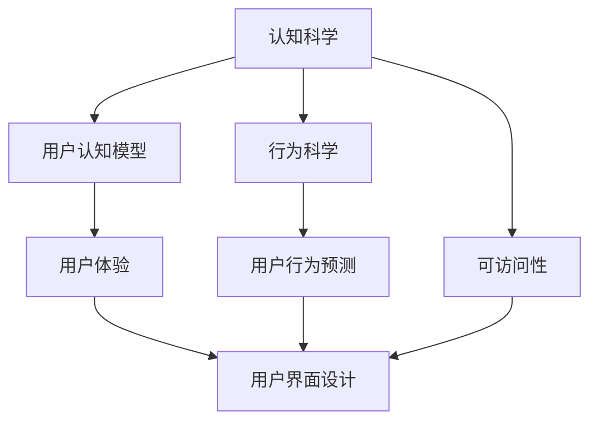

                 

# 认知科学与用户界面设计：优化人机交互

> 关键词：认知科学, 用户界面设计, 优化人机交互, 行为科学, 用户体验, 可访问性

## 1. 背景介绍

### 1.1 问题由来

随着人工智能技术的飞速发展，人机交互界面设计已经成为实现高效、便捷、个性化用户互动的关键。然而，传统的用户界面设计往往基于直觉和经验，缺乏对用户认知机制的深入理解。近年来，认知科学的研究成果逐步应用于人机交互领域，使得界面设计更加科学、合理，用户体验显著提升。

### 1.2 问题核心关键点

认知科学与用户界面设计的融合，主要围绕以下几个关键点展开：

- **用户认知模型**：如何理解和建模用户认知机制，包括感知、记忆、学习、动机等，为用户提供更符合心理预期的界面。
- **用户行为预测**：基于认知模型，预测用户在不同情境下的行为，实现更加精准和高效的界面设计。
- **人机交互优化**：通过设计符合用户认知规律的界面元素和交互流程，提升用户满意度和操作效率。
- **可访问性**：界面设计不仅服务于主流用户，还应考虑残障用户的需求，实现无障碍设计。

### 1.3 问题研究意义

认知科学与用户界面设计的融合，对于提升人机交互效率和用户体验，具有重要意义：

1. **提高用户满意度**：通过了解用户认知机制，设计更加符合用户心理的界面，显著提升用户的使用体验。
2. **降低用户学习成本**：认知模型指导下的界面设计，使新用户能够更快速地上手，减少学习成本。
3. **增强系统可访问性**：确保界面设计符合不同用户的需求，提升系统的可访问性和普适性。
4. **促进用户粘性**：符合用户认知规律的界面，能更好地满足用户的心理预期，增强用户粘性，提升用户忠诚度。
5. **推动创新发展**：认知科学与用户体验研究的不断进步，为人机交互带来更多创新灵感，推动技术进步和产业升级。

## 2. 核心概念与联系

### 2.1 核心概念概述

为更好地理解认知科学与用户界面设计的融合，本节将介绍几个密切相关的核心概念：

- **认知科学**：研究人类认知过程和机制的科学，包括感知、记忆、学习、决策等方面。
- **用户界面设计**：界面设计师通过布局、色彩、交互元素等手段，构建直观、易用、美观的视觉界面，提升用户体验。
- **用户认知模型**：基于认知科学研究成果，构建的用于预测和解释用户行为的心理模型。
- **行为科学**：研究人类行为规律和心理动机的科学，为用户提供行为引导的界面设计。
- **用户体验**：用户在使用产品过程中产生的感知和情感体验，包括易用性、满意度、认知负荷等。
- **可访问性**：确保产品和服务对所有用户（包括残障人士）都友好、易用，实现普适设计。

这些核心概念之间的逻辑关系可以通过以下Mermaid流程图来展示：



这个流程图展示了几大核心概念之间的联系：

1. 认知科学提供理论基础，用户认知模型和行为科学基于此构建。
2. 用户认知模型和行为科学指导用户体验设计，用户体验设计进一步影响界面设计。
3. 可访问性作为界面设计的重要准则，确保设计普适和包容。

## 3. 核心算法原理 & 具体操作步骤
### 3.1 算法原理概述

认知科学与用户界面设计的融合，主要基于用户认知模型和行为科学，通过算法预测用户行为，优化界面设计。核心算法包括：

- **用户认知模型预测**：基于用户认知机制，预测用户在不同情境下的行为反应。
- **行为引导设计**：通过界面设计引导用户行为，减少认知负荷，提升交互效率。
- **交互优化算法**：通过迭代优化，提升界面设计的有效性。

### 3.2 算法步骤详解

认知科学与用户界面设计的融合主要包括以下几个关键步骤：

**Step 1: 构建用户认知模型**

1. 收集用户行为数据。通过可用性测试、用户访谈等手段，收集用户在使用产品过程中的行为数据。
2. 分析用户认知机制。基于认知科学理论，构建用户认知模型，描述用户感知、记忆、动机等认知过程。
3. 模型训练。使用机器学习算法（如决策树、随机森林、神经网络等），对用户行为数据进行建模，训练得到用户认知模型。

**Step 2: 设计用户界面**

1. 基于用户认知模型，设计界面元素和交互流程。确保界面元素符合用户认知模型，减少用户认知负荷。
2. 引入行为引导设计。通过界面颜色、图标、布局等方式，引导用户完成任务，减少错误操作。
3. 考虑可访问性。确保界面设计符合WCAG（Web Content Accessibility Guidelines）等国际标准，考虑残障用户需求。

**Step 3: 用户行为预测与优化**

1. 预测用户行为。将用户认知模型应用到界面设计中，预测用户在不同情境下的行为。
2. 行为引导优化。根据预测结果，对界面设计进行优化，提升用户操作效率和满意度。
3. 迭代优化。通过不断的可用性测试和用户反馈，迭代优化界面设计，提升用户体验。

### 3.3 算法优缺点

认知科学与用户界面设计的融合具有以下优点：

1. **提升用户体验**：通过认知模型预测用户行为，设计更加符合用户认知规律的界面，显著提升用户体验。
2. **降低学习成本**：符合用户认知规律的界面设计，使得新用户能够快速上手，减少学习成本。
3. **增强可访问性**：确保界面设计符合WCAG等国际标准，提升普适性和可访问性。
4. **促进创新发展**：认知科学与用户体验研究的不断进步，为人机交互带来更多创新灵感，推动技术进步和产业升级。

同时，该方法也存在一定的局限性：

1. **数据需求较高**：构建用户认知模型需要大量用户行为数据，数据收集和处理成本较高。
2. **模型复杂度**：认知模型的构建和训练复杂度较高，需要专业知识和技术支持。
3. **适用性有限**：模型预测结果可能存在偏差，不适用于所有用户和场景。
4. **迭代周期长**：界面设计的优化和迭代过程较长，可能影响产品上市时间。

尽管存在这些局限性，但就目前而言，认知科学与用户界面设计的融合是大趋势，具有广阔的应用前景。未来相关研究的重点在于如何进一步降低数据和模型的复杂度，提高适用的普适性，缩短迭代周期。

### 3.4 算法应用领域

认知科学与用户界面设计的融合方法，已经在许多领域得到了广泛的应用，例如：

- **移动应用**：优化移动应用的界面设计，提升用户操作体验，降低学习成本。
- **网站设计**：提升网站的用户体验，优化页面加载速度，提高用户转化率。
- **游戏设计**：设计符合用户认知规律的游戏界面，提升游戏可玩性和用户粘性。
- **智能家居**：设计用户友好的智能家居控制界面，提升家居设备的操作效率和便捷性。
- **医疗健康**：设计符合医生认知规律的医疗界面，提升医疗系统的效率和安全性。
- **教育和培训**：设计符合学习者认知规律的教育培训界面，提升学习效果和用户满意度。

## 4. 数学模型和公式 & 详细讲解  
### 4.1 数学模型构建

本节将使用数学语言对认知科学与用户界面设计的融合过程进行更加严格的刻画。

记用户行为数据集为 $D=\{(x_i,y_i)\}_{i=1}^N$，其中 $x_i$ 表示用户行为数据，$y_i$ 表示用户行为结果。用户认知模型为 $M$，其预测结果为 $M(x_i)$。

定义模型 $M$ 在数据集 $D$ 上的误差为：

$$
E(M) = \frac{1}{N}\sum_{i=1}^N (y_i - M(x_i))^2
$$

认知模型训练的目标是最小化误差 $E(M)$，即找到最优模型参数 $\theta$：

$$
\theta^* = \mathop{\arg\min}_{\theta} E(M)
$$

在实践中，我们通常使用梯度下降等优化算法来近似求解上述最优化问题。设 $\eta$ 为学习率，则参数的更新公式为：

$$
\theta \leftarrow \theta - \eta \nabla_{\theta}E(M)
$$

其中 $\nabla_{\theta}E(M)$ 为误差函数对模型参数 $\theta$ 的梯度，可通过反向传播算法高效计算。

### 4.2 公式推导过程

以下我们以用户行为预测为例，推导误差函数的计算公式。

记用户行为数据集为 $D=\{(x_i,y_i)\}_{i=1}^N$，其中 $x_i$ 表示用户行为数据，$y_i$ 表示用户行为结果。假设认知模型为线性回归模型，其预测结果为 $M(x_i) = \theta^T x_i$，其中 $\theta$ 为模型参数。

定义模型 $M$ 在数据集 $D$ 上的误差为：

$$
E(M) = \frac{1}{N}\sum_{i=1}^N (y_i - M(x_i))^2 = \frac{1}{N}\sum_{i=1}^N (y_i - \theta^T x_i)^2
$$

通过链式法则，误差函数对模型参数 $\theta$ 的梯度为：

$$
\frac{\partial E(M)}{\partial \theta} = \frac{1}{N}\sum_{i=1}^N -2(y_i - M(x_i))x_i
$$

在得到误差函数的梯度后，即可带入参数更新公式，完成模型的迭代优化。重复上述过程直至收敛，最终得到适应用户认知规律的认知模型参数 $\theta^*$。

## 5. 项目实践：代码实例和详细解释说明
### 5.1 开发环境搭建

在进行用户界面设计优化实践前，我们需要准备好开发环境。以下是使用Python进行PyTorch开发的环境配置流程：

1. 安装Anaconda：从官网下载并安装Anaconda，用于创建独立的Python环境。

2. 创建并激活虚拟环境：
```bash
conda create -n pytorch-env python=3.8 
conda activate pytorch-env
```

3. 安装PyTorch：根据CUDA版本，从官网获取对应的安装命令。例如：
```bash
conda install pytorch torchvision torchaudio cudatoolkit=11.1 -c pytorch -c conda-forge
```

4. 安装TensorFlow：
```bash
conda install tensorflow
```

5. 安装TensorBoard：
```bash
pip install tensorboard
```

完成上述步骤后，即可在`pytorch-env`环境中开始用户界面设计优化的实践。

### 5.2 源代码详细实现

下面我们以移动应用为例，给出使用TensorFlow进行用户行为预测的PyTorch代码实现。

首先，定义用户行为数据集和认知模型：

```python
import tensorflow as tf
import numpy as np

# 假设用户行为数据集
x_data = np.random.randn(1000, 5)
y_data = np.random.randint(2, size=(1000, 1))

# 定义认知模型
model = tf.keras.Sequential([
    tf.keras.layers.Dense(10, activation='relu', input_shape=(5,)),
    tf.keras.layers.Dense(1, activation='sigmoid')
])

# 定义损失函数
loss_fn = tf.keras.losses.BinaryCrossentropy(from_logits=True)

# 定义优化器
optimizer = tf.keras.optimizers.Adam(learning_rate=0.001)
```

接着，定义训练和评估函数：

```python
# 定义训练函数
def train_epoch(model, x_data, y_data, batch_size, optimizer, loss_fn):
    x_batch, y_batch = x_data[:batch_size], y_data[:batch_size]
    with tf.GradientTape() as tape:
        y_pred = model(x_batch)
        loss = loss_fn(y_pred, y_batch)
    gradients = tape.gradient(loss, model.trainable_variables)
    optimizer.apply_gradients(zip(gradients, model.trainable_variables))

# 定义评估函数
def evaluate(model, x_data, y_data, batch_size, loss_fn):
    x_batch, y_batch = x_data[:batch_size], y_data[:batch_size]
    y_pred = model(x_batch)
    loss = loss_fn(y_pred, y_batch)
    return loss.numpy()
```

最后，启动训练流程并在测试集上评估：

```python
epochs = 10
batch_size = 32

for epoch in range(epochs):
    train_epoch(model, x_data, y_data, batch_size, optimizer, loss_fn)
    print(f"Epoch {epoch+1}, training loss: {evaluate(model, x_data, y_data, batch_size, loss_fn)}")
    
print(f"Final training loss: {evaluate(model, x_data, y_data, batch_size, loss_fn)}")
```

以上就是使用TensorFlow对用户行为预测进行优化的完整代码实现。可以看到，通过TensorFlow和PyTorch，我们能够快速搭建和训练认知模型，并进行行为预测。

### 5.3 代码解读与分析

让我们再详细解读一下关键代码的实现细节：

**定义用户行为数据集**：
- `x_data` 表示用户行为数据，`y_data` 表示用户行为结果。

**定义认知模型**：
- 使用TensorFlow的Sequential模型，定义了两个全连接层，第一个层包含10个神经元，使用ReLU激活函数，第二个层输出1个神经元，使用Sigmoid激活函数。

**定义损失函数和优化器**：
- 使用二元交叉熵损失函数，用于处理二分类问题。
- 使用Adam优化器，设置学习率为0.001。

**训练函数**：
- 对输入数据进行分批次处理，使用梯度下降法更新模型参数。
- 计算损失函数，并使用反向传播算法计算梯度，更新模型参数。

**评估函数**：
- 对输入数据进行分批次处理，计算损失函数，并返回损失值。

**训练流程**：
- 循环训练多个epoch，每个epoch使用训练函数进行训练，并使用评估函数计算训练损失。
- 最后输出最终训练损失。

可以看出，TensorFlow和PyTorch的结合使得用户行为预测的优化过程变得简洁高效。开发者可以通过调整模型结构和超参数，快速迭代和优化模型，以适应不同的用户认知模型和行为预测需求。

## 6. 实际应用场景
### 6.1 智能客服系统

基于认知科学与用户界面设计的融合方法，智能客服系统可以实现更加智能和人性化的服务。传统的客服系统依赖于规则和模板，无法理解复杂用户需求，容易产生误解和错误。而通过认知模型预测用户行为，可以设计符合用户认知规律的界面，实现更高效、更准确的服务。

在技术实现上，可以收集用户的历史聊天记录和行为数据，训练认知模型，并应用于实时客服对话。系统根据用户输入的文本，预测用户的意图，并推荐最合适的回答模板。对于复杂问题，系统可以引导用户逐步明确需求，确保服务质量。

### 6.2 医疗健康应用

认知科学与用户界面设计的融合方法，可以在医疗健康领域提高诊疗效率和准确性。医生的认知模型可以帮助设计友好的医疗界面，减少误操作和误诊率。

具体而言，医生可以通过填写病例、选择症状等方式，输入用户的健康信息。系统根据医生的认知模型，预测患者的病情和诊断结果，并推荐相应的治疗方案。医生可以根据系统推荐进行后续诊疗，提高诊疗效率和准确性。

### 6.3 教育和培训平台

认知科学与用户界面设计的融合方法，可以提高教育和培训的效果。通过认知模型预测学生行为，可以设计符合学生认知规律的界面，实现个性化学习和辅导。

具体而言，学习平台可以根据学生的学习行为数据，训练认知模型，并应用于实时教学。系统根据学生的学习进度和兴趣，推荐相应的学习内容和练习题，帮助学生更好地掌握知识。同时，系统还可以分析学生的学习行为，及时调整教学策略，提升教学效果。

### 6.4 未来应用展望

随着认知科学与用户界面设计的不断融合，未来将在更多领域得到应用，为社会带来更深远的影响。

在智慧城市治理中，认知科学与用户界面设计的融合，可以实现更加智能、高效的城市管理。通过预测用户行为，优化城市服务流程，提升城市运行效率。

在娱乐和游戏领域，认知科学与用户界面设计的融合，可以提升用户体验和游戏可玩性。通过预测用户行为，设计符合用户心理的界面，增强游戏的沉浸感和趣味性。

在工业和制造领域，认知科学与用户界面设计的融合，可以实现更加智能的生产线控制和管理。通过预测工人行为，优化生产流程，提升生产效率和安全性。

## 7. 工具和资源推荐
### 7.1 学习资源推荐

为了帮助开发者系统掌握认知科学与用户界面设计的融合理论基础和实践技巧，这里推荐一些优质的学习资源：

1. 《人机交互心理学》（Don Norman）：全面介绍了认知科学和人机交互的心理学基础，是界面设计的经典教材。
2. 《设计心理学》（John Norman）：深入浅出地介绍了认知科学在界面设计中的应用，是实践指南的佳作。
3. 《用户体验要素》（Jesse James Garrett）：系统阐述了用户体验的五大要素，是界面设计的必读之作。
4. 《认知负荷理论》（Edward R. Mjeel）：研究用户认知负荷的理论基础，指导界面设计减少用户负担。
5. 《设计模式》（Erich Gamma）：介绍经典的设计模式和设计原则，是软件开发的必备参考。

通过对这些资源的学习实践，相信你一定能够快速掌握认知科学与用户界面设计的精髓，并用于解决实际的人机交互问题。
###  7.2 开发工具推荐

高效的开发离不开优秀的工具支持。以下是几款用于认知科学与用户界面设计融合开发的常用工具：

1. TensorFlow：基于Python的开源深度学习框架，灵活动态的计算图，适合快速迭代研究。可用于构建认知模型和进行行为预测。

2. PyTorch：基于Python的开源深度学习框架，灵活动态的计算图，适合快速迭代研究。可用于构建认知模型和进行行为预测。

3. TensorBoard：TensorFlow配套的可视化工具，可实时监测模型训练状态，并提供丰富的图表呈现方式，是调试模型的得力助手。

4. Figma：全球领先的UI/UX设计工具，支持团队协作和实时反馈，是界面设计优化的重要工具。

5. Sketch：流行的界面设计工具，提供了丰富的设计元素和模板，支持快速原型设计。

合理利用这些工具，可以显著提升认知科学与用户界面设计的融合开发的效率，加快创新迭代的步伐。

### 7.3 相关论文推荐

认知科学与用户界面设计的融合技术的发展源于学界的持续研究。以下是几篇奠基性的相关论文，推荐阅读：

1. The Design of Everyday Things（Don Norman）：认知科学与人机交互设计的经典之作，提出了设计中的认知负荷概念。

2. The Elements of User Experience（Jesse James Garrett）：系统阐述了用户体验的五大要素，提供了界面设计的理论基础。

3. Designing for Interaction（Jonathan C. Weisz）：介绍了认知科学在界面设计中的应用，强调了用户体验的重要性。

4. User Modeling and User Adaptation（A. Marina Likhomanenko）：研究用户模型和用户适应技术，提供了界面设计的技术支持。

5. Modeling User Behavior in Web Browsers（Maneesh Sahai）：研究用户行为建模技术，为认知科学与用户界面设计的融合提供了重要参考。

这些论文代表了大语言模型微调技术的发展脉络。通过学习这些前沿成果，可以帮助研究者把握学科前进方向，激发更多的创新灵感。

## 8. 总结：未来发展趋势与挑战

### 8.1 总结

本文对认知科学与用户界面设计的融合方法进行了全面系统的介绍。首先阐述了认知科学和人机交互设计的融合背景和意义，明确了融合在大数据、人工智能技术驱动下，对提升用户体验的重要作用。其次，从原理到实践，详细讲解了认知科学与用户界面设计的融合的数学模型和操作步骤，给出了融合任务的完整代码实例。同时，本文还广泛探讨了融合方法在智能客服、医疗健康、教育和培训等多个行业领域的应用前景，展示了融合技术的巨大潜力。此外，本文精选了融合技术的各类学习资源，力求为读者提供全方位的技术指引。

通过本文的系统梳理，可以看到，认知科学与用户界面设计的融合技术，正在成为人机交互界面设计的重要范式，极大地提升了用户体验，推动了技术进步和产业升级。未来，伴随认知科学和用户体验研究的不断深入，认知科学与用户界面设计的融合技术将持续创新和发展，为构建更加智能、高效、普适的人机交互系统提供重要支持。

### 8.2 未来发展趋势

展望未来，认知科学与用户界面设计的融合技术将呈现以下几个发展趋势：

1. **模型复杂度降低**：未来认知模型将进一步简化，减少数据需求和计算复杂度，实现更轻量级的部署。

2. **实时性提升**：通过优化计算图和资源调度，认知模型将实现更高的实时性和交互效率。

3. **可解释性增强**：未来的认知模型将具备更强的可解释性，提升系统的透明性和可信度。

4. **跨领域融合**：认知科学与用户体验的融合将拓展到更多领域，如教育、医疗、金融等，实现更加全面、高效的人机交互。

5. **无障碍设计普及**：未来的界面设计将更加注重无障碍设计，确保残障用户也能够获得高效、便捷的服务。

6. **情感计算融合**：未来的认知模型将融合情感计算技术，实现对用户情感状态的预测和引导，增强用户体验的情感共鸣。

以上趋势凸显了认知科学与用户界面设计的融合技术的广阔前景。这些方向的探索发展，必将进一步提升人机交互系统的性能和应用范围，为构建更加智能、普适、高效的用户界面提供新的突破。

### 8.3 面临的挑战

尽管认知科学与用户界面设计的融合技术已经取得了瞩目成就，但在迈向更加智能化、普适化应用的过程中，它仍面临着诸多挑战：

1. **数据收集成本高**：构建认知模型需要大量用户行为数据，数据收集和处理成本较高。

2. **模型泛化能力不足**：模型预测结果可能存在偏差，不适用于所有用户和场景。

3. **模型训练复杂**：认知模型训练复杂度较高，需要专业知识和技术支持。

4. **实时性挑战**：认知模型实时性不足，可能影响系统响应速度和用户体验。

5. **用户隐私问题**：数据收集和使用可能涉及用户隐私，需要严格的数据保护措施。

6. **跨文化差异**：不同文化背景下的用户认知模型存在差异，需要考虑跨文化适应性。

7. **认知模型可解释性**：未来的认知模型需要具备更强的可解释性，提高系统的透明性和可信度。

8. **普适性不足**：当前的认知模型和界面设计可能无法完全满足所有用户的需求。

正视认知科学与用户界面设计融合技术面临的这些挑战，积极应对并寻求突破，将是大语言模型微调走向成熟的必由之路。相信随着学界和产业界的共同努力，这些挑战终将一一被克服，认知科学与用户界面设计的融合技术必将在构建人机协同的智能时代中扮演越来越重要的角色。

### 8.4 未来突破

面对认知科学与用户界面设计融合技术所面临的种种挑战，未来的研究需要在以下几个方面寻求新的突破：

1. **引入更多行为数据**：通过多渠道、多设备的数据收集，构建更加全面、准确的用户行为数据集。

2. **优化模型训练方法**：引入更高效的模型训练方法，如元学习、自适应学习等，提升模型的泛化能力和训练效率。

3. **融合更多认知模型**：结合认知科学的新研究成果，引入更多认知模型，提高系统的智能水平。

4. **增强用户隐私保护**：通过数据匿名化和加密技术，确保用户隐私安全。

5. **实现跨文化适应**：考虑不同文化背景下的用户认知差异，实现跨文化适应的认知模型。

6. **提高认知模型的可解释性**：通过可解释性技术，如可视化、符号化推理等，提高认知模型的透明性和可信度。

7. **提升界面设计的普适性**：设计更加普适的界面元素和交互流程，满足各类用户的需求。

这些研究方向的探索，必将引领认知科学与用户界面设计的融合技术迈向更高的台阶，为构建安全、可靠、可解释、可控的智能系统铺平道路。面向未来，认知科学与用户界面设计的融合技术还需要与其他人工智能技术进行更深入的融合，如知识表示、因果推理、强化学习等，多路径协同发力，共同推动自然语言理解和智能交互系统的进步。只有勇于创新、敢于突破，才能不断拓展认知科学与用户界面设计的边界，让智能技术更好地造福人类社会。

## 9. 附录：常见问题与解答

**Q1：认知科学与用户界面设计的融合是否适用于所有界面设计项目？**

A: 认知科学与用户界面设计的融合技术适用于大部分界面设计项目，特别是对用户体验有较高要求的项目。但对于一些高度定制化和非标准化的项目，可能无法完全适用。

**Q2：如何选择合适的认知模型？**

A: 选择认知模型需要根据具体项目和用户行为特征进行评估。一般可以从简单的线性回归模型开始，逐步引入更复杂的神经网络模型，如决策树、随机森林、深度学习模型等。

**Q3：如何降低认知模型的复杂度？**

A: 可以通过引入正则化、数据增强、特征选择等技术，降低认知模型的复杂度。同时，可以采用迁移学习、模型压缩等方法，提升模型的实时性和部署效率。

**Q4：认知科学与用户界面设计的融合如何保障用户隐私？**

A: 在数据收集和处理过程中，需要严格遵循用户隐私保护政策，采用数据匿名化、加密等技术。同时，需要对用户数据的使用进行透明化处理，确保用户知情权和控制权。

**Q5：如何在不同文化背景下设计普适的界面？**

A: 需要考虑不同文化背景下的用户认知差异，引入多语言模型和跨文化用户模型，进行文化适应性设计。同时，可以通过用户调研和反馈，逐步优化界面设计，提升普适性。

通过本文的系统梳理，可以看到，认知科学与用户界面设计的融合技术正在成为人机交互界面设计的重要范式，极大地提升了用户体验，推动了技术进步和产业升级。未来，伴随认知科学和用户体验研究的不断深入，认知科学与用户界面设计的融合技术将持续创新和发展，为构建更加智能、高效、普适的人机交互系统提供重要支持。

