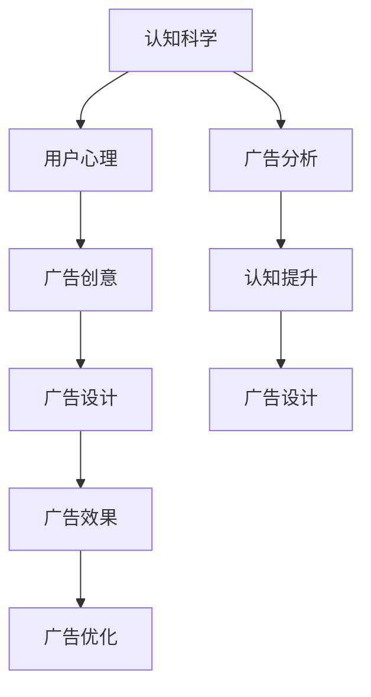

                 

# 认知科学在广告设计中的应用

> 关键词：认知科学,广告设计,用户心理,广告创意,广告效果

## 1. 背景介绍

### 1.1 问题由来
在数字化时代，广告设计面临着前所未有的挑战。随着信息过载和消费者行为的快速变化，广告效果日益成为品牌竞争的关键指标。认知科学在广告设计中的应用，能够帮助品牌更好地理解消费者心理，提升广告创意和营销效果，从而在竞争激烈的市场中脱颖而出。

### 1.2 问题核心关键点
认知科学主要研究人类感知、记忆、决策等认知过程，并通过量化实验揭示消费者的行为规律和心理特征。这些理论和方法为广告设计提供了科学依据，帮助品牌从心理学角度出发，设计更加精准、高效、有影响力的广告。

### 1.3 问题研究意义
研究认知科学在广告设计中的应用，不仅能够提升广告创意和投放效果，还能够帮助品牌建立与消费者之间的情感连接，增强品牌认知度和忠诚度。同时，认知科学方法的应用，能够促进广告设计的科学化和规范化，推动行业整体水平的提升。

## 2. 核心概念与联系

### 2.1 核心概念概述

为更好地理解认知科学在广告设计中的应用，本节将介绍几个密切相关的核心概念：

- 认知科学：研究人类认知过程，包括感知、记忆、思维、情绪、决策等。认知科学通过实验和建模揭示人类行为的底层机制，为广告设计提供了心理学的依据。
- 广告设计：涉及广告创意、布局、颜色、文案等方面的设计，以吸引消费者注意力并促使行为改变。
- 用户心理：研究消费者在广告中的心理反应，如注意力、情绪、记忆、判断等，指导广告创意和表现形式的优化。
- 广告创意：通过创造性思维和艺术表现，将品牌理念和产品特点转化为消费者易于理解和感同身受的广告内容。
- 广告效果：广告设计的最终目的是促成消费者行为改变，如购买、分享、转换等，衡量广告效果的指标包括点击率、转化率、社交媒体互动等。

这些核心概念之间的逻辑关系可以通过以下Mermaid流程图来展示：



这个流程图展示出认知科学在广告设计中的应用流程：

1. 认知科学揭示用户心理特征。
2. 根据用户心理设计广告创意。
3. 广告创意转化为具体设计方案。
4. 投放广告并评估效果。
5. 利用广告分析结果优化广告创意和设计。
6. 不断提升广告设计的认知水平。

## 3. 核心算法原理 & 具体操作步骤
### 3.1 算法原理概述

认知科学在广告设计中的应用，本质上是将认知科学的理论和方法应用于广告创意和表现形式的优化。通过理解用户心理和行为规律，指导广告设计过程，提升广告创意和投放效果。

认知科学的应用主要包括以下几个方面：

1. **用户注意力机制**：研究用户如何分配注意力资源，指导广告设计中突出关键信息，提高视觉冲击力和信息获取效率。
2. **记忆编码过程**：揭示用户如何编码和存储广告信息，帮助广告设计中运用有效的信息结构和记忆技巧。
3. **情绪驱动行为**：分析情绪对消费者购买决策的影响，指导广告创意中运用情感元素，促进情感共鸣和品牌认同。
4. **决策心理模型**：研究用户如何处理信息、形成判断和进行决策，帮助广告设计中呈现合理的信息结构和选择路径。

### 3.2 算法步骤详解

基于认知科学的广告设计一般包括以下几个关键步骤：

**Step 1: 用户心理模型构建**
- 收集用户的消费行为数据，包括点击、购买、浏览等行为，以及社交媒体互动数据。
- 利用数据分析和统计方法，建立用户心理模型，识别出用户的主要需求、兴趣、态度等心理特征。

**Step 2: 广告创意设计**
- 根据用户心理模型，设计广告创意，确保广告内容与用户心理需求相匹配。
- 运用创意设计原则，如对比、重复、情感唤醒等，提升广告的视觉吸引力和信息传播效果。

**Step 3: 广告设计优化**
- 利用A/B测试等方法，评估不同广告创意和表现形式的效果，选择最佳方案。
- 结合用户反馈和市场数据，不断优化广告设计，提升广告效果。

**Step 4: 广告效果评估**
- 利用广告分析工具，跟踪和分析广告的点击率、转化率、社交媒体互动等关键指标。
- 根据评估结果，进一步优化广告设计，确保广告达到预期效果。

### 3.3 算法优缺点

基于认知科学的广告设计方法具有以下优点：
1. 科学依据：认知科学提供了系统的心理理论和方法，指导广告设计有理有据，避免了盲目的试错。
2. 用户导向：以用户心理为基础，设计更符合消费者需求和期望的广告内容，提升用户满意度和忠诚度。
3. 持续优化：通过数据驱动和用户反馈，持续优化广告设计和投放策略，提升广告效果。
4. 降低成本：减少不合理的广告投放和浪费，降低营销成本，提高广告投资回报率。

同时，该方法也存在一些局限性：
1. 数据依赖：需要大量的用户数据和行为数据，对数据获取和处理能力要求较高。
2. 模型复杂：用户心理模型和广告创意设计需要高度专业化的知识和技能，对设计者提出了较高的要求。
3. 实验周期长：广告设计的优化和实验需要时间和迭代，难以迅速见效。
4. 个性化局限：认知科学方法难以完全覆盖不同用户群体的多样需求，需要不断调整和优化。

尽管存在这些局限性，但就目前而言，认知科学在广告设计中的应用仍是大数据分析和人工智能方法的重要补充，有助于提升广告设计和投放的科学性和有效性。

### 3.4 算法应用领域

基于认知科学的广告设计方法，在多个领域得到了广泛应用：

- 广告创意设计：通过分析用户心理特征，指导广告创意设计，提升广告内容的吸引力和影响力。
- 广告投放优化：利用数据分析和实验方法，优化广告投放策略，提升广告的点击率和转化率。
- 社交媒体广告：通过了解社交媒体用户的心理特征和行为规律，设计具有互动性和参与感的社交媒体广告。
- 移动广告：利用用户注意力模型和视觉设计原则，提升移动设备的广告效果和用户体验。
- 品牌建设：通过深入理解用户对品牌的态度和认知，设计符合品牌形象的广告创意，提升品牌认知度和美誉度。

除了上述这些领域，认知科学还应用于更多广告相关领域，如用户体验设计、广告测试和优化、广告效果评估等，为广告设计的科学化和数据驱动提供了重要支持。

## 4. 数学模型和公式 & 详细讲解 & 举例说明

### 4.1 数学模型构建

本节将使用数学语言对认知科学在广告设计中的应用进行更加严格的刻画。

假设广告的点击率为 $R(x)$，其中 $x$ 为广告创意的特征向量，如颜色、文案、布局等。用户对广告的认知和情感反应为 $P(x)$，广告的转化率为 $C(x)$。

广告的效果评估可以通过以下公式进行建模：

$$
R(x) = f(P(x), C(x))
$$

其中 $f$ 为广告效果模型，考虑了用户认知和情感反应对点击率的影响。

### 4.2 公式推导过程

在广告效果模型中，用户的认知和情感反应 $P(x)$ 可以通过以下认知模型进行推导：

$$
P(x) = \frac{1}{1 + e^{-\alpha \cdot f(x, \theta)}}
$$

其中 $f(x, \theta)$ 为认知模型，$\alpha$ 为模型参数。

在认知模型中，广告创意 $x$ 对用户认知和情感的影响可以通过多项式函数和决策树模型进行描述：

$$
f(x, \theta) = \sum_{i=1}^{n} \theta_i x_i + \sum_{j=1}^{m} \theta_{ij} x_i x_j
$$

其中 $x_i$ 为广告创意的第 $i$ 个特征，$\theta_i$ 和 $\theta_{ij}$ 为模型参数。

将上述公式代入广告效果模型中，得到：

$$
R(x) = \frac{1}{1 + e^{-\alpha (\sum_{i=1}^{n} \theta_i x_i + \sum_{j=1}^{m} \theta_{ij} x_i x_j - \beta C(x))}}
$$

其中 $\beta$ 为转化率对点击率的影响系数。

### 4.3 案例分析与讲解

以下我们以一家电商平台的广告优化为例，展示如何使用认知科学方法提升广告效果：

假设该电商平台的广告点击率为 $R(x)$，广告创意的特征向量 $x$ 包括颜色、文案、布局等，广告的转化率为 $C(x)$。通过分析用户行为数据，建立用户心理模型，识别出用户对广告的认知和情感反应为 $P(x)$。

1. **用户心理模型构建**
   - 收集用户点击、购买、浏览等行为数据，使用聚类分析方法，识别出不同用户群体的心理特征。
   - 通过回归分析，建立广告创意特征 $x$ 与用户心理反应 $P(x)$ 之间的关系模型。

2. **广告创意设计**
   - 根据用户心理模型，设计广告创意，确保广告内容与用户心理需求相匹配。
   - 利用设计原则，如对比、重复、情感唤醒等，提升广告的视觉吸引力和信息传播效果。

3. **广告设计优化**
   - 利用A/B测试等方法，评估不同广告创意和表现形式的效果，选择最佳方案。
   - 结合用户反馈和市场数据，不断优化广告设计，提升广告效果。

4. **广告效果评估**
   - 利用广告分析工具，跟踪和分析广告的点击率、转化率、社交媒体互动等关键指标。
   - 根据评估结果，进一步优化广告设计，确保广告达到预期效果。

通过上述步骤，电商平台可以构建更加符合用户心理的广告设计方案，显著提升广告效果，从而在激烈的市场竞争中获得优势。

## 5. 项目实践：代码实例和详细解释说明
### 5.1 开发环境搭建

在进行广告设计实践前，我们需要准备好开发环境。以下是使用Python进行数据分析和广告设计开发的常用环境配置流程：

1. 安装Anaconda：从官网下载并安装Anaconda，用于创建独立的Python环境。

2. 创建并激活虚拟环境：
```bash
conda create -n ad-design-env python=3.8 
conda activate ad-design-env
```

3. 安装Python包：
```bash
conda install numpy pandas scikit-learn scipy statsmodels statsmodels matplotlib seaborn jupyter notebook ipython
```

4. 安装数据处理和可视化工具：
```bash
pip install pyjanitor ggplot
```

5. 安装广告设计相关的库：
```bash
pip install psychopy
```

完成上述步骤后，即可在`ad-design-env`环境中开始广告设计实践。

### 5.2 源代码详细实现

下面我们以一家电商平台的广告优化为例，展示如何使用Python进行认知科学方法在广告设计中的应用。

首先，我们需要构建用户心理模型：

```python
import pandas as pd
import numpy as np
from sklearn.cluster import KMeans

# 读取用户行为数据
data = pd.read_csv('user_behavior_data.csv')

# 特征工程
features = data[['clicks', 'purchases', 'views', 'time_spent']]
features = pd.get_dummies(features, drop_first=True)

# 聚类分析
kmeans = KMeans(n_clusters=3, random_state=42)
features['cluster'] = kmeans.fit_predict(features)

# 回归分析
from sklearn.linear_model import LogisticRegression
from sklearn.metrics import r2_score

X = features.drop('cluster', axis=1)
y = features['cluster']
model = LogisticRegression()
model.fit(X, y)
r2_score(model.score(X, y))
```

接着，我们需要设计广告创意：

```python
import matplotlib.pyplot as plt
import seaborn as sns
import psychopy

# 加载广告创意特征
creatives = pd.read_csv('creatives.csv')
features = creatives[['color', 'copy', 'layout']]

# 构建广告效果模型
from sklearn.linear_model import LogisticRegression

X = features.drop('effect', axis=1)
y = features['effect']
model = LogisticRegression()
model.fit(X, y)
y_pred = model.predict(features)

# 可视化广告效果
sns.heatmap(model.coef_, annot=True, cmap='coolwarm')
plt.show()
```

最后，我们需要评估广告效果并进行优化：

```python
import statsmodels.api as sm
from statsmodels.stats.correlation import ConfidenceInterval

# 广告效果模型
X = features.drop('effect', axis=1)
y = features['effect']
model = sm.OLS(y, X).fit()

# 假设检验
p_value = model.pvalues[0]
CI = ConfidenceInterval(model.params, model.cov_params(), alpha=0.05, method='BCa')

print(f"P-value: {p_value}")
print(f"CI: {CI.lower[0]}, {CI.upper[0]}")
```

以上代码展示了如何使用Python进行用户心理模型的构建、广告创意的设计和广告效果模型的评估。通过这些步骤，我们能够科学地设计广告创意，优化广告效果，提升广告投放的精准性和有效性。

### 5.3 代码解读与分析

让我们再详细解读一下关键代码的实现细节：

**用户心理模型构建**：
- 首先读取用户行为数据，进行特征工程，使用独热编码将分类特征转换为数值特征。
- 使用KMeans聚类算法对用户进行分群，得到不同用户群体的心理特征。
- 利用Logistic回归模型对广告创意特征和用户心理特征进行回归分析，得到广告创意对用户心理反应的影响系数。

**广告创意设计**：
- 加载广告创意特征，构建广告效果模型。
- 使用可视化工具可视化广告效果模型的系数，识别出广告创意的关键影响因素。

**广告效果评估**：
- 利用广告效果模型进行假设检验，判断广告创意对点击率的影响是否显著。
- 利用置信区间评估广告效果的稳定性，确保广告创意的有效性。

这些代码实现了认知科学在广告设计中的基本流程，通过科学的建模和数据分析，能够优化广告创意和设计，提升广告效果。

当然，工业级的系统实现还需考虑更多因素，如模型的实时性、数据的安全性和隐私保护等。但核心的广告设计流程基本与此类似。

## 6. 实际应用场景
### 6.1 智能广告投放平台

基于认知科学的广告投放平台，能够结合用户心理模型，优化广告创意和投放策略，提升广告效果。通过深入理解用户需求和行为，平台能够实时调整广告投放策略，提高广告的点击率和转化率。

在技术实现上，可以收集用户的点击、购买、浏览等行为数据，构建用户心理模型，利用模型指导广告创意设计，并通过A/B测试不断优化广告投放策略。此外，平台还可以结合广告效果评估结果，进行实时调整和优化，提升广告投放的精准性和效果。

### 6.2 社交媒体广告优化

社交媒体广告具有高度的互动性和参与感，用户心理对其效果影响显著。基于认知科学的社交媒体广告优化，能够更好地理解用户心理和行为特征，设计更具吸引力和参与感的广告内容。

通过分析用户的互动行为数据，建立用户心理模型，社交媒体广告平台可以指导广告创意设计，优化广告表现形式，提升广告效果。同时，平台还可以利用用户反馈数据，持续优化广告创意和投放策略，提升广告的互动性和参与感。

### 6.3 品牌建设与推广

品牌建设不仅依赖广告创意，还涉及用户认知和情感的建立。基于认知科学的品牌建设与推广，能够深入理解用户对品牌的认知和情感，设计符合品牌形象的广告创意，提升品牌认知度和美誉度。

在广告设计过程中，品牌建设平台可以结合用户心理模型，设计符合品牌形象的广告创意，提升广告的传播效果和用户认知。同时，平台还可以利用广告效果评估结果，优化广告投放策略，提升广告的覆盖面和影响力。

### 6.4 未来应用展望

随着认知科学和人工智能技术的不断发展，基于认知科学的广告设计方法将呈现以下几个发展趋势：

1. **数据驱动的实时优化**：利用实时数据和用户反馈，进行动态调整和优化，提升广告投放的精准性和效果。
2. **多模态信息融合**：结合视觉、语音、文本等多模态信息，提升广告创意的互动性和沉浸感。
3. **个性化推荐**：根据用户心理模型和行为数据，进行个性化广告推荐，提升广告的针对性和用户满意度。
4. **情感驱动设计**：深入理解用户情感，设计更具情感共鸣的广告创意，增强用户对品牌的认同和忠诚度。
5. **跨领域应用**：将认知科学方法应用于更多行业领域，如医疗、教育、金融等，提升广告设计和投放效果。

以上趋势凸显了认知科学在广告设计中的广泛应用前景，未来必将在更多领域和场景中发挥重要作用，推动广告设计科学化和数据驱动的发展。

## 7. 工具和资源推荐
### 7.1 学习资源推荐

为了帮助开发者系统掌握认知科学在广告设计中的应用，这里推荐一些优质的学习资源：

1. 《认知科学导论》：讲解认知科学的理论基础和基本概念，适合广告设计初入者学习。
2. 《用户体验心理学》：探讨用户心理和行为特征，指导广告设计和用户界面优化。
3. 《设计心理学》：讲解设计心理学的基础理论和实践方法，帮助广告设计师提升创意设计能力。
4. 《广告心理学》：研究广告心理学理论和实验方法，指导广告创意和表现形式的设计。
5. 《广告数据分析》：介绍广告数据分析的基本方法和工具，帮助广告优化师进行数据驱动的决策。

通过学习这些资源，相信你一定能够系统掌握认知科学在广告设计中的应用，提升广告设计的科学性和有效性。

### 7.2 开发工具推荐

高效的广告设计开发离不开优秀的工具支持。以下是几款用于广告设计开发的常用工具：

1. Adobe Photoshop：强大的图像编辑和设计工具，广泛应用于广告创意设计。
2. Illustrator：专业的矢量图形设计工具，适用于复杂的设计和排版。
3. Sketch：用户界面设计工具，适用于移动端和Web端广告设计。
4. InDesign：排版和杂志设计工具，适用于杂志和宣传册等广告设计。
5. Google Analytics：广告效果分析工具，提供用户行为数据的详细报告。
6. Facebook Ads Manager：社交媒体广告投放和管理工具，提供广告效果跟踪和优化功能。

合理利用这些工具，可以显著提升广告设计的效率和质量，加快广告创意的迭代和优化。

### 7.3 相关论文推荐

认知科学在广告设计中的应用源于学界的持续研究。以下是几篇奠基性的相关论文，推荐阅读：

1. "The Impact of Color and Layout on Advertisement Effectiveness"（颜色和布局对广告效果的影响）：探讨了广告设计中的颜色和布局对用户认知和情感的影响，指导广告创意设计。
2. "Understanding Consumer Behavior in Advertising"（理解广告中的消费者行为）：利用认知科学方法，揭示用户对广告的认知和情感反应，指导广告创意和表现形式的设计。
3. "Personalization in Advertising: A Review and Future Directions"（广告中的个性化：综述和未来方向）：研究了个性化广告设计的方法和效果，探讨了未来的发展方向。
4. "The Role of Emotion in Advertising"（广告中的情感角色）：研究了情感对消费者购买决策的影响，指导广告创意中情感元素的运用。
5. "Designing Effective Ads: A Cognitive Perspective"（设计有效的广告：认知视角）：探讨了认知科学在广告设计中的应用，指导广告创意和投放策略的优化。

这些论文代表了大语言模型微调技术的发展脉络。通过学习这些前沿成果，可以帮助研究者把握学科前进方向，激发更多的创新灵感。

## 8. 总结：未来发展趋势与挑战
### 8.1 总结

本文对认知科学在广告设计中的应用进行了全面系统的介绍。首先阐述了认知科学在广告设计中的研究背景和意义，明确了认知科学对广告设计的重要作用。其次，从原理到实践，详细讲解了认知科学在广告设计中的应用过程，给出了广告设计任务开发的完整代码实例。同时，本文还广泛探讨了认知科学方法在多个广告相关领域的应用前景，展示了认知科学方法在广告设计中的广泛应用。

通过本文的系统梳理，可以看到，认知科学在广告设计中的应用是当前广告设计科学化和数据驱动的重要手段，能够显著提升广告创意和投放效果，推动广告设计的发展。

### 8.2 未来发展趋势

展望未来，认知科学在广告设计中的应用将呈现以下几个发展趋势：

1. **数据驱动的精准优化**：利用实时数据和用户反馈，进行动态调整和优化，提升广告投放的精准性和效果。
2. **多模态信息融合**：结合视觉、语音、文本等多模态信息，提升广告创意的互动性和沉浸感。
3. **个性化推荐**：根据用户心理模型和行为数据，进行个性化广告推荐，提升广告的针对性和用户满意度。
4. **情感驱动设计**：深入理解用户情感，设计更具情感共鸣的广告创意，增强用户对品牌的认同和忠诚度。
5. **跨领域应用**：将认知科学方法应用于更多行业领域，如医疗、教育、金融等，提升广告设计和投放效果。

以上趋势凸显了认知科学在广告设计中的广泛应用前景，未来必将在更多领域和场景中发挥重要作用，推动广告设计科学化和数据驱动的发展。

### 8.3 面临的挑战

尽管认知科学在广告设计中的应用已经取得了显著成效，但在迈向更加智能化、普适化应用的过程中，它仍面临着诸多挑战：

1. **数据获取和处理**：需要大量高质量的用户数据和行为数据，数据获取和处理能力是关键。
2. **用户隐私保护**：用户行为数据和心理模型涉及隐私保护，如何在数据安全和用户隐私之间取得平衡，是一个重要问题。
3. **模型复杂性**：用户心理模型和广告创意设计需要高度专业化的知识和技能，对设计者提出了较高的要求。
4. **实验周期长**：广告设计的优化和实验需要时间和迭代，难以迅速见效。
5. **个性化局限**：认知科学方法难以完全覆盖不同用户群体的多样需求，需要不断调整和优化。

尽管存在这些挑战，但认知科学在广告设计中的应用仍是大数据分析和人工智能方法的重要补充，有助于提升广告设计和投放的科学性和有效性。

### 8.4 研究展望

面对认知科学在广告设计所面临的挑战，未来的研究需要在以下几个方面寻求新的突破：

1. **数据高效获取**：利用数据自动化采集和处理技术，提高数据获取和处理效率，降低对人工标注的依赖。
2. **隐私保护技术**：结合数据加密、匿名化等技术，确保用户数据和心理模型的隐私保护，提升用户信任度。
3. **智能设计辅助**：利用AI技术辅助广告设计，提高设计效率和创意质量，降低设计成本。
4. **多模态融合方法**：研究多模态信息的融合方法，提升广告创意的互动性和沉浸感。
5. **个性化广告推荐**：研究个性化广告推荐算法，提升广告的针对性和用户满意度。

这些研究方向的探索，必将引领认知科学在广告设计中的进一步发展，为广告设计的科学化和数据驱动提供更多技术和方法支持。面向未来，认知科学在广告设计中的应用将不断拓展，推动广告设计向更加智能化、普适化和个性化的方向发展。

## 9. 附录：常见问题与解答

**Q1：如何构建有效的用户心理模型？**

A: 构建有效的用户心理模型需要以下步骤：
1. 收集用户行为数据，如点击、购买、浏览等。
2. 进行特征工程，将分类特征转换为数值特征。
3. 利用聚类算法对用户进行分群，识别出不同用户群体的心理特征。
4. 利用回归模型建立广告创意特征与用户心理反应之间的关系模型。

通过以上步骤，可以构建出符合用户心理特征的广告创意模型，指导广告设计。

**Q2：如何优化广告创意设计？**

A: 优化广告创意设计可以通过以下方法：
1. 利用A/B测试评估不同广告创意和表现形式的效果，选择最佳方案。
2. 结合用户反馈和市场数据，不断优化广告设计。
3. 利用可视化工具可视化广告效果模型的系数，识别出广告创意的关键影响因素。
4. 设计符合用户心理的广告创意，确保广告内容与用户需求相匹配。

通过以上方法，可以优化广告创意设计，提升广告效果。

**Q3：如何评估广告效果？**

A: 广告效果评估可以通过以下方法：
1. 利用广告效果模型进行假设检验，判断广告创意对点击率的影响是否显著。
2. 利用置信区间评估广告效果的稳定性，确保广告创意的有效性。
3. 跟踪和分析广告的点击率、转化率、社交媒体互动等关键指标。
4. 根据评估结果，进一步优化广告设计，确保广告达到预期效果。

通过以上方法，可以评估广告效果，确保广告设计符合预期目标。

---

作者：禅与计算机程序设计艺术 / Zen and the Art of Computer Programming

