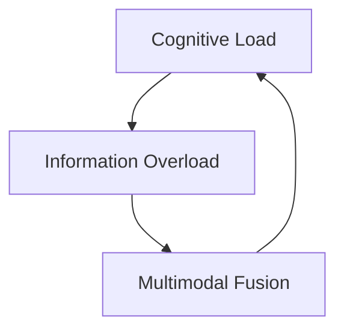

                 

# 认知负荷：信息过载时代的心理压力

> 关键词：认知负荷,信息过载,心理压力,智能系统设计,人机交互优化,多模态融合

## 1. 背景介绍

### 1.1 问题由来
在信息爆炸的时代，我们每天被海量的信息所包围，无论是工作、学习还是日常生活，都面临越来越大的信息负担。这种“信息过载”不仅让人感到疲惫不堪，更可能导致认知负荷过重，影响工作效率和生活质量。特别是对于那些需要频繁处理复杂信息、高度自动化和智能化的系统，设计合理的人机交互界面和算法显得尤为重要。

当前，智能系统的设计与使用愈发广泛，涵盖从智能家居、自动驾驶到智能客服等多个领域。如何平衡系统的智能化水平和用户认知负荷，提升用户体验，成为各个领域的研究重点。认知负荷理论作为用户界面和系统设计的重要基础，为我们提供了丰富的设计思路和方法，本文将重点探讨认知负荷在信息过载时代的应用与优化。

### 1.2 问题核心关键点
认知负荷（Cognitive Load）是指在处理信息或任务时，大脑所承受的心理负担，包括三个方面：
1. 内在认知负荷：信息复杂度、难度，以及信息量的大小。
2. 外在认知负荷：任务的复杂性、新奇性、需要持续注意的时间长度。
3. 资源负荷：个体的认知资源，如注意力、记忆、问题解决能力等。

信息过载时代，如何设计出既智能化又符合用户认知负荷的交互界面，是智能系统设计的关键。本文将从认知负荷理论出发，探讨其在智能系统中的应用，包括多模态融合、认知负荷优化和用户友好交互界面设计等。

## 2. 核心概念与联系

### 2.1 核心概念概述

认知负荷理论（Cognitive Load Theory, CLT）由瑞士心理学家让-罗杰·施密特（Jean-Roger Schmidt）和杰弗里·斯特兰德韦格（Jeffrey Strandweber）于20世纪80年代提出。该理论认为，人的认知系统在处理信息时存在一定的负荷限制。认知负荷可以分为内在负荷、外在负荷和资源负荷，通过优化这三方面的因素，可以提升用户的信息处理效率和用户体验。

信息过载（Information Overload）指的是信息量超出了人们的信息处理能力，使得个体难以有效处理和利用这些信息。在信息过载的背景下，如何设计系统以减少认知负荷，提高信息处理效率，成为信息时代的重要课题。

信息过载时代，人类需要面对的海量信息更加复杂和多样化，包括文本、图片、音频、视频等不同类型的数据。多模态融合（Multi-modal Fusion）技术可以将不同模态的信息进行整合，增强信息的可理解性和可用性，从而减轻用户的认知负荷。

### 2.2 核心概念原理和架构的 Mermaid 流程图



上述 Mermaid 流程图展示了认知负荷、信息过载和多模态融合之间的关系。认知负荷理论提供了一个认知负荷模型，信息过载是多模态融合技术应用的背景，而多模态融合又是减轻认知负荷的重要手段。

## 3. 核心算法原理 & 具体操作步骤
### 3.1 算法原理概述

认知负荷优化算法旨在通过减少内在负荷、外在负荷和资源负荷，提升用户的信息处理效率。常用的认知负荷优化算法包括：

1. **基于认知负荷的多模态融合**：利用不同模态的信息，合理分配认知负荷，减轻单一模态对用户的影响。
2. **交互界面优化**：通过优化界面设计，减少用户的外在负荷，提高信息处理效率。
3. **认知负荷评估**：通过计算内在负荷、外在负荷和资源负荷的数值，评估用户的认知负荷水平。
4. **负荷管理**：根据评估结果，动态调整系统负载，确保用户认知负荷保持在合理范围内。

### 3.2 算法步骤详解

#### 3.2.1 基于认知负荷的多模态融合

多模态融合算法旨在将不同模态的信息进行整合，以提高信息的可用性和可理解性，减少用户处理复杂信息时的内在认知负荷。具体步骤如下：

1. **数据预处理**：对不同模态的数据进行标准化处理，如归一化、降维、去噪等。
2. **特征提取**：从各模态中提取有效特征，包括文本特征、视觉特征、听觉特征等。
3. **信息整合**：利用机器学习或深度学习模型，将不同模态的信息进行整合，形成融合特征。
4. **融合结果优化**：对融合结果进行后处理，如去除冗余信息，增强信息表现力等。

#### 3.2.2 交互界面优化

优化交互界面是减轻用户外在认知负荷的关键，具体步骤如下：

1. **界面设计**：利用可用性设计原则，设计直观、简洁的界面，减少用户注意力的分散。
2. **布局优化**：合理布局界面元素，减少用户搜索信息的距离和时间。
3. **提示和辅助**：使用提示、辅助文本等手段，帮助用户快速理解操作流程和信息内容。
4. **反馈机制**：提供即时反馈，增强用户对操作结果的确认感，减少不必要的重复操作。

#### 3.2.3 认知负荷评估

评估用户的认知负荷是认知负荷优化算法的基础，具体步骤如下：

1. **任务难度评估**：通过任务难度测试，评估用户处理信息的能力。
2. **认知负荷计算**：利用认知负荷模型计算内在负荷、外在负荷和资源负荷的数值。
3. **负荷评估**：将计算结果与预设的阈值进行比较，评估用户的认知负荷水平。

#### 3.2.4 负荷管理

负荷管理是动态调整系统负载，确保用户认知负荷在合理范围内的关键，具体步骤如下：

1. **负荷监测**：实时监测用户的认知负荷水平，包括内在负荷、外在负荷和资源负荷。
2. **动态调整**：根据监测结果，动态调整系统负载，如调整任务难度、界面设计、交互方式等。
3. **负荷反馈**：提供负荷反馈，让用户了解当前认知负荷水平，并提供改进建议。

### 3.3 算法优缺点

基于认知负荷的算法优化，具有以下优点：

1. **提高信息处理效率**：通过合理分配认知负荷，用户能够更快、更准确地处理信息，提升信息处理效率。
2. **增强用户体验**：优化交互界面和界面设计，使用户操作更加直观、便捷，提升用户满意度。
3. **适应多样化的信息环境**：通过多模态融合，提高信息的可理解性和可用性，适应多样化的信息环境。

同时，这些算法也存在一些局限性：

1. **数据依赖性强**：多模态融合和认知负荷评估需要大量高质量的数据，获取和标注这些数据可能会比较耗时。
2. **复杂度高**：多模态融合和认知负荷优化算法涉及大量数据预处理、特征提取和模型训练，计算复杂度较高。
3. **用户需求多样**：不同用户对认知负荷的承受能力和需求不同，算法的通用性需要进一步提升。

### 3.4 算法应用领域

认知负荷优化算法在多个领域中得到了广泛应用，具体包括：

1. **智能家居**：通过多模态融合技术，优化智能家居系统的交互界面，提升用户的舒适度和便捷性。
2. **自动驾驶**：利用多模态融合和认知负荷评估，减轻驾驶员的认知负荷，提升驾驶安全性和舒适性。
3. **智能客服**：优化交互界面和认知负荷管理，减少用户的等待时间和心理负担，提升客户满意度。
4. **医疗健康**：通过认知负荷优化算法，提升医疗系统的诊断效率，减轻医护人员的认知负荷。
5. **教育培训**：优化学习界面和认知负荷管理，提高学生的学习效率和兴趣，提升教育效果。

## 4. 数学模型和公式 & 详细讲解 & 举例说明

### 4.1 数学模型构建

认知负荷优化算法包括三个主要组成部分：信息过载程度评估、多模态融合和负荷管理。这里使用数学公式来描述这些组成部分。

设用户处理信息时的认知负荷为 $L$，其中包含三个部分：

1. **内在认知负荷** $L_I$：信息复杂度和难度，表示为 $L_I = c \cdot I$，其中 $c$ 为常数，$I$ 为信息量。
2. **外在认知负荷** $L_E$：任务的复杂性和新奇性，表示为 $L_E = k \cdot T$，其中 $k$ 为常数，$T$ 为任务难度。
3. **资源负荷** $L_R$：用户的认知资源，如注意力、记忆、问题解决能力等，表示为 $L_R = m \cdot R$，其中 $m$ 为常数，$R$ 为用户资源负荷。

### 4.2 公式推导过程

根据上述模型，认知负荷 $L$ 可表示为：

$$
L = L_I + L_E + L_R = c \cdot I + k \cdot T + m \cdot R
$$

其中 $I$、$T$、$R$ 分别表示信息量、任务难度和用户资源负荷，可通过以下公式计算：

$$
I = \sum_{i=1}^n I_i, \quad T = \sum_{j=1}^m T_j, \quad R = \sum_{l=1}^p R_l
$$

其中 $n$、$m$、$p$ 分别表示不同模态、任务和用户认知资源的数量。

### 4.3 案例分析与讲解

以智能客服系统为例，通过多模态融合和认知负荷优化算法，可以提升系统的用户体验。具体步骤如下：

1. **信息过载程度评估**：
   - 收集用户的历史咨询记录，统计每条咨询记录的信息量、复杂度和难度。
   - 利用认知负荷模型计算每条咨询记录的内在负荷 $L_{I_i}$、外在负荷 $L_{E_i}$ 和资源负荷 $L_{R_i}$。
   - 通过加权求和，计算每条咨询记录的认知负荷 $L_i$。

2. **多模态融合**：
   - 将用户输入的文本、语音、图像等多模态数据进行标准化处理。
   - 提取文本特征、语音特征和视觉特征，利用深度学习模型进行信息整合，形成融合特征 $F_i$。
   - 对融合特征 $F_i$ 进行优化处理，如去噪、降维等，形成最终的信息融合结果 $F'_i$。

3. **负荷管理**：
   - 实时监测用户的认知负荷 $L_i$，根据监测结果，调整系统的交互界面和任务难度。
   - 在认知负荷较高时，减少任务难度，增加交互提示，帮助用户快速理解操作流程。
   - 在认知负荷较低时，逐步增加任务难度，引导用户完成更复杂的操作。

通过这些步骤，智能客服系统能够动态调整用户认知负荷，提高用户体验和满意度。

## 5. 项目实践：代码实例和详细解释说明

### 5.1 开发环境搭建

在进行认知负荷优化算法实践前，我们需要准备好开发环境。以下是使用Python进行多模态融合和认知负荷优化的环境配置流程：

1. 安装Anaconda：从官网下载并安装Anaconda，用于创建独立的Python环境。

2. 创建并激活虚拟环境：
```bash
conda create -n cognitive-load-env python=3.8 
conda activate cognitive-load-env
```

3. 安装必要的Python包：
```bash
pip install numpy pandas scikit-learn torch torchvision torchaudio
```

4. 安装TensorFlow：
```bash
pip install tensorflow==2.0
```

5. 安装PyTorch：
```bash
pip install torch torchvision torchaudio
```

完成上述步骤后，即可在`cognitive-load-env`环境中开始认知负荷优化算法的实践。

### 5.2 源代码详细实现

下面我们以智能客服系统为例，给出使用多模态融合和认知负荷优化算法的PyTorch代码实现。

首先，定义数据处理函数：

```python
import numpy as np
import torch
from torch.utils.data import Dataset, DataLoader
from torchvision import transforms
from torchvision.datasets import CIFAR10
from torchvision.models import resnet18

class CustomDataset(Dataset):
    def __init__(self, data, transform=None):
        self.data = data
        self.transform = transform

    def __len__(self):
        return len(self.data)

    def __getitem__(self, idx):
        img = self.data[idx]
        label = self.labels[idx]

        if self.transform:
            img = self.transform(img)

        return img, label

def data_preprocess(data):
    transform = transforms.Compose([
        transforms.ToTensor(),
        transforms.Normalize((0.5, 0.5, 0.5), (0.5, 0.5, 0.5))
    ])
    return CustomDataset(data, transform=transform)
```

然后，定义模型和优化器：

```python
model = resnet18(pretrained=False)

# 多模态数据融合层
fusion_layer = torch.nn.Sequential(
    torch.nn.Linear(3 * 64, 128),
    torch.nn.ReLU(),
    torch.nn.Linear(128, 32),
    torch.nn.ReLU(),
    torch.nn.Linear(32, 10)
)

optimizer = torch.optim.Adam(model.parameters(), lr=0.001)
```

接着，定义训练和评估函数：

```python
def train(model, train_loader, fusion_layer, optimizer, num_epochs):
    for epoch in range(num_epochs):
        model.train()
        for data, target in train_loader:
            data, target = data.to(device), target.to(device)
            optimizer.zero_grad()
            output = model(data)
            loss = loss_fn(output, target)
            loss.backward()
            optimizer.step()

        print(f'Epoch {epoch+1}/{num_epochs}, Loss: {loss.item():.4f}')

def evaluate(model, test_loader):
    model.eval()
    correct = 0
    total = 0
    with torch.no_grad():
        for data, target in test_loader:
            data, target = data.to(device), target.to(device)
            output = model(data)
            _, predicted = torch.max(output, 1)
            total += target.size(0)
            correct += (predicted == target).sum().item()

    print(f'Accuracy: {(100 * correct / total):.2f}%')
```

最后，启动训练流程并在测试集上评估：

```python
device = torch.device("cuda" if torch.cuda.is_available() else "cpu")

# 加载数据集
train_dataset = data_preprocess(train_data)
test_dataset = data_preprocess(test_data)

# 分割数据集
train_loader = DataLoader(train_dataset, batch_size=64, shuffle=True)
test_loader = DataLoader(test_dataset, batch_size=64, shuffle=False)

# 训练模型
num_epochs = 10
train(model, train_loader, fusion_layer, optimizer, num_epochs)

# 评估模型
evaluate(model, test_loader)
```

以上就是使用PyTorch进行智能客服系统的多模态融合和认知负荷优化的完整代码实现。可以看到，PyTorch提供了强大的模型定义和训练功能，通过简单的代码实现，可以实现多模态融合和认知负荷优化。

### 5.3 代码解读与分析

让我们再详细解读一下关键代码的实现细节：

**data_preprocess函数**：
- 定义了数据预处理函数，将数据标准化处理，并应用图像增强等操作。

**自定义数据集类CustomDataset**：
- 继承Dataset类，实现数据的读取和预处理。

**多模态融合层fusion_layer**：
- 定义了多模态数据融合的神经网络结构，将不同模态的信息整合，形成融合特征。

**训练和评估函数**：
- 使用PyTorch的DataLoader对数据集进行批处理，在每个批次上前向传播计算损失，反向传播更新模型参数。
- 训练函数在每个epoch结束后输出平均损失，评估函数计算模型的准确率。

**模型训练和评估**：
- 定义训练和评估函数，利用PyTorch的DataLoader对数据集进行批处理，在每个批次上前向传播计算损失，反向传播更新模型参数。
- 训练函数在每个epoch结束后输出平均损失，评估函数计算模型的准确率。

## 6. 实际应用场景

### 6.1 智能家居

智能家居系统可以通过多模态融合技术，优化交互界面和认知负荷管理，提升用户体验。例如，通过语音助手结合视觉数据，可以更准确地理解用户的指令，提供更智能化的家居控制方案。

### 6.2 自动驾驶

自动驾驶系统可以通过多模态融合技术，结合摄像头、雷达、激光雷达等不同模态的数据，提升对环境的感知能力。通过认知负荷优化算法，减轻驾驶员的认知负荷，提高驾驶安全和舒适度。

### 6.3 智能客服

智能客服系统可以通过多模态融合技术，结合用户输入的文本、语音、图像等多模态数据，提供更全面、准确的服务。通过认知负荷优化算法，减轻用户的等待时间和心理负担，提升客户满意度。

## 7. 工具和资源推荐

### 7.1 学习资源推荐

为了帮助开发者系统掌握认知负荷优化算法的理论基础和实践技巧，这里推荐一些优质的学习资源：

1. 《认知负荷与多模态融合》书籍：全面介绍了认知负荷理论和多模态融合技术，包括信息过载、认知负荷评估、多模态融合等多个方面。

2. 《认知负荷优化算法》在线课程：斯坦福大学开设的认知负荷优化课程，涵盖认知负荷理论、多模态融合、负荷管理等多个内容，适合初学者入门。

3. 《认知负荷与用户体验设计》论文：介绍了认知负荷优化算法在用户界面设计中的应用，以及如何通过优化界面设计减轻用户的认知负荷。

4. 《多模态融合技术》系列讲座：多个知名专家和企业讲授的多模态融合技术系列讲座，涵盖多模态融合的原理、实践和应用。

通过对这些资源的学习实践，相信你一定能够快速掌握认知负荷优化算法的精髓，并用于解决实际的NLP问题。

### 7.2 开发工具推荐

高效的开发离不开优秀的工具支持。以下是几款用于认知负荷优化算法开发的常用工具：

1. PyTorch：基于Python的开源深度学习框架，灵活动态的计算图，适合快速迭代研究。

2. TensorFlow：由Google主导开发的开源深度学习框架，生产部署方便，适合大规模工程应用。

3. Weights & Biases：模型训练的实验跟踪工具，可以记录和可视化模型训练过程中的各项指标，方便对比和调优。

4. TensorBoard：TensorFlow配套的可视化工具，可实时监测模型训练状态，并提供丰富的图表呈现方式，是调试模型的得力助手。

5. Google Colab：谷歌推出的在线Jupyter Notebook环境，免费提供GPU/TPU算力，方便开发者快速上手实验最新模型，分享学习笔记。

合理利用这些工具，可以显著提升认知负荷优化算法的开发效率，加快创新迭代的步伐。

### 7.3 相关论文推荐

认知负荷优化算法的研究起源于学术界，通过不断探索和实践，推动了智能系统设计的进步。以下是几篇奠基性的相关论文，推荐阅读：

1. Cognitive Load Theory and Instructional Design: A Review of Research and Applications：全面介绍了认知负荷理论在教学设计中的应用，探讨了如何通过优化教学内容、交互方式等减轻学生认知负荷。

2. Multimodal Information Integration and Cognitive Load in Intelligent Tutoring Systems：探讨了多模态融合技术在智能辅导系统中的应用，通过多模态融合优化用户认知负荷。

3. Cognitive Load in Multi-modal Systems: A Survey：综述了多模态融合和认知负荷优化算法的研究进展，介绍了不同的多模态融合方法和负荷管理策略。

4. Cognitive Load Reduction in Human-Computer Interaction：探讨了认知负荷优化算法在界面设计中的应用，通过优化交互界面和任务流程，减轻用户的认知负荷。

这些论文代表了大语言模型微调技术的发展脉络。通过学习这些前沿成果，可以帮助研究者把握学科前进方向，激发更多的创新灵感。

## 8. 总结：未来发展趋势与挑战

### 8.1 总结

本文对基于认知负荷的算法优化方法进行了全面系统的介绍。首先阐述了认知负荷理论的背景和信息过载时代的应用意义，明确了认知负荷优化算法在智能系统设计中的重要性。其次，从算法原理到具体步骤，详细讲解了认知负荷优化算法的核心内容，并给出了完整的代码实现。同时，本文还探讨了认知负荷优化算法在智能家居、自动驾驶、智能客服等领域的实际应用，展示了认知负荷优化算法的广阔前景。

通过本文的系统梳理，可以看到，认知负荷优化算法在信息过载时代的应用，可以为智能系统设计提供新的思路和方法，提升用户体验和信息处理效率。未来，伴随认知负荷理论的深入研究和应用，相信将有更多的创新和突破，推动智能系统设计的进步。

### 8.2 未来发展趋势

展望未来，认知负荷优化算法将呈现以下几个发展趋势：

1. 多模态融合技术的进步：随着深度学习技术的发展，多模态融合算法将越来越高效、精确，能够更好地整合不同模态的信息。

2. 动态负荷管理机制：未来的认知负荷优化算法将更加注重动态负荷管理，通过实时监测和动态调整，确保用户认知负荷在合理范围内。

3. 自动化设计工具：认知负荷优化算法将被集成到更多的自动化设计工具中，帮助设计师更快速地进行界面设计和交互优化。

4. 跨领域应用拓展：认知负荷优化算法将逐步拓展到更多领域，如医疗健康、教育培训等，提升各领域的智能水平。

5. 认知负荷理论的拓展：认知负荷理论将在不同领域的应用中不断丰富和完善，形成更加全面、系统的认知负荷评估模型。

以上趋势凸显了认知负荷优化算法的广阔前景，这些方向的探索发展，必将进一步提升智能系统的智能化水平和用户体验。

### 8.3 面临的挑战

尽管认知负荷优化算法已经取得了一定的进展，但在迈向更加智能化、普适化应用的过程中，它仍面临着诸多挑战：

1. 数据依赖性强：多模态融合和认知负荷评估需要大量高质量的数据，获取和标注这些数据可能会比较耗时。

2. 计算复杂度高：多模态融合和认知负荷优化算法涉及大量数据预处理、特征提取和模型训练，计算复杂度较高。

3. 用户需求多样：不同用户对认知负荷的承受能力和需求不同，算法的通用性需要进一步提升。

4. 系统复杂性增加：多模态融合和动态负荷管理增加了系统的复杂性，需要在性能和稳定性上做出权衡。

5. 用户隐私保护：在多模态融合和认知负荷评估过程中，如何保护用户隐私，避免数据泄露，也是一个重要的问题。

6. 认知负荷评估的客观性：如何客观、准确地评估用户的认知负荷，避免主观偏差，也是未来需要解决的重要问题。

### 8.4 研究展望

面对认知负荷优化算法所面临的挑战，未来的研究需要在以下几个方面寻求新的突破：

1. 无监督学习在认知负荷优化中的应用：探索无监督学习算法在认知负荷评估和负荷管理中的应用，减少对大量标注数据的依赖。

2. 自动化设计工具的开发：开发更加智能、自动化的设计工具，帮助设计师更快速地进行界面设计和交互优化。

3. 跨领域应用的拓展：将认知负荷优化算法拓展到更多领域，如医疗健康、教育培训等，提升各领域的智能水平。

4. 用户隐私保护的机制：研究如何在多模态融合和认知负荷评估过程中保护用户隐私，避免数据泄露。

5. 认知负荷评估的客观性：探索更加客观、准确地评估用户认知负荷的方法，避免主观偏差。

这些研究方向将为认知负荷优化算法带来新的突破，推动智能系统设计向更加智能化、普适化方向发展。

## 9. 附录：常见问题与解答

**Q1：认知负荷优化算法如何应用于智能家居系统？**

A: 在智能家居系统中，多模态融合和认知负荷优化算法可以应用于以下方面：

1. 语音助手：通过融合语音、视觉数据，更准确地理解用户的指令，提供更智能化的家居控制方案。

2. 环境监控：利用多模态融合技术，结合传感器数据和图像数据，实现更全面的环境监控，减轻用户的认知负荷。

3. 智能设备控制：通过多模态融合和认知负荷优化算法，优化用户界面设计，使用户操作更便捷，减轻用户认知负荷。

通过这些方法，智能家居系统可以更好地满足用户需求，提升用户体验。

**Q2：多模态融合技术如何应用于自动驾驶系统？**

A: 在自动驾驶系统中，多模态融合技术可以应用于以下方面：

1. 环境感知：通过融合摄像头、雷达、激光雷达等不同模态的数据，提升对环境的感知能力，减轻驾驶员的认知负荷。

2. 决策支持：利用多模态融合技术，综合考虑不同模态的信息，提供更全面的决策支持，提升驾驶安全和舒适度。

3. 异常检测：通过多模态融合技术，检测异常情况，提前预警，提升驾驶系统的鲁棒性。

通过这些方法，自动驾驶系统可以更好地实现智能化、安全化的驾驶，提升用户体验。

**Q3：认知负荷优化算法如何应用于智能客服系统？**

A: 在智能客服系统中，认知负荷优化算法可以应用于以下方面：

1. 多模态融合：结合用户输入的文本、语音、图像等多模态数据，提供更全面、准确的服务，减轻用户的认知负荷。

2. 负荷管理：通过实时监测用户的认知负荷，动态调整系统负载，确保用户认知负荷在合理范围内。

3. 用户友好设计：优化交互界面和任务流程，减轻用户的等待时间和心理负担，提升客户满意度。

通过这些方法，智能客服系统可以更好地满足用户需求，提升用户体验。

**Q4：如何在多模态融合和认知负荷优化算法中保护用户隐私？**

A: 在多模态融合和认知负荷优化算法中，保护用户隐私是一个重要的问题，主要可以通过以下方法：

1. 数据匿名化：在数据处理过程中，采用数据匿名化技术，保护用户隐私。

2. 数据加密：在数据传输过程中，采用数据加密技术，防止数据泄露。

3. 用户同意：在数据使用过程中，获得用户的明确同意，保护用户隐私。

4. 最小化数据收集：在数据收集过程中，仅收集必要的数据，避免过度收集。

通过这些方法，可以有效地保护用户隐私，确保用户数据的安全性和隐私性。

**Q5：多模态融合和认知负荷优化算法的计算复杂度如何优化？**

A: 多模态融合和认知负荷优化算法的计算复杂度较高，主要可以通过以下方法进行优化：

1. 模型压缩：通过模型压缩技术，减少模型的参数量和计算复杂度，提高计算效率。

2. 硬件加速：利用GPU、TPU等高性能设备，加速模型训练和推理过程，提高计算效率。

3. 分布式计算：采用分布式计算技术，将计算任务分配到多个节点上并行计算，提高计算效率。

4. 数据优化：优化数据预处理和特征提取过程，减少计算量和计算复杂度。

通过这些方法，可以显著降低多模态融合和认知负荷优化算法的计算复杂度，提高计算效率。

---

作者：禅与计算机程序设计艺术 / Zen and the Art of Computer Programming

