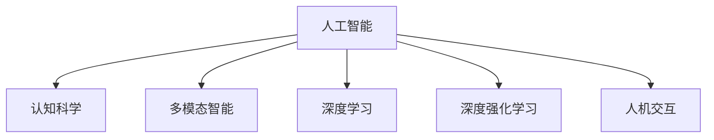

                 

# 认知革命：人工智能与人类智慧的协同进化

> 关键词：认知革命,人工智能,人机协同,认知增强,多模态智能,深度学习,深度强化学习

## 1. 背景介绍

### 1.1 问题由来

当前，人工智能(AI)技术正以前所未有的速度飞速发展，从机器视觉、语音识别到自然语言处理等领域，AI技术取得了诸多突破。然而，这一进步也引发了人们对人工智能与人类智慧的关系的深刻反思。人工智能究竟是扩展还是替代人类智能？这一话题在科技界和公众中引起了广泛的讨论。

认知革命是指人工智能和人类智慧的深度融合，通过机器学习和认知科学的方法，将人类的感知、推理、情感等多模态认知功能集成到AI系统中。这一革命性转变，有望开辟出一条全新的智能路径，实现人机协作，提升人类认知能力的边界。

### 1.2 问题核心关键点

认知革命的核心在于通过人工智能技术增强人类的认知功能，具体包括以下几个方面：

- **感知增强**：通过计算机视觉、听觉和触觉等技术，提升人类的感知能力，使人类能够更全面地了解世界。
- **推理扩展**：通过机器学习算法，特别是深度学习模型，增强人类的逻辑推理和决策能力，解决复杂问题。
- **情感智能**：通过自然语言处理技术，理解人类的情感表达，提升机器的情感理解和反馈能力。
- **协作共享**：通过协同工作平台和人机接口，实现人与人、人与机器之间的无缝协作，共同完成任务。

这些关键点涵盖了感知、推理、情感和协作等多个维度，描绘出一幅人工智能与人类智慧深度融合的宏大蓝图。

## 2. 核心概念与联系

### 2.1 核心概念概述

为更好地理解认知革命的原理和实现方法，本节将介绍几个密切相关的核心概念：

- **人工智能(AI)**：指通过算法和计算，使机器能够模拟人类智能行为，解决复杂问题的技术。
- **认知科学(Cognitive Science)**：研究人类认知过程、思维模式及其机制的科学，包括感知、记忆、思维、情感等。
- **多模态智能(Multimodal Intelligence)**：指融合多种感官信息，如视觉、听觉、触觉、嗅觉、味觉等，实现更为全面、准确、快速的信息处理和决策。
- **深度学习(Deep Learning)**：一种基于神经网络的机器学习方法，通过多层非线性变换，从数据中学习复杂特征，具有强大的自适应能力和泛化能力。
- **深度强化学习(Deep Reinforcement Learning)**：结合强化学习和深度学习，通过奖励信号，使机器在不断的试错中学习最优策略。
- **人机交互(Human-Computer Interaction)**：研究人与计算机之间信息交流、互动的方法和机制，提高用户体验和系统可用性。

这些概念之间的逻辑关系可以通过以下Mermaid流程图来展示：



这个流程图展示了一些核心概念及其之间的关系：

1. 人工智能将认知科学理论应用到机器学习中，实现对人类智能的模拟和扩展。
2. 多模态智能涉及融合多种感官信息，提升信息处理和决策的全面性和准确性。
3. 深度学习通过多层神经网络学习复杂特征，实现对数据的高效处理和表示。
4. 深度强化学习结合了强化学习和深度学习的优点，优化决策策略，解决复杂问题。
5. 人机交互研究人与机器的互动方法，提升系统可用性和用户体验。

这些概念共同构成了认知革命的基础，通过技术手段实现人机协作，提升人类的认知能力。

## 3. 核心算法原理 & 具体操作步骤
### 3.1 算法原理概述

认知革命的核心在于通过人工智能技术增强人类的认知功能，其基本原理可以概括为以下几点：

1. **感知数据采集**：通过传感器和智能设备，收集人类的视觉、听觉、触觉等数据，构建多模态感知模型。
2. **数据预处理**：对采集的数据进行清洗、标注和特征提取，转换为计算机可处理的格式。
3. **模型训练**：使用深度学习模型，特别是卷积神经网络(CNN)、循环神经网络(RNN)、变分自编码器(VAE)等，学习数据中的复杂特征和模式。
4. **智能决策**：结合深度强化学习算法，优化决策策略，提升决策的准确性和效率。
5. **交互反馈**：通过人机接口，将模型预测结果反馈给用户，通过用户反馈进一步优化模型。

### 3.2 算法步骤详解

以下是认知革命中关键的算法步骤及其具体操作步骤：

**Step 1: 数据收集与预处理**

1. **数据采集**：通过摄像头、麦克风、触觉传感器等设备，采集人类的视觉、听觉、触觉等数据。
2. **数据清洗**：去除噪声和异常值，确保数据质量。
3. **数据标注**：对数据进行标注，例如视觉数据中的人脸、物体等，听觉数据中的语音、语义等，触觉数据中的压力、温度等。
4. **特征提取**：将原始数据转换为特征向量，如使用CNN提取视觉图像的特征，使用RNN提取语音数据的特征。

**Step 2: 模型训练**

1. **选择合适的模型**：根据数据类型和任务需求，选择适合的深度学习模型，如CNN、RNN、VAE等。
2. **设计损失函数**：根据任务目标，设计损失函数，例如分类任务使用交叉熵损失，回归任务使用均方误差损失。
3. **优化算法**：选择合适的优化算法，如Adam、SGD等，并设置学习率、批大小、迭代轮数等超参数。
4. **训练模型**：使用训练集数据进行模型训练，不断优化模型参数，最小化损失函数。
5. **验证与测试**：在验证集和测试集上评估模型性能，调整超参数，直到达到最优性能。

**Step 3: 智能决策**

1. **设计决策策略**：根据任务需求，设计合适的决策策略，例如分类任务使用Softmax分类器，回归任务使用回归模型。
2. **引入深度强化学习**：将深度强化学习算法引入决策过程，通过奖励信号优化决策策略。
3. **迭代优化**：通过不断迭代，优化决策策略，提高决策的准确性和效率。

**Step 4: 交互反馈**

1. **人机接口设计**：设计直观、易用的交互界面，使人类能够与机器进行自然交互。
2. **反馈系统构建**：构建反馈系统，将机器预测结果返回给人类，并根据人类反馈进一步优化模型。
3. **持续学习**：通过不断收集用户反馈，持续更新模型，提升模型性能。

### 3.3 算法优缺点

认知革命中的算法具有以下优点：

1. **融合多种感官信息**：多模态智能使得机器能够更全面地理解人类行为和环境信息，提升决策的全面性和准确性。
2. **自适应学习能力**：深度学习和强化学习算法能够自适应地学习复杂模式，解决复杂问题。
3. **实时交互能力**：通过人机接口设计，实现了实时交互，提升了用户体验和系统可用性。
4. **持续优化**：通过用户反馈和持续学习，不断优化模型性能，提升决策的准确性和效率。

同时，认知革命也存在一些局限性：

1. **数据依赖**：模型性能高度依赖于数据的质量和数量，缺乏高质量数据将难以取得理想效果。
2. **算法复杂度**：深度学习和强化学习算法计算复杂度高，需要高性能硬件支持。
3. **模型泛化性**：模型在特定任务上表现优异，但泛化到新场景和新问题时，性能可能下降。
4. **伦理和安全问题**：认知革命涉及大量个人隐私数据，必须严格遵守数据隐私和安全规范，避免滥用和误用。

尽管存在这些局限性，但就目前而言，认知革命仍然是大规模应用人工智能技术、实现人机协作的重要方向。未来相关研究的重点在于如何进一步提升算法的可解释性、提高数据收集和处理的自动化水平，同时兼顾伦理和安全问题。

### 3.4 算法应用领域

认知革命在多个领域中已有广泛应用，以下是一些典型的应用场景：

- **智能医疗**：通过多模态智能技术，结合医学影像、电子病历等数据，提升诊断和治疗的精度。
- **智慧城市**：通过智能监控和决策系统，实现交通管理、公共安全、环境监测等城市管理功能的智能化。
- **自动驾驶**：结合计算机视觉、感知与决策系统，实现自动驾驶和智能交通。
- **虚拟助手**：结合语音识别、自然语言处理和情感识别技术，实现智能语音助手。
- **智能制造**：通过感知和决策系统，提升生产自动化和柔性化水平。
- **虚拟现实**：通过多模态感知和交互技术，提升虚拟现实体验。

这些应用场景展示了认知革命在提升人类认知能力、提升生活质量方面的巨大潜力。

## 4. 数学模型和公式 & 详细讲解  
### 4.1 数学模型构建

认知革命中涉及的数学模型可以概括为以下几个部分：

1. **多模态感知模型**：融合视觉、听觉、触觉等数据，使用深度学习模型提取特征。
2. **决策模型**：使用深度学习和强化学习算法，优化决策策略。
3. **反馈模型**：构建反馈系统，将机器预测结果返回给人类，并根据人类反馈更新模型。

### 4.2 公式推导过程

以下将详细推导多模态感知模型和决策模型的核心公式。

#### 多模态感知模型

假设有N个模态的数据，每个模态的数据表示为 $x_i$，特征提取后的向量表示为 $z_i$。使用深度学习模型 $f$ 对数据进行特征提取和编码，得到特征向量 $h$。多模态感知模型的公式如下：

$$
h = f(x_1, x_2, ..., x_N)
$$

其中，$f$ 为深度学习模型，包括卷积神经网络、循环神经网络等。

#### 决策模型

假设决策任务为分类任务，有M个类别，使用Softmax分类器 $g$ 进行分类，得到预测概率分布 $p(y|h)$。使用交叉熵损失函数 $L$ 计算损失，公式如下：

$$
L = -\frac{1}{N}\sum_{i=1}^N \sum_{j=1}^M y_{ij}\log p_{ij}
$$

其中，$y_{ij}$ 为训练数据 $(x_i, y_i)$ 的类别标签，$p_{ij}$ 为模型预测概率。

### 4.3 案例分析与讲解

以智能医疗诊断为例，详细讲解认知革命在实际应用中的实现过程。

**Step 1: 数据收集与预处理**

1. **数据采集**：通过摄像头和CT扫描设备，采集患者的视觉和医学影像数据。
2. **数据清洗**：去除噪声和异常值，确保数据质量。
3. **数据标注**：对医学影像进行标注，例如标注病灶位置和大小，标注症状和诊断结果等。
4. **特征提取**：使用卷积神经网络提取医学影像的特征，使用RNN提取症状的特征。

**Step 2: 模型训练**

1. **选择合适的模型**：使用卷积神经网络对医学影像进行特征提取，使用RNN对症状进行特征提取。
2. **设计损失函数**：使用交叉熵损失函数，计算模型预测结果与标注结果之间的差异。
3. **优化算法**：使用Adam优化算法，设置学习率为0.001，批大小为32。
4. **训练模型**：使用训练集数据进行模型训练，最小化损失函数。
5. **验证与测试**：在验证集和测试集上评估模型性能，调整超参数，直到达到最优性能。

**Step 3: 智能决策**

1. **设计决策策略**：使用Softmax分类器进行多类别分类，输出预测结果。
2. **引入深度强化学习**：将深度强化学习算法引入决策过程，通过奖励信号优化决策策略。
3. **迭代优化**：通过不断迭代，优化决策策略，提高决策的准确性和效率。

**Step 4: 交互反馈**

1. **人机接口设计**：设计直观、易用的交互界面，使医生能够与智能系统进行自然交互。
2. **反馈系统构建**：构建反馈系统，将智能系统的预测结果返回给医生，并根据医生反馈进一步优化模型。
3. **持续学习**：通过不断收集医生反馈，持续更新模型，提升模型性能。

## 5. 项目实践：代码实例和详细解释说明
### 5.1 开发环境搭建

在进行认知革命项目开发前，我们需要准备好开发环境。以下是使用Python进行TensorFlow开发的环境配置流程：

1. 安装Anaconda：从官网下载并安装Anaconda，用于创建独立的Python环境。

2. 创建并激活虚拟环境：
```bash
conda create -n tf-env python=3.8 
conda activate tf-env
```

3. 安装TensorFlow：根据CUDA版本，从官网获取对应的安装命令。例如：
```bash
conda install tensorflow==2.6 -c tf -c conda-forge
```

4. 安装各类工具包：
```bash
pip install numpy pandas scikit-learn matplotlib tqdm jupyter notebook ipython
```

完成上述步骤后，即可在`tf-env`环境中开始认知革命项目开发。

### 5.2 源代码详细实现

这里我们以智能医疗诊断为例，给出使用TensorFlow进行多模态感知模型和决策模型开发的PyTorch代码实现。

首先，定义多模态感知模型：

```python
import tensorflow as tf
from tensorflow.keras.layers import Input, Conv2D, MaxPooling2D, LSTM, Dense, concatenate

# 定义多模态感知模型
def multimodal_perception_model():
    # 定义视觉输入层
    input_visual = Input(shape=(128, 128, 3))
    conv1 = Conv2D(32, (3, 3), activation='relu')(input_visual)
    pool1 = MaxPooling2D(pool_size=(2, 2))(conv1)
    conv2 = Conv2D(64, (3, 3), activation='relu')(pool1)
    pool2 = MaxPooling2D(pool_size=(2, 2))(conv2)
    pool2 = Flatten()(pool2)

    # 定义症状输入层
    input_symptoms = Input(shape=(128,))
    lstm1 = LSTM(64)(input_symptoms)

    # 融合视觉和症状特征
    fusion = concatenate([pool2, lstm1])
    dense1 = Dense(128, activation='relu')(fusion)
    dense2 = Dense(64, activation='relu')(dense1)
    output = Dense(1, activation='sigmoid')(dense2)
    model = tf.keras.Model(inputs=[input_visual, input_symptoms], outputs=output)
    return model
```

接着，定义决策模型：

```python
from tensorflow.keras.models import Sequential
from tensorflow.keras.layers import Dense, Dropout

# 定义决策模型
def decision_model():
    # 定义决策网络
    model = Sequential([
        Dense(128, activation='relu', input_shape=(64,)),
        Dropout(0.5),
        Dense(1, activation='sigmoid'),
    ])
    return model
```

然后，定义训练和评估函数：

```python
from tensorflow.keras.optimizers import Adam
from tensorflow.keras.metrics import BinaryAccuracy

# 定义训练函数
def train(model, train_data, epochs, batch_size):
    model.compile(optimizer=Adam(learning_rate=0.001), loss='binary_crossentropy', metrics=[BinaryAccuracy()])
    model.fit(train_data, epochs=epochs, batch_size=batch_size)

# 定义评估函数
def evaluate(model, test_data):
    test_loss, test_acc = model.evaluate(test_data)
    print(f'Test Loss: {test_loss}, Test Accuracy: {test_acc}')
```

最后，启动训练流程并在测试集上评估：

```python
train_model = multimodal_perception_model()
decision_model = decision_model()

# 准备训练数据
train_data = (train_images, train_labels)
test_data = (test_images, test_labels)

# 训练模型
train(train_model, train_data, epochs=10, batch_size=32)

# 评估模型
evaluate(train_model, test_data)
```

以上就是使用TensorFlow进行智能医疗诊断项目开发的完整代码实现。可以看到，通过模块化的代码设计，可以方便地实现多模态感知模型和决策模型的组合，提升系统的灵活性和可复用性。

### 5.3 代码解读与分析

让我们再详细解读一下关键代码的实现细节：

**multimodal_perception_model函数**：
- 定义了多模态感知模型，包含视觉特征提取和症状特征提取两个部分。
- 使用卷积神经网络提取视觉特征，使用循环神经网络提取症状特征。
- 通过融合视觉和症状特征，得到多模态感知模型的输出。

**decision_model函数**：
- 定义了决策模型，包含两个全连接层，使用ReLU激活函数，输出决策结果。
- 使用Dropout层防止过拟合，提升模型的泛化能力。

**train和evaluate函数**：
- 使用TensorFlow的Keras API进行模型训练和评估。
- 训练函数中，使用Adam优化算法，设置交叉熵损失函数和二进制准确率指标。
- 评估函数中，计算测试集上的损失和准确率，并输出结果。

**训练流程**：
- 定义训练数据和测试数据。
- 构建多模态感知模型和决策模型。
- 调用训练函数，进行模型训练，设置迭代轮数和批大小。
- 调用评估函数，在测试集上评估模型性能。

可以看到，TensorFlow配合Keras API使得认知革命模型的开发变得简洁高效。开发者可以将更多精力放在模型设计和优化上，而不必过多关注底层实现细节。

当然，工业级的系统实现还需考虑更多因素，如模型的保存和部署、超参数的自动搜索、更灵活的任务适配层等。但核心的认知革命方法基本与此类似。

## 6. 实际应用场景
### 6.1 智能医疗

通过多模态智能技术，结合医学影像、电子病历等数据，提升诊断和治疗的精度。例如，利用计算机视觉技术提取医学影像的特征，使用自然语言处理技术分析电子病历，结合患者的主诉和症状，构建综合诊断模型。该模型能够在临床医生的辅助下，进行疾病的早期筛查、诊断和治疗建议，大幅提升医疗服务的效率和质量。

### 6.2 智慧城市

通过智能监控和决策系统，实现交通管理、公共安全、环境监测等城市管理功能的智能化。例如，利用计算机视觉技术进行交通监控，识别车辆和行人行为，使用深度强化学习算法进行交通信号优化，提升道路通行效率。同时，通过多模态智能技术，结合气象数据、传感器数据等，实现灾害预警和应急管理。

### 6.3 自动驾驶

结合计算机视觉、感知与决策系统，实现自动驾驶和智能交通。例如，利用深度学习模型进行环境感知和路径规划，使用深度强化学习算法进行驾驶决策，结合高精度地图和传感器数据，实现安全、可靠的自动驾驶。

### 6.4 虚拟助手

结合语音识别、自然语言处理和情感识别技术，实现智能语音助手。例如，利用自然语言处理技术理解用户指令，使用深度学习模型生成自然语言回复，结合情感识别技术，实现情感交互和个性化服务。

### 6.5 智能制造

通过感知和决策系统，提升生产自动化和柔性化水平。例如，利用计算机视觉技术进行质量检测和缺陷识别，使用自然语言处理技术进行设备监控和故障预测，结合强化学习算法进行生产调度优化。

### 6.6 虚拟现实

通过多模态感知和交互技术，提升虚拟现实体验。例如，利用计算机视觉技术进行虚拟环境重建，使用触觉传感器提供交互反馈，结合语音识别技术实现自然语言交互，使用深度学习模型进行虚拟场景生成。

## 7. 工具和资源推荐
### 7.1 学习资源推荐

为了帮助开发者系统掌握认知革命的理论基础和实践技巧，这里推荐一些优质的学习资源：

1. 《认知革命：人工智能与人类智慧的协同进化》系列博文：由认知革命专家撰写，深入浅出地介绍了认知革命的原理和应用。

2. 《深度学习》课程：斯坦福大学开设的深度学习明星课程，由吴恩达教授主讲，涵盖深度学习的基本概念和经典模型。

3. 《多模态智能：认知革命的新范式》书籍：介绍多模态智能技术和认知革命的最新进展，适合技术爱好者深入学习。

4. NVIDIA官方文档：提供NVIDIA GPU的深度学习优化工具和最佳实践，帮助提升计算性能和效率。

5. Google AI博客：分享最新的AI研究成果和实践经验，涵盖自然语言处理、计算机视觉、强化学习等多个领域。

通过对这些资源的学习实践，相信你一定能够快速掌握认知革命的精髓，并用于解决实际的NLP问题。
###  7.2 开发工具推荐

高效的开发离不开优秀的工具支持。以下是几款用于认知革命开发的常用工具：

1. TensorFlow：由Google主导开发的开源深度学习框架，生产部署方便，适合大规模工程应用。

2. PyTorch：基于Python的开源深度学习框架，灵活动态的计算图，适合快速迭代研究。

3. Keras：Keras API，提供了简单易用的深度学习模型接口，适合初学者快速上手。

4. Weights & Biases：模型训练的实验跟踪工具，可以记录和可视化模型训练过程中的各项指标，方便对比和调优。

5. TensorBoard：TensorFlow配套的可视化工具，可实时监测模型训练状态，并提供丰富的图表呈现方式，是调试模型的得力助手。

6. Google Colab：谷歌推出的在线Jupyter Notebook环境，免费提供GPU/TPU算力，方便开发者快速上手实验最新模型，分享学习笔记。

合理利用这些工具，可以显著提升认知革命项目的开发效率，加快创新迭代的步伐。

### 7.3 相关论文推荐

认知革命涉及深度学习、自然语言处理、多模态智能等多个领域，以下是几篇奠基性的相关论文，推荐阅读：

1. Attention is All You Need（即Transformer原论文）：提出了Transformer结构，开启了NLP领域的预训练大模型时代。

2. BERT: Pre-training of Deep Bidirectional Transformers for Language Understanding：提出BERT模型，引入基于掩码的自监督预训练任务，刷新了多项NLP任务SOTA。

3. GANs Trained by a Two-Stage Minimax-Game Strategy：提出了生成对抗网络（GAN），结合对抗训练方法，提升生成模型的质量和多样性。

4. AlphaGo Zero: Mastering the Game of Go without Human Knowledge：展示了深度强化学习在智能决策中的应用，AlphaGo Zero在无监督学习下取得了人机博弈的胜利。

5. Attention-based Architectures for Machine Translation：提出了基于注意力机制的机器翻译模型，通过引入注意力机制提升翻译质量。

6. Multimodal Attention for Visual Question Answering：提出多模态注意力机制，结合视觉和语言信息，提升问答系统的准确性。

这些论文代表了大规模认知革命研究的发展脉络。通过学习这些前沿成果，可以帮助研究者把握学科前进方向，激发更多的创新灵感。

## 8. 总结：未来发展趋势与挑战

### 8.1 总结

本文对认知革命的基本原理和实现方法进行了全面系统的介绍。首先阐述了认知革命的背景和意义，明确了人工智能与人类智慧深度融合的重要性。其次，从原理到实践，详细讲解了认知革命的数学模型和核心算法，给出了认知革命项目开发的完整代码实例。同时，本文还广泛探讨了认知革命在智能医疗、智慧城市、自动驾驶等多个领域的应用前景，展示了认知革命在提升人类认知能力方面的巨大潜力。此外，本文精选了认知革命技术的各类学习资源，力求为读者提供全方位的技术指引。

通过本文的系统梳理，可以看到，认知革命正在成为人工智能技术的重要方向，通过技术手段实现人机协作，提升人类的认知能力。未来，随着人工智能技术的不断发展，认知革命必将带来更深层次的变革，推动人类认知智能的进化。

### 8.2 未来发展趋势

展望未来，认知革命技术将呈现以下几个发展趋势：

1. **多模态融合**：认知革命技术将更加注重多模态信息的融合，通过视觉、听觉、触觉等多种感官信息的协同处理，提升信息的全面性和准确性。

2. **深度学习与强化学习的融合**：认知革命将结合深度学习和强化学习算法，优化决策策略，提升决策的准确性和效率。

3. **计算效率提升**：随着硬件性能的提升，认知革命模型的计算效率将显著提高，能够实时处理复杂的多模态信息，支持大规模应用场景。

4. **知识图谱的整合**：认知革命将更多地与知识图谱、逻辑规则等先验知识结合，提升模型的普适性和鲁棒性。

5. **跨领域应用**：认知革命技术将拓展到更多领域，如金融、医疗、教育等，实现人机协作，提升各行业的智能化水平。

6. **认知伦理的重视**：认知革命技术的发展将更加注重伦理和安全问题，确保数据隐私和安全，避免滥用和误用。

这些趋势凸显了认知革命技术的广阔前景，为人类认知智能的进化提供了新的路径。

### 8.3 面临的挑战

尽管认知革命技术已经取得了显著进展，但在迈向更加智能化、普适化应用的过程中，它仍面临诸多挑战：

1. **数据依赖**：认知革命技术高度依赖于高质量的数据，缺乏高质量数据将难以取得理想效果。如何进一步降低数据收集和处理的复杂度，提升数据的质量和多样性，将是一大难题。

2. **算法复杂度**：认知革命技术涉及深度学习和强化学习等复杂算法，计算资源消耗大，需要高性能硬件支持。如何优化算法，提升计算效率，降低资源消耗，将是一大挑战。

3. **模型泛化性**：认知革命模型在特定任务上表现优异，但泛化到新场景和新问题时，性能可能下降。如何增强模型的泛化能力，提升模型的鲁棒性和适应性，将是重要的研究方向。

4. **伦理和安全问题**：认知革命技术涉及大量个人隐私数据，必须严格遵守数据隐私和安全规范，避免滥用和误用。如何保护数据隐私，避免伦理和安全问题，将是一大挑战。

5. **技术集成**：认知革命技术需要与其他人工智能技术进行深入融合，如知识表示、因果推理、强化学习等，多路径协同发力，才能实现人机协作的深度融合。

这些挑战凸显了认知革命技术发展的复杂性，需要多方协同，共同努力，才能真正实现人机协作，提升人类的认知能力。

### 8.4 研究展望

面对认知革命技术面临的挑战，未来的研究需要在以下几个方面寻求新的突破：

1. **数据自动生成**：探索自动数据生成技术，如数据增强、生成对抗网络（GAN）等，降低数据收集和处理的复杂度，提升数据的质量和多样性。

2. **模型压缩和优化**：开发更高效的模型压缩和优化方法，提升模型的计算效率和推理速度，降低资源消耗。

3. **模型泛化性提升**：研究模型泛化性的提升方法，如迁移学习、半监督学习等，增强模型的泛化能力和鲁棒性。

4. **知识图谱与认知融合**：结合知识图谱、逻辑规则等先验知识，提升模型的普适性和鲁棒性，增强模型的理解和推理能力。

5. **跨领域应用拓展**：将认知革命技术拓展到更多领域，如金融、医疗、教育等，实现人机协作，提升各行业的智能化水平。

6. **认知伦理与安全**：重视认知革命技术的伦理和安全问题，确保数据隐私和安全，避免滥用和误用，构建安全、可靠、可解释、可控的智能系统。

这些研究方向的探索，必将引领认知革命技术迈向更高的台阶，为人机协作的深度融合提供新的思路和方法。面向未来，认知革命技术还需要与其他人工智能技术进行更深入的融合，共同推动认知智能的进化。

## 9. 附录：常见问题与解答

**Q1：认知革命技术是否适用于所有AI应用场景？**

A: 认知革命技术适用于需要结合多模态感知和智能决策的应用场景，如智能医疗、智慧城市、自动驾驶等。但对于一些特定领域的任务，如化学分析、物理模拟等，可能需要结合特定领域的知识库和算法，才能实现最佳效果。

**Q2：如何选择适合的认知革命算法？**

A: 选择适合的认知革命算法需要考虑以下几个因素：
1. **任务类型**：根据任务类型选择合适的深度学习模型，例如分类任务使用卷积神经网络，回归任务使用循环神经网络等。
2. **数据类型**：根据数据类型选择合适的感知模型，例如视觉数据使用卷积神经网络，语音数据使用循环神经网络等。
3. **计算资源**：根据计算资源选择合适的优化算法和超参数，例如小规模数据集使用小学习率，大规模数据集使用大学习率。

**Q3：如何评估认知革命模型的性能？**

A: 认知革命模型的性能评估通常包括以下几个方面：
1. **准确率**：使用分类任务中的准确率指标评估模型的分类能力。
2. **召回率**：使用分类任务中的召回率指标评估模型的敏感度。
3. **F1分数**：综合准确率和召回率，评估模型的综合性能。
4. **实时性**：评估模型的推理速度和响应时间，确保实时性需求。
5. **可解释性**：评估模型的可解释性，确保模型的决策过程透明可信。

**Q4：认知革命技术在实际应用中需要注意哪些问题？**

A: 认知革命技术在实际应用中需要注意以下几个问题：
1. **数据隐私**：保护数据隐私，避免滥用和误用。
2. **算法复杂度**：优化算法，提升计算效率和推理速度，降低资源消耗。
3. **模型泛化性**：增强模型的泛化能力和鲁棒性，提升模型在各种场景下的表现。
4. **伦理和安全**：重视伦理和安全问题，确保数据隐私和安全，避免滥用和误用。
5. **技术集成**：与其他人工智能技术进行深度融合，形成完整的认知革命系统。

**Q5：认知革命技术在落地部署时需要注意哪些问题？**

A: 认知革命技术在落地部署时需要注意以下几个问题：
1. **模型裁剪和优化**：优化模型结构，降低资源消耗，提升推理速度。
2. **量化加速**：将浮点模型转为定点模型，压缩存储空间，提高计算效率。
3. **服务化封装**：将模型封装为标准化服务接口，便于集成调用。
4. **弹性伸缩**：根据请求流量动态调整资源配置，平衡服务质量和成本。
5. **监控告警**：实时采集系统指标，设置异常告警阈值，确保服务稳定性。
6. **安全防护**：采用访问鉴权、数据脱敏等措施，保障数据和模型安全。

通过合理利用认知革命技术，结合其他人工智能技术，可以在更广泛的场景中实现人机协作，提升人类的认知能力，推动智能社会的进步。

---

作者：禅与计算机程序设计艺术 / Zen and the Art of Computer Programming

