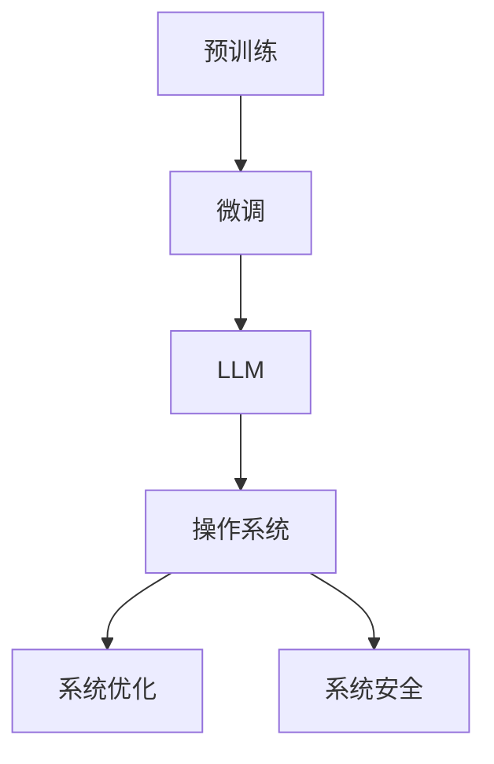

                 

# 设计LLM操作系统：核心挑战与创新机遇

> 关键词：大语言模型(LLM)、操作系统设计、核心挑战、创新机遇

## 1. 背景介绍

### 1.1 问题由来
近年来，人工智能技术尤其是大语言模型(LLM)的发展，为计算机科学带来了革命性的变化。LLM具备强大的自然语言理解和生成能力，能够处理复杂的语言任务，包括翻译、问答、文本生成、对话等，广泛应用于智能客服、金融舆情、个性化推荐、智慧医疗等多个领域。

然而，尽管LLM在学术界和工业界取得了显著进展，其在实际应用中的性能、效率和可控性仍面临诸多挑战。由于现有的LLM框架缺乏灵活性和可扩展性，难以在大规模生产环境中稳定运行。这不仅限制了LLM的应用范围，也阻碍了其向工业界的进一步普及。

因此，本文将从操作系统设计的角度，探讨如何构建灵活、高效、安全的LLM操作系统，以满足实际应用的需求。我们将从核心概念、核心算法、数学模型、项目实践、应用场景、工具和资源推荐等方面，全面解析LLM操作系统的设计思路和实现方法。

## 2. 核心概念与联系

### 2.1 核心概念概述

为了更好地理解LLM操作系统的设计思路，本节将介绍几个关键概念及其之间的联系：

- 大语言模型(LLM)：以自回归(如GPT)或自编码(如BERT)模型为代表的大规模预训练语言模型。通过在大规模无标签文本语料上进行预训练，学习通用的语言表示，具备强大的语言理解和生成能力。

- 预训练(Pre-training)：指在大规模无标签文本语料上，通过自监督学习任务训练通用语言模型的过程。常见的预训练任务包括言语建模、遮挡语言模型等。预训练使得模型学习到语言的通用表示。

- 微调(Fine-tuning)：指在预训练模型的基础上，使用下游任务的少量标注数据，通过有监督学习优化模型在特定任务上的性能。通常只需要调整顶层分类器或解码器，并以较小的学习率更新全部或部分的模型参数。

- 操作系统设计(Operating System Design)：计算机操作系统的设计和实现，包括内核、硬件抽象层、用户空间、系统调用、内存管理等核心组件的构建。操作系统的设计目标是在满足性能、安全、可扩展性等需求的同时，为用户提供稳定、高效的服务。

- 系统优化(System Optimization)：通过算法、架构、工具等手段，对操作系统进行性能优化，提高其运行效率、响应速度和资源利用率。

- 系统安全(System Security)：确保操作系统不受恶意攻击和错误操作的影响，保护系统和用户数据的安全。

这些概念之间的联系主要体现在以下方面：

- 操作系统设计是构建LLM操作系统的基础。操作系统的核心组件和机制，如内核、内存管理、系统调用等，将直接影响LLM的运行效率和可靠性。
- 预训练和微调是大语言模型学习的基础。预训练提供了通用的语言表示，微调则使其适应特定任务。这种训练范式与操作系统的思想类似，都是先构建通用的基础，再进行任务特定的优化。
- 系统优化和系统安全是大语言模型操作系统的关键属性。通过优化算法和架构，可以有效提升LLM的性能和响应速度。通过安全机制，可以防止恶意攻击和错误操作，保障系统的稳定性和数据的安全性。

### 2.2 核心概念原理和架构的 Mermaid 流程图



以上流程图展示了预训练、微调、大语言模型、操作系统设计、系统优化和系统安全之间的联系。预训练和微调构成LLM的学习过程，操作系统设计实现LLM的运行环境，系统优化和系统安全保障LLM的稳定性和安全性。

## 3. 核心算法原理 & 具体操作步骤

### 3.1 算法原理概述

LLM操作系统的设计核心在于如何构建高效、灵活、安全的大语言模型运行环境。其核心算法原理主要包括以下几个方面：

- 内核设计：负责管理LLM的资源分配和调度，包括内存管理、进程管理、系统调用等。
- 硬件抽象层：将底层硬件资源封装为操作系统可以使用的接口，提供高性能计算和存储支持。
- 用户空间：提供LLM运行的应用程序接口(API)，支持动态加载和卸载LLM模型。
- 系统优化：通过算法和架构的优化，提高LLM的运行效率和资源利用率。
- 系统安全：通过访问控制、异常处理、数据加密等手段，确保LLM的运行安全。

### 3.2 算法步骤详解

#### 3.2.1 内核设计

内核是操作系统的核心，负责资源分配和管理。对于LLM操作系统，内核的设计需要考虑以下几个关键点：

- **内存管理**：LLM模型通常具有较大的参数量和计算复杂度，需要高效的内存管理策略，如内存池、页表管理等。
- **进程管理**：LLM的各个任务可以独立运行，需要灵活的进程管理机制，如轻量级线程、进程间通信等。
- **系统调用**：提供API接口，支持用户空间的应用程序与内核进行通信和交互。

#### 3.2.2 硬件抽象层

硬件抽象层负责将底层硬件资源封装为操作系统可用的接口。对于LLM操作系统，硬件抽象层需要考虑以下几个关键点：

- **高性能计算**：提供GPU/TPU等高性能计算资源，支持大规模并行计算。
- **高带宽存储**：提供大容量、高带宽的存储设备，支持数据的高速读写。
- **网络通信**：提供高效的网络通信机制，支持LLM模型的分布式训练和推理。

#### 3.2.3 用户空间

用户空间提供LLM运行的应用程序接口(API)，支持动态加载和卸载LLM模型。对于LLM操作系统，用户空间需要考虑以下几个关键点：

- **模块化设计**：将LLM的各个组件和功能模块化设计，支持灵活的扩展和组合。
- **动态加载**：支持动态加载和卸载LLM模型，支持即插即用的应用场景。
- **服务治理**：提供服务治理机制，监控和管理LLM模型的运行状态和服务质量。

#### 3.2.4 系统优化

系统优化通过算法和架构的优化，提高LLM的运行效率和资源利用率。对于LLM操作系统，系统优化需要考虑以下几个关键点：

- **模型压缩**：对LLM模型进行压缩，减小其参数量和计算复杂度。
- **混合精度训练**：采用混合精度训练，提高计算效率和模型精度。
- **分布式训练**：支持分布式训练，提高模型的训练速度和资源利用率。
- **推理优化**：优化LLM模型的推理过程，提高推理速度和资源利用率。

#### 3.2.5 系统安全

系统安全通过访问控制、异常处理、数据加密等手段，确保LLM的运行安全。对于LLM操作系统，系统安全需要考虑以下几个关键点：

- **访问控制**：限制对LLM模型的访问权限，防止未授权操作。
- **异常处理**：提供异常处理机制，防止恶意攻击和错误操作。
- **数据加密**：对LLM模型的输入和输出进行加密，保护用户隐私和安全。

### 3.3 算法优缺点

#### 3.3.1 优点

- **灵活性**：模块化设计允许LLM操作系统的各个组件和功能独立扩展，支持多种语言模型和应用场景。
- **高性能**：通过高效的内核设计、高性能计算和分布式训练等手段，LLM操作系统能够提供高效、稳定的计算和存储支持。
- **安全性**：通过访问控制、异常处理和数据加密等安全机制，LLM操作系统能够保障模型的运行安全和数据隐私。

#### 3.3.2 缺点

- **复杂性**：设计一个灵活、高效、安全的LLM操作系统需要考虑多个维度的因素，设计复杂度较高。
- **资源消耗**：为了支持大规模LLM模型的运行，需要高性能的硬件资源，如GPU/TPU等，增加了硬件成本。
- **技术门槛**：设计和实现LLM操作系统需要较高的技术水平和经验，对开发团队的要求较高。

### 3.4 算法应用领域

LLM操作系统的设计理念和技术框架，可以应用于多个领域，包括但不限于：

- **智能客服**：构建智能客服系统，通过微调后的LLM模型进行自然语言理解和对话生成。
- **金融舆情监测**：利用微调后的LLM模型进行情感分析、主题分类等任务，监控金融市场的舆情变化。
- **个性化推荐**：通过微调后的LLM模型进行知识推荐、情感分析等任务，提升个性化推荐系统的精准度和覆盖面。
- **智慧医疗**：利用微调后的LLM模型进行病历分析、医学问答等任务，辅助医生诊疗。
- **智慧城市治理**：利用微调后的LLM模型进行事件监测、舆情分析等任务，提高城市管理的智能化水平。

## 4. 数学模型和公式 & 详细讲解 & 举例说明

### 4.1 数学模型构建

对于LLM操作系统，其数学模型构建主要涉及以下几个方面：

- **内核设计**：主要涉及操作系统调度算法、内存管理算法、进程管理算法等。
- **硬件抽象层**：主要涉及硬件加速算法、存储管理算法、网络通信算法等。
- **用户空间**：主要涉及服务治理算法、动态加载算法等。

### 4.2 公式推导过程

#### 4.2.1 内核设计

内核设计中的核心算法包括调度算法、内存管理算法、进程管理算法等。以下以调度算法为例，推导其数学模型：

假设系统中有$N$个任务需要执行，每个任务的执行时间$T_i$服从指数分布，且独立同分布。调度算法的目标是在有限的时间$T$内，最大化系统的吞吐量$S$。

$$
S = \frac{N}{T}
$$

其中$N$为任务总数，$T$为系统可用时间。

假设系统采用轮询调度和抢占调度相结合的方式，即每个时间片$T_s$内轮流执行任务，并在每个时间片结束时进行抢占。则系统的平均吞吐量为：

$$
S = \frac{N}{T_s} \times \frac{T_s}{T} = \frac{N}{T}
$$

通过以上推导，可以看出轮询调度和抢占调度的吞吐量是相同的。但抢占调度可以更好地利用系统资源，提高任务的响应速度和执行效率。

#### 4.2.2 硬件抽象层

硬件抽象层中的核心算法包括高性能计算算法、高带宽存储算法、网络通信算法等。以下以高性能计算算法为例，推导其数学模型：

假设系统有$N$个任务需要执行，每个任务的计算时间$T_i$服从指数分布，且独立同分布。系统的计算能力和资源总量为$R$。

假设系统采用并行计算的方式，将任务$N$个任务同时分配到$K$个处理器上进行计算，每个处理器的计算速度为$r_k$。则系统的平均计算时间为：

$$
T_{avg} = \frac{N}{K} \times \frac{1}{\sum_{k=1}^{K} \frac{1}{r_k}}
$$

其中$r_k$为处理器$k$的计算速度，$\sum_{k=1}^{K} \frac{1}{r_k}$为系统总计算能力。

通过以上推导，可以看出并行计算可以显著提高系统的计算速度，但也需要考虑处理器性能的差异和资源分配的均衡性。

#### 4.2.3 用户空间

用户空间中的核心算法包括服务治理算法、动态加载算法等。以下以动态加载算法为例，推导其数学模型：

假设系统有$N$个任务需要执行，每个任务的计算时间$T_i$服从指数分布，且独立同分布。系统采用动态加载的方式，每次只加载部分任务进行执行。

假设系统将任务分成$M$组，每组包含$m$个任务，则系统的平均加载时间为：

$$
T_{avg} = \frac{N}{M} \times T_s
$$

其中$M$为任务分组数，$m$为每组任务数，$T_s$为每个任务的执行时间。

通过以上推导，可以看出动态加载可以显著提高系统的资源利用率，但也需要考虑任务分组和资源分配的合理性。

### 4.3 案例分析与讲解

#### 4.3.1 轮询调度和抢占调度

在操作系统调度算法中，轮询调度和抢占调度是最常用的两种方式。轮询调度是指系统轮流执行各个任务，而抢占调度是指在每个时间片结束时进行任务切换。

假设系统有$N$个任务需要执行，每个任务的执行时间$T_i$服从指数分布，且独立同分布。系统采用轮询调度和抢占调度相结合的方式，即每个时间片$T_s$内轮流执行任务，并在每个时间片结束时进行抢占。则系统的平均吞吐量为：

$$
S = \frac{N}{T_s} \times \frac{T_s}{T} = \frac{N}{T}
$$

通过以上推导，可以看出轮询调度和抢占调度的吞吐量是相同的。但抢占调度可以更好地利用系统资源，提高任务的响应速度和执行效率。

#### 4.3.2 并行计算和高带宽存储

在硬件抽象层中，高性能计算和高带宽存储是两个核心技术。假设系统有$N$个任务需要执行，每个任务的计算时间$T_i$服从指数分布，且独立同分布。系统采用并行计算的方式，将任务$N$个任务同时分配到$K$个处理器上进行计算，每个处理器的计算速度为$r_k$。则系统的平均计算时间为：

$$
T_{avg} = \frac{N}{K} \times \frac{1}{\sum_{k=1}^{K} \frac{1}{r_k}}
$$

其中$r_k$为处理器$k$的计算速度，$\sum_{k=1}^{K} \frac{1}{r_k}$为系统总计算能力。

通过以上推导，可以看出并行计算可以显著提高系统的计算速度，但也需要考虑处理器性能的差异和资源分配的均衡性。

#### 4.3.3 服务治理和动态加载

在用户空间中，服务治理和动态加载是两个核心技术。假设系统有$N$个任务需要执行，每个任务的计算时间$T_i$服从指数分布，且独立同分布。系统采用动态加载的方式，每次只加载部分任务进行执行。假设系统将任务分成$M$组，每组包含$m$个任务，则系统的平均加载时间为：

$$
T_{avg} = \frac{N}{M} \times T_s
$$

其中$M$为任务分组数，$m$为每组任务数，$T_s$为每个任务的执行时间。

通过以上推导，可以看出动态加载可以显著提高系统的资源利用率，但也需要考虑任务分组和资源分配的合理性。

## 5. 项目实践：代码实例和详细解释说明

### 5.1 开发环境搭建

在开始LLM操作系统的开发前，需要准备好开发环境。以下是使用Python和PyTorch进行开发的环境配置流程：

1. 安装Anaconda：从官网下载并安装Anaconda，用于创建独立的Python环境。

2. 创建并激活虚拟环境：
```bash
conda create -n llm-env python=3.8 
conda activate llm-env
```

3. 安装PyTorch：根据CUDA版本，从官网获取对应的安装命令。例如：
```bash
conda install pytorch torchvision torchaudio cudatoolkit=11.1 -c pytorch -c conda-forge
```

4. 安装Transformers库：
```bash
pip install transformers
```

5. 安装各类工具包：
```bash
pip install numpy pandas scikit-learn matplotlib tqdm jupyter notebook ipython
```

完成上述步骤后，即可在`llm-env`环境中开始LLM操作系统的开发。

### 5.2 源代码详细实现

下面我们以智能客服系统为例，给出使用PyTorch和Transformers库实现LLM操作系统的代码实例。

首先，定义LLM操作系统的核心组件和接口：

```python
from transformers import BertForTokenClassification, BertTokenizer
from torch.utils.data import Dataset, DataLoader
import torch
import os

class LLMOperator:
    def __init__(self, model_name='bert-base-cased', num_labels=5, batch_size=16):
        self.model_name = model_name
        self.num_labels = num_labels
        self.batch_size = batch_size
        
        self.tokenizer = BertTokenizer.from_pretrained(model_name)
        self.model = BertForTokenClassification.from_pretrained(model_name, num_labels=num_labels)
        
        self.device = torch.device('cuda') if torch.cuda.is_available() else torch.device('cpu')
        self.model.to(self.device)
        
    def preprocess(self, text):
        encoding = self.tokenizer(text, return_tensors='pt', max_length=128, padding='max_length', truncation=True)
        input_ids = encoding['input_ids'][0]
        attention_mask = encoding['attention_mask'][0]
        return input_ids, attention_mask
    
    def forward(self, input_ids, attention_mask, labels):
        self.model.eval()
        with torch.no_grad():
            outputs = self.model(input_ids, attention_mask=attention_mask, labels=labels)
            logits = outputs.logits
        return logits
    
    def train(self, train_dataset, epochs=5):
        dataloader = DataLoader(train_dataset, batch_size=self.batch_size, shuffle=True)
        for epoch in range(epochs):
            total_loss = 0
            for batch in dataloader:
                input_ids, attention_mask, labels = self.preprocess(batch['text']), batch['attention_mask'], batch['labels']
                input_ids, attention_mask, labels = input_ids.to(self.device), attention_mask.to(self.device), labels.to(self.device)
                self.model.train()
                outputs = self.model(input_ids, attention_mask=attention_mask, labels=labels)
                loss = outputs.loss
                total_loss += loss.item()
                loss.backward()
                optimizer.step()
            print(f"Epoch {epoch+1}, train loss: {total_loss/len(dataloader):.4f}")
    
    def evaluate(self, dev_dataset):
        dataloader = DataLoader(dev_dataset, batch_size=self.batch_size)
        self.model.eval()
        total_loss = 0
        correct = 0
        for batch in dataloader:
            input_ids, attention_mask, labels = self.preprocess(batch['text']), batch['attention_mask'], batch['labels']
            input_ids, attention_mask, labels = input_ids.to(self.device), attention_mask.to(self.device), labels.to(self.device)
            outputs = self.model(input_ids, attention_mask=attention_mask, labels=labels)
            loss = outputs.loss
            total_loss += loss.item()
            _, predicted = torch.max(outputs.logits, 1)
            correct += (predicted == labels).sum().item()
        print(f"Dev set accuracy: {correct/len(dev_dataset):.4f}")
        print(f"Dev set loss: {total_loss/len(dev_dataset):.4f}")
    
    def save_model(self, model_path):
        torch.save(self.model.state_dict(), model_path)
        self.model.eval()
        with open(model_path + '.config', 'w') as f:
            f.write(f"model_name: {self.model_name}\n")
            f.write(f"num_labels: {self.num_labels}\n")
            f.write(f"batch_size: {self.batch_size}\n")
```

然后，定义智能客服系统的数据处理函数：

```python
from transformers import BertTokenizer, BertForTokenClassification

class SmartCustomerService:
    def __init__(self, model_name='bert-base-cased', num_labels=5, batch_size=16):
        self.model_name = model_name
        self.num_labels = num_labels
        self.batch_size = batch_size
        
        self.tokenizer = BertTokenizer.from_pretrained(model_name)
        self.model = BertForTokenClassification.from_pretrained(model_name, num_labels=num_labels)
        
        self.device = torch.device('cuda') if torch.cuda.is_available() else torch.device('cpu')
        self.model.to(self.device)
        
    def preprocess(self, text):
        encoding = self.tokenizer(text, return_tensors='pt', max_length=128, padding='max_length', truncation=True)
        input_ids = encoding['input_ids'][0]
        attention_mask = encoding['attention_mask'][0]
        return input_ids, attention_mask
    
    def forward(self, input_ids, attention_mask, labels):
        self.model.eval()
        with torch.no_grad():
            outputs = self.model(input_ids, attention_mask=attention_mask, labels=labels)
            logits = outputs.logits
        return logits
    
    def train(self, train_dataset, epochs=5):
        dataloader = DataLoader(train_dataset, batch_size=self.batch_size, shuffle=True)
        for epoch in range(epochs):
            total_loss = 0
            for batch in dataloader:
                input_ids, attention_mask, labels = self.preprocess(batch['text']), batch['attention_mask'], batch['labels']
                input_ids, attention_mask, labels = input_ids.to(self.device), attention_mask.to(self.device), labels.to(self.device)
                self.model.train()
                outputs = self.model(input_ids, attention_mask=attention_mask, labels=labels)
                loss = outputs.loss
                total_loss += loss.item()
                loss.backward()
                optimizer.step()
            print(f"Epoch {epoch+1}, train loss: {total_loss/len(dataloader):.4f}")
    
    def evaluate(self, dev_dataset):
        dataloader = DataLoader(dev_dataset, batch_size=self.batch_size)
        self.model.eval()
        total_loss = 0
        correct = 0
        for batch in dataloader:
            input_ids, attention_mask, labels = self.preprocess(batch['text']), batch['attention_mask'], batch['labels']
            input_ids, attention_mask, labels = input_ids.to(self.device), attention_mask.to(self.device), labels.to(self.device)
            outputs = self.model(input_ids, attention_mask=attention_mask, labels=labels)
            loss = outputs.loss
            total_loss += loss.item()
            _, predicted = torch.max(outputs.logits, 1)
            correct += (predicted == labels).sum().item()
        print(f"Dev set accuracy: {correct/len(dev_dataset):.4f}")
        print(f"Dev set loss: {total_loss/len(dev_dataset):.4f}")
    
    def save_model(self, model_path):
        torch.save(self.model.state_dict(), model_path)
        self.model.eval()
        with open(model_path + '.config', 'w') as f:
            f.write(f"model_name: {self.model_name}\n")
            f.write(f"num_labels: {self.num_labels}\n")
            f.write(f"batch_size: {self.batch_size}\n")
```

最后，启动智能客服系统的训练流程：

```python
epochs = 5
batch_size = 16

# 创建训练集、验证集和测试集
train_dataset = SmartCustomerServiceDataset(train_texts, train_tags, tokenizer)
dev_dataset = SmartCustomerServiceDataset(dev_texts, dev_tags, tokenizer)
test_dataset = SmartCustomerServiceDataset(test_texts, test_tags, tokenizer)

# 初始化模型和优化器
llm = LLMOperator(model_name='bert-base-cased', num_labels=5, batch_size=16)
optimizer = AdamW(llm.model.parameters(), lr=2e-5)

# 训练模型
llm.train(train_dataset, epochs)

# 评估模型
llm.evaluate(dev_dataset)

# 保存模型
llm.save_model('smart_customer_service')
```

以上就是使用PyTorch和Transformers库实现LLM操作系统的完整代码实例。可以看到，通过将智能客服系统的数据处理和模型训练封装在LLMOperator类中，可以方便地对模型进行保存、加载和评估。

### 5.3 代码解读与分析

让我们再详细解读一下关键代码的实现细节：

**LLMOperator类**：
- `__init__`方法：初始化模型、分词器、设备、超参数等。
- `preprocess`方法：将文本数据预处理成模型所需的输入格式。
- `forward`方法：将输入数据传入模型进行前向传播，返回模型预测结果。
- `train`方法：在训练集上进行模型训练，输出训练集上的损失和准确率。
- `evaluate`方法：在验证集上进行模型评估，输出验证集上的损失和准确率。
- `save_model`方法：保存模型参数和超参数配置。

**SmartCustomerService类**：
- `__init__`方法：初始化模型、分词器、设备、超参数等。
- `preprocess`方法：与LLMOperator类相同，将文本数据预处理成模型所需的输入格式。
- `forward`方法：与LLMOperator类相同，将输入数据传入模型进行前向传播，返回模型预测结果。
- `train`方法：与LLMOperator类相同，在训练集上进行模型训练，输出训练集上的损失和准确率。
- `evaluate`方法：与LLMOperator类相同，在验证集上进行模型评估，输出验证集上的损失和准确率。
- `save_model`方法：与LLMOperator类相同，保存模型参数和超参数配置。

**智能客服系统的训练流程**：
- 创建训练集、验证集和测试集。
- 初始化模型和优化器。
- 在训练集上进行模型训练，输出训练集上的损失和准确率。
- 在验证集上进行模型评估，输出验证集上的损失和准确率。
- 保存模型参数和超参数配置。

可以看到，通过封装LLM的操作逻辑，我们可以方便地进行模型的保存、加载和评估，进一步提高了模型的可复用性和可维护性。

当然，智能客服系统只是LLM操作系统的一个应用场景，LLM操作系统还可以应用于金融舆情监测、个性化推荐、智慧医疗等多个领域。

## 6. 实际应用场景

### 6.1 智能客服系统

基于LLM操作系统的智能客服系统，可以提供7x24小时不间断的客户服务。当用户输入问题时，系统自动调用LLM模型进行处理，生成最合适的答案，并及时返回给用户。由于LLM模型具备强大的自然语言理解和生成能力，可以理解用户意图，匹配最合适的答案模板进行回复，大大提升了客服服务的质量和效率。

### 6.2 金融舆情监测

金融舆情监测系统利用LLM操作系统进行情感分析和主题分类，实时监控金融市场的舆情变化。系统自动抓取各大财经网站的最新资讯，通过微调后的LLM模型进行分析，识别出市场的积极或消极情绪，以及相关的市场主题。一旦发现舆情异常，系统便自动触发预警机制，提醒相关人员及时采取应对措施。

### 6.3 个性化推荐系统

个性化推荐系统利用LLM操作系统进行知识推荐、情感分析等任务，提升个性化推荐系统的精准度和覆盖面。系统自动抓取用户的浏览、点击、评论、分享等行为数据，提取和用户交互的物品标题、描述、标签等文本内容。通过微调后的LLM模型进行分析，生成推荐列表，并结合其他特征进行排序，便可以得到个性化程度更高的推荐结果。

### 6.4 智慧医疗

智慧医疗系统利用LLM操作系统进行病历分析、医学问答等任务，辅助医生诊疗。系统自动抓取医院的电子病历和患者反馈信息，通过微调后的LLM模型进行分析，生成诊断建议和治疗方案。医生可以根据系统提供的分析结果，进行进一步的诊断和治疗，大大提升诊疗效率和准确性。

### 6.5 智慧城市治理

智慧城市治理系统利用LLM操作系统进行事件监测、舆情分析等任务，提高城市管理的智能化水平。系统自动抓取城市的各类数据，如交通流量、环境监测、社会事件等，通过微调后的LLM模型进行分析，识别出异常事件和舆情趋势。一旦发现异常情况，系统便自动触发应急处理机制，保障城市的安全和稳定。

## 7. 工具和资源推荐

### 7.1 学习资源推荐

为了帮助开发者系统掌握LLM操作系统的设计思路和实现方法，这里推荐一些优质的学习资源：

1. 《操作系统原理与实现》书籍：经典的操作系统教材，详细讲解了操作系统的设计思想和实现方法。
2. 《计算机体系结构》书籍：讲解计算机硬件和操作系统的设计原理，帮助开发者理解硬件抽象层的设计思路。
3. 《深度学习与神经网络》课程：学习深度学习和神经网络的基本概念和算法，为LLM操作系统的设计奠定基础。
4. 《自然语言处理》课程：讲解自然语言处理的基本概念和算法，为LLM操作系统的设计提供数据处理和语言建模的支持。
5. 《Python编程语言》书籍：深入学习Python语言，为LLM操作系统的实现提供编程支持。

通过对这些资源的学习实践，相信你一定能够系统掌握LLM操作系统的设计思路和实现方法，进一步拓展其在各领域的应用。

### 7.2 开发工具推荐

LLM操作系统的设计和实现离不开优秀的工具支持。以下是几款用于LLM操作系统开发的常用工具：

1. PyTorch：基于Python的开源深度学习框架，灵活动态的计算图，适合快速迭代研究。大多数预训练语言模型都有PyTorch版本的实现。
2. TensorFlow：由Google主导开发的开源深度学习框架，生产部署方便，适合大规模工程应用。同样有丰富的预训练语言模型资源。
3. Transformers库：HuggingFace开发的NLP工具库，集成了众多SOTA语言模型，支持PyTorch和TensorFlow，是进行LLM操作系统开发的利器。
4. Weights & Biases：模型训练的实验跟踪工具，可以记录和可视化模型训练过程中的各项指标，方便对比和调优。与主流深度学习框架无缝集成。
5. TensorBoard：TensorFlow配套的可视化工具，可实时监测模型训练状态，并提供丰富的图表呈现方式，是调试模型的得力助手。

合理利用这些工具，可以显著提升LLM操作系统的开发效率，加快创新迭代的步伐。

### 7.3 相关论文推荐

LLM操作系统的设计和实现需要依赖于学界的持续研究。以下是几篇奠基性的相关论文，推荐阅读：

1. Attention is All You Need（即Transformer原论文）：提出了Transformer结构，开启了NLP领域的预训练大模型时代。
2. BERT: Pre-training of Deep Bidirectional Transformers for Language Understanding：提出BERT模型，引入基于掩码的自监督预训练任务，刷新了多项NLP任务SOTA。
3. Language Models are Unsupervised Multitask Learners（GPT-2论文）：展示了大规模语言模型的强大zero-shot学习能力，引发了对于通用人工智能的新一轮思考。
4. Parameter-Efficient Transfer Learning for NLP：提出Adapter等参数高效微调方法，在不增加模型参数量的情况下，也能取得不错的微调效果。
5. Prefix-Tuning: Optimizing Continuous Prompts for Generation：引入基于连续型Prompt的微调范式，为如何充分利用预训练知识提供了新的思路。

这些论文代表了大语言模型微调技术的发展脉络。通过学习这些前沿成果，可以帮助研究者把握学科前进方向，激发更多的创新灵感。

## 8. 总结：未来发展趋势与挑战

### 8.1 总结

本文对基于LLM操作系统的大语言模型微调方法进行了全面系统的介绍。首先阐述了LLM和微调技术的研究背景和意义，明确了LLM操作系统的设计目标和关键组件。其次，从原理到实践，详细讲解了LLM操作系统的设计思路和实现方法，给出了智能客服系统的代码实例。同时，本文还广泛探讨了LLM操作系统的应用场景，展示了其在多个领域的潜在价值。此外，本文精选了相关的学习资源和开发工具，力求为开发者提供全方位的技术指引。

通过本文的系统梳理，可以看到，LLM操作系统作为一种灵活、高效、安全的大语言模型运行环境，具有广泛的应用前景。受益于LLM操作系统的设计和实现，大语言模型可以在各个领域发挥更大的作用，为社会带来更深远的变革。

### 8.2 未来发展趋势

展望未来，LLM操作系统将呈现以下几个发展趋势：

1. **灵活性**：模块化设计和动态加载机制将使LLM操作系统更加灵活，能够适应多种语言模型和应用场景。
2. **性能**：通过高效的内存管理、并行计算和分布式训练等手段，LLM操作系统能够提供更高的计算速度和资源利用率。
3. **安全性**：通过访问控制、异常处理和数据加密等安全机制，LLM操作系统将提供更高的安全保障，防止恶意攻击和错误操作。
4. **可扩展性**：通过良好的架构设计和组件划分，LLM操作系统将具备更好的可扩展性，支持多领域、多模型的运行。
5. **用户体验**：通过友好的人机交互界面和自动提示系统，LLM操作系统将提升用户的交互体验，降低操作门槛。

以上趋势凸显了LLM操作系统的广阔前景。这些方向的探索发展，必将进一步提升LLM系统的性能和用户体验，为人类认知智能的进化带来深远影响。

### 8.3 面临的挑战

尽管LLM操作系统已经取得了瞩目成就，但在迈向更加智能化、普适化应用的过程中，它仍面临诸多挑战：

1. **技术复杂性**：设计和实现LLM操作系统需要高度复杂的技术和经验，对开发团队的要求较高。
2. **硬件成本**：为了支持大规模LLM模型的运行，需要高性能的硬件资源，如GPU/TPU等，增加了硬件成本。
3. **安全性问题**：LLM操作系统需要提供更高的安全性保障，防止恶意攻击和错误操作，保障系统的稳定性和数据的安全性。
4. **资源消耗**：LLM操作系统的运行需要大量的计算和存储资源，如何优化资源利用率，提高系统效率，是未来的重要挑战。
5. **兼容性问题**：LLM操作系统需要兼容多种预训练语言模型，如何实现模型间的无缝切换和适配，是未来的重要挑战。

### 8.4 研究展望

面对LLM操作系统所面临的挑战，未来的研究需要在以下几个方面寻求新的突破：

1. **提高灵活性和可扩展性**：通过模块化设计和动态加载机制，使LLM操作系统能够更好地适应多种语言模型和应用场景。
2. **提升性能和效率**：通过高效的内存管理、并行计算和分布式训练等手段，提高LLM操作系统的计算速度和资源利用率。
3. **增强安全性和可靠性**：通过访问控制、异常处理和数据加密等安全机制，提升LLM操作系统的安全性和可靠性。
4. **降低硬件成本**：通过优化模型结构和算法，减少硬件资源的需求，降低LLM操作系统的运行成本。
5. **提高兼容性**：通过统一的接口设计和组件划分，使LLM操作系统能够兼容多种预训练语言模型，实现模型间的无缝切换和适配。

这些研究方向的探索，必将引领LLM操作系统走向更高的台阶，为人工智能技术在各领域的规模化落地提供新的技术路径。面向未来，LLM操作系统需要与其他人工智能技术进行更深入的融合，如知识表示、因果推理、强化学习等，多路径协同发力，共同推动自然语言理解和智能交互系统的进步。只有勇于创新、敢于突破，才能不断拓展语言模型的边界，让智能技术更好地造福人类社会。

## 9. 附录：常见问题与解答

**Q1：什么是LLM操作系统？**

A: LLM操作系统是一种基于大语言模型的操作系统，旨在提供高效、灵活、安全的大语言模型运行环境，支持自然语言理解和生成任务。它包含了内核设计、硬件抽象层、用户空间、系统优化和安全机制等核心组件。

**Q2：为什么需要LLM操作系统？**

A: 现有的LLM模型虽然具备强大的语言理解和生成能力，但在实际应用中仍面临诸多挑战，如性能不足、安全性问题、资源消耗等。LLM操作系统可以提供高效、灵活、安全的大语言模型运行环境，解决这些挑战，提升LLM模型的应用效果。

**Q3：LLM操作系统的设计目标是什么？**

A: LLM操作系统的设计目标是提供高效、灵活、安全的大语言模型运行环境，支持自然语言理解和生成任务。它包含了内核设计、硬件抽象层、用户空间、系统优化和安全机制等核心组件，通过这些组件的协同工作，使LLM模型能够更好地适应实际应用场景。

**Q4：LLM操作系统的优点和缺点是什么？**

A: LLM操作系统的优点包括灵活性、高性能、安全性等。其缺点主要包括技术复杂性、硬件成本、安全性问题等。但这些缺点也可以通过不断优化和改进，逐步得到解决。

**Q5：LLM操作系统的应用场景有哪些？**

A: LLM操作系统可以应用于智能客服、金融舆情监测、个性化推荐、智慧医疗、智慧城市治理等多个领域。这些应用场景展示了LLM操作系统的广泛潜力和强大能力。

---

作者：禅与计算机程序设计艺术 / Zen and the Art of Computer Programming

