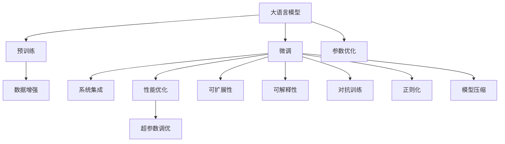

                 

# 设计和 LLM：创造协作

> 关键词：协作设计, 语言模型, 自然语言处理, 人工智能, 模型设计

## 1. 背景介绍

### 1.1 问题由来
随着人工智能（AI）技术的迅猛发展，尤其是在自然语言处理（Natural Language Processing, NLP）领域，大规模语言模型（Large Language Models, LLMs）已成为构建智能系统的重要基石。这些语言模型如GPT、BERT等，通过在海量无标签文本数据上进行预训练，学习到了复杂的语言结构和广泛的知识，能够进行各种自然语言理解和生成任务。然而，尽管预训练语言模型在许多基准测试中表现优异，但在实际应用中，我们需要设计特定的协作系统来满足实际需求。

在实际应用场景中，LLMs往往需要与其他系统和组件协作，以实现更具体的功能。例如，在智能客服系统中，LLMs需要与自然语言理解（NLU）和自然语言生成（NLG）模块协同工作；在机器翻译中，LLMs需要与编码器和解码器模型配合使用；在文本摘要中，LLMs需要与编辑距离算法和数据集等工具结合应用。

本文章将探讨如何设计和优化大语言模型，使其能够与各种系统和组件有效协作，从而创造出更加智能、高效的应用。

### 1.2 问题核心关键点
设计和优化大语言模型的核心关键点主要包括以下几个方面：

- **系统集成**：如何将LLMs与各种系统和组件进行无缝集成，以实现完整的协作流程。
- **性能优化**：如何提高LLMs在特定任务上的性能，避免过拟合和数据偏差。
- **可扩展性**：设计具有高度可扩展性的系统架构，以支持不同规模和复杂度的任务。
- **可解释性**：提升LLMs的输出解释能力，使其决策过程透明、可理解。
- **鲁棒性**：增强LLMs对各种输入异常和噪声的鲁棒性，以应对现实世界的复杂性。

### 1.3 问题研究意义
研究和设计大语言模型在实际应用中的协作系统，具有重要的理论和实际意义：

1. **提升应用效率**：优化LLMs与系统的协作流程，能够显著提高应用的处理速度和响应时间，提升用户体验。
2. **增强系统性能**：通过设计有效的集成和优化策略，能够提升LLMs在特定任务上的性能，使其在实际应用中表现更好。
3. **促进知识应用**：设计和优化LLMs可以更好地利用人类知识，使其在具体任务中表现更佳。
4. **保障系统安全**：通过鲁棒性和可解释性的提升，可以降低系统出错的风险，提高系统的可靠性和安全性。
5. **推动技术发展**：设计和优化大语言模型能够推动NLP技术的进步，为更多实际应用场景提供技术支持。

## 2. 核心概念与联系

### 2.1 核心概念概述

为更好地理解设计和优化大语言模型的方法，我们需要明确几个核心概念及其联系：

- **大语言模型（LLM）**：指通过大规模无标签数据预训练得到的语言模型，能够进行复杂的语言理解和生成任务。
- **预训练（Pre-training）**：指在大规模无标签数据上对LLM进行训练，使其学习到广泛的语言知识和结构。
- **微调（Fine-tuning）**：指在预训练的基础上，使用特定任务的标注数据对LLM进行有监督的优化，提升其在特定任务上的表现。
- **系统集成（System Integration）**：指将LLM与其他系统和组件进行协作，以实现具体应用功能。
- **性能优化（Performance Optimization）**：指在LLM应用中，通过优化参数、调整训练策略等方式，提高模型的性能和鲁棒性。
- **可扩展性（Scalability）**：指系统设计应支持不同规模和复杂度的任务，能够随着数据和任务的变化进行扩展。
- **可解释性（Explainability）**：指LLMs输出结果的透明性和可理解性，有助于提高系统的可信赖度。

这些概念之间相互联系，共同构成了设计和优化大语言模型的工作框架。以下通过Mermaid流程图展示这些概念之间的关系：



这个流程图展示了从预训练到微调，再到系统集成和性能优化的大语言模型开发流程。通过理解和应用这些概念，我们可以更好地设计和优化大语言模型，满足实际应用的需求。

## 3. 核心算法原理 & 具体操作步骤
### 3.1 算法原理概述

设计和优化大语言模型的核心算法原理主要包括：

- **系统集成算法**：设计如何通过接口、API等方式，将LLMs与其他系统和组件进行协作，实现特定应用功能。
- **性能优化算法**：在微调过程中，通过调整学习率、正则化、数据增强等技术，提升模型在特定任务上的性能。
- **可扩展性算法**：通过模块化设计、分布式训练等方式，提高系统的可扩展性，支持不同规模和复杂度的任务。
- **可解释性算法**：通过逻辑回归、特征可视化等方法，提升LLMs输出结果的可解释性，使其决策过程透明、可理解。
- **鲁棒性算法**：通过对抗训练、生成对抗网络（GAN）等技术，增强模型对各种输入异常和噪声的鲁棒性。

这些算法共同作用，可以设计和优化出高效、鲁棒、可扩展的大语言模型，满足实际应用需求。

### 3.2 算法步骤详解

设计和优化大语言模型的具体步骤包括：

**Step 1: 数据预处理**

- 收集和清洗数据：从数据源收集数据，并进行去重、清洗等处理，确保数据质量。
- 数据标注：对数据进行标注，生成标注数据集，为微调提供监督信号。
- 数据分割：将数据集划分为训练集、验证集和测试集，用于模型训练、验证和测试。

**Step 2: 模型选择与设计**

- 选择合适的LLM架构：如GPT、BERT等，根据任务需求选择最合适的模型。
- 设计系统架构：确定LLM与系统其他组件的接口和交互方式。
- 确定超参数：设置学习率、批大小、迭代轮数等超参数，优化模型性能。

**Step 3: 预训练与微调**

- 进行预训练：在大规模无标签数据上对LLM进行预训练，学习通用的语言表示。
- 进行微调：在特定任务的标注数据集上对预训练模型进行微调，提升其在特定任务上的表现。
- 优化超参数：根据验证集性能调整超参数，避免过拟合和欠拟合。

**Step 4: 系统集成**

- 设计API接口：定义LLM与系统其他组件之间的API接口，实现数据传递和结果返回。
- 实现协作流程：根据任务需求，设计LLM与其他组件协作的具体流程。
- 测试与优化：在实际应用场景中，测试系统性能，根据反馈不断优化系统架构和LLM参数。

**Step 5: 性能优化**

- 参数优化：根据验证集性能调整模型参数，优化模型性能。
- 对抗训练：引入对抗样本，提高模型鲁棒性。
- 数据增强：通过对训练样本进行改写、回译等方式，增强数据多样性，避免过拟合。

**Step 6: 可扩展性设计**

- 模块化设计：将系统设计为多个模块，每个模块负责特定功能，便于扩展和维护。
- 分布式训练：利用多台机器进行分布式训练，提高训练速度和模型性能。
- 动态扩展：根据任务需求，动态调整系统资源配置，支持不同规模和复杂度的任务。

**Step 7: 可解释性增强**

- 特征可视化：通过可视化特征，了解模型学习到的知识，增强可解释性。
- 逻辑回归：通过逻辑回归等方法，解释模型的输出结果，提高可解释性。
- 解释性框架：使用如SHAP、LIME等解释性框架，对模型输出进行解释和可视化。

**Step 8: 鲁棒性提升**

- 对抗训练：通过对抗样本训练，提高模型鲁棒性。
- 生成对抗网络（GAN）：利用GAN生成对抗样本，增强模型的鲁棒性。
- 鲁棒性测试：在鲁棒性测试集上评估模型性能，不断优化模型设计。

### 3.3 算法优缺点

设计和优化大语言模型的算法具有以下优点：

- **高效性**：通过系统集成和性能优化，可以显著提高LLM在特定任务上的性能，提升应用效率。
- **可扩展性**：模块化设计和分布式训练，使得系统具有高度可扩展性，支持不同规模和复杂度的任务。
- **鲁棒性**：对抗训练和生成对抗网络等技术，增强了模型的鲁棒性，提高了系统的稳定性和可靠性。
- **可解释性**：通过可解释性算法，提高了LLM输出结果的透明性和可理解性，增强了系统的可信度。

同时，这些算法也存在一定的局限性：

- **数据依赖**：模型性能高度依赖于数据质量，低质量的数据可能导致模型性能下降。
- **计算资源需求高**：大规模LLM预训练和微调需要大量的计算资源，可能存在硬件瓶颈。
- **系统复杂性高**：设计和优化LLM系统涉及多个组件和模块，系统设计复杂度较高。
- **可解释性有限**：目前大部分LLM模型仍然缺乏严格的可解释性，难以对其内部工作机制进行详细解释。

尽管存在这些局限性，设计和优化大语言模型的方法仍然是实现智能系统的有效途径。未来研究将进一步探索如何降低数据依赖、优化计算资源利用、提升系统可解释性等关键问题，推动LLM技术的发展和应用。

### 3.4 算法应用领域

设计和优化大语言模型的算法已经在多个领域得到应用，如智能客服、金融分析、智能家居、自动驾驶等。以下列举几个典型应用场景：

**智能客服**

智能客服系统通过设计和优化LLM，能够自动理解用户意图，提供个性化服务。例如，基于微调的模型可以处理用户的常见问题，生成合适的回复，提升用户满意度。

**金融分析**

在金融领域，LLM可以用于智能投顾、风险评估、情感分析等。通过设计和优化LLM，系统可以自动分析金融市场趋势，评估投资风险，预测市场变化，提高决策效率和准确性。

**智能家居**

智能家居系统通过LLM实现语音控制、智能场景推荐等功能。设计和优化LLM，可以提升系统的智能化水平，为用户提供更加自然、便捷的交互体验。

**自动驾驶**

自动驾驶系统通过LLM实现语音识别、路径规划、行人识别等功能。设计和优化LLM，可以提高系统的感知和决策能力，提升自动驾驶的安全性和可靠性。

## 4. 数学模型和公式 & 详细讲解  
### 4.1 数学模型构建

设计和优化大语言模型的数学模型主要包括：

- **预训练模型**：通过在大规模无标签数据上对LLM进行预训练，学习通用的语言表示。
- **微调模型**：在特定任务的标注数据集上对预训练模型进行微调，提升其在特定任务上的表现。
- **系统集成模型**：通过接口和API，将LLM与其他系统组件进行协作，实现特定应用功能。
- **性能优化模型**：通过调整学习率、正则化等技术，提升模型在特定任务上的性能。
- **可扩展性模型**：通过模块化设计、分布式训练等方式，提高系统的可扩展性。
- **可解释性模型**：通过特征可视化、逻辑回归等方法，提升LLM输出结果的可解释性。
- **鲁棒性模型**：通过对抗训练、生成对抗网络等技术，增强模型的鲁棒性。

以下以二分类任务为例，推导微调模型的数学公式。

假设模型 $M_{\theta}$ 在输入 $x$ 上的输出为 $\hat{y}=M_{\theta}(x) \in [0,1]$，表示样本属于正类的概率。真实标签 $y \in \{0,1\}$。则二分类交叉熵损失函数定义为：

$$
\ell(M_{\theta}(x),y) = -[y\log \hat{y} + (1-y)\log (1-\hat{y})]
$$

将上述公式代入经验风险公式，得：

$$
\mathcal{L}(\theta) = -\frac{1}{N}\sum_{i=1}^N [y_i\log M_{\theta}(x_i)+(1-y_i)\log(1-M_{\theta}(x_i))]
$$

在得到损失函数梯度后，即可带入参数更新公式，完成模型的迭代优化。

### 4.2 公式推导过程

以下以二分类任务为例，推导交叉熵损失函数及其梯度的计算公式。

假设模型 $M_{\theta}$ 在输入 $x$ 上的输出为 $\hat{y}=M_{\theta}(x) \in [0,1]$，表示样本属于正类的概率。真实标签 $y \in \{0,1\}$。则二分类交叉熵损失函数定义为：

$$
\ell(M_{\theta}(x),y) = -[y\log \hat{y} + (1-y)\log (1-\hat{y})]
$$

将其代入经验风险公式，得：

$$
\mathcal{L}(\theta) = -\frac{1}{N}\sum_{i=1}^N [y_i\log M_{\theta}(x_i)+(1-y_i)\log(1-M_{\theta}(x_i))]
$$

根据链式法则，损失函数对参数 $\theta_k$ 的梯度为：

$$
\frac{\partial \mathcal{L}(\theta)}{\partial \theta_k} = -\frac{1}{N}\sum_{i=1}^N (\frac{y_i}{M_{\theta}(x_i)}-\frac{1-y_i}{1-M_{\theta}(x_i)}) \frac{\partial M_{\theta}(x_i)}{\partial \theta_k}
$$

其中 $\frac{\partial M_{\theta}(x_i)}{\partial \theta_k}$ 可进一步递归展开，利用自动微分技术完成计算。

## 5. 项目实践：代码实例和详细解释说明
### 5.1 开发环境搭建

在进行LLM设计和优化实践前，我们需要准备好开发环境。以下是使用Python进行PyTorch开发的环境配置流程：

1. 安装Anaconda：从官网下载并安装Anaconda，用于创建独立的Python环境。

2. 创建并激活虚拟环境：
```bash
conda create -n pytorch-env python=3.8 
conda activate pytorch-env
```

3. 安装PyTorch：根据CUDA版本，从官网获取对应的安装命令。例如：
```bash
conda install pytorch torchvision torchaudio cudatoolkit=11.1 -c pytorch -c conda-forge
```

4. 安装Transformers库：
```bash
pip install transformers
```

5. 安装各类工具包：
```bash
pip install numpy pandas scikit-learn matplotlib tqdm jupyter notebook ipython
```

完成上述步骤后，即可在`pytorch-env`环境中开始设计和优化实践。

### 5.2 源代码详细实现

这里我们以命名实体识别(NER)任务为例，给出使用Transformers库对BERT模型进行设计和优化的PyTorch代码实现。

首先，定义NER任务的数据处理函数：

```python
from transformers import BertTokenizer
from torch.utils.data import Dataset
import torch

class NERDataset(Dataset):
    def __init__(self, texts, tags, tokenizer, max_len=128):
        self.texts = texts
        self.tags = tags
        self.tokenizer = tokenizer
        self.max_len = max_len
        
    def __len__(self):
        return len(self.texts)
    
    def __getitem__(self, item):
        text = self.texts[item]
        tags = self.tags[item]
        
        encoding = self.tokenizer(text, return_tensors='pt', max_length=self.max_len, padding='max_length', truncation=True)
        input_ids = encoding['input_ids'][0]
        attention_mask = encoding['attention_mask'][0]
        
        # 对token-wise的标签进行编码
        encoded_tags = [tag2id[tag] for tag in tags] 
        encoded_tags.extend([tag2id['O']] * (self.max_len - len(encoded_tags)))
        labels = torch.tensor(encoded_tags, dtype=torch.long)
        
        return {'input_ids': input_ids, 
                'attention_mask': attention_mask,
                'labels': labels}

# 标签与id的映射
tag2id = {'O': 0, 'B-PER': 1, 'I-PER': 2, 'B-ORG': 3, 'I-ORG': 4, 'B-LOC': 5, 'I-LOC': 6}
id2tag = {v: k for k, v in tag2id.items()}

# 创建dataset
tokenizer = BertTokenizer.from_pretrained('bert-base-cased')

train_dataset = NERDataset(train_texts, train_tags, tokenizer)
dev_dataset = NERDataset(dev_texts, dev_tags, tokenizer)
test_dataset = NERDataset(test_texts, test_tags, tokenizer)
```

然后，定义模型和优化器：

```python
from transformers import BertForTokenClassification, AdamW

model = BertForTokenClassification.from_pretrained('bert-base-cased', num_labels=len(tag2id))

optimizer = AdamW(model.parameters(), lr=2e-5)
```

接着，定义训练和评估函数：

```python
from torch.utils.data import DataLoader
from tqdm import tqdm
from sklearn.metrics import classification_report

device = torch.device('cuda') if torch.cuda.is_available() else torch.device('cpu')
model.to(device)

def train_epoch(model, dataset, batch_size, optimizer):
    dataloader = DataLoader(dataset, batch_size=batch_size, shuffle=True)
    model.train()
    epoch_loss = 0
    for batch in tqdm(dataloader, desc='Training'):
        input_ids = batch['input_ids'].to(device)
        attention_mask = batch['attention_mask'].to(device)
        labels = batch['labels'].to(device)
        model.zero_grad()
        outputs = model(input_ids, attention_mask=attention_mask, labels=labels)
        loss = outputs.loss
        epoch_loss += loss.item()
        loss.backward()
        optimizer.step()
    return epoch_loss / len(dataloader)

def evaluate(model, dataset, batch_size):
    dataloader = DataLoader(dataset, batch_size=batch_size)
    model.eval()
    preds, labels = [], []
    with torch.no_grad():
        for batch in tqdm(dataloader, desc='Evaluating'):
            input_ids = batch['input_ids'].to(device)
            attention_mask = batch['attention_mask'].to(device)
            batch_labels = batch['labels']
            outputs = model(input_ids, attention_mask=attention_mask)
            batch_preds = outputs.logits.argmax(dim=2).to('cpu').tolist()
            batch_labels = batch_labels.to('cpu').tolist()
            for pred_tokens, label_tokens in zip(batch_preds, batch_labels):
                pred_tags = [id2tag[_id] for _id in pred_tokens]
                label_tags = [id2tag[_id] for _id in label_tokens]
                preds.append(pred_tags[:len(label_tags)])
                labels.append(label_tags)
                
    print(classification_report(labels, preds))
```

最后，启动训练流程并在测试集上评估：

```python
epochs = 5
batch_size = 16

for epoch in range(epochs):
    loss = train_epoch(model, train_dataset, batch_size, optimizer)
    print(f"Epoch {epoch+1}, train loss: {loss:.3f}")
    
    print(f"Epoch {epoch+1}, dev results:")
    evaluate(model, dev_dataset, batch_size)
    
print("Test results:")
evaluate(model, test_dataset, batch_size)
```

以上就是使用PyTorch对BERT进行命名实体识别任务设计和优化的完整代码实现。可以看到，得益于Transformers库的强大封装，我们可以用相对简洁的代码完成BERT模型的加载和微调。

### 5.3 代码解读与分析

让我们再详细解读一下关键代码的实现细节：

**NERDataset类**：
- `__init__`方法：初始化文本、标签、分词器等关键组件。
- `__len__`方法：返回数据集的样本数量。
- `__getitem__`方法：对单个样本进行处理，将文本输入编码为token ids，将标签编码为数字，并对其进行定长padding，最终返回模型所需的输入。

**tag2id和id2tag字典**：
- 定义了标签与数字id之间的映射关系，用于将token-wise的预测结果解码回真实的标签。

**训练和评估函数**：
- 使用PyTorch的DataLoader对数据集进行批次化加载，供模型训练和推理使用。
- 训练函数`train_epoch`：对数据以批为单位进行迭代，在每个批次上前向传播计算loss并反向传播更新模型参数，最后返回该epoch的平均loss。
- 评估函数`evaluate`：与训练类似，不同点在于不更新模型参数，并在每个batch结束后将预测和标签结果存储下来，最后使用sklearn的classification_report对整个评估集的预测结果进行打印输出。

**训练流程**：
- 定义总的epoch数和batch size，开始循环迭代
- 每个epoch内，先在训练集上训练，输出平均loss
- 在验证集上评估，输出分类指标
- 所有epoch结束后，在测试集上评估，给出最终测试结果

可以看到，PyTorch配合Transformers库使得BERT设计和优化的代码实现变得简洁高效。开发者可以将更多精力放在数据处理、模型改进等高层逻辑上，而不必过多关注底层的实现细节。

当然，工业级的系统实现还需考虑更多因素，如模型的保存和部署、超参数的自动搜索、更灵活的任务适配层等。但核心的设计和优化范式基本与此类似。

## 6. 实际应用场景
### 6.1 智能客服系统

基于大语言模型设计的智能客服系统，可以大大提升客服响应速度和质量。通过微调和优化，系统能够自动理解用户意图，匹配最合适的答案模板进行回复。

在技术实现上，可以收集企业内部的历史客服对话记录，将问题和最佳答复构建成监督数据，在此基础上对预训练对话模型进行微调。微调后的对话模型能够自动理解用户意图，匹配最合适的答案模板进行回复。对于客户提出的新问题，还可以接入检索系统实时搜索相关内容，动态组织生成回答。如此构建的智能客服系统，能大幅提升客户咨询体验和问题解决效率。

### 6.2 金融舆情监测

在金融领域，基于大语言模型设计的文本分类和情感分析系统，能够实时监测市场舆论动向，帮助金融机构及时应对负面信息传播，规避金融风险。

具体而言，可以收集金融领域相关的新闻、报道、评论等文本数据，并对其进行主题标注和情感标注。在此基础上对预训练语言模型进行微调，使其能够自动判断文本属于何种主题，情感倾向是正面、中性还是负面。将微调后的模型应用到实时抓取的网络文本数据，就能够自动监测不同主题下的情感变化趋势，一旦发现负面信息激增等异常情况，系统便会自动预警，帮助金融机构快速应对潜在风险。

### 6.3 个性化推荐系统

在推荐系统设计中，大语言模型可以用于个性化推荐内容的生成和优化。通过微调和优化，系统能够更好地理解用户兴趣，生成更符合用户口味的内容。

在实践中，可以收集用户浏览、点击、评论、分享等行为数据，提取和用户交互的物品标题、描述、标签等文本内容。将文本内容作为模型输入，用户的后续行为（如是否点击、购买等）作为监督信号，在此基础上微调预训练语言模型。微调后的模型能够从文本内容中准确把握用户的兴趣点。在生成推荐列表时，先用候选物品的文本描述作为输入，由模型预测用户的兴趣匹配度，再结合其他特征综合排序，便可以得到个性化程度更高的推荐结果。

### 6.4 未来应用展望

随着大语言模型设计和优化技术的不断发展，其应用场景将更加广泛。未来，我们可以预见大语言模型将在更多领域得到应用，为传统行业带来变革性影响。

在智慧医疗领域，基于大语言模型的问答、病历分析、药物研发等应用将提升医疗服务的智能化水平，辅助医生诊疗，加速新药开发进程。

在智能教育领域，微调技术可应用于作业批改、学情分析、知识推荐等方面，因材施教，促进教育公平，提高教学质量。

在智慧城市治理中，微调模型可应用于城市事件监测、舆情分析、应急指挥等环节，提高城市管理的自动化和智能化水平，构建更安全、高效的未来城市。

此外，在企业生产、社会治理、文娱传媒等众多领域，基于大语言模型的协作系统也将不断涌现，为经济社会发展注入新的动力。相信随着技术的日益成熟，大语言模型的设计和优化技术将成为AI技术落地应用的重要范式，推动人工智能技术在各垂直行业的规模化应用。

## 7. 工具和资源推荐
### 7.1 学习资源推荐

为了帮助开发者系统掌握大语言模型设计和优化的理论基础和实践技巧，这里推荐一些优质的学习资源：

1. 《Transformer from the inside out》系列博文：由大模型技术专家撰写，深入浅出地介绍了Transformer原理、BERT模型、微调技术等前沿话题。

2. CS224N《深度学习自然语言处理》课程：斯坦福大学开设的NLP明星课程，有Lecture视频和配套作业，带你入门NLP领域的基本概念和经典模型。

3. 《Natural Language Processing with Transformers》书籍：Transformers库的作者所著，全面介绍了如何使用Transformers库进行NLP任务开发，包括设计和优化在内的诸多范式。

4. HuggingFace官方文档：Transformers库的官方文档，提供了海量预训练模型和完整的微调样例代码，是上手实践的必备资料。

5. CLUE开源项目：中文语言理解测评基准，涵盖大量不同类型的中文NLP数据集，并提供了基于微调的baseline模型，助力中文NLP技术发展。

通过对这些资源的学习实践，相信你一定能够快速掌握大语言模型设计和优化的精髓，并用于解决实际的NLP问题。
###  7.2 开发工具推荐

高效的开发离不开优秀的工具支持。以下是几款用于大语言模型设计和优化开发的常用工具：

1. PyTorch：基于Python的开源深度学习框架，灵活动态的计算图，适合快速迭代研究。大部分预训练语言模型都有PyTorch版本的实现。

2. TensorFlow：由Google主导开发的开源深度学习框架，生产部署方便，适合大规模工程应用。同样有丰富的预训练语言模型资源。

3. Transformers库：HuggingFace开发的NLP工具库，集成了众多SOTA语言模型，支持PyTorch和TensorFlow，是进行设计和优化任务开发的利器。

4. Weights & Biases：模型训练的实验跟踪工具，可以记录和可视化模型训练过程中的各项指标，方便对比和调优。与主流深度学习框架无缝集成。

5. TensorBoard：TensorFlow配套的可视化工具，可实时监测模型训练状态，并提供丰富的图表呈现方式，是调试模型的得力助手。

6. Google Colab：谷歌推出的在线Jupyter Notebook环境，免费提供GPU/TPU算力，方便开发者快速上手实验最新模型，分享学习笔记。

合理利用这些工具，可以显著提升大语言模型设计和优化任务的开发效率，加快创新迭代的步伐。

### 7.3 相关论文推荐

大语言模型设计和优化技术的发展源于学界的持续研究。以下是几篇奠基性的相关论文，推荐阅读：

1. Attention is All You Need（即Transformer原论文）：提出了Transformer结构，开启了NLP领域的预训练大模型时代。

2. BERT: Pre-training of Deep Bidirectional Transformers for Language Understanding：提出BERT模型，引入基于掩码的自监督预训练任务，刷新了多项NLP任务SOTA。

3. Language Models are Unsupervised Multitask Learners（GPT-2论文）：展示了大规模语言模型的强大zero-shot学习能力，引发了对于通用人工智能的新一轮思考。

4. Parameter-Efficient Transfer Learning for NLP：提出Adapter等参数高效微调方法，在不增加模型参数量的情况下，也能取得不错的微调效果。

5. Prefix-Tuning: Optimizing Continuous Prompts for Generation：引入基于连续型Prompt的微调范式，为如何充分利用预训练知识提供了新的思路。

6. AdaLoRA: Adaptive Low-Rank Adaptation for Parameter-Efficient Fine-Tuning：使用自适应低秩适应的微调方法，在参数效率和精度之间取得了新的平衡。

这些论文代表了大语言模型设计和优化技术的发展脉络。通过学习这些前沿成果，可以帮助研究者把握学科前进方向，激发更多的创新灵感。

## 8. 总结：未来发展趋势与挑战
### 8.1 总结

本文对设计和优化大语言模型的核心算法和操作步骤进行了全面系统的介绍。首先阐述了LLM在设计中的应用场景和实际需求，明确了设计和优化LLM的目标和意义。其次，从原理到实践，详细讲解了系统集成、性能优化、可扩展性、可解释性、鲁棒性等关键问题，给出了设计和优化任务的完整代码实例。同时，本文还探讨了LLM在智能客服、金融舆情、个性化推荐等领域的广泛应用，展示了其巨大的潜力。

通过本文的系统梳理，可以看到，设计和优化大语言模型的方法正在成为NLP领域的重要范式，极大地拓展了预训练语言模型的应用边界，推动了NLP技术的产业化进程。未来，伴随预训练语言模型和微调方法的持续演进，相信NLP技术将在更广阔的应用领域大放异彩，深刻影响人类的生产生活方式。

### 8.2 未来发展趋势

展望未来，大语言模型设计和优化技术将呈现以下几个发展趋势：

1. **模型规模持续增大**：随着算力成本的下降和数据规模的扩张，预训练语言模型的参数量还将持续增长。超大规模语言模型蕴含的丰富语言知识，有望支撑更加复杂多变的下游任务设计和优化。

2. **设计和优化方法多样化**：除了传统的全参数微调外，未来会涌现更多参数高效的微调方法，如Prefix-Tuning、LoRA等，在节省计算资源的同时也能保证微调精度。

3. **持续学习成为常态**：随着数据分布的不断变化，设计和优化后的LLM也需要持续学习新知识以保持性能。如何在不遗忘原有知识的同时，高效吸收新样本信息，将成为重要的研究课题。

4. **标注样本需求降低**：受启发于提示学习(Prompt-based Learning)的思路，未来的设计和优化方法将更好地利用大模型的语言理解能力，通过更加巧妙的任务描述，在更少的标注样本上也能实现理想的微调效果。

5. **多模态设计和优化崛起**：当前的微调主要聚焦于纯文本数据，未来会进一步拓展到图像、视频、语音等多模态数据微调。多模态信息的融合，将显著提升语言模型对现实世界的理解和建模能力。

6. **跨领域协作和融合**：设计和优化大语言模型将更多地与符号化知识库、逻辑规则等专家知识结合，引导微调过程学习更准确、合理的语言模型。同时加强不同模态数据的整合，实现视觉、语音等多模态信息与文本信息的协同建模。

以上趋势凸显了大语言模型设计和优化技术的广阔前景。这些方向的探索发展，必将进一步提升LLM系统的性能和应用范围，为人类认知智能的进化带来深远影响。

### 8.3 面临的挑战

尽管大语言模型设计和优化技术已经取得了瞩目成就，但在迈向更加智能化、普适化应用的过程中，它仍面临着诸多挑战：

1. **标注成本瓶颈**：模型性能高度依赖于数据质量，低质量的数据可能导致模型性能下降。如何进一步降低微调对标注样本的依赖，将是一大难题。

2. **计算资源需求高**：大规模LLM预训练和微调需要大量的计算资源，可能存在硬件瓶颈。

3. **系统复杂性高**：设计和优化LLM系统涉及多个组件和模块，系统设计复杂度较高。

4. **可解释性有限**：目前大部分LLM模型仍然缺乏严格的可解释性，难以对其内部工作机制进行详细解释。

5. **鲁棒性有待提升**：当前微调模型面对域外数据时，泛化性能往往大打折扣。对于测试样本的微小扰动，微调模型的预测也容易发生波动。

6. **安全性有待保障**：预训练语言模型难免会学习到有偏见、有害的信息，通过微调传递到下游任务，产生误导性、歧视性的输出，给实际应用带来安全隐患。

正视设计和优化大语言模型面临的这些挑战，积极应对并寻求突破，将是大语言模型设计和优化走向成熟的必由之路。相信随着学界和产业界的共同努力，这些挑战终将一一被克服，大语言模型设计和优化技术必将在构建人机协同的智能系统中扮演越来越重要的角色。

### 8.4 研究展望

面向未来，设计和优化大语言模型技术的研究方向包括：

1. **无监督和半监督设计方法**：探索无监督和半监督微调方法，摆脱对大规模标注数据的依赖，利用自监督学习、主动学习等无监督和半监督范式，最大限度利用非结构化数据。

2. **参数高效和计算高效优化**：开发更加参数高效的微调方法，在固定大部分预训练参数的同时，只更新极少量的任务相关参数。同时优化微调模型的计算图，减少前向传播和反向传播的资源消耗。

3. **因果分析和博弈论工具**：引入因果分析方法，识别出模型决策的关键特征，增强输出解释的因果性和逻辑性。借助博弈论工具刻画人机交互过程，主动探索并规避模型的脆弱点，提高系统稳定性。

4. **多模态知识整合**：将符号化的先验知识，如知识图谱、逻辑规则等，与神经网络模型进行巧妙融合，引导微调过程学习更准确、合理的语言模型。同时加强不同模态数据的整合，实现视觉、语音等多模态信息与文本信息的协同建模。

5. **模型伦理和安全性**：在模型训练目标中引入伦理导向的评估指标，过滤和惩罚有偏见、有害的输出倾向。同时加强人工干预和审核，建立模型行为的监管机制，确保输出符合人类价值观和伦理道德。

这些研究方向将推动设计和优化大语言模型技术的不断进步，为构建安全、可靠、可解释、可控的智能系统铺平道路。面向未来，设计和优化大语言模型技术还需要与其他人工智能技术进行更深入的融合，如知识表示、因果推理、强化学习等，多路径协同发力，共同推动自然语言理解和智能交互系统的进步。只有勇于创新、敢于突破，才能不断拓展语言模型的边界，让智能技术更好地造福人类社会。

## 9. 附录：常见问题与解答

**Q1：大语言模型微调和设计和优化有何区别？**

A: 大语言模型微调是指在大规模预训练的基础上，使用特定任务的标注数据进行有监督优化，提升模型在特定任务上的性能。而大语言模型设计和优化则涉及更多的系统层面问题，如架构设计、组件集成、性能优化等，旨在提升系统的整体性能和可扩展性。微调是设计和优化过程中的一个重要环节，设计和优化则包含了更多技术细节和系统考量。

**Q2：如何选择合适的学习率？**

A: 设计和优化大语言模型的学习率通常要比预训练时小1-2个数量级，以避免破坏预训练权重。一般建议从1e-5开始调参，逐步减小学习率，直至收敛。也可以使用warmup策略，在开始阶段使用较小的学习率，再逐渐过渡到预设值。需要注意的是，不同的优化器(如AdamW、Adafactor等)以及不同的学习率调度策略，可能需要设置不同的学习率阈值。

**Q3：设计系统时需要注意哪些问题？**

A: 设计系统时，需要注意以下几点：

- **系统集成**：明确LLM与其他系统组件的接口和交互方式，确保数据传递和结果返回的准确性。
- **性能优化**：根据验证集性能调整模型参数，优化模型性能。
- **可扩展性**：设计模块化系统，支持不同规模和复杂度的任务，并利用分布式训练提高训练速度和模型性能。
- **可解释性**：通过特征可视化、逻辑回归等方法，增强LLM输出结果的可解释性，提高系统的可信度。
- **鲁棒性**：通过对抗训练、生成对抗网络等技术，增强模型对各种输入异常和噪声的鲁棒性。

**Q4：微调过程中如何避免过拟合？**

A: 微调过程中避免过拟合的方法包括：

- **数据增强**：通过对训练样本进行改写、回译等方式丰富训练集多样性。
- **正则化**：使用L2正则、Dropout、Early Stopping等技术，防止模型过度适应小规模训练集。
- **参数高效微调**：只调整少量参数(如Adapter、Prefix等)，减小过拟合风险。
- **对抗训练**：引入对抗样本，提高模型鲁棒性。
- **对抗生成网络**：利用GAN生成对抗样本，增强模型的鲁棒性。

这些方法往往需要根据具体任务和数据特点进行灵活组合。只有在数据、模型、训练、推理等各环节进行全面优化，才能最大限度地发挥大语言模型的性能。

**Q5：设计和优化大语言模型需要考虑哪些因素？**

A: 设计和优化大语言模型需要考虑以下因素：

- **数据预处理**：收集、清洗、标注数据，生成监督数据集。
- **模型选择与设计**：选择合适的LLM架构，设计系统架构，确定超参数。
- **预训练与微调**：在大规模无标签数据上进行预训练，在标注数据集上进行微调，提升模型性能。
- **系统集成**：设计API接口，实现LLM与其他系统组件的协作。
- **性能优化**：通过调整学习率、正则化等技术，提升模型性能。
- **可扩展性设计**：设计模块化、分布式系统，支持不同规模和复杂度的任务。
- **可解释性增强**：通过特征可视化、逻辑回归等方法，增强LLM输出结果的可解释性。
- **鲁棒性提升**：通过对抗训练、生成对抗网络等技术，增强模型的鲁棒性。

## 总结
设计和优化大语言模型技术正在成为NLP领域的重要范式，其应用前景广阔。通过系统集成、性能优化、可扩展性设计、可解释性增强和鲁棒性提升，我们可以构建更加智能、高效、安全的大语言模型协作系统，推动NLP技术在各垂直行业的应用发展。面向未来，设计和优化大语言模型技术的研究方向包括无监督和半监督设计方法、参数高效和计算高效优化、因果分析和博弈论工具、多模态知识整合、模型伦理和安全性等，这些方向将推动技术不断进步，为构建安全、可靠、可解释、可控的智能系统铺平道路。

