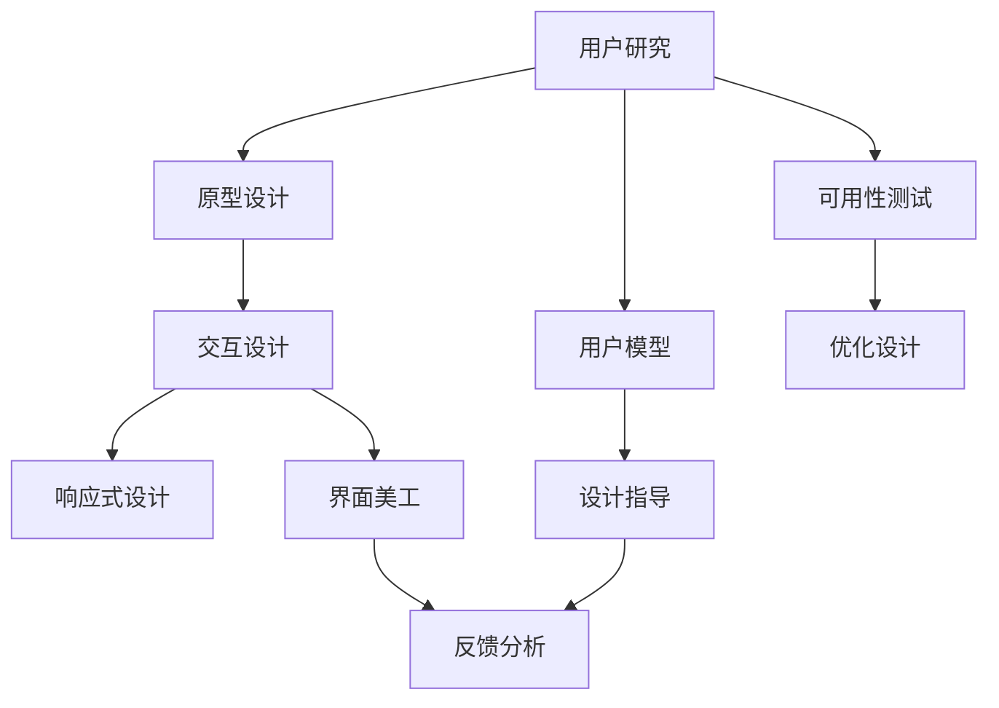

                 

## 1. 背景介绍

用户界面（User Interface, UI）是连接用户与计算机系统的桥梁，通过直观、易用的设计，帮助用户快速理解、使用和操作系统功能。优秀的UI设计不仅能提升用户体验（User Experience, UX），还能大幅提高系统效率，降低用户使用成本，具有重大的经济效益和社会价值。

### 1.1 问题由来
随着计算机技术的不断发展，用户界面设计的重要性日益凸显。传统的UI设计往往关注操作便捷性和美观度，而忽视了用户真实需求的挖掘和用户体验的全面优化。随着数字化转型的加速，企业面临的竞争压力日益增大，对UI设计的要求也越来越高，追求效率、精确性和个性化成为新的设计趋势。

### 1.2 问题核心关键点
UI设计的核心在于充分理解用户需求，通过直观、易用的界面设计，满足用户的交互需求。核心关键点包括：
1. **用户研究**：通过用户调研、用户测试等手段，深入了解用户的真实需求和使用场景。
2. **设计原则**：遵循易用性、一致性、可访问性等基本设计原则，保证界面操作的流畅性和易理解性。
3. **交互设计**：优化交互流程，减少用户操作步骤，提高用户操作效率。
4. **响应式设计**：设计响应式界面，适应不同设备、不同网络环境下的用户使用需求。
5. **界面美工**：通过合理配色、字体、布局等元素，提升界面美观度，吸引用户注意力。

### 1.3 问题研究意义
研究优秀的用户界面设计方法，对于提升用户体验、增强用户粘性、提高企业竞争力具有重要意义。

1. **提升用户体验**：优秀的UI设计能够缩短用户与系统交互的距离，降低使用成本，提升用户满意度。
2. **提高系统效率**：合理的UI设计可以优化用户操作流程，减少误操作，提高系统使用效率。
3. **促进业务增长**：高质量的UI设计能够吸引更多用户，提升用户转化率和留存率，推动企业业务增长。
4. **增强品牌形象**：通过独特的UI设计风格，可以提升企业品牌形象，塑造用户对品牌的认同感。
5. **加速数字化转型**：数字化转型的关键在于提升用户交互体验，优秀的UI设计为数字化转型提供了坚实的基础。

## 2. 核心概念与联系

### 2.1 核心概念概述

为更好地理解优秀的用户界面设计方法，本节将介绍几个密切相关的核心概念：

- **用户研究（User Research）**：通过用户调研、用户测试等手段，深入了解用户的真实需求和使用场景，是UI设计的基础。
- **用户模型（User Model）**：根据用户研究数据构建的虚拟用户模型，用以指导界面设计。
- **可用性测试（Usability Testing）**：通过实际操作测试，评估UI设计的易用性和功能性。
- **原型设计（Prototyping）**：通过绘制草图、制作模型等手段，初步验证UI设计方案。
- **交互设计（Interaction Design）**：通过优化用户交互流程，提高用户操作效率和满意度。
- **响应式设计（Responsive Design）**：设计响应式界面，适应不同设备、不同网络环境下的用户使用需求。
- **界面美工（UI Visual Design）**：通过合理配色、字体、布局等元素，提升界面美观度，吸引用户注意力。
- **用户反馈（User Feedback）**：通过收集用户反馈，不断优化和改进UI设计方案。

这些核心概念之间的逻辑关系可以通过以下Mermaid流程图来展示：

这个流程图展示了大语言模型的核心概念及其之间的关系：

1. 用户研究收集数据，构建用户模型。
2. 用户模型指导原型设计。
3. 原型设计通过可用性测试验证易用性。
4. 交互设计优化用户交互流程。
5. 响应式设计适应不同设备需求。
6. 界面美工提升界面美观度。
7. 设计优化和界面美化后的产品，通过用户反馈不断完善。

这些概念共同构成了优秀的用户界面设计的核心框架，使得UI设计过程更加系统化和科学化。通过理解这些核心概念，我们可以更好地把握UI设计的关键步骤和设计原则。

## 3. 核心算法原理 & 具体操作步骤
### 3.1 算法原理概述

优秀的用户界面设计方法，本质上是一个系统化的设计过程。其核心思想是：通过用户研究，构建用户模型，设计符合用户需求的直观、易用的界面，并通过不断的可用性测试和用户反馈，逐步优化和完善设计方案。

形式化地，假设用户研究收集到的用户需求数据为 $D=\{d_i\}_{i=1}^N$，用户模型为 $M$。设计过程包括三个主要步骤：
1. 构建用户模型 $M = f(D)$，其中 $f$ 为构建用户模型的算法。
2. 基于用户模型 $M$，设计初始原型 $P_0$。
3. 通过可用性测试和用户反馈，迭代优化原型 $P_t = g(P_{t-1}, U)$，其中 $g$ 为优化算法的映射，$U$ 为用户的实际反馈。

优化过程不断重复，直至满足预设的停止条件。最终得到的优化原型 $P^*$ 即为优秀的用户界面设计方案。

### 3.2 算法步骤详解

优秀的用户界面设计方法一般包括以下几个关键步骤：

**Step 1: 用户研究与需求分析**
- 通过问卷调查、访谈、用户测试等手段，收集用户数据。
- 分析用户行为和需求，构建用户角色模型和任务流模型。
- 定义关键用户需求和界面功能。

**Step 2: 原型设计**
- 根据用户模型和需求分析结果，绘制初步界面草图。
- 使用原型设计工具，制作交互式原型，如Sketch、Figma、Axure等。
- 通过多轮迭代和用户反馈，逐步完善界面设计。

**Step 3: 可用性测试**
- 设计测试任务和评价标准，选择典型用户进行测试。
- 收集测试数据，评估用户完成测试任务的效果和满意度。
- 根据测试结果，优化和调整界面设计，确保易用性和功能性。

**Step 4: 界面美化与细节优化**
- 通过配色、字体、布局等元素，提升界面美观度。
- 对界面细节进行打磨，确保一致性和易用性。
- 测试优化后的界面，进行全面评估和完善。

**Step 5: 持续迭代与改进**
- 上线后，通过用户反馈和数据分析，不断优化和改进UI设计。
- 定期进行可用性测试和用户调研，获取新需求和改进建议。
- 根据用户反馈，迭代更新UI设计，保证持续改进和优化。

### 3.3 算法优缺点

优秀的用户界面设计方法具有以下优点：
1. 系统全面。通过用户研究、原型设计、可用性测试等多步骤过程，确保设计方案的系统性和科学性。
2. 用户体验良好。通过不断的测试和优化，确保界面设计符合用户需求和行为习惯。
3. 效率高。合理的设计流程和优化方法，可以显著提高设计效率和质量。
4. 灵活性高。通过迭代和改进，设计方案能够适应变化的用户需求和业务环境。
5. 可持续性高。通过持续迭代和改进，确保UI设计的长期有效性和可维护性。

同时，该方法也存在一定的局限性：
1. 资源消耗高。用户研究、可用性测试、原型设计等步骤，需要大量人力和时间投入。
2. 周期长。设计流程较为复杂，各步骤之间的协调需要时间。
3. 设计难度大。需要综合考虑用户需求、界面美观、交互流程等多个因素，设计难度较大。
4. 数据依赖高。设计方案的效果依赖于用户研究数据的准确性和全面性。
5. 依赖工具。设计过程中需要依赖多种工具和软件，增加技术门槛。

尽管存在这些局限性，但就目前而言，优秀的用户界面设计方法仍是最主流的设计范式。未来相关研究的重点在于如何进一步简化设计流程，提高设计效率，同时兼顾用户体验和资源消耗。

### 3.4 算法应用领域

优秀的用户界面设计方法在各行各业得到了广泛应用，例如：

- **互联网产品**：如社交网络、电商、在线教育等，通过优秀的UI设计提升用户使用体验。
- **移动应用**：如移动游戏、手机银行、智能穿戴设备等，提供直观、易用的操作界面。
- **企业软件**：如ERP、CRM、OA等，通过高效、易用的界面设计提升企业运营效率。
- **医疗健康**：如远程医疗、健康管理等，通过界面优化提升用户体验和操作便捷性。
- **交通运输**：如智能交通、智慧城市等，通过界面设计提升用户导航和查询体验。
- **金融服务**：如在线支付、股票交易等，通过界面设计提升用户操作效率和交易安全性。
- **公共服务**：如政府网站、城市服务平台等，通过界面优化提升公众服务体验和满意度。
- **娱乐文化**：如电影、音乐、游戏等，通过界面设计提升用户沉浸感和互动体验。

除了上述这些经典应用领域外，优秀的UI设计方法也在不断拓展到更多场景中，如VR/AR交互、智能家居控制、智能机器人等，为数字技术带来新的设计思路和用户体验。

## 4. 数学模型和公式 & 详细讲解 & 举例说明

### 4.1 数学模型构建

本节将使用数学语言对优秀用户界面设计方法进行更加严格的刻画。

假设用户研究收集到的用户需求数据为 $D=\{d_i\}_{i=1}^N$，用户模型为 $M$，设计过程的优化算法为 $g$。定义设计过程的优化目标为最大化用户满意度 $U$，即：

$$
\max_{M} U = \max_{M} \sum_{i=1}^N \omega_i u(d_i, M)
$$

其中 $\omega_i$ 为第 $i$ 个用户的权重，$u(d_i, M)$ 为用户 $i$ 在用户模型 $M$ 下的满意度。

### 4.2 公式推导过程

以下我们以用户模型构建和优化为例，推导用户满意度的计算公式。

假设用户模型 $M$ 包含了 $k$ 个用户需求 $N=\{n_j\}_{j=1}^K$，每个需求的用户权重为 $w_j$。则用户满意度 $U$ 可以表示为：

$$
U = \sum_{j=1}^K w_j u(n_j, M)
$$

其中 $u(n_j, M)$ 为第 $j$ 个需求的用户满意度，可以通过用户调研、问卷调查等手段获取。根据用户的实际反馈，$u(n_j, M)$ 可以表示为：

$$
u(n_j, M) = \sum_{s \in S} a_s f_s(M)
$$

其中 $S$ 为所有可能的用户行为集合，$f_s$ 为第 $s$ 个用户行为对应的满意度函数，$a_s$ 为第 $s$ 个用户行为的用户权重。

根据上述推导，我们可以计算出用户满意度的最大化目标，通过优化算法 $g$ 逐步调整用户模型 $M$，直到达到最优的用户满意度。

### 4.3 案例分析与讲解

**案例：某电商平台的UI设计优化**

某电商平台通过用户研究收集到了大量用户反馈数据，发现用户在搜索、浏览、结算等环节存在一定的用户体验问题。为优化这些环节的用户体验，平台设计团队通过以下步骤进行优化：

1. **用户研究**：通过对用户调研和访谈，发现用户在使用过程中普遍存在搜索效果不佳、商品展示不直观、结算流程复杂等问题。
2. **用户模型构建**：根据用户调研数据，构建用户角色模型和任务流模型，定义了典型用户的行为和需求。
3. **原型设计**：根据用户模型和需求分析结果，绘制了初步界面草图，并使用Sketch制作了交互式原型。
4. **可用性测试**：通过测试用户使用新设计界面的操作效果和满意度，收集了大量用户反馈。
5. **界面美化与细节优化**：通过配色、字体、布局等元素，提升界面美观度，并对界面细节进行了打磨，确保一致性和易用性。
6. **持续迭代与改进**：上线后，通过用户反馈和数据分析，不断优化和改进UI设计，进一步提升用户体验。

经过一系列的优化，该电商平台的搜索效果显著提升，商品展示更直观，结算流程更加简洁，用户满意度得到了大幅提升，平台的日活跃用户数也随之增长。

## 5. 项目实践：代码实例和详细解释说明
### 5.1 开发环境搭建

在进行UI设计优化实践前，我们需要准备好开发环境。以下是使用Sketch进行UI设计的环境配置流程：

1. 安装Sketch：从官网下载安装Sketch软件，安装过程中选择与操作系统和版本的匹配选项。
2. 安装插件：安装Sketch插件库（Plug-ins），以拓展Sketch的功能和设计能力。
3. 配置原型制作环境：安装Axure等原型制作工具，与Sketch进行对接，完成快速原型设计和互动效果展示。
4. 配置可用性测试环境：使用Owl Labs等可用性测试工具，进行用户行为分析与测试。
5. 配置界面美化环境：安装Photoshop、Illustrator等图像处理软件，提升界面美工效果。

完成上述步骤后，即可在Sketch环境中开始UI设计优化实践。

### 5.2 源代码详细实现

下面我们以某电商平台的搜索界面优化为例，给出使用Sketch和Axure进行UI设计优化的步骤和代码实现。

**Step 1: 用户研究与需求分析**
- 使用问卷调查和访谈收集用户数据。
- 分析用户行为和需求，构建用户角色模型和任务流模型。
- 定义关键用户需求和界面功能，如搜索效果、商品展示、结算流程等。

**Step 2: 原型设计**
- 在Sketch中绘制初步界面草图，包括搜索栏、商品展示列表、结算按钮等。
- 使用Axure制作交互式原型，包括搜索效果优化、商品展示改写、结算流程简化等功能模块。
- 通过多轮迭代和用户反馈，逐步完善界面设计。

**Step 3: 可用性测试**
- 设计测试任务和评价标准，选择典型用户进行测试。
- 使用Owl Labs收集测试数据，评估用户完成测试任务的效果和满意度。
- 根据测试结果，优化和调整界面设计，确保易用性和功能性。

**Step 4: 界面美化与细节优化**
- 通过配色、字体、布局等元素，提升界面美观度。
- 对界面细节进行打磨，确保一致性和易用性。
- 测试优化后的界面，进行全面评估和完善。

**Step 5: 持续迭代与改进**
- 上线后，通过用户反馈和数据分析，不断优化和改进UI设计。
- 定期进行可用性测试和用户调研，获取新需求和改进建议。
- 根据用户反馈，迭代更新UI设计，保证持续改进和优化。

### 5.3 代码解读与分析

让我们再详细解读一下关键代码的实现细节：

**用户研究与需求分析**
- 问卷调查：在Sketch中使用问卷调查插件，收集用户需求数据。
- 访谈：通过Sketch的协作功能，进行用户访谈记录和分析。
- 角色模型构建：在Sketch中绘制用户角色模型图，并记录用户行为和需求。

**原型设计**
- 界面草图：在Sketch中手绘草图，使用符号和颜色标注界面元素。
- Axure原型：在Axure中创建原型，实现搜索效果优化、商品展示改写、结算流程简化等功能模块。
- 迭代优化：通过Sketch和Axure的协作功能，进行多轮迭代和用户反馈，逐步完善界面设计。

**可用性测试**
- 测试任务设计：在Sketch中设计测试任务，记录用户行为路径和操作效果。
- 测试数据收集：使用Owl Labs进行可用性测试，收集用户行为数据和满意度反馈。
- 优化调整：根据测试结果，在Sketch和Axure中进行界面优化和功能调整。

**界面美化与细节优化**
- 界面美化：使用Photoshop、Illustrator进行界面配色、字体和布局优化。
- 细节优化：在Sketch中进行细节打磨，确保一致性和易用性。
- 测试评估：使用Sketch的测试功能，进行全面评估和完善。

**持续迭代与改进**
- 用户反馈：在Sketch中记录用户反馈，分析用户需求和问题。
- 数据分析：使用数据分析工具，进行用户行为数据分析和满意度评估。
- 迭代更新：根据用户反馈和数据分析，进行UI设计的迭代更新和优化。

通过上述步骤，我们可以看到，使用Sketch和Axure等工具进行UI设计优化，不仅效率高，而且能够通过多轮迭代和用户反馈，不断优化和完善设计方案。

## 6. 实际应用场景
### 6.1 智能客服系统

优秀的UI设计在智能客服系统中有着广泛的应用。传统的客服系统往往依赖人工客服，响应速度慢，服务质量不稳定。通过优秀的UI设计，智能客服系统可以提供7x24小时不间断服务，快速响应客户咨询，用自然流畅的语言解答各类常见问题。

在技术实现上，可以收集企业内部的历史客服对话记录，将问题和最佳答复构建成监督数据，在此基础上对预训练模型进行微调。微调后的模型能够自动理解用户意图，匹配最合适的答案模板进行回复。对于客户提出的新问题，还可以接入检索系统实时搜索相关内容，动态组织生成回答。如此构建的智能客服系统，能大幅提升客户咨询体验和问题解决效率。

### 6.2 医疗健康

优秀的UI设计在医疗健康领域也有着重要的应用。传统的医疗系统往往操作复杂，数据量大，用户体验不佳。通过优秀的UI设计，医疗健康系统可以提升用户体验，降低操作成本，提高医疗服务的效率和质量。

在技术实现上，可以收集医生的操作习惯和用户反馈，设计直观、易用的医疗界面。如医生在诊疗过程中，可以通过简单的拖拽和点击操作，快速录入病历、查看检查结果、开处方等。同时，还可以引入交互式图表和数据可视化功能，帮助医生快速理解病情和分析结果。通过优化医疗界面设计，可以有效提升医生的工作效率和用户满意度。

### 6.3 电子商务

优秀的UI设计在电子商务中同样发挥着重要作用。电商平台的UI设计不仅影响用户的购物体验，还会直接影响平台的销售业绩和用户留存率。

在技术实现上，可以通过用户调研和数据分析，优化电商平台的搜索、浏览、结算等环节。如优化搜索算法，提升搜索结果的相关性和准确性。设计直观、易用的商品展示界面，让用户能够快速找到所需商品。简化结算流程，减少用户操作步骤，提升结算效率和转化率。通过优化电商平台的UI设计，可以显著提升用户购物体验，促进销售增长。

### 6.4 未来应用展望

随着数字化转型的加速，优秀的UI设计在各行各业的应用前景更加广阔。

在智慧医疗领域，优秀的UI设计可以提升医疗服务的智能化水平，辅助医生诊疗，加速新药开发进程。

在智能教育领域，UI设计可以应用于作业批改、学情分析、知识推荐等方面，因材施教，促进教育公平，提高教学质量。

在智慧城市治理中，UI设计可以应用于城市事件监测、舆情分析、应急指挥等环节，提高城市管理的自动化和智能化水平，构建更安全、高效的未来城市。

此外，在企业生产、社会治理、文娱传媒等众多领域，优秀的UI设计也将不断涌现，为数字技术带来新的设计思路和用户体验。相信随着技术的日益成熟，UI设计必将在构建人机协同的智能时代中扮演越来越重要的角色。

## 7. 工具和资源推荐
### 7.1 学习资源推荐

为了帮助开发者系统掌握优秀用户界面设计的方法，这里推荐一些优质的学习资源：

1. **《Don't Make Me Think》**：由UI设计大师Steve Krug所著，深入浅出地介绍了UI设计的基本原则和设计技巧，是UI设计的经典入门书籍。
2. **《Interaction Design Foundation》**：提供丰富的UI设计课程和资料，涵盖UI设计的基础理论和实践技能，适合初学者和进阶者学习。
3. **《Interaction Design Patterns》**：由UI设计专家Dan Saffer所著，介绍了多种UI设计模式和最佳实践，帮助开发者设计更具可用性的界面。
4. **《Nielsen Norman Group》**：提供大量UI设计案例和用户测试报告，深入分析用户行为和设计效果，提供实用的设计建议。
5. **《UX Design for the Digital Mind》**：由UX设计专家Mark Johnson所著，深入探讨用户需求和行为，帮助设计出符合用户心理的UI设计方案。

通过这些资源的学习实践，相信你一定能够快速掌握优秀UI设计的精髓，并用于解决实际的UI设计问题。

### 7.2 开发工具推荐

高效的开发离不开优秀的工具支持。以下是几款用于UI设计优化的常用工具：

1. **Sketch**：苹果公司推出的矢量绘图工具，支持用户调研、原型设计、界面美化等多种功能，是UI设计领域的主流工具。
2. **Axure**：原型设计和用户测试工具，支持交互式原型制作和可用性测试，是UI设计的必备工具。
3. **Figma**：云端协作设计工具，支持多人实时编辑和在线设计，适合团队协作的UI设计项目。
4. **Adobe Photoshop**：图像处理软件，支持界面美工和设计元素制作，是UI设计的重要工具。
5. **Illustrator**：矢量图形处理软件，支持复杂的界面布局和细节优化，是UI设计中的重要工具。
6. **Owl Labs**：可用性测试工具，支持用户行为分析，评估UI设计的易用性和功能性。
7. **UserTesting.com**：用户测试平台，支持远程用户测试和行为数据分析，帮助评估UI设计的效果。

合理利用这些工具，可以显著提升UI设计优化的效率和质量，加快创新迭代的步伐。

### 7.3 相关论文推荐

UI设计研究源于学界的持续探索。以下是几篇奠基性的相关论文，推荐阅读：

1. **"Human-Computer Interaction: Cooperative Design and Use of Shared Activities"**：文中提出了“共享活动”的概念，强调用户体验的重要性，对UI设计产生了深远影响。
2. **"The Design of Everyday Things"**：由设计学大师Don Norman所著，深入探讨了设计原理和用户心理学，对UI设计提供了理论指导。
3. **"Interaction Design: Concepts and Practices"**：由交互设计专家Jonathan P. B Tweet教授所著，全面介绍了交互设计的基本概念和设计方法，是交互设计的经典教材。
4. **"Universal Principles of Design"**：由交互设计师William Lidwell所著，介绍了多种UI设计原则和实践案例，帮助设计师设计更具可用性的界面。
5. **"Designing with the Mind in Mind: Simple Guide to Understanding User Interface Design Guidelines"**：由UX设计师Jesse James Garrett所著，深入介绍了UI设计的基本原则和设计技巧，适合初学者和进阶者学习。

这些论文代表了大语言模型UI设计的研究方向和前沿进展。通过学习这些前沿成果，可以帮助研究者把握学科前进方向，激发更多的创新灵感。

## 8. 总结：未来发展趋势与挑战
### 8.1 总结

本文对优秀用户界面设计方法进行了全面系统的介绍。首先阐述了UI设计的背景和意义，明确了UI设计的基本原则和核心概念。其次，从原理到实践，详细讲解了UI设计的数学模型和关键步骤，给出了UI设计优化的完整代码实例。同时，本文还广泛探讨了UI设计方法在智能客服、医疗健康、电子商务等多个行业领域的应用前景，展示了UI设计方法的重要价值。

通过本文的系统梳理，可以看到，优秀的UI设计方法正在成为设计领域的通用范式，极大地提升用户体验、增强用户粘性、提高企业竞争力。未来，伴随数字化转型的加速，UI设计在各行各业的应用前景更加广阔，需要更多研究者和开发者不断创新和优化，以应对日益复杂和多变的用户需求。

### 8.2 未来发展趋势

展望未来，优秀的UI设计方法将呈现以下几个发展趋势：

1. **智能化交互**：随着AI技术的发展，智能UI界面将更具个性化和自动化，能够根据用户行为和偏好，动态调整界面布局和功能，提升用户体验。
2. **多模态设计**：UI设计将更多地融合视觉、听觉、触觉等多种感官信息，提升用户的沉浸感和互动体验。
3. **响应式设计**：随着移动设备的使用普及，响应式UI设计将更加重要，适应不同设备、不同网络环境下的用户使用需求。
4. **可访问性优化**：提升界面可访问性，帮助有特殊需求的用户（如视障用户、老年用户等）更好地使用系统功能。
5. **自适应学习**：通过学习用户行为和反馈，UI界面能够不断优化和改进，提升用户的个性化体验。
6. **多语言支持**：随着全球化的发展，UI设计将更加注重多语言支持，满足不同语言和文化背景用户的需求。
7. **数据驱动设计**：通过数据分析和用户测试，UI设计将更加科学化和数据化，提升设计决策的依据和效果。

以上趋势凸显了优秀UI设计方法的广阔前景。这些方向的探索发展，必将进一步提升UI设计的智能化和个性化水平，为用户带来更加便捷、高效、愉悦的使用体验。

### 8.3 面临的挑战

尽管优秀的UI设计方法已经取得了瞩目成就，但在迈向更加智能化、普适化应用的过程中，它仍面临着诸多挑战：

1. **技术门槛高**：优秀的UI设计需要综合考虑用户需求、界面美观、交互流程等多个因素，设计难度较大，需要高水平的设计师和工程师。
2. **资源消耗高**：UI设计优化需要大量人力和时间投入，尤其在进行可用性测试和用户调研时，资源消耗较大。
3. **数据依赖高**：设计方案的效果依赖于用户研究数据的准确性和全面性，数据不足或偏差会影响设计效果。
4. **用户需求多变**：用户需求和行为不断变化，UI设计需要持续迭代和优化，增加了设计成本和复杂度。
5. **技术生态复杂**：不同设计工具和平台之间的兼容性问题，增加了UI设计的环境和技术难度。

尽管存在这些挑战，但就目前而言，优秀的UI设计方法仍是最主流的设计范式。未来相关研究的重点在于如何进一步简化设计流程，提高设计效率，同时兼顾用户体验和资源消耗。

### 8.4 研究展望

面对优秀的UI设计方法所面临的挑战，未来的研究需要在以下几个方面寻求新的突破：

1. **自动化设计工具**：开发更多智能化、自动化、高效化的UI设计工具，减少设计成本和复杂度。
2. **多学科融合**：将设计学、心理学、计算机科学等学科知识融合，提升UI设计的科学性和普适性。
3. **人工智能辅助设计**：通过AI技术辅助UI设计，提升设计效率和质量，降低设计门槛。
4. **大数据支持**：利用大数据分析技术，深入理解用户需求和行为，提供数据驱动的UI设计方案。
5. **可持续设计**：设计更加环保、低碳、节能的UI界面，提升系统的可持续性和用户满意度。

这些研究方向的探索，必将引领UI设计方法迈向更高的台阶，为构建更加智能、高效、可持续的用户界面提供新的思路和技术支持。面向未来，UI设计需要从设计者、用户、技术等多个维度协同发力，共同推动用户界面设计的进步。

## 9. 附录：常见问题与解答
### 9.1 Q1: 优秀的UI设计有哪些特点？

A: 优秀的UI设计通常具有以下特点：
1. **易用性**：界面简洁、直观，操作便捷，用户能够快速理解和使用系统功能。
2. **一致性**：界面元素和操作逻辑一致，避免用户产生混淆和错误。
3. **可访问性**：界面设计考虑到特殊用户的需求，支持视障、老年用户等群体。
4. **美观度**：界面设计符合用户审美，颜色搭配、字体选择、布局设计等方面均符合美观标准。
5. **响应性**：界面设计适应不同设备和网络环境，提供一致的体验。
6. **个性化**：根据用户偏好和行为，界面设计能够动态调整和优化，提供个性化体验。

### 9.2 Q2: 如何进行有效的用户研究？

A: 进行有效的用户研究，通常包括以下几个步骤：
1. **定义研究目标**：明确研究目的和范围，确定需要了解的用户行为和需求。
2. **选择研究方法**：根据研究目标和用户特点，选择问卷调查、用户访谈、可用性测试等研究方法。
3. **收集用户数据**：通过问卷调查、用户访谈等方式，收集用户需求和行为数据。
4. **数据分析**：对收集到的数据进行分析和整理，找出用户行为和需求的特点和规律。
5. **构建用户模型**：根据数据分析结果，构建用户角色模型和任务流模型，定义典型用户的行为和需求。
6. **设计优化**：根据用户模型和需求分析结果，优化和调整UI设计方案。

### 9.3 Q3: 如何进行有效的可用性测试？

A: 进行有效的可用性测试，通常包括以下几个步骤：
1. **设计测试任务**：根据UI设计需求，设计测试任务和评价标准。
2. **选择测试用户**：选择典型用户进行测试，确保测试样本的代表性和多样性。
3. **记录用户操作**：通过Sketch等工具记录用户操作过程和效果，收集用户反馈数据。
4. **评估测试结果**：根据测试数据和用户反馈，评估UI设计的易用性和功能性。
5. **优化设计方案**：根据测试结果，优化和调整UI设计方案，确保易用性和功能性。

### 9.4 Q4: 如何进行界面美化与细节优化？

A: 进行界面美化与细节优化，通常包括以下几个步骤：
1. **颜色搭配**：选择合适的颜色方案，提升界面的视觉吸引力。
2. **字体选择**：选择合适的字体，提升文本的可读性和美观度。
3. **布局设计**：通过合理的布局设计，提升界面的清晰度和易用性。
4. **细节打磨**：对界面细节进行打磨，确保一致性和易用性。
5. **测试评估**：通过Sketch等工具进行测试，评估优化后的界面效果。

### 9.5 Q5: 如何进行持续迭代与改进？

A: 进行持续迭代与改进，通常包括以下几个步骤：
1. **收集用户反馈**：通过用户调研和数据分析，收集用户需求和反馈。
2. **数据分析**：对收集到的用户数据进行分析和整理，找出问题的根源和改进方向。
3. **优化设计方案**：根据数据分析结果，优化和调整UI设计方案。
4. **迭代更新**：上线后，通过用户反馈和数据分析，不断优化和改进UI设计。
5. **迭代评估**：通过可用性测试和用户调研，评估迭代后的界面效果。

通过以上步骤，可以持续优化和改进UI设计，确保设计方案的科学性和有效性。

---

作者：禅与计算机程序设计艺术 / Zen and the Art of Computer Programming

