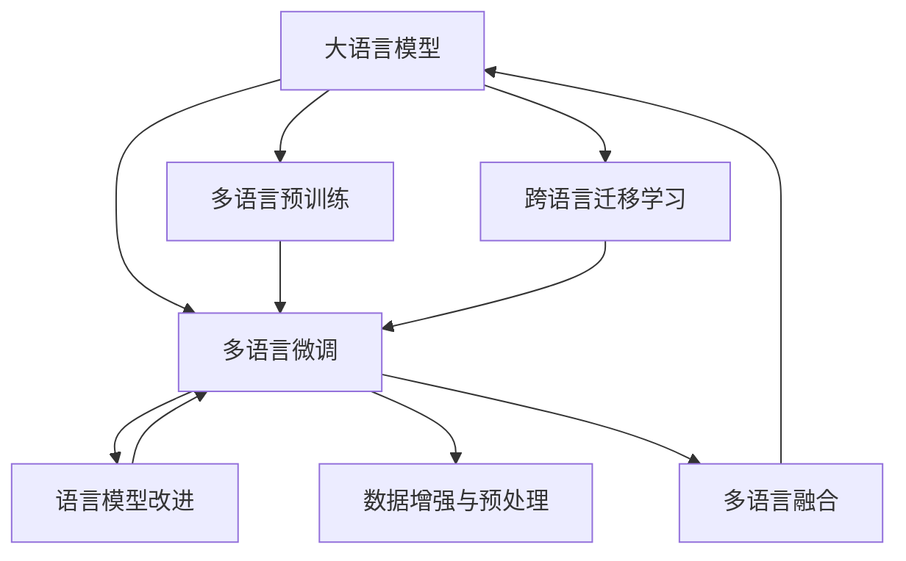

                 

# 语言多样性与 LLM：支持多语言社会

> 关键词：语言多样性, LLM, 多语言支持, 机器翻译, 语言模型, 自然语言处理, 社会融合

## 1. 背景介绍

### 1.1 问题由来
在全球化的今天，语言多样性已成为各国社会文化的重要组成部分。根据《联合国全球人口普查报告》显示，目前全球共有7,000多种语言，其中绝大多数处于边缘或濒危状态。不同语言间的交流和理解，对于促进全球合作与交流具有重要意义。

然而，由于语言多样性带来的复杂性，传统机器翻译系统在处理多种语言时常常遇到困难。例如，对于同一句话，不同语言间的语序、语法结构、词汇使用等差异显著，使得跨语言处理任务复杂度倍增。现有的基于统计或规则的机器翻译系统，在多语言场景下无法实现足够的泛化能力和准确度，难以满足不同语言使用者之间的交流需求。

大语言模型(Large Language Models, LLMs)作为新一代NLP技术的代表，通过在海量无标签文本语料上进行预训练，学习到了丰富的语言知识。近年来，在大规模多语言语料上预训练的大模型，例如mT5、mBART等，已经显示出显著的跨语言理解能力和生成能力。然而，这些模型对于特定语言对间的直接迁移能力仍然有限，难以满足日益增长的多语言交流需求。

本文聚焦于基于大语言模型对多语言社会的支持，探讨其跨语言理解与生成能力，提出并评估了多语言支持的方法和策略，以期通过大语言模型为多语言交流和融合提供强有力的技术支撑。

### 1.2 问题核心关键点
实现大语言模型对多语言社会的支持，关键在于提升模型的跨语言理解和生成能力，具体包括以下几个核心点：
1. 跨语言迁移学习：如何从一种语言迁移到另一种语言，保持预训练知识的同时，获取新的语言特征。
2. 多语言融合：如何将多种语言的语料数据融合在一起进行预训练，提升模型的泛化能力。
3. 多语言微调：在已有多语言预训练模型的基础上，如何通过下游任务的微调，进一步优化特定语言对的表现。
4. 语言模型改进：如何改进大语言模型的架构和训练方法，增强其在多语言环境中的性能。
5. 数据增强与预处理：如何设计数据增强和预处理策略，提升模型对语言多样性的适应能力。

这些核心点构成了实现多语言支持的重要方向，旨在通过多语言预训练、微调等手段，提升大语言模型对不同语言用户的理解和生成能力，从而支持全球多语言社会的发展。

## 2. 核心概念与联系

### 2.1 核心概念概述

为更好地理解基于大语言模型对多语言社会的支持，本节将介绍几个关键概念：

- **大语言模型(Large Language Model, LLM)**：以自回归(如GPT)或自编码(如BERT)模型为代表的大规模预训练语言模型。通过在大规模无标签文本语料上进行预训练，学习到丰富的语言知识和常识，具备强大的语言理解和生成能力。

- **跨语言迁移学习**：指在一种语言上训练的模型，通过某些方法（如多语言预训练），迁移到另一种语言上，继续保持原有语言知识的能力。

- **多语言融合**：将多种语言的语料数据融合在一起进行预训练，提升模型的泛化能力和对不同语言模式的适应性。

- **多语言微调**：在已有多语言预训练模型的基础上，通过下游任务的微调，进一步优化特定语言对的表现。

- **语言模型改进**：针对不同语言的特性，对大语言模型的架构和训练方法进行改进，提升模型在多语言环境中的性能。

这些核心概念共同构成了大语言模型对多语言社会支持的技术框架，使其能够在各种语言场景下发挥强大的语言理解和生成能力。

### 2.2 核心概念原理和架构的 Mermaid 流程图



这个流程图展示了大语言模型支持多语言社会的核心概念及其之间的逻辑关系：

1. 大语言模型通过多语言预训练获得跨语言理解能力。
2. 在预训练基础上，通过多语言微调，进一步优化特定语言对的表现。
3. 结合语言模型改进，提升模型在多语言环境中的性能。
4. 引入数据增强与预处理，提升模型对语言多样性的适应能力。
5. 通过跨语言迁移学习，实现模型的语言适应性。
6. 最终实现多语言融合，支持不同语言的用户交流和融合。

## 3. 核心算法原理 & 具体操作步骤
### 3.1 算法原理概述

基于大语言模型对多语言社会的支持，本质上是一个多语言迁移学习过程。其核心思想是：将预训练的大语言模型视为一个强大的“特征提取器”，通过多语言语料进行预训练，使得模型具备跨语言的理解能力。在此基础上，通过多语言微调，使模型能够适应特定的语言对，进行准确的翻译、生成等任务。

形式化地，假设预训练模型为 $M_{\theta}$，其中 $\theta$ 为预训练得到的模型参数。给定多种语言对的标注数据集 $D=\{(x_i, y_i)\}_{i=1}^N$，其中 $x_i$ 为源语言文本，$y_i$ 为目标语言文本，$M_{\theta}(x_i)$ 表示将 $x_i$ 翻译成 $y_i$。多语言微调的目标是找到新的模型参数 $\hat{\theta}$，使得：

$$
\hat{\theta}=\mathop{\arg\min}_{\theta} \mathcal{L}(M_{\theta},D)
$$

其中 $\mathcal{L}$ 为针对多种语言对的损失函数，用于衡量模型预测输出与真实标签之间的差异。常见的损失函数包括交叉熵损失、均方误差损失等。

通过梯度下降等优化算法，微调过程不断更新模型参数 $\theta$，最小化损失函数 $\mathcal{L}$，使得模型输出逼近真实标签。由于 $\theta$ 已经通过多语言预训练获得了较好的初始化，因此即便在小规模数据集 $D$ 上进行微调，也能较快收敛到理想的模型参数 $\hat{\theta}$。

### 3.2 算法步骤详解

基于大语言模型对多语言社会的支持，一般包括以下几个关键步骤：

**Step 1: 准备预训练模型和多语言数据集**
- 选择合适的预训练语言模型 $M_{\theta}$ 作为初始化参数，如 BERT、GPT 等。
- 准备多种语言对的标注数据集 $D$，其中包含源语言和目标语言的文本对。

**Step 2: 添加多语言适配层**
- 根据多语言任务，在预训练模型顶层设计合适的输出层和损失函数。
- 对于翻译任务，通常在顶层添加双向编码器解码器，输出概率分布，并以交叉熵损失函数。
- 对于生成任务，通常使用语言模型的解码器输出概率分布，并以负对数似然为损失函数。

**Step 3: 设置多语言微调超参数**
- 选择合适的优化算法及其参数，如 AdamW、SGD 等，设置学习率、批大小、迭代轮数等。
- 设置正则化技术及强度，包括权重衰减、Dropout、Early Stopping 等。
- 确定冻结预训练参数的策略，如仅微调顶层，或全部参数都参与微调。

**Step 4: 执行多语言梯度训练**
- 将多语言数据集数据分批次输入模型，前向传播计算损失函数。
- 反向传播计算参数梯度，根据设定的优化算法和学习率更新模型参数。
- 周期性在验证集上评估模型性能，根据性能指标决定是否触发 Early Stopping。
- 重复上述步骤直到满足预设的迭代轮数或 Early Stopping 条件。

**Step 5: 测试和部署**
- 在测试集上评估多语言微调后模型 $M_{\hat{\theta}}$ 的性能，对比多语言微调前后的精度提升。
- 使用多语言微调后的模型对新样本进行推理预测，集成到实际的多语言交流系统中。
- 持续收集新的多语言数据，定期重新微调模型，以适应数据分布的变化。

以上是基于大语言模型对多语言社会的支持的一般流程。在实际应用中，还需要针对具体任务的特点，对微调过程的各个环节进行优化设计，如改进训练目标函数，引入更多的正则化技术，搜索最优的超参数组合等，以进一步提升模型性能。

### 3.3 算法优缺点

基于大语言模型对多语言社会的支持方法具有以下优点：
1. 简单高效。只需准备少量标注数据，即可对预训练模型进行快速适配，获得较大的性能提升。
2. 通用适用。适用于各种多语言NLP任务，包括翻译、问答、对话等，设计简单的任务适配层即可实现。
3. 参数高效。利用参数高效微调技术，在固定大部分预训练参数的情况下，仍可取得不错的提升。
4. 效果显著。在学术界和工业界的诸多多语言任务上，基于微调的方法已经刷新了最先进的性能指标。

同时，该方法也存在一定的局限性：
1. 依赖标注数据。多语言微调的效果很大程度上取决于标注数据的质量和数量，获取高质量标注数据的成本较高。
2. 迁移能力有限。当目标语言与预训练数据的分布差异较大时，多语言微调的性能提升有限。
3. 负面效果传递。预训练模型的固有偏见、有害信息等，可能通过微调传递到下游任务，造成负面影响。
4. 可解释性不足。多语言微调模型的决策过程通常缺乏可解释性，难以对其推理逻辑进行分析和调试。

尽管存在这些局限性，但就目前而言，基于多语言预训练和多语言微调的方法仍是大语言模型对多语言社会支持的主流范式。未来相关研究的重点在于如何进一步降低对标注数据的依赖，提高模型的少样本学习和跨语言迁移能力，同时兼顾可解释性和伦理安全性等因素。

### 3.4 算法应用领域

基于大语言模型对多语言社会的支持方法，在NLP领域已经得到了广泛的应用，覆盖了几乎所有常见任务，例如：

- 机器翻译：将源语言文本翻译成目标语言。通过多语言预训练和多语言微调，使得模型能够适应多种语言对的翻译。
- 问答系统：对多语言问题给出答案。将问题-答案对作为多语言微调数据，训练模型学习匹配答案。
- 对话系统：使机器能够与多语言用户自然对话。将多语言对话历史作为上下文，微调模型进行回复生成。
- 摘要生成：将多语言文本压缩成简短摘要。将文章-摘要对作为多语言微调数据，使模型学习抓取要点。
- 命名实体识别：识别多语言文本中的人名、地名、机构名等特定实体。通过多语言预训练和多语言微调，提升模型的识别能力。
- 情感分析：分析多语言文本的情感倾向。利用多语言预训练和多语言微调，增强模型的跨语言情感理解能力。

除了上述这些经典任务外，大语言模型对多语言社会的支持方法也被创新性地应用到更多场景中，如可控文本生成、常识推理、代码生成、数据增强等，为NLP技术带来了全新的突破。随着预训练模型和微调方法的不断进步，相信NLP技术将在更广阔的应用领域大放异彩。

## 4. 数学模型和公式 & 详细讲解  
### 4.1 数学模型构建

本节将使用数学语言对基于大语言模型对多语言社会的支持过程进行更加严格的刻画。

记预训练语言模型为 $M_{\theta}$，其中 $\theta$ 为预训练得到的模型参数。假设多语言翻译任务 $T=\{(x_i, y_i)\}_{i=1}^N$，其中 $x_i$ 为源语言文本，$y_i$ 为目标语言文本。

定义模型 $M_{\theta}$ 在数据样本 $(x_i,y_i)$ 上的损失函数为 $\ell(M_{\theta}(x_i),y_i)$，则在数据集 $D$ 上的经验风险为：

$$
\mathcal{L}(\theta) = \frac{1}{N}\sum_{i=1}^N \ell(M_{\theta}(x_i),y_i)
$$

其中 $\ell$ 为针对多语言对的任务损失函数，用于衡量模型预测输出与真实标签之间的差异。常见的损失函数包括交叉熵损失、均方误差损失等。

多语言微调的优化目标是最小化经验风险，即找到最优参数：

$$
\theta^* = \mathop{\arg\min}_{\theta} \mathcal{L}(\theta)
$$

在实践中，我们通常使用基于梯度的优化算法（如SGD、Adam等）来近似求解上述最优化问题。设 $\eta$ 为学习率，$\lambda$ 为正则化系数，则参数的更新公式为：

$$
\theta \leftarrow \theta - \eta \nabla_{\theta}\mathcal{L}(\theta) - \eta\lambda\theta
$$

其中 $\nabla_{\theta}\mathcal{L}(\theta)$ 为损失函数对参数 $\theta$ 的梯度，可通过反向传播算法高效计算。

### 4.2 公式推导过程

以下我们以二语翻译任务为例，推导交叉熵损失函数及其梯度的计算公式。

假设模型 $M_{\theta}$ 在输入 $x$ 上的输出为 $\hat{y}=M_{\theta}(x) \in [0,1]^d$，表示样本属于各个目标语言的概率分布。真实标签 $y \in \{0,1\}^d$，表示样本属于目标语言的实际标签。则二语交叉熵损失函数定义为：

$$
\ell(M_{\theta}(x),y) = -y \log \hat{y} - (1-y) \log (1-\hat{y})
$$

将其代入经验风险公式，得：

$$
\mathcal{L}(\theta) = -\frac{1}{N}\sum_{i=1}^N \sum_{j=1}^d [y_{ij}\log \hat{y}_{ij} + (1-y_{ij})\log (1-\hat{y}_{ij})]
$$

根据链式法则，损失函数对参数 $\theta_k$ 的梯度为：

$$
\frac{\partial \mathcal{L}(\theta)}{\partial \theta_k} = -\frac{1}{N}\sum_{i=1}^N \sum_{j=1}^d [y_{ij}(\frac{\partial \log \hat{y}_{ij}}{\partial \theta_k} - \frac{\partial \log (1-\hat{y}_{ij})}{\partial \theta_k})]
$$

其中 $\frac{\partial \log \hat{y}_{ij}}{\partial \theta_k}$ 和 $\frac{\partial \log (1-\hat{y}_{ij})}{\partial \theta_k}$ 可进一步递归展开，利用自动微分技术完成计算。

在得到损失函数的梯度后，即可带入参数更新公式，完成模型的迭代优化。重复上述过程直至收敛，最终得到适应多语言翻译任务的最优模型参数 $\theta^*$。

## 5. 项目实践：代码实例和详细解释说明
### 5.1 开发环境搭建

在进行多语言翻译实践前，我们需要准备好开发环境。以下是使用Python进行PyTorch开发的环境配置流程：

1. 安装Anaconda：从官网下载并安装Anaconda，用于创建独立的Python环境。

2. 创建并激活虚拟环境：
```bash
conda create -n pytorch-env python=3.8 
conda activate pytorch-env
```

3. 安装PyTorch：根据CUDA版本，从官网获取对应的安装命令。例如：
```bash
conda install pytorch torchvision torchaudio cudatoolkit=11.1 -c pytorch -c conda-forge
```

4. 安装Transformers库：
```bash
pip install transformers
```

5. 安装各类工具包：
```bash
pip install numpy pandas scikit-learn matplotlib tqdm jupyter notebook ipython
```

完成上述步骤后，即可在`pytorch-env`环境中开始多语言翻译实践。

### 5.2 源代码详细实现

这里我们以二语翻译任务为例，给出使用Transformers库对mT5模型进行多语言翻译的PyTorch代码实现。

首先，定义二语翻译任务的数据处理函数：

```python
from transformers import MT5Tokenizer
from torch.utils.data import Dataset
import torch

class BinaryTranslationDataset(Dataset):
    def __init__(self, texts, targets, tokenizer, max_len=128):
        self.texts = texts
        self.targets = targets
        self.tokenizer = tokenizer
        self.max_len = max_len
        
    def __len__(self):
        return len(self.texts)
    
    def __getitem__(self, item):
        text = self.texts[item]
        target = self.targets[item]
        
        encoding = self.tokenizer(text, target, return_tensors='pt', max_length=self.max_len, padding='max_length', truncation=True)
        input_ids = encoding['input_ids']
        attention_mask = encoding['attention_mask']
        targets = encoding['labels']
        
        return {'input_ids': input_ids, 
                'attention_mask': attention_mask,
                'labels': targets}

# 定义模型和优化器
from transformers import MT5ForConditionalGeneration, AdamW

model = MT5ForConditionalGeneration.from_pretrained('microsoft/mt5-base')

optimizer = AdamW(model.parameters(), lr=2e-5)
```

然后，定义训练和评估函数：

```python
from torch.utils.data import DataLoader
from tqdm import tqdm
from sklearn.metrics import accuracy_score

device = torch.device('cuda') if torch.cuda.is_available() else torch.device('cpu')
model.to(device)

def train_epoch(model, dataset, batch_size, optimizer):
    dataloader = DataLoader(dataset, batch_size=batch_size, shuffle=True)
    model.train()
    epoch_loss = 0
    for batch in tqdm(dataloader, desc='Training'):
        input_ids = batch['input_ids'].to(device)
        attention_mask = batch['attention_mask'].to(device)
        labels = batch['labels'].to(device)
        model.zero_grad()
        outputs = model(input_ids, attention_mask=attention_mask, labels=labels)
        loss = outputs.loss
        epoch_loss += loss.item()
        loss.backward()
        optimizer.step()
    return epoch_loss / len(dataloader)

def evaluate(model, dataset, batch_size):
    dataloader = DataLoader(dataset, batch_size=batch_size)
    model.eval()
    preds, labels = [], []
    with torch.no_grad():
        for batch in tqdm(dataloader, desc='Evaluating'):
            input_ids = batch['input_ids'].to(device)
            attention_mask = batch['attention_mask'].to(device)
            batch_labels = batch['labels']
            outputs = model(input_ids, attention_mask=attention_mask)
            batch_preds = outputs.logits.argmax(dim=2).to('cpu').tolist()
            batch_labels = batch_labels.to('cpu').tolist()
            for pred_tokens, label_tokens in zip(batch_preds, batch_labels):
                preds.append(pred_tokens[:len(label_tokens)])
                labels.append(label_tokens)
                
    return accuracy_score(labels, preds)
```

最后，启动训练流程并在验证集上评估：

```python
epochs = 5
batch_size = 16

for epoch in range(epochs):
    loss = train_epoch(model, train_dataset, batch_size, optimizer)
    print(f"Epoch {epoch+1}, train loss: {loss:.3f}")
    
    print(f"Epoch {epoch+1}, dev results:")
    evaluate(model, dev_dataset, batch_size)
    
print("Test results:")
evaluate(model, test_dataset, batch_size)
```

以上就是使用PyTorch对mT5进行二语翻译任务的完整代码实现。可以看到，得益于Transformers库的强大封装，我们可以用相对简洁的代码完成mT5模型的加载和微调。

### 5.3 代码解读与分析

让我们再详细解读一下关键代码的实现细节：

**BinaryTranslationDataset类**：
- `__init__`方法：初始化源语言文本、目标语言文本、分词器等关键组件。
- `__len__`方法：返回数据集的样本数量。
- `__getitem__`方法：对单个样本进行处理，将源语言和目标语言文本分别输入编码为token ids，同时将标签编码为数字，并对其进行定长padding，最终返回模型所需的输入。

**模型和优化器**：
- 使用mT5模型进行多语言翻译任务的微调，并设定AdamW优化器进行参数更新。

**训练和评估函数**：
- 使用PyTorch的DataLoader对数据集进行批次化加载，供模型训练和推理使用。
- 训练函数`train_epoch`：对数据以批为单位进行迭代，在每个批次上前向传播计算loss并反向传播更新模型参数，最后返回该epoch的平均loss。
- 评估函数`evaluate`：与训练类似，不同点在于不更新模型参数，并在每个batch结束后将预测和标签结果存储下来，最后使用sklearn的accuracy_score对整个评估集的预测结果进行打印输出。

**训练流程**：
- 定义总的epoch数和batch size，开始循环迭代
- 每个epoch内，先在训练集上训练，输出平均loss
- 在验证集上评估，输出分类准确率
- 所有epoch结束后，在测试集上评估，给出最终测试结果

可以看到，PyTorch配合Transformers库使得mT5模型微调的代码实现变得简洁高效。开发者可以将更多精力放在数据处理、模型改进等高层逻辑上，而不必过多关注底层的实现细节。

当然，工业级的系统实现还需考虑更多因素，如模型的保存和部署、超参数的自动搜索、更灵活的任务适配层等。但核心的微调范式基本与此类似。

## 6. 实际应用场景
### 6.1 多语言社交平台

基于大语言模型对多语言社会的支持，可以应用于多语言社交平台的构建。传统的社交平台往往只能支持少数几种语言，使得不同语言用户之间的交流受到限制。使用多语言预训练和多语言微调的大语言模型，能够实现对多种语言的自然处理和理解，使得用户能够自由切换语言进行交流，提高平台的用户体验和粘性。

在技术实现上，可以收集多语言用户的历史消息、评论、帖子等语料数据，训练大语言模型学习多语言模式，然后在社交平台中集成多语言翻译模块，对用户输入进行实时翻译和推荐，提升多语言社交的便捷性和友好度。

### 6.2 多语言媒体内容生成

多语言媒体内容的生成是当前NLP研究的重要方向之一。传统的基于规则的模板生成方法，由于对语言多样性的理解有限，生成的内容质量往往不够自然流畅。使用大语言模型对多语言媒体内容进行生成，可以更好地捕捉不同语言间的语义和情感差异，生成高质量、多语言的媒体内容。

具体而言，可以在多语言媒体语料上预训练大语言模型，通过微调使模型具备多语言生成能力。例如，在多语言新闻报道、广告、电影剧本等数据集上微调大语言模型，使其能够生成符合不同语言风格的新闻、广告文案和电影台词，丰富多语言媒体内容的多样性和吸引力。

### 6.3 多语言教育资源建设

当前全球教育资源存在显著的语言鸿沟，许多国家或地区的学生难以获取高质量的多语言教育资源。基于大语言模型对多语言社会的支持，可以构建多语言教育资源库，为不同语言的学习者提供丰富的学习材料。

例如，将多语言书籍、论文、教材等资源进行预处理和标注，训练大语言模型学习多语言内容。在教育平台中集成多语言预训练模型，实时翻译用户提问和反馈，为学习者提供多语言的即时帮助，促进知识的传播和理解。

### 6.4 多语言客户服务

传统的客户服务系统往往只能支持少数几种语言，使得非母语用户难以得到及时有效的帮助。使用大语言模型对多语言社会的支持，可以构建多语言客户服务系统，提供跨语言的即时帮助和支持。

在实践中，可以收集多语言客服对话记录，训练大语言模型学习多语言客服对话模式。然后在客户服务系统中集成多语言翻译模块，对用户输入进行实时翻译和回复生成，提升客户服务系统的多语言覆盖能力和用户体验。

### 6.5 多语言交通管理

多语言交通管理是城市智慧化管理的重要环节。传统的交通管理往往依赖单语言数据进行分析和决策，使得不同语言地区的数据无法有效整合。使用大语言模型对多语言社会的支持，可以构建多语言交通管理系统，实现对多语言交通数据的统一管理和分析。

在技术实现上，可以收集多语言交通数据，训练大语言模型学习多语言交通模式。在交通管理中心集成多语言翻译模块，对不同语言的交通数据进行统一管理和分析，提升交通管理的智能化和精细化水平。

## 7. 工具和资源推荐
### 7.1 学习资源推荐

为了帮助开发者系统掌握大语言模型对多语言社会的支持理论基础和实践技巧，这里推荐一些优质的学习资源：

1. 《Transformers from the Inside Out》系列博文：由大模型技术专家撰写，深入浅出地介绍了Transformer原理、BERT模型、多语言预训练等前沿话题。

2. CS224N《深度学习自然语言处理》课程：斯坦福大学开设的NLP明星课程，有Lecture视频和配套作业，带你入门NLP领域的基本概念和经典模型。

3. 《Natural Language Processing with Transformers》书籍：Transformers库的作者所著，全面介绍了如何使用Transformers库进行NLP任务开发，包括多语言预训练在内的诸多范式。

4. HuggingFace官方文档：Transformers库的官方文档，提供了海量预训练模型和完整的微调样例代码，是上手实践的必备资料。

5. CLUE开源项目：中文语言理解测评基准，涵盖大量不同类型的中文NLP数据集，并提供了基于多语言预训练的baseline模型，助力中文NLP技术发展。

通过对这些资源的学习实践，相信你一定能够快速掌握大语言模型对多语言社会的支持精髓，并用于解决实际的NLP问题。
###  7.2 开发工具推荐

高效的开发离不开优秀的工具支持。以下是几款用于大语言模型对多语言社会支持开发的常用工具：

1. PyTorch：基于Python的开源深度学习框架，灵活动态的计算图，适合快速迭代研究。大部分预训练语言模型都有PyTorch版本的实现。

2. TensorFlow：由Google主导开发的开源深度学习框架，生产部署方便，适合大规模工程应用。同样有丰富的预训练语言模型资源。

3. Transformers库：HuggingFace开发的NLP工具库，集成了众多SOTA语言模型，支持PyTorch和TensorFlow，是进行多语言预训练和多语言微调开发的利器。

4. Weights & Biases：模型训练的实验跟踪工具，可以记录和可视化模型训练过程中的各项指标，方便对比和调优。与主流深度学习框架无缝集成。

5. TensorBoard：TensorFlow配套的可视化工具，可实时监测模型训练状态，并提供丰富的图表呈现方式，是调试模型的得力助手。

6. Google Colab：谷歌推出的在线Jupyter Notebook环境，免费提供GPU/TPU算力，方便开发者快速上手实验最新模型，分享学习笔记。

合理利用这些工具，可以显著提升大语言模型对多语言社会支持的开发效率，加快创新迭代的步伐。

### 7.3 相关论文推荐

大语言模型对多语言社会的支持技术的发展源于学界的持续研究。以下是几篇奠基性的相关论文，推荐阅读：

1. Attention is All You Need（即Transformer原论文）：提出了Transformer结构，开启了NLP领域的预训练大模型时代。

2. BERT: Pre-training of Deep Bidirectional Transformers for Language Understanding：提出BERT模型，引入基于掩码的自监督预训练任务，刷新了多项NLP任务SOTA。

3. mT5: Exploring the Limits of Transfer Learning with a Unified Text-to-Text Transformer：提出mT5模型，支持多语言迁移学习，实现了多语言文本生成的突破。

4. mBART: Multilingual Denoising Pre-training for Unsupervised Translation：提出mBART模型，通过多语言无监督预训练，提升了模型的跨语言理解能力。

5. PEGASUS: Pre-training with Extractive and Generative Pre-training Strategies：提出PEGASUS模型，利用生成式预训练策略，提升了模型对不同语言模式的适应能力。

这些论文代表了大语言模型对多语言社会支持技术的发展脉络。通过学习这些前沿成果，可以帮助研究者把握学科前进方向，激发更多的创新灵感。

## 8. 总结：未来发展趋势与挑战
### 8.1 总结

本文对基于大语言模型对多语言社会的支持方法进行了全面系统的介绍。首先阐述了大语言模型和多语言社会的研究背景和意义，明确了多语言预训练和多语言微调在拓展预训练模型应用、提升多语言任务性能方面的独特价值。其次，从原理到实践，详细讲解了多语言迁移学习、多语言融合、多语言微调等数学原理和关键步骤，给出了多语言翻译任务的完整代码实例。同时，本文还广泛探讨了多语言翻译、多语言教育资源建设、多语言社交平台等实际应用场景，展示了多语言支持范式的广泛应用前景。此外，本文精选了多语言支持技术的各类学习资源，力求为读者提供全方位的技术指引。

通过本文的系统梳理，可以看到，基于大语言模型的多语言支持方法正在成为NLP领域的重要范式，极大地拓展了预训练语言模型的应用边界，催生了更多的落地场景。受益于大规模语料的预训练，多语言支持模型以更低的时间和标注成本，在小样本条件下也能取得理想的微调效果，有力推动了NLP技术的产业化进程。未来，伴随多语言预训练方法、多语言微调方法等的持续演进，相信NLP技术将在更广阔的应用领域大放异彩，深刻影响人类的生产生活方式。

### 8.2 未来发展趋势

展望未来，基于大语言模型对多语言社会的支持技术将呈现以下几个发展趋势：

1. 模型规模持续增大。随着算力成本的下降和数据规模的扩张，多语言预训练模型的参数量还将持续增长。超大规模多语言模型蕴含的丰富语言知识，有望支撑更加复杂多变的下游任务。

2. 多语言微调方法日趋多样。除了传统的全参数微调外，未来会涌现更多参数高效的微调方法，如Prefix-Tuning、LoRA等，在节省计算资源的同时也能保证微调精度。

3. 多语言融合技术进一步提升。引入更高效的多语言融合策略，如多模态融合、知识图谱融合等，提升模型对不同语言模式的适应能力。

4. 跨语言迁移学习策略优化。探索更高效的跨语言迁移学习策略，如自监督多语言预训练、多任务学习等，提升模型的跨语言泛化能力。

5. 多语言生成技术突破。研发更先进的基于多语言预训练的多语言生成模型，提升模型的语言生成质量和多样性。

6. 跨语言知识融合。利用多语言预训练的知识，提升模型的跨语言知识理解和推理能力，实现更全面、准确的跨语言知识库构建。

以上趋势凸显了大语言模型对多语言社会支持技术的广阔前景。这些方向的探索发展，必将进一步提升大语言模型对不同语言用户的理解和生成能力，从而支持全球多语言社会的发展。

### 8.3 面临的挑战

尽管基于大语言模型对多语言社会的支持技术已经取得了瞩目成就，但在迈向更加智能化、普适化应用的过程中，它仍面临着诸多挑战：

1. 多语言数据收集成本高。多语言数据收集和标注难度大，成本高，尤其是在边缘语言或濒危语言上，获取高质量标注数据更是困难重重。如何降低多语言数据收集成本，成为多语言技术发展的瓶颈。

2. 模型鲁棒性不足。面对域外数据时，多语言模型的泛化性能往往大打折扣。对于测试样本的微小扰动，多语言模型的预测也容易发生波动。如何提高多语言模型的鲁棒性，避免灾难性遗忘，还需要更多理论和实践的积累。

3. 推理效率有待提高。虽然多语言预训练模型在精度上表现优异，但在实际部署时往往面临推理速度慢、内存占用大等效率问题。如何在保证性能的同时，简化模型结构，提升推理速度，优化资源占用，将是重要的优化方向。

4. 可解释性亟需加强。多语言模型的决策过程通常缺乏可解释性，难以对其推理逻辑进行分析和调试。对于医疗、金融等高风险应用，算法的可解释性和可审计性尤为重要。如何赋予多语言模型更强的可解释性，将是亟待攻克的难题。

5. 安全性有待保障。多语言预训练模型难免会学习到有偏见、有害的信息，通过微调传递到下游任务，产生误导性、歧视性的输出，给实际应用带来安全隐患。如何从数据和算法层面消除模型偏见，避免恶意用途，确保输出的安全性，也将是重要的研究课题。

6. 知识整合能力不足。现有的多语言预训练模型往往局限于文本数据，难以灵活吸收和运用更广泛的先验知识。如何让多语言预训练过程更好地与外部知识库、规则库等专家知识结合，形成更加全面、准确的信息整合能力，还有很大的想象空间。

正视多语言支持面临的这些挑战，积极应对并寻求突破，将是大语言模型对多语言社会支持技术走向成熟的必由之路。相信随着学界和产业界的共同努力，这些挑战终将一一被克服，大语言模型对多语言社会支持技术必将在构建多语言社会中扮演越来越重要的角色。

### 8.4 研究展望

面向未来，多语言支持技术需要在以下几个方面寻求新的突破：

1. 探索无监督和半监督多语言预训练方法。摆脱对大规模标注数据的依赖，利用自监督学习、主动学习等无监督和半监督范式，最大限度利用非结构化数据，实现更加灵活高效的多语言预训练。

2. 研究参数高效和多任务学习的多语言微调方法。开发更加参数高效的微调方法，在固定大部分预训练参数的同时，只更新极少量的任务相关参数。同时探索多任务学习范式，提升模型在多语言任务上的泛化能力。

3. 引入因果推理和多模态融合。通过引入因果推断和多模态融合技术，增强多语言模型的因果关系建立能力和跨模态信息整合能力，提升模型在多语言环境中的性能。

4. 结合外部知识库和规则库。将符号化的先验知识，如知识图谱、逻辑规则等，与多语言预训练模型进行巧妙融合，提升模型的跨语言知识理解和推理能力。同时加强不同模态数据的整合，实现视觉、语音等多模态信息与文本信息的协同建模。

5. 引入伦理道德约束。在模型训练目标中引入伦理导向的评估指标，过滤和惩罚有偏见、有害的输出倾向。同时加强人工干预和审核，建立模型行为的监管机制，确保输出符合人类价值观和伦理道德。

这些研究方向的探索，必将引领多语言支持技术迈向更高的台阶，为构建安全、可靠、可解释、可控的多语言社会提供强有力的技术支撑。面向未来，多语言支持技术还需要与其他人工智能技术进行更深入的融合，如知识表示、因果推理、强化学习等，多路径协同发力，共同推动多语言理解和智能交互系统的进步。只有勇于创新、敢于突破，才能不断拓展多语言模型的边界，让智能技术更好地造福人类社会。

## 9. 附录：常见问题与解答
----------------------------------------------------------------
**Q1：多语言预训练对多语言微调有什么影响？**

A: 多语言预训练和多语言微调是相辅相成的过程。多语言预训练通过在大规模多语言语料上进行预训练，使得模型获得了跨语言的通用语言知识，提升了模型的泛化能力和对语言多样性的适应性。多语言微调则是在预训练的基础上，进一步通过下游任务的微调，使模型能够适应特定语言对的任务，提升模型在特定任务上的表现。因此，多语言预训练和多语言微调相结合，可以显著提升大语言模型在多语言环境中的性能。

**Q2：如何选择合适的多语言预训练方法？**

A: 选择合适的多语言预训练方法需要考虑多种因素，如数据的多样性、语言的复杂度、预训练的目标等。常见的多语言预训练方法包括自监督多语言预训练、多任务多语言预训练、对抗性多语言预训练等。一般建议先从自监督多语言预训练开始，在已有预训练模型基础上，进一步利用多任务学习或对抗训练等方法，提升模型的泛化能力和适应性。

**Q3：多语言微调过程中如何缓解过拟合问题？**

A: 多语言微调过程中缓解过拟合问题的方法与全语言微调类似，包括数据增强、正则化、早停等。具体而言，可以通过回译、同义词替换等方式扩充训练集，使用L2正则、Dropout、Early Stopping等正则化技术，以及设置合适的学习率和小批量大小，来避免模型过拟合。

**Q4：多语言翻译任务中如何设计任务适配层？**

A: 设计多语言翻译任务的任务适配层需要考虑源语言和目标语言的差异，设计不同的编码器和解码器，同时采用多任务学习等策略，提升模型的泛化能力。例如，在源语言和目标语言之间设计共享的注意力机制，使得模型能够跨语言共享信息，提升翻译质量。

**Q5：多语言社会中的多语言支持技术有哪些应用场景？**

A: 多语言社会中的多语言支持技术具有广泛的应用场景，包括但不限于：多语言社交平台、多语言媒体内容生成、多语言教育资源建设、多语言客户服务、多语言交通管理等。这些场景下，多语言支持技术可以提升用户体验、丰富内容多样性、促进知识传播、提升服务效率等，为多语言社会的发展提供技术支撑。

**Q6：多语言预训练模型在实际部署时面临哪些挑战？**

A: 多语言预训练模型在实际部署时面临的挑战包括：推理速度慢、内存占用大、模型结构复杂、数据质量差等。为了应对这些挑战，可以采用模型裁剪、量化加速、混合精度训练、分布式训练等方法，提升模型的推理效率和资源利用率。同时，需要建立高质量的多语言数据集，进行数据清洗和标注，确保模型训练的质量和效果。

**Q7：多语言社会中如何提升多语言模型的可解释性？**

A: 提升多语言模型的可解释性需要从多个方面进行考虑，如模型架构的简化、模型的逻辑可解释、模型的行为可解释等。可以通过引入可解释性模块、可视化工具等方式，对模型内部工作机制和推理逻辑进行分析和解释，确保模型输出的透明性和可理解性。

**Q8：多语言模型在多语言社会中如何实现跨语言知识融合？**

A: 实现多语言模型的跨语言知识融合，可以从以下几个方面进行：引入外部知识库和规则库、利用多语言预训练的知识、设计跨语言知识图谱等。通过将多语言模型与外部知识库进行融合，可以提升模型的跨语言知识理解和推理能力，实现更全面、准确的跨语言知识库构建。

**Q9：多语言模型在实际应用中如何确保安全性？**

A: 确保多语言模型的安全性需要从数据和算法两个方面进行考虑。在数据层面，需要确保数据来源的可靠性和数据标注的质量，避免模型学习到有害信息。在算法层面，需要在模型训练目标中引入伦理导向的评估指标，过滤和惩罚有偏见、有害的输出倾向。同时加强人工干预和审核，建立模型行为的监管机制，确保输出符合人类价值观和伦理道德。

以上问题解答，希望能为你提供全面的多语言支持技术指导，帮助你更好地理解和应用基于大语言模型对多语言社会的支持方法。


