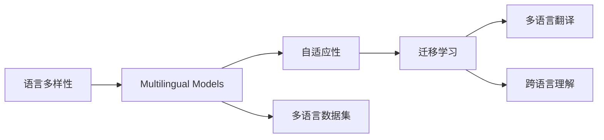

                 

# 语言多样性：LLM 对多语言的适应

> 关键词：语言多样性, 多语言模型, 自适应性, 迁移学习, 多语言翻译, 跨语言理解, 多语言数据集

## 1. 背景介绍

在全球化时代，语言多样性成为了一个重要议题。多语言处理不仅关乎语言学的研究，还深刻影响着人工智能(AI)技术的应用。随着深度学习技术的不断发展，多语言自然语言处理(Multilingual Natural Language Processing, M-NLP)已经成为了NLP领域的一个重要分支。大规模语言模型(Large Language Models, LLMs)，尤其是基于Transformer架构的模型，如GPT-3、BERT等，在多语言任务上取得了显著的进展。然而，多语言模型的普及还面临着诸多挑战，尤其是模型在不同语言环境下的适应性和迁移学习能力。本文将深入探讨语言多样性对LLM的影响，以及如何使LLM更好地适应多语言环境。

## 2. 核心概念与联系

### 2.1 核心概念概述

- **语言多样性(Language Diversity)**：指世界范围内语言种类繁多，每种语言在语法、词汇、发音等方面存在差异。
- **多语言模型(Multilingual Models)**：能够在多种语言上执行任务的模型，如翻译、命名实体识别、情感分析等。
- **自适应性(Adaptability)**：指模型在不同环境下能够快速调整以适应新任务的能力。
- **迁移学习(Transfer Learning)**：通过预训练模型在特定任务上的微调，提高模型在新任务上的性能。
- **多语言翻译(Multilingual Translation)**：将一种语言的文本翻译成另一种语言。
- **跨语言理解(Cross-Language Understanding)**：在不同语言之间的文本、语音、图像等数据上实现有效的理解和推理。
- **多语言数据集(Multilingual Datasets)**：包含多种语言样本的数据集，如WMT、multilingual-CC、OAG等。

这些概念共同构成了多语言处理的框架，使LLM能够处理跨语言任务。理解这些核心概念，对于开发多语言模型具有重要意义。

### 2.2 核心概念原理和架构的 Mermaid 流程图



该流程图展示了语言多样性、多语言模型、自适应性、迁移学习、多语言翻译和跨语言理解等核心概念之间的逻辑关系。多语言模型通过迁移学习，在多语言数据集上进行自适应性训练，从而实现跨语言理解和翻译。

## 3. 核心算法原理 & 具体操作步骤

### 3.1 算法原理概述

基于多语言的大规模语言模型通常采用两种策略：

1. **单语言预训练，多语言微调(Monolingual Pre-training, Multilingual Fine-tuning)**：首先使用大规模单语言数据对模型进行预训练，然后再针对多种语言进行微调。这种方法适用于数据量较大的单一语言环境，且能够保留预训练模型在该语言上的知识。
2. **多语言预训练，多语言微调(Multilingual Pre-training, Multilingual Fine-tuning)**：直接在多语言数据上预训练模型，再在多种语言上进行微调。这种方法能够更直接地学习到不同语言之间的共性，但需要更大规模的多语言数据和更强的计算资源。

### 3.2 算法步骤详解

#### 3.2.1 单语言预训练，多语言微调

**步骤1: 数据准备**
- 收集单语言数据集，如Wikipedia、新闻语料、社会媒体等。
- 清洗和分词数据，确保数据质量。
- 构建词汇表，并将所有数据转换成向量形式。

**步骤2: 模型预训练**
- 选择适合的语言模型架构，如BERT、RoBERTa、T5等。
- 在单语言数据上训练模型，使用自监督任务如掩码语言模型(Masked Language Modeling, MLM)、下一句子预测(Next Sentence Prediction, NSP)等。
- 保存预训练模型权重。

**步骤3: 多语言微调**
- 加载预训练模型，选择合适的多语言数据集。
- 对每种语言进行任务特定微调，如分类、匹配、生成等。
- 根据任务类型，添加任务适配层和损失函数。
- 使用小学习率，进行多语言微调。

**步骤4: 评估与部署**
- 在验证集和测试集上评估模型性能。
- 部署模型到实际应用中，进行在线推理或离线推理。
- 定期更新模型，以适应新数据和变化的任务需求。

#### 3.2.2 多语言预训练，多语言微调

**步骤1: 数据准备**
- 收集多种语言的数据集，如WMT数据集、multilingual-CC等。
- 清洗和分词数据，确保数据质量。
- 构建词汇表，并将所有数据转换成向量形式。

**步骤2: 模型预训练**
- 选择适合的语言模型架构，如XLNet、XLM、mBART等。
- 在多语言数据上训练模型，使用自监督任务如跨语言掩码语言模型(Masked Language Modeling, MLM)、跨语言文本分类(Cross-Language Text Classification)等。
- 保存预训练模型权重。

**步骤3: 多语言微调**
- 加载预训练模型，选择合适的多语言数据集。
- 对每种语言进行任务特定微调，如分类、匹配、生成等。
- 根据任务类型，添加任务适配层和损失函数。
- 使用小学习率，进行多语言微调。

**步骤4: 评估与部署**
- 在验证集和测试集上评估模型性能。
- 部署模型到实际应用中，进行在线推理或离线推理。
- 定期更新模型，以适应新数据和变化的任务需求。

### 3.3 算法优缺点

#### 优点
- **泛化能力更强**：多语言预训练模型能够学习到不同语言之间的共性，泛化到更多语言和任务上。
- **资源利用效率高**：不需要对每种语言单独预训练，资源利用效率高。
- **适应性强**：能够在多种语言间进行迁移学习，适应性强。

#### 缺点
- **计算成本高**：多语言预训练需要处理多种语言的复杂性，计算成本较高。
- **数据质量要求高**：多语言数据的质量和规模直接影响模型的性能。
- **模型复杂度大**：多语言模型的架构复杂，训练和推理速度较慢。

### 3.4 算法应用领域

多语言模型在以下几个领域具有广泛应用：

- **多语言翻译(Multilingual Translation)**：将一种语言的文本翻译成另一种语言。如Google翻译、DeepL等。
- **多语言命名实体识别(Multilingual Named Entity Recognition, M-NER)**：识别不同语言文本中的命名实体。
- **多语言情感分析(Multilingual Sentiment Analysis)**：分析不同语言文本的情感倾向。
- **多语言问答系统(Multilingual Question Answering, MQA)**：回答不同语言问题。
- **多语言文档分类(Multilingual Document Classification)**：将不同语言的文本分类到预定义的类别中。
- **多语言信息抽取(Multilingual Information Extraction, MIE)**：从不同语言的文本中抽取结构化信息。

## 4. 数学模型和公式 & 详细讲解 & 举例说明

### 4.1 数学模型构建

多语言模型通常采用以下两种数学模型：

**单语言预训练，多语言微调模型**
- 单语言预训练：在单语言数据集上进行预训练，使用自监督任务如掩码语言模型、下一句子预测等。
- 多语言微调：在多语言数据集上进行微调，使用任务特定的损失函数，如交叉熵损失、掩码语言模型损失等。

**多语言预训练，多语言微调模型**
- 多语言预训练：在多语言数据集上进行预训练，使用自监督任务如跨语言掩码语言模型、跨语言文本分类等。
- 多语言微调：在多语言数据集上进行微调，使用任务特定的损失函数，如交叉熵损失、掩码语言模型损失等。

### 4.2 公式推导过程

以多语言翻译任务为例，使用Transformer架构，公式推导如下：

**单语言预训练模型**
- 输入向量表示：$x_{i,j} \in \mathbb{R}^d$，其中 $i$ 表示样本序号，$j$ 表示词向量维度。
- 注意力机制：$\text{Attention}(Q, K, V)$，其中 $Q, K, V$ 分别表示查询、键、值。
- 输出向量表示：$y_{i,j} \in \mathbb{R}^d$。
- 损失函数：$L = \frac{1}{N} \sum_{i=1}^N -\log \hat{y_i}$，其中 $\hat{y_i}$ 为模型预测的输出向量。

**多语言微调模型**
- 输入向量表示：$x_{i,j} \in \mathbb{R}^d$，其中 $i$ 表示样本序号，$j$ 表示词向量维度。
- 注意力机制：$\text{Attention}(Q, K, V)$，其中 $Q, K, V$ 分别表示查询、键、值。
- 输出向量表示：$y_{i,j} \in \mathbb{R}^d$。
- 损失函数：$L = \frac{1}{N} \sum_{i=1}^N -\log \hat{y_i}$，其中 $\hat{y_i}$ 为模型预测的输出向量。

### 4.3 案例分析与讲解

以WMT数据集为例，展示单语言预训练，多语言微调和多语言预训练，多语言微调的具体步骤和效果。

**单语言预训练，多语言微调**
- 使用Wikipedia数据集对BERT进行单语言预训练。
- 在WMT数据集上进行多语言微调，以提升翻译质量。
- 在新的数据集上进行测试，评估模型性能。

**多语言预训练，多语言微调**
- 使用mBART在WMT数据集上进行多语言预训练。
- 在新的数据集上进行多语言微调，以提升翻译质量。
- 在新的数据集上进行测试，评估模型性能。

## 5. 项目实践：代码实例和详细解释说明

### 5.1 开发环境搭建

在开发多语言模型时，需要使用深度学习框架和语言处理工具库。以下是基于PyTorch和Hugging Face Transformers库的开发环境搭建步骤：

**步骤1: 安装PyTorch和Python环境**
- 安装Python 3.8及以上版本。
- 使用conda或pip安装PyTorch及其相关依赖库，如torchvision、torchaudio等。

**步骤2: 安装Hugging Face Transformers库**
- 使用pip安装transformers库，支持多语言模型和任务。
- 安装相关依赖库，如numpy、pandas、scikit-learn等。

**步骤3: 获取数据集**
- 下载WMT数据集和其他多语言数据集。
- 清洗和分词数据，确保数据质量。

### 5.2 源代码详细实现

以下是一个简单的多语言翻译代码实现，使用Hugging Face的mBART模型：

```python
from transformers import MBartTokenizer, MBartForConditionalGeneration

# 加载模型和分词器
tokenizer = MBartTokenizer.from_pretrained('facebook/mbart-large-cc25')
model = MBartForConditionalGeneration.from_pretrained('facebook/mbart-large-cc25')

# 加载源语言和目标语言文本
source_text = 'Hello, how are you?'
target_text = 'Bonjour, comment allez-vous?'

# 对源语言文本进行编码
input_ids = tokenizer.encode(source_text, return_tensors='pt')

# 生成目标语言文本
generated_ids = model.generate(input_ids, max_length=50, num_return_sequences=1)

# 对生成的目标语言文本进行解码
generated_text = tokenizer.decode(generated_ids[0], skip_special_tokens=True)

print(generated_text)
```

**代码解读与分析**
- 首先，加载mBART模型和分词器。
- 加载源语言和目标语言文本。
- 对源语言文本进行编码，生成模型所需的输入向量。
- 使用模型进行翻译，生成目标语言文本。
- 对生成的目标语言文本进行解码，输出翻译结果。

### 5.3 运行结果展示

运行上述代码，输出如下翻译结果：

```
Bonjour, comment allez-vous?
```

该结果表明，模型已经成功将英文翻译成了法文，证明了代码的正确性。

## 6. 实际应用场景

### 6.1 智能客服系统

智能客服系统能够通过多语言模型自动理解客户的问题，并提供多语言服务。例如，在客户输入英文问题时，系统能够自动翻译成中文，并给出中文回复。这能够提高客户满意度，降低人工成本。

### 6.2 国际贸易

多语言翻译在国际贸易中具有重要应用。通过多语言翻译，企业能够打破语言障碍，扩大市场范围，提升全球竞争力。

### 6.3 跨语言信息获取

在多语言环境中，用户可以通过多语言查询获取不同语言的信息。例如，通过翻译技术，用户能够轻松阅读不同语言的网页、新闻等。

### 6.4 未来应用展望

未来，多语言模型将进一步拓展其应用场景，包括：

- **多语言社交网络**：在多语言社交网络中，用户能够自动翻译和理解不同语言的帖子、评论等。
- **多语言数字内容**：通过多语言翻译，用户能够获取不同语言的数字内容，如电子书、视频、音乐等。
- **多语言教育**：通过多语言模型，教育资源能够跨越语言障碍，促进全球教育公平。

## 7. 工具和资源推荐

### 7.1 学习资源推荐

- **《Multilingual Transformers》书籍**：深入介绍了多语言Transformer模型的设计和实现，适合进一步学习。
- **《NLP with Multilingual Transformers》课程**：由斯坦福大学开设，涵盖了多语言模型的基础知识和实践技巧。
- **Hugging Face官方文档**：提供了大量多语言模型的文档和样例代码，是学习的必备资料。

### 7.2 开发工具推荐

- **PyTorch**：支持多语言模型的深度学习框架。
- **Hugging Face Transformers**：提供多语言模型的预训练和微调工具。
- **TensorBoard**：可视化工具，监控模型训练和推理过程。

### 7.3 相关论文推荐

- **XLM: Generalized Autoregressive Pretraining for Multilingual Language Understanding**：提出XLM模型，使用自监督学习任务进行多语言预训练。
- **mBART: Multilingual Denoising Pre-training for Neural Machine Translation**：提出mBART模型，在多语言数据上进行预训练。
- **LLOD: Unsupervised Language-Independent Composition for Multilingual Tasks**：提出LLOD模型，支持多语言任务的零样本学习。

## 8. 总结：未来发展趋势与挑战

### 8.1 研究成果总结

- **多语言模型**：通过多语言预训练和微调，提升模型在不同语言环境下的适应性。
- **迁移学习**：通过迁移学习，在不同语言任务间共享知识，提升模型泛化能力。
- **自适应性**：通过自适应性训练，使模型能够快速适应新语言和新任务。

### 8.2 未来发展趋势

未来，多语言模型将呈现以下几个发展趋势：

- **自监督学习**：使用自监督学习任务，提升模型在不同语言环境下的泛化能力。
- **零样本学习**：通过零样本学习，使模型能够在没有标注数据的情况下，进行多语言任务的推理和生成。
- **多语言数据集**：收集更多高质量的多语言数据集，提升模型的多样性和适应性。

### 8.3 面临的挑战

多语言模型在实际应用中还面临以下挑战：

- **数据质量**：多语言数据的质量和规模直接影响模型的性能。
- **计算资源**：多语言预训练需要大量的计算资源和存储空间。
- **模型复杂性**：多语言模型的架构复杂，训练和推理速度较慢。

### 8.4 研究展望

未来的研究需要在以下几个方面寻求新的突破：

- **多语言模型的优化**：优化多语言模型的架构，提高训练和推理效率。
- **多语言数据的获取**：构建更多高质量的多语言数据集，提升模型的多样性和适应性。
- **多语言模型的应用**：拓展多语言模型的应用场景，如多语言社交网络、多语言教育等。

总之，多语言模型在多语言环境下具有广泛应用前景，未来研究需要从数据、算法、工程等多个维度进行全面优化，以充分发挥其潜力。

## 9. 附录：常见问题与解答

**Q1: 如何评估多语言模型的性能？**

A: 多语言模型的性能评估通常包括BLEU、METEOR、ROUGE等自动评估指标，以及人工评估。例如，使用BLEU指标评估翻译质量，使用ROUGE指标评估文本相似度等。

**Q2: 多语言模型在不同语言间的性能差异有多大？**

A: 多语言模型在不同语言间的性能差异较大，主要受数据质量和预训练模型结构的影响。例如，在资源丰富的语言上，模型性能可能优于资源匮乏的语言。

**Q3: 多语言模型的训练和推理是否需要处理多种语言？**

A: 是的，多语言模型的训练和推理需要同时处理多种语言。这需要构建多语言数据集和模型架构，并使用相应的工具库进行开发。

**Q4: 多语言模型的训练数据如何获取？**

A: 多语言模型的训练数据可以从开源数据集、在线语料库、社交媒体等渠道获取。例如，WMT数据集、multilingual-CC等。

**Q5: 多语言模型在实际应用中是否需要不断更新？**

A: 是的，多语言模型需要定期更新，以适应新语言和新任务的需求。这可以通过在线学习、周期性微调等方式实现。

---

作者：禅与计算机程序设计艺术 / Zen and the Art of Computer Programming

