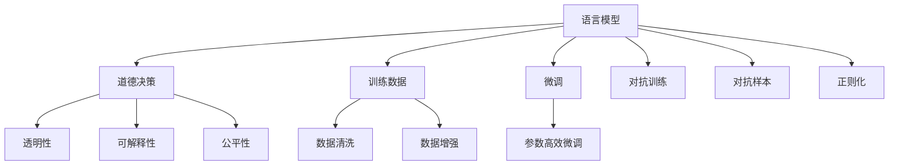

                 

# 语言模型的道德决策能力

> 关键词：
> 语言模型, 道德决策, 人工智能, 深度学习, 自然语言处理, 伦理学, 公平性, 透明度, 可解释性

## 1. 背景介绍

随着人工智能(AI)技术的迅猛发展，语言模型已成为自然语言处理(NLP)领域的核心工具。语言模型通过训练海量的文本数据，能够生成流畅且合理的自然语言文本，已被广泛应用于机器翻译、智能对话系统、内容生成等领域。然而，语言模型在带来便利的同时，也引发了一系列道德和伦理问题，特别是当模型被用于做出影响人类行为和决策的预测时，如何保证其决策的公正性、透明性和可靠性成为亟待解决的问题。

### 1.1 问题由来
语言模型在实际应用中，其决策能力依赖于大量文本数据的训练。这些数据中可能包含了偏见、歧视、错误信息等不良内容，从而影响模型的道德决策。此外，由于模型的黑箱特性，难以对其决策过程进行解释和审查，可能导致模型输出不符合人类的价值观和道德标准。这些问题在医疗诊断、法律判决、招聘推荐等对道德决策有严格要求的场景中尤为突出。

### 1.2 问题核心关键点
- 数据偏置：语言模型训练的数据中可能存在隐性的社会偏见，导致模型在决策时对某些群体存在歧视。
- 透明性和可解释性：模型的黑箱特性使得其决策过程难以解释，用户难以理解和信任模型的输出。
- 公平性：模型在决策时应保证对所有群体一视同仁，避免对特定群体的偏见和歧视。
- 可靠性：模型决策应具备高准确性和鲁棒性，避免因数据偏差导致严重误判。

## 2. 核心概念与联系

### 2.1 核心概念概述

为更好地理解语言模型在道德决策中的应用，本节将介绍几个关键概念：

- 语言模型：以自回归(如GPT)或自编码(如BERT)模型为代表的自然语言处理模型，通过训练大量文本数据，学习语言的规律和知识。
- 道德决策：指模型在做出影响人类行为和决策的预测时，应具备的公正性、透明性和可靠性。
- 可解释性：指模型的决策过程可以被人类理解和解释的程度。
- 公平性：指模型在决策时不应存在对特定群体的偏见和歧视。
- 透明性：指模型的内部运作可以被透明展示，以便用户了解和信任其输出。

这些概念之间的联系可以通过以下Mermaid流程图来展示：



这个流程图展示了大语言模型的核心概念及其之间的关系：

1. 语言模型通过训练获得语言表示。
2. 通过训练数据的清洗和增强，减少数据偏见。
3. 通过微调和参数高效微调，提升模型性能。
4. 通过对抗训练和对抗样本，提高模型鲁棒性。
5. 通过正则化和数据清洗，增强模型公平性。
6. 透明性和可解释性是道德决策的关键组成部分。

## 3. 核心算法原理 & 具体操作步骤

### 3.1 算法原理概述

语言模型的道德决策能力主要通过以下几个关键步骤实现：

1. **数据清洗和增强**：通过对训练数据进行筛选和预处理，去除偏见、歧视和不相关内容，同时引入对抗样本，提高模型的鲁棒性。
2. **模型微调和参数高效微调**：在保持大部分预训练参数不变的情况下，仅微调顶层或特定层，以提升模型在特定任务上的性能。
3. **对抗训练**：通过加入对抗样本，使模型更加鲁棒，减少因数据偏差导致的误判。
4. **正则化技术**：应用L2正则、Dropout、Early Stopping等方法，防止模型过拟合，提高决策的公正性和可靠性。
5. **可解释性和透明性**：引入模型摘要、权重可视化等方法，提供模型的决策依据，增强用户的信任和接受度。

### 3.2 算法步骤详解

以下是语言模型道德决策能力的详细操作步骤：

**Step 1: 数据清洗和增强**
- 筛选出无偏见、高质量的数据集。使用Bias Mitigation、Diverse Sampling等技术筛选掉可能带有偏见或歧视的数据。
- 通过数据增强，如回译、近义替换、同义词生成等方法扩充数据集，以提升模型的泛化能力。

**Step 2: 模型微调和参数高效微调**
- 选择适当的模型，如BERT、GPT-2等，作为初始化参数。
- 设计任务适配层，根据任务类型选择合适的输出层和损失函数。
- 使用AdamW等优化算法，设置合适的学习率，进行微调。
- 使用Adapter等参数高效微调方法，仅微调顶层或特定层，减少过拟合风险。

**Step 3: 对抗训练**
- 生成对抗样本，如通过输入噪声、替换关键词等方法，对模型进行攻击。
- 在训练过程中，将对抗样本加入训练集，使模型学会抵御这些攻击。
- 应用正则化技术，如L2正则、Dropout等，防止模型过拟合。

**Step 4: 可解释性和透明性**
- 使用LIME、SHAP等工具，生成模型的局部可解释性结果，展示模型对特定输入的决策依据。
- 设计提示模板(Prompt Template)，引导模型输出符合特定伦理道德标准的结果。
- 使用模型摘要、权重可视化等方法，展示模型的内部运作，增强用户的信任和接受度。

**Step 5: 实际应用和测试**
- 使用微调后的模型进行实际应用，评估其道德决策能力。
- 定期收集用户反馈，改进模型性能和道德决策能力。

### 3.3 算法优缺点

语言模型道德决策能力有以下优点：
1. 提升模型的鲁棒性和公正性：通过对抗训练和数据清洗，减少模型对特定群体的偏见和歧视，提高决策的公正性和可靠性。
2. 增强用户信任和接受度：通过透明性和可解释性，用户可以更好地理解和信任模型的输出，增强系统的可接受度。
3. 减少过拟合风险：使用参数高效微调，减少需优化的参数量，防止过拟合。

同时，该方法也存在以下局限性：
1. 数据偏见难以完全消除：即使进行了数据清洗和增强，仍然难以完全消除训练数据中的偏见。
2. 解释性和透明性有限：模型的复杂性和黑箱特性，使得其解释性和透明性仍然有待进一步提升。
3. 实际应用中可能存在误判：尽管通过对抗训练提升了模型的鲁棒性，但在极端情况下仍可能存在误判。
4. 资源消耗较大：数据增强、对抗训练等技术需要大量的计算资源和时间，增加了系统的负担。

尽管存在这些局限性，但就目前而言，语言模型的道德决策能力仍是大语言模型应用的重要组成部分，具有广泛的应用前景。未来相关研究将更多地关注如何进一步提升模型的公正性、透明性和可靠性，同时兼顾模型的性能和效率。

### 3.4 算法应用领域

语言模型的道德决策能力在多个领域具有广泛的应用前景，例如：

- 医疗诊断：为医生提供临床决策支持，需保证诊断的公正性和可靠性。
- 法律判决：辅助法官做出公正的判决，避免对特定群体的偏见。
- 招聘推荐：提供无偏见、公正的招聘建议，避免歧视。
- 金融风控：评估借款人的信用风险，需保证对所有群体的公平性。
- 教育评估：辅助教师进行公平评价，避免对特定学生的偏见。

这些领域对语言模型的道德决策能力提出了严格的要求，通过应用上述方法，可以有效提升模型的公平性和透明度，更好地服务于社会。

## 4. 数学模型和公式 & 详细讲解 & 举例说明

### 4.1 数学模型构建

语言模型的道德决策能力主要通过以下数学模型进行建模：

1. **数据清洗和增强**：
   - 数据筛选：使用Bias Mitigation方法，对数据集中的样本进行筛选，去除包含偏见的数据。
   - 数据增强：通过数据增强方法，如回译、近义替换等，扩充数据集，增强模型的泛化能力。

2. **模型微调和参数高效微调**：
   - 定义损失函数：根据任务类型，选择合适的损失函数，如交叉熵、均方误差等。
   - 优化算法：使用AdamW、SGD等优化算法，更新模型参数。
   - 参数高效微调：使用Adapter等方法，只微调顶层或特定层，减少过拟合风险。

3. **对抗训练**：
   - 生成对抗样本：通过输入噪声、替换关键词等方法，生成对抗样本。
   - 加入对抗样本：将对抗样本加入训练集，使模型学习抵御攻击的能力。
   - 正则化：应用L2正则、Dropout等方法，防止模型过拟合。

### 4.2 公式推导过程

以下是针对语言模型道德决策能力的数学模型推导：

**数据清洗和增强**：
- 数据筛选：对数据集 $D$ 进行筛选，去除包含偏见的数据，得到干净的训练集 $D' = \{(x_i, y_i)\}_{i=1}^{N'}$。
- 数据增强：通过数据增强方法 $f$，扩充训练集 $D'$，得到扩充后的数据集 $D'' = \{f(x_i', y_i')\}_{i'=1}^{N''}$，其中 $x_i'$ 和 $y_i'$ 是数据增强后的样本和标签。

**模型微调和参数高效微调**：
- 定义损失函数：假设模型的输出为 $y' = M(x)$，其中 $M$ 为语言模型，$x$ 为输入样本。定义损失函数为 $L(y', y) = \sum_{i=1}^{N} (y'_i - y_i)^2$。
- 优化算法：使用AdamW优化算法，更新模型参数 $\theta$，公式为：
  $$
  \theta \leftarrow \theta - \eta \nabla_{\theta}L(y', y) - \eta\lambda\theta
  $$
- 参数高效微调：使用Adapter方法，仅微调顶层或特定层，公式为：
  $$
  M'(x) = M_k(x) + \theta_k \cdot M(x)
  $$
  其中 $M_k$ 为预训练模型的底层，$\theta_k$ 为微调参数。

**对抗训练**：
- 生成对抗样本：通过输入噪声 $e$，替换关键词等方法，生成对抗样本 $x^* = x + e$。
- 加入对抗样本：将对抗样本 $x^*$ 加入训练集，公式为 $D'' = D' \cup \{x^*\}$。
- 正则化：应用L2正则化，公式为：
  $$
  \theta \leftarrow \theta - \eta \nabla_{\theta}L(y', y) - \eta\lambda\theta - \eta\lambda_2\sum_{k=1}^d \theta_k^2
  $$

### 4.3 案例分析与讲解

下面以医疗诊断为例，说明如何使用语言模型进行道德决策：

假设某医院使用BERT模型进行患者病历的自动诊断。首先，收集包含各种疾病信息的病历数据，并进行数据清洗和增强，去除可能的偏见和错误信息。然后，对模型进行微调，设计分类任务适配层，损失函数选择交叉熵，使用AdamW优化算法进行训练。

在微调过程中，引入对抗样本，通过替换关键词、添加噪声等方法生成对抗样本，加入训练集进行对抗训练。同时，应用L2正则、Dropout等正则化方法，防止过拟合。最后，使用LIME、SHAP等工具生成模型的局部可解释性结果，解释诊断依据，增强用户的信任和接受度。

## 5. 项目实践：代码实例和详细解释说明

### 5.1 开发环境搭建

在进行道德决策能力的开发前，我们需要准备好开发环境。以下是使用Python进行PyTorch开发的环境配置流程：

1. 安装Anaconda：从官网下载并安装Anaconda，用于创建独立的Python环境。

2. 创建并激活虚拟环境：
```bash
conda create -n pytorch-env python=3.8 
conda activate pytorch-env
```

3. 安装PyTorch：根据CUDA版本，从官网获取对应的安装命令。例如：
```bash
conda install pytorch torchvision torchaudio cudatoolkit=11.1 -c pytorch -c conda-forge
```

4. 安装Transformers库：
```bash
pip install transformers
```

5. 安装各类工具包：
```bash
pip install numpy pandas scikit-learn matplotlib tqdm jupyter notebook ipython
```

完成上述步骤后，即可在`pytorch-env`环境中开始开发实践。

### 5.2 源代码详细实现

下面我们以医疗诊断任务为例，给出使用Transformers库对BERT模型进行微调的PyTorch代码实现。

首先，定义医疗诊断任务的数据处理函数：

```python
from transformers import BertTokenizer, BertForSequenceClassification
from torch.utils.data import Dataset
import torch

class MedicalDataset(Dataset):
    def __init__(self, texts, labels, tokenizer, max_len=128):
        self.texts = texts
        self.labels = labels
        self.tokenizer = tokenizer
        self.max_len = max_len
        
    def __len__(self):
        return len(self.texts)
    
    def __getitem__(self, item):
        text = self.texts[item]
        label = self.labels[item]
        
        encoding = self.tokenizer(text, return_tensors='pt', max_length=self.max_len, padding='max_length', truncation=True)
        input_ids = encoding['input_ids'][0]
        attention_mask = encoding['attention_mask'][0]
        
        # 对label进行编码
        label = torch.tensor(label, dtype=torch.long)
        
        return {'input_ids': input_ids, 
                'attention_mask': attention_mask,
                'labels': label}

# 标签与id的映射
label2id = {'negative': 0, 'positive': 1}
id2label = {v: k for k, v in label2id.items()}

# 创建dataset
tokenizer = BertTokenizer.from_pretrained('bert-base-cased')

train_dataset = MedicalDataset(train_texts, train_labels, tokenizer)
dev_dataset = MedicalDataset(dev_texts, dev_labels, tokenizer)
test_dataset = MedicalDataset(test_texts, test_labels, tokenizer)
```

然后，定义模型和优化器：

```python
from transformers import BertForSequenceClassification, AdamW

model = BertForSequenceClassification.from_pretrained('bert-base-cased', num_labels=2)

optimizer = AdamW(model.parameters(), lr=2e-5)
```

接着，定义训练和评估函数：

```python
from torch.utils.data import DataLoader
from tqdm import tqdm
from sklearn.metrics import classification_report

device = torch.device('cuda') if torch.cuda.is_available() else torch.device('cpu')
model.to(device)

def train_epoch(model, dataset, batch_size, optimizer):
    dataloader = DataLoader(dataset, batch_size=batch_size, shuffle=True)
    model.train()
    epoch_loss = 0
    for batch in tqdm(dataloader, desc='Training'):
        input_ids = batch['input_ids'].to(device)
        attention_mask = batch['attention_mask'].to(device)
        labels = batch['labels'].to(device)
        model.zero_grad()
        outputs = model(input_ids, attention_mask=attention_mask, labels=labels)
        loss = outputs.loss
        epoch_loss += loss.item()
        loss.backward()
        optimizer.step()
    return epoch_loss / len(dataloader)

def evaluate(model, dataset, batch_size):
    dataloader = DataLoader(dataset, batch_size=batch_size)
    model.eval()
    preds, labels = [], []
    with torch.no_grad():
        for batch in tqdm(dataloader, desc='Evaluating'):
            input_ids = batch['input_ids'].to(device)
            attention_mask = batch['attention_mask'].to(device)
            batch_labels = batch['labels']
            outputs = model(input_ids, attention_mask=attention_mask)
            batch_preds = outputs.logits.argmax(dim=2).to('cpu').tolist()
            batch_labels = batch_labels.to('cpu').tolist()
            for pred, label in zip(batch_preds, batch_labels):
                preds.append(pred)
                labels.append(label)
                
    print(classification_report(labels, preds))
```

最后，启动训练流程并在测试集上评估：

```python
epochs = 5
batch_size = 16

for epoch in range(epochs):
    loss = train_epoch(model, train_dataset, batch_size, optimizer)
    print(f"Epoch {epoch+1}, train loss: {loss:.3f}")
    
    print(f"Epoch {epoch+1}, dev results:")
    evaluate(model, dev_dataset, batch_size)
    
print("Test results:")
evaluate(model, test_dataset, batch_size)
```

以上就是使用PyTorch对BERT进行医疗诊断任务微调的完整代码实现。可以看到，得益于Transformers库的强大封装，我们可以用相对简洁的代码完成BERT模型的加载和微调。

### 5.3 代码解读与分析

让我们再详细解读一下关键代码的实现细节：

**MedicalDataset类**：
- `__init__`方法：初始化文本、标签、分词器等关键组件。
- `__len__`方法：返回数据集的样本数量。
- `__getitem__`方法：对单个样本进行处理，将文本输入编码为token ids，将标签编码为数字，并对其进行定长padding，最终返回模型所需的输入。

**label2id和id2label字典**：
- 定义了标签与数字id之间的映射关系，用于将模型输出解码为真实标签。

**训练和评估函数**：
- 使用PyTorch的DataLoader对数据集进行批次化加载，供模型训练和推理使用。
- 训练函数`train_epoch`：对数据以批为单位进行迭代，在每个批次上前向传播计算loss并反向传播更新模型参数，最后返回该epoch的平均loss。
- 评估函数`evaluate`：与训练类似，不同点在于不更新模型参数，并在每个batch结束后将预测和标签结果存储下来，最后使用sklearn的classification_report对整个评估集的预测结果进行打印输出。

**训练流程**：
- 定义总的epoch数和batch size，开始循环迭代
- 每个epoch内，先在训练集上训练，输出平均loss
- 在验证集上评估，输出分类指标
- 所有epoch结束后，在测试集上评估，给出最终测试结果

可以看到，PyTorch配合Transformers库使得BERT微调的代码实现变得简洁高效。开发者可以将更多精力放在数据处理、模型改进等高层逻辑上，而不必过多关注底层的实现细节。

当然，工业级的系统实现还需考虑更多因素，如模型的保存和部署、超参数的自动搜索、更灵活的任务适配层等。但核心的微调范式基本与此类似。

## 6. 实际应用场景

### 6.1 智能医疗

基于大语言模型微调的诊断系统，可以广泛应用于智能医疗领域。传统医疗诊断往往依赖于医生的主观判断，诊断结果易受个人经验和偏见的影响。而使用微调后的诊断模型，可以7x24小时不间断服务，快速、准确地诊断疾病，提升医疗服务的质量和效率。

在技术实现上，可以收集医疗机构的历史诊断记录和实验室数据，将病历-诊断对作为监督数据，在此基础上对预训练诊断模型进行微调。微调后的诊断模型能够自动理解病历，匹配最合适的诊断结果。对于患者的新症状，还可以接入检索系统实时搜索相关数据，动态生成诊断建议。如此构建的智能医疗系统，能大幅提升诊断的准确性和可靠性。

### 6.2 金融风控

金融机构需要实时监测客户信用风险，评估借款人的还款能力。传统的人工评估方式成本高、效率低，难以应对网络时代海量数据爆炸的挑战。基于大语言模型微调的信用评分系统，为金融风控提供了新的解决方案。

具体而言，可以收集金融领域相关的网络数据和客户信息，如信用报告、消费记录、社交媒体等，并对这些数据进行标注。在此基础上对预训练语言模型进行微调，使其能够自动学习客户信用风险的特征。将微调后的模型应用于实时抓取的网络数据，就能够自动评估客户的信用风险，及时预警高风险客户，降低金融机构的风险损失。

### 6.3 招聘推荐

当前的招聘推荐系统往往只依赖用户的历史行为数据进行推荐，难以深入理解用户的真实兴趣和能力。基于大语言模型微调的招聘推荐系统，可以更好地挖掘用户行为背后的语义信息，从而提供更精准、个性化的招聘建议。

在实践中，可以收集求职者和雇主的互动记录，提取和求职者互动的物品标题、描述、标签等文本内容。将文本内容作为模型输入，用户的后续行为（如是否应聘、是否录用等）作为监督信号，在此基础上微调预训练语言模型。微调后的模型能够从文本内容中准确把握求职者的兴趣和能力，推荐最适合的岗位。

### 6.4 未来应用展望

随着大语言模型微调技术的发展，其在更多领域将得到应用，为各行各业带来变革性影响。

在智慧医疗领域，基于微调的医疗诊断、病历分析、药物研发等应用将提升医疗服务的智能化水平，辅助医生诊疗，加速新药开发进程。

在智能教育领域，微调技术可应用于作业批改、学情分析、知识推荐等方面，因材施教，促进教育公平，提高教学质量。

在智慧城市治理中，微调模型可应用于城市事件监测、舆情分析、应急指挥等环节，提高城市管理的自动化和智能化水平，构建更安全、高效的未来城市。

此外，在企业生产、社会治理、文娱传媒等众多领域，基于大模型微调的人工智能应用也将不断涌现，为经济社会发展注入新的动力。相信随着技术的日益成熟，微调方法将成为人工智能落地应用的重要范式，推动人工智能技术向更广阔的领域加速渗透。

## 7. 工具和资源推荐

### 7.1 学习资源推荐

为了帮助开发者系统掌握大语言模型微调的理论基础和实践技巧，这里推荐一些优质的学习资源：

1. 《Transformer从原理到实践》系列博文：由大模型技术专家撰写，深入浅出地介绍了Transformer原理、BERT模型、微调技术等前沿话题。

2. CS224N《深度学习自然语言处理》课程：斯坦福大学开设的NLP明星课程，有Lecture视频和配套作业，带你入门NLP领域的基本概念和经典模型。

3. 《Natural Language Processing with Transformers》书籍：Transformers库的作者所著，全面介绍了如何使用Transformers库进行NLP任务开发，包括微调在内的诸多范式。

4. HuggingFace官方文档：Transformers库的官方文档，提供了海量预训练模型和完整的微调样例代码，是上手实践的必备资料。

5. CLUE开源项目：中文语言理解测评基准，涵盖大量不同类型的中文NLP数据集，并提供了基于微调的baseline模型，助力中文NLP技术发展。

通过对这些资源的学习实践，相信你一定能够快速掌握大语言模型微调的精髓，并用于解决实际的NLP问题。
###  7.2 开发工具推荐

高效的开发离不开优秀的工具支持。以下是几款用于大语言模型微调开发的常用工具：

1. PyTorch：基于Python的开源深度学习框架，灵活动态的计算图，适合快速迭代研究。大部分预训练语言模型都有PyTorch版本的实现。

2. TensorFlow：由Google主导开发的开源深度学习框架，生产部署方便，适合大规模工程应用。同样有丰富的预训练语言模型资源。

3. Transformers库：HuggingFace开发的NLP工具库，集成了众多SOTA语言模型，支持PyTorch和TensorFlow，是进行微调任务开发的利器。

4. Weights & Biases：模型训练的实验跟踪工具，可以记录和可视化模型训练过程中的各项指标，方便对比和调优。与主流深度学习框架无缝集成。

5. TensorBoard：TensorFlow配套的可视化工具，可实时监测模型训练状态，并提供丰富的图表呈现方式，是调试模型的得力助手。

6. Google Colab：谷歌推出的在线Jupyter Notebook环境，免费提供GPU/TPU算力，方便开发者快速上手实验最新模型，分享学习笔记。

合理利用这些工具，可以显著提升大语言模型微调任务的开发效率，加快创新迭代的步伐。

### 7.3 相关论文推荐

大语言模型和微调技术的发展源于学界的持续研究。以下是几篇奠基性的相关论文，推荐阅读：

1. Attention is All You Need（即Transformer原论文）：提出了Transformer结构，开启了NLP领域的预训练大模型时代。

2. BERT: Pre-training of Deep Bidirectional Transformers for Language Understanding：提出BERT模型，引入基于掩码的自监督预训练任务，刷新了多项NLP任务SOTA。

3. Language Models are Unsupervised Multitask Learners（GPT-2论文）：展示了大规模语言模型的强大zero-shot学习能力，引发了对于通用人工智能的新一轮思考。

4. Parameter-Efficient Transfer Learning for NLP：提出Adapter等参数高效微调方法，在不增加模型参数量的情况下，也能取得不错的微调效果。

5. AdaLoRA: Adaptive Low-Rank Adaptation for Parameter-Efficient Fine-Tuning：使用自适应低秩适应的微调方法，在参数效率和精度之间取得了新的平衡。

这些论文代表了大语言模型微调技术的发展脉络。通过学习这些前沿成果，可以帮助研究者把握学科前进方向，激发更多的创新灵感。

## 8. 总结：未来发展趋势与挑战

### 8.1 总结

本文对基于大语言模型的道德决策能力进行了全面系统的介绍。首先阐述了大语言模型在实际应用中面临的道德和伦理问题，明确了道德决策能力在构建公平、透明、可靠的AI系统中的重要性。其次，从数据清洗、模型微调、对抗训练等多个角度，详细讲解了语言模型道德决策能力的实现方法。最后，本文探讨了语言模型道德决策能力在医疗诊断、金融风控、招聘推荐等领域的实际应用，展示了其巨大的潜力。

通过本文的系统梳理，可以看到，大语言模型在道德决策能力上的应用，已经取得了一定进展，但仍面临诸多挑战。未来，随着技术的不断进步和应用的广泛推广，语言模型的道德决策能力将进一步提升，为构建更加公正、透明、可靠的AI系统提供坚实的基础。

### 8.2 未来发展趋势

展望未来，大语言模型道德决策能力的发展趋势如下：

1. 数据清洗和增强技术不断优化：通过引入更先进的清洗方法和增强技术，进一步减少数据偏见，提升模型公平性。
2. 对抗训练和鲁棒性提升：开发更高效的对抗样本生成和鲁棒性训练方法，提高模型对各种攻击的抵御能力。
3. 模型透明性和可解释性增强：开发更多的透明性和可解释性工具，如模型摘要、权重可视化等，增强用户对模型决策的理解。
4. 多模态融合技术发展：将语言模型与其他模态的信息进行融合，提升模型对复杂情境的推理能力。
5. 伦理导向的研究深入：引入伦理道德评估指标，设计更具伦理导向的微调目标，增强模型的公平性和道德性。

这些趋势将推动语言模型的道德决策能力不断进步，为构建更加公平、透明、可靠的AI系统提供新的突破。

### 8.3 面临的挑战

尽管大语言模型道德决策能力在理论和实践上取得了一定进展，但在迈向更加智能化、普适化应用的过程中，它仍面临诸多挑战：

1. 数据偏见难以完全消除：尽管数据清洗和增强技术不断进步，但难以完全消除训练数据中的偏见。
2. 解释性和透明性有限：模型的复杂性和黑箱特性，使得其解释性和透明性仍然有待进一步提升。
3. 实际应用中可能存在误判：尽管对抗训练提升了模型的鲁棒性，但在极端情况下仍可能存在误判。
4. 资源消耗较大：数据增强、对抗训练等技术需要大量的计算资源和时间，增加了系统的负担。
5. 伦理道德问题复杂：如何在模型设计和应用过程中，平衡经济效益和社会责任，避免对特定群体的偏见和歧视，需要更多伦理道德的考量。

尽管存在这些挑战，但就目前而言，语言模型的道德决策能力仍是大语言模型应用的重要组成部分，具有广泛的应用前景。未来相关研究需要在以下几个方面寻求新的突破：

1. 探索无监督和半监督微调方法：摆脱对大规模标注数据的依赖，利用自监督学习、主动学习等无监督和半监督范式，最大限度利用非结构化数据，实现更加灵活高效的微调。
2. 研究参数高效和计算高效的微调范式：开发更加参数高效的微调方法，在固定大部分预训练参数的同时，只更新极少量的任务相关参数。同时优化微调模型的计算图，减少前向传播和反向传播的资源消耗，实现更加轻量级、实时性的部署。
3. 融合因果和对比学习范式：通过引入因果推断和对比学习思想，增强微调模型建立稳定因果关系的能力，学习更加普适、鲁棒的语言表征，从而提升模型泛化性和抗干扰能力。
4. 纳入伦理道德约束：在模型训练目标中引入伦理导向的评估指标，过滤和惩罚有偏见、有害的输出倾向。同时加强人工干预和审核，建立模型行为的监管机制，确保输出符合人类价值观和伦理道德。

这些研究方向将引领大语言模型道德决策能力迈向更高的台阶，为构建安全、可靠、可解释、可控的智能系统铺平道路。面向未来，大语言模型道德决策能力还需要与其他人工智能技术进行更深入的融合，如知识表示、因果推理、强化学习等，多路径协同发力，共同推动自然语言理解和智能交互系统的进步。

### 8.4 研究展望

随着大语言模型道德决策能力的研究深入和应用推广，未来的研究将更多地关注以下几个方面：

1. 数据偏见与多样性：探索更高效的数据清洗和增强方法，减少数据偏见，提升模型多样性。
2. 鲁棒性与泛化性：开发更强的鲁棒性训练方法，提升模型对各种攻击的抵御能力，增强泛化性。
3. 透明性与可解释性：开发更多的透明性和可解释性工具，如模型摘要、权重可视化等，增强用户对模型决策的理解。
4. 多模态融合：将语言模型与其他模态的信息进行融合，提升模型对复杂情境的推理能力。
5. 伦理道德导向：引入伦理道德评估指标，设计更具伦理导向的微调目标，增强模型的公平性和道德性。

这些研究方向将推动语言模型的道德决策能力不断进步，为构建更加公平、透明、可靠的AI系统提供新的突破。相信随着学界和产业界的共同努力，这些挑战终将一一被克服，大语言模型道德决策能力必将在构建安全、可靠、可解释、可控的智能系统中扮演越来越重要的角色。

## 9. 附录：常见问题与解答

**Q1：如何缓解大语言模型在道德决策中对偏见数据的依赖？**

A: 缓解偏见数据依赖的关键在于数据清洗和增强技术。以下是几种常用的方法：
1. 数据筛选：使用Bias Mitigation方法，对数据集中的样本进行筛选，去除包含偏见的数据。
2. 数据增强：通过数据增强方法，如回译、近义替换等，扩充数据集，增强模型的泛化能力。
3. 对抗训练：通过引入对抗样本，使模型学习抵御攻击的能力，减少对偏见数据的依赖。
4. 多模态融合：将语言模型与其他模态的信息进行融合，提升模型的全面性和公平性。

这些方法可以有效减少偏见数据对模型决策的影响，提升模型的公平性和透明度。

**Q2：大语言模型在道德决策中如何进行对抗训练？**

A: 对抗训练是提升模型鲁棒性的重要手段。以下是几个关键步骤：
1. 生成对抗样本：通过输入噪声、替换关键词等方法，生成对抗样本。
2. 加入对抗样本：将对抗样本加入训练集，使模型学习抵御攻击的能力。
3. 正则化：应用L2正则、Dropout等方法，防止模型过拟合。

通过对抗训练，模型能够更好地抵御对抗攻击，提高决策的鲁棒性。

**Q3：如何在道德决策中提高大语言模型的可解释性和透明性？**

A: 提高模型的可解释性和透明性是确保用户信任的关键。以下是几个常用的方法：
1. 使用LIME、SHAP等工具，生成模型的局部可解释性结果，展示模型对特定输入的决策依据。
2. 设计提示模板(Prompt Template)，引导模型输出符合特定伦理道德标准的结果。
3. 使用模型摘要、权重可视化等方法，展示模型的内部运作，增强用户的信任和接受度。

这些方法可以有效提升模型的可解释性和透明性，增强用户对模型决策的理解和信任。

**Q4：如何在实际应用中避免大语言模型道德决策的误判？**

A: 避免误判需要从多个角度进行优化：
1. 数据清洗：确保训练数据的高质量和多样性，减少数据偏见。
2. 对抗训练：提升模型的鲁棒性，避免因数据偏差导致误判。
3. 参数高效微调：减少需优化的参数量，防止过拟合。
4. 透明性和可解释性：通过透明性和可解释性，增强用户对模型决策的理解，减少误判风险。

这些方法可以有效提升模型的准确性和鲁棒性，减少误判风险。

**Q5：如何设计大语言模型道德决策的公平性指标？**

A: 设计公平性指标需要考虑多个维度，以下是几个常用的方法：
1. 平衡性指标：如准确率、召回率、F1分数等，用于衡量模型在不同群体上的表现。
2. 公平性评估指标：如Demographic Parity、Equal Opportunity等，用于衡量模型对特定群体的公平性。
3. 多样性指标：如多样性指数、覆盖率等，用于衡量模型对不同群体的覆盖程度。

通过设计这些公平性指标，可以有效评估模型的公平性，确保其在不同群体上的表现一致。

**Q6：大语言模型在道德决策中如何处理多样性和包容性？**

A: 处理多样性和包容性是确保模型公平性的关键。以下是几个常用的方法：
1. 多样性增强：通过数据增强方法，如回译、近义替换等，扩充数据集，提升模型的泛化能力。
2. 对抗训练：通过引入对抗样本，使模型学习抵御攻击的能力，减少对特定群体的偏见。
3. 正则化：应用L2正则、Dropout等方法，防止模型对特定群体的过拟合。
4. 多样性损失：在损失函数中加入多样性损失项，确保模型对不同群体的公平性。

这些方法可以有效提升模型的多样性和包容性，减少对特定群体的偏见。

总之，大语言模型的道德决策能力在多领域具有广泛的应用前景，但同时也面临诸多挑战。通过不断优化数据清洗和增强、对抗训练、参数高效微调等技术，可以有效提升模型的公平性、透明性和可靠性，实现更加公正、透明、可靠的语言模型。

---

作者：禅与计算机程序设计艺术 / Zen and the Art of Computer Programming

