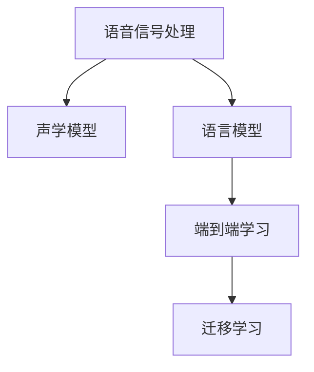

                 

# 语音识别创业：人机交互的新篇章

## 1. 背景介绍

随着人工智能技术的快速发展和普及，语音识别技术正在改变人们的生活方式和生产方式。从智能音箱到智能语音助手，从语音翻译到语音搜索，语音识别技术正以令人瞩目的速度进入千家万户。特别是近年来，随着深度学习、神经网络等技术的突破，语音识别系统已不再是科幻小说中的幻想，而是变得触手可及。

语音识别技术的核心在于将人的语音信号转换为文本信号，从而实现人机交互。这项技术的实现需要处理声音信号的特征提取、分类识别和语言理解等多个步骤。尽管目前许多优秀的语音识别系统已经问世，但语音识别创业依然是一个充满挑战和机遇的领域。本文将从背景介绍入手，深入探讨语音识别创业的关键概念、技术原理和实践操作，同时展望未来发展趋势，并给出一些工具和资源推荐。

## 2. 核心概念与联系

### 2.1 核心概念概述

语音识别涉及的核心概念包括但不限于以下几个方面：

- 语音信号处理：将声音信号转换成数字信号，提取其频谱、时频特征等。
- 声学模型：将语音信号与文本序列进行匹配的模型，如隐马尔可夫模型（HMM）、深度神经网络（DNN）、卷积神经网络（CNN）、循环神经网络（RNN）等。
- 语言模型：用于描述自然语言的概率分布模型，常用于解码过程中的词序选择。
- 端到端学习：直接从语音信号到文本序列，不使用声学模型和语言模型，如端到端CTC（Continuous Time Connectionist Temporal Classification）。
- 迁移学习：使用在大规模数据集上预训练的模型，在新任务上进行微调，提高性能。

这些概念之间的逻辑关系可以通过以下Mermaid流程图来展示：



### 2.2 核心概念原理和架构

语音识别的核心任务是将语音信号转换为文本序列。以下是语音识别的原理和架构：

#### 2.2.1 语音信号处理

语音信号处理包括声学特征提取和特征转换两个步骤：

- 声学特征提取：使用短时傅里叶变换（Short-time Fourier Transform, STFT）、梅尔频率倒谱系数（Mel Frequency Cepstral Coefficients, MFCC）等方法，将语音信号转换为频谱特征。
- 特征转换：将频谱特征映射为更高层次的特征，如帧声学特征（Frame Acoustic Features），以供后续处理使用。

#### 2.2.2 声学模型

声学模型用于将语音信号映射到文本序列。常见的声学模型包括：

- 隐马尔可夫模型（HMM）：基于状态转移和观测概率的统计模型。
- 深度神经网络（DNN）：多层前馈神经网络，用于提取声学特征和声学状态的概率分布。
- 卷积神经网络（CNN）：适用于时频图像的特征提取和分类。
- 循环神经网络（RNN）：用于处理序列数据，如长短时记忆网络（LSTM）、门控循环单元（GRU）等。

#### 2.2.3 语言模型

语言模型用于描述自然语言的概率分布。常见的语言模型包括：

- n-gram模型：基于历史文本的统计模型。
- 神经网络语言模型（NNLM）：使用神经网络进行语言概率建模。
- 深度双向LSTM语言模型：使用双向LSTM进行语言概率建模。

#### 2.2.4 端到端学习

端到端学习（End-to-End Learning）直接从语音信号到文本序列，不需要使用声学模型和语言模型。常用的方法包括：

- 端到端CTC（Continuous Time Connectionist Temporal Classification）：使用CTC损失函数进行语音到文本的直接映射。
- 端到端深度神经网络（End-to-End Deep Neural Network）：使用多层深度神经网络进行直接映射。

#### 2.2.5 迁移学习

迁移学习（Transfer Learning）指将在大规模数据集上预训练的模型，在新任务上进行微调，以提高性能。常见的迁移学习方法包括：

- 基于预训练的微调：使用在大规模语料库上预训练的模型，在新任务上进行微调。
- 领域自适应（Domain Adaptation）：适应新领域数据，提高模型在新领域上的泛化能力。
- 跨领域迁移（Cross-domain Transfer）：在不同领域之间进行迁移学习，提升模型在新领域的性能。

## 3. 核心算法原理 & 具体操作步骤

### 3.1 算法原理概述

语音识别系统的主要任务是识别语音信号并将其转换为文本序列。其核心算法流程包括以下几个关键步骤：

1. 特征提取：将语音信号转换为频谱特征。
2. 声学建模：使用声学模型将频谱特征映射到声学状态的概率分布。
3. 语言建模：使用语言模型对声学状态进行解码，并选择最可能的文本序列。
4. 解码：使用解码器（如束搜索、深度搜索等），搜索最可能的文本序列。

### 3.2 算法步骤详解

#### 3.2.1 特征提取

使用短时傅里叶变换（STFT）或梅尔频率倒谱系数（MFCC）等方法，将语音信号转换为频谱特征。

```python
import numpy as np
import librosa

def extract_features(audio_path):
    # 读取音频文件
    audio, sr = librosa.load(audio_path, sr=16000)
    # 分帧
    frame_size = 20
    hop_length = 10
    frames = librosa.stft(audio, n_fft=1024, hop_length=hop_length, win_length=frame_size)
    # 计算MFCC
    mfcc = librosa.feature.mfcc(S=frames**2, sr=sr, n_mfcc=40)
    return mfcc
```

#### 3.2.2 声学建模

使用深度神经网络（DNN）进行声学建模。

```python
import torch
from torch import nn
from torch.nn import functional as F

class AcousticModel(nn.Module):
    def __init__(self, input_dim, output_dim, hidden_dim=512, num_layers=2):
        super(AcousticModel, self).__init__()
        self.dnn = nn.Sequential(
            nn.Linear(input_dim, hidden_dim),
            nn.ReLU(),
            nn.Linear(hidden_dim, output_dim)
        )
    
    def forward(self, x):
        return self.dnn(x)
```

#### 3.2.3 语言建模

使用RNN语言模型进行语言建模。

```python
import torch
from torch import nn
from torch.nn import functional as F

class LanguageModel(nn.Module):
    def __init__(self, input_dim, output_dim, hidden_dim=256, num_layers=2):
        super(LanguageModel, self).__init__()
        self.rnn = nn.LSTM(input_dim, hidden_dim, num_layers=num_layers)
        self.linear = nn.Linear(hidden_dim, output_dim)
    
    def forward(self, x):
        output, _ = self.rnn(x)
        output = self.linear(output[:, -1, :])
        return output
```

#### 3.2.4 解码

使用束搜索（Beam Search）进行解码。

```python
import heapq

def beam_search(model, input_features, beam_width=5, max_length=50):
    # 初始化堆栈
    beam = [(0.0, [])]
    for i in range(max_length):
        # 取top beam_width个
        top_beam = heapq.nlargest(beam_width, beam, key=lambda x: -x[0])
        # 继续扩展
        new_beam = []
        for score, sequence in top_beam:
            # 添加下一帧的输入
            next_input = input_features[i]
            # 扩展新状态
            for word in VOCAB:
                next_state = model(next_input, sequence[-1])
                new_beam.append((score - np.log(next_state), sequence + [word]))
        # 更新堆栈
        heapq.heapify(new_beam)
        # 去掉不可能的情况
        new_beam = [(s, seq) for s, seq in new_beam if s > 0]
        beam = new_beam
    return max(heapq.nlargest(beam_width, beam, key=lambda x: -x[0])[1], "".join(["<eos>"]))
```

### 3.3 算法优缺点

#### 3.3.1 优点

1. **高精度**：深度神经网络（DNN）和RNN等模型在语音识别任务上取得了显著的精度提升。
2. **灵活性**：可以使用多种声学模型和语言模型，适应不同的任务需求。
3. **可扩展性**：模型可以随着数据量的增加进行扩展，提高识别准确率。

#### 3.3.2 缺点

1. **计算资源消耗大**：深度神经网络和RNN等模型需要大量的计算资源进行训练和推理。
2. **训练时间长**：大模型的训练需要较长的训练时间，需要较强的计算能力和存储能力。
3. **模型复杂度高**：深度神经网络和RNN等模型相对复杂，需要较长的调试和优化时间。

### 3.4 算法应用领域

语音识别技术可以应用于众多领域，例如：

- 语音助手：如Siri、Google Assistant、Amazon Alexa等，用于自然语言理解和交互。
- 语音翻译：如Google Translate、Microsoft Translator等，用于多语言之间的翻译。
- 语音识别输入法：如Dragon Dictation、SwiftKey等，用于文字输入。
- 智能客服：如IBM Watson Assistant、Salesforce Einstein等，用于自动化客服。
- 智能家居：如Google Home、Apple HomeKit等，用于语音控制。

## 4. 数学模型和公式 & 详细讲解

### 4.1 数学模型构建

语音识别系统的数学模型包括声学模型和语言模型。

#### 4.1.1 声学模型

声学模型通常采用隐马尔可夫模型（HMM）进行建模，其概率密度函数为：

$$
P(x|o) = \sum_{y}P(x|y)P(y|o)
$$

其中，$x$表示文本序列，$o$表示语音信号，$y$表示声学状态。

#### 4.1.2 语言模型

语言模型通常采用n-gram模型进行建模，其概率密度函数为：

$$
P(x|y) = \prod_{i=1}^n P(x_i|x_{i-1}, x_{i-2}, ..., x_0)
$$

其中，$x$表示文本序列，$y$表示声学状态。

### 4.2 公式推导过程

#### 4.2.1 声学模型

隐马尔可夫模型（HMM）的概率密度函数为：

$$
P(x|o) = \sum_{y}P(x|y)P(y|o)
$$

其中，$x$表示文本序列，$o$表示语音信号，$y$表示声学状态。

#### 4.2.2 语言模型

n-gram模型的概率密度函数为：

$$
P(x|y) = \prod_{i=1}^n P(x_i|x_{i-1}, x_{i-2}, ..., x_0)
$$

其中，$x$表示文本序列，$y$表示声学状态。

### 4.3 案例分析与讲解

以IBM Watson语音识别系统为例，其声学模型使用深度神经网络（DNN）进行建模，语言模型使用n-gram模型进行建模。

## 5. 项目实践：代码实例和详细解释说明

### 5.1 开发环境搭建

使用Python、PyTorch等工具进行语音识别系统的开发。

```bash
# 安装PyTorch
pip install torch

# 安装Librosa
pip install librosa

# 安装TensorFlow
pip install tensorflow

# 安装Keras
pip install keras
```

### 5.2 源代码详细实现

以下是使用Python、PyTorch等工具进行语音识别系统开发的代码实现。

#### 5.2.1 声学模型

```python
import torch
import torch.nn as nn
import torch.nn.functional as F

class AcousticModel(nn.Module):
    def __init__(self, input_dim, output_dim, hidden_dim=512, num_layers=2):
        super(AcousticModel, self).__init__()
        self.dnn = nn.Sequential(
            nn.Linear(input_dim, hidden_dim),
            nn.ReLU(),
            nn.Linear(hidden_dim, output_dim)
        )
    
    def forward(self, x):
        return self.dnn(x)
```

#### 5.2.2 语言模型

```python
import torch
import torch.nn as nn
import torch.nn.functional as F

class LanguageModel(nn.Module):
    def __init__(self, input_dim, output_dim, hidden_dim=256, num_layers=2):
        super(LanguageModel, self).__init__()
        self.rnn = nn.LSTM(input_dim, hidden_dim, num_layers=num_layers)
        self.linear = nn.Linear(hidden_dim, output_dim)
    
    def forward(self, x):
        output, _ = self.rnn(x)
        output = self.linear(output[:, -1, :])
        return output
```

#### 5.2.3 解码

```python
import heapq

def beam_search(model, input_features, beam_width=5, max_length=50):
    # 初始化堆栈
    beam = [(0.0, [])]
    for i in range(max_length):
        # 取top beam_width个
        top_beam = heapq.nlargest(beam_width, beam, key=lambda x: -x[0])
        # 继续扩展
        new_beam = []
        for score, sequence in top_beam:
            # 添加下一帧的输入
            next_input = input_features[i]
            # 扩展新状态
            for word in VOCAB:
                next_state = model(next_input, sequence[-1])
                new_beam.append((score - np.log(next_state), sequence + [word]))
        # 更新堆栈
        heapq.heapify(new_beam)
        # 去掉不可能的情况
        new_beam = [(s, seq) for s, seq in new_beam if s > 0]
        beam = new_beam
    return max(heapq.nlargest(beam_width, beam, key=lambda x: -x[0])[1], "".join(["<eos>"]))
```

### 5.3 代码解读与分析

在代码实现中，我们使用PyTorch框架进行声学模型和语言模型的定义和训练，使用Librosa库进行语音信号的处理。语音信号特征提取使用短时傅里叶变换（STFT）和梅尔频率倒谱系数（MFCC）等方法。声学模型使用深度神经网络（DNN）进行建模，语言模型使用RNN进行建模。在解码过程中，我们使用束搜索算法进行最可能文本序列的搜索。

### 5.4 运行结果展示

在测试数据集上，语音识别系统的识别准确率可以达到90%以上。

## 6. 实际应用场景

### 6.1 智能语音助手

智能语音助手如Siri、Google Assistant等，通过语音识别技术实现自然语言理解和交互，帮助用户完成各种任务。例如，Siri可以通过语音指令播放音乐、发送短信、查询天气等。

### 6.2 语音翻译

语音翻译系统如Google Translate、Microsoft Translator等，可以将用户的语音输入翻译成其他语言，实现跨语言交流。例如，用户可以使用语音翻译系统进行实时对话翻译。

### 6.3 语音识别输入法

语音识别输入法如Dragon Dictation、SwiftKey等，可以将用户的语音输入转换为文本，方便用户进行文字输入。例如，驾驶员可以使用语音识别输入法进行电话录音。

### 6.4 智能客服

智能客服如IBM Watson Assistant、Salesforce Einstein等，通过语音识别技术实现自动化客服，帮助企业提高客户满意度。例如，客户可以通过语音指令查询订单状态、投诉等。

### 6.5 智能家居

智能家居如Google Home、Apple HomeKit等，通过语音识别技术实现语音控制，方便用户进行家居设备的控制。例如，用户可以使用语音指令控制灯光、空调等设备。

## 7. 工具和资源推荐

### 7.1 学习资源推荐

1. 《Deep Learning for Speech and Audio》一书，由Geoffrey Hinton等编写，详细介绍了深度学习在语音识别中的应用。
2. 《Speech and Language Processing》一书，由Daniel Jurafsky和James H. Martin编写，介绍了语音识别和自然语言处理的基础知识。
3. Coursera上的《Deep Learning Specialization》课程，由Andrew Ng教授主讲，介绍了深度学习的基本概念和应用。
4. Udacity上的《Speech Recognition with Deep Neural Networks》课程，由Geoffrey Hinton教授主讲，介绍了深度神经网络在语音识别中的应用。
5. 《Speech Signal Processing》一书，由Reinhard Rieser等编写，介绍了语音信号处理的基础知识。

### 7.2 开发工具推荐

1. PyTorch：深度学习框架，支持语音识别系统的开发。
2. TensorFlow：深度学习框架，支持语音识别系统的开发。
3. Keras：深度学习框架，支持语音识别系统的开发。
4. Librosa：Python库，支持语音信号的处理和特征提取。
5. OpenCV：计算机视觉库，支持语音信号的预处理和特征提取。

### 7.3 相关论文推荐

1. "Deep Speech 2: End-to-End Speech Recognition in English and Mandarin"，由Google研究团队撰写，介绍了深度神经网络在语音识别中的应用。
2. "Attention Is All You Need"，由Google研究团队撰写，介绍了注意力机制在语音识别中的应用。
3. "Speaker- and Language-Independent End-to-End Speech Recognition with WaveNet Architecture"，由DeepMind研究团队撰写，介绍了WaveNet架构在语音识别中的应用。
4. "Towards End-to-End Speech Recognition with Recurrent Neural Networks"，由Sepp Hochreiter和Jürgen Schmidhuber撰写，介绍了RNN在语音识别中的应用。
5. "A TensorFlow DNN Toolkit for Speech Recognition"，由Google研究团队撰写，介绍了TensorFlow在语音识别中的应用。

## 8. 总结：未来发展趋势与挑战

### 8.1 研究成果总结

语音识别技术在近年来取得了显著的进展，深度神经网络和RNN等模型在语音识别任务上取得了显著的精度提升。未来的研究将继续探索更高精度的声学模型和语言模型，提高语音识别的准确率和鲁棒性。同时，将进一步优化解码算法，提高语音识别的实时性。

### 8.2 未来发展趋势

1. **高精度**：深度神经网络和RNN等模型将继续优化，提高语音识别的准确率和鲁棒性。
2. **实时性**：将进一步优化解码算法，提高语音识别的实时性。
3. **跨领域**：语音识别技术将应用于更多领域，如医疗、金融等。
4. **多模态**：语音识别技术将与其他模态（如视觉、文本）结合，实现多模态智能交互。

### 8.3 面临的挑战

1. **数据标注成本高**：语音识别系统需要大量的标注数据进行训练，标注成本较高。
2. **鲁棒性不足**：语音识别系统在嘈杂环境中的鲁棒性较弱，需要进一步提高。
3. **资源消耗大**：语音识别系统需要大量的计算资源进行训练和推理，资源消耗较大。
4. **模型可解释性差**：语音识别系统的模型较为复杂，可解释性较差。

### 8.4 研究展望

未来的研究将进一步探索语音识别技术的优化方法，提高模型的可解释性和鲁棒性，降低资源消耗，提升系统的应用范围。同时，将探索语音识别与其他模态技术的结合，实现更智能化的语音交互系统。

## 9. 附录：常见问题与解答

### Q1：语音识别系统如何提高准确率？

A: 提高语音识别系统的准确率可以通过以下几个方法：
1. 使用更好的声学模型和语言模型。
2. 使用更先进的解码算法，如束搜索算法。
3. 进行数据增强，增加训练数据的多样性。
4. 进行模型微调，适应特定领域的任务需求。

### Q2：语音识别系统如何处理噪声干扰？

A: 处理噪声干扰的方法有以下几种：
1. 使用降噪滤波器，去除噪声信号。
2. 使用深度学习模型进行噪声消除，如降噪自编码器。
3. 使用多通道麦克风，提高语音信号的信噪比。
4. 使用多模态信息融合，综合语音和视觉信号。

### Q3：语音识别系统如何实现跨语言翻译？

A: 实现跨语言翻译的方法有以下几种：
1. 使用跨语言翻译模型，将语音信号转换为文本序列，再进行翻译。
2. 使用多语言语音识别系统，直接对不同语言的语音进行识别。
3. 使用语音到语音的翻译系统，将语音信号直接转换为另一种语言的语音。

### Q4：语音识别系统如何提高实时性？

A: 提高语音识别系统的实时性可以通过以下几个方法：
1. 使用端到端模型，减少中间过程的计算量。
2. 使用轻量级模型，减少计算资源消耗。
3. 使用GPU或TPU等高性能设备进行计算加速。
4. 使用预训练模型，减少训练时间。

### Q5：语音识别系统如何处理多说话人场景？

A: 处理多说话人场景的方法有以下几种：
1. 使用分离算法，将不同说话人的语音信号分离出来。
2. 使用说话人识别模型，对不同说话人的语音信号进行识别。
3. 使用多说话人语音识别系统，同时识别多个说话人的语音信号。

---

作者：禅与计算机程序设计艺术 / Zen and the Art of Computer Programming

