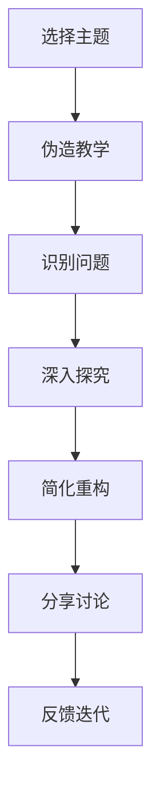

                 

## 1. 背景介绍

在人工智能的浪潮下，团队学习和成长的节奏日益加快，面对越来越复杂的技术问题和不断涌现的挑战，如何高效地学习和应用新技术成为每个团队必须面对的问题。费曼提问法（Feynman Technique）作为一种科学学习和教学方法，以其高效性和实用性被广泛应用。本文将详细探讨费曼提问法在促进团队学习与成长中的应用，并介绍其在软件开发、人工智能等领域的实际应用场景。

## 2. 核心概念与联系

### 2.1 核心概念概述

费曼提问法是一种基于信息增益的科学学习方法，由诺贝尔物理学奖得主理查德·费曼提出。其核心思想是通过将复杂知识转化为简单问题，促使学习者深入理解并掌握知识。

费曼提问法主要包含以下几个步骤：
1. **选择主题**：选择一个你想学习的知识点。
2. **伪造教学**：想象自己正在向一个毫无相关背景知识的听众讲解该主题。
3. **识别问题**：找出自己在解释过程中无法理解或无法讲清楚的问题。
4. **深入探究**：研究并解决这些“假想教学”中的问题。
5. **简化重构**：用更简洁明了的语言重新组织你的理解，以便更好地教授他人。

### 2.2 核心概念原理和架构的 Mermaid 流程图

通过这个流程，费曼提问法促使学习者不断发现问题并深入探究，从而真正掌握知识。

## 3. 核心算法原理 & 具体操作步骤

### 3.1 算法原理概述

费曼提问法通过将知识转化为问题，促使学习者深入理解并掌握知识。其核心在于通过“教与学”的互动，激发学习者的主动探索精神，从而达到高效学习的目的。

### 3.2 算法步骤详解

#### 步骤1：选择主题

选择你要学习的知识点，例如人工智能中的某个特定算法、框架或应用场景。

#### 步骤2：伪造教学

想象你正在向一个毫无相关背景知识的听众讲解这个主题。你需要使用简单明了的语言，避免使用过于复杂的术语和公式。

#### 步骤3：识别问题

在“伪造教学”过程中，你会遇到无法解释或解释不清的问题。这些问题可能涉及到复杂的概念、公式或应用场景。记录下这些问题，并尝试理解它们。

#### 步骤4：深入探究

针对这些问题，进行深入的研究和探究。这可能包括阅读相关书籍、观看教程视频、咨询专家或与团队成员讨论。

#### 步骤5：简化重构

将你新学到的知识用更简洁明了的语言重新组织，以便更好地教授他人。这不仅可以加深你的理解，还可以帮助你发现知识间的联系。

#### 步骤6：分享讨论

将你的学习成果与团队成员分享讨论。可以通过团队会议、编程讨论或在线协作工具（如Slack、Microsoft Teams等）进行。

#### 步骤7：反馈迭代

根据团队成员的反馈，进一步完善和深化你的理解。重复上述步骤，直到你能够清晰、准确地解释这个主题。

### 3.3 算法优缺点

#### 优点：

1. **主动学习**：通过“教与学”的互动，激发学习者的积极性和主动性，加深对知识的理解和记忆。
2. **深入理解**：将复杂问题转化为简单问题，促使学习者深入理解核心概念和原理。
3. **高效沟通**：通过分享讨论，促进团队成员之间的知识交流和协作，提升团队整体的技术水平。

#### 缺点：

1. **时间和资源投入**：需要投入大量的时间和精力进行学习和研究，可能会影响日常工作。
2. **个人差异**：不同学习者的理解能力和学习速度不同，可能导致某些成员的学习进度落后。
3. **挑战性**：对于一些特别复杂或抽象的主题，可能难以找到合适的切入点和解释方式。

### 3.4 算法应用领域

费曼提问法不仅适用于学习新知识，也适用于团队内部的技术分享和知识传递。在软件开发、人工智能等领域，费曼提问法可以帮助团队成员深入理解技术细节，提升团队的整体技术水平。

## 4. 数学模型和公式 & 详细讲解 & 举例说明

### 4.1 数学模型构建

费曼提问法并不直接涉及数学模型构建，但其核心思想是简化和深入理解复杂概念，这与数学建模中的一些基本原则相通。

### 4.2 公式推导过程

由于费曼提问法主要是一种学习方法，并不涉及具体的数学公式推导，因此此部分略过。

### 4.3 案例分析与讲解

#### 案例1：人工智能中的机器学习算法

假设团队需要学习机器学习中的梯度下降算法。

- **选择主题**：梯度下降算法
- **伪造教学**：想象向一个没有数学基础的人解释梯度下降的工作原理。
- **识别问题**：如何简化梯度下降的数学公式，使听众能够理解？
- **深入探究**：研究梯度下降算法的数学原理和优化过程。
- **简化重构**：将梯度下降的数学公式转化为更易理解的可视化图表和实际案例。
- **分享讨论**：与团队成员分享你的理解，讨论是否存在进一步简化的可能。
- **反馈迭代**：根据反馈进一步改进你的解释方式，直至能够清晰地讲解梯度下降算法。

#### 案例2：软件开发中的版本控制

假设团队需要学习Git版本控制系统的基本使用方法。

- **选择主题**：Git版本控制
- **伪造教学**：想象向一个没有编程经验的人讲解如何使用Git。
- **识别问题**：如何简化Git的命令和操作流程，使听众能够快速上手？
- **深入探究**：研究Git的命令和操作原理，学习如何进行分支管理、合并冲突等。
- **简化重构**：将Git的命令和操作流程转化为易于理解的简单步骤。
- **分享讨论**：与团队成员分享你的学习成果，讨论是否有更简单的方法来操作Git。
- **反馈迭代**：根据反馈进一步简化Git的操作流程，提升团队成员的使用效率。

## 5. 项目实践：代码实例和详细解释说明

### 5.1 开发环境搭建

为了实践费曼提问法，需要搭建一个开发环境，用于记录学习过程和分享讨论。

1. **选择合适的工具**：可以选择一些简单易用的协作工具，如Jira、Trello、Slack等。
2. **创建学习任务**：创建具体的学习任务，如“学习Git版本控制”、“理解机器学习算法”等。
3. **搭建讨论平台**：建立团队讨论平台，如Slack频道或Microsoft Teams小组，用于分享和讨论学习成果。

### 5.2 源代码详细实现

由于费曼提问法主要涉及知识学习和讨论，并不直接涉及代码实现，因此此部分略过。

### 5.3 代码解读与分析

同理，由于费曼提问法不涉及具体的代码实现，此部分略过。

### 5.4 运行结果展示

由于费曼提问法的重点是知识学习和讨论，而非具体的代码实现，因此没有运行结果展示。

## 6. 实际应用场景

### 6.1 软件开发

在软件开发领域，费曼提问法可以帮助团队成员深入理解技术细节，提升整体技术水平。

- **技术分享**：通过团队会议或编程讨论，分享学习成果，促进知识交流。
- **技术培训**：利用费曼提问法，进行针对性的技术培训，提升团队成员的技术能力。
- **代码评审**：在代码评审过程中，通过费曼提问法，深入理解代码实现，提升代码质量。

### 6.2 人工智能

在人工智能领域，费曼提问法可以帮助团队成员理解复杂算法和模型。

- **算法学习**：通过费曼提问法，深入理解各种机器学习算法和深度学习模型。
- **模型优化**：通过分享讨论，优化模型的实现和性能。
- **项目实践**：利用费曼提问法，解决项目中遇到的技术难题，提升项目的成功率。

### 6.3 项目管理

在项目管理中，费曼提问法可以帮助团队更好地理解项目需求和技术细节。

- **需求分析**：通过费曼提问法，深入理解项目需求，确保项目的顺利推进。
- **技术实现**：通过费曼提问法，理解技术细节，确保项目的成功实施。
- **风险评估**：通过费曼提问法，识别项目中的潜在风险，提前做好应对措施。

## 7. 工具和资源推荐

### 7.1 学习资源推荐

1. **《费曼学习法》**：这本书详细介绍了费曼提问法的理论基础和实际应用，是学习费曼提问法的绝佳资源。
2. **Coursera的《科学学习与教学》课程**：由斯坦福大学的教育学教授主讲，深入浅出地介绍了费曼提问法的应用和实践。
3. **EdX的《创新学习法》课程**：介绍了多种创新学习方法，包括费曼提问法，适合对学习方法感兴趣的读者。

### 7.2 开发工具推荐

1. **Jira**：用于任务管理和项目跟踪，适合团队协作和学习任务的记录。
2. **Trello**：简单易用的项目管理工具，适合组织和安排学习任务。
3. **Slack**：实时沟通工具，适合团队成员之间的讨论和分享。
4. **Microsoft Teams**：在线协作工具，适合进行在线讨论和知识分享。

### 7.3 相关论文推荐

1. **《费曼学习法：学习科学的新范式》**：介绍费曼提问法的理论基础和应用实践。
2. **《科学学习与教学：一种新范式》**：由多位教育学家和心理学家合著，介绍了科学学习的最新研究成果。
3. **《创新学习法：基于知识整合的学习模型》**：介绍多种创新学习方法，包括费曼提问法。

## 8. 总结：未来发展趋势与挑战

### 8.1 研究成果总结

费曼提问法作为一种高效的学习方法，在团队学习和知识传递中发挥了重要作用。通过将复杂知识转化为简单问题，促使学习者深入理解并掌握知识，从而提升团队整体的技术水平。

### 8.2 未来发展趋势

未来，费曼提问法将继续在各个领域得到广泛应用，成为一种通用的学习方法。随着技术的不断发展，可能会有更多基于数字化工具和智能技术的改进，如智能学习平台、虚拟现实学习环境等，进一步提升学习效果。

### 8.3 面临的挑战

虽然费曼提问法具有诸多优点，但在实际应用中也面临一些挑战：

1. **时间成本**：需要投入大量时间和精力进行学习和研究，可能会影响日常工作。
2. **个人差异**：不同学习者的理解能力和学习速度不同，可能导致某些成员的学习进度落后。
3. **技术复杂度**：对于一些特别复杂或抽象的主题，可能难以找到合适的切入点和解释方式。

### 8.4 研究展望

未来，费曼提问法的研究方向可能包括：

1. **数字化工具的开发**：开发更多基于数字化工具的学习平台，提高学习效率和效果。
2. **智能技术的应用**：利用智能技术，如自然语言处理、机器学习等，进一步优化费曼提问法的应用。
3. **跨学科融合**：将费曼提问法与其他学科的学习方法进行融合，探索新的学习范式。

## 9. 附录：常见问题与解答

**Q1: 费曼提问法是否适用于所有知识点？**

A: 费曼提问法适用于大多数知识点，但对于特别复杂或抽象的主题，可能需要更长时间和更深入的研究。

**Q2: 如何处理学习过程中遇到的问题？**

A: 在费曼提问法中，识别问题并深入探究是关键步骤。可以参考以下步骤：
1. **记录问题**：将遇到的问题详细记录下来，以便后续研究。
2. **研究问题**：通过阅读书籍、观看视频、咨询专家等方式，深入研究问题。
3. **讨论问题**：与团队成员讨论问题，寻找新的解决方案。
4. **应用问题**：将研究结果应用到实际问题中，验证其有效性。

**Q3: 如何选择合适的学习主题？**

A: 选择感兴趣且与工作相关的知识点，可以提高学习的积极性和效果。可以从以下几方面考虑：
1. **工作需求**：选择与工作相关且需要掌握的知识点。
2. **个人兴趣**：选择你感兴趣且愿意深入研究的知识点。
3. **未来趋势**：选择有发展前景且值得投资的知识点。

**Q4: 如何高效利用费曼提问法？**

A: 高效的费曼提问法需要以下几个步骤：
1. **明确目标**：明确你想要学习的主题和目标。
2. **分解主题**：将主题分解为多个子主题，逐一攻克。
3. **迭代优化**：根据反馈不断优化你的解释和理解，直至清晰准确。
4. **持续实践**：将学到的知识应用到实际项目中，不断巩固和提高。

**Q5: 如何提升费曼提问法的应用效果？**

A: 提升费曼提问法的应用效果可以从以下几个方面入手：
1. **团队协作**：与团队成员进行频繁的讨论和交流，共同解决学习中的问题。
2. **持续学习**：不断更新学习资料和工具，保持学习的时效性。
3. **跨学科融合**：将费曼提问法与其他学科的学习方法进行融合，探索新的学习范式。

**Q6: 费曼提问法的局限性有哪些？**

A: 费曼提问法的局限性包括：
1. **时间成本**：需要投入大量时间和精力进行学习和研究。
2. **个人差异**：不同学习者的理解能力和学习速度不同，可能导致某些成员的学习进度落后。
3. **技术复杂度**：对于一些特别复杂或抽象的主题，可能难以找到合适的切入点和解释方式。

总之，费曼提问法是一种高效的学习方法，通过将复杂知识转化为简单问题，促使学习者深入理解并掌握知识，从而提升团队整体的技术水平。然而，在实际应用中也面临一些挑战，需要不断优化和改进，以适应不同的学习场景和需求。

---

作者：禅与计算机程序设计艺术 / Zen and the Art of Computer Programming

