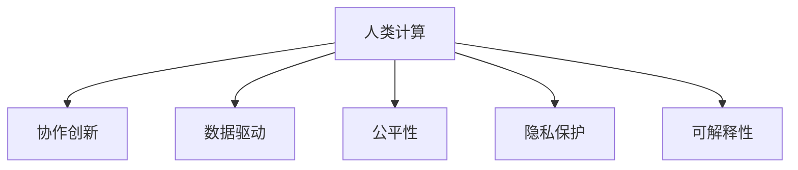

                 

# 赋能个人与社区：人类计算的社会价值

> 关键词：人类计算, 社会价值, 社区赋能, 协作创新, 数据驱动, 人工智能伦理, 隐私保护, 公平性

## 1. 背景介绍

### 1.1 问题由来
在当今这个信息化时代，技术的进步和数据的积累为人类社会带来了前所未有的机遇和挑战。从智能手机的普及到大数据分析，从云计算到物联网，技术的变革已经深入到社会的方方面面，极大地改变了人们的生活方式和工作方式。然而，技术的快速发展也带来了新的社会问题，如数字鸿沟、隐私泄露、算法偏见等，这些问题亟需通过技术手段加以解决。

在此背景下，人类计算（Human Compute）应运而生。人类计算强调利用人类的智慧和能力，与机器智能相结合，共同解决复杂的社会问题。这种计算方式不仅能充分利用人类的认知优势，还能弥补机器智能在某些领域的局限性。本文将探讨人类计算的概念及其在社会价值方面的应用，特别是如何通过人类计算赋能个人与社区，实现共同创新和发展。

### 1.2 问题核心关键点
人类计算的核心在于结合人类智慧和机器智能，通过协作和创新，解决复杂社会问题。其主要关键点包括：

1. **协作创新**：将人类的创意和机器的能力结合起来，共同开发出更有效的解决方案。
2. **数据驱动**：利用数据作为决策的依据，减少人为偏见，提高决策的科学性和准确性。
3. **公平性**：通过算法设计和数据管理，保障不同群体的公平性，减少社会不公。
4. **隐私保护**：在数据收集和处理过程中，采取严格的隐私保护措施，防止数据滥用。
5. **可解释性**：确保算法的决策过程可解释，提高透明度，增强信任感。

这些关键点构成了人类计算的基本框架，旨在通过技术和社会的协同作用，实现更美好的社会愿景。

## 2. 核心概念与联系

### 2.1 核心概念概述

为更好地理解人类计算的概念及其在社会中的应用，本节将介绍几个密切相关的核心概念：

- **人类计算**：利用人类的智慧和能力，结合机器智能，共同解决复杂社会问题。人类计算强调协作和创新，融合了人类的逻辑思维和机器的计算能力。
- **协作创新**：通过人类的创意和机器的能力相结合，共同开发出更有效的解决方案。协作创新是实现社会问题解决的重要手段。
- **数据驱动**：利用数据作为决策的依据，减少人为偏见，提高决策的科学性和准确性。数据驱动是现代技术的重要特征。
- **公平性**：通过算法设计和数据管理，保障不同群体的公平性，减少社会不公。公平性是人类计算的重要目标之一。
- **隐私保护**：在数据收集和处理过程中，采取严格的隐私保护措施，防止数据滥用。隐私保护是人类计算中不可忽视的重要环节。
- **可解释性**：确保算法的决策过程可解释，提高透明度，增强信任感。可解释性是提高算法可信度的关键。

这些核心概念之间的逻辑关系可以通过以下Mermaid流程图来展示：



这个流程图展示了这个概念框架中的各个部分及其相互关系：

1. 人类计算强调协作创新，结合人类的智慧和机器的能力。
2. 数据驱动利用数据作为决策依据，减少人为偏见。
3. 公平性通过算法设计和数据管理保障不同群体的权益。
4. 隐私保护在数据处理中确保数据安全和隐私。
5. 可解释性提高算法的透明度和信任度。

## 3. 核心算法原理 & 具体操作步骤

### 3.1 算法原理概述

人类计算的核心算法原理可以概括为以下几个方面：

1. **协作创新算法**：利用人类的创意和机器的能力，共同开发出创新的解决方案。协作创新算法包括众包、协同过滤等。
2. **数据驱动算法**：通过数据收集、处理和分析，减少人为偏见，提高决策的科学性和准确性。数据驱动算法包括回归分析、分类算法等。
3. **公平性算法**：通过算法设计和数据管理，保障不同群体的公平性。公平性算法包括公平性评估、数据匿名化等。
4. **隐私保护算法**：在数据收集和处理过程中，采取严格的隐私保护措施，防止数据滥用。隐私保护算法包括差分隐私、数据加密等。
5. **可解释性算法**：确保算法的决策过程可解释，提高透明度，增强信任感。可解释性算法包括特征可视化、规则提取等。

### 3.2 算法步骤详解

以下是人类计算的核心算法步骤：

1. **问题定义**：明确要解决的社会问题，如疾病预测、灾害预警、环境保护等。
2. **数据收集**：收集与问题相关的数据，包括传感器数据、问卷调查、公开数据等。
3. **数据预处理**：对收集到的数据进行清洗、归一化、特征提取等预处理步骤，以便后续分析。
4. **算法开发**：根据问题特点，选择合适的算法进行开发和优化。
5. **模型训练**：在大量数据上训练模型，调整参数，提高模型的性能。
6. **模型评估**：通过实验和测试，评估模型的效果，确保其准确性和可靠性。
7. **结果应用**：将训练好的模型应用到实际问题中，提供解决方案。
8. **反馈迭代**：根据应用效果，收集反馈，进行模型优化和改进。

### 3.3 算法优缺点

人类计算具有以下优点：

1. **综合优势**：结合人类的智慧和机器的能力，能够更好地解决复杂社会问题。
2. **灵活性**：算法可以根据问题特点灵活调整，适应性强。
3. **可解释性**：算法的决策过程可解释，增强了模型的透明度和信任度。

同时，人类计算也存在以下缺点：

1. **成本高**：大规模数据收集和处理需要大量的资源和时间。
2. **隐私风险**：数据收集和处理过程中存在隐私泄露的风险。
3. **人为偏差**：数据收集和模型训练过程中可能存在人为偏见，影响决策的公平性。

### 3.4 算法应用领域

人类计算的应用领域非常广泛，主要包括以下几个方面：

1. **公共健康**：利用数据和算法预测疾病爆发，监测公共卫生事件。
2. **环境保护**：通过数据收集和分析，优化资源配置，保护生态环境。
3. **金融科技**：利用数据驱动算法进行风险评估，提供个性化的金融服务。
4. **智慧城市**：通过数据收集和处理，提升城市管理的智能化水平。
5. **教育科技**：利用协作创新算法开发教育工具，提高教育质量。

## 4. 数学模型和公式 & 详细讲解 & 举例说明

### 4.1 数学模型构建

人类计算的数学模型构建主要包括以下几个步骤：

1. **问题抽象**：将社会问题抽象为数学模型，以便进行量化分析。
2. **数据建模**：选择合适的数学模型对数据进行建模，以便提取有用的信息。
3. **算法设计**：根据问题特点和数据结构，设计合适的算法。
4. **模型训练**：在大量数据上训练模型，调整参数，提高模型的性能。
5. **模型评估**：通过实验和测试，评估模型的效果，确保其准确性和可靠性。

### 4.2 公式推导过程

以疾病预测为例，我们可以构建一个基于逻辑回归的数学模型：

设疾病发生与否为二分类变量 $y \in \{0,1\}$，影响因素为 $x_1, x_2, ..., x_n$，构建如下逻辑回归模型：

$$
P(y=1|x) = \frac{1}{1+\exp(-\beta_0 - \beta_1 x_1 - ... - \beta_n x_n)}
$$

其中 $\beta_0, \beta_1, ..., \beta_n$ 为模型参数。根据最大似然估计，可以得到参数估计公式：

$$
\hat{\beta} = \arg\min_{\beta} -\frac{1}{N}\sum_{i=1}^N y_i \log P(y=1|x_i) + (1-y_i)\log(1-P(y=1|x_i))
$$

### 4.3 案例分析与讲解

假设我们希望构建一个基于人类计算的疾病预测系统。系统的主要步骤如下：

1. **数据收集**：收集患者的病历数据、生活习惯数据等，构建训练集和测试集。
2. **数据预处理**：对收集到的数据进行清洗、归一化、特征提取等预处理步骤，以便后续分析。
3. **模型设计**：选择逻辑回归模型，构建基于人类计算的协作创新算法。
4. **模型训练**：在大量数据上训练模型，调整参数，提高模型的性能。
5. **模型评估**：通过实验和测试，评估模型的效果，确保其准确性和可靠性。
6. **结果应用**：将训练好的模型应用到实际问题中，提供疾病预测服务。
7. **反馈迭代**：根据应用效果，收集反馈，进行模型优化和改进。

## 5. 项目实践：代码实例和详细解释说明

### 5.1 开发环境搭建

在进行人类计算项目开发前，我们需要准备好开发环境。以下是使用Python进行PyTorch开发的环境配置流程：

1. 安装Anaconda：从官网下载并安装Anaconda，用于创建独立的Python环境。

2. 创建并激活虚拟环境：
```bash
conda create -n human-compute-env python=3.8 
conda activate human-compute-env
```

3. 安装PyTorch：根据CUDA版本，从官网获取对应的安装命令。例如：
```bash
conda install pytorch torchvision torchaudio cudatoolkit=11.1 -c pytorch -c conda-forge
```

4. 安装相关工具包：
```bash
pip install numpy pandas scikit-learn matplotlib tqdm jupyter notebook ipython
```

完成上述步骤后，即可在`human-compute-env`环境中开始项目开发。

### 5.2 源代码详细实现

我们以疾病预测为例，给出使用PyTorch进行人类计算的代码实现。

首先，定义数据处理函数：

```python
import pandas as pd
from sklearn.model_selection import train_test_split
from sklearn.preprocessing import StandardScaler

def load_data(path):
    data = pd.read_csv(path)
    X = data.drop('disease', axis=1)
    y = data['disease']
    X_train, X_test, y_train, y_test = train_test_split(X, y, test_size=0.2, random_state=42)
    scaler = StandardScaler()
    X_train = scaler.fit_transform(X_train)
    X_test = scaler.transform(X_test)
    return X_train, X_test, y_train, y_test
```

然后，定义模型和优化器：

```python
from torch.utils.data import Dataset, DataLoader
from transformers import LogisticRegression, Adam

class DiseaseDataset(Dataset):
    def __init__(self, X, y):
        self.X = X
        self.y = y
        
    def __len__(self):
        return len(self.X)
    
    def __getitem__(self, item):
        return self.X[item], self.y[item]

model = LogisticRegression()
optimizer = Adam(model.parameters(), lr=0.001)
```

接着，定义训练和评估函数：

```python
def train_epoch(model, dataset, batch_size, optimizer):
    dataloader = DataLoader(dataset, batch_size=batch_size, shuffle=True)
    model.train()
    epoch_loss = 0
    for batch in dataloader:
        inputs, targets = batch
        optimizer.zero_grad()
        outputs = model(inputs)
        loss = outputs.mean()
        epoch_loss += loss.item()
        loss.backward()
        optimizer.step()
    return epoch_loss / len(dataloader)

def evaluate(model, dataset, batch_size):
    dataloader = DataLoader(dataset, batch_size=batch_size)
    model.eval()
    preds, labels = [], []
    with torch.no_grad():
        for batch in dataloader:
            inputs, targets = batch
            batch_preds = model(inputs).argmax(dim=1).tolist()
            batch_labels = targets.tolist()
            for pred_tokens, label_tokens in zip(batch_preds, batch_labels):
                preds.append(pred_tokens)
                labels.append(label_tokens)
                
    print(classification_report(labels, preds))
```

最后，启动训练流程并在测试集上评估：

```python
epochs = 10
batch_size = 32

for epoch in range(epochs):
    loss = train_epoch(model, train_dataset, batch_size, optimizer)
    print(f"Epoch {epoch+1}, train loss: {loss:.3f}")
    
    print(f"Epoch {epoch+1}, test results:")
    evaluate(model, test_dataset, batch_size)
    
print("All done.")
```

以上就是使用PyTorch进行人类计算的完整代码实现。可以看到，得益于PyTorch的强大封装，我们可以用相对简洁的代码完成逻辑回归模型的训练和评估。

### 5.3 代码解读与分析

让我们再详细解读一下关键代码的实现细节：

**DiseaseDataset类**：
- `__init__`方法：初始化训练集和测试集。
- `__len__`方法：返回数据集的样本数量。
- `__getitem__`方法：对单个样本进行处理，返回模型所需的输入和标签。

**train_epoch函数**：
- 使用PyTorch的DataLoader对数据集进行批次化加载，供模型训练使用。
- 每个批次上进行前向传播计算loss，反向传播更新模型参数。

**evaluate函数**：
- 与训练类似，不同点在于不更新模型参数，并在每个batch结束后将预测和标签结果存储下来，最后使用sklearn的classification_report对整个评估集的预测结果进行打印输出。

**训练流程**：
- 定义总的epoch数和batch size，开始循环迭代
- 每个epoch内，先在训练集上训练，输出平均loss
- 在测试集上评估，输出分类指标
- 所有epoch结束后，总结训练结果。

可以看到，PyTorch配合sklearn库使得人类计算的代码实现变得简洁高效。开发者可以将更多精力放在数据处理、模型改进等高层逻辑上，而不必过多关注底层的实现细节。

当然，工业级的系统实现还需考虑更多因素，如模型的保存和部署、超参数的自动搜索、更灵活的任务适配层等。但核心的协作创新算法基本与此类似。

## 6. 实际应用场景

### 6.1 智能医疗

基于人类计算的智能医疗系统，能够利用医生的经验和病人的数据，共同开发出更有效的诊断和治疗方案。系统的主要步骤如下：

1. **数据收集**：收集病人的病历数据、生活习惯数据等，构建训练集和测试集。
2. **数据预处理**：对收集到的数据进行清洗、归一化、特征提取等预处理步骤，以便后续分析。
3. **模型设计**：选择逻辑回归模型，构建基于人类计算的协作创新算法。
4. **模型训练**：在大量数据上训练模型，调整参数，提高模型的性能。
5. **模型评估**：通过实验和测试，评估模型的效果，确保其准确性和可靠性。
6. **结果应用**：将训练好的模型应用到实际问题中，提供疾病预测服务。
7. **反馈迭代**：根据应用效果，收集反馈，进行模型优化和改进。

### 6.2 环境保护

利用人类计算的环境保护系统，能够通过数据分析和模型优化，优化资源配置，保护生态环境。系统的主要步骤如下：

1. **数据收集**：收集环境监测数据、气象数据、人类活动数据等，构建训练集和测试集。
2. **数据预处理**：对收集到的数据进行清洗、归一化、特征提取等预处理步骤，以便后续分析。
3. **模型设计**：选择决策树、支持向量机等算法，构建基于人类计算的协作创新算法。
4. **模型训练**：在大量数据上训练模型，调整参数，提高模型的性能。
5. **模型评估**：通过实验和测试，评估模型的效果，确保其准确性和可靠性。
6. **结果应用**：将训练好的模型应用到实际问题中，提供环境保护服务。
7. **反馈迭代**：根据应用效果，收集反馈，进行模型优化和改进。

### 6.3 智慧城市

基于人类计算的智慧城市系统，能够通过数据分析和模型优化，提升城市管理的智能化水平。系统的主要步骤如下：

1. **数据收集**：收集城市基础设施数据、交通数据、环境数据等，构建训练集和测试集。
2. **数据预处理**：对收集到的数据进行清洗、归一化、特征提取等预处理步骤，以便后续分析。
3. **模型设计**：选择深度学习、强化学习等算法，构建基于人类计算的协作创新算法。
4. **模型训练**：在大量数据上训练模型，调整参数，提高模型的性能。
5. **模型评估**：通过实验和测试，评估模型的效果，确保其准确性和可靠性。
6. **结果应用**：将训练好的模型应用到实际问题中，提供智慧城市服务。
7. **反馈迭代**：根据应用效果，收集反馈，进行模型优化和改进。

## 7. 工具和资源推荐

### 7.1 学习资源推荐

为了帮助开发者系统掌握人类计算的理论基础和实践技巧，这里推荐一些优质的学习资源：

1. 《Human Compute: Harnessing Human and Machine Intelligence》一书：介绍了人类计算的概念、技术和应用，系统性地讲解了人类计算的各个方面。
2. Coursera的《Human-Machine Collaboration》课程：由斯坦福大学教授主讲，涵盖人类计算的基本概念和前沿技术，适合初学者学习。
3. IEEE Xplore数据库：收录了大量人类计算领域的学术论文，提供丰富的理论和技术资源。
4. ACM Digital Library：收录了大量人类计算领域的论文和报告，涵盖各个子领域，适合深入学习。

通过对这些资源的学习实践，相信你一定能够快速掌握人类计算的精髓，并用于解决实际的NLP问题。

### 7.2 开发工具推荐

高效的开发离不开优秀的工具支持。以下是几款用于人类计算开发的常用工具：

1. PyTorch：基于Python的开源深度学习框架，灵活动态的计算图，适合快速迭代研究。大部分预训练语言模型都有PyTorch版本的实现。
2. TensorFlow：由Google主导开发的开源深度学习框架，生产部署方便，适合大规模工程应用。同样有丰富的预训练语言模型资源。
3. Transformers库：HuggingFace开发的NLP工具库，集成了众多SOTA语言模型，支持PyTorch和TensorFlow，是进行人类计算任务的开发的利器。
4. Weights & Biases：模型训练的实验跟踪工具，可以记录和可视化模型训练过程中的各项指标，方便对比和调优。与主流深度学习框架无缝集成。
5. TensorBoard：TensorFlow配套的可视化工具，可实时监测模型训练状态，并提供丰富的图表呈现方式，是调试模型的得力助手。

合理利用这些工具，可以显著提升人类计算项目的开发效率，加快创新迭代的步伐。

### 7.3 相关论文推荐

人类计算的发展源于学界的持续研究。以下是几篇奠基性的相关论文，推荐阅读：

1. "Human-Computer Collaboration in Real-time Decision Making"：提出了一种基于人类计算的协作决策系统，能够实时处理数据，提供高效的决策支持。
2. "Human-in-the-loop Machine Learning"：探讨了人类在机器学习中的作用，强调了协作创新的重要性。
3. "The Ethics of Human-Computer Interaction"：分析了人类计算中的伦理问题，提出了相关的解决方案和建议。
4. "Fairness in Human-Computer Collaboration"：研究了人类计算中的公平性问题，提出了保障不同群体权益的方法。

这些论文代表了大计算模型微调技术的发展脉络。通过学习这些前沿成果，可以帮助研究者把握学科前进方向，激发更多的创新灵感。

## 8. 总结：未来发展趋势与挑战

### 8.1 总结

本文对人类计算的概念及其在社会价值方面的应用进行了全面系统的介绍。首先阐述了人类计算的概念及其在社会中的应用，明确了协作创新在实现社会问题解决的重要作用。其次，从原理到实践，详细讲解了人类计算的数学原理和关键步骤，给出了人类计算任务开发的完整代码实例。同时，本文还广泛探讨了人类计算在智能医疗、环境保护、智慧城市等多个领域的应用前景，展示了人类计算范式的巨大潜力。此外，本文精选了人类计算的相关资源，力求为读者提供全方位的技术指引。

通过本文的系统梳理，可以看到，人类计算强调协作创新，结合人类的智慧和机器的能力，能够更好地解决复杂社会问题。受益于数据驱动、公平性、隐私保护、可解释性等原则，人类计算具有广阔的应用前景，将在未来的社会进步中扮演越来越重要的角色。

### 8.2 未来发展趋势

展望未来，人类计算技术将呈现以下几个发展趋势：

1. **智能化程度提升**：随着算法和模型的不断进步，人类计算的智能化水平将进一步提升，能够更好地理解和处理复杂的社会问题。
2. **协作创新加强**：更多的协作工具和平台将涌现，支持人类的创意和机器的能力更紧密地结合。
3. **数据来源多元化**：数据来源将更加多元化，包括传感器数据、社交媒体数据、公共数据等，为人类计算提供更多信息。
4. **隐私保护加强**：在数据收集和处理过程中，隐私保护措施将更加严格，确保数据安全和隐私。
5. **公平性提升**：通过算法设计和数据管理，保障不同群体的权益，减少社会不公。
6. **可解释性增强**：算法的决策过程将更加可解释，提高透明度，增强信任感。

以上趋势凸显了人类计算技术的发展方向，将在未来的社会创新和变革中发挥重要作用。

### 8.3 面临的挑战

尽管人类计算技术已经取得了一定进展，但在迈向更加智能化、普适化应用的过程中，它仍面临诸多挑战：

1. **数据质量问题**：数据质量参差不齐，噪声和偏差可能影响模型的准确性和可靠性。
2. **算法复杂度**：复杂模型需要更高的计算资源和时间，难以在实际应用中快速部署。
3. **协作成本高**：人类和机器之间的协作需要大量的沟通和协调，成本较高。
4. **隐私风险**：数据收集和处理过程中存在隐私泄露的风险，需要严格的隐私保护措施。
5. **公平性问题**：模型训练过程中可能存在人为偏见，影响决策的公平性。
6. **可解释性不足**：算法的决策过程难以解释，缺乏透明度。

正视这些挑战，积极应对并寻求突破，将是大规模语言模型微调技术迈向成熟的必由之路。

### 8.4 研究展望

面对人类计算面临的种种挑战，未来的研究需要在以下几个方面寻求新的突破：

1. **数据清洗和预处理**：改进数据清洗和预处理技术，提高数据质量和可靠性。
2. **算法优化**：开发更高效的算法，减小计算复杂度，提升计算速度。
3. **协作平台建设**：构建更高效的协作工具和平台，支持人类的创意和机器的能力更紧密地结合。
4. **隐私保护技术**：研发更加严格的隐私保护技术，确保数据安全和隐私。
5. **公平性算法**：研究更公平的算法，减少人为偏见，提高决策的公平性。
6. **可解释性增强**：开发更可解释的算法，提高算法的透明度，增强信任感。

这些研究方向的探索，必将引领人类计算技术迈向更高的台阶，为构建安全、可靠、可解释、可控的智能系统铺平道路。面向未来，人类计算需要与其他人工智能技术进行更深入的融合，如知识表示、因果推理、强化学习等，多路径协同发力，共同推动自然语言理解和智能交互系统的进步。只有勇于创新、敢于突破，才能不断拓展人类计算的边界，让智能技术更好地造福人类社会。

## 9. 附录：常见问题与解答

**Q1：人类计算和机器学习有何不同？**

A: 人类计算强调结合人类的智慧和机器的能力，共同解决复杂社会问题。机器学习则是通过算法和模型，自动从数据中学习规律，进行预测和决策。人类计算在机器学习的基础上，加入了人类思维的创造力和判断力，能够更好地处理复杂、多变的情况。

**Q2：如何确保数据的质量和可靠性？**

A: 数据清洗和预处理是确保数据质量和可靠性的重要步骤。具体方法包括：去除噪声、填补缺失值、处理异常值、特征工程等。此外，可以通过数据验证和标注，进一步提高数据质量和可靠性。

**Q3：如何提高协作创新的效率？**

A: 构建高效协作工具和平台，如在线协作平台、智能助手等，支持人类的创意和机器的能力更紧密地结合。此外，可以通过激励机制和协作文化建设，鼓励人类和机器之间的协作和创新。

**Q4：如何保障数据隐私？**

A: 在数据收集和处理过程中，采取严格的隐私保护措施，如数据匿名化、差分隐私等。此外，可以通过数据加密、访问控制等手段，进一步保障数据隐私。

**Q5：如何提高算法的公平性？**

A: 在算法设计和数据管理过程中，注重公平性原则，如数据均衡、特征选择、算法调整等。此外，可以通过公平性评估和数据分析，及时发现和修正算法中的偏见。

**Q6：如何增强算法的可解释性？**

A: 开发可解释的算法和模型，如决策树、规则学习等，使算法的决策过程透明和可解释。此外，可以通过特征可视化、规则提取等手段，增强算法的可解释性。

这些问题的解答，能够帮助开发者更好地理解人类计算的概念及其应用，为未来的研究和实践提供指导。

---

作者：禅与计算机程序设计艺术 / Zen and the Art of Computer Programming

