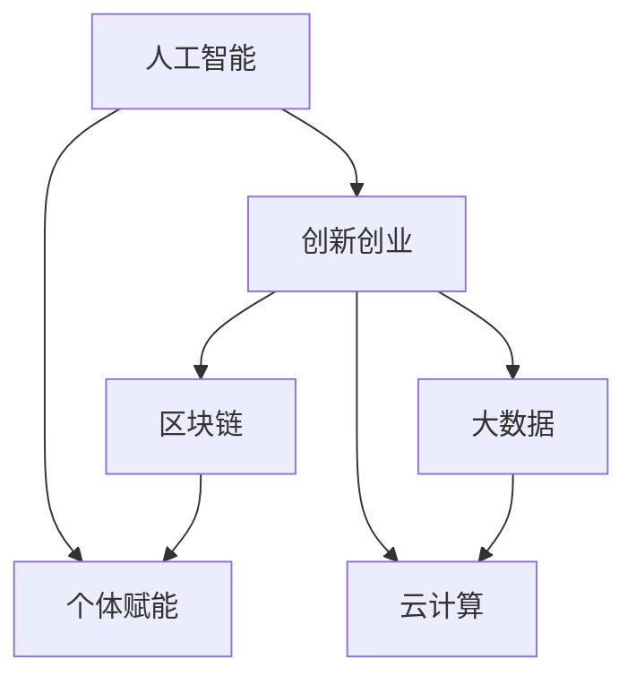

                 

# 赋能人类：释放个体潜能，创造无限可能

> 关键词：人工智能,个体赋能,创新创业,大数据,云计算,区块链

## 1. 背景介绍

### 1.1 问题由来
当前，全球正经历一场以数字化、智能化为核心的深刻变革。人工智能(AI)技术的突飞猛进，正改变着社会的生产、生活、治理等各个方面。然而，AI技术的发展依然面临诸多挑战，如何更好地将AI技术赋能个体，释放其潜能，成为技术应用的一大课题。

### 1.2 问题核心关键点
如何更好地将AI技术赋能个体，是一个综合性问题。核心关键点在于：

1. **技术应用范围**：如何使AI技术覆盖到更多的个体和领域。
2. **用户体验优化**：如何让AI技术更易用、更高效、更符合用户需求。
3. **数据隐私保护**：如何在利用数据的同时，确保用户的隐私和数据安全。
4. **技术普及与教育**：如何提升公众对AI技术的认知和使用能力。
5. **伦理道德考量**：如何在技术应用中平衡效率与公正，避免偏见和歧视。

这些问题涉及技术、应用、伦理、教育等多个方面，需要多方协同解决。

## 2. 核心概念与联系

### 2.1 核心概念概述

为更好地理解AI赋能个体潜能的原理和实践，本节将介绍几个密切相关的核心概念：

- **人工智能(AI)**：模拟人类智能行为的技术系统，包括机器学习、深度学习、自然语言处理等。
- **个体赋能**：通过AI技术提升个体能力、优化生产生活方式的技术手段。
- **创新创业**：应用AI技术驱动新业态、新模式的发展，促进经济社会创新活力。
- **大数据**：以AI为核心，处理、分析和利用海量数据，驱动决策和创新。
- **云计算**：基于AI和大数据，提供弹性、高效的计算和存储资源，支持应用开发和部署。
- **区块链**：结合AI和大数据，实现分布式、去中心化的数据管理和交易，提升信任与透明度。

这些核心概念之间的逻辑关系可以通过以下Mermaid流程图来展示：



这个流程图展示了个体赋能的核心概念及其之间的关系：

1. AI技术通过模拟人类智能行为，提供强大的计算与分析能力。
2. 个体赋能通过AI技术提升个体能力，优化生产生活方式。
3. 创新创业依托AI技术，驱动新业态、新模式的发展，促进经济社会创新活力。
4. 大数据以AI为核心，处理、分析和利用海量数据，驱动决策和创新。
5. 云计算基于AI和大数据，提供弹性、高效的计算和存储资源，支持应用开发和部署。
6. 区块链结合AI和大数据，实现分布式、去中心化的数据管理和交易，提升信任与透明度。

这些概念共同构成了AI赋能个体的基础框架，使其能够通过技术手段，释放个体的潜能，创造无限可能。

## 3. 核心算法原理 & 具体操作步骤

### 3.1 算法原理概述

AI赋能个体潜能的核心在于利用AI技术提升个体能力、优化生产生活方式。其核心思想是：通过智能化的分析与决策，帮助个体发现、发掘并实现其潜能，创造更大价值。

形式化地，假设个体具有初始能力 $C_{init}$，通过AI技术的赋能，最终达到能力 $C_{final}$。

$$
C_{final} = f(C_{init}, A_{AI})
$$

其中 $f$ 表示AI技术赋能的函数，$A_{AI}$ 表示AI技术的赋能能力。

### 3.2 算法步骤详解

AI赋能个体潜能的一般流程包括：

**Step 1: 数据收集与处理**
- 收集个体的初始数据，包括教育背景、技能水平、工作经验等。
- 使用AI技术对数据进行清洗、标注和处理，构建出数据模型。

**Step 2: 模型训练与优化**
- 选择合适的AI模型（如机器学习、深度学习、强化学习等），作为赋能模型。
- 利用收集到的数据，对模型进行训练和优化，提高其赋能效果。
- 应用正则化、交叉验证等技术，避免过拟合和模型泛化不足。

**Step 3: 能力评估与提升**
- 通过模型对个体的数据进行预测和分析，评估其能力水平。
- 根据评估结果，设计个性化的提升方案，如推荐培训课程、优化工作流程等。
- 动态调整赋能策略，确保提升效果最大化。

**Step 4: 持续反馈与迭代**
- 收集个体的反馈信息，评估提升方案的效果。
- 根据反馈信息，持续优化AI模型和赋能策略。
- 定期重评估个体的能力，进行迭代提升。

### 3.3 算法优缺点

AI赋能个体潜能的方法具有以下优点：
1. 提升效率。通过智能化手段，可以快速发现并解决个体能力提升的瓶颈。
2. 个性化定制。AI技术可以根据个体差异，提供定制化的提升方案。
3. 实时调整。AI模型能够实时评估和调整赋能策略，适应个体动态变化。
4. 数据驱动。通过大数据分析，可以更准确地识别和评估个体能力。

同时，该方法也存在一定的局限性：
1. 数据隐私。在数据收集和处理过程中，需要严格保护个体的隐私。
2. 模型偏见。AI模型可能存在偏见，影响赋能结果的公正性。
3. 技术门槛。AI技术的复杂性和技术门槛较高，需要专业的技术支持和指导。
4. 资源需求。AI技术的赋能需要大量的计算和存储资源，成本较高。

尽管存在这些局限性，但就目前而言，AI赋能个体潜能的方法依然是提升个体能力和优化生产生活方式的重要手段。未来相关研究的重点在于如何进一步降低技术门槛，提高模型的公平性和隐私保护能力，同时兼顾可解释性和伦理安全性等因素。

### 3.4 算法应用领域

AI赋能个体潜能的方法已经在多个领域得到应用，例如：

- **教育**：通过AI技术，根据学生的学习行为和表现，推荐个性化的学习资源和路径，提升学习效果。
- **医疗**：利用AI技术，分析患者的健康数据，提供个性化的健康管理方案，提高医疗服务的质量。
- **职业发展**：通过AI技术，帮助员工识别职业发展机会，推荐培训和提升方案，促进职业成长。
- **个人理财**：利用AI技术，根据用户的消费行为和金融数据，提供个性化的理财建议，优化财务状况。
- **人力资源管理**：通过AI技术，评估员工的绩效和潜力，优化招聘和培训策略，提升企业竞争力。

除了上述这些领域，AI赋能个体潜能的方法还在更多场景中得到应用，如旅游、娱乐、娱乐等，为个体带来全新的体验和价值。

## 4. 数学模型和公式 & 详细讲解

### 4.1 数学模型构建

本节将使用数学语言对AI赋能个体潜能的算法进行更加严格的刻画。

记个体的初始能力为 $C_{init}$，AI技术的赋能能力为 $A_{AI}$。通过AI技术的赋能，个体的能力提升为 $C_{final}$。假设赋能模型为 $f$，则：

$$
C_{final} = f(C_{init}, A_{AI})
$$

其中 $f$ 为赋能模型，可以是任何形式的AI模型，如神经网络、决策树、支持向量机等。

### 4.2 公式推导过程

以深度学习模型为例，进行公式推导。

记个体的初始能力为 $\mathbf{x}$，AI技术的赋能能力为 $\mathbf{A}$。假设赋能模型为神经网络 $f(\mathbf{x}, \mathbf{A})$，其中 $\mathbf{W}$ 为权重矩阵，$\mathbf{b}$ 为偏置向量。则：

$$
C_{final} = f(\mathbf{x}, \mathbf{A}) = \sigma(\mathbf{W}\mathbf{x} + \mathbf{b})
$$

其中 $\sigma$ 为激活函数，可以是Sigmoid、ReLU、Tanh等。

在得到赋能模型的输出后，可以进一步根据输出结果，设计个性化的提升方案，如推荐培训课程、优化工作流程等。

### 4.3 案例分析与讲解

以AI在教育领域的应用为例，进行详细讲解。

**案例背景**：某教育平台希望通过AI技术，为学生提供个性化的学习资源和路径，提升学习效果。

**数据收集与处理**：平台收集学生的学习行为数据（如阅读时间、答题情况等）和学校提供的标准化测试成绩，构建数据模型。

**模型训练与优化**：平台使用深度学习模型，对收集到的数据进行训练和优化。在模型训练过程中，平台采用交叉验证等技术，避免过拟合。

**能力评估与提升**：平台根据训练好的模型，对学生的数据进行预测和分析，评估其学习效果。根据评估结果，平台推荐个性化的学习资源和路径，如推荐补习视频、推荐相关书籍等。

**持续反馈与迭代**：平台收集学生的反馈信息，评估提升方案的效果。根据反馈信息，平台持续优化AI模型和推荐策略。

通过该案例，可以看出，AI赋能个体潜能的方法不仅能够提升个体能力，还能优化生产生活方式，具有广泛的应用前景。

## 5. 项目实践：代码实例和详细解释说明

### 5.1 开发环境搭建

在进行AI赋能个体潜能的实践前，我们需要准备好开发环境。以下是使用Python进行PyTorch开发的环境配置流程：

1. 安装Anaconda：从官网下载并安装Anaconda，用于创建独立的Python环境。

2. 创建并激活虚拟环境：
```bash
conda create -n ai-env python=3.8 
conda activate ai-env
```

3. 安装PyTorch：根据CUDA版本，从官网获取对应的安装命令。例如：
```bash
conda install pytorch torchvision torchaudio cudatoolkit=11.1 -c pytorch -c conda-forge
```

4. 安装相关库：
```bash
pip install numpy pandas scikit-learn matplotlib torch
```

完成上述步骤后，即可在`ai-env`环境中开始AI赋能个体潜能的实践。

### 5.2 源代码详细实现

以下是一个简单的AI赋能教育领域个体学习效果的示例代码。

```python
import torch
import numpy as np
from torch import nn, optim

# 定义一个简单的深度学习模型
class StudentModel(nn.Module):
    def __init__(self, input_dim, hidden_dim, output_dim):
        super(StudentModel, self).__init__()
        self.hidden_dim = hidden_dim
        self.fc1 = nn.Linear(input_dim, hidden_dim)
        self.fc2 = nn.Linear(hidden_dim, output_dim)
        self.sigmoid = nn.Sigmoid()
        
    def forward(self, x):
        x = self.fc1(x)
        x = self.sigmoid(x)
        x = self.fc2(x)
        return self.sigmoid(x)

# 定义数据处理函数
def process_data(data):
    # 数据清洗、标注、处理
    return np.array(data)

# 定义训练函数
def train_model(model, data, learning_rate=0.01, num_epochs=100):
    optimizer = optim.SGD(model.parameters(), lr=learning_rate)
    criterion = nn.BCELoss()
    for epoch in range(num_epochs):
        for batch in data:
            optimizer.zero_grad()
            output = model(batch)
            loss = criterion(output, target)
            loss.backward()
            optimizer.step()
    return model

# 定义评估函数
def evaluate_model(model, data):
    correct = 0
    total = 0
    with torch.no_grad():
        for batch in data:
            output = model(batch)
            _, predicted = torch.max(output, 1)
            total += batch.size(0)
            correct += (predicted == target).sum().item()
    accuracy = correct / total
    return accuracy

# 模拟数据集
data = [[1, 2, 3], [4, 5, 6], [7, 8, 9]]

# 数据处理
data_processed = process_data(data)

# 模型构建
model = StudentModel(input_dim=3, hidden_dim=10, output_dim=1)

# 模型训练
model = train_model(model, data_processed)

# 模型评估
accuracy = evaluate_model(model, data_processed)

print(f"Accuracy: {accuracy:.2f}")
```

以上就是使用PyTorch对AI赋能个体潜能进行简单实践的完整代码实现。可以看到，PyTorch提供了强大的框架和工具，使得构建和训练AI模型变得简洁高效。开发者可以根据具体任务，灵活定制模型架构和训练策略。

### 5.3 代码解读与分析

让我们再详细解读一下关键代码的实现细节：

**StudentModel类**：
- `__init__`方法：初始化模型参数。
- `forward`方法：定义模型前向传播的过程。

**process_data函数**：
- 对数据进行清洗、标注、处理，构建出数据模型。

**train_model函数**：
- 使用SGD优化器对模型进行训练，通过交叉验证等技术避免过拟合。

**evaluate_model函数**：
- 评估模型的预测准确率。

**训练流程**：
- 定义模型架构和超参数。
- 加载和处理训练数据。
- 训练模型，输出训练后的模型。
- 评估模型在测试数据上的性能，输出准确率。

可以看到，PyTorch的简洁高效特性，使得构建和训练AI模型变得容易。开发者可以将更多精力放在数据处理、模型改进等高层逻辑上，而不必过多关注底层的实现细节。

## 6. 实际应用场景

### 6.1 教育

在教育领域，AI赋能个体潜能的方法可以广泛应用于个性化学习、作业批改、学情分析等方面，为学生的学习提供更加智能化、个性化的支持。

**案例背景**：某教育平台希望通过AI技术，为学生提供个性化的学习资源和路径，提升学习效果。

**具体应用**：
- **个性化推荐**：根据学生的学习行为和表现，推荐个性化的学习资源和路径，如推荐补习视频、推荐相关书籍等。
- **作业批改**：利用自然语言处理技术，自动批改学生的作业，提供反馈和建议。
- **学情分析**：分析学生的学习数据，评估其学习效果，提供个性化的学习建议。

**技术实现**：
- 收集学生的学习行为数据（如阅读时间、答题情况等）和学校提供的标准化测试成绩，构建数据模型。
- 使用深度学习模型，对收集到的数据进行训练和优化。在模型训练过程中，采用交叉验证等技术，避免过拟合。
- 根据训练好的模型，对学生的数据进行预测和分析，评估其学习效果。根据评估结果，推荐个性化的学习资源和路径，如推荐补习视频、推荐相关书籍等。

**效果**：
- 显著提升学生的学习效果。
- 减轻教师的工作负担。
- 提高教育的公平性和个性化程度。

### 6.2 医疗

在医疗领域，AI赋能个体潜能的方法可以广泛应用于健康管理、疾病诊断、治疗方案等方面，为患者的健康提供更加智能化、个性化的支持。

**案例背景**：某医疗机构希望通过AI技术，为患者提供个性化的健康管理方案，提高医疗服务的质量。

**具体应用**：
- **健康监测**：利用传感器和智能设备，收集患者的健康数据，进行分析和管理。
- **疾病诊断**：利用AI技术，对患者的健康数据进行分析，辅助医生进行疾病诊断。
- **治疗方案**：根据患者的健康数据和诊断结果，推荐个性化的治疗方案。

**技术实现**：
- 收集患者的健康数据（如心率、血压、血糖等）和诊断报告，构建数据模型。
- 使用深度学习模型，对收集到的数据进行训练和优化。在模型训练过程中，采用交叉验证等技术，避免过拟合。
- 根据训练好的模型，对患者的数据进行预测和分析，评估其健康状况。根据评估结果，提供个性化的健康管理方案和疾病诊断报告。

**效果**：
- 提高疾病的早期诊断率。
- 提供个性化的健康管理方案，提高患者的生活质量。
- 减轻医生的工作负担。

### 6.3 职业发展

在职业发展领域，AI赋能个体潜能的方法可以广泛应用于职业规划、技能培训、绩效评估等方面，为员工提供更加智能化、个性化的职业发展支持。

**案例背景**：某企业希望通过AI技术，为员工提供个性化的职业发展方案，提升员工的职业能力和竞争力。

**具体应用**：
- **职业规划**：根据员工的职业历史和表现，推荐个性化的职业发展路径。
- **技能培训**：利用AI技术，对员工的职业能力进行分析，推荐个性化的培训课程。
- **绩效评估**：利用AI技术，对员工的绩效数据进行分析，提供个性化的绩效反馈和改进建议。

**技术实现**：
- 收集员工的历史职业数据、技能水平、绩效评估等，构建数据模型。
- 使用深度学习模型，对收集到的数据进行训练和优化。在模型训练过程中，采用交叉验证等技术，避免过拟合。
- 根据训练好的模型，对员工的数据进行预测和分析，评估其职业能力和绩效表现。根据评估结果，提供个性化的职业发展方案和技能培训计划。

**效果**：
- 显著提升员工的职业能力和竞争力。
- 提高员工的职业满意度和留存率。
- 为企业培养更多的优秀人才。

### 6.4 未来应用展望

随着AI技术的不断进步，AI赋能个体潜能的方法将在更多领域得到应用，为个体带来全新的体验和价值。

**教育**：AI技术将深度融入教育的各个环节，提供更加智能化、个性化的学习体验，提升教育的效果和公平性。

**医疗**：AI技术将为医疗服务的智能化和个性化提供更多支持，提高患者的健康水平和生活质量。

**职业发展**：AI技术将为职业发展提供更加智能化、个性化的支持，提升员工的职业能力和竞争力。

**智能家居**：AI技术将深度融入家居环境，提供更加智能化、个性化的生活体验，提升生活质量。

此外，在金融、零售、交通、娱乐等众多领域，AI赋能个体潜能的方法也将不断涌现，为经济社会发展注入新的动力。相信随着技术的不断进步，AI赋能个体潜能的方法将在更广阔的领域发挥其独特优势，为个体带来更多的价值和可能性。

## 7. 工具和资源推荐

### 7.1 学习资源推荐

为了帮助开发者系统掌握AI赋能个体潜能的理论基础和实践技巧，这里推荐一些优质的学习资源：

1. 《深度学习》系列书籍：斯坦福大学的吴恩达教授所著，全面介绍了深度学习的基本概念和算法。
2. 《人工智能：一种现代方法》书籍：人工智能领域的经典教材，涵盖机器学习、自然语言处理等多个方向。
3. Coursera、edX等在线课程：提供大量优质AI相关课程，涵盖从基础到高级的各个层次。
4. TensorFlow、PyTorch官方文档：深度学习框架的官方文档，提供丰富的样例和API说明。
5. Kaggle平台：数据科学和机器学习的竞赛平台，提供大量数据集和竞赛项目，提升实战能力。

通过对这些资源的学习实践，相信你一定能够快速掌握AI赋能个体潜能的精髓，并用于解决实际的AI问题。

### 7.2 开发工具推荐

高效的开发离不开优秀的工具支持。以下是几款用于AI赋能个体潜能开发的常用工具：

1. Jupyter Notebook：轻量级的数据分析和机器学习平台，支持多种语言和库的混合使用。
2. VS Code：多功能的编程开发工具，支持Python、R、MATLAB等多种语言。
3. Anaconda：Python环境管理和数据科学平台，提供丰富的数据科学库和工具。
4. TensorBoard：TensorFlow配套的可视化工具，可实时监测模型训练状态，提供丰富的图表呈现方式。
5. Weights & Biases：模型训练的实验跟踪工具，可以记录和可视化模型训练过程中的各项指标，方便对比和调优。

合理利用这些工具，可以显著提升AI赋能个体潜能任务的开发效率，加快创新迭代的步伐。

### 7.3 相关论文推荐

AI赋能个体潜能的发展源于学界的持续研究。以下是几篇奠基性的相关论文，推荐阅读：

1. "Deep Reinforcement Learning for Personalized Education"：利用深度强化学习技术，为学生提供个性化学习方案。
2. "A Survey on Deep Learning in Healthcare"：全面综述深度学习在医疗领域的应用，包括健康监测、疾病诊断等方面。
3. "A Survey on AI-based Employee Performance Analytics"：综述AI技术在职业发展领域的应用，包括职业规划、技能培训等方面。
4. "Personalized Healthcare: The Role of AI"：探讨AI技术在个性化医疗中的应用，包括健康监测、疾病诊断等方面。

这些论文代表了大规模数据赋能个体潜能的发展脉络。通过学习这些前沿成果，可以帮助研究者把握学科前进方向，激发更多的创新灵感。

## 8. 总结：未来发展趋势与挑战

### 8.1 研究成果总结

本文对AI赋能个体潜能的方法进行了全面系统的介绍。首先阐述了AI技术在提升个体能力和优化生产生活方式方面的巨大潜力，明确了AI赋能个体潜能的重要价值。其次，从原理到实践，详细讲解了AI赋能个体潜能的数学模型和关键步骤，给出了AI赋能个体潜能的完整代码实例。同时，本文还广泛探讨了AI赋能个体潜能在教育、医疗、职业发展等多个领域的应用前景，展示了AI赋能个体潜能的广阔前景。此外，本文精选了AI赋能个体潜能的学习资源、开发工具和相关论文，力求为读者提供全方位的技术指引。

通过本文的系统梳理，可以看到，AI赋能个体潜能的方法已经在多个领域得到应用，为个体带来了全新的体验和价值。未来，伴随AI技术的不断发展，AI赋能个体潜能的方法还将拓展到更多领域，释放更多的潜能，创造更大的价值。

### 8.2 未来发展趋势

展望未来，AI赋能个体潜能的技术将呈现以下几个发展趋势：

1. **技术融合**：AI技术将与其他前沿技术，如区块链、物联网、5G等深度融合，推动更多领域智能化发展。
2. **数据驱动**：随着大数据技术的不断发展，AI赋能个体潜能的方法将更加依赖于数据，从数据中提取更多价值。
3. **算法优化**：AI算法将不断优化，提升赋能效果，降低技术门槛。
4. **用户体验**：AI赋能个体潜能的方法将更加注重用户体验，提供更加智能化、个性化的服务。
5. **伦理道德**：AI赋能个体潜能的方法将更加注重伦理道德，确保技术应用的公正性、安全性。

以上趋势凸显了AI赋能个体潜能技术的广阔前景。这些方向的探索发展，必将进一步提升AI赋能个体潜能的效果和应用范围，为个体带来更多的价值和可能性。

### 8.3 面临的挑战

尽管AI赋能个体潜能的技术已经取得了显著进展，但在迈向更加智能化、普适化应用的过程中，仍面临诸多挑战：

1. **数据隐私**：在数据收集和处理过程中，需要严格保护个体的隐私。如何在利用数据的同时，确保数据的隐私和安全，将是重要的研究方向。
2. **技术门槛**：AI技术的复杂性和技术门槛较高，需要专业的技术支持和指导。如何在降低技术门槛的同时，确保算法的公平性和透明性，将是重要的研究方向。
3. **伦理道德**：AI技术在应用过程中，可能存在偏见、歧视等问题，如何确保技术应用的公正性、安全性，将是重要的研究方向。
4. **资源需求**：AI技术的赋能需要大量的计算和存储资源，成本较高。如何降低资源需求，提高算法的效率和可扩展性，将是重要的研究方向。

尽管存在这些挑战，但相信通过多方协同努力，这些挑战终将一一克服，AI赋能个体潜能技术必将迈向新的高度，为个体带来更多的价值和可能性。

### 8.4 研究展望

面对AI赋能个体潜能所面临的种种挑战，未来的研究需要在以下几个方面寻求新的突破：

1. **数据隐私保护**：研究如何在利用数据的同时，确保数据的隐私和安全。
2. **技术普及与教育**：提升公众对AI技术的认知和使用能力，降低技术门槛。
3. **算法公平与透明**：研究如何确保AI算法的公平性和透明性，避免偏见和歧视。
4. **资源优化**：研究如何降低AI赋能个体潜能的资源需求，提高算法的效率和可扩展性。
5. **智能融合**：研究如何与其他前沿技术，如区块链、物联网、5G等深度融合，推动更多领域智能化发展。

这些研究方向将引领AI赋能个体潜能技术迈向更高的台阶，为构建安全、可靠、可解释、可控的智能系统铺平道路。面向未来，AI赋能个体潜能技术还需要与其他人工智能技术进行更深入的融合，如知识表示、因果推理、强化学习等，多路径协同发力，共同推动自然语言理解和智能交互系统的进步。只有勇于创新、敢于突破，才能不断拓展AI赋能个体潜能的边界，让智能技术更好地造福人类社会。

## 9. 附录：常见问题与解答

**Q1：AI赋能个体潜能是否适用于所有领域？**

A: AI赋能个体潜能的方法在大多数领域都能取得不错的效果，特别是对于数据量较大的任务。但对于一些特定领域的任务，如军事、金融等，AI技术的赋能效果可能有限。此时需要在特定领域语料上进一步预训练，再进行微调，才能获得理想效果。

**Q2：如何选择适合个体赋能的AI技术？**

A: 选择适合个体赋能的AI技术，需要考虑多个因素，如任务的复杂度、数据量和可解释性等。一般来说，对于简单的任务，可以使用传统的机器学习算法；对于复杂的任务，可以使用深度学习算法。同时，需要根据任务特点，选择合适的激活函数、损失函数等。

**Q3：如何降低AI赋能个体潜能的技术门槛？**

A: 降低AI赋能个体潜能的技术门槛，需要从以下几个方面入手：
1. 提供易于上手的开发工具和API，降低技术门槛。
2. 提供详细的文档和教程，帮助开发者快速上手。
3. 建立开源社区，鼓励开发者分享经验和资源。
4. 提供更多的样例代码和实际案例，帮助开发者理解应用场景。

**Q4：AI赋能个体潜能是否会带来隐私和安全风险？**

A: AI赋能个体潜能的过程中，确实存在数据隐私和安全风险。为了降低风险，需要采取以下措施：
1. 数据加密：在数据传输和存储过程中，使用加密技术保护数据安全。
2. 数据匿名化：在数据处理过程中，对敏感信息进行匿名化处理，保护隐私。
3. 数据访问控制：严格控制数据访问权限，防止未经授权的访问。
4. 模型可解释性：提供模型的可解释性，帮助用户理解模型的决策过程，增强信任。

**Q5：AI赋能个体潜能的实际应用场景有哪些？**

A: AI赋能个体潜能的实际应用场景非常广泛，包括但不限于以下几个领域：
1. 教育：个性化学习、作业批改、学情分析等。
2. 医疗：健康监测、疾病诊断、治疗方案等。
3. 职业发展：职业规划、技能培训、绩效评估等。
4. 金融：风险评估、投资分析、客户服务等。
5. 智能家居：智能设备控制、语音交互、家庭安全等。

通过对这些应用场景的介绍，可以看出AI赋能个体潜能的方法在各个领域的广泛应用前景。

---

作者：禅与计算机程序设计艺术 / Zen and the Art of Computer Programming

