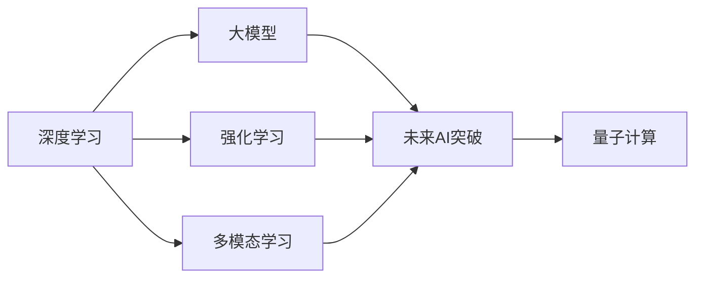

                 

# 超越人工智能：探索 AI 未来

> 关键词：人工智能, 未来趋势, 深度学习, 强化学习, 大模型, 多模态学习, 量子计算

## 1. 背景介绍

### 1.1 问题的由来
随着人工智能技术的迅猛发展，我们正处于一个前所未有的技术变革时期。自1956年人工智能(人工智能)概念提出以来，经过70多年的发展，AI已经从理论走向实践，从学术界走向产业界，广泛应用于医疗、金融、自动驾驶、安防、教育等众多领域。

在过去的几年里，深度学习技术的飞速进步，尤其是大模型的出现，极大地推动了AI的发展。这些大模型，如Google的BERT、OpenAI的GPT系列、Facebook的GPT-3等，基于海量数据进行预训练，具备了超强的语言理解、生成和推理能力，成为AI领域的新型基础设施。这些模型的训练参数往往达到数十亿级别，使得它们能够处理复杂任务，甚至具备类人的智能。

然而，尽管大模型取得了令人瞩目的成绩，我们依然面临诸多挑战。数据稀缺、训练时间长、计算资源消耗巨大、模型泛化能力不足等问题依然困扰着AI的进一步发展。如何突破这些瓶颈，探索AI的未来，成为当下AI研究者和开发者共同关注的焦点。

### 1.2 问题的核心关键点
本文将从深度学习、强化学习、大模型、多模态学习、量子计算等多个方面，深入探讨AI的未来发展趋势和面临的挑战，展望AI技术将如何在未来的十年、二十年内实现突破，并对AI的未来趋势进行预测。

## 2. 核心概念与联系

### 2.1 核心概念概述

为更好地理解AI的未来发展，我们先对一些关键概念进行概述：

- **深度学习**：通过多层神经网络进行特征提取和模式识别的学习范式，是目前AI领域的主要技术手段。

- **强化学习**：通过与环境交互，通过奖惩机制指导模型学习最优策略的框架，能够应用于游戏、机器人控制等任务。

- **大模型**：指具有数十亿参数的预训练模型，如BERT、GPT系列等，具备超强的语言理解和生成能力。

- **多模态学习**：结合图像、声音、文本等多模态数据进行学习，以更好地模拟真实世界的复杂性。

- **量子计算**：基于量子力学的计算范式，能够处理传统计算难以解决的问题，具有极大的潜力。

这些概念之间的逻辑关系可以通过以下Mermaid流程图来展示：



这个流程图展示了深度学习、强化学习、多模态学习和量子计算等概念与AI未来的联系。大模型是深度学习的最新成果，强化学习和多模态学习是未来AI的主要发展方向，量子计算则是AI未来的潜在突破点。

## 3. 核心算法原理 & 具体操作步骤

### 3.1 算法原理概述

AI未来的发展离不开算法原理的不断突破。以下是一些关键算法的原理概述：

- **Transformer结构**：作为深度学习领域的最新进展，Transformer通过自注意力机制取代了传统的卷积和池化操作，极大地提高了模型的计算效率和并行性。BERT、GPT系列模型均基于Transformer结构进行构建。

- **预训练-微调范式**：通过在大规模无标签数据上进行预训练，学习通用的语言知识，再在特定任务上进行调整，提升模型在该任务上的性能。微调方法已广泛应用于自然语言处理、图像识别等领域。

- **强化学习**：通过与环境交互，模型不断调整自身行为以最大化奖励。强化学习在游戏、机器人等领域取得重要突破。

- **多模态学习**：将不同模态的数据进行融合，构建更加全面、准确的模型。多模态学习在图像、声音和文本相结合的任务中表现优异。

- **量子计算**：基于量子力学原理进行计算，能够在某些特定问题上取得比传统计算方法更好的性能。量子计算被认为是AI未来的潜在突破点之一。

### 3.2 算法步骤详解

AI未来的算法步骤主要包括以下几个方面：

- **数据收集与预处理**：收集领域相关的数据，并进行清洗、标注、归一化等预处理步骤，确保数据的完整性和可用性。

- **模型选择与构建**：根据任务特点选择合适的模型，并在此基础上进行微调或重新设计，以满足特定的需求。

- **模型训练与优化**：在数据集上训练模型，使用梯度下降等优化算法不断调整模型参数，提升模型性能。

- **模型评估与部署**：在测试集上评估模型性能，并将模型部署到实际应用场景中，不断迭代优化。

### 3.3 算法优缺点

AI未来的算法优缺点主要体现在以下几个方面：

**优点**：
- 计算效率高：深度学习和Transformer结构使得模型能够处理大规模数据集。
- 泛化能力强：预训练-微调范式提升了模型在不同任务上的性能。
- 适应性强：强化学习和多模态学习能够处理复杂的实际问题。
- 潜力巨大：量子计算有望解决传统计算难以处理的问题。

**缺点**：
- 数据依赖性强：深度学习和强化学习对数据量和质量要求高。
- 训练时间长：大模型和强化学习模型需要耗费大量时间和计算资源。
- 可解释性差：模型往往是"黑盒"系统，难以解释其内部工作机制。
- 伦理风险高：模型可能存在偏见和歧视，带来伦理风险。

### 3.4 算法应用领域

AI未来的算法主要应用于以下几个领域：

- **自然语言处理**：文本分类、机器翻译、对话系统等任务。
- **计算机视觉**：图像识别、目标检测、图像生成等任务。
- **机器人控制**：智能机器人、自动驾驶等任务。
- **医疗健康**：疾病诊断、健康管理等任务。
- **金融科技**：风险评估、投资决策等任务。

## 4. 数学模型和公式 & 详细讲解 & 举例说明

### 4.1 数学模型构建

AI未来的数学模型主要基于以下几个基本框架进行构建：

- **神经网络模型**：构建多层的神经网络结构，用于特征提取和模式识别。

- **优化算法**：通过梯度下降等优化算法，不断调整模型参数。

- **损失函数**：设计损失函数，用于衡量模型输出与真实标签之间的差异。

- **激活函数**：如ReLU、Sigmoid等，用于引入非线性特性。

### 4.2 公式推导过程

以下是一些关键数学公式的推导过程：

- **梯度下降算法**：
$$
\theta_{t+1} = \theta_t - \alpha \nabla J(\theta_t)
$$

其中，$\theta_t$ 表示第 $t$ 次迭代的模型参数，$\alpha$ 为学习率，$\nabla J(\theta_t)$ 为损失函数 $J(\theta_t)$ 对参数 $\theta_t$ 的梯度。

- **交叉熵损失函数**：
$$
L_{ce}(y,\hat{y}) = -\frac{1}{N}\sum_{i=1}^N [y_i \log \hat{y}_i + (1-y_i) \log (1-\hat{y}_i)]
$$

其中，$y$ 为真实标签，$\hat{y}$ 为模型预测概率。

- **Softmax激活函数**：
$$
\sigma(z)_i = \frac{e^{z_i}}{\sum_{j=1}^n e^{z_j}}
$$

其中，$z_i$ 为输入特征，$\sigma(z)$ 为输出概率向量。

### 4.3 案例分析与讲解

以图像分类任务为例，解释如何在神经网络模型上进行训练。

首先，构建一个包含多个卷积层和全连接层的神经网络模型，用于图像特征提取和分类。然后，在训练集上使用梯度下降算法，不断调整模型参数，最小化损失函数。在测试集上评估模型性能，不断迭代优化，最终得到一个性能优异的图像分类器。

## 5. 项目实践：代码实例和详细解释说明

### 5.1 开发环境搭建

为了进行AI项目开发，需要搭建相应的开发环境。以下是一些常用的开发环境搭建步骤：

1. **安装Python**：安装最新版本的Python，并确保PATH环境变量正确配置。

2. **安装深度学习框架**：安装TensorFlow、PyTorch等深度学习框架，并配置好所需依赖包。

3. **安装数据集和工具**：安装所需的数据集和工具，如COCO、ImageNet等。

### 5.2 源代码详细实现

以下是一个使用PyTorch进行图像分类的Python代码实现：

```python
import torch
import torch.nn as nn
import torch.optim as optim
import torchvision.datasets as datasets
import torchvision.transforms as transforms
import torchvision.models as models

# 加载数据集
train_dataset = datasets.CIFAR10(root='data', train=True, download=True,
                                transform=transforms.Compose([
                                    transforms.ToTensor(),
                                    transforms.Normalize((0.5, 0.5, 0.5), (0.5, 0.5, 0.5))]))

test_dataset = datasets.CIFAR10(root='data', train=False, download=True,
                               transform=transforms.Compose([
                                   transforms.ToTensor(),
                                   transforms.Normalize((0.5, 0.5, 0.5), (0.5, 0.5, 0.5))]))

# 定义模型
model = models.resnet18(pretrained=False)

# 定义损失函数和优化器
criterion = nn.CrossEntropyLoss()
optimizer = optim.SGD(model.parameters(), lr=0.01, momentum=0.9)

# 训练模型
for epoch in range(10):
    model.train()
    for i, (inputs, labels) in enumerate(train_loader):
        optimizer.zero_grad()
        outputs = model(inputs)
        loss = criterion(outputs, labels)
        loss.backward()
        optimizer.step()

    model.eval()
    with torch.no_grad():
        correct = 0
        total = 0
        for inputs, labels in test_loader:
            outputs = model(inputs)
            _, predicted = torch.max(outputs.data, 1)
            total += labels.size(0)
            correct += (predicted == labels).sum().item()

    print(f'Epoch {epoch+1}, Accuracy: {(100 * correct / total):.2f}%')
```

### 5.3 代码解读与分析

这段代码实现了一个基于ResNet18的图像分类模型。首先，加载CIFAR-10数据集，并进行标准化处理。然后，定义ResNet18模型，并使用交叉熵损失函数和随机梯度下降优化器进行训练。最后，在测试集上进行评估，输出模型的准确率。

## 6. 实际应用场景

### 6.1 医疗健康

AI在医疗健康领域有着广阔的应用前景。通过深度学习和大模型，AI可以辅助医生进行疾病诊断、药物研发等工作。例如，利用自然语言处理技术，从病历中提取关键信息，辅助医生进行诊断；利用计算机视觉技术，进行医学图像分析，提高诊断准确率。

### 6.2 金融科技

AI在金融科技领域也发挥着重要作用。通过强化学习和大模型，AI可以用于风险评估、投资决策等工作。例如，利用机器学习模型分析历史数据，预测股票价格，辅助投资者做出决策；利用自然语言处理技术，分析新闻、评论等信息，评估市场情绪，为投资决策提供参考。

### 6.3 自动驾驶

自动驾驶是AI在交通领域的重大应用之一。通过计算机视觉和大模型，AI可以实现车辆感知、路径规划、决策控制等功能。例如，利用图像识别技术，识别道路标志、交通信号等，辅助驾驶；利用深度学习技术，进行实时路径规划，提高行驶安全。

## 7. 工具和资源推荐

### 7.1 学习资源推荐

以下是一些优秀的学习资源，可以帮助你更好地了解AI的未来发展：

1. **《深度学习》课程**：斯坦福大学开设的深度学习课程，涵盖深度学习的基础知识和前沿技术。

2. **《机器学习》教材**：Tom Mitchell编写的经典教材，系统介绍了机器学习的基本原理和应用。

3. **《强化学习》教材**：Richard Sutton和Andrew Barto编写的强化学习教材，详细讲解了强化学习的原理和算法。

4. **Kaggle竞赛**：Kaggle是一个数据科学竞赛平台，通过参与竞赛，可以学习到最新的AI技术。

5. **OpenAI网站**：OpenAI提供了大量的AI研究资源和论文，可以了解最新的AI进展。

### 7.2 开发工具推荐

以下是一些常用的开发工具，可以帮助你进行AI项目开发：

1. **PyTorch**：一个灵活的深度学习框架，支持动态图和静态图，易于进行模型调试和优化。

2. **TensorFlow**：Google开发的深度学习框架，支持分布式计算和模型部署。

3. **Jupyter Notebook**：一个交互式的编程环境，适合进行数据分析和模型调试。

4. **Google Colab**：Google提供的在线Jupyter Notebook环境，支持GPU计算，方便进行大规模数据处理。

5. **Anaconda**：一个Python发行版，方便进行环境配置和管理。

### 7.3 相关论文推荐

以下是一些优秀的AI相关论文，可以帮助你了解最新的研究进展：

1. **《Attention is All You Need》**：提出Transformer结构，开启了深度学习的新篇章。

2. **《BERT: Pre-training of Deep Bidirectional Transformers for Language Understanding》**：提出BERT模型，引入掩码语言模型任务，提升了语言理解能力。

3. **《AlphaGo Zero: Mastering the Game of Go without Human Knowledge》**：提出强化学习算法，使AI在围棋中取得突破性进展。

4. **《TensorFlow 2.0》**：Google发布的TensorFlow新版本，介绍了最新的深度学习框架和应用。

5. **《Quantum Computing for Computer Scientists》**：讲解了量子计算的基本原理和应用，为未来AI的突破提供新的可能性。

## 8. 总结：未来发展趋势与挑战

### 8.1 总结

本文对AI的未来发展进行了全面系统的探讨。从深度学习、强化学习、大模型、多模态学习、量子计算等多个方面，深入分析了AI的未来趋势和面临的挑战。通过系统梳理，我们了解到AI的未来发展方向和应用前景，可以为未来的研究提供参考。

### 8.2 未来发展趋势

AI未来的发展趋势主要包括以下几个方面：

1. **深度学习**：深度学习技术将继续快速发展，新的网络结构、优化算法和损失函数将不断涌现，提升模型的计算效率和性能。

2. **强化学习**：强化学习将在更多实际场景中得到应用，如智能交通、工业控制等领域，提升系统的自主决策能力。

3. **大模型**：大模型将进一步扩大参数规模，提升语言理解和生成能力，应用于更多实际任务中。

4. **多模态学习**：多模态学习将结合图像、声音、文本等数据，构建更加全面、准确的模型，应用于复杂任务中。

5. **量子计算**：量子计算有望解决传统计算难以处理的问题，为AI带来新的突破点。

### 8.3 面临的挑战

AI未来的发展仍面临诸多挑战，主要包括：

1. **数据稀缺**：深度学习和强化学习对数据需求高，获取高质量数据成为难题。

2. **计算资源消耗大**：大模型和强化学习需要耗费大量计算资源，训练时间长。

3. **可解释性差**：AI模型往往是"黑盒"系统，难以解释其内部工作机制。

4. **伦理风险高**：AI模型可能存在偏见和歧视，带来伦理风险。

### 8.4 研究展望

AI未来的研究需要在以下几个方面进行突破：

1. **数据采集与处理**：开发高效的数据采集和预处理技术，降低数据获取成本。

2. **模型优化与压缩**：优化模型结构，减少计算资源消耗，提升推理速度。

3. **模型解释与可控**：开发可解释的AI模型，减少模型的偏见和歧视，提高系统的透明度和可控性。

4. **多模态融合与协同**：结合图像、声音、文本等多模态数据，构建更加全面的AI模型，提升系统的适应性。

5. **量子计算与AI融合**：探索量子计算与AI的结合方式，为AI带来新的突破点。

总之，AI未来的发展需要多学科的交叉合作，不断探索新的技术手段和方法，以实现AI的更大突破。

## 9. 附录：常见问题与解答

### Q1：AI未来有哪些应用前景？

A: AI在未来有着广泛的应用前景，包括医疗健康、金融科技、自动驾驶、智能交通等领域。通过深度学习和大模型，AI可以在这些领域中发挥重要作用，提升系统的智能化和自动化水平。

### Q2：如何应对AI的伦理风险？

A: 应对AI的伦理风险，需要从数据采集、模型训练、应用部署等多个环节进行严格控制。确保数据的公平性和代表性，引入伦理导向的评估指标，建立系统的监管机制，保障系统的透明性和可控性。

### Q3：AI未来的主要技术突破点在哪里？

A: AI未来的主要技术突破点包括深度学习、强化学习、大模型、多模态学习和量子计算等方向。这些技术将为AI带来新的突破点，推动AI技术在更多领域的应用和普及。

### Q4：AI未来如何实现跨学科融合？

A: 实现AI跨学科融合，需要建立多学科的合作机制，鼓励研究人员进行交叉合作。通过引入其他学科的知识和技术，如认知科学、心理学、社会学等，提升AI系统的智能水平和适应性。

### Q5：AI未来如何实现普适化应用？

A: 实现AI的普适化应用，需要建立标准化的API和接口，方便系统的集成和部署。同时，需要开发通用的数据格式和协议，提升系统的互操作性。

总之，AI的未来发展需要在技术、伦理、应用等多个方面进行全面探讨，以实现AI的更大突破和普适化应用。只有不断探索新的技术和方法，才能推动AI技术在更多领域取得实际应用，为人类社会带来更大的价值。

---

作者：禅与计算机程序设计艺术 / Zen and the Art of Computer Programming

