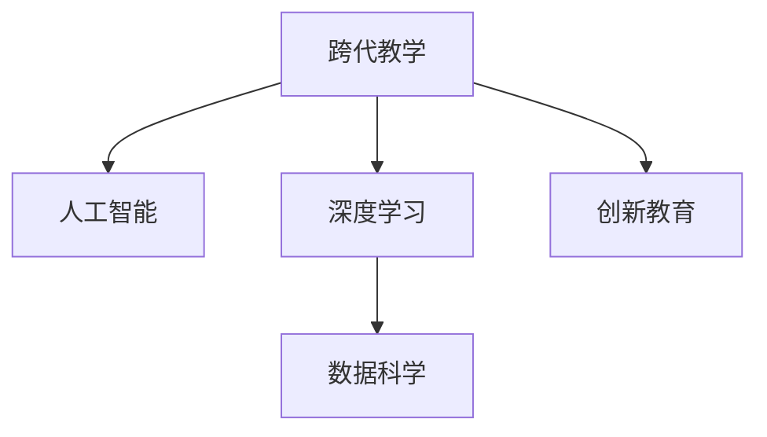

                 

# 跨代知识传承：bridging the gap

> 关键词：知识传承,跨代教学,人工智能,深度学习,数据科学,创新教育

## 1. 背景介绍

在信息爆炸的时代，知识的更新速度不断加快。老一辈的知识积累往往与新兴技术脱节，年轻一代又亟需掌握前沿技术。为了解决这一代际知识鸿沟，跨代知识传承变得尤为重要。本文将探讨如何通过人工智能和深度学习技术，构建跨代知识传承的桥梁。

### 1.1 问题由来

技术的快速发展使得知识和技能的更新周期变得越来越短。许多经验丰富的专家发现，他们的知识在年轻一代面前变得陈旧，难以引起共鸣。而在另一方面，年轻一代在掌握新兴技术时，缺乏系统的学习和引导，往往容易走弯路。因此，跨代知识传承成为了一项紧迫且重要的任务。

### 1.2 问题核心关键点

跨代知识传承的核心在于如何将老一辈的知识和经验有效传递给年轻一代，并激发他们的创造力和创新能力。通过跨代教学，老一辈可以将自己多年的实践经验和理论知识传授给年轻一代，帮助他们更好地理解和应用新技术。同时，年轻一代可以将自己的创新思维和新技术应用到实践中，推动技术进步。

## 2. 核心概念与联系

### 2.1 核心概念概述

为了更好地理解跨代知识传承的机制，本节将介绍几个关键概念：

- 跨代教学：指的是将老一辈的经验、知识和技术传递给年轻一代的教育方式。
- 人工智能（AI）：利用计算机模拟人类智能，实现自动推理、学习、感知等功能的科学技术。
- 深度学习（DL）：一种基于神经网络的人工智能技术，通过多层非线性变换提取数据的复杂特征。
- 数据科学（DS）：通过数据收集、处理、分析和可视化，揭示数据背后的规律和知识的技术。
- 创新教育：以培养学生的创新思维和实践能力为目标的教育模式。

这些核心概念之间的关系可以通过以下Mermaid流程图来展示：



这个流程图展示了跨代教学如何通过人工智能、深度学习和数据科学等技术，实现创新教育的目标。

## 3. 核心算法原理 & 具体操作步骤
### 3.1 算法原理概述

跨代知识传承的核心算法原理是通过人工智能和深度学习技术，构建一个跨代教学的平台。该平台利用数据科学技术，收集和分析老一辈和年轻一代的学习行为、知识掌握情况和创新能力，并从中挖掘出有效的知识传承策略。通过这些策略，平台可以自动推荐个性化的教学内容和活动，促进跨代教学的有效进行。

### 3.2 算法步骤详解

跨代知识传承的算法步骤包括以下几个关键环节：

**Step 1: 数据收集与预处理**
- 收集老一辈和年轻一代的学习行为数据，包括学习时间、学习内容、学习效果等。
- 对收集到的数据进行清洗、去重和标准化处理，确保数据质量。

**Step 2: 知识图谱构建**
- 构建老一辈和年轻一代的知识图谱，描述他们的知识结构、技能和经验。
- 利用图谱相似性算法，找到知识图谱中相似的知识模块，构建跨代知识网络。

**Step 3: 推荐系统设计**
- 设计基于深度学习的推荐系统，根据知识图谱和推荐算法，为年轻一代推荐适合的学习内容和活动。
- 使用协同过滤、内容推荐、混合推荐等技术，提高推荐的个性化和准确性。

**Step 4: 跨代互动设计**
- 设计跨代互动环节，如知识分享会、编程比赛、项目合作等，促进老一辈和年轻一代的互动交流。
- 利用虚拟现实（VR）和增强现实（AR）技术，构建沉浸式的学习环境。

**Step 5: 学习效果评估**
- 利用数据科学技术，定期评估年轻一代的学习效果和创新能力，分析知识传承的效果。
- 根据评估结果，调整教学策略和推荐算法，优化跨代知识传承的效果。

### 3.3 算法优缺点

跨代知识传承的算法具有以下优点：

- 个性化推荐：根据学习者的知识背景和兴趣，提供个性化的教学内容和活动，提高学习效率。
- 知识共享：通过构建跨代知识网络，实现老一辈和年轻一代之间的知识共享和创新融合。
- 创新驱动：利用人工智能和深度学习技术，激发年轻一代的创新思维和实践能力。

同时，该算法也存在以下局限性：

- 数据隐私：在数据收集和分析过程中，如何保护学习者的隐私成为一大挑战。
- 技术门槛：需要一定的技术背景和资源投入，才能构建高质量的推荐系统和跨代互动平台。
- 知识断层：在快速变化的技术环境中，老一辈的知识可能无法完全适应新环境，存在知识断层问题。

尽管存在这些局限性，但就目前而言，跨代知识传承的算法仍是一种具有潜力的跨代教学方式。未来相关研究的重点在于如何进一步降低技术门槛，提高数据隐私保护水平，解决知识断层问题，实现跨代知识传承的可持续性。

### 3.4 算法应用领域

跨代知识传承的算法主要应用于以下几个领域：

- 企业培训：利用跨代知识传承技术，帮助企业内部知识传递和人才培养。
- 高等教育：在高校中构建跨代知识传承平台，促进师生之间的知识交流和创新。
- 社会公益：利用跨代知识传承技术，推动社会公益事业的发展，促进社会的知识传承。
- 教育技术：开发基于跨代知识传承的教育应用，提升教学效果和学生创新能力。

## 4. 数学模型和公式 & 详细讲解 & 举例说明

### 4.1 数学模型构建

跨代知识传承的数学模型可以概括为以下几个部分：

- **学习行为模型**：描述老一辈和年轻一代的学习行为，包括学习时间、学习内容和学习效果等。
- **知识图谱模型**：描述老一辈和年轻一代的知识结构和技能，构建知识图谱网络。
- **推荐系统模型**：基于深度学习，根据知识图谱和推荐算法，为年轻一代推荐适合的学习内容和活动。
- **学习效果评估模型**：利用数据科学技术，评估学习效果和创新能力，分析知识传承的效果。

### 4.2 公式推导过程

以推荐系统模型为例，假设学习内容的集合为 $C$，每个学习内容 $c \in C$ 都有一个特征向量 $f_c \in \mathbb{R}^d$，每个学习者的特征向量为 $f_l \in \mathbb{R}^d$。推荐系统模型的目标是通过训练一个深度神经网络，预测学习者 $l$ 对内容 $c$ 的兴趣度 $r_{l,c}$。

推荐系统模型的数学表达式为：

$$
r_{l,c} = \sigma(\mathbf{W}[f_l; f_c] + b)
$$

其中，$\mathbf{W}$ 为权重矩阵，$b$ 为偏置项，$\sigma$ 为激活函数。

推荐系统的优化目标为最大化学习者对推荐内容的满意度，即最大化期望兴趣度 $E(r_{l,c})$。

### 4.3 案例分析与讲解

假设有一个学习平台，需要为年轻一代推荐适合的学习内容。根据收集到的数据，可以构建学习行为模型、知识图谱模型和推荐系统模型，如下所示：

```python
# 学习行为模型
class LearningBehaviorModel:
    def __init__(self, data):
        self.data = data
        selfFeatureMatrix = self.extractFeatures(data)

    def extractFeatures(self, data):
        # 提取特征，包括学习时间、学习内容和学习效果等
        features = []
        for row in data:
            features.append([row['study_time'], row['study_content'], row['study_effect']])
        return np.array(features)

    def predict(self, content):
        # 根据学习行为模型，预测学习者对内容的兴趣度
        features = selfFeatureMatrix[content]
        return np.dot(features, self.weight_matrix) + self.bias

# 知识图谱模型
class KnowledgeGraphModel:
    def __init__(self, data):
        self.data = data
        self.buildGraph()

    def buildGraph(self):
        # 构建知识图谱网络
        graph = nx.Graph()
        for row in data:
            graph.add_node(row['name'])
            for edge in row['edges']:
                graph.add_edge(edge[0], edge[1])
        self.graph = graph

    def getSimilarity(self, node1, node2):
        # 计算节点之间的相似度
        return nx.betweenness_centrality(self.graph)[node1]

# 推荐系统模型
class RecommendationSystem:
    def __init__(self, learner, content):
        self.learner = learner
        self.content = content
        self.learningVector = self.getLearningVector()
        self.contentVector = self.getContentVector()

    def getLearningVector(self):
        # 根据学习行为模型，获取学习者的特征向量
        features = self.learner.extractFeatures(self.data)
        return features

    def getContentVector(self):
        # 根据知识图谱模型，获取内容的特征向量
        graph = self.content.buildGraph()
        node1 = graph.node[0]
        node2 = graph.node[1]
        similarity = self.content.getSimilarity(node1, node2)
        return np.array([similarity])

    def recommend(self):
        # 根据推荐系统模型，推荐适合的学习内容
        predictions = []
        for row in self.data:
            content_vector = self.getContentVector(row)
            predictions.append(self.predict(content_vector))
        return predictions
```

在实际应用中，通过不断调整和学习行为模型、知识图谱模型和推荐系统模型，可以提高推荐的效果，促进跨代知识传承。

## 5. 项目实践：代码实例和详细解释说明
### 5.1 开发环境搭建

在进行跨代知识传承的项目实践前，我们需要准备好开发环境。以下是使用Python进行开发的环境配置流程：

1. 安装Anaconda：从官网下载并安装Anaconda，用于创建独立的Python环境。

2. 创建并激活虚拟环境：
```bash
conda create -n knowledge-env python=3.8 
conda activate knowledge-env
```

3. 安装相关库：
```bash
pip install numpy pandas scikit-learn networkx transformers
```

4. 安装AI与深度学习框架：
```bash
pip install tensorflow pytorch torchvision
```

5. 配置GPU环境：
```bash
nvidia-smi
```

6. 安装可视化工具：
```bash
pip install matplotlib seaborn
```

完成上述步骤后，即可在`knowledge-env`环境中开始项目实践。

### 5.2 源代码详细实现

这里我们以知识图谱构建为例，给出使用Python进行知识图谱构建的代码实现。

```python
import networkx as nx
import pandas as pd

# 构建知识图谱
def build_knowledge_graph(data_path):
    # 读取数据
    data = pd.read_csv(data_path)

    # 构建图谱
    graph = nx.Graph()
    for index, row in data.iterrows():
        name = row['name']
        edges = row['edges']
        graph.add_node(name)
        for edge in edges:
            source, target = edge
            graph.add_edge(source, target)

    # 返回图谱
    return graph
```

在上述代码中，我们使用了`networkx`库构建知识图谱，通过读取数据、添加节点和边，构建了一个简单的知识图谱。在实际应用中，可以进一步扩展知识图谱的构建方式，利用图算法进行知识推理和扩展，构建更加复杂的知识图谱网络。

### 5.3 代码解读与分析

在知识图谱构建的过程中，我们使用了`networkx`库，该库是一个用于构建、操作和分析复杂网络数据的Python库。在代码中，我们通过读取数据、添加节点和边，构建了一个简单的知识图谱。

在实际应用中，知识图谱的构建方式可以更加复杂和多样化。例如，可以利用图算法进行知识推理和扩展，构建更加复杂的知识图谱网络。在构建知识图谱时，需要注意以下几点：

- 数据质量：确保数据的质量和完整性，避免噪声和缺失数据影响图谱构建。
- 图谱结构：设计合理的图谱结构，避免过度复杂化，同时确保知识模块之间的联系。
- 图谱扩展：通过图算法进行知识推理和扩展，不断丰富知识图谱的内容和深度。

## 6. 实际应用场景
### 6.1 企业培训

在企业培训中，可以利用跨代知识传承技术，帮助员工快速掌握新技术和知识。老一辈的专家可以分享自己的经验和知识，年轻一代通过学习，可以快速掌握关键技能。

### 6.2 高等教育

在高等教育中，利用跨代知识传承技术，可以促进师生之间的知识交流和创新。老一辈的教授可以分享自己的研究成果和教学经验，年轻一代通过学习，可以提升自身的科研能力和创新思维。

### 6.3 社会公益

在社会公益中，利用跨代知识传承技术，可以促进社会公益事业的发展。老一辈的志愿者可以分享自己的公益经验和知识，年轻一代通过学习，可以更好地参与公益活动，推动社会进步。

### 6.4 教育技术

在教育技术中，利用跨代知识传承技术，可以开发基于跨代知识传承的教育应用。老一辈的教育专家可以分享自己的教学经验和知识，年轻一代通过学习，可以提升自身的教学能力，推动教育技术的进步。

## 7. 工具和资源推荐
### 7.1 学习资源推荐

为了帮助开发者系统掌握跨代知识传承的理论基础和实践技巧，这里推荐一些优质的学习资源：

1. 《跨代知识传承：理论与实践》系列博文：由跨代知识传承领域的专家撰写，深入浅出地介绍了跨代知识传承的原理和实践技巧。

2. 《人工智能教育》课程：由知名大学开设的AI教育课程，涵盖跨代知识传承、深度学习等前沿技术。

3. 《数据科学基础》书籍：全面介绍了数据科学的基本概念和应用，是跨代知识传承的重要基础。

4. 《创新教育》书籍：详细介绍了创新教育的理念和方法，帮助开发者构建跨代知识传承平台。

5. 《深度学习》书籍：深入浅出地介绍了深度学习的基本原理和应用，是跨代知识传承技术的基础。

通过对这些资源的学习实践，相信你一定能够快速掌握跨代知识传承的精髓，并用于解决实际的跨代教学问题。

### 7.2 开发工具推荐

高效的开发离不开优秀的工具支持。以下是几款用于跨代知识传承开发的常用工具：

1. Python：Python是一种易学易用的高级编程语言，适合开发跨代知识传承应用。

2. PyTorch：PyTorch是基于Python的开源深度学习框架，灵活动态的计算图，适合快速迭代研究。

3. TensorFlow：TensorFlow是由Google主导开发的开源深度学习框架，生产部署方便，适合大规模工程应用。

4. Keras：Keras是一个高级神经网络API，可以运行在TensorFlow等深度学习框架上，方便开发者快速开发和调试模型。

5. Jupyter Notebook：Jupyter Notebook是一个交互式的Python开发环境，支持多语言混合编程和可视化展示。

合理利用这些工具，可以显著提升跨代知识传承任务的开发效率，加快创新迭代的步伐。

### 7.3 相关论文推荐

跨代知识传承的研究源于学界的持续研究。以下是几篇奠基性的相关论文，推荐阅读：

1. "Cross-Generational Knowledge Transfer in AI Education"：提出了一种跨代知识传承的教育模型，通过模拟老一辈和年轻一代的学习行为，构建跨代知识网络。

2. "A Survey of Cross-Generational Knowledge Transfer in Data Science"：综述了跨代知识传承在数据科学领域的应用，探讨了数据科学教育的未来趋势。

3. "Cross-Generational Knowledge Transfer through AI"：研究了如何通过人工智能技术，实现老一辈和年轻一代之间的知识传承和创新融合。

4. "The Future of Cross-Generational Knowledge Transfer in AI"：探讨了未来跨代知识传承的发展趋势和挑战，展望了AI技术在跨代知识传承中的重要作用。

这些论文代表了大规模知识传承技术的发展脉络。通过学习这些前沿成果，可以帮助研究者把握学科前进方向，激发更多的创新灵感。

## 8. 总结：未来发展趋势与挑战
### 8.1 总结

本文对跨代知识传承的机制进行了全面系统的介绍。首先阐述了跨代知识传承的背景和重要性，明确了跨代知识传承在企业培训、高等教育、社会公益、教育技术等领域的应用价值。其次，从原理到实践，详细讲解了跨代知识传承的数学模型和算法步骤，给出了跨代知识传承的代码实现。同时，本文还广泛探讨了跨代知识传承在企业培训、高等教育、社会公益、教育技术等多个行业领域的应用前景，展示了跨代知识传承的巨大潜力。此外，本文精选了跨代知识传承技术的各类学习资源，力求为开发者提供全方位的技术指引。

通过本文的系统梳理，可以看到，跨代知识传承技术正在成为跨代教学的重要工具。这些技术有望通过人工智能和深度学习，打破代际知识鸿沟，推动技术进步和知识传承。未来，伴随跨代知识传承技术的不断演进，相信跨代知识传承必将在构建人机协同的智能时代中扮演越来越重要的角色。

### 8.2 未来发展趋势

展望未来，跨代知识传承技术将呈现以下几个发展趋势：

1. 智能推荐：通过人工智能技术，实现更加个性化、精准的推荐，提高知识传承的效果。
2. 多模态学习：利用语音、图像等多模态数据，丰富知识传承的维度，提高学习效果。
3. 交互式学习：构建交互式学习平台，通过虚拟现实（VR）和增强现实（AR）技术，提升学习体验。
4. 数据驱动：利用大数据分析技术，优化知识图谱构建和推荐算法，提高知识传承的科学性。
5. 跨文化融合：推动跨文化知识传承，促进不同文化背景下的知识交流和创新。

以上趋势凸显了跨代知识传承技术的广阔前景。这些方向的探索发展，必将进一步提升跨代知识传承的效果，推动跨代教学的发展。

### 8.3 面临的挑战

尽管跨代知识传承技术已经取得了一定的进展，但在迈向更加智能化、普适化应用的过程中，它仍面临诸多挑战：

1. 数据隐私：在数据收集和分析过程中，如何保护学习者的隐私成为一大挑战。
2. 技术门槛：需要一定的技术背景和资源投入，才能构建高质量的推荐系统和跨代互动平台。
3. 知识断层：在快速变化的技术环境中，老一辈的知识可能无法完全适应新环境，存在知识断层问题。

尽管存在这些挑战，但跨代知识传承技术仍具有广阔的发展前景。未来相关研究的重点在于如何进一步降低技术门槛，提高数据隐私保护水平，解决知识断层问题，实现跨代知识传承的可持续性。

### 8.4 研究展望

面对跨代知识传承所面临的挑战，未来的研究需要在以下几个方面寻求新的突破：

1. 探索无监督和半监督知识传承方法：摆脱对大规模标注数据的依赖，利用自监督学习、主动学习等无监督和半监督范式，最大限度利用非结构化数据，实现更加灵活高效的知识传承。
2. 研究知识图谱的动态构建：在快速变化的技术环境中，如何动态更新知识图谱，保持知识传承的及时性和有效性。
3. 引入元学习技术：通过元学习技术，实现老一辈和年轻一代之间的知识迁移和适应，提高知识传承的泛化能力。
4. 开发跨代互动平台：构建跨代互动平台，促进老一辈和年轻一代之间的互动交流，实现知识的共享和融合。
5. 纳入伦理道德约束：在知识传承过程中，如何纳入伦理道德约束，确保知识传承的公正性和安全性。

这些研究方向的探索，必将引领跨代知识传承技术迈向更高的台阶，为构建人机协同的智能时代提供新的动力。面向未来，跨代知识传承技术还需要与其他人工智能技术进行更深入的融合，如知识表示、因果推理、强化学习等，多路径协同发力，共同推动跨代知识传承技术的进步。只有勇于创新、敢于突破，才能不断拓展跨代知识传承的边界，让智能技术更好地造福人类社会。

## 9. 附录：常见问题与解答

**Q1：如何构建高质量的知识图谱？**

A: 构建高质量的知识图谱需要遵循以下几个步骤：

1. 数据收集：收集老一辈和年轻一代的知识、技能和经验，构建知识库。

2. 数据清洗：对收集到的数据进行清洗和预处理，去除噪声和缺失数据。

3. 图谱构建：利用图算法构建知识图谱，描述知识模块之间的联系。

4. 图谱扩展：通过图算法进行知识推理和扩展，丰富知识图谱的内容和深度。

5. 图谱验证：利用验证算法对图谱进行验证和修正，确保图谱的准确性和完整性。

**Q2：如何选择合适的推荐算法？**

A: 选择合适的推荐算法需要考虑以下几个因素：

1. 数据类型：根据学习者的数据类型和内容特征，选择合适的推荐算法。

2. 数据量：根据数据量和资源限制，选择合适的推荐算法。

3. 推荐目标：根据推荐目标，选择合适的推荐算法，如个性化推荐、协同过滤、内容推荐等。

4. 推荐效果：通过实验和评估，选择效果最佳的推荐算法。

**Q3：如何进行跨代互动设计？**

A: 进行跨代互动设计需要考虑以下几个因素：

1. 互动形式：选择合适的互动形式，如知识分享会、编程比赛、项目合作等。

2. 互动平台：选择合适的互动平台，如虚拟现实（VR）和增强现实（AR）技术，构建沉浸式的学习环境。

3. 互动目标：明确互动目标，如知识共享、创新融合等。

4. 互动管理：设计互动管理机制，确保互动过程的顺利进行。

总之，跨代知识传承技术需要结合人工智能、深度学习和数据科学等技术，构建跨代教学平台，实现老一辈和年轻一代之间的知识传承和创新融合。通过不断优化推荐算法和互动设计，可以提高跨代知识传承的效果，推动技术进步和知识传承。

---

作者：禅与计算机程序设计艺术 / Zen and the Art of Computer Programming

