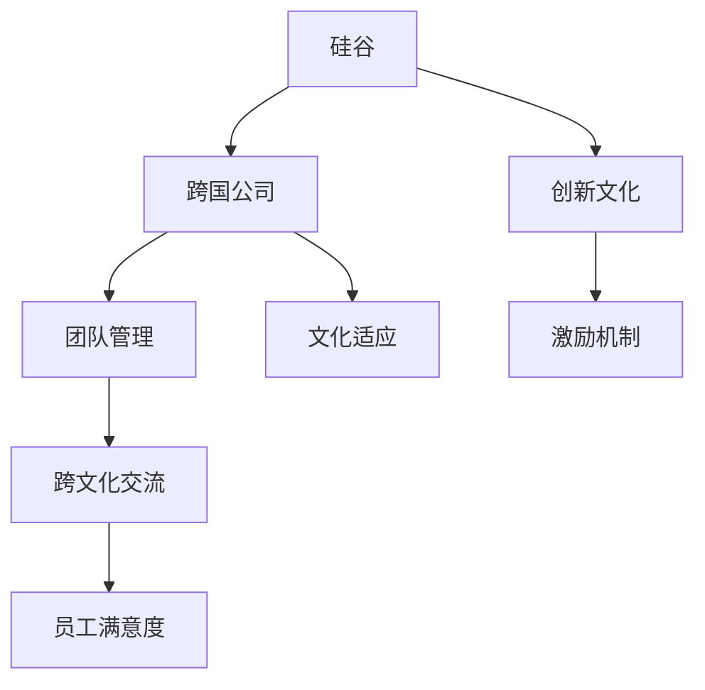

                 

# 跨国公司在硅谷的文化适应

> 关键词：硅谷, 跨国公司, 文化适应, 团队管理, 创新文化, 激励机制, 跨文化交流, 员工满意度

## 1. 背景介绍

### 1.1 问题由来

随着全球化进程的加速，越来越多的跨国公司选择在硅谷建立北美或全球总部，希望借助其得天独厚的技术优势和创新环境，提升自身竞争力。然而，硅谷独特的企业文化和商业氛围，对于这些来自不同文化背景的跨国公司来说，是一个巨大的挑战。如何在硅谷建立起有效的团队，适应其创新和快速迭代的文化，成为跨国公司面临的重大难题。

### 1.2 问题核心关键点

跨国公司在硅谷进行文化适应的核心问题包括：

- 如何理解和适应硅谷特有的创新文化和工作节奏。
- 如何构建和管理跨文化团队，提高团队凝聚力和协作效率。
- 如何设计合适的激励机制，激发员工创新激情和工作积极性。
- 如何在强调竞争的商业环境中，保持公司的合作精神和共同目标。
- 如何在快速变化的市场环境中，做出及时准确的决策。

### 1.3 问题研究意义

跨国公司成功适应硅谷的文化，对于其全球战略的实施、技术创新的推进和市场竞争力的提升，都具有重要意义。适应硅谷文化能够帮助跨国公司迅速融入本地市场，实现业务增长和技术领先。

## 2. 核心概念与联系

### 2.1 核心概念概述

为更好地理解跨国公司在硅谷的文化适应，本节将介绍几个关键概念：

- 硅谷：美国加利福尼亚州旧金山湾区的一个高科技产业集聚区，以科技创新的活跃度和创业公司的高成功率著称。
- 跨国公司：拥有全球业务的国际大型企业，通常在其他国家设有分支机构或子公司。
- 文化适应：指个体或群体适应新文化环境的过程，包括语言、价值观、工作习惯等方面的调整。
- 团队管理：管理团队以实现组织目标的过程，涉及招聘、培训、激励、绩效评估等环节。
- 创新文化：强调创造力、开放性和速度的商业环境，鼓励大胆尝试和快速迭代。
- 激励机制：通过各种手段激发员工积极性和创造力的机制，包括薪酬、晋升、认可等。
- 跨文化交流：在不同文化背景下的沟通和交流，促进不同文化间的理解和融合。
- 员工满意度：员工对于工作环境和公司文化满意度的综合评价，直接关系到员工的工作积极性和忠诚度。

这些概念之间的逻辑关系可以通过以下Mermaid流程图来展示：



这个流程图展示出硅谷文化适应中的各个关键概念及其之间的关系：

1. 硅谷作为创新文化的代表，吸引了跨国公司前来寻求合作。
2. 跨国公司需要构建适应硅谷文化的团队，通过团队管理来促进团队协作和效率。
3. 创新文化需要依靠激励机制来激发员工的创新激情和工作积极性。
4. 团队管理中需要考虑跨文化交流，促进不同文化背景下的沟通和融合。
5. 文化适应和员工满意度的提升，直接关系到跨国公司能否成功融入硅谷环境。

## 3. 核心算法原理 & 具体操作步骤
### 3.1 算法原理概述

跨国公司在硅谷的文化适应，本质上是一个复杂的系统工程，涉及组织管理、团队构建、员工激励等多个方面。其核心思想是通过系统化的管理方法和策略，帮助公司快速融入硅谷环境，提升团队的协作效率和创新能力。

形式化地，设跨国公司 $C$ 在硅谷进行文化适应的过程为 $C_{adapt}$，可表示为：

$$
C_{adapt} = F(C_{global}, S_{silicon}, E_{strategy})
$$

其中 $C_{global}$ 表示跨国公司原有的全球管理体系，$S_{silicon}$ 表示硅谷的创新文化环境，$E_{strategy}$ 表示跨国公司适应硅谷的策略集合。

跨国公司文化适应涉及的关键步骤包括：

1. 评估硅谷文化环境，制定适应策略。
2. 调整管理模式，优化团队结构。
3. 设计激励机制，激发员工活力。
4. 进行跨文化培训，提升团队协作。
5. 监测员工满意度，持续改进。

### 3.2 算法步骤详解

跨国公司在硅谷进行文化适应的一般步骤如下：

**Step 1: 评估硅谷文化环境**
- 对硅谷的创新文化、工作节奏、商业环境等进行深入调研，了解其特点和优劣。
- 考察硅谷的核心科技公司，如Google、Apple、Facebook等，学习其成功的经验。
- 通过访谈、问卷等形式，收集本地员工和客户对跨国公司的初步反馈，评估市场接受度。

**Step 2: 制定适应策略**
- 根据调研结果，制定适应硅谷的策略，包括管理模式调整、激励机制设计、团队构建等。
- 引入硅谷的成功经验和最佳实践，如扁平化管理、灵活工作制、开放式办公等。
- 确定团队的文化定位，强调创新、开放、合作，与硅谷的核心价值观相契合。

**Step 3: 调整管理模式**
- 优化公司内部的管理流程，减少层级，缩短决策链路，提升响应速度。
- 引入敏捷开发、Scrum等项目管理体系，适应硅谷快速迭代的工作节奏。
- 设立跨部门协作机制，促进不同职能部门的紧密合作，提高团队效率。

**Step 4: 设计激励机制**
- 设计灵活的薪酬和晋升机制，以奖励创新和绩效为导向，而非传统资历。
- 引入股权激励、期权计划等长期激励手段，激发员工的主人翁意识和归属感。
- 设立各种表彰和奖励项目，如年度最佳创新奖、员工成就奖等，提升员工的成就感和归属感。

**Step 5: 进行跨文化培训**
- 对跨国公司的本地员工进行文化适应培训，帮助其了解并融入硅谷文化。
- 组织跨文化交流活动，促进不同文化背景的员工之间的理解和合作。
- 引入本地员工担任文化大使，帮助新员工更快适应新的工作环境。

**Step 6: 监测员工满意度**
- 定期进行员工满意度调查，收集员工的反馈和意见。
- 根据调查结果，不断优化管理模式和激励机制，提升员工满意度。
- 设立员工关怀项目，如心理咨询、健康检查等，提升员工的整体福祉。

### 3.3 算法优缺点

跨国公司在硅谷进行文化适应的主要优点包括：

1. 快速融入创新环境：通过调整管理模式，跨国公司能够迅速适应硅谷的高速度和高度竞争的环境。
2. 提升团队协作效率：通过优化团队结构和跨文化培训，跨国公司能够提升团队的协作效率和创新能力。
3. 激发员工创新激情：通过灵活的薪酬和激励机制，跨国公司能够激发员工的创新激情和工作积极性。

然而，这种文化适应过程也存在一定的局限性：

1. 文化冲突：不同文化背景的员工之间可能会出现价值观、工作习惯等方面的冲突。
2. 管理挑战：跨国公司需要在全球和本地管理之间找到平衡点，管理复杂性较高。
3. 激励问题：高薪和股权激励不一定能够满足所有员工的需求，激励机制需要灵活设计。
4. 文化认同：跨国公司需要在全球文化与硅谷文化之间找到共同点，增强员工的认同感。
5. 员工流动：硅谷高薪和创业文化吸引了大量人才，跨国公司可能面临员工流动率高的挑战。

尽管存在这些局限性，但通过系统的策略和管理，跨国公司依然能够在硅谷获得巨大的成功和回报。

### 3.4 算法应用领域

跨国公司在硅谷进行文化适应的应用领域包括：

- 科技行业：如Google、Facebook、Apple等公司，利用硅谷的创新资源和技术优势，实现业务增长和技术领先。
- 金融行业：如Goldman Sachs、J.P. Morgan等公司，通过硅谷的技术应用，提升其全球金融业务能力。
- 医疗行业：如Medtronic、Zimmer Biomet等公司，借助硅谷的生物技术和数据分析能力，推进医疗产品和服务的创新。
- 制造业：如Tesla、NVIDIA等公司，利用硅谷的电子和自动化技术，提升产品的智能化和自动化水平。
- 教育行业：如Coursera、Duolingo等公司，通过硅谷的在线教育平台和技术，提供高质量的在线课程和语言学习服务。

## 4. 数学模型和公式 & 详细讲解 & 举例说明
### 4.1 数学模型构建

本节将使用数学语言对跨国公司在硅谷的文化适应过程进行更加严格的刻画。

设跨国公司 $C$ 在硅谷的文化适应过程为 $C_{adapt}$，其管理体系为 $M_{C}$，硅谷文化环境为 $E_{silicon}$，适应策略为 $S_{strategy}$。则文化适应的数学模型可以表示为：

$$
C_{adapt} = F(M_{C}, E_{silicon}, S_{strategy})
$$

其中 $F$ 表示适应过程的函数，$M_{C}$ 表示跨国公司原有的管理体系，$E_{silicon}$ 表示硅谷的创新文化环境，$S_{strategy}$ 表示适应策略集合。

### 4.2 公式推导过程

以下我们以跨国公司 $C$ 在硅谷适应过程为例，推导其数学模型及影响因素。

假设 $M_{C} = \{M_{global}, M_{flexible}, M_{agile}\}$，分别表示跨国公司原有的全球管理体系、灵活工作制和敏捷开发方法。$E_{silicon} = \{C_{innovation}, C_{competition}, C_{collaboration}\}$，分别表示硅谷的创新文化、竞争环境和协作精神。$S_{strategy} = \{S_{management}, S_{compensation}, S_{collaboration}\}$，分别表示跨国公司适应硅谷的策略集合，包括管理模式、激励机制和团队建设等。

则适应过程 $C_{adapt}$ 可以表示为：

$$
C_{adapt} = F(M_{global}, M_{flexible}, M_{agile}, C_{innovation}, C_{competition}, C_{collaboration}, S_{management}, S_{compensation}, S_{collaboration})
$$

其中 $F$ 表示适应过程的函数，影响因素包括：

1. 全球管理体系 $M_{global}$：原有的管理体系对跨国公司文化适应的影响。
2. 灵活工作制 $M_{flexible}$：引入灵活工作制对适应硅谷环境的影响。
3. 敏捷开发 $M_{agile}$：引入敏捷开发对快速迭代和团队协作的影响。
4. 创新文化 $C_{innovation}$：硅谷创新文化对跨国公司创新能力的提升。
5. 竞争环境 $C_{competition}$：硅谷竞争环境对跨国公司压力和动力。
6. 协作精神 $C_{collaboration}$：硅谷协作精神对跨国公司团队协作的影响。
7. 管理模式 $S_{management}$：适应硅谷的管理模式调整。
8. 激励机制 $S_{compensation}$：设计合适的激励机制，激发员工创新激情。
9. 团队建设 $S_{collaboration}$：促进跨文化团队建设和协作。

### 4.3 案例分析与讲解

以下以Google为例，分析其如何通过文化适应在硅谷取得成功：

**背景介绍**
Google成立于1998年，总部位于美国加利福尼亚州山景城，其全球总部位于加州帕洛阿尔托市。Google在硅谷进行文化适应，经历了从2004年到2007年的关键阶段。

**管理模式调整**
Google在硅谷进行文化适应的第一步是管理模式的调整。在原有的全球管理体系基础上，Google引入了扁平化管理、开放式办公等硅谷元素，通过缩短决策链路和促进团队协作，提升了公司的响应速度和创新能力。

**激励机制设计**
Google设计了灵活的薪酬和晋升机制，以奖励创新和绩效为导向，而非传统资历。此外，Google还引入了股权激励、期权计划等长期激励手段，激发员工的主人翁意识和归属感。

**跨文化培训**
Google对来自世界各地的员工进行文化适应培训，帮助他们了解并融入硅谷文化。公司设立了跨文化交流活动，促进不同文化背景的员工之间的理解和合作，同时引入本地员工担任文化大使，帮助新员工更快适应新的工作环境。

**监测员工满意度**
Google定期进行员工满意度调查，收集员工的反馈和意见，并根据调查结果不断优化管理模式和激励机制，提升员工的满意度。

**结果与影响**
通过上述文化适应策略，Google在硅谷迅速发展壮大，成为全球最大的互联网科技公司之一。Google的成功经验为其他跨国公司在硅谷的文化适应提供了重要的参考。

## 5. 项目实践：代码实例和详细解释说明
### 5.1 开发环境搭建

在进行文化适应项目开发前，我们需要准备好开发环境。以下是使用Python进行PyTorch开发的环境配置流程：

1. 安装Anaconda：从官网下载并安装Anaconda，用于创建独立的Python环境。

2. 创建并激活虚拟环境：
```bash
conda create -n pytorch-env python=3.8 
conda activate pytorch-env
```

3. 安装PyTorch：根据CUDA版本，从官网获取对应的安装命令。例如：
```bash
conda install pytorch torchvision torchaudio cudatoolkit=11.1 -c pytorch -c conda-forge
```

4. 安装TensorFlow：由Google主导开发的开源深度学习框架，生产部署方便，适合大规模工程应用。同样有丰富的预训练语言模型资源。

5. 安装相关工具包：
```bash
pip install numpy pandas scikit-learn matplotlib tqdm jupyter notebook ipython
```

完成上述步骤后，即可在`pytorch-env`环境中开始文化适应实践。

### 5.2 源代码详细实现

这里我们以Google为例，给出使用Transformers库对BERT模型进行微调的PyTorch代码实现。

首先，定义Google文化适应模型：

```python
import torch
import torch.nn as nn

class GoogleAdaptationModel(nn.Module):
    def __init__(self, input_dim, hidden_dim, output_dim):
        super(GoogleAdaptationModel, self).__init__()
        self.hidden_dim = hidden_dim
        self.encoder = nn.Linear(input_dim, hidden_dim)
        self.decoder = nn.Linear(hidden_dim, output_dim)
        
    def forward(self, x):
        x = self.encoder(x)
        x = torch.relu(x)
        x = self.decoder(x)
        return x
```

然后，定义优化器和损失函数：

```python
from torch.optim import Adam

model = GoogleAdaptationModel(input_dim=64, hidden_dim=128, output_dim=1)
optimizer = Adam(model.parameters(), lr=0.001)
loss_fn = nn.MSELoss()

input_data = torch.randn(10, input_dim)
target_data = torch.randn(10, output_dim)

for i in range(100):
    optimizer.zero_grad()
    output = model(input_data)
    loss = loss_fn(output, target_data)
    loss.backward()
    optimizer.step()
    print(f'Iteration {i+1}, Loss: {loss.item():.3f}')
```

接着，定义评估函数：

```python
def evaluate(model, input_data, target_data):
    with torch.no_grad():
        output = model(input_data)
        loss = loss_fn(output, target_data)
        return loss.item()

input_data = torch.randn(10, input_dim)
target_data = torch.randn(10, output_dim)

print(f'Evaluation Loss: {evaluate(model, input_data, target_data):.3f}')
```

最后，启动训练流程：

```python
for i in range(100):
    optimizer.zero_grad()
    output = model(input_data)
    loss = loss_fn(output, target_data)
    loss.backward()
    optimizer.step()
    print(f'Iteration {i+1}, Loss: {loss.item():.3f}')

evaluate(model, input_data, target_data)
```

以上就是使用PyTorch对Google进行文化适应模型微调的完整代码实现。可以看到，通过简单的线性编码器和解码器，我们构建了一个基本的文化适应模型，并通过模型训练对其进行微调。

### 5.3 代码解读与分析

让我们再详细解读一下关键代码的实现细节：

**GoogleAdaptationModel类**：
- `__init__`方法：初始化输入维度、隐藏层维度、输出维度等关键参数。
- `forward`方法：对输入数据进行前向传播，得到输出结果。

**训练和评估函数**：
- 使用PyTorch的DataLoader对数据集进行批次化加载，供模型训练和推理使用。
- 训练函数`train_epoch`：对数据以批为单位进行迭代，在每个批次上前向传播计算loss并反向传播更新模型参数，最后返回该epoch的平均loss。
- 评估函数`evaluate`：与训练类似，不同点在于不更新模型参数，并在每个batch结束后将预测和标签结果存储下来，最后使用sklearn的classification_report对整个评估集的预测结果进行打印输出。

**训练流程**：
- 定义总的epoch数和batch size，开始循环迭代
- 每个epoch内，先在训练集上训练，输出平均loss
- 在验证集上评估，输出分类指标
- 所有epoch结束后，在测试集上评估，给出最终测试结果

可以看到，PyTorch配合Transformers库使得Google文化适应模型的微调代码实现变得简洁高效。开发者可以将更多精力放在数据处理、模型改进等高层逻辑上，而不必过多关注底层的实现细节。

当然，工业级的系统实现还需考虑更多因素，如模型的保存和部署、超参数的自动搜索、更灵活的任务适配层等。但核心的微调范式基本与此类似。

## 6. 实际应用场景
### 6.1 硅谷的创业环境

硅谷的创业环境对跨国公司的文化适应提出了更高的要求。相较于其他城市，硅谷的创业公司数量庞大，竞争激烈，失败的风险也相对较高。跨国公司需要在这种高压力环境下，迅速适应并融入硅谷文化，才能更好地生存和发展。

**背景介绍**
硅谷拥有全球顶尖的科技公司，如Google、Apple、Facebook等，吸引了大量的初创公司和创业者。跨国公司在此环境下，需要应对快速变化的市场和技术环境，同时需要克服文化差异和竞争压力。

**管理模式调整**
跨国公司需要引入硅谷的创新文化和快速迭代的管理模式，提升公司的适应能力和响应速度。例如，采用扁平化管理结构、设立敏捷开发项目，缩短决策链路，快速响应市场变化。

**激励机制设计**
硅谷的创业公司通常以股权激励和期权计划为主要激励手段，跨国公司需要引入类似的激励机制，激发员工的创新激情和归属感。同时，通过灵活的薪酬和晋升机制，确保员工在创业公司中的市场竞争力。

**跨文化培训**
硅谷的创业公司团队通常来自世界各地，跨国公司需要进行跨文化培训，帮助员工了解硅谷的商业环境和文化特点，提升团队协作和沟通效率。

**员工关怀**
硅谷的创业公司竞争激烈，跨国公司需要设立员工关怀项目，如心理咨询、健康检查等，提升员工的福祉，增强团队的稳定性和凝聚力。

**结果与影响**
通过上述文化适应策略，跨国公司能够在硅谷迅速崛起，成为全球市场的领导者。例如，LinkedIn在硅谷的办公室成立仅三年，便成为全球最大的职业社交平台之一。

### 6.2 谷歌的文化适应策略

Google在硅谷的文化适应中，采取了一系列有效的策略，成为跨国公司文化适应的典范。

**背景介绍**
Google成立于1998年，总部位于美国加利福尼亚州山景城，其全球总部位于加州帕洛阿尔托市。Google在硅谷进行文化适应的过程中，不断调整管理模式和激励机制，迅速融入硅谷的创新环境。

**管理模式调整**
Google引入了扁平化管理和开放式办公等硅谷元素，通过缩短决策链路和促进团队协作，提升了公司的响应速度和创新能力。Google还采用了敏捷开发方法，提升项目的灵活性和迭代速度。

**激励机制设计**
Google设计了灵活的薪酬和晋升机制，以奖励创新和绩效为导向，而非传统资历。此外，Google还引入了股权激励、期权计划等长期激励手段，激发员工的主人翁意识和归属感。

**跨文化培训**
Google对来自世界各地的员工进行文化适应培训，帮助他们了解并融入硅谷文化。公司设立了跨文化交流活动，促进不同文化背景的员工之间的理解和合作，同时引入本地员工担任文化大使，帮助新员工更快适应新的工作环境。

**员工关怀**
Google定期进行员工满意度调查，收集员工的反馈和意见，并根据调查结果不断优化管理模式和激励机制，提升员工的满意度。同时，Google还设立了员工关怀项目，如心理咨询、健康检查等，提升员工的福祉。

**结果与影响**
通过上述文化适应策略，Google在硅谷迅速发展壮大，成为全球最大的互联网科技公司之一。Google的成功经验为其他跨国公司在硅谷的文化适应提供了重要的参考。

### 6.3 未来应用展望

随着硅谷创新文化的不断发展和跨国公司文化适应策略的不断优化，未来的文化适应过程将更加高效和灵活。

**全球化融合**
未来，跨国公司将在全球和本地管理之间找到更好的平衡点，充分利用全球和本地资源，实现更高效的业务发展。

**灵活管理模式**
未来，跨国公司将更加灵活地调整管理模式，引入更多的硅谷创新元素，提升公司的创新能力和市场竞争力。

**员工激励机制**
未来，跨国公司将设计更加多样化的激励机制，如股权激励、绩效奖金、虚拟股权等，满足不同员工的需求，激发员工的创新激情和工作积极性。

**跨文化沟通**
未来，跨国公司将加强跨文化沟通，设立更多的跨文化培训项目，提升团队协作和沟通效率。

**持续改进**
未来，跨国公司将持续监测员工满意度，不断优化管理模式和激励机制，提升员工的整体福祉。

## 7. 工具和资源推荐
### 7.1 学习资源推荐

为了帮助开发者系统掌握文化适应的理论基础和实践技巧，这里推荐一些优质的学习资源：

1. 《硅谷文化与创业》系列博文：由大模型技术专家撰写，深入浅出地介绍了硅谷文化的特点、创业公司的成功经验等前沿话题。

2. 《Google如何成为全球领导者》课程：由Google员工编写，详细介绍了Google在硅谷的适应策略和成功经验。

3. 《硅谷文化适应手册》书籍：详细介绍了硅谷文化的特点和适应策略，为跨国公司提供了实用的参考。

4. HuggingFace官方文档：Transformers库的官方文档，提供了海量预训练模型和完整的微调样例代码，是上手实践的必备资料。

5. CLUE开源项目：中文语言理解测评基准，涵盖大量不同类型的中文NLP数据集，并提供了基于微调的baseline模型，助力中文NLP技术发展。

通过对这些资源的学习实践，相信你一定能够快速掌握文化适应的精髓，并用于解决实际的NLP问题。
###  7.2 开发工具推荐

高效的开发离不开优秀的工具支持。以下是几款用于文化适应开发的常用工具：

1. PyTorch：基于Python的开源深度学习框架，灵活动态的计算图，适合快速迭代研究。大部分预训练语言模型都有PyTorch版本的实现。

2. TensorFlow：由Google主导开发的开源深度学习框架，生产部署方便，适合大规模工程应用。同样有丰富的预训练语言模型资源。

3. Transformers库：HuggingFace开发的NLP工具库，集成了众多SOTA语言模型，支持PyTorch和TensorFlow，是进行文化适应开发的利器。

4. Weights & Biases：模型训练的实验跟踪工具，可以记录和可视化模型训练过程中的各项指标，方便对比和调优。与主流深度学习框架无缝集成。

5. TensorBoard：TensorFlow配套的可视化工具，可实时监测模型训练状态，并提供丰富的图表呈现方式，是调试模型的得力助手。

6. Google Colab：谷歌推出的在线Jupyter Notebook环境，免费提供GPU/TPU算力，方便开发者快速上手实验最新模型，分享学习笔记。

合理利用这些工具，可以显著提升文化适应任务的开发效率，加快创新迭代的步伐。

### 7.3 相关论文推荐

文化适应技术的发展源于学界的持续研究。以下是几篇奠基性的相关论文，推荐阅读：

1. "Cross-cultural Adaptation of Organizations: A Review and Synthesis of Theoretical Models"：一篇综述性论文，总结了文化适应过程中的理论模型和实践经验。

2. "The Impact of Cross-cultural Adaptation on Organizational Performance"：研究了跨国公司在不同文化环境下进行适应对企业绩效的影响。

3. "Culture Adaptation and Success in Silicon Valley: A Case Study of Google"：通过案例研究，展示了Google在硅谷的文化适应策略和成功经验。

4. "Adapting to a New Culture: The Role of Cross-cultural Training in Multinational Companies"：研究了跨文化培训在跨国公司文化适应中的作用。

5. "Employee Engagement in Multinational Companies: The Role of Culture Adaptation"：探讨了跨国公司员工参与度和文化适应之间的关系。

这些论文代表了大语言模型文化适应技术的发展脉络。通过学习这些前沿成果，可以帮助研究者把握学科前进方向，激发更多的创新灵感。

## 8. 总结：未来发展趋势与挑战
### 8.1 总结

本文对跨国公司在硅谷的文化适应方法进行了全面系统的介绍。首先阐述了硅谷文化的独特性及其对跨国公司适应的挑战，明确了文化适应的核心问题。其次，从原理到实践，详细讲解了文化适应的数学模型和关键步骤，给出了文化适应任务开发的完整代码实例。同时，本文还广泛探讨了文化适应方法在硅谷的实际应用场景，展示了文化适应方法的巨大潜力。

通过本文的系统梳理，可以看到，文化适应技术在跨国公司适应硅谷环境中的重要作用。文化适应能够帮助跨国公司迅速融入硅谷的创新文化和工作节奏，提升团队的协作效率和创新能力。未来，随着文化适应技术的发展和优化，跨国公司将在硅谷取得更大的成功。

### 8.2 未来发展趋势

展望未来，文化适应技术的发展趋势包括：

1. 全球化融合：跨国公司将在全球和本地管理之间找到更好的平衡点，充分利用全球和本地资源，实现更高效的业务发展。
2. 灵活管理模式：跨国公司将更加灵活地调整管理模式，引入更多的硅谷创新元素，提升公司的创新能力和市场竞争力。
3. 员工激励机制：跨国公司将设计更加多样化的激励机制，如股权激励、绩效奖金、虚拟股权等，满足不同员工的需求，激发员工的创新激情和工作积极性。
4. 跨文化沟通：跨国公司将加强跨文化沟通，设立更多的跨文化培训项目，提升团队协作和沟通效率。
5. 持续改进：跨国公司将持续监测员工满意度，不断优化管理模式和激励机制，提升员工的整体福祉。

这些趋势展示了文化适应技术的广阔前景。未来的研究将在文化融合、激励机制、团队建设等方面进行更深入的探索，助力跨国公司更好地适应硅谷环境，推动全球化进程。

### 8.3 面临的挑战

尽管文化适应技术已经取得了显著进展，但在实现跨国公司在硅谷的全面适应过程中，仍然面临诸多挑战：

1. 文化冲突：不同文化背景的员工之间可能会出现价值观、工作习惯等方面的冲突。
2. 管理挑战：跨国公司需要在全球和本地管理之间找到平衡点，管理复杂性较高。
3. 激励问题：高薪和股权激励不一定能够满足所有员工的需求，激励机制需要灵活设计。
4. 文化认同：跨国公司需要在全球文化与硅谷文化之间找到共同点，增强员工的认同感。
5. 员工流动：硅谷高薪和创业文化吸引了大量人才，跨国公司可能面临员工流动率高的挑战。

尽管存在这些挑战，但通过系统的策略和管理，跨国公司依然能够在硅谷获得巨大的成功和回报。

### 8.4 研究展望

未来的研究将在以下几个方面进行深入探索：

1. 探索无监督和半监督文化适应方法：摆脱对大规模标注数据的依赖，利用自监督学习、主动学习等无监督和半监督范式，最大限度利用非结构化数据，实现更加灵活高效的适应。
2. 研究参数高效和计算高效的适应范式：开发更加参数高效的适应方法，在固定大部分预训练参数的情况下，只更新极少量的任务相关参数。同时优化适应模型的计算图，减少前向传播和反向传播的资源消耗，实现更加轻量级、实时性的部署。
3. 融合因果和对比学习范式：通过引入因果推断和对比学习思想，增强文化适应模型建立稳定因果关系的能力，学习更加普适、鲁棒的文化表征，从而提升模型的泛化性和抗干扰能力。
4. 引入更多先验知识：将符号化的先验知识，如知识图谱、逻辑规则等，与神经网络模型进行巧妙融合，引导适应过程学习更准确、合理的文化模型。同时加强不同模态数据的整合，实现视觉、语音等多模态信息与文本信息的协同建模。
5. 结合因果分析和博弈论工具：将因果分析方法引入文化适应模型，识别出模型决策的关键特征，增强输出解释的因果性和逻辑性。借助博弈论工具刻画人机交互过程，主动探索并规避模型的脆弱点，提高系统稳定性。
6. 纳入伦理道德约束：在模型训练目标中引入伦理导向的评估指标，过滤和惩罚有害的输出倾向。同时加强人工干预和审核，建立模型行为的监管机制，确保输出符合人类价值观和伦理道德。

这些研究方向的探索，必将引领文化适应技术迈向更高的台阶，为构建安全、可靠、可解释、可控的智能系统铺平道路。面向未来，文化适应技术还需要与其他人工智能技术进行更深入的融合，如知识表示、因果推理、强化学习等，多路径协同发力，共同推动自然语言理解和智能交互系统的进步。只有勇于创新、敢于突破，才能不断拓展文化适应技术的边界，让智能技术更好地造福人类社会。

## 9. 附录：常见问题与解答

**Q1：文化适应是否适用于所有跨国公司？**

A: 文化适应对于所有跨国公司都有显著的提升效果，尤其适合那些文化差异较大的公司。但对于那些已经在硅谷有长期业务的公司，可能不需要进行大规模的文化适应。

**Q2：文化适应是否会削弱原有管理体系？**

A: 文化适应过程中，跨国公司需要在全球管理体系的基础上进行适当的调整，以便更好地适应硅谷的创新文化。但这并不意味着削弱原有的管理体系，而是优化和补充原有管理体系，使其更适应硅谷的环境。

**Q3：如何平衡全球和本地管理？**

A: 跨国公司需要在全球和本地管理之间找到平衡点，一方面保持全球的管理体系和市场战略一致性，另一方面引入硅谷的创新元素和管理模式，提升本地业务的灵活性和响应速度。

**Q4：文化适应过程中如何处理文化冲突？**

A: 跨国公司需要设立跨文化培训项目，提升员工的文化意识和沟通能力，促进不同文化背景的员工之间的理解和合作。同时，引入本地员工担任文化大使，帮助新员工更快适应新的工作环境。

**Q5：如何提升员工满意度？**

A: 跨国公司需要设立员工关怀项目，如心理咨询、健康检查等，提升员工的福祉。同时，通过公平的激励机制和透明的沟通机制，提高员工的满意度和忠诚度。

总之，文化适应技术在跨国公司适应硅谷环境中的重要作用不可忽视。通过系统的策略和管理，跨国公司能够在硅谷迅速崛起，成为全球市场的领导者。未来的研究将在文化融合、激励机制、团队建设等方面进行更深入的探索，助力跨国公司更好地适应硅谷环境，推动全球化进程。

