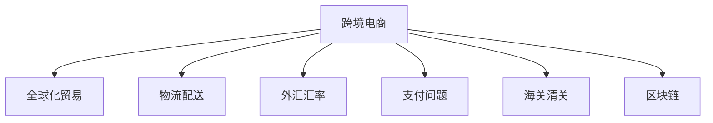

                 

# 跨境电商创业：全球化贸易的新机遇

## 1. 背景介绍

### 1.1 问题由来
随着全球化和互联网技术的飞速发展，跨境电商已成为全球化贸易的重要组成部分。近年来，越来越多的企业利用跨境电商平台拓展国际市场，实现了从传统线下贸易向线上渠道的转型。跨境电商不仅有助于企业降低贸易成本、扩大市场份额，还为消费者提供了更广阔的购物选择。

然而，跨境电商的全球化贸易也面临诸多挑战，如海关清关、物流配送、外汇汇率波动、支付问题等，这些问题需要企业具备较强的资源整合能力和风险管理能力。此外，不同国家和地区的市场规则、文化习俗、法律政策差异也增加了企业运营的复杂性。

### 1.2 问题核心关键点
跨境电商创业的核心关键点在于如何有效整合线上线下资源，解决物流、支付、清关等问题，同时提升用户体验，增加市场竞争力。本节将重点介绍跨境电商创业的典型环节和需要解决的痛点问题，以及利用最新技术应对这些挑战的策略。

## 2. 核心概念与联系

### 2.1 核心概念概述

为更好地理解跨境电商创业的技术实现，本节将介绍几个密切相关的核心概念：

- 跨境电商：指通过互联网平台，跨越国界进行的商品和服务的买卖活动。
- 全球化贸易：指各国之间的商品和服务贸易，包括传统的货物贸易、跨境电商、服务贸易等。
- 物流配送：指商品从供应商到消费者的运输和交付过程，涉及仓储、运输、包装、配送等多个环节。
- 外汇汇率：指不同货币之间的兑换比率，影响跨境电商的盈利水平和成本控制。
- 支付问题：指跨境电商交易中的支付方式选择和支付安全问题。
- 海关清关：指商品从出口国到进口国的清关流程，包括申报、查验、放行等环节。
- 区块链：一种分布式账本技术，可以用于提高跨境电商的透明度和安全性。

这些核心概念之间的逻辑关系可以通过以下Mermaid流程图来展示：



这个流程图展示了的核心概念及其之间的关系：

1. 跨境电商是全球化贸易的重要组成部分。
2. 物流配送、外汇汇率、支付问题、海关清关等是跨境电商的关键环节。
3. 区块链技术可以提高跨境电商的透明度和安全性。

这些概念共同构成了跨境电商创业的技术框架，使得企业能够通过技术手段解决运营中的复杂问题。

## 3. 核心算法原理 & 具体操作步骤

### 3.1 算法原理概述

跨境电商创业的技术实现，主要依赖于互联网技术、人工智能、大数据分析等多种技术手段的整合应用。核心算法原理包括：

- 电商平台开发：利用Web技术、数据库、缓存技术等，构建跨境电商平台，实现商品展示、搜索、购物车、结算等功能。
- 推荐系统：通过分析用户行为数据，为用户推荐感兴趣的商品，提高转化率。
- 支付系统：实现多币种支付、第三方支付、移动支付等功能，保障交易安全。
- 物流追踪：利用GIS、GPS、物联网等技术，实时跟踪商品物流信息，提升配送效率。
- 大数据分析：利用数据分析技术，对用户行为、市场趋势、商品销量等进行深度挖掘，辅助决策。

### 3.2 算法步骤详解

跨境电商创业的技术实现流程包括：

1. **电商平台搭建**：选择合适的技术栈，如React、Vue、Angular等，利用前端框架和后端语言（如Node.js、Python、Java等）开发跨境电商平台。
2. **支付系统集成**：集成多种支付方式，如信用卡支付、支付宝、微信支付等，保证支付便捷性和安全性。
3. **物流管理系统构建**：开发物流管理系统，实时跟踪物流信息，优化配送路线和仓库管理。
4. **推荐系统训练**：收集用户行为数据，训练推荐模型，提升用户购物体验。
5. **大数据分析应用**：利用Hadoop、Spark等大数据技术，分析用户数据、市场数据，指导营销和运营决策。
6. **区块链应用**：在跨境电商中应用区块链技术，提高交易透明度和数据安全。

### 3.3 算法优缺点

跨境电商创业的技术实现具有以下优点：

- 降低交易成本：通过线上平台，可以大幅降低交易环节中的中间成本。
- 提高运营效率：自动化处理订单、支付、物流等环节，提高处理效率。
- 扩大市场范围：突破地域限制，拓展更广阔的国际市场。
- 提升用户体验：利用推荐系统、大数据分析等技术，提升购物体验。

同时，该方法也存在一定的局限性：

- 技术门槛高：需要掌握多种技术栈和工具，技术实现复杂。
- 投入成本高：开发和维护成本较高，特别是大数据和区块链技术的应用。
- 跨境合规问题：不同国家和地区的法律法规、支付方式等差异，增加了运营难度。
- 数据隐私风险：跨境交易涉及敏感数据，需要严格遵守数据保护法规。

尽管存在这些局限性，但跨境电商创业通过技术的深度融合，仍能提供巨大的商业机会和创新空间。

### 3.4 算法应用领域

跨境电商创业的技术实现，主要应用于以下领域：

- 跨境零售：通过电商平台，直接向消费者销售商品。
- 跨境批发：在B2B平台上，向海外企业销售商品或服务。
- 全球化服务：提供在线咨询、云服务、软件即服务(SaaS)等。
- 全球化物流：提供跨境物流、供应链管理、仓储服务等。
- 区块链应用：利用区块链技术，提供跨境支付、溯源追踪等增值服务。

这些领域的技术实现，不仅能够提升企业的竞争力，还能推动全球化贸易的发展，为消费者提供更优质的商品和服务。

## 4. 数学模型和公式 & 详细讲解 & 举例说明

### 4.1 数学模型构建

本节将使用数学语言对跨境电商创业的技术实现进行更加严格的刻画。

记电商平台为 $E(\boldsymbol{x},\boldsymbol{y})$，其中 $\boldsymbol{x}$ 为订单信息，$\boldsymbol{y}$ 为支付信息。订单的生成概率 $P(\boldsymbol{x})$ 和支付的成功概率 $P(\boldsymbol{y})$ 可以表示为：

$$
P(\boldsymbol{x}) = f(\boldsymbol{x},\boldsymbol{u}), \quad P(\boldsymbol{y}) = g(\boldsymbol{y},\boldsymbol{v})
$$

其中 $\boldsymbol{u}$ 和 $\boldsymbol{v}$ 为订单和支付相关的用户特征，$f$ 和 $g$ 为相应的概率模型。

### 4.2 公式推导过程

接下来，推导电商平台的用户转化率模型。用户点击下单的概率 $P(\boldsymbol{x})$ 可表示为：

$$
P(\boldsymbol{x}) = P(\boldsymbol{u}) \times P(\boldsymbol{v}) \times P(\boldsymbol{w})
$$

其中 $P(\boldsymbol{w})$ 为用户支付成功的概率。利用贝叶斯定理，用户完成交易的概率 $P(\boldsymbol{x})$ 可以表示为：

$$
P(\boldsymbol{x}) = \frac{P(\boldsymbol{x})P(\boldsymbol{y})}{P(\boldsymbol{y})}
$$

其中 $P(\boldsymbol{y})$ 为支付成功的概率，通过大数据分析可以得到。

### 4.3 案例分析与讲解

考虑一个具体的案例：某跨境电商平台通过A/B测试，测试了两种不同的推荐系统对用户购买率的影响。A系统基于内容推荐，B系统基于协同过滤。两种推荐系统的推荐结果如下：

| 推荐系统 | 商品A | 商品B | 商品C |
| --- | --- | --- | --- |
| A系统 | 10% | 15% | 10% |
| B系统 | 8% | 12% | 15% |

设用户点击购买商品的概率为 $p$，则A系统和B系统的期望购买率分别为：

$$
P_A = p \times 10\% + (1-p) \times 8\% = 0.98p
$$

$$
P_B = p \times 15\% + (1-p) \times 12\% = 0.87p
$$

通过计算可以看出，A系统的推荐系统更能够提升用户购买率。

## 5. 项目实践：代码实例和详细解释说明

### 5.1 开发环境搭建

在进行跨境电商创业的技术实现前，我们需要准备好开发环境。以下是使用Python进行Flask开发的环境配置流程：

1. 安装Anaconda：从官网下载并安装Anaconda，用于创建独立的Python环境。

2. 创建并激活虚拟环境：
```bash
conda create -n pyproject python=3.8 
conda activate pyproject
```

3. 安装Flask：使用以下命令安装Flask框架。
```bash
pip install Flask
```

4. 安装Flask扩展库：
```bash
pip install Flask-SQLAlchemy Flask-WTF Flask-Login Flask-Admin Flask-Mail Flask-WTF
```

5. 安装第三方库：
```bash
pip install requests lxml BeautifulSoup PyYAML
```

完成上述步骤后，即可在`pyproject`环境中开始跨境电商创业的技术实现。

### 5.2 源代码详细实现

下面以跨境电商平台为例，给出使用Flask框架进行开发的Python代码实现。

```python
from flask import Flask, render_template, request, redirect, url_for, session, flash
from flask_sqlalchemy import SQLAlchemy
from flask_login import LoginManager, login_user, logout_user, login_required
from werkzeug.security import generate_password_hash, check_password_hash
from sqlalchemy import create_engine, Column, Integer, String, Float
from sqlalchemy.ext.declarative import declarative_base
from sqlalchemy.orm import sessionmaker

app = Flask(__name__)
app.config['SQLALCHEMY_DATABASE_URI'] = 'sqlite:///example.db'
app.config['SECRET_KEY'] = 'secret_key'

db = SQLAlchemy(app)
login_manager = LoginManager()
login_manager.init_app(app)

class User(db.Model):
    id = Column(Integer, primary_key=True)
    username = Column(String(100), unique=True, nullable=False)
    password = Column(String(100), nullable=False)
    email = Column(String(100), unique=True, nullable=False)

    def __init__(self, username, password, email):
        self.username = username
        self.password = password
        self.email = email

@login_manager.user_loader
def load_user(user_id):
    return User.query.get(int(user_id))

@app.route('/')
def index():
    return render_template('index.html')

@app.route('/signup', methods=['GET', 'POST'])
def signup():
    if request.method == 'POST':
        username = request.form['username']
        password = request.form['password']
        email = request.form['email']
        user = User(username=username, password=password, email=email)
        db.session.add(user)
        db.session.commit()
        flash('User created successfully', 'success')
        return redirect(url_for('login'))
    return render_template('signup.html')

@app.route('/login', methods=['GET', 'POST'])
def login():
    if request.method == 'POST':
        username = request.form['username']
        password = request.form['password']
        user = User.query.filter_by(username=username).first()
        if user and check_password_hash(user.password, password):
            login_user(user)
            return redirect(url_for('index'))
        flash('Invalid username or password', 'danger')
    return render_template('login.html')

@app.route('/logout')
@login_required
def logout():
    logout_user()
    return redirect(url_for('index'))

@app.route('/profile')
@login_required
def profile():
    user = User.query.get(session['user_id'])
    return render_template('profile.html', user=user)

@app.route('/settings')
@login_required
def settings():
    user = User.query.get(session['user_id'])
    return render_template('settings.html', user=user)

@app.route('/orders')
@login_required
def orders():
    orders = Order.query.all()
    return render_template('orders.html', orders=orders)

@app.route('/product')
@login_required
def product():
    product = Product.query.get(request.args.get('id'))
    return render_template('product.html', product=product)

if __name__ == '__main__':
    app.run(debug=True)
```

上述代码实现了基本的用户注册、登录、logout、用户资料展示等功能。利用Flask扩展库，可以方便地实现SQLAlchemy数据库管理、用户登录状态的维护、登录状态的持久化等功能。

### 5.3 代码解读与分析

让我们再详细解读一下关键代码的实现细节：

**Flask框架**：
- `Flask`：用于构建Web应用的核心框架。
- `Flask-SQLAlchemy`：用于数据库操作的扩展库。
- `Flask-Login`：用于用户登录状态的扩展库。

**数据库管理**：
- `SQLAlchemy`：用于ORM（对象关系映射）和数据库操作。
- `create_engine`：用于创建数据库连接。
- `Column`：用于定义表结构。
- `sessionmaker`：用于创建会话。

**用户管理**：
- `User`类：用于定义用户模型。
- `@login_manager.user_loader`：用于在用户鉴权时加载用户信息。

**路由管理**：
- `@app.route`：用于定义路由。
- `@app.route()` 方法中的 `GET` 和 `POST` 方法分别处理不同的请求类型。
- `session` 用于管理用户会话。
- `flash` 用于展示系统消息。

通过Flask框架，可以实现较为复杂的Web应用功能，同时利用扩展库可以简化开发工作。

## 6. 实际应用场景

### 6.1 智能推荐系统

智能推荐系统是跨境电商创业的核心应用之一。通过推荐系统，电商平台能够向用户推荐可能感兴趣的商品，从而提升转化率。智能推荐系统依赖于用户行为数据和商品特征数据，通过机器学习算法进行建模。

假设某跨境电商平台收集了用户的浏览、点击、购买历史数据，商品的价格、类别、销量数据。利用这些数据，可以训练推荐模型，预测用户对不同商品的兴趣度，从而生成推荐列表。推荐系统的实现流程如下：

1. **数据预处理**：清洗和格式化数据，生成训练集和测试集。
2. **特征工程**：选择和构造特征，包括用户特征、商品特征等。
3. **模型训练**：选择推荐算法（如协同过滤、内容推荐、混合推荐等），利用训练集进行模型训练。
4. **模型评估**：利用测试集对模型进行评估，选择最优模型。
5. **实时推荐**：部署模型，实时根据用户行为数据生成推荐列表。

### 6.2 跨境支付系统

跨境支付系统是跨境电商的重要组成部分。跨境支付涉及到不同货币的转换，复杂的国际法规和支付安全问题。通过构建跨境支付系统，可以实现多币种支付、第三方支付、移动支付等功能。

假设某跨境电商平台支持美元、欧元、人民币等多种货币支付。在支付系统中，需要实现以下功能：

1. **货币转换**：实时获取汇率，实现货币自动转换。
2. **支付方式选择**：提供多种支付方式，如信用卡支付、支付宝、微信支付等。
3. **支付安全**：利用SSL加密、数字证书等技术，保障支付安全。
4. **支付确认**：实时验证支付结果，确保交易成功。

### 6.3 全球化物流

全球化物流是跨境电商的重要环节，涉及到货物的运输、仓储、配送等。通过构建全球化物流系统，可以优化物流流程，提高配送效率。

假设某跨境电商平台提供全球配送服务。在物流系统中，需要实现以下功能：

1. **仓储管理**：实时监控库存，优化仓库布局。
2. **配送路线规划**：根据订单信息，规划最优配送路线。
3. **物流跟踪**：利用GPS、GIS等技术，实时跟踪物流信息。
4. **客户服务**：提供物流查询、客服支持等功能。

## 7. 工具和资源推荐

### 7.1 学习资源推荐

为了帮助开发者掌握跨境电商创业的技术实现，这里推荐一些优质的学习资源：

1. Flask官方文档：提供详细的Flask框架使用指南，涵盖路由管理、模板渲染、数据库操作等核心功能。
2. SQLAlchemy官方文档：提供SQLAlchemy的详细使用指南，涵盖数据库连接、ORM操作、数据模型等核心功能。
3. PyYAML官方文档：提供PyYAML的详细使用指南，涵盖YAML格式解析、数据序列化等核心功能。
4. Pandas官方文档：提供Pandas的详细使用指南，涵盖数据清洗、数据分析、数据可视化等核心功能。
5. NumPy官方文档：提供NumPy的详细使用指南，涵盖数组操作、数学计算等核心功能。
6. scikit-learn官方文档：提供scikit-learn的详细使用指南，涵盖机器学习算法、数据预处理、模型评估等核心功能。

通过对这些资源的学习实践，相信你一定能够快速掌握跨境电商创业的技术实现，并用于解决实际的跨境电商问题。

### 7.2 开发工具推荐

高效的开发离不开优秀的工具支持。以下是几款用于跨境电商创业开发的常用工具：

1. Jupyter Notebook：用于数据分析、模型训练、实验调试的交互式编程环境。
2. PyCharm：一款功能强大的Python集成开发环境，支持调试、测试、部署等全栈开发功能。
3. Git：用于版本控制，支持代码管理、协作开发等核心功能。
4. Docker：用于容器化部署，支持跨平台、环境一致的开发和部署。
5. Kubernetes：用于容器编排，支持弹性伸缩、自动扩容等高级功能。
6. Jenkins：用于CI/CD（持续集成/持续部署），支持自动化测试、部署等核心功能。

合理利用这些工具，可以显著提升跨境电商创业的开发效率，加快创新迭代的步伐。

### 7.3 相关论文推荐

跨境电商创业的技术实现源于学界的持续研究。以下是几篇奠基性的相关论文，推荐阅读：

1. "E-commerce in China: A Case Study of Cross-Border Online Shopping"（《中国的电商：跨境电商案例研究》）
2. "Cross-Border E-Commerce: Opportunities and Challenges"（《跨境电商：机遇与挑战》）
3. "Blockchain Technology in Global E-Commerce: A Review"（《区块链技术在跨境电商中的应用综述》）
4. "A Survey on Cross-Border E-Commerce Platforms"（《跨境电商平台的综述》）
5. "Machine Learning Techniques for Recommendation Systems in E-Commerce"（《电商推荐系统中的机器学习技术综述》）

这些论文代表了大语言模型微调技术的发展脉络。通过学习这些前沿成果，可以帮助研究者把握学科前进方向，激发更多的创新灵感。

## 8. 总结：未来发展趋势与挑战

### 8.1 总结

本文对跨境电商创业的技术实现进行了全面系统的介绍。首先阐述了跨境电商创业的背景和核心关键点，明确了电商平台、支付系统、物流管理等关键环节，以及通过技术手段解决这些环节复杂问题的策略。其次，从原理到实践，详细讲解了跨境电商创业的技术实现流程，包括数据预处理、特征工程、模型训练、实时推荐等关键步骤，给出了完整的代码实例。同时，本文还广泛探讨了智能推荐系统、跨境支付系统、全球化物流等多个领域的应用前景，展示了跨境电商创业的巨大商业机会和创新空间。此外，本文精选了跨境电商创业的各类学习资源，力求为读者提供全方位的技术指引。

通过本文的系统梳理，可以看到，跨境电商创业通过技术的深度融合，已经为全球化贸易带来了新的机遇和挑战。未来，伴随技术的发展和商业模式的创新，跨境电商必将在全球化贸易中扮演更加重要的角色，为消费者和企业提供更多优质的商品和服务。

### 8.2 未来发展趋势

展望未来，跨境电商创业的技术实现将呈现以下几个发展趋势：

1. **技术融合更加深入**：通过将区块链、物联网、大数据等技术深度融合，提高跨境电商的透明度和安全性。
2. **多币种支付更加便捷**：支持更多货币的实时兑换和支付，提高跨境支付的便利性和效率。
3. **物流自动化程度更高**：通过智能仓储、自动驾驶等技术，实现物流自动化，提高配送效率。
4. **用户推荐更加精准**：通过深度学习和强化学习，提升推荐系统的个性化和精准度。
5. **跨境合规更加严格**：随着各国对跨境电商的监管力度加大，跨境电商必须更加重视合规问题，确保合法合规运营。

以上趋势凸显了跨境电商创业技术的广阔前景。这些方向的探索发展，必将进一步提升跨境电商的运营效率，促进全球化贸易的发展。

### 8.3 面临的挑战

尽管跨境电商创业已经取得了一定的进展，但在迈向更加智能化、普适化应用的过程中，仍面临诸多挑战：

1. **技术门槛高**：需要掌握多种技术栈和工具，技术实现复杂。
2. **投入成本高**：开发和维护成本较高，特别是大数据和区块链技术的应用。
3. **跨境合规问题**：不同国家和地区的法律法规、支付方式等差异，增加了运营难度。
4. **数据隐私风险**：跨境交易涉及敏感数据，需要严格遵守数据保护法规。
5. **用户体验提升难度大**：不同国家和地区的用户习惯、文化差异较大，提升用户体验面临挑战。

尽管存在这些挑战，但跨境电商创业通过技术的深度融合，仍能提供巨大的商业机会和创新空间。未来，伴随技术的发展和商业模式的创新，跨境电商必将在全球化贸易中扮演更加重要的角色，为消费者和企业提供更多优质的商品和服务。

### 8.4 研究展望

面对跨境电商创业所面临的种种挑战，未来的研究需要在以下几个方面寻求新的突破：

1. **区块链应用更加广泛**：探索区块链在跨境电商中的更多应用，如智能合约、溯源追踪等，提高交易透明度和数据安全。
2. **自动化程度更高**：开发更多自动化工具，提高跨境电商的运营效率和准确性。
3. **用户定制化更高**：通过大数据和机器学习，实现个性化推荐和定制化服务，提升用户体验。
4. **跨境合规更加智能**：利用智能合约和自动合规工具，确保跨境电商的合规运营。
5. **用户体验更加友好**：开发更多用户体验友好的功能，如多语言支持、本地化服务等，拓展全球化市场。

这些研究方向的探索，必将引领跨境电商创业技术的不断发展，为全球化贸易带来更多创新和突破。相信随着技术的发展和商业模式的创新，跨境电商必将在全球化贸易中扮演更加重要的角色，为消费者和企业提供更多优质的商品和服务。

## 9. 附录：常见问题与解答

**Q1：如何选择合适的技术栈？**

A: 选择合适的技术栈需要考虑多个因素，包括项目的规模、性能需求、开发团队的技术背景等。一般来说，React、Vue、Angular等前端框架适合开发复杂的Web应用，Flask、Django等后端框架适合快速开发API和后端服务。在选择技术栈时，需要结合项目需求和团队能力进行综合评估。

**Q2：如何提高跨境支付的安全性？**

A: 提高跨境支付的安全性，需要采取多层次的安全措施，包括：
1. SSL加密：使用SSL加密技术保护数据传输。
2. 双因素认证：通过短信验证码、指纹识别等方式进行双重认证。
3. 数字证书：使用数字证书验证交易双方的身份。
4. 实时监控：实时监控交易行为，检测异常情况。

**Q3：如何进行跨境物流优化？**

A: 跨境物流优化主要通过以下几个方面实现：
1. 仓储管理：实时监控库存，优化仓库布局。
2. 配送路线规划：根据订单信息，规划最优配送路线。
3. 物流跟踪：利用GPS、GIS等技术，实时跟踪物流信息。
4. 客户服务：提供物流查询、客服支持等功能。

**Q4：如何提升智能推荐系统的精准度？**

A: 提升智能推荐系统的精准度，需要采取以下几个措施：
1. 数据收集：收集更多的用户行为数据和商品特征数据。
2. 特征工程：选择和构造高质量的特征，包括用户特征、商品特征等。
3. 模型选择：选择适合的推荐算法，如协同过滤、内容推荐、混合推荐等。
4. 模型调参：通过交叉验证等技术，调整模型参数，优化模型性能。

通过这些措施，可以显著提升智能推荐系统的精准度和用户体验。

---

作者：禅与计算机程序设计艺术 / Zen and the Art of Computer Programming

