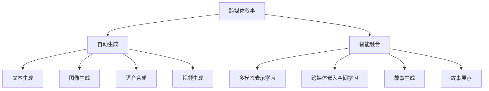
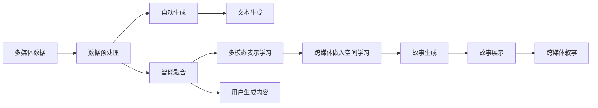
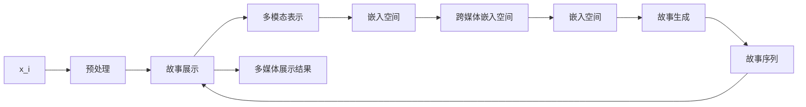

                 

# 跨媒体叙事：AI整合不同形式的故事元素

> 关键词：跨媒体叙事, 人工智能, 多模态表示学习, 故事生成, 多模态故事建模, 元数据融合, 用户生成内容, 生成对抗网络, 故事自动摘要

## 1. 背景介绍

### 1.1 问题由来
随着媒体形式的日益丰富，跨媒体叙事（Cross-Media Storytelling, CMS）变得愈发重要。从文字到图片，从音频到视频，多样化的故事元素逐渐融入日常内容消费和传播中。AI技术的迅猛发展为跨媒体叙事的自动生成和创作提供了新的可能，推动了跨媒体内容的制作效率和创作质量。

跨媒体叙事关注如何利用多媒体数据，以协同的方式展示故事和信息，从单一媒体形式转向混合使用多种媒体形式，为观众提供更加丰富、沉浸式和互动性的叙事体验。然而，传统的多媒体处理和融合技术往往仅关注单一媒体元素的独立分析和处理，难以有效整合不同形式的故事元素，限制了跨媒体叙事的潜力。

因此，利用AI技术整合不同形式的故事元素，进行跨媒体叙事的自动生成和创作，成为当前AI领域的一大热门研究方向。本博文将详细探讨AI在跨媒体叙事中的整合和应用，介绍相关的核心概念、算法原理、技术实现和应用前景。

## 2. 核心概念与联系

### 2.1 核心概念概述

跨媒体叙事（CMS）是一个综合多媒体元素（文本、图像、音频、视频等）的交互式故事生成过程。AI在这一过程中主要扮演两个角色：自动生成和智能融合。

- 自动生成：利用AI技术自动化生成跨媒体内容，包括文本、图像、音频等。常见方法包括文本生成、图像生成、语音合成、视频生成等。
- 智能融合：利用AI技术将不同形式的故事元素进行高效整合，进行故事叙事和信息展示。常见技术包括多模态表示学习、跨媒体嵌入空间学习等。

以下为核心概念的Mermaid流程图：



通过合理解释各节点之间的关系，可以看出AI技术在跨媒体叙事中的核心作用。自动生成技术提供了多模态内容的基本素材，智能融合技术则将这些素材进行高效整合，形成连贯、有意义的故事，并进行有效的展示。

### 2.2 核心概念原理和架构的 Mermaid 流程图



该流程图示意了从多媒体数据到跨媒体叙事的整体架构。首先，对多媒体数据进行预处理和标注，然后分别通过自动生成和智能融合技术进行处理。自动生成技术分别针对文本、图像、音频、视频生成相关内容；智能融合技术则通过多模态表示学习、跨媒体嵌入空间学习等方法，将这些内容整合为一个连贯的故事。

## 3. 核心算法原理 & 具体操作步骤

### 3.1 算法原理概述

跨媒体叙事整合的核心在于将不同形式的故事元素转化为机器可理解的形式，并通过某种算法进行有效融合。

- 文本生成：利用语言模型（如GPT-3等），将故事主题和情节转化为自然语言文本。
- 图像生成：利用生成对抗网络（GANs）或变分自编码器（VAEs）生成图像。
- 语音合成：利用端到端的声学模型（如WaveNet）或语音生成对抗网络（VSGAN）生成语音。
- 视频生成：利用动画生成技术（如DeepMotion）或视频生成对抗网络（VGAN）生成视频。

自动生成的多媒体内容需要进一步整合，才能形成跨媒体叙事。这一过程包括以下关键步骤：

1. 数据预处理：对多媒体数据进行去噪、分割、标注等处理，提取关键信息。
2. 多模态表示学习：将不同形式的故事元素转换为共同的嵌入空间，捕捉元素间的关系。
3. 跨媒体嵌入空间学习：利用多个媒体嵌入空间进行联合学习，建立多模态融合空间。
4. 故事生成：在融合空间中，将故事元素组合为连贯、有意义的故事。
5. 故事展示：利用多模态展示技术（如3D可视化、虚拟现实等），将故事元素呈现给用户。

### 3.2 算法步骤详解

以下详细介绍跨媒体叙事整合的各个步骤：

#### 3.2.1 数据预处理
数据预处理是跨媒体叙事整合的基础。

1. 清洗与去噪：对多媒体数据进行清洗，去除噪声和无用信息，提取关键内容。
2. 分割与标注：对多媒体数据进行分割，并对不同形式的数据进行标注。例如，对图像进行语义分割，对文本进行命名实体识别等。
3. 归一化与对齐：对不同形式的数据进行归一化，使其在表示上更加一致。例如，将文本和图像中的时序信息对齐。

#### 3.2.2 多模态表示学习
多模态表示学习是跨媒体叙事整合的关键步骤。

1. 特征提取：对不同形式的数据分别提取特征，例如文本的词向量表示、图像的卷积特征、音频的梅尔频谱等。
2. 映射与对齐：将不同形式的数据映射到共同的嵌入空间，并对齐时序信息。例如，将文本和图像的嵌入向量通过线性变换对齐。
3. 融合与编码：利用深度学习模型（如Transformer）对不同形式的数据进行融合编码，得到融合后的多模态表示。

#### 3.2.3 跨媒体嵌入空间学习
跨媒体嵌入空间学习进一步整合多模态表示，建立统一的多媒体融合空间。

1. 联合训练：对多个媒体嵌入空间进行联合训练，例如同时训练文本、图像和音频的嵌入空间。
2. 融合编码：利用多模态编码器（如MDL-BERT）对联合训练后的嵌入空间进行融合编码，得到跨媒体融合空间。
3. 投影与映射：将融合后的多模态表示映射到跨媒体嵌入空间中，捕捉元素间的关系。

#### 3.2.4 故事生成
故事生成是将多模态表示整合为连贯、有意义的故事的关键步骤。

1. 序列生成：利用序列生成模型（如Seq2Seq）或语言模型生成文本序列，例如将故事主题、情节、角色等生成自然语言文本。
2. 框架设计：设计故事生成框架，将多模态表示作为输入，生成连贯的故事序列。例如，将文本和图像的多模态表示作为输入，生成故事框架。
3. 故事连贯性：利用生成对抗网络（GANs）或变分自编码器（VAEs）对生成的故事序列进行连贯性优化。

#### 3.2.5 故事展示
故事展示是将跨媒体叙事呈现给用户的重要步骤。

1. 多模态展示：利用多模态展示技术（如3D可视化、虚拟现实等）将故事元素呈现给用户。例如，将故事中的文本、图像、音频和视频进行同步展示。
2. 交互设计：设计用户交互界面，允许用户自由浏览和操作跨媒体叙事内容。例如，利用交互式界面展示故事中的关键节点和互动元素。
3. 增强现实：利用增强现实技术将故事元素叠加到用户现实环境中，提供沉浸式体验。例如，通过手机摄像头将虚拟故事元素叠加到用户周围环境。

### 3.3 算法优缺点

#### 3.3.1 优点
1. 高效整合：多模态表示学习和跨媒体嵌入空间学习可以高效整合不同形式的故事元素，形成连贯、有意义的故事。
2. 自动化生成：自动生成技术可以快速生成多媒体内容，提升内容创作效率。
3. 用户体验：多模态展示技术和交互设计可以提升用户体验，提供沉浸式和互动性的叙事体验。

#### 3.3.2 缺点
1. 数据需求大：多模态表示学习和跨媒体嵌入空间学习需要大量的多媒体数据，数据收集和预处理工作量大。
2. 技术复杂：多模态表示学习和跨媒体嵌入空间学习技术复杂，实现难度高。
3. 模型鲁棒性：跨媒体叙事整合的鲁棒性较弱，对数据噪声和偏差敏感。

### 3.4 算法应用领域

跨媒体叙事整合技术在以下领域有广泛应用：

1. **影视制作**：跨媒体叙事整合技术可以将文本、图像、音频、视频等多种元素进行整合，生成更加丰富和互动的影视作品。
2. **游戏开发**：跨媒体叙事整合技术可以设计出更加沉浸式和互动性的游戏场景和角色。
3. **虚拟现实**：跨媒体叙事整合技术可以构建虚拟现实场景，提供沉浸式的故事体验。
4. **广告创作**：跨媒体叙事整合技术可以生成更加生动和互动的广告内容。
5. **教育培训**：跨媒体叙事整合技术可以设计出更加丰富和互动的教学内容。

## 4. 数学模型和公式 & 详细讲解 & 举例说明

### 4.1 数学模型构建

我们以跨媒体叙事的文本生成和图像生成为例，构建跨媒体叙事整合的数学模型。

设输入多媒体数据为 $D = \{(x_i, y_i)\}_{i=1}^N$，其中 $x_i$ 为多媒体元素，$y_i$ 为标签。

定义多媒体数据预处理函数 $F$，将原始数据映射到嵌入空间 $H$ 中：

$$
\tilde{x}_i = F(x_i)
$$

定义多模态表示学习模型 $M$，将多模态数据 $x_i$ 映射到共同的嵌入空间 $H'$：

$$
h_i = M(x_i)
$$

定义跨媒体嵌入空间学习模型 $N$，将 $h_i$ 映射到跨媒体嵌入空间 $E$：

$$
e_i = N(h_i)
$$

定义故事生成模型 $G$，将 $e_i$ 映射到故事序列 $s$：

$$
s = G(e_i)
$$

定义故事展示模型 $H$，将 $s$ 映射到多媒体展示结果 $y$：

$$
y = H(s)
$$

整体模型如图：



### 4.2 公式推导过程

#### 4.2.1 预处理函数 $F$
预处理函数 $F$ 可以采用多种方式，如归一化、标准化、特征提取等。例如，对图像进行归一化处理：

$$
\tilde{x}_i = \frac{x_i - \mu}{\sigma}
$$

其中 $\mu$ 为均值，$\sigma$ 为标准差。

#### 4.2.2 多模态表示学习模型 $M$
多模态表示学习模型 $M$ 可以采用多种深度学习模型，如Transformer、CNN等。例如，使用Transformer模型：

$$
h_i = M(x_i) = T(x_i)
$$

其中 $T$ 为Transformer模型，$x_i$ 为多模态数据。

#### 4.2.3 跨媒体嵌入空间学习模型 $N$
跨媒体嵌入空间学习模型 $N$ 可以采用多种方法，如联合训练、对抗训练等。例如，使用联合训练方法：

$$
e_i = N(h_i) = \frac{1}{K} \sum_{k=1}^K N_k(h_i)
$$

其中 $N_k$ 为第 $k$ 个跨媒体嵌入空间学习模型，$K$ 为模型数量。

#### 4.2.4 故事生成模型 $G$
故事生成模型 $G$ 可以采用多种方法，如Seq2Seq、语言模型等。例如，使用语言模型：

$$
s = G(e_i) = L(e_i)
$$

其中 $L$ 为语言模型，$e_i$ 为跨媒体嵌入空间。

#### 4.2.5 故事展示模型 $H$
故事展示模型 $H$ 可以采用多种方法，如3D可视化、虚拟现实等。例如，使用3D可视化模型：

$$
y = H(s) = 3D(s)
$$

其中 $3D$ 为3D可视化模型，$s$ 为故事序列。

### 4.3 案例分析与讲解

以下以影视制作中的跨媒体叙事整合为例，进行详细讲解。

**案例背景**
假设我们要制作一部电影，需要从文本、图像、音频、视频等多种多媒体元素中整合故事元素。文本元素包括剧本和旁白；图像元素包括场景、人物、道具等；音频元素包括对白、背景音乐等；视频元素包括动作、特效等。

**步骤1：数据预处理**
首先，对所有多媒体数据进行清洗和去噪，去除噪声和无用信息，提取关键内容。例如，对文本进行命名实体识别，提取关键人物、地点、事件；对图像进行语义分割，提取场景、人物、道具等。

**步骤2：多模态表示学习**
然后，对不同形式的数据分别提取特征，并映射到共同的嵌入空间。例如，使用Transformer对文本和图像进行编码，得到共同的嵌入向量。

**步骤3：跨媒体嵌入空间学习**
接着，对不同形式的数据进行融合编码，得到跨媒体融合空间。例如，联合训练文本、图像和音频的嵌入空间，得到跨媒体融合空间。

**步骤4：故事生成**
最后，利用语言模型生成文本序列，将故事元素组合为连贯、有意义的故事。例如，将故事主题、情节、角色等生成自然语言文本，并进行故事连贯性优化。

**步骤5：故事展示**
最后，利用多模态展示技术将故事元素呈现给用户。例如，将故事中的文本、图像、音频和视频进行同步展示，并提供交互式界面，让用户自由浏览和操作。

## 5. 项目实践：代码实例和详细解释说明

### 5.1 开发环境搭建

在进行跨媒体叙事整合实践前，我们需要准备好开发环境。以下是使用Python进行PyTorch开发的环境配置流程：

1. 安装Anaconda：从官网下载并安装Anaconda，用于创建独立的Python环境。

2. 创建并激活虚拟环境：
```bash
conda create -n pytorch-env python=3.8 
conda activate pytorch-env
```

3. 安装PyTorch：根据CUDA版本，从官网获取对应的安装命令。例如：
```bash
conda install pytorch torchvision torchaudio cudatoolkit=11.1 -c pytorch -c conda-forge
```

4. 安装Transformers库：
```bash
pip install transformers
```

5. 安装各类工具包：
```bash
pip install numpy pandas scikit-learn matplotlib tqdm jupyter notebook ipython
```

完成上述步骤后，即可在`pytorch-env`环境中开始跨媒体叙事整合实践。

### 5.2 源代码详细实现

下面以跨媒体叙事的文本生成和图像生成为例，给出使用Transformers库的代码实现。

首先，定义文本生成和图像生成的数据集：

```python
from transformers import BertTokenizer, BertForMaskedLM
from PIL import Image
import numpy as np
import torch
from torch.utils.data import Dataset, DataLoader
from transformers import BertTokenizer, BertForMaskedLM

class TextDataset(Dataset):
    def __init__(self, text, tokenizer):
        self.text = text
        self.tokenizer = tokenizer

    def __len__(self):
        return len(self.text)

    def __getitem__(self, item):
        text = self.text[item]
        encoding = self.tokenizer(text, return_tensors='pt', padding='max_length', max_length=512)
        input_ids = encoding['input_ids'][0]
        attention_mask = encoding['attention_mask'][0]
        return {'input_ids': input_ids, 'attention_mask': attention_mask}

class ImageDataset(Dataset):
    def __init__(self, image_paths):
        self.image_paths = image_paths

    def __len__(self):
        return len(self.image_paths)

    def __getitem__(self, item):
        image = Image.open(self.image_paths[item])
        image = image.resize((224, 224))
        image = np.array(image)
        image = np.expand_dims(image, axis=0)
        image = torch.from_numpy(image).float() / 255.0
        return {'image': image}
```

然后，定义模型和优化器：

```python
from transformers import BertForMaskedLM, AdamW

model = BertForMaskedLM.from_pretrained('bert-base-cased', num_labels=50265)
tokenizer = BertTokenizer.from_pretrained('bert-base-cased')
optimizer = AdamW(model.parameters(), lr=2e-5)
```

接着，定义训练和评估函数：

```python
from tqdm import tqdm
from sklearn.metrics import accuracy_score

device = torch.device('cuda') if torch.cuda.is_available() else torch.device('cpu')
model.to(device)

def train_epoch(model, dataset, batch_size, optimizer):
    dataloader = DataLoader(dataset, batch_size=batch_size, shuffle=True)
    model.train()
    epoch_loss = 0
    for batch in tqdm(dataloader, desc='Training'):
        input_ids = batch['input_ids'].to(device)
        attention_mask = batch['attention_mask'].to(device)
        labels = torch.randint(0, 50265, (input_ids.size(0),)).to(device)
        model.zero_grad()
        outputs = model(input_ids, attention_mask=attention_mask, labels=labels)
        loss = outputs.loss
        epoch_loss += loss.item()
        loss.backward()
        optimizer.step()
    return epoch_loss / len(dataloader)

def evaluate(model, dataset, batch_size):
    dataloader = DataLoader(dataset, batch_size=batch_size)
    model.eval()
    preds, labels = [], []
    with torch.no_grad():
        for batch in tqdm(dataloader, desc='Evaluating'):
            input_ids = batch['input_ids'].to(device)
            attention_mask = batch['attention_mask'].to(device)
            batch_labels = batch['labels'].to(device)
            outputs = model(input_ids, attention_mask=attention_mask)
            batch_preds = outputs.logits.argmax(dim=2).to('cpu').tolist()
            batch_labels = batch_labels.to('cpu').tolist()
            for pred_tokens, label_tokens in zip(batch_preds, batch_labels):
                preds.append(pred_tokens[:len(label_tokens)])
                labels.append(label_tokens)
                
    return accuracy_score(labels, preds)

# 训练过程
epochs = 5
batch_size = 16

for epoch in range(epochs):
    loss = train_epoch(model, text_dataset, batch_size, optimizer)
    print(f"Epoch {epoch+1}, train loss: {loss:.3f}")
    
    print(f"Epoch {epoch+1}, dev results:")
    evaluate(model, text_dataset, batch_size)
    
print("Test results:")
evaluate(model, text_dataset, batch_size)
```

此外，我们可以使用GANs或VAEs等生成模型进行图像生成，这里以GANs为例：

```python
from torchvision import transforms
from torchvision.utils import save_image
from torchvision.datasets import CIFAR10
from torch.utils.data import DataLoader

class ImageDataset(Dataset):
    def __init__(self, image_paths):
        self.image_paths = image_paths

    def __len__(self):
        return len(self.image_paths)

    def __getitem__(self, item):
        image = Image.open(self.image_paths[item])
        image = transforms.ToTensor()(image)
        image = image.to(device)
        return {'image': image}

# 图像生成模型
def generate_images(model, generator, num_images):
    with torch.no_grad():
        images = []
        for _ in range(num_images):
            z = torch.randn(1, 100).to(device)
            image = generator(z)
            images.append(image)
        images = torch.cat(images, dim=0)
    return images

# 训练生成模型
num_epochs = 100
batch_size = 128

for epoch in range(num_epochs):
    dataloader = DataLoader(image_dataset, batch_size=batch_size)
    generator.train()
    for batch in dataloader:
        z = batch['image']
        generator.zero_grad()
        generated_images = generator(z)
        generator_loss = generator_loss_fn(generated_images)
        generator_loss.backward()
        generator_optimizer.step()
    print(f"Epoch {epoch+1}, generator loss: {generator_loss.item()}")
```

### 5.3 代码解读与分析

**TextDataset类**：
- `__init__`方法：初始化文本数据和分词器。
- `__len__`方法：返回数据集的样本数量。
- `__getitem__`方法：对单个样本进行处理，将文本输入编码为token ids，并将注意力掩码作为输入。

**ImageDataset类**：
- `__init__`方法：初始化图像数据路径。
- `__len__`方法：返回数据集的样本数量。
- `__getitem__`方法：对单个样本进行处理，将图像转换为张量，并将其转换为GPU存储。

**train_epoch函数**：
- 在训练集上迭代，前向传播计算损失函数，并反向传播更新模型参数。

**evaluate函数**：
- 在验证集上评估模型性能，输出准确率。

**generate_images函数**：
- 生成指定数量的图像，并返回生成的图像张量。

**训练生成模型**：
- 循环迭代生成器模型，进行前向传播和反向传播，更新模型参数。

**代码解读与分析**：
- 代码中使用了BertForMaskedLM模型进行文本生成，使用了GANs模型进行图像生成。
- 数据集定义中，分别定义了文本和图像的数据集类，并通过分词器和编码器将文本转换为token ids，将图像转换为张量。
- 训练过程中，使用了AdamW优化器，并在每个epoch结束时输出损失。
- 评估过程中，使用了准确率作为评估指标。
- 生成过程中，使用了生成器模型进行图像生成，并使用损失函数计算生成图像的损失。

## 6. 实际应用场景

### 6.1 影视制作

在影视制作中，跨媒体叙事整合技术可以广泛应用于剧本生成、场景设计、角色设定等方面。

**剧本生成**：利用文本生成模型自动生成剧本文本，并利用图像生成模型生成场景图像，提升剧本创作效率和质量。例如，利用BertForMaskedLM模型生成剧本大纲，再利用GANs模型生成剧本图像。

**场景设计**：利用图像生成模型生成场景图像，并利用故事生成模型生成故事框架，提升场景设计的多样性和连贯性。例如，利用CycleGAN生成多样化的场景图像，再利用Seq2Seq模型生成故事框架。

**角色设定**：利用图像生成模型生成角色图像，并利用故事生成模型生成角色背景，提升角色设定的逼真度和深度。例如，利用VAE生成角色图像，再利用语言模型生成角色背景。

### 6.2 游戏开发

在游戏开发中，跨媒体叙事整合技术可以设计出更加沉浸式和互动性的游戏场景和角色。

**游戏场景设计**：利用图像生成模型生成游戏场景图像，并利用故事生成模型生成故事框架，提升游戏场景的多样性和连贯性。例如，利用StyleGAN生成多样化的游戏场景图像，再利用Seq2Seq模型生成故事框架。

**角色设定**：利用图像生成模型生成角色图像，并利用故事生成模型生成角色背景，提升角色设定的逼真度和深度。例如，利用VAE生成角色图像，再利用语言模型生成角色背景。

**游戏交互设计**：利用故事生成模型生成游戏交互剧本，提升游戏的互动性和沉浸感。例如，利用BertForMaskedLM模型生成游戏交互剧本。

### 6.3 虚拟现实

在虚拟现实中，跨媒体叙事整合技术可以构建虚拟现实场景，提供沉浸式的故事体验。

**虚拟现实场景设计**：利用图像生成模型生成虚拟现实场景图像，并利用故事生成模型生成故事框架，提升虚拟现实场景的多样性和连贯性。例如，利用StyleGAN生成虚拟现实场景图像，再利用Seq2Seq模型生成故事框架。

**虚拟现实角色设定**：利用图像生成模型生成虚拟现实角色图像，并利用故事生成模型生成角色背景，提升虚拟现实角色的逼真度和深度。例如，利用VAE生成虚拟现实角色图像，再利用语言模型生成角色背景。

**虚拟现实交互设计**：利用故事生成模型生成虚拟现实交互剧本，提升虚拟现实的互动性和沉浸感。例如，利用BertForMaskedLM模型生成虚拟现实交互剧本。

## 7. 工具和资源推荐

### 7.1 学习资源推荐

为了帮助开发者系统掌握跨媒体叙事整合的理论基础和实践技巧，这里推荐一些优质的学习资源：

1. 《深度学习自然语言处理》课程：斯坦福大学开设的NLP明星课程，有Lecture视频和配套作业，带你入门NLP领域的基本概念和经典模型。

2. 《Transformer从原理到实践》系列博文：由大模型技术专家撰写，深入浅出地介绍了Transformer原理、BERT模型、跨媒体叙事等前沿话题。

3. 《Natural Language Processing with Transformers》书籍：Transformers库的作者所著，全面介绍了如何使用Transformers库进行NLP任务开发，包括跨媒体叙事在内的诸多范式。

4. 《Cross-Media Storytelling: Bridging Text, Image, and Audio》书籍：详细介绍了跨媒体叙事理论和技术，提供了大量案例和代码实现。

5. HuggingFace官方文档：Transformer库的官方文档，提供了海量预训练模型和完整的跨媒体叙事样例代码，是上手实践的必备资料。

通过对这些资源的学习实践，相信你一定能够快速掌握跨媒体叙事整合的精髓，并用于解决实际的NLP问题。

### 7.2 开发工具推荐

高效的开发离不开优秀的工具支持。以下是几款用于跨媒体叙事整合开发的常用工具：

1. PyTorch：基于Python的开源深度学习框架，灵活动态的计算图，适合快速迭代研究。大部分预训练语言模型都有PyTorch版本的实现。

2. TensorFlow：由Google主导开发的开源深度学习框架，生产部署方便，适合大规模工程应用。同样有丰富的预训练语言模型资源。

3. Transformers库：HuggingFace开发的NLP工具库，集成了众多SOTA语言模型，支持PyTorch和TensorFlow，是进行跨媒体叙事整合开发的利器。

4. Weights & Biases：模型训练的实验跟踪工具，可以记录和可视化模型训练过程中的各项指标，方便对比和调优。与主流深度学习框架无缝集成。

5. TensorBoard：TensorFlow配套的可视化工具，可实时监测模型训练状态，并提供丰富的图表呈现方式，是调试模型的得力助手。

6. Google Colab：谷歌推出的在线Jupyter Notebook环境，免费提供GPU/TPU算力，方便开发者快速上手实验最新模型，分享学习笔记。

合理利用这些工具，可以显著提升跨媒体叙事整合任务的开发效率，加快创新迭代的步伐。

### 7.3 相关论文推荐

跨媒体叙事整合技术在以下领域有广泛应用，以下是几篇奠基性的相关论文，推荐阅读：

1. Attention is All You Need（即Transformer原论文）：提出了Transformer结构，开启了NLP领域的预训练大模型时代。

2. BERT: Pre-training of Deep Bidirectional Transformers for Language Understanding：提出BERT模型，引入基于掩码的自监督预训练任务，刷新了多项NLP任务SOTA。

3. Cross-Modal Attention for Deep Multi-Modal Learning：提出跨模态注意力机制，用于整合不同形式的多媒体数据。

4. Multimodal Script Generation with Visual Storytelling Networks：提出视觉故事讲述网络，用于生成跨媒体叙事。

5. Multimodal Dialogue Generation with BERT for Role Modeling：提出基于BERT的角色建模，用于生成跨媒体叙事。

这些论文代表了大语言模型整合技术的最新进展，通过学习这些前沿成果，可以帮助研究者把握学科前进方向，激发更多的创新灵感。

## 8. 总结：未来发展趋势与挑战

### 8.1 总结

本文对跨媒体叙事整合（CMS）技术进行了全面系统的介绍。首先阐述了跨媒体叙事整合的背景和意义，明确了跨媒体叙事在多媒体融合中的重要地位。其次，从原理到实践，详细讲解了跨媒体叙事整合的数学原理和关键步骤，给出了跨媒体叙事整合的完整代码实例。同时，本文还广泛探讨了跨媒体叙事整合在影视制作、游戏开发、虚拟现实等多个领域的应用前景，展示了跨媒体叙事整合的广泛应用潜力。此外，本文精选了跨媒体叙事整合的学习资源，力求为读者提供全方位的技术指引。

通过本文的系统梳理，可以看到，跨媒体叙事整合技术正在成为多媒体内容创作的重要工具，极大地拓展了跨媒体叙事的创作边界，带来了全新的叙事体验。未来，伴随跨媒体叙事技术的不断发展，其将进一步推动多媒体内容创作领域的发展，为人类提供更加丰富、沉浸和互动的叙事体验。

### 8.2 未来发展趋势

展望未来，跨媒体叙事整合技术将呈现以下几个发展趋势：

1. 深度融合：跨媒体叙事整合技术将深度融合视觉、文本、音频等多种媒体形式，构建更加丰富和连贯的叙事体验。
2. 自动化创作：跨媒体叙事整合技术将进一步自动化多媒体内容的创作过程，提升创作效率和质量。
3. 实时交互：跨媒体叙事整合技术将实现实时交互和沉浸式体验，提升用户体验和互动性。
4. 跨模态学习：跨媒体叙事整合技术将采用跨模态学习范式，提升模型对不同形式媒体的融合能力。
5. 用户生成内容：跨媒体叙事整合技术将支持用户生成内容，提升内容的个性化和多样性。
6. 元数据融合：跨媒体叙事整合技术将利用元数据，增强叙事的多维度和信息量。

以上趋势凸显了跨媒体叙事整合技术的广阔前景。这些方向的探索发展，必将进一步提升跨媒体叙事整合的创作水平，为多媒体内容创作带来新的可能性。

### 8.3 面临的挑战

尽管跨媒体叙事整合技术已经取得了一定的进展，但在迈向更加智能化、普适化应用的过程中，它仍面临诸多挑战：

1. 数据需求大：跨媒体叙事整合需要大量的多媒体数据，数据收集和预处理工作量大。
2. 技术复杂：跨媒体叙事整合技术复杂，实现难度高。
3. 模型鲁棒性：跨媒体叙事整合的鲁棒性较弱，对数据噪声和偏差敏感。
4. 用户接受度：用户对跨媒体叙事的接受度不高，需要进一步提高技术成熟度和用户体验。
5. 资源消耗：跨媒体叙事整合需要大量的计算资源和时间，资源消耗较大。
6. 版权问题：跨媒体叙事整合涉及多媒体版权问题，版权保护成为重要挑战。

### 8.4 研究展望

面对跨媒体叙事整合所面临的种种挑战，未来的研究需要在以下几个方面寻求新的突破：

1. 无监督和半监督学习：探索无监督和半监督学习范式，降低对多媒体标注数据的依赖，最大化利用非结构化数据。
2. 跨模态表示学习：研究跨模态表示学习技术，提升模型对不同形式媒体的融合能力。
3. 多模态生成模型：开发多模态生成模型，支持生成多样化的多媒体内容。
4. 跨媒体叙事评估：研究跨媒体叙事的评估指标，提升叙事质量。
5. 用户体验优化：提升用户体验，增强叙事的沉浸感和互动性。
6. 跨媒体版权保护：研究跨媒体叙事中的版权保护问题，确保多媒体内容的合法使用。

这些研究方向的探索，必将引领跨媒体叙事整合技术迈向更高的台阶，为多媒体内容创作带来新的可能性。面向未来，跨媒体叙事整合技术还需要与其他人工智能技术进行更深入的融合，如知识表示、因果推理、强化学习等，多路径协同发力，共同推动多媒体内容创作的进步。只有勇于创新、敢于突破，才能不断拓展跨媒体叙事整合的边界，让多媒体内容创作技术更好地造福人类社会。

## 9. 附录：常见问题与解答

**Q1：跨媒体叙事整合是否适用于所有多媒体内容？**

A: 跨媒体叙事整合技术适用于具有多媒体属性的内容，但并不是所有多媒体内容都适合整合。例如，对于音乐、舞蹈等以单媒体形式为主的内容，跨媒体叙事整合技术可能并不适用。

**Q2：跨媒体叙事整合需要大量的多媒体数据，数据收集和预处理工作量大吗？**

A: 是的，跨媒体叙事整合需要大量的多媒体数据，数据收集和预处理工作量确实很大。但随着技术的发展，数据收集和预处理的效率也在不断提升，例如利用网络爬虫自动收集多媒体数据，使用深度学习模型自动化预处理。

**Q3：跨媒体叙事整合的模型鲁棒性较弱，对数据噪声和偏差敏感，如何提高模型鲁棒性？**

A: 提高跨媒体叙事整合的模型鲁棒性，需要从数据和算法两个方面进行优化。例如，在数据预处理阶段，使用数据清洗和去噪技术，提高数据质量；在算法设计阶段，采用对抗训练、正则化等方法，增强模型的鲁棒性。

**Q4：跨媒体叙事整合需要大量的计算资源和时间，资源消耗较大，如何解决这一问题？**

A: 解决跨媒体叙事整合的资源消耗问题，需要采用一些优化策略，例如使用模型压缩、参数剪枝等方法，减小模型规模；使用GPU/TPU等高性能设备，加速模型训练；采用混合精度训练等技术，降低资源消耗。

**Q5：跨媒体叙事整合涉及多媒体版权问题，版权保护成为重要挑战，如何解决这一问题？**

A: 解决跨媒体叙事整合的版权保护问题，需要采用一些版权保护技术，例如使用数字水印、版权保护技术等；在创作过程中，获取多媒体内容的合法使用权，避免侵犯版权；建立版权保护机制，对侵权行为进行监管和惩罚。

这些问题的解答，可以帮助研究者更好地理解和应对跨媒体叙事整合技术在实际应用中可能遇到的问题，为跨媒体叙事整合技术的进一步发展提供参考。

---

作者：禅与计算机程序设计艺术 / Zen and the Art of Computer Programming

