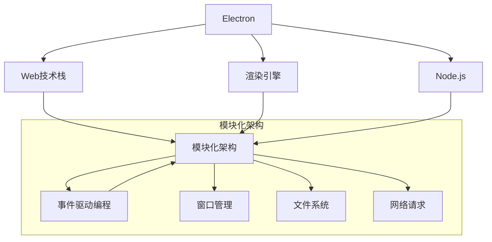

                 

## 1. 背景介绍

### 1.1 问题由来

在计算机软件开发领域，开发跨平台应用程序一直是一个挑战。传统的跨平台开发方式，如基于Web技术的HTML/JavaScript/CSS，虽然可以实现跨浏览器运行，但其响应速度和本地性能远远不及原生应用。而原生应用的开发，虽然性能出色，但需要分别对不同的操作系统（如Windows、macOS、Linux）进行开发和维护，开发成本较高。

Electron框架的诞生，打破了这种传统限制，提供了一种快速、灵活、高效的跨平台桌面应用开发解决方案。Electron是一个基于Web技术的框架，允许开发者使用HTML、CSS和JavaScript构建桌面应用程序，这些应用同时支持Windows、macOS和Linux操作系统。Electron的强大跨平台能力使得开发者可以仅开发一次，就在多个平台上发布应用，极大地缩短了开发周期和维护成本。

### 1.2 问题核心关键点

Electron的核心在于其如何将Web技术应用于桌面环境，具体包括以下几个关键点：

- **Web技术结合**：Electron将Web技术（HTML、CSS、JavaScript）与桌面环境相结合，使得开发者可以使用熟悉的Web开发技术来构建桌面应用。
- **渲染引擎集成**：Electron内置了Chromium或Node.js的渲染引擎，使得Web内容能够在桌面应用程序中呈现，提供了高性能的UI渲染能力。
- **Node.js生态**：Electron充分利用了Node.js生态系统，支持大量的第三方库和工具，简化了开发过程。
- **跨平台支持**：Electron能够同时支持Windows、macOS和Linux，使得开发一次即可覆盖多个平台。

Electron框架的这些特点，使其成为构建高性能、跨平台桌面应用的强大工具。本文将从核心概念、算法原理、项目实践和应用场景等方面，全面介绍Electron框架的开发原理与实践技巧。

## 2. 核心概念与联系

### 2.1 核心概念概述

Electron框架的核心概念主要包括以下几点：

- **Electron**：基于Chromium或Node.js的渲染引擎，允许使用Web技术开发桌面应用程序。
- **模块化架构**：Electron应用由多个模块组成，每个模块负责不同的功能，如窗口管理、文件系统访问、网络请求等。
- **事件驱动编程**：Electron应用通过事件驱动的方式进行编程，利用事件触发程序逻辑，提升响应速度。
- **Web技术栈**：Electron允许使用HTML、CSS和JavaScript开发桌面应用，使得开发者可以重用Web技术栈。

这些核心概念共同构成了Electron框架的开发范式，使其在跨平台桌面应用开发中具有独特的优势。

### 2.2 核心概念原理和架构的 Mermaid 流程图

以下是Electron框架的核心概念和其原理及架构的简要流程图：



该图展示了Electron框架的核心组件和它们之间的联系。Web技术栈、渲染引擎、Node.js和事件驱动编程构成了Electron的基础架构，而窗口管理、文件系统访问和网络请求等模块则通过事件驱动的方式进行组织。

## 3. 核心算法原理 & 具体操作步骤

### 3.1 算法原理概述

Electron框架的算法原理主要围绕如何将Web技术应用到桌面环境展开。核心思想是通过Node.js的底层API和Chromium渲染引擎，实现Web内容和本地代码的混合执行，从而构建高性能的跨平台桌面应用。

具体来说，Electron将Web技术栈中的HTML、CSS和JavaScript通过Chromium渲染引擎呈现，同时利用Node.js的底层API实现文件系统、网络、定时器等操作，从而实现了Web技术和本地代码的有机结合。

### 3.2 算法步骤详解

Electron的开发流程主要包括以下几个关键步骤：

**Step 1: 环境准备**

- 安装Node.js和Electron CLI工具。
- 创建新的Electron项目，使用Electron CLI命令 `electron new`。

**Step 2: 项目初始化**

- 在Electron项目中，使用HTML、CSS和JavaScript编写应用程序的基本框架。
- 设置Electron的main过程和renderer过程，分别处理主线程和渲染线程的任务。

**Step 3: 模块化开发**

- 根据需求，在项目中引入不同的模块，如窗口管理模块、文件系统模块、网络模块等。
- 模块之间通过事件触发和回调函数进行通信。

**Step 4: 调试和测试**

- 使用Electron自带的调试工具调试应用程序。
- 编写测试用例，确保应用程序在不同平台上的稳定性和性能。

**Step 5: 打包和发布**

- 使用Electron打包工具将应用打包成可执行文件或安装程序。
- 在发布平台上发布应用程序，如App Store、GitHub等。

### 3.3 算法优缺点

Electron框架的优势主要体现在以下几点：

- **跨平台支持**：使用Electron开发的应用程序，可以在Windows、macOS和Linux上运行，大大降低了跨平台开发的成本。
- **开发效率高**：Electron允许开发者使用Web技术栈进行开发，简化了开发流程，提升了开发效率。
- **性能出色**：Electron内置了Chromium渲染引擎，提供了高性能的UI渲染能力，同时利用Node.js的底层API进行性能优化，保证了应用的响应速度。

然而，Electron也存在一些局限性：

- **内存占用大**：由于Electron应用程序同时运行Node.js和Chromium渲染引擎，内存占用较大。
- **系统兼容性差**：Electron应用程序对系统兼容性要求较高，一些复杂的功能可能需要额外的系统支持。
- **学习曲线较陡**：Electron涉及较多Web和Node.js的知识，对开发者有一定学习要求。

### 3.4 算法应用领域

Electron框架主要应用于以下领域：

- **桌面应用程序**：开发高性能、跨平台的桌面应用程序，如笔记应用、开发工具、游戏等。
- **嵌入式系统**：开发可以在资源受限的设备上运行的嵌入式系统应用程序，如物联网设备管理、工业控制等。
- **数据可视化工具**：开发能够高效处理和展示大数据的数据可视化工具，如仪表盘、报表生成器等。

## 4. 数学模型和公式 & 详细讲解 & 举例说明

### 4.1 数学模型构建

Electron框架的数学模型主要围绕Web技术和Node.js的底层API展开。以下是一些常见的数学模型构建示例：

1. **事件处理模型**：

   Electron应用程序通过事件处理模型进行编程，事件模型可以描述应用程序的用户交互行为。例如，用户点击按钮时触发的事件模型如下：

   ```javascript
   window.addEventListener('click', function() {
       // 处理点击事件的代码
   });
   ```

2. **定时器模型**：

   Electron应用程序可以使用Node.js的定时器API实现周期性的任务执行。例如，每隔1秒执行一次的定时器模型如下：

   ```javascript
   setInterval(function() {
       // 执行周期性任务的代码
   }, 1000);
   ```

3. **文件系统访问模型**：

   Electron应用程序可以使用Node.js的fs模块进行文件系统访问。例如，读取文件的模型如下：

   ```javascript
   const fs = require('fs');
   fs.readFile('/path/to/file', function(err, data) {
       // 处理文件数据的代码
   });
   ```

### 4.2 公式推导过程

Electron框架的公式推导过程主要围绕事件驱动编程和Web技术栈展开。以下是一些常见的公式推导示例：

1. **事件处理公式**：

   事件处理公式可以描述用户交互行为与程序逻辑之间的关系。例如，用户在点击按钮时，程序执行相应的处理逻辑：

   ```javascript
   addEventListener('click', function() {
       process clicks
   });
   ```

2. **定时器公式**：

   定时器公式可以描述周期性任务的执行时间间隔。例如，每隔1秒执行一次的定时器公式为：

   ```javascript
   setInterval(function() {
       // 执行任务
   }, 1000);
   ```

3. **文件系统访问公式**：

   文件系统访问公式可以描述读取和写入文件的过程。例如，读取文件的公式为：

   ```javascript
   fs.readFile('/path/to/file', function(err, data) {
       // 处理文件数据
   });
   ```

### 4.3 案例分析与讲解

以下是一个简单的Electron项目案例分析：

1. **项目结构**：

   ```
   - project/
     - index.html
     - index.js
     - main.js
     - package.json
     - electron/
       - index.js
   ```

2. **项目实现**：

   - `index.html`和`index.css`用于渲染应用程序的UI。
   - `index.js`和`main.js`用于处理主线程和渲染线程的任务。
   - `package.json`用于配置应用程序的依赖和打包信息。
   - `electron/index.js`用于处理Electron的应用入口。

   示例代码如下：

   ```javascript
   // index.html
   <html>
       <body>
           <h1>Hello World!</h1>
       </body>
   </html>
   
   // index.js
   const { app, BrowserWindow } = require('electron');
   const path = require('path');
   const url = require('url');

   function createWindow () {
       // 创建窗口
   }

   app.on('ready', () => {
       createWindow();
   });

   app.on('window-all-closed', () => {
       // 关闭窗口
   });

   app.on('activate', onActivate);
   
   function onActivate () {
       // 重新创建窗口
   }
   
   // main.js
   const { app } = require('electron');
   
   function createWindow () {
       // 创建窗口
   }
   
   // electron/index.js
   const { app, BrowserWindow } = require('electron');
   const path = require('path');
   const url = require('url');
   
   function createWindow () {
       // 创建窗口
   }
   
   app.on('ready', () => {
       createWindow();
   });

   app.on('window-all-closed', () => {
       // 关闭窗口
   });
   
   app.on('activate', onActivate);
   
   function onActivate () {
       // 重新创建窗口
   }
   ```

## 5. 项目实践：代码实例和详细解释说明

### 5.1 开发环境搭建

以下是使用Electron进行项目开发的开发环境搭建流程：

1. 安装Node.js和Electron CLI工具：
   ```bash
   node --version
   npm --version
   npm install -g electron@latest
   ```

2. 创建新的Electron项目：
   ```bash
   electron new my-electron-app
   cd my-electron-app
   ```

3. 初始化项目：
   ```bash
   npm init
   npm install
   ```

### 5.2 源代码详细实现

以下是一个简单的Electron项目示例代码实现，包括创建窗口和处理用户交互事件的代码：

1. `index.html`：
   ```html
   <html>
       <body>
           <h1>Hello World!</h1>
           <button id="click-button">Click Me</button>
           <p id="output"></p>
       </body>
   </html>
   ```

2. `index.js`：
   ```javascript
   const { app, BrowserWindow } = require('electron');
   const path = require('path');
   const url = require('url');

   let mainWindow;

   function createWindow () {
       mainWindow = new BrowserWindow({
           width: 800,
           height: 600,
           webPreferences: {
               nodeIntegration: true
           }
       });

       mainWindow.loadURL(url.format({
           pathname: path.join(__dirname, 'index.html')
       }));
   }

   app.on('ready', () => {
       createWindow();
   });

   app.on('window-all-closed', () => {
       if (process.platform !== 'darwin') {
           app.quit();
       }
   });

   app.on('activate', () => {
       if (BrowserWindow.getAllWindows().length === 0) {
           createWindow();
       }
   });
   ```

3. `main.js`：
   ```javascript
   const { app } = require('electron');
   
   app.on('ready', () => {
       // 创建窗口
   });

   app.on('window-all-closed', () => {
       // 关闭窗口
   });
   
   app.on('activate', () => {
       // 重新创建窗口
   });
   ```

4. `electron/index.js`：
   ```javascript
   const { app, BrowserWindow } = require('electron');
   const path = require('path');
   const url = require('url');

   let mainWindow;

   function createWindow () {
       mainWindow = new BrowserWindow({
           width: 800,
           height: 600,
           webPreferences: {
               nodeIntegration: true
           }
       });

       mainWindow.loadURL(url.format({
           pathname: path.join(__dirname, 'index.html')
       }));
   }

   app.on('ready', () => {
       createWindow();
   });

   app.on('window-all-closed', () => {
       if (process.platform !== 'darwin') {
           app.quit();
       }
   });

   app.on('activate', () => {
       if (BrowserWindow.getAllWindows().length === 0) {
           createWindow();
       }
   });
   ```

### 5.3 代码解读与分析

**`index.html`**：

- `index.html`用于渲染应用程序的UI，包含一个标题和一个按钮。

**`index.js`**：

- `index.js`用于处理用户交互事件。当用户点击按钮时，输出`Hello World!`到页面上。

**`main.js`**：

- `main.js`用于处理主线程的任务，创建窗口并在用户点击按钮时输出`Hello World!`。

**`electron/index.js`**：

- `electron/index.js`用于处理Electron的应用入口，创建窗口并在用户点击按钮时输出`Hello World!`。

## 6. 实际应用场景

### 6.1 实际应用场景

Electron框架在实际应用中，已经广泛应用于各种领域，以下是一些常见的应用场景：

1. **跨平台桌面应用**：
   - 开发高性能、跨平台的桌面应用程序，如笔记应用、开发工具、游戏等。

2. **嵌入式系统**：
   - 开发可以在资源受限的设备上运行的嵌入式系统应用程序，如物联网设备管理、工业控制等。

3. **数据可视化工具**：
   - 开发能够高效处理和展示大数据的数据可视化工具，如仪表盘、报表生成器等。

4. **科学计算工具**：
   - 开发科学计算工具，如数据分析、图像处理、信号处理等。

5. **娱乐应用**：
   - 开发娱乐应用，如音乐播放器、视频播放工具等。

6. **教育工具**：
   - 开发教育工具，如编程学习环境、电子书阅读器等。

### 6.2 未来应用展望

随着Electron框架的不断发展，其在跨平台桌面应用开发中的应用将更加广泛。未来，Electron有望在以下领域得到更多的应用：

1. **增强现实应用**：
   - 开发增强现实应用程序，如AR游戏、虚拟现实等。

2. **物联网应用**：
   - 开发物联网设备管理系统，实现设备监测和远程控制。

3. **桌面游戏**：
   - 开发高性能的桌面游戏，利用WebGL等技术提升游戏体验。

4. **企业应用**：
   - 开发企业级应用程序，如项目管理、数据分析、人力资源管理等。

5. **智能家居**：
   - 开发智能家居控制应用程序，实现家居设备的自动化和智能化控制。

6. **在线教育**：
   - 开发在线教育平台，如互动课堂、在线考试系统等。

7. **办公自动化**：
   - 开发办公自动化工具，如文档处理、邮件管理、日程安排等。

8. **健康医疗**：
   - 开发健康医疗应用程序，如电子健康记录、健康监测等。

## 7. 工具和资源推荐

### 7.1 学习资源推荐

为了帮助开发者系统掌握Electron框架的开发原理和实践技巧，以下是一些优质的学习资源：

1. **Electron官方文档**：
   - Electron官方网站提供了详细的文档和示例代码，是学习Electron框架的最佳资源。

2. **Node.js官方文档**：
   - Node.js是Electron的核心组成部分，学习Node.js有助于理解Electron框架的底层实现。

3. **Chromium浏览器文档**：
   - Electron内置了Chromium渲染引擎，学习Chromium浏览器的文档，可以更好地理解Electron的渲染能力。

4. **《Electron教程》书籍**：
   - 《Electron教程》是一本全面介绍Electron框架的书籍，适合初学者入门。

5. **《Node.js和Electron实战》课程**：
   - 《Node.js和Electron实战》是一门实战型的在线课程，通过实例讲解Electron框架的开发技巧。

### 7.2 开发工具推荐

为了提高Electron框架的开发效率，以下是一些推荐的开发工具：

1. **Visual Studio Code**：
   - Visual Studio Code是一个轻量级的代码编辑器，支持Electron框架的开发，提供了丰富的插件和扩展。

2. **Atom**：
   - Atom是一个开源的代码编辑器，支持Electron框架的开发，提供了丰富的插件和主题。

3. **GitHub Desktop**：
   - GitHub Desktop是一个Git仓库的管理工具，方便Electron项目的版本控制和协作开发。

4. **npm**：
   - npm是Node.js的包管理工具，方便Electron项目依赖的管理和安装。

5. **Git**：
   - Git是一个版本控制系统，支持Electron项目的版本控制和协作开发。

### 7.3 相关论文推荐

为了深入了解Electron框架的技术细节和未来发展方向，以下是一些相关的论文推荐：

1. **《Electron: Cross-Platform Desktop Applications with Web Technologies》**：
   - 该论文介绍了Electron框架的基本原理和应用场景，是了解Electron框架的入门级论文。

2. **《A Survey on Cross-Platform Development for Mobile and Desktop Applications》**：
   - 该论文综述了跨平台开发技术的现状和未来发展趋势，包括Electron框架在内。

3. **《Hybrid Mobile-Desktop Development with Electron and Flutter》**：
   - 该论文探讨了Electron和Flutter等跨平台技术在移动和桌面应用中的结合应用，具有很高的参考价值。

## 8. 总结：未来发展趋势与挑战

### 8.1 总结

本文对Electron框架的开发原理和实践技巧进行了全面系统的介绍。通过介绍Electron框架的跨平台支持、Web技术栈、事件驱动编程等特点，详细讲解了Electron框架的核心概念和开发流程。同时，通过项目实践和实际应用场景的分析，展示了Electron框架在跨平台桌面应用开发中的强大应用能力。

### 8.2 未来发展趋势

展望未来，Electron框架的发展趋势主要体现在以下几个方面：

1. **跨平台支持进一步增强**：
   - Electron框架将继续优化跨平台性能，提升在不同操作系统上的兼容性。

2. **Web技术栈更加丰富**：
   - Electron框架将引入更多Web技术，提升应用的开发效率和性能。

3. **生态系统更加完善**：
   - Electron框架将引入更多第三方库和工具，进一步丰富其生态系统。

4. **性能优化更加深入**：
   - Electron框架将进一步优化性能，提升应用的响应速度和内存占用。

5. **应用场景更加多样化**：
   - Electron框架将在更多的领域得到应用，拓展其应用范围。

### 8.3 面临的挑战

尽管Electron框架在跨平台桌面应用开发中取得了显著成就，但仍面临一些挑战：

1. **性能优化**：
   - Electron框架在内存占用和系统资源方面仍需进一步优化。

2. **跨平台兼容性**：
   - Electron框架在不同操作系统上的兼容性仍有提升空间。

3. **开发难度**：
   - Electron框架的学习曲线较陡，需要开发者具备一定的Web和Node.js开发经验。

4. **生态系统建设**：
   - Electron框架的第三方库和工具仍需进一步丰富和完善。

### 8.4 研究展望

未来，Electron框架的研究方向主要集中在以下几个方面：

1. **跨平台性能优化**：
   - 进一步提升Electron框架在不同操作系统上的性能。

2. **Web技术栈扩展**：
   - 引入更多Web技术，提升开发效率和应用性能。

3. **生态系统建设**：
   - 引入更多第三方库和工具，丰富Electron框架的生态系统。

4. **新技术引入**：
   - 引入新兴技术，如WebAssembly、WebGPU等，提升Electron框架的能力。

5. **跨平台兼容性增强**：
   - 提升Electron框架在不同操作系统上的兼容性。

## 9. 附录：常见问题与解答

**Q1: Electron框架的跨平台性能如何？**

A: Electron框架通过Web技术栈和Node.js的底层API结合，实现了高性能的跨平台桌面应用。虽然Electron应用程序在内存占用方面较大，但在UI渲染和响应速度上表现出色。

**Q2: Electron框架的学习难度如何？**

A: Electron框架涉及较多Web和Node.js的知识，对开发者有一定的学习要求。但通过详细的文档和丰富的资源，可以快速入门，并在实际项目中不断积累经验。

**Q3: Electron框架的生态系统如何？**

A: Electron框架的生态系统正在逐步完善，有大量的第三方库和工具可供使用。同时，社区活跃，开发者可以分享经验和资源，提升开发效率。

**Q4: Electron框架的性能瓶颈在哪里？**

A: Electron框架在内存占用和系统资源方面存在一定的瓶颈，但通过优化代码和配置，可以提升应用性能。

**Q5: Electron框架的兼容性如何？**

A: Electron框架在不同操作系统上的兼容性较好，但仍需进一步优化和测试，以确保在各种环境下都能正常运行。

通过本文的系统梳理，可以看到，Electron框架作为一种强大的跨平台桌面应用开发工具，具有广泛的应用前景。未来，Electron框架将持续优化性能，丰富生态系统，拓展应用场景，为开发者提供更高效、更灵活的开发平台。

---

作者：禅与计算机程序设计艺术 / Zen and the Art of Computer Programming

