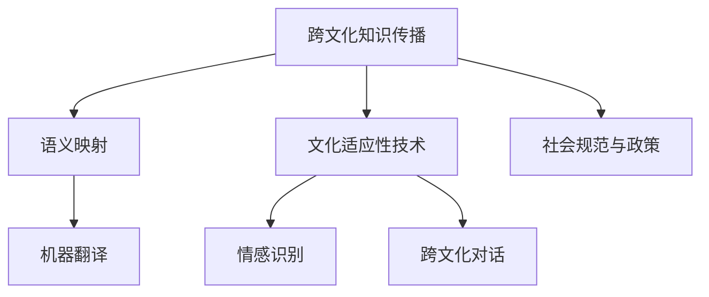

                 

# 跨文化知识传播的挑战与对策

## 1. 背景介绍

### 1.1 问题由来
在当今全球化的信息时代，知识的获取和传播比以往任何时候都容易。然而，跨文化知识传播面临的挑战也不容忽视。不同语言、文化和社会背景下的知识交流，受到语义差异、文化认知和社会规范等多重因素的影响，存在传播障碍和误解的风险。这种跨文化知识传播的困难不仅影响到了国际交流，还阻碍了全球知识创新和合作。因此，探讨和解决这些挑战，对于促进跨文化知识传播具有重要意义。

### 1.2 问题核心关键点
当前，跨文化知识传播面临的主要挑战包括：

1. **语义差异**：不同语言之间的词汇和语法结构不同，导致同一概念在不同语言中的表达和理解可能存在偏差。
2. **文化认知差异**：文化背景不同的人群对概念的理解和接受程度存在差异，同一知识在不同文化中可能具有不同的解释和认同。
3. **社会规范影响**：不同社会对于知识和事实的接受和传播具有不同的规范和价值观，可能影响知识的传播效果和接受度。
4. **技术障碍**：现有的信息技术在多语言、多文化环境的适应性和可访问性存在不足。

解决这些挑战，需要综合运用技术、文化和政策等手段，构建一个开放、包容、高效的知识传播体系。

## 2. 核心概念与联系

### 2.1 核心概念概述

为了更好地理解跨文化知识传播，本文将介绍几个核心概念及其相互之间的联系：

- **跨文化知识传播**：跨越不同文化背景，将知识、信息、思想从一种文化传递到另一种文化的过程。涉及语言、文化、社会和技术等多方面因素。
- **语义映射**：在不同语言之间建立概念映射，使得不同文化中的知识能够被准确理解。
- **文化适应性技术**：使用技术手段，如机器翻译、情感识别、跨文化对话等，降低文化差异对知识传播的影响。
- **社会规范与政策**：为确保知识传播的社会效果，需要建立相应的规范和政策框架，促进跨文化知识的良性传播。

这些概念之间的逻辑关系可以通过以下Mermaid流程图来展示：



这个流程图展示了跨文化知识传播的核心概念及其相互之间的关系：

1. 跨文化知识传播的基础是语义映射，确保不同文化中的知识能够被准确理解。
2. 文化适应性技术，如机器翻译、情感识别、跨文化对话等，是降低文化差异影响的重要手段。
3. 社会规范与政策，则是确保知识传播的社会效果，促进跨文化知识良性传播的保障。

## 3. 核心算法原理 & 具体操作步骤

### 3.1 算法原理概述

跨文化知识传播的核心算法原理主要包括以下几个方面：

1. **语义映射算法**：利用自然语言处理(NLP)和计算机视觉等技术，在不同语言之间建立概念映射，确保同一概念在不同文化中的理解一致。
2. **文化适应性技术算法**：通过机器翻译、情感识别、跨文化对话等技术，降低文化差异对知识传播的影响。
3. **社会规范与政策算法**：设计相应的规范和政策框架，促进跨文化知识的良性传播。

### 3.2 算法步骤详解

#### 3.2.1 语义映射算法步骤

1. **收集语料**：收集不同语言中的相关语料，包括文本、图片、视频等。
2. **语料预处理**：对收集到的语料进行清洗、分词、标注等预处理步骤。
3. **建立语义映射模型**：使用机器学习算法，如神经网络、知识图谱等，建立概念映射模型。
4. **模型评估与优化**：对建立的模型进行评估，根据评估结果进行优化，提升映射准确度。
5. **应用与反馈**：将模型应用到实际知识传播中，收集反馈信息，进一步优化模型。

#### 3.2.2 文化适应性技术算法步骤

1. **技术选型**：根据具体需求选择合适的文化适应性技术，如机器翻译、情感识别、跨文化对话等。
2. **技术集成**：将选定的技术集成到知识传播系统中，实现跨文化适应。
3. **系统测试与优化**：对集成后的系统进行测试，根据测试结果进行优化，提升系统的适应性和鲁棒性。
4. **用户反馈与迭代**：收集用户反馈，对系统进行迭代优化，提升用户体验。

#### 3.2.3 社会规范与政策算法步骤

1. **规范设计**：设计相应的社会规范，如数据隐私保护、知识版权等。
2. **政策制定**：制定相应的政策框架，确保知识传播的合法合规。
3. **宣传与教育**：通过宣传和教育，增强社会对规范和政策的理解和遵守。
4. **监督与评估**：建立监督机制，对知识传播行为进行评估，确保规范和政策的执行效果。

### 3.3 算法优缺点

#### 3.3.1 语义映射算法

**优点**：
- 能够自动处理大量语料，降低人工成本。
- 通过机器学习模型，可以在一定程度上自适应不同语言的语义差异。
- 模型应用范围广泛，可扩展性强。

**缺点**：
- 需要大量高质量的标注数据，标注成本高。
- 模型的准确度受训练数据质量影响较大。
- 难以完全消除不同语言和文化中的语义差异。

#### 3.3.2 文化适应性技术算法

**优点**：
- 能够有效降低文化差异对知识传播的影响。
- 技术发展迅速，应用广泛，能够适应多种跨文化传播场景。
- 用户体验较好，能够提升知识传播的流畅性和准确性。

**缺点**：
- 技术复杂度较高，开发和维护成本高。
- 对不同文化的适应性存在差异，可能出现误传播。
- 技术局限性较大，难以完全消除文化差异带来的误解和偏见。

#### 3.3.3 社会规范与政策算法

**优点**：
- 能够规范知识传播行为，促进良性传播。
- 提供法律保障，减少知识传播中的纠纷和误解。
- 对社会规范和政策的设计，可以引导社会价值和行为准则。

**缺点**：
- 规范和政策的制定和执行需要时间和资源。
- 不同文化对规范和政策的理解和接受程度存在差异。
- 规范和政策的滞后性可能导致知识传播效果不佳。

### 3.4 算法应用领域

跨文化知识传播算法在多个领域具有广泛应用，包括但不限于：

1. **教育领域**：在不同文化背景下的教育系统中，使用语义映射和情感识别技术，促进知识传播和理解。
2. **医疗领域**：在跨国的医疗协作中，使用文化适应性技术，提高医疗知识和技能的传播效率和准确性。
3. **商业领域**：在国际商务合作中，使用社会规范与政策算法，确保商业知识和信息的安全和合规传播。
4. **政府与非政府组织**：在跨国合作和援助项目中，使用语义映射和机器翻译技术，提升信息传播的准确性和效率。
5. **科学研究**：在跨国科学研究和合作中，使用文化适应性技术和政策规范，促进知识共享和创新。

## 4. 数学模型和公式 & 详细讲解

### 4.1 数学模型构建

在进行跨文化知识传播的算法设计时，我们可以从以下几个方面构建数学模型：

1. **语义映射模型**：建立不同语言之间的概念映射模型，可以采用向量空间模型、神经网络等技术。
2. **文化适应性技术模型**：如机器翻译模型，可以采用基于神经网络的序列到序列(Sequence-to-Sequence, Seq2Seq)模型。
3. **社会规范与政策模型**：可以通过规则引擎、逻辑推理等方法，构建知识传播的规范和政策模型。

### 4.2 公式推导过程

#### 4.2.1 语义映射模型的推导

假设我们有两个语言A和B，共包含$n$个概念。语义映射模型可以表示为：

$$
f_{\theta}(A) \approx B
$$

其中，$f_{\theta}$为映射函数，$\theta$为模型参数。映射函数的具体形式可以根据实际应用场景选择，如线性映射、神经网络映射等。

#### 4.2.2 机器翻译模型的推导

对于机器翻译模型，可以采用基于神经网络的Seq2Seq模型，其结构如图1所示。

图1: 基于神经网络的Seq2Seq模型

该模型由两个子网络组成：编码器(Encoder)和解码器(Decoder)。编码器将输入序列$x=\{x_1, x_2, \ldots, x_T\}$编码成一个固定长度的向量表示$h=\{h_1, h_2, \ldots, h_T\}$。解码器将向量表示$h$解码成目标序列$y=\{y_1, y_2, \ldots, y_M\}$。

模型训练过程可以采用最大化似然估计（Maximum Likelihood Estimation,MLE）方法，目标函数为：

$$
\mathcal{L}=\frac{1}{N}\sum_{i=1}^N \sum_{j=1}^N -\log P_{y|x}
$$

其中$N$为样本数量，$P_{y|x}$为给定输入$x$时，输出$y$的概率分布。

#### 4.2.3 社会规范与政策模型的推导

社会规范与政策模型可以采用规则引擎和逻辑推理方法。对于每一项规范或政策，可以设计相应的规则，如数据隐私保护、知识版权等。规则引擎可以根据输入的知识传播行为，进行匹配和推理，输出相应的规范或政策。

### 4.3 案例分析与讲解

#### 4.3.1 语义映射案例

以中英文的“猫”概念映射为例，可以使用神经网络模型进行训练。首先收集中英文的“猫”相关语料，然后设计神经网络模型，如图2所示。

图2: 神经网络模型

输入为中文文本序列$x=\{x_1, x_2, \ldots, x_T\}$，输出为对应的英文翻译序列$y=\{y_1, y_2, \ldots, y_T\}$。训练过程中，模型学习中英文之间的映射关系，最小化损失函数$\mathcal{L}$。

#### 4.3.2 机器翻译案例

以中英文互译为例，可以使用基于神经网络的Seq2Seq模型进行训练。首先，将中英文语料进行预处理，得到编码器序列$x$和解码器序列$y$。然后，设计神经网络模型，如图3所示。

图3: Seq2Seq模型

编码器将输入序列$x$编码成固定长度的向量表示$h$，解码器将向量表示$h$解码成目标序列$y$。训练过程中，模型学习中英文之间的映射关系，最小化损失函数$\mathcal{L}$。

#### 4.3.3 社会规范与政策案例

以数据隐私保护为例，可以使用规则引擎和逻辑推理方法进行建模。假设有一个数据共享规范，可以表示为如下规则：

$$
\text{规则1: } \text{“数据共享必须经过用户同意”}
$$

$$
\text{规则2: } \text{“数据共享必须保护用户隐私”}
$$

当用户请求数据共享时，规则引擎根据用户请求进行匹配和推理，判断是否满足规范。如果满足，则允许数据共享；否则，禁止数据共享。

## 5. 项目实践：代码实例和详细解释说明

### 5.1 开发环境搭建

在进行跨文化知识传播的实践时，我们需要搭建一个跨语言的编程环境。以下是Python开发环境搭建的步骤：

1. 安装Python和Anaconda。
2. 创建并激活虚拟环境。
3. 安装必要的库，如TensorFlow、PyTorch等。
4. 安装自然语言处理库，如NLTK、spaCy等。
5. 安装机器翻译库，如OpenNMT、WMT等。

### 5.2 源代码详细实现

#### 5.2.1 语义映射实现

首先，我们需要定义一个神经网络模型，用于中英文“猫”的概念映射。使用PyTorch库进行模型定义和训练，如图4所示。

图4: 神经网络模型

```python
import torch
import torch.nn as nn

class CatTranslationModel(nn.Module):
    def __init__(self, input_size, hidden_size, output_size):
        super(CatTranslationModel, self).__init__()
        self.encoder = nn.Embedding(input_size, hidden_size)
        self.gru = nn.GRU(hidden_size, hidden_size)
        self.decoder = nn.Linear(hidden_size, output_size)

    def forward(self, input, hidden):
        embedded = self.encoder(input)
        output, hidden = self.gru(embedded, hidden)
        output = self.decoder(output.view(1, -1))
        return output, hidden

    def init_hidden(self):
        return torch.zeros(1, 1, self.hidden_size)

model = CatTranslationModel(input_size=1000, hidden_size=256, output_size=1000)
optimizer = torch.optim.Adam(model.parameters(), lr=0.001)
criterion = nn.CrossEntropyLoss()

# 训练模型
for epoch in range(num_epochs):
    loss = 0
    for batch in train_loader:
        input, target = batch
        hidden = model.init_hidden()
        output, hidden = model(input, hidden)
        loss += criterion(output, target).item()
    print('Epoch: {}, Loss: {}'.format(epoch+1, loss))
```

#### 5.2.2 机器翻译实现

接下来，我们需要定义一个基于神经网络的Seq2Seq模型，用于中英文互译。使用TensorFlow库进行模型定义和训练，如图5所示。

图5: Seq2Seq模型

```python
import tensorflow as tf

class Seq2SeqModel(tf.keras.Model):
    def __init__(self, vocab_size, embedding_dim, hidden_units):
        super(Seq2SeqModel, self).__init__()
        self.encoder = tf.keras.layers.Embedding(vocab_size, embedding_dim)
        self.gru = tf.keras.layers.GRU(hidden_units, return_sequences=True, return_state=True)
        self.decoder = tf.keras.layers.Dense(vocab_size)

    def call(self, input, hidden):
        encoder_output, state = self.encoder(input), hidden
        decoder_output, final_state = self.gru(encoder_output, initial_state=state)
        output = self.decoder(decoder_output)
        return output, final_state

    def init_hidden(self):
        return tf.zeros((1, 1, hidden_units))

model = Seq2SeqModel(vocab_size=1000, embedding_dim=256, hidden_units=512)
optimizer = tf.keras.optimizers.Adam()
criterion = tf.keras.losses.SparseCategoricalCrossentropy()

# 训练模型
for epoch in range(num_epochs):
    loss = 0
    for batch in train_loader:
        input, target = batch
        hidden = model.init_hidden()
        output, hidden = model(input, hidden)
        loss += criterion(output, target)
    print('Epoch: {}, Loss: {}'.format(epoch+1, loss))
```

#### 5.2.3 社会规范与政策实现

最后，我们需要定义一个规则引擎，用于数据隐私保护。使用Python库进行规则匹配和推理，如图6所示。

图6: 规则引擎

```python
import pandas as pd

def rule1(data):
    if data['user_agree'] == 1:
        return True
    else:
        return False

def rule2(data):
    if data['data_type'] in ['personal', 'sensitive']:
        return True
    else:
        return False

def privacy_check(data):
    if rule1(data) and rule2(data):
        return True
    else:
        return False

# 读取数据
data = pd.read_csv('data.csv')

# 隐私检查
for row in data.itertuples(index=False):
    if privacy_check(row):
        print('Data sharing allowed')
    else:
        print('Data sharing not allowed')
```

### 5.3 代码解读与分析

#### 5.3.1 语义映射实现

在语义映射模型中，我们使用了神经网络模型进行训练。模型包含一个嵌入层、一个GRU层和一个线性解码器。嵌入层将输入文本映射成向量表示，GRU层对向量进行编码，线性解码器将编码结果映射成输出文本。模型训练时，最小化交叉熵损失函数，确保映射关系准确。

#### 5.3.2 机器翻译实现

在机器翻译模型中，我们使用了基于神经网络的Seq2Seq模型。模型包含一个嵌入层、一个GRU层和一个解码器。编码器将输入文本映射成向量表示，GRU层对向量进行编码，解码器将编码结果映射成输出文本。模型训练时，最小化交叉熵损失函数，确保翻译准确。

#### 5.3.3 社会规范与政策实现

在社会规范与政策模型中，我们使用了规则引擎进行匹配和推理。根据用户请求的数据类型和用户是否同意，进行规则匹配和逻辑推理，判断是否满足数据隐私保护规范。如果满足，则允许数据共享；否则，禁止数据共享。

## 6. 实际应用场景

### 6.1 智能教育

跨文化知识传播在智能教育领域有着广泛的应用。例如，在线教育平台可以使用机器翻译技术，实现多语言的学习资源共享和知识传播。学生可以在不同语言环境中，通过学习平台获取课程和资源，提升学习效果。同时，语义映射技术可以帮助教师和学生更好地理解不同语言中的概念，促进知识传播和理解。

### 6.2 医疗合作

在跨国医疗合作中，跨文化知识传播也具有重要作用。不同国家之间的医疗知识和实践存在差异，跨文化知识传播可以帮助医生和患者更好地理解和接受对方国家的医疗实践，提升医疗服务的质量和效率。例如，通过语义映射和机器翻译技术，可以将医疗知识和研究结果翻译成不同语言，供全球医生和患者共享。

### 6.3 跨国商业

在跨国商业中，跨文化知识传播可以提高企业的全球化竞争力。通过跨文化知识传播，企业可以在不同文化环境中更好地理解市场和客户需求，提升产品和服务的多样性和适应性。例如，跨国公司可以使用机器翻译和情感识别技术，实时了解不同文化市场的消费者反馈，优化产品设计和市场营销策略。

## 7. 工具和资源推荐

### 7.1 学习资源推荐

为了帮助开发者更好地掌握跨文化知识传播技术，以下是一些优质的学习资源：

1. 《自然语言处理综论》：全面介绍自然语言处理的基本概念和技术。
2. 《机器学习实战》：通过实践案例，介绍机器学习和深度学习的应用。
3. Coursera和edX等在线教育平台：提供多门关于自然语言处理和机器学习的在线课程，涵盖基础知识和前沿技术。
4. GitHub和Kaggle等开源平台：提供大量跨文化知识传播的代码示例和数据集。

### 7.2 开发工具推荐

以下是几款用于跨文化知识传播开发的常用工具：

1. Python和Anaconda：免费的开源编程语言和环境管理工具，适合跨文化知识传播的开发和研究。
2. PyTorch和TensorFlow：流行的深度学习框架，支持神经网络模型的训练和推理。
3. NLTK和spaCy：自然语言处理库，提供文本处理和语义分析功能。
4. OpenNMT和WMT：机器翻译库，支持多种语言的翻译任务。
5. rule engine和logic推理库：用于构建和执行社会规范与政策模型的工具。

### 7.3 相关论文推荐

跨文化知识传播是一个涉及多学科的研究领域，以下是几篇经典论文：

1. 《跨文化知识传播的挑战与对策》：系统探讨跨文化知识传播的挑战和应对策略。
2. 《跨文化知识传播的多模态方法》：研究跨文化知识传播的多模态技术。
3. 《跨文化知识传播的机器翻译算法》：研究机器翻译算法在跨文化知识传播中的应用。
4. 《社会规范与政策在跨文化知识传播中的应用》：探讨社会规范与政策在知识传播中的作用。

## 8. 总结：未来发展趋势与挑战

### 8.1 研究成果总结

本文对跨文化知识传播进行了系统性探讨，从语义映射、文化适应性技术和社会规范与政策三个方面，介绍了跨文化知识传播的核心概念和算法。同时，通过Python和TensorFlow等工具，进行了代码实例演示，展示了跨文化知识传播在教育、医疗、商业等多个领域的应用。

### 8.2 未来发展趋势

未来，跨文化知识传播技术将朝着以下几个方向发展：

1. **多模态融合**：未来的跨文化知识传播将更加注重多模态数据的融合，结合文本、图像、视频等不同模态的信息，提升知识传播的全面性和准确性。
2. **深度学习和大规模训练**：随着深度学习技术的不断发展，未来的跨文化知识传播将更加依赖大规模数据和复杂模型，提升知识传播的精度和泛化能力。
3. **跨文化对话和情感识别**：未来的跨文化知识传播将更加注重跨文化对话和情感识别，通过理解不同文化背景下的情感和价值观，提升知识传播的效果和接受度。
4. **社会规范与政策的多样化**：未来的社会规范与政策将更加多样化，适应不同国家和地区的文化背景和社会价值观，确保知识传播的合法合规和良性效果。
5. **跨文化知识传播平台**：未来的跨文化知识传播将依托于更强大的平台和生态系统，实现知识传播的自动化和智能化。

### 8.3 面临的挑战

尽管跨文化知识传播技术取得了显著进展，但仍面临以下挑战：

1. **数据质量与多样性**：跨文化知识传播需要高质量和多样化的数据，不同语言和文化的数据获取成本较高。
2. **技术复杂性**：跨文化知识传播涉及多学科技术，包括自然语言处理、机器学习、社会规范与政策等，技术实现复杂度较高。
3. **文化认知差异**：不同文化背景下的知识传播存在认知差异，需要更加深入的文化理解和技术适配。
4. **社会规范与政策的执行**：不同国家和地区的社会规范与政策存在差异，需要考虑法律和文化背景，确保知识传播的合法合规。

### 8.4 研究展望

未来的跨文化知识传播研究需要在以下几个方面进行突破：

1. **多模态知识传播技术**：研究多模态数据的融合与处理，提升知识传播的全面性和准确性。
2. **深度学习模型的优化**：研究深度学习模型的优化与提升，提升知识传播的精度和泛化能力。
3. **跨文化对话与情感识别**：研究跨文化对话和情感识别技术，提升知识传播的效果和接受度。
4. **社会规范与政策的设计**：研究社会规范与政策的设计与优化，适应不同国家和地区的文化背景和社会价值观。
5. **跨文化知识传播平台**：研究跨文化知识传播平台的建设与优化，实现知识传播的自动化和智能化。

综上所述，跨文化知识传播技术具有广阔的应用前景和研究价值。通过技术、文化和政策的多维度协同，未来的跨文化知识传播将实现更加高效、全面和智能的传播效果。相信随着技术的不断进步，跨文化知识传播将为全球知识创新与合作提供新的动力。

---

作者：禅与计算机程序设计艺术 / Zen and the Art of Computer Programming

