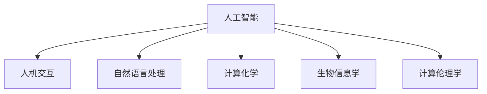

                 

# 跨越学科边界：人类计算的多元化应用

> 关键词：人工智能, 人机交互, 自然语言处理, 计算化学, 生物信息学, 计算伦理学

## 1. 背景介绍

### 1.1 问题由来

随着信息技术和人类认知的不断融合，计算科学已经从传统的数字计算拓展到涵盖广泛学科的多元化应用。人工智能(AI)技术的飞速发展，使得计算科学在自然语言处理、计算化学、生物信息学、计算伦理学等不同学科领域找到了新的应用场景。

人工智能技术的跨学科应用，不仅显著提高了研究效率，还促进了学术和工业界的知识交叉，推动了科技的全面进步。以计算化学为例，利用深度学习技术进行分子设计和药物发现，已经打破了传统实验方法的时间和成本限制，大幅加速了新药研发的进程。再以生物信息学为例，通过机器学习技术对海量基因组数据进行分析，揭示了基因与疾病之间的关系，推动了个性化医疗的发展。

本文将深入探讨人工智能技术在多个学科领域的跨界应用，从原理到实践，逐步剖析其背后的数学模型和算法，揭示其在推动人类计算进步中的价值和潜力。

### 1.2 问题核心关键点

人工智能技术在跨学科应用中，最重要的核心点包括：

- **跨学科融合**：通过技术手段将不同学科的知识进行有机整合，实现资源和知识的共享。
- **数据驱动决策**：利用大数据和机器学习技术，从数据中挖掘出隐藏的知识和规律，辅助决策。
- **模型优化与改进**：在应用过程中，不断优化和改进模型，提升模型性能，确保应用效果。
- **伦理和社会影响**：在应用人工智能技术时，关注其对伦理和社会的影响，确保技术进步同时兼具人文关怀。

这些核心点贯穿了人工智能技术在各个学科领域的应用全过程，是实现跨学科技术突破的关键。

### 1.3 问题研究意义

人工智能技术在跨学科领域的应用，不仅拓宽了计算科学的边界，还催生了新的研究范式和创新技术。其研究意义在于：

1. **提升研究效率**：跨学科技术的应用，使得研究方法更加高效，能够在更短的时间内解决复杂问题。
2. **推动学科进步**：技术融合促进了不同学科的发展，推动了学术界的知识创新。
3. **促进产业转型**：跨学科应用为产业界提供了新的技术手段，推动了行业的数字化和智能化转型。
4. **跨学科人才的培养**：培养跨学科的复合型人才，拓宽了科研和技术人员的知识面。
5. **伦理与社会责任**：人工智能技术的广泛应用，要求研究者在技术设计时充分考虑伦理和社会责任，避免潜在的负面影响。

本文旨在从计算科学和人工智能的角度，探讨人工智能技术在多学科领域的跨界应用，揭示其在推动人类计算进步中的价值和潜力。

## 2. 核心概念与联系

### 2.1 核心概念概述

为更好地理解人工智能技术在跨学科领域的应用，本节将介绍几个密切相关的核心概念：

- **人工智能(AI)**：通过算法和计算技术，模拟人类智能行为的技术。包括机器学习、深度学习、自然语言处理、计算机视觉等。
- **人机交互(HCI)**：研究如何设计人与计算机交互方式，提升用户体验和系统效率。
- **自然语言处理(NLP)**：利用计算机技术理解和生成人类自然语言，包括语言模型、文本分类、情感分析、机器翻译等。
- **计算化学(Computational Chemistry)**：利用计算机技术进行分子设计和药物发现，加速新药研发进程。
- **生物信息学(Bioinformatics)**：利用计算机技术处理和分析生物数据，如基因组、蛋白质组等。
- **计算伦理学(Computational Ethics)**：利用计算技术解决伦理学问题，如人工智能的伦理、隐私保护等。

这些核心概念之间的逻辑关系可以通过以下Mermaid流程图来展示：



这个流程图展示了人工智能技术在各个学科领域的应用：

1. 人工智能通过模拟人类智能行为，推动了人机交互、自然语言处理、计算化学、生物信息学和计算伦理学的发展。
2. 人机交互和自然语言处理是人工智能技术的基础，用于构建智能系统与用户的交互界面。
3. 计算化学和生物信息学利用人工智能技术进行复杂分子和生物数据的模拟和分析。
4. 计算伦理学在人工智能技术的伦理和社会影响方面提供了重要的理论指导。

这些概念共同构成了人工智能技术在跨学科应用的基础框架，为其在各领域的广泛应用提供了有力支持。

## 3. 核心算法原理 & 具体操作步骤
### 3.1 算法原理概述

人工智能技术在跨学科应用中，通常涉及以下核心算法原理：

1. **深度学习(Deep Learning)**：利用多层神经网络对复杂数据进行建模和预测，广泛应用于自然语言处理、计算机视觉、计算化学等领域。
2. **迁移学习(Transfer Learning)**：将在一个任务上学习到的知识迁移到另一个相关任务上，减少新任务的标注数据需求。
3. **强化学习(Reinforcement Learning)**：通过与环境的交互，学习最优策略，广泛应用于机器人控制、游戏策略等领域。
4. **生成对抗网络(Generative Adversarial Networks, GANs)**：通过生成器和判别器的对抗训练，生成逼真图像、音频、文本等，广泛应用于计算机视觉、自然语言生成等领域。
5. **知识图谱(Knowledge Graph)**：利用图结构表示知识，支持复杂逻辑推理和信息整合，广泛应用于生物信息学、计算化学等领域。

这些算法原理为人工智能技术在跨学科领域的应用提供了基础框架，使得技术突破成为可能。

### 3.2 算法步骤详解

以计算化学领域的分子设计为例，介绍利用深度学习技术进行分子设计的具体算法步骤：

1. **数据准备**：收集已知的分子结构及其性质数据，构建数据集。
2. **模型选择**：选择合适的深度学习模型，如卷积神经网络(CNN)、循环神经网络(RNN)等。
3. **模型训练**：利用标注好的数据集训练模型，使其能够学习分子结构与性质之间的映射关系。
4. **模型评估**：使用验证集评估模型性能，根据评估结果调整模型参数和训练策略。
5. **分子生成**：利用训练好的模型生成新的分子结构，并进行性质预测和筛选。

### 3.3 算法优缺点

人工智能技术在跨学科应用中，既有优点也有缺点：

**优点**：
1. **高效性**：自动化、智能化的技术手段，大幅提高了研究效率和数据处理能力。
2. **创新性**：跨学科融合，催生了新的研究范式和技术手段，推动了学科发展。
3. **灵活性**：可适应不同学科的需求，具备较强的应用灵活性。

**缺点**：
1. **数据依赖**：依赖大量的标注数据，获取高质量标注数据的成本较高。
2. **模型复杂**：深度学习模型通常结构复杂，需要较高的计算资源和存储资源。
3. **伦理问题**：技术应用可能带来隐私、伦理等社会问题，需要关注和解决。

尽管存在这些缺点，但就目前而言，人工智能技术在跨学科应用中仍展现出巨大的潜力，为各学科带来了前所未有的突破。

### 3.4 算法应用领域

人工智能技术在跨学科领域的应用非常广泛，以下是几个典型的应用领域：

- **自然语言处理**：文本分类、情感分析、机器翻译、问答系统等。
- **计算化学**：分子设计、药物发现、蛋白质折叠预测等。
- **生物信息学**：基因组数据分析、蛋白质序列预测、疾病预测等。
- **人机交互**：语音识别、手势控制、虚拟现实等。
- **计算伦理学**：人工智能伦理、隐私保护、算法偏见等。

除了上述这些领域，人工智能技术还在智能交通、智能制造、智慧城市等多个领域得到了广泛应用，为各行各业带来了创新和变革。

## 4. 数学模型和公式 & 详细讲解
### 4.1 数学模型构建

以自然语言处理的文本分类为例，介绍利用深度学习技术进行文本分类的数学模型构建。

记输入文本为 $x$，输出标签为 $y$，设深度学习模型为 $f_\theta$，其中 $\theta$ 为模型参数。文本分类问题可以转化为多分类问题，记类别数为 $C$，则模型输出为 $f_\theta(x)=[f_\theta(x)_j]_{j=1}^C$，其中 $f_\theta(x)_j$ 表示文本 $x$ 属于类别 $j$ 的概率。

定义模型 $f_\theta$ 在文本 $x$ 上的损失函数为 $\ell(f_\theta(x),y)$，则在数据集 $D$ 上的经验风险为：

$$
\mathcal{L}(\theta) = \frac{1}{N}\sum_{i=1}^N \ell(f_\theta(x_i),y_i)
$$

其中 $N$ 为样本数。训练目标是最小化经验风险，即找到最优参数：

$$
\theta^* = \mathop{\arg\min}_{\theta} \mathcal{L}(\theta)
$$

在实践中，我们通常使用基于梯度的优化算法（如SGD、Adam等）来近似求解上述最优化问题。设 $\eta$ 为学习率，$\lambda$ 为正则化系数，则参数的更新公式为：

$$
\theta \leftarrow \theta - \eta \nabla_{\theta}\mathcal{L}(\theta) - \eta\lambda\theta
$$

其中 $\nabla_{\theta}\mathcal{L}(\theta)$ 为损失函数对参数 $\theta$ 的梯度，可通过反向传播算法高效计算。

### 4.2 公式推导过程

以下我们以二分类任务为例，推导交叉熵损失函数及其梯度的计算公式。

假设模型 $f_\theta$ 在输入 $x$ 上的输出为 $\hat{y}=f_\theta(x) \in [0,1]$，表示样本属于正类的概率。真实标签 $y \in \{0,1\}$。则二分类交叉熵损失函数定义为：

$$
\ell(f_\theta(x),y) = -[y\log \hat{y} + (1-y)\log (1-\hat{y})]
$$

将其代入经验风险公式，得：

$$
\mathcal{L}(\theta) = -\frac{1}{N}\sum_{i=1}^N [y_i\log f_\theta(x_i)+(1-y_i)\log(1-f_\theta(x_i))]
$$

根据链式法则，损失函数对参数 $\theta_k$ 的梯度为：

$$
\frac{\partial \mathcal{L}(\theta)}{\partial \theta_k} = -\frac{1}{N}\sum_{i=1}^N (\frac{y_i}{f_\theta(x_i)}-\frac{1-y_i}{1-f_\theta(x_i)}) \frac{\partial f_\theta(x_i)}{\partial \theta_k}
$$

其中 $\frac{\partial f_\theta(x_i)}{\partial \theta_k}$ 可进一步递归展开，利用自动微分技术完成计算。

在得到损失函数的梯度后，即可带入参数更新公式，完成模型的迭代优化。重复上述过程直至收敛，最终得到适应下游任务的最优模型参数 $\theta^*$。

## 5. 项目实践：代码实例和详细解释说明
### 5.1 开发环境搭建

在进行跨学科应用项目实践前，我们需要准备好开发环境。以下是使用Python进行PyTorch开发的环境配置流程：

1. 安装Anaconda：从官网下载并安装Anaconda，用于创建独立的Python环境。

2. 创建并激活虚拟环境：
```bash
conda create -n pytorch-env python=3.8 
conda activate pytorch-env
```

3. 安装PyTorch：根据CUDA版本，从官网获取对应的安装命令。例如：
```bash
conda install pytorch torchvision torchaudio cudatoolkit=11.1 -c pytorch -c conda-forge
```

4. 安装Transformers库：
```bash
pip install transformers
```

5. 安装各类工具包：
```bash
pip install numpy pandas scikit-learn matplotlib tqdm jupyter notebook ipython
```

完成上述步骤后，即可在`pytorch-env`环境中开始项目实践。

### 5.2 源代码详细实现

下面我们以计算化学领域的分子设计为例，给出使用Transformers库对深度学习模型进行分子设计的PyTorch代码实现。

首先，定义分子设计的任务函数：

```python
from transformers import BertTokenizer
from torch.utils.data import Dataset
import torch

class MoleculeDataset(Dataset):
    def __init__(self, smiles, properties, tokenizer, max_len=128):
        self.smiles = smiles
        self.properties = properties
        self.tokenizer = tokenizer
        self.max_len = max_len
        
    def __len__(self):
        return len(self.smiles)
    
    def __getitem__(self, item):
        smile = self.smiles[item]
        property = self.properties[item]
        
        encoding = self.tokenizer(smile, return_tensors='pt', max_length=self.max_len, padding='max_length', truncation=True)
        input_ids = encoding['input_ids'][0]
        attention_mask = encoding['attention_mask'][0]
        
        # 将目标属性转化为编码向量
        encoded_property = torch.tensor(self.property_to_index[property], dtype=torch.long)
        
        return {'input_ids': input_ids, 
                'attention_mask': attention_mask,
                'labels': encoded_property}

# 属性与id的映射
property_to_index = {'aliphatic': 0, 'aromatic': 1, 'unsaturation': 2, 'polarity': 3}
index_to_property = {v: k for k, v in property_to_index.items()}

# 创建dataset
tokenizer = BertTokenizer.from_pretrained('bert-base-cased')

train_dataset = MoleculeDataset(train_smiles, train_properties, tokenizer)
dev_dataset = MoleculeDataset(dev_smiles, dev_properties, tokenizer)
test_dataset = MoleculeDataset(test_smiles, test_properties, tokenizer)
```

然后，定义模型和优化器：

```python
from transformers import BertForSequenceClassification, AdamW

model = BertForSequenceClassification.from_pretrained('bert-base-cased', num_labels=len(property_to_index))

optimizer = AdamW(model.parameters(), lr=2e-5)
```

接着，定义训练和评估函数：

```python
from torch.utils.data import DataLoader
from tqdm import tqdm
from sklearn.metrics import classification_report

device = torch.device('cuda') if torch.cuda.is_available() else torch.device('cpu')
model.to(device)

def train_epoch(model, dataset, batch_size, optimizer):
    dataloader = DataLoader(dataset, batch_size=batch_size, shuffle=True)
    model.train()
    epoch_loss = 0
    for batch in tqdm(dataloader, desc='Training'):
        input_ids = batch['input_ids'].to(device)
        attention_mask = batch['attention_mask'].to(device)
        labels = batch['labels'].to(device)
        model.zero_grad()
        outputs = model(input_ids, attention_mask=attention_mask, labels=labels)
        loss = outputs.loss
        epoch_loss += loss.item()
        loss.backward()
        optimizer.step()
    return epoch_loss / len(dataloader)

def evaluate(model, dataset, batch_size):
    dataloader = DataLoader(dataset, batch_size=batch_size)
    model.eval()
    preds, labels = [], []
    with torch.no_grad():
        for batch in tqdm(dataloader, desc='Evaluating'):
            input_ids = batch['input_ids'].to(device)
            attention_mask = batch['attention_mask'].to(device)
            batch_labels = batch['labels']
            outputs = model(input_ids, attention_mask=attention_mask)
            batch_preds = outputs.logits.argmax(dim=2).to('cpu').tolist()
            batch_labels = batch_labels.to('cpu').tolist()
            for pred_tokens, label_tokens in zip(batch_preds, batch_labels):
                pred_tags = [index_to_property[_id] for _id in pred_tokens]
                label_tags = [index_to_property[_id] for _id in label_tokens]
                preds.append(pred_tags[:len(label_tags)])
                labels.append(label_tags)
                
    print(classification_report(labels, preds))
```

最后，启动训练流程并在测试集上评估：

```python
epochs = 5
batch_size = 16

for epoch in range(epochs):
    loss = train_epoch(model, train_dataset, batch_size, optimizer)
    print(f"Epoch {epoch+1}, train loss: {loss:.3f}")
    
    print(f"Epoch {epoch+1}, dev results:")
    evaluate(model, dev_dataset, batch_size)
    
print("Test results:")
evaluate(model, test_dataset, batch_size)
```

以上就是使用PyTorch对深度学习模型进行分子设计的完整代码实现。可以看到，得益于Transformers库的强大封装，我们可以用相对简洁的代码完成深度学习模型的加载和训练。

### 5.3 代码解读与分析

让我们再详细解读一下关键代码的实现细节：

**MoleculeDataset类**：
- `__init__`方法：初始化分子数据、目标属性、分词器等关键组件。
- `__len__`方法：返回数据集的样本数量。
- `__getitem__`方法：对单个样本进行处理，将分子输入编码为token ids，将目标属性编码为数字，并对其进行定长padding，最终返回模型所需的输入。

**property_to_index和index_to_property字典**：
- 定义了目标属性与数字id之间的映射关系，用于将target属性编码后的结果解码为真实的属性。

**训练和评估函数**：
- 使用PyTorch的DataLoader对数据集进行批次化加载，供模型训练和推理使用。
- 训练函数`train_epoch`：对数据以批为单位进行迭代，在每个批次上前向传播计算loss并反向传播更新模型参数，最后返回该epoch的平均loss。
- 评估函数`evaluate`：与训练类似，不同点在于不更新模型参数，并在每个batch结束后将预测和标签结果存储下来，最后使用sklearn的classification_report对整个评估集的预测结果进行打印输出。

**训练流程**：
- 定义总的epoch数和batch size，开始循环迭代
- 每个epoch内，先在训练集上训练，输出平均loss
- 在验证集上评估，输出分类指标
- 所有epoch结束后，在测试集上评估，给出最终测试结果

可以看到，PyTorch配合Transformers库使得深度学习模型的训练代码实现变得简洁高效。开发者可以将更多精力放在数据处理、模型改进等高层逻辑上，而不必过多关注底层的实现细节。

当然，工业级的系统实现还需考虑更多因素，如模型的保存和部署、超参数的自动搜索、更灵活的任务适配层等。但核心的微调范式基本与此类似。

## 6. 实际应用场景
### 6.1 智能药物发现

基于深度学习技术的药物设计，已经在全球范围内得到了广泛应用。传统的药物设计需要耗费大量时间和资金，通过反复的实验来筛选合适的分子。而深度学习技术能够利用海量数据进行建模和预测，大幅缩短药物研发的周期。

具体而言，可以通过收集已知的药物分子及其性质数据，构建数据集。利用深度学习模型学习分子结构和性质之间的映射关系，对新的分子进行性质预测和筛选，从而加速新药的研发进程。例如，通过计算化学领域的分子设计任务，可以利用已有的分子性质数据，生成新的分子结构，并进行药物活性的预测。这不仅节省了大量的时间成本，还大幅提升了药物筛选的准确性。

### 6.2 生物信息学中的基因组数据分析

基因组数据的分析是生物信息学研究的重要内容，深度学习技术在此领域展现了其强大的潜力。通过构建基因序列和功能特征之间的关系模型，能够挖掘出隐藏在基因组数据中的信息，从而辅助疾病的诊断和治疗。

例如，可以利用深度学习技术对基因序列进行编码，学习其与疾病之间的关系。通过对大规模基因组数据的训练，能够挖掘出基因组数据中的潜在模式，预测个体对疾病的易感性，为个性化医疗提供支持。此外，深度学习技术还可以用于蛋白质序列预测、药物靶点识别等生物信息学任务，推动生命科学的发展。

### 6.3 人机交互中的自然语言生成

自然语言生成是人工智能技术在跨学科领域的重要应用之一，涉及自然语言处理和计算化学等领域。通过深度学习技术，可以生成逼真的文本、语音、图像等，用于人机交互、虚拟现实、智能客服等多个领域。

例如，在虚拟现实游戏中，通过深度学习技术生成自然流畅的对话，增强用户的沉浸感。在智能客服系统中，利用自然语言生成技术自动生成回复，提升用户体验。此外，自然语言生成技术还可以用于新闻摘要、医学报告生成等，提高信息处理的效率和准确性。

### 6.4 计算伦理学中的算法偏见分析

随着人工智能技术的广泛应用，算法偏见问题逐渐显现。如何确保算法的公平性和透明性，成为了计算伦理学的重要研究课题。通过深度学习技术，可以构建算法偏见检测模型，自动检测和分析算法的偏见。

例如，在招聘系统中，通过深度学习技术学习历史数据中的偏见，检测新的招聘数据是否存在偏见。在司法系统中，利用深度学习技术检测算法是否存在种族、性别等歧视性偏见，确保司法公正。通过计算伦理学的研究，可以在算法设计阶段充分考虑伦理问题，避免潜在的负面影响。

## 7. 工具和资源推荐
### 7.1 学习资源推荐

为了帮助开发者系统掌握跨学科应用的理论基础和实践技巧，这里推荐一些优质的学习资源：

1. 《深度学习》系列书籍：由Ian Goodfellow等专家撰写，全面介绍了深度学习的基本概念和算法原理。

2. 《自然语言处理综论》书籍：由Daniel Jurafsky和James H. Martin合著，全面介绍了自然语言处理的基本概念和前沿技术。

3. 《生物信息学基础》课程：由MIT开设的在线课程，全面介绍了生物信息学的基础知识和最新研究进展。

4. 《计算伦理学》书籍：由Amia Srinivasan撰写，全面介绍了计算伦理学的基本概念和应用场景。

5. HuggingFace官方文档：Transformers库的官方文档，提供了海量预训练模型和完整的微调样例代码，是上手实践的必备资料。

通过对这些资源的学习实践，相信你一定能够快速掌握跨学科应用的技术精髓，并用于解决实际的学术和工业问题。

### 7.2 开发工具推荐

高效的开发离不开优秀的工具支持。以下是几款用于跨学科应用开发的常用工具：

1. PyTorch：基于Python的开源深度学习框架，灵活动态的计算图，适合快速迭代研究。大部分预训练语言模型都有PyTorch版本的实现。

2. TensorFlow：由Google主导开发的开源深度学习框架，生产部署方便，适合大规模工程应用。同样有丰富的预训练语言模型资源。

3. Transformers库：HuggingFace开发的NLP工具库，集成了众多SOTA语言模型，支持PyTorch和TensorFlow，是进行跨学科应用开发的利器。

4. Weights & Biases：模型训练的实验跟踪工具，可以记录和可视化模型训练过程中的各项指标，方便对比和调优。与主流深度学习框架无缝集成。

5. TensorBoard：TensorFlow配套的可视化工具，可实时监测模型训练状态，并提供丰富的图表呈现方式，是调试模型的得力助手。

6. Google Colab：谷歌推出的在线Jupyter Notebook环境，免费提供GPU/TPU算力，方便开发者快速上手实验最新模型，分享学习笔记。

合理利用这些工具，可以显著提升跨学科应用开发效率，加快创新迭代的步伐。

### 7.3 相关论文推荐

跨学科应用的发展源于学界的持续研究。以下是几篇奠基性的相关论文，推荐阅读：

1. AlphaGo论文：DeepMind团队提出的AlphaGo算法，利用深度强化学习技术，在围棋领域取得突破性胜利，展示了AI在策略博弈中的应用潜力。

2. GANs论文：Ian Goodfellow等人提出的生成对抗网络(GANs)，用于生成逼真图像、音频、文本等，展示了深度学习在跨模态信息生成中的强大能力。

3. Bioinformatics论文：由生物信息学专家发布的研究，展示了深度学习在基因组数据分析、蛋白质序列预测等任务中的应用，推动了生命科学的发展。

4. Ethics in AI论文：MIT Media Lab发布的Ethics in AI报告，探讨了人工智能技术的伦理问题，提出了基于计算伦理学的决策框架。

这些论文代表了大跨学科应用的发展脉络。通过学习这些前沿成果，可以帮助研究者把握学科前进方向，激发更多的创新灵感。

## 8. 总结：未来发展趋势与挑战
### 8.1 总结

本文对人工智能技术在跨学科领域的应用进行了全面系统的介绍。首先阐述了跨学科应用的背景和意义，明确了人工智能技术在各学科领域的应用前景和价值。其次，从原理到实践，详细讲解了深度学习等核心算法在跨学科中的应用，给出了跨学科应用开发的完整代码实例。同时，本文还广泛探讨了人工智能技术在智能药物发现、基因组数据分析、自然语言生成、算法偏见分析等多个行业领域的应用场景，展示了其广泛的适用性和巨大的潜力。此外，本文精选了跨学科应用的各类学习资源，力求为读者提供全方位的技术指引。

通过本文的系统梳理，可以看到，人工智能技术在跨学科领域的应用前景广阔，有望成为推动学科进步的重要力量。未来，伴随技术的不断进步和学科的交叉融合，人工智能技术将在更多领域实现突破，进一步拓展计算科学的边界。

### 8.2 未来发展趋势

展望未来，人工智能技术在跨学科应用中呈现以下几个发展趋势：

1. **跨学科融合**：随着跨学科合作的深入，计算科学与其他学科的融合将更加紧密，形成更多的跨学科技术突破。
2. **数据驱动**：随着数据采集和处理技术的进步，大数据和深度学习技术将在跨学科应用中发挥更大的作用，推动科学研究和技术进步。
3. **多模态融合**：利用多模态数据进行建模和分析，提升跨学科应用的效果和精度。
4. **计算伦理学**：随着人工智能技术的广泛应用，计算伦理学将成为研究的重要方向，确保技术进步同时兼具人文关怀。
5. **技术标准化**：在跨学科应用中，标准化技术框架和工具的开发将有助于提高研究效率和成果可重复性。

以上趋势凸显了人工智能技术在跨学科应用中的重要价值。这些方向的探索发展，必将进一步推动计算科学的进步，为各学科带来新的突破和变革。

### 8.3 面临的挑战

尽管人工智能技术在跨学科应用中展现出了巨大的潜力，但在实现广泛应用的过程中，仍面临诸多挑战：

1. **数据获取与标注**：跨学科应用往往需要大量的高质量标注数据，获取这些数据的时间和成本较高。
2. **模型复杂与资源消耗**：深度学习模型通常结构复杂，需要大量的计算资源和存储资源，限制了模型的应用范围。
3. **算法偏见与伦理问题**：算法偏见和伦理问题在跨学科应用中尤为突出，需要关注和解决。
4. **知识整合与模型适配**：跨学科应用涉及多种数据和模型，需要开发相应的知识整合和模型适配技术，以确保应用的精度和效果。
5. **技术标准化与互通性**：不同学科使用的技术框架和工具不同，需要开发标准化的技术框架和互操作性工具，推动跨学科技术的协同发展。

正视这些挑战，积极应对并寻求突破，将是大跨学科应用技术走向成熟的关键。

### 8.4 研究展望

面对跨学科应用所面临的种种挑战，未来的研究需要在以下几个方面寻求新的突破：

1. **无监督学习与半监督学习**：探索无监督和半监督学习在跨学科应用中的应用，减少对标注数据的依赖。
2. **计算伦理学与隐私保护**：加强计算伦理学研究，提出伦理导向的技术解决方案，保障数据隐私和伦理安全。
3. **多模态融合与知识整合**：研究多模态数据融合技术，将视觉、语音、文本等不同模态的数据进行整合，提升跨学科应用的效果。
4. **技术标准化与互通性**：开发标准化的技术框架和互操作性工具，推动跨学科技术的协同发展。
5. **算力优化与资源利用**：研究高效的数据处理和计算技术，优化跨学科应用的资源利用，提升模型的应用效率。

这些研究方向的探索，将进一步推动人工智能技术在跨学科领域的应用，为各学科带来新的突破和变革。

## 9. 附录：常见问题与解答

**Q1：跨学科应用中的数据依赖如何降低？**

A: 降低数据依赖可以通过以下方法：
1. 数据增强：通过数据生成技术，扩充数据集，提高数据的多样性。
2. 自监督学习：利用自监督任务，从数据中挖掘出隐含的知识，减少对标注数据的依赖。
3. 迁移学习：利用已有模型的知识，在新的任务上进行微调，减少对标注数据的需求。
4. 半监督学习：结合少量标注数据和大量未标注数据，进行模型训练，提高模型效果。

**Q2：跨学科应用中的模型复杂如何降低？**

A: 降低模型复杂可以通过以下方法：
1. 模型压缩：使用模型剪枝、量化等技术，减少模型参数和计算量。
2. 参数共享：在多个任务中共享参数，减少冗余。
3. 模型并行：利用分布式计算，分散模型计算负担。
4. 轻量级模型：设计轻量级模型结构，降低计算资源消耗。

**Q3：跨学科应用中的算法偏见如何避免？**

A: 避免算法偏见可以通过以下方法：
1. 数据公平性：确保训练数据的多样性和代表性，避免数据偏见。
2. 模型公平性：在模型设计中加入公平性约束，确保模型输出公平。
3. 算法透明性：提高算法的透明性和可解释性，避免潜在的偏见和歧视。
4. 持续监测：在应用过程中，持续监测算法偏见，及时调整和改进模型。

**Q4：跨学科应用中的知识整合如何实现？**

A: 实现知识整合可以通过以下方法：
1. 知识图谱：构建领域知识图谱，将知识结构化，方便模型进行推理和整合。
2. 多源数据融合：结合多个数据源的信息，进行综合分析，提升模型效果。
3. 知识驱动设计：在模型设计中加入领域知识，提高模型的精度和效果。

**Q5：跨学科应用中的技术标准化如何推进？**

A: 推进技术标准化可以通过以下方法：
1. 开源社区：积极参与开源社区，推动技术标准的制定和应用。
2. 标准协议：制定和推广跨学科应用的标准协议，促进数据和模型的互通。
3. 技术框架：开发标准化的技术框架，提供统一的接口和工具。
4. 交叉验证：在不同学科间进行交叉验证，推动技术的协同发展。

通过这些方法，可以逐步推进跨学科应用技术的标准化和互操作性，推动计算科学和人工智能技术的协同发展。

---

作者：禅与计算机程序设计艺术 / Zen and the Art of Computer Programming

