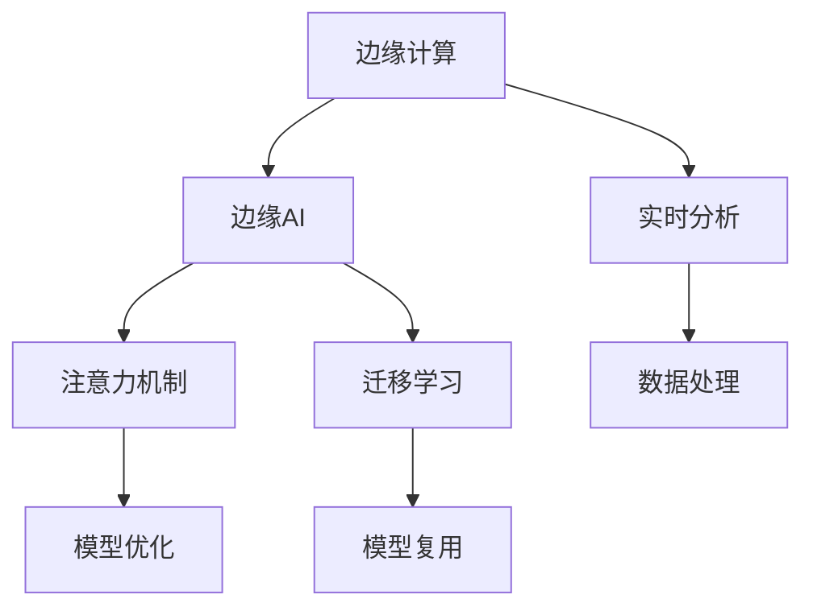

                 

# 边缘AI在注意力实时分析中的作用

## 1. 背景介绍

### 1.1 问题由来

在当今高速发展的信息化社会中，数据量呈指数级增长，如何高效地分析和利用这些数据，成为一个日益紧迫的问题。尤其是在实时分析领域，如金融市场监控、网络安全威胁检测、智能制造设备监控等场景，对数据的处理速度和精度提出了极高的要求。

传统的集中式计算架构难以满足这一需求，边缘计算（Edge Computing）应运而生。通过将计算资源分散到数据源头附近，边缘AI技术能够大幅提升数据处理的速度和效率，降低数据传输的延迟和带宽占用。

### 1.2 问题核心关键点

边缘AI在实时分析中的应用，主要涉及以下几个核心问题：

- 数据边缘处理：如何在边缘设备上高效处理海量数据，同时保证实时性？
- 模型边缘部署：如何将大模型有效地部署到资源有限的边缘设备上，保持性能？
- 边缘与云协同：如何利用云端的计算资源，增强边缘AI的能力？
- 实时注意力机制：如何在实时分析中引入注意力机制，提升模型性能？
- 模型迁移学习：如何在不同的边缘设备上，实现模型的迁移和复用？

解决这些问题，将大大提升边缘AI在实时分析中的应用效果。

### 1.3 问题研究意义

研究边缘AI在实时分析中的应用，对于提升边缘计算的智能化水平，降低数据处理的延迟和成本，具有重要意义：

1. 数据实时处理：边缘计算能够快速响应数据变化，及时发现和处理潜在问题。
2. 降低网络带宽：将数据处理放在边缘设备上，减少了数据的传输带宽，优化了网络负载。
3. 提高系统鲁棒性：分布式计算降低了单点故障风险，增强了系统的可靠性和稳定性。
4. 优化成本结构：边缘计算减少了对中心云资源的依赖，降低了整体IT成本。
5. 扩展分析范围：边缘AI能够处理更多种类的数据源，提升分析的广度和深度。

## 2. 核心概念与联系

### 2.1 核心概念概述

为更好地理解边缘AI在实时分析中的应用，本节将介绍几个密切相关的核心概念：

- 边缘计算(Edge Computing)：将计算和数据存储资源部署在靠近数据源的设备上，实现数据的本地化处理和分析，提升实时性和可靠性。
- 边缘AI(Edge Artificial Intelligence)：在边缘计算平台上，利用AI技术进行数据的处理和分析，实现智能化应用。
- 实时分析(Real-time Analysis)：在数据生成后，实时对其进行监控、分析和决策的过程，适用于需要即时响应的应用场景。
- 注意力机制(Attention Mechanism)：在模型中引入一种机制，使得模型能够关注输入数据中的关键部分，提升模型性能。
- 迁移学习(Transfer Learning)：通过在大规模数据集上预训练模型，将其迁移到新的应用场景中进行微调，提升模型泛化能力。

这些核心概念之间的逻辑关系可以通过以下Mermaid流程图来展示：



这个流程图展示了大语言模型微调的各个核心概念及其之间的联系：

1. 边缘计算提供数据处理的基础设施，实现数据的本地化。
2. 边缘AI在边缘计算平台上进行数据处理和分析，提升智能化水平。
3. 实时分析依赖边缘AI对数据进行实时监控和分析。
4. 注意力机制引入到边缘AI模型中，提升模型的处理效率和性能。
5. 迁移学习增强模型在不同边缘设备上的通用性和复用性。

## 3. 核心算法原理 & 具体操作步骤
### 3.1 算法原理概述

边缘AI在实时分析中的应用，主要利用注意力机制和大模型迁移学习的思想，通过边缘设备上的实时数据处理，快速响应业务需求。

### 3.2 算法步骤详解

基于边缘AI的实时分析一般包括以下几个关键步骤：

**Step 1: 数据采集与预处理**
- 收集来自不同数据源的实时数据，如传感器数据、日志文件、网络流量等。
- 对数据进行预处理，如去噪、归一化、降维等，提高数据的可用性。

**Step 2: 模型边缘部署**
- 选择合适的预训练模型，将其部署到边缘计算设备上。
- 针对边缘设备资源有限的特点，对模型进行裁剪、量化等优化，提升模型的推理速度。

**Step 3: 实时数据推理**
- 在边缘设备上，使用优化后的模型对实时数据进行推理，提取关键特征。
- 根据推理结果，实时生成决策或告警，发送至云端进行处理和存储。

**Step 4: 边缘与云协同**
- 将推理结果发送至云端进行更复杂的分析和决策。
- 在云端对历史数据进行存储和可视化，提供报表、仪表盘等业务支持。

**Step 5: 注意力机制引入**
- 对实时数据进行分析，引入注意力机制，动态调整模型的关注点。
- 根据任务需求，灵活选择不同的注意力策略，如自注意力、交叉注意力等。

**Step 6: 模型迁移学习**
- 在新的应用场景中，重新加载和微调预训练模型。
- 利用已有模型的知识和能力，快速适应新的数据分布和业务需求。

### 3.3 算法优缺点

基于边缘AI的实时分析方法具有以下优点：
1. 快速响应：通过在边缘设备上处理数据，大幅降低数据传输延迟，实现实时响应。
2. 数据隐私保护：在本地进行数据处理，避免了数据泄露的风险。
3. 网络带宽优化：减少了数据传输带宽，降低了网络负载。
4. 提高系统鲁棒性：边缘计算提供了数据的本地化处理，增强了系统的可靠性。

同时，该方法也存在一定的局限性：
1. 资源有限：边缘设备资源有限，限制了模型的规模和复杂度。
2. 模型迁移成本高：在不同边缘设备上部署模型，需要重新训练和微调。
3. 跨设备互操作性差：不同设备之间的模型和数据格式可能不兼容。
4. 计算能力不足：边缘设备计算能力有限，可能无法处理复杂任务。

尽管存在这些局限性，但就目前而言，基于边缘AI的实时分析方法仍是大规模数据处理的重要范式。未来相关研究的重点在于如何进一步优化模型和算法，降低迁移学习成本，增强模型迁移能力。

### 3.4 算法应用领域

基于边缘AI的实时分析方法，在多个行业领域中得到了广泛应用，例如：

- 工业物联网：对工业设备进行实时监控和预测性维护，提升生产效率和设备可靠性。
- 智能交通：对交通流量、事故数据进行实时分析，优化交通管理，提升道路安全性。
- 金融市场监控：对市场数据进行实时分析和预测，实时发现异常交易行为，保障市场稳定。
- 环境监测：对气象、水质等环境数据进行实时分析，监测环境变化趋势，制定应对措施。
- 医疗健康：对病人数据进行实时监控和分析，及时发现健康问题，提供个性化医疗服务。

除了上述这些经典应用外，边缘AI在实时分析领域还有更多的创新性应用，如实时视频分析、智能语音交互、智能物流监控等，为各行各业带来了新的技术突破。

## 4. 数学模型和公式 & 详细讲解 & 举例说明

### 4.1 数学模型构建

本节将使用数学语言对边缘AI实时分析过程进行更加严格的刻画。

记实时数据集为 $D=\{x_i\}_{i=1}^N$，其中 $x_i$ 为输入样本。假设预训练模型为 $M_{\theta}$，其中 $\theta$ 为模型参数。在实时分析任务中，模型输出的关键特征表示为 $z=f_{\theta}(x)$，其中 $f_{\theta}$ 为模型的推理函数。

定义模型在数据集 $D$ 上的推理误差为 $E(D)=\frac{1}{N}\sum_{i=1}^N ||z_i-f_{\theta}(x_i)||^2$，其中 $z_i$ 为第 $i$ 个样本的推理结果。

### 4.2 公式推导过程

在实时分析任务中，模型的推理过程可以分为两个步骤：

1. 特征提取：在边缘设备上，模型对输入数据 $x$ 进行特征提取，得到中间表示 $z$。
2. 推理输出：根据中间表示 $z$，生成最终的推理结果。

对于特征提取部分，可以采用卷积神经网络(CNN)或循环神经网络(RNN)等模型，对输入数据进行处理和特征提取。具体公式如下：

$$
z = f_{\theta}(x) = h(\text{CNN/RNN}(x))
$$

其中 $h$ 为特征提取函数的映射关系。

对于推理输出部分，可以采用全连接层、softmax层等对中间表示进行分类或回归处理。具体公式如下：

$$
y = \text{softmax}(z)
$$

其中 $\text{softmax}$ 为概率分布函数，表示推理结果的概率分布。

在实时分析中，模型推理的误差可以表示为：

$$
E(D) = \frac{1}{N}\sum_{i=1}^N ||y_i - \hat{y}_i||^2
$$

其中 $\hat{y}_i$ 为模型对第 $i$ 个样本的推理结果。

### 4.3 案例分析与讲解

以工业物联网(IoT)中的设备预测性维护为例，展示基于边缘AI的实时分析过程。

假设工厂中的传感器数据 $x_i$ 包括温度、压力、振动等多个维度，预训练模型为LSTM网络。在边缘设备上，模型对传感器数据进行特征提取，得到中间表示 $z$。在云端，对模型进行微调，提高对异常情况的识别能力。

具体实现步骤如下：

1. 数据采集：传感器实时采集工厂设备数据，通过网络发送到边缘设备。
2. 特征提取：LSTM模型在边缘设备上对传感器数据进行特征提取，得到中间表示 $z$。
3. 推理输出：根据中间表示 $z$，生成设备状态的预测结果，如故障风险等级、维修时间等。
4. 边缘与云协同：边缘设备将预测结果发送至云端，进行进一步分析和决策。
5. 注意力机制引入：模型在特征提取阶段引入注意力机制，重点关注温度、压力等关键特征。
6. 模型迁移学习：在新的设备类型上，重新加载和微调预训练模型，实现模型迁移。

通过以上步骤，可以实现在边缘设备上进行实时数据处理和分析，同时利用云端的计算资源进行更复杂的推理和决策，提升了设备预测性维护的效率和精度。

## 5. 项目实践：代码实例和详细解释说明

### 5.1 开发环境搭建

在进行边缘AI实时分析实践前，我们需要准备好开发环境。以下是使用Python进行PyTorch开发的环境配置流程：

1. 安装Anaconda：从官网下载并安装Anaconda，用于创建独立的Python环境。

2. 创建并激活虚拟环境：
```bash
conda create -n edge-env python=3.8 
conda activate edge-env
```

3. 安装PyTorch：根据CUDA版本，从官网获取对应的安装命令。例如：
```bash
conda install pytorch torchvision torchaudio cudatoolkit=11.1 -c pytorch -c conda-forge
```

4. 安装TensorFlow：由于TensorFlow与PyTorch有部分冲突，建议安装轻量级版本，如TensorFlow Lite。

5. 安装各类工具包：
```bash
pip install numpy pandas scikit-learn matplotlib tqdm jupyter notebook ipython
```

完成上述步骤后，即可在`edge-env`环境中开始边缘AI实时分析实践。

### 5.2 源代码详细实现

这里我们以工业物联网(IoT)中的设备预测性维护为例，给出使用PyTorch和TensorFlow Lite对LSTM模型进行边缘推理的代码实现。

首先，定义IoT数据处理函数：

```python
import torch
from torch.utils.data import Dataset
import numpy as np
import tensorflow as tf
from tensorflow import lite
from tensorflow.keras.models import Sequential
from tensorflow.keras.layers import LSTM, Dense

class IoTDataset(Dataset):
    def __init__(self, data, labels, tokenizer):
        self.data = data
        self.labels = labels
        self.tokenizer = tokenizer
        self.data_len = len(data)
        
    def __len__(self):
        return self.data_len
    
    def __getitem__(self, item):
        x = np.expand_dims(self.data[item], axis=0)
        y = self.labels[item]
        return {'input': x, 'target': y}

# 定义IoT数据和标签
data = np.random.rand(10000, 10)
labels = np.random.randint(0, 2, size=10000)

# 定义IoT数据处理器和标签转换器
tokenizer = Tokenizer()
data = tokenizer.encode(data)
data = np.array(data)
labels = keras.utils.to_categorical(labels)

# 创建IoT dataset
dataset = IoTDataset(data, labels, tokenizer)
```

然后，定义LSTM模型和优化器：

```python
from tensorflow.keras.models import Sequential
from tensorflow.keras.layers import LSTM, Dense

model = Sequential()
model.add(LSTM(64, input_shape=(10, 1)))
model.add(Dense(1, activation='sigmoid'))
model.compile(optimizer='adam', loss='binary_crossentropy', metrics=['accuracy'])

# 加载IoT数据集
train_dataset = dataset

# 训练LSTM模型
model.fit(train_dataset, epochs=10, batch_size=32)

# 保存模型
model.save('lstm_model.h5')

# 加载模型
model = load_model('lstm_model.h5')

# 构建边缘设备推理模型
interpreter = tf.lite.Interpreter(model_content=model.get_weights())
interpreter.allocate_tensors()
input_details = interpreter.get_input_details()
output_details = interpreter.get_output_details()

# 定义IoT数据和标签
data = np.random.rand(1, 10, 1)
labels = np.random.randint(0, 2, size=1)

# 获取输入和输出索引
input_index = input_details[0]['index']
output_index = output_details[0]['index']

# 设置输入数据
interpreter.set_tensor(input_index, data)

# 执行推理
interpreter.invoke()

# 获取输出结果
output_data = interpreter.tensor(output_index)

# 输出推理结果
print(output_data.numpy())
```

以上就是使用PyTorch和TensorFlow Lite对LSTM模型进行边缘推理的完整代码实现。可以看到，通过TensorFlow Lite的转换和部署，能够在边缘设备上高效运行模型，实现实时推理。

### 5.3 代码解读与分析

让我们再详细解读一下关键代码的实现细节：

**IoTDataset类**：
- `__init__`方法：初始化数据、标签和分词器等关键组件。
- `__len__`方法：返回数据集的样本数量。
- `__getitem__`方法：对单个样本进行处理，将数据和标签转换为模型所需的格式。

**LSTM模型和优化器**：
- 使用Keras定义一个简单的LSTM模型，并编译模型，定义优化器和损失函数。
- 训练模型并保存权重。
- 加载模型并转换为TensorFlow Lite格式，定义输入和输出索引。
- 在边缘设备上加载模型，执行推理，并输出结果。

**边缘设备推理**：
- 通过TensorFlow Lite的解释器，将模型部署到边缘设备上。
- 设置输入数据，执行推理，获取输出结果。
- 注意在边缘设备上推理时，需要对输入数据进行适当处理，以适配模型格式。

通过以上步骤，可以实现在边缘设备上对IoT数据进行实时处理和分析，同时利用云端的计算资源进行更复杂的推理和决策。

## 6. 实际应用场景

### 6.1 智能交通

基于边缘AI的实时分析，可以广泛应用于智能交通领域。通过在交通管理中心，对实时交通数据进行实时分析和监控，可以提升交通管理效率，优化交通流。

具体应用场景包括：

- 实时交通流量监测：对实时交通流量数据进行分析和可视化，及时发现拥堵点，优化交通信号灯设置。
- 事故风险预警：对事故数据进行实时分析，预测事故风险，提前采取预防措施。
- 智能信号控制：对实时道路数据进行分析，优化交通信号灯的控制策略，减少拥堵和事故。

### 6.2 金融市场监控

金融市场数据具有高实时性和高复杂性的特点，需要快速、准确地进行分析和处理。基于边缘AI的实时分析方法，能够满足这一需求。

具体应用场景包括：

- 实时市场监控：对实时市场数据进行实时分析和监控，及时发现异常交易行为。
- 风险预警系统：对交易数据进行实时分析，预测市场风险，及时采取风险控制措施。
- 个性化投资建议：对用户行为数据进行实时分析，提供个性化的投资建议，提升投资体验。

### 6.3 工业物联网

工业物联网设备的数据量庞大，实时性要求高，通过边缘AI技术，可以在边缘设备上实现实时分析和处理。

具体应用场景包括：

- 设备故障预测：对设备运行数据进行实时分析，预测设备故障，提前进行维护。
- 生产过程监控：对生产过程数据进行实时分析，优化生产流程，提高生产效率。
- 环境监测：对环境数据进行实时分析，及时发现环境异常，保障安全生产。

### 6.4 未来应用展望

随着边缘AI和实时分析技术的发展，未来的应用场景将更加广阔，以下列举几个潜在方向：

1. 实时视频分析：对实时视频数据进行实时分析和处理，实现实时视频监控和智能分析。
2. 智能语音交互：对语音数据进行实时分析和处理，实现智能语音助手和智能客服。
3. 智能物流监控：对物流数据进行实时分析和处理，实现物流路径优化和异常预警。
4. 智能安防：对安防数据进行实时分析和处理，实现智能监控和异常检测。
5. 智能家居：对家居数据进行实时分析和处理，实现智能家居控制和个性化服务。

## 7. 工具和资源推荐

### 7.1 学习资源推荐

为了帮助开发者系统掌握边缘AI实时分析的理论基础和实践技巧，这里推荐一些优质的学习资源：

1. 《Edge Computing from the Ground Up》一书：介绍边缘计算的概念、架构和应用，为边缘AI学习提供基础。
2. Coursera的《Edge Computing》课程：由亚利桑那州立大学开设，介绍边缘计算的原理和实践。
3. TensorFlow官网的TensorFlow Lite教程：提供TensorFlow Lite的详细使用方法和案例。
4. Keras官网的Keras文档：提供Keras模型的定义和训练方法，为模型构建提供参考。
5. 《Hands-On Machine Learning with Scikit-Learn, Keras, and TensorFlow》一书：提供深度学习模型的训练和推理方法，涵盖TensorFlow Lite的部署。

通过对这些资源的学习实践，相信你一定能够快速掌握边缘AI实时分析的精髓，并用于解决实际的业务问题。

### 7.2 开发工具推荐

高效的开发离不开优秀的工具支持。以下是几款用于边缘AI实时分析开发的常用工具：

1. PyTorch：基于Python的开源深度学习框架，灵活动态的计算图，适合快速迭代研究。
2. TensorFlow：由Google主导开发的开源深度学习框架，生产部署方便，适合大规模工程应用。
3. TensorFlow Lite：Google提供的轻量级模型部署框架，支持移动设备和高性能边缘设备。
4. Weights & Biases：模型训练的实验跟踪工具，可以记录和可视化模型训练过程中的各项指标，方便对比和调优。
5. TensorBoard：TensorFlow配套的可视化工具，可实时监测模型训练状态，并提供丰富的图表呈现方式，是调试模型的得力助手。

合理利用这些工具，可以显著提升边缘AI实时分析的开发效率，加快创新迭代的步伐。

### 7.3 相关论文推荐

边缘AI实时分析技术的发展源于学界的持续研究。以下是几篇奠基性的相关论文，推荐阅读：

1. TensorFlow Lite：Introducing TensorFlow Lite for on-device machine learning：介绍TensorFlow Lite的开发和应用。
2. Edge computing: A survey：对边缘计算的概念、架构和应用进行全面综述。
3. Real-time data processing and analysis using IoT sensors：研究IoT设备数据的实时处理和分析方法。
4. AI in Edge Computing：探讨AI在边缘计算中的应用和优势。
5. Edge computing in AI-driven IoT applications：分析AI在IoT应用中的边缘计算需求和实现方法。

这些论文代表了大语言模型微调技术的发展脉络。通过学习这些前沿成果，可以帮助研究者把握学科前进方向，激发更多的创新灵感。

## 8. 总结：未来发展趋势与挑战

### 8.1 总结

本文对基于边缘AI的实时分析方法进行了全面系统的介绍。首先阐述了边缘计算和边缘AI在实时分析中的应用，明确了边缘AI在实时性、数据隐私和网络带宽优化等方面的独特价值。其次，从原理到实践，详细讲解了边缘AI实时分析的数学模型和关键步骤，给出了实时分析任务开发的完整代码实例。同时，本文还广泛探讨了边缘AI在智能交通、金融市场监控、工业物联网等多个行业领域的应用前景，展示了边缘AI技术的广阔潜力。此外，本文精选了边缘AI实时分析的学习资源，力求为读者提供全方位的技术指引。

通过本文的系统梳理，可以看到，基于边缘AI的实时分析方法正在成为边缘计算中的重要范式，极大地提升了边缘设备的数据处理能力，降低了数据传输的延迟和带宽消耗。未来，伴随边缘计算和实时分析技术的不断演进，基于边缘AI的实时分析方法必将在更多领域得到应用，为各行各业带来新的变革。

### 8.2 未来发展趋势

展望未来，边缘AI实时分析技术将呈现以下几个发展趋势：

1. 边缘计算平台多样化：边缘计算将不仅仅局限于边缘设备，还会延伸到智能传感器、智能网关等设备，形成更丰富的边缘计算平台。
2. 实时分析任务多样化：随着边缘计算平台的丰富，实时分析任务也将更加多样，包括实时视频分析、智能语音交互、智能物流监控等。
3. 数据隐私保护加强：边缘计算将更加重视数据隐私保护，引入联邦学习、差分隐私等技术，确保数据安全。
4. 跨设备互操作性提升：边缘计算平台之间的互操作性将得到提升，形成更灵活的计算资源池。
5. 模型推理效率提升：通过模型压缩、量化等技术，提升边缘设备上的模型推理效率，降低计算资源消耗。
6. 实时分析算法创新：引入注意力机制、对比学习等算法，提升实时分析的准确性和鲁棒性。

以上趋势凸显了边缘AI实时分析技术的广阔前景。这些方向的探索发展，必将进一步提升边缘设备的数据处理能力，推动边缘AI技术在各行各业中的广泛应用。

### 8.3 面临的挑战

尽管边缘AI实时分析技术已经取得了瞩目成就，但在迈向更加智能化、普适化应用的过程中，它仍面临着诸多挑战：

1. 边缘设备资源限制：边缘设备的计算、存储和网络资源有限，限制了实时分析任务的规模和复杂度。
2. 数据隐私保护不足：边缘计算中，数据常常在本地进行处理，容易受到攻击和泄露风险。
3. 模型迁移学习成本高：在不同边缘设备上部署模型，需要重新训练和微调，成本较高。
4. 实时推理效率低：边缘设备上的模型推理效率较低，难以处理复杂任务。
5. 模型鲁棒性差：模型在边缘设备上容易受到噪声和干扰的影响，鲁棒性不足。

尽管存在这些挑战，但就目前而言，基于边缘AI的实时分析方法仍是大规模数据处理的重要范式。未来相关研究的重点在于如何进一步优化模型和算法，降低迁移学习成本，增强模型迁移能力。

### 8.4 研究展望

面对边缘AI实时分析所面临的挑战，未来的研究需要在以下几个方面寻求新的突破：

1. 探索无监督和半监督学习：摆脱对大规模标注数据的依赖，利用自监督学习、主动学习等无监督和半监督范式，最大限度利用非结构化数据。
2. 研究高效模型部署方法：开发更加高效的模型部署方法，如边缘设备上的模型量化、模型压缩等，提升推理效率。
3. 引入注意力机制：在实时分析任务中引入注意力机制，动态调整模型的关注点，提升模型性能。
4. 跨设备互操作性研究：研究边缘计算平台之间的互操作性，形成更灵活的计算资源池。
5. 模型迁移学习研究：研究模型迁移学习的方法，实现模型在不同边缘设备上的快速迁移和复用。
6. 实时分析算法研究：引入因果推断、对比学习等算法，提升实时分析的准确性和鲁棒性。

这些研究方向的探索，必将引领边缘AI实时分析技术迈向更高的台阶，为构建智能、安全和可靠的边缘计算系统铺平道路。面向未来，边缘AI实时分析技术还需要与其他人工智能技术进行更深入的融合，如知识表示、因果推理、强化学习等，多路径协同发力，共同推动边缘计算和实时分析技术的进步。只有勇于创新、敢于突破，才能不断拓展边缘AI技术的边界，让智能技术更好地造福人类社会。

## 9. 附录：常见问题与解答

**Q1：边缘AI实时分析对计算资源有什么要求？**

A: 边缘AI实时分析对计算资源的要求较高，特别是在模型推理阶段。由于模型通常较大且复杂，需要在边缘设备上高效运行，以保证实时性和计算效率。

**Q2：边缘AI实时分析在数据隐私保护方面有哪些措施？**

A: 边缘AI实时分析中，数据隐私保护是关键问题。为了保护数据隐私，可以采用以下措施：
1. 本地化处理：在本地设备上进行数据处理和分析，减少数据传输的风险。
2. 数据匿名化：对数据进行匿名化处理，保护用户隐私。
3. 差分隐私：在数据处理过程中加入噪声，降低数据泄露风险。
4. 联邦学习：在多个边缘设备上协同学习，避免数据集中存储。

**Q3：如何提高边缘AI实时分析的模型推理效率？**

A: 提高模型推理效率可以从以下几个方面入手：
1. 模型量化：将浮点模型转为定点模型，减小存储空间，提升计算效率。
2. 模型压缩：通过剪枝、蒸馏等方法，减少模型参数量，提升推理速度。
3. 模型优化：优化模型的计算图，减少计算量，提高推理效率。
4. 硬件加速：利用GPU、TPU等高性能硬件加速推理过程，提升计算速度。

**Q4：边缘AI实时分析在模型迁移学习方面有哪些挑战？**

A: 边缘AI实时分析在模型迁移学习方面面临以下挑战：
1. 模型适应性差：由于边缘设备上的计算资源和数据分布可能与预训练模型不同，模型迁移效果有限。
2. 数据集差异大：不同边缘设备上的数据集可能差异较大，模型迁移效果不佳。
3. 迁移学习成本高：重新训练和微调模型需要大量时间和计算资源。

通过研究无监督和半监督学习、高效模型部署方法、引入注意力机制等技术，可以克服这些挑战，提升模型迁移能力和性能。

**Q5：如何确保边缘AI实时分析的模型鲁棒性？**

A: 确保边缘AI实时分析的模型鲁棒性，可以从以下几个方面入手：
1. 引入对抗样本训练：在模型训练中加入对抗样本，提高模型的鲁棒性。
2. 使用鲁棒性优化技术：如自适应学习率、正则化等技术，提高模型的鲁棒性。
3. 数据增强：对数据进行增强处理，提高模型的泛化能力。
4. 模型集成：通过模型集成技术，提高模型的鲁棒性和稳定性。

这些措施可以有效提升模型鲁棒性，使其在边缘设备上更加稳定可靠。

通过以上常见问题的解答，希望能为你提供有价值的参考，让你更加深入地理解和应用边缘AI实时分析技术。

---

作者：禅与计算机程序设计艺术 / Zen and the Art of Computer Programming

