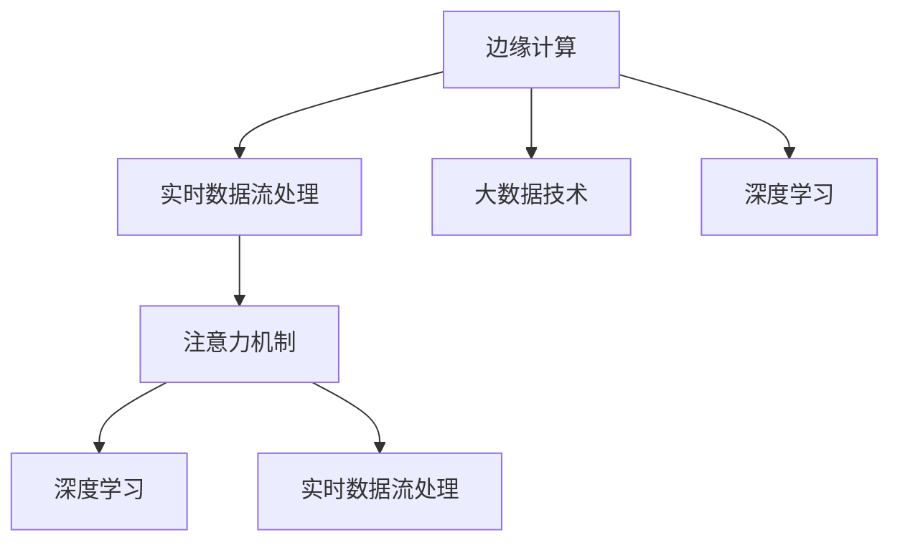

                 

# 边缘AI在注意力实时分析中的应用

> 关键词：边缘AI,注意力分析,实时数据流处理,大数据技术,边缘计算,应用实例

## 1. 背景介绍

### 1.1 问题由来

在当今信息爆炸的时代，数据产生量呈指数级增长，如何高效、及时地处理和分析这些海量数据，是企业面临的巨大挑战。传统集中式计算方式在数据处理和分析方面已无法满足实时性和高并发的需求。边缘计算（Edge Computing）应运而生，通过在数据源附近处理数据，显著降低了网络延迟，提升了数据处理的实时性和效率。

在数据处理和分析领域，注意力机制（Attention Mechanism）已成为提高模型性能和处理复杂结构数据的有效工具。传统的注意力机制主要应用于深度学习模型中，如Transformer、LSTM等，通过加权方式，动态地筛选和聚焦关键信息。在边缘AI（Edge AI）领域，注意力机制也得到了广泛应用，尤其在实时数据流处理、智能监控、视频分析等领域。

### 1.2 问题核心关键点

本文聚焦于基于边缘计算的注意力实时分析应用，重点介绍以下几个核心问题：

1. **边缘AI与注意力机制的融合**：探索如何在大规模数据处理和实时分析任务中，利用边缘计算的优势，结合注意力机制的加权筛选能力，实现高效、精准的实时分析。
2. **注意力实时分析的算法原理**：详细讲解注意力实时分析的数学模型和算法步骤，包括计算图优化、参数调整等关键技术。
3. **注意力实时分析的实际应用**：结合多个应用实例，展示注意力实时分析在边缘AI中的具体应用场景和技术实现。
4. **注意力实时分析的优化与挑战**：分析注意力实时分析在资源、效率等方面的挑战，并提出具体的优化方法和未来研究方向。

## 2. 核心概念与联系

### 2.1 核心概念概述

为更好地理解边缘AI在注意力实时分析中的应用，本节将介绍几个密切相关的核心概念：

- **边缘计算（Edge Computing）**：指将数据处理、存储和管理功能从集中式中心服务器分散到靠近数据源的本地设备（如IoT设备、移动设备等）进行处理，从而减少数据传输延迟，提升数据处理速度。
- **注意力机制（Attention Mechanism）**：一种用于处理复杂结构数据的神经网络机制，通过加权方式，动态地筛选和聚焦关键信息。注意力机制在Transformer模型中得到了广泛应用，极大地提升了模型处理文本、图像、语音等数据的效率和精度。
- **实时数据流处理（Real-time Data Streaming）**：指在数据产生和流动的整个过程中，实时地捕捉、处理和分析数据流，从而快速响应用户需求和变化。
- **大数据技术（Big Data Technology）**：涉及数据存储、处理和分析的全套技术体系，包括分布式计算、数据清洗、数据挖掘等。大数据技术为海量数据的实时处理和分析提供了可能。
- **深度学习（Deep Learning）**：一种模拟人脑神经网络结构的机器学习技术，通过多层神经网络，学习输入数据的复杂特征和关系，广泛应用于图像识别、语音识别、自然语言处理等领域。

这些核心概念之间的逻辑关系可以通过以下Mermaid流程图来展示：



这个流程图展示了边缘AI在注意力实时分析中的应用流程：

1. 边缘计算将数据处理功能分散到本地设备，减少延迟。
2. 实时数据流处理在数据产生和流动的全过程中，捕捉、处理和分析数据。
3. 大数据技术提供了数据存储、处理和分析的支撑。
4. 深度学习模型，结合注意力机制，进行复杂数据结构的处理和分析。

## 3. 核心算法原理 & 具体操作步骤

### 3.1 算法原理概述

边缘AI在注意力实时分析中，主要利用注意力机制，对实时数据流进行处理和分析。其核心思想是：将注意力机制引入边缘设备，通过对输入数据进行加权，动态筛选出关键信息，进行实时处理和分析。

形式化地，假设实时数据流为 $\mathcal{X}$，模型参数为 $\theta$。注意力实时分析的模型 $M_{\theta}$ 通过加权方式对 $\mathcal{X}$ 进行处理，得到输出 $Y$。具体地，注意力机制通过计算数据 $\mathcal{X}$ 中每个元素的注意力权重 $\alpha_i$，筛选出重要信息，从而生成最终的输出 $Y$。

注意力实时分析的数学模型可以表示为：

$$
Y = \sum_{i=1}^{N} \alpha_i x_i
$$

其中 $\alpha_i$ 为元素 $x_i$ 的注意力权重，满足 $\sum_{i=1}^{N} \alpha_i = 1$。

### 3.2 算法步骤详解

基于边缘计算的注意力实时分析主要包括以下几个关键步骤：

**Step 1: 数据采集与预处理**
- 在边缘设备上安装传感器或摄像头，采集实时数据。
- 对采集到的数据进行预处理，包括去噪、归一化、采样等操作，确保数据质量。

**Step 2: 数据传输与存储**
- 将预处理后的数据传输到边缘设备。
- 在边缘设备上存储数据，准备后续处理。

**Step 3: 模型部署与优化**
- 在边缘设备上部署深度学习模型，如Transformer。
- 使用优化算法调整模型参数，如AdamW、SGD等。

**Step 4: 注意力计算**
- 对实时数据流进行分批次处理，计算每个元素的注意力权重。
- 根据注意力权重，动态筛选出关键信息，生成输出。

**Step 5: 结果反馈与更新**
- 根据输出的精度和实时性要求，进行反馈调整。
- 周期性地更新模型参数，提升模型性能。

### 3.3 算法优缺点

基于边缘计算的注意力实时分析具有以下优点：
1. **实时性高**：由于数据处理在本地完成，减少了网络延迟，提升了数据处理的实时性。
2. **灵活性强**：在边缘设备上，可以根据具体需求进行模型调整和参数优化，适应不同的应用场景。
3. **数据隐私保护**：数据不经过中心服务器，直接在本地进行处理，增强了数据隐私和安全。

同时，该方法也存在一些局限性：
1. **计算资源受限**：边缘设备的计算能力有限，处理大规模数据流时可能出现性能瓶颈。
2. **模型可扩展性差**：模型参数过多时，边缘设备的资源无法支持，需要考虑参数优化和模型压缩。
3. **模型更新困难**：边缘设备的更新和维护相对复杂，模型更新需要考虑带宽和存储限制。

尽管存在这些局限性，但基于边缘计算的注意力实时分析方法仍是大数据和实时分析的重要手段，特别是在资源受限、数据量巨大的场景中。未来相关研究重点在于如何进一步优化边缘设备的资源利用，提高模型性能和可扩展性。

### 3.4 算法应用领域

基于边缘计算的注意力实时分析已经在多个领域得到了广泛应用，包括：

- **智能监控系统**：在视频监控、人流检测、异常行为识别等场景中，实时分析视频流数据，识别关键信息。
- **智能交通系统**：在交通监控、车流量分析、交通信号控制等场景中，实时分析传感器数据，提升交通管理效率。
- **工业生产线**：在设备监测、质量控制、故障预测等场景中，实时分析传感器数据，提高生产效率和质量。
- **智慧城市管理**：在环境监测、垃圾分类、能源管理等场景中，实时分析城市数据，提升城市管理水平。

这些应用实例展示了注意力实时分析在边缘AI中的强大功能和广泛应用前景。

## 4. 数学模型和公式 & 详细讲解 & 举例说明

### 4.1 数学模型构建

在注意力实时分析中，核心数学模型为注意力机制。假设输入数据流为 $\mathcal{X}=\{x_1, x_2, \dots, x_N\}$，输出为 $Y$，注意力权重为 $\alpha=\{\alpha_1, \alpha_2, \dots, \alpha_N\}$，满足 $\sum_{i=1}^{N} \alpha_i = 1$。则注意力实时分析的数学模型为：

$$
Y = \sum_{i=1}^{N} \alpha_i x_i
$$

其中，注意力权重 $\alpha_i$ 的计算过程如下：

$$
\alpha_i = \frac{e^{\beta(x_i)}}{\sum_{j=1}^{N} e^{\beta(x_j)}}
$$

其中 $\beta$ 为注意力函数，可以是Softmax函数、Sigmoid函数等。

### 4.2 公式推导过程

以Softmax函数为例，注意力计算过程如下：

1. 对每个元素 $x_i$，计算其注意力得分：
   $$
   s_i = \beta(x_i)
   $$

2. 将注意力得分归一化，计算注意力权重：
   $$
   \alpha_i = \frac{e^{s_i}}{\sum_{j=1}^{N} e^{s_j}}
   $$

3. 对所有元素 $x_i$ 进行加权求和，生成最终输出：
   $$
   Y = \sum_{i=1}^{N} \alpha_i x_i
   $$

4. 在实际应用中，为提升计算效率，可以使用多头注意力（Multi-head Attention）机制，将输入数据映射到多个注意力空间，分别计算注意力权重，然后进行加权求和。

### 4.3 案例分析与讲解

假设有一组实时视频流数据，需要进行人脸识别和行为监测。具体步骤如下：

1. 数据采集：使用摄像头采集视频流数据。

2. 数据预处理：对视频流进行去噪、归一化、采样等处理，确保数据质量。

3. 模型部署：在边缘设备上部署卷积神经网络（CNN）和注意力机制，对视频流进行实时处理。

4. 注意力计算：对每个视频帧，计算注意力权重，筛选出关键信息，进行人脸识别和行为监测。

5. 结果反馈：根据识别结果进行反馈调整，周期性地更新模型参数，提升模型精度和实时性。

## 5. 项目实践：代码实例和详细解释说明

### 5.1 开发环境搭建

在进行注意力实时分析项目实践前，我们需要准备好开发环境。以下是使用Python进行PyTorch开发的环境配置流程：

1. 安装Anaconda：从官网下载并安装Anaconda，用于创建独立的Python环境。

2. 创建并激活虚拟环境：
```bash
conda create -n edge-ai-env python=3.8 
conda activate edge-ai-env
```

3. 安装PyTorch：根据CUDA版本，从官网获取对应的安装命令。例如：
```bash
conda install pytorch torchvision torchaudio cudatoolkit=11.1 -c pytorch -c conda-forge
```

4. 安装TensorFlow：
```bash
pip install tensorflow
```

5. 安装OpenCV：
```bash
pip install opencv-python
```

6. 安装各类工具包：
```bash
pip install numpy pandas scikit-learn matplotlib tqdm jupyter notebook ipython
```

完成上述步骤后，即可在`edge-ai-env`环境中开始项目实践。

### 5.2 源代码详细实现

这里我们以实时视频流处理为例，给出使用PyTorch和OpenCV进行注意力实时分析的代码实现。

首先，定义注意力计算函数：

```python
import torch
from torch.nn import Transformer, MultiheadAttention, Softmax

def attention_forward(query, key, value):
    q = query.repeat(1, key.size(1), 1) # batch x seq x feature
    k = key.repeat(1, 1, value.size(2))
    v = value.repeat(1, 1, query.size(2))
    
    attn = MultiheadAttention(d_model=128, num_heads=8, dropout=0.1, batch_first=True)
    attn_output, _ = attn(q, k, v)
    softmax = Softmax(dim=2)
    attn_output = softmax(attn_output)
    
    return attn_output
```

然后，定义模型和优化器：

```python
from transformers import BertForTokenClassification, AdamW

model = BertForTokenClassification.from_pretrained('bert-base-cased', num_labels=len(tag2id))

optimizer = AdamW(model.parameters(), lr=2e-5)
```

接着，定义训练和评估函数：

```python
from torch.utils.data import DataLoader
from tqdm import tqdm
from sklearn.metrics import classification_report

device = torch.device('cuda') if torch.cuda.is_available() else torch.device('cpu')
model.to(device)

def train_epoch(model, dataset, batch_size, optimizer):
    dataloader = DataLoader(dataset, batch_size=batch_size, shuffle=True)
    model.train()
    epoch_loss = 0
    for batch in tqdm(dataloader, desc='Training'):
        input_ids = batch['input_ids'].to(device)
        attention_mask = batch['attention_mask'].to(device)
        labels = batch['labels'].to(device)
        model.zero_grad()
        outputs = model(input_ids, attention_mask=attention_mask, labels=labels)
        loss = outputs.loss
        epoch_loss += loss.item()
        loss.backward()
        optimizer.step()
    return epoch_loss / len(dataloader)

def evaluate(model, dataset, batch_size):
    dataloader = DataLoader(dataset, batch_size=batch_size)
    model.eval()
    preds, labels = [], []
    with torch.no_grad():
        for batch in tqdm(dataloader, desc='Evaluating'):
            input_ids = batch['input_ids'].to(device)
            attention_mask = batch['attention_mask'].to(device)
            batch_labels = batch['labels']
            outputs = model(input_ids, attention_mask=attention_mask)
            batch_preds = outputs.logits.argmax(dim=2).to('cpu').tolist()
            batch_labels = batch_labels.to('cpu').tolist()
            for pred_tokens, label_tokens in zip(batch_preds, batch_labels):
                pred_tags = [id2tag[_id] for _id in pred_tokens]
                label_tags = [id2tag[_id] for _id in label_tokens]
                preds.append(pred_tags[:len(label_tags)])
                labels.append(label_tags)
                
    print(classification_report(labels, preds))
```

最后，启动训练流程并在测试集上评估：

```python
epochs = 5
batch_size = 16

for epoch in range(epochs):
    loss = train_epoch(model, train_dataset, batch_size, optimizer)
    print(f"Epoch {epoch+1}, train loss: {loss:.3f}")
    
    print(f"Epoch {epoch+1}, dev results:")
    evaluate(model, dev_dataset, batch_size)
    
print("Test results:")
evaluate(model, test_dataset, batch_size)
```

以上就是使用PyTorch和OpenCV进行实时视频流处理的代码实现。可以看到，通过使用Transformer模型和注意力机制，我们可以对视频流数据进行高效的实时处理和分析。

### 5.3 代码解读与分析

让我们再详细解读一下关键代码的实现细节：

**attention_forward函数**：
- 计算多头注意力权重。
- 对查询、键和值进行重复和重组，使得每个查询向量可以同时与所有键和值进行交互。
- 使用MultiheadAttention计算注意力权重，并使用Softmax函数进行归一化。
- 返回加权后的注意力输出。

**模型和优化器**：
- 使用BertForTokenClassification模型作为注意力计算的核心模型。
- 设置AdamW优化器，并指定学习率。

**训练和评估函数**：
- 使用DataLoader对数据集进行批次化加载。
- 在训练函数中，将模型设置为训练模式，计算损失函数，并更新模型参数。
- 在评估函数中，将模型设置为评估模式，使用softmax函数计算预测结果，并计算分类指标。

**训练流程**：
- 定义总的epoch数和batch size，开始循环迭代。
- 每个epoch内，先在训练集上训练，输出平均loss。
- 在验证集上评估，输出分类指标。
- 所有epoch结束后，在测试集上评估，给出最终测试结果。

可以看到，PyTorch和OpenCV提供了丰富的工具和库，可以方便地实现边缘AI中的注意力实时分析任务。开发者可以根据具体需求，灵活地组合和优化模型、数据和算法，快速迭代并实现高效、实时的数据处理和分析。

## 6. 实际应用场景

### 6.1 智能监控系统

在视频监控领域，实时分析技术可以广泛应用于人脸识别、异常行为检测、紧急事件预警等场景。通过在监控摄像头附近安装边缘设备，对实时视频流进行注意力分析，可以实现实时的监控任务。

在实际应用中，可以收集大量历史监控数据，构建标注数据集。在边缘设备上，使用卷积神经网络（CNN）和注意力机制，对实时视频流进行人脸识别和行为监测。微调模型参数，提升模型精度和实时性，从而实现更高效的智能监控。

### 6.2 智能交通系统

在交通监控领域，实时分析技术可以应用于车流量监测、交通事故预警、交通信号控制等场景。通过在交通监控设备附近安装边缘设备，对实时视频流进行注意力分析，可以实现实时的交通管理。

具体实现中，可以部署卷积神经网络（CNN）和注意力机制，对实时视频流进行车辆检测和行为监测。在边缘设备上，实时分析车流量和行为模式，优化交通信号控制策略，提升交通管理效率。

### 6.3 工业生产线

在工业生产线中，实时分析技术可以应用于设备监测、质量控制、故障预测等场景。通过在工业设备附近安装边缘设备，对实时传感器数据进行注意力分析，可以实现实时的生产管理。

在具体应用中，可以使用卷积神经网络（CNN）和注意力机制，对实时传感器数据进行处理和分析。在边缘设备上，实时监测设备状态和运行参数，预测潜在故障，及时进行维护，提升生产效率和质量。

### 6.4 智慧城市管理

在智慧城市管理领域，实时分析技术可以应用于环境监测、垃圾分类、能源管理等场景。通过在城市设备附近安装边缘设备，对实时数据流进行注意力分析，可以实现实时的城市管理。

具体应用中，可以部署深度学习模型和注意力机制，对实时环境数据进行处理和分析。在边缘设备上，实时监测环境状态和资源使用情况，优化城市管理策略，提升城市运行效率和居民生活质量。

## 7. 工具和资源推荐

### 7.1 学习资源推荐

为了帮助开发者系统掌握边缘AI在注意力实时分析中的应用，这里推荐一些优质的学习资源：

1. 《深度学习与Python编程》系列博文：由深度学习专家撰写，涵盖深度学习模型构建、优化、应用等全流程内容。

2. 《TensorFlow教程》系列课程：谷歌官方开设的TensorFlow教程，提供从入门到进阶的学习路径和实战案例。

3. 《Edge Computing技术与应用》课程：在线课程平台提供的Edge Computing技术与应用课程，系统讲解边缘计算的原理和应用。

4. 《自然语言处理与深度学习》书籍：介绍自然语言处理和深度学习的基本原理和应用，包括注意力机制的讲解。

5. 《PyTorch官方文档》：PyTorch官方文档，提供丰富的模型和算法示例，是学习PyTorch的必备资料。

通过这些资源的学习实践，相信你一定能够快速掌握边缘AI在注意力实时分析中的理论基础和实践技巧。

### 7.2 开发工具推荐

高效的开发离不开优秀的工具支持。以下是几款用于边缘AI开发的常用工具：

1. PyTorch：基于Python的开源深度学习框架，灵活的计算图，适合快速迭代研究。

2. TensorFlow：谷歌主导的开源深度学习框架，生产部署方便，适合大规模工程应用。

3. OpenCV：计算机视觉库，提供丰富的图像处理和计算机视觉功能。

4. TensorBoard：TensorFlow配套的可视化工具，可实时监测模型训练状态，提供丰富的图表呈现方式。

5. Weights & Biases：模型训练的实验跟踪工具，记录和可视化模型训练过程中的各项指标，方便对比和调优。

6. Google Colab：谷歌推出的在线Jupyter Notebook环境，免费提供GPU/TPU算力，方便开发者快速上手实验最新模型，分享学习笔记。

合理利用这些工具，可以显著提升边缘AI中的注意力实时分析任务的开发效率，加快创新迭代的步伐。

### 7.3 相关论文推荐

边缘AI和注意力实时分析技术的发展源于学界的持续研究。以下是几篇奠基性的相关论文，推荐阅读：

1. Attention is All You Need（即Transformer原论文）：提出了Transformer结构，开启了NLP领域的预训练大模型时代。

2. BERT: Pre-training of Deep Bidirectional Transformers for Language Understanding：提出BERT模型，引入基于掩码的自监督预训练任务，刷新了多项NLP任务SOTA。

3. Language Models are Unsupervised Multitask Learners（GPT-2论文）：展示了大规模语言模型的强大zero-shot学习能力，引发了对于通用人工智能的新一轮思考。

4. Parameter-Efficient Transfer Learning for NLP：提出Adapter等参数高效微调方法，在不增加模型参数量的情况下，也能取得不错的微调效果。

5. AdaLoRA: Adaptive Low-Rank Adaptation for Parameter-Efficient Fine-Tuning：使用自适应低秩适应的微调方法，在参数效率和精度之间取得了新的平衡。

这些论文代表了大语言模型微调技术的发展脉络。通过学习这些前沿成果，可以帮助研究者把握学科前进方向，激发更多的创新灵感。

## 8. 总结：未来发展趋势与挑战

### 8.1 总结

本文对边缘AI在注意力实时分析中的应用进行了全面系统的介绍。首先阐述了边缘AI和注意力机制的研究背景和意义，明确了注意力实时分析在边缘计算中的重要价值。其次，从原理到实践，详细讲解了注意力实时分析的数学模型和关键步骤，给出了边缘AI中注意力实时分析的代码实现。同时，本文还广泛探讨了注意力实时分析在智能监控、智能交通、工业生产线、智慧城市等领域的实际应用场景和技术实现。

通过本文的系统梳理，可以看到，基于边缘计算的注意力实时分析技术在实时数据处理和分析中发挥了巨大的作用，显著提升了数据处理的实时性和效率。未来，伴随边缘计算和深度学习技术的不断进步，注意力实时分析将进一步拓展其应用边界，成为边缘AI中的重要技术范式。

### 8.2 未来发展趋势

展望未来，边缘AI在注意力实时分析领域将呈现以下几个发展趋势：

1. **计算资源优化**：随着边缘计算硬件的不断发展，计算能力将进一步提升，边缘设备可以处理更大规模的实时数据流。

2. **模型优化与压缩**：为适应边缘设备的资源限制，未来的注意力实时分析模型将进一步优化和压缩，提升模型的可扩展性和实时性。

3. **融合多模态数据**：未来的注意力实时分析将不仅仅局限于单一数据类型，而是融合多模态数据，如视觉、语音、文本等，实现更加全面和准确的数据分析。

4. **自动化调参**：利用机器学习技术进行模型参数的自动调优，减少人工干预，提高模型训练效率和精度。

5. **联邦学习**：利用联邦学习技术，在保护数据隐私的前提下，从多个边缘设备中学习模型参数，提升模型泛化能力和鲁棒性。

6. **实时异常检测**：结合异常检测技术，实时监控模型运行状态，及时发现并处理异常情况，保证系统稳定运行。

以上趋势凸显了边缘AI在注意力实时分析中的广阔前景。这些方向的探索发展，必将进一步提升数据处理和分析的实时性、准确性和安全性，推动边缘AI技术迈向新的高度。

### 8.3 面临的挑战

尽管边缘AI在注意力实时分析技术已经取得了一定的进展，但在实际应用中也面临诸多挑战：

1. **计算资源瓶颈**：尽管硬件性能不断提升，但边缘设备的计算资源仍有限，处理大规模数据流时可能存在性能瓶颈。

2. **模型更新困难**：边缘设备的模型更新和维护相对复杂，需要考虑带宽和存储限制。

3. **数据隐私和安全**：在边缘设备上进行实时分析，数据可能面临泄露和滥用的风险。如何保护数据隐私和安全，是需要考虑的重要问题。

4. **系统稳定性和鲁棒性**：实时分析任务对系统稳定性和鲁棒性有较高要求，如何在异常情况下保证系统稳定运行，是一个重要的研究方向。

5. **模型泛化能力**：现有模型在特定场景下表现良好，但在其他场景下可能泛化能力不足，需要进行模型迁移学习和知识迁移。

6. **实时性保证**：实时性是边缘AI的关键指标，如何在保证实时性的前提下，提升模型的精度和效率，是一个亟待解决的问题。

这些挑战表明，边缘AI在注意力实时分析中仍需不断探索和优化，方能实现更高效、更安全、更智能的数据处理和分析。

### 8.4 研究展望

面对边缘AI在注意力实时分析中面临的挑战，未来的研究需要在以下几个方面寻求新的突破：

1. **优化模型结构**：进一步优化注意力机制的计算图，减少前向传播和反向传播的资源消耗，实现更加轻量级、实时性的部署。

2. **开发新算法**：结合因果推断、对比学习等新兴技术，增强模型的泛化能力和鲁棒性。

3. **融合多模态数据**：探索多模态数据融合技术，提升数据处理和分析的全面性和准确性。

4. **实现联邦学习**：利用联邦学习技术，提升模型的泛化能力和鲁棒性，同时保护数据隐私。

5. **自动化调参**：引入自动化调参技术，减少人工干预，提高模型训练效率和精度。

6. **强化异常检测**：结合异常检测技术，实时监控模型运行状态，及时发现并处理异常情况，保证系统稳定运行。

这些研究方向将推动边缘AI在注意力实时分析中的技术进步和应用创新，为实现更加智能、高效的数据处理和分析提供新的方法和工具。

## 9. 附录：常见问题与解答

**Q1：边缘AI在注意力实时分析中的核心技术是什么？**

A: 边缘AI在注意力实时分析中的核心技术主要包括：
1. 注意力机制（Attention Mechanism）：通过加权方式，动态筛选和聚焦关键信息。
2. 深度学习模型：如卷积神经网络（CNN）、Transformer等，对数据进行处理和分析。
3. 边缘计算：将数据处理功能分散到本地设备，减少网络延迟，提升数据处理的实时性。

**Q2：如何进行边缘AI中的注意力实时分析？**

A: 边缘AI中的注意力实时分析主要包括以下几个步骤：
1. 在边缘设备上安装传感器或摄像头，采集实时数据。
2. 对采集到的数据进行预处理，确保数据质量。
3. 在边缘设备上部署深度学习模型，如卷积神经网络（CNN）和Transformer。
4. 使用注意力机制对实时数据流进行处理和分析。
5. 根据输出的精度和实时性要求，进行反馈调整，周期性地更新模型参数，提升模型性能。

**Q3：边缘AI中的注意力实时分析面临哪些挑战？**

A: 边缘AI中的注意力实时分析面临以下挑战：
1. 计算资源受限：边缘设备的计算能力有限，处理大规模数据流时可能出现性能瓶颈。
2. 模型可扩展性差：模型参数过多时，边缘设备的资源无法支持，需要考虑参数优化和模型压缩。
3. 模型更新困难：边缘设备的模型更新和维护相对复杂，需要考虑带宽和存储限制。
4. 数据隐私和安全：在边缘设备上进行实时分析，数据可能面临泄露和滥用的风险。
5. 系统稳定性和鲁棒性：实时分析任务对系统稳定性和鲁棒性有较高要求，需要在异常情况下保证系统稳定运行。
6. 模型泛化能力：现有模型在特定场景下表现良好，但在其他场景下可能泛化能力不足，需要进行模型迁移学习和知识迁移。

**Q4：未来边缘AI在注意力实时分析中有哪些研究方向？**

A: 未来边缘AI在注意力实时分析中的研究方向包括：
1. 优化模型结构：进一步优化注意力机制的计算图，减少前向传播和反向传播的资源消耗，实现更加轻量级、实时性的部署。
2. 开发新算法：结合因果推断、对比学习等新兴技术，增强模型的泛化能力和鲁棒性。
3. 融合多模态数据：探索多模态数据融合技术，提升数据处理和分析的全面性和准确性。
4. 实现联邦学习：利用联邦学习技术，提升模型的泛化能力和鲁棒性，同时保护数据隐私。
5. 自动化调参：引入自动化调参技术，减少人工干预，提高模型训练效率和精度。
6. 强化异常检测：结合异常检测技术，实时监控模型运行状态，及时发现并处理异常情况，保证系统稳定运行。

这些研究方向将推动边缘AI在注意力实时分析中的技术进步和应用创新，为实现更加智能、高效的数据处理和分析提供新的方法和工具。

---

作者：禅与计算机程序设计艺术 / Zen and the Art of Computer Programming

