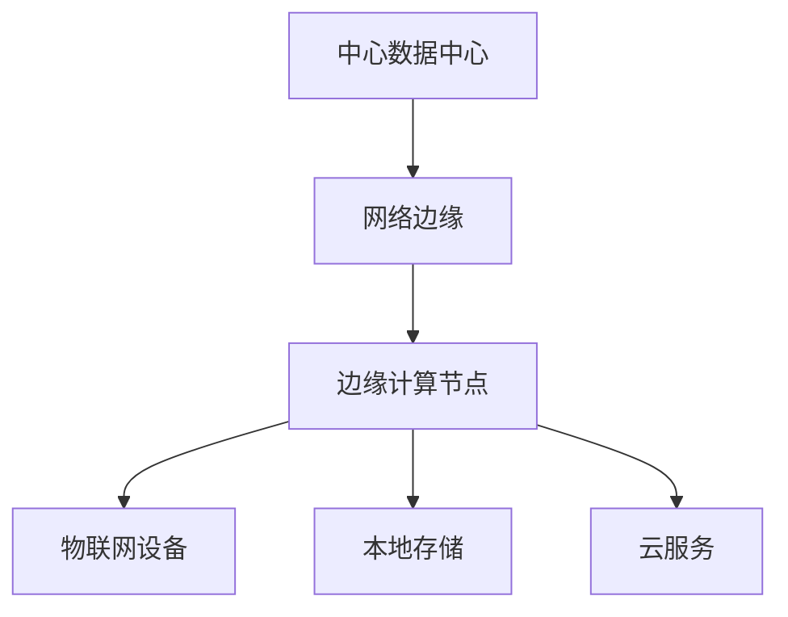

                 

# 边缘计算：5G时代的分布式处理方案

## 1. 背景介绍

### 1.1 问题由来
随着5G时代的到来，万物互联成为可能，数据量和计算需求呈指数级增长。传统的中心化数据中心模式难以满足实时、低延迟的要求。与此同时，云计算的成本不断攀升，数据隐私和安全问题日益突出。这些因素共同催生了边缘计算（Edge Computing）这一新兴技术，通过将计算任务和数据分散在网络边缘，实现分布式处理和智能决策。

### 1.2 问题核心关键点
边缘计算通过将计算和数据处理分布在网络的边缘，能够极大地降低延迟、提高效率、增强安全性，同时显著减少对中心数据中心的依赖。在5G时代，边缘计算成为满足低时延、高带宽、高安全性的关键技术，并将在智能制造、智能交通、智慧城市等多个领域发挥重要作用。

## 2. 核心概念与联系

### 2.1 核心概念概述
边缘计算是一种分布式计算模式，通过将数据和计算任务分布到网络边缘的节点上，实现更接近数据源的计算和处理。5G网络的广泛部署和物联网设备的大规模接入，使得边缘计算具备了实现的技术基础和市场需求。

5G网络提供的高带宽、低时延、高可靠性和大连接密度等特性，为边缘计算提供了良好的网络环境支持。同时，边缘计算和5G网络的结合，可以更好地应对视频流、物联网数据、实时控制等对低延迟和高效处理的需求。

### 2.2 核心概念原理和架构的 Mermaid 流程图


在上述流程图中，数据和计算任务从中心数据中心被分散到边缘计算节点上，物联网设备通过边缘计算节点进行本地处理，而本地存储和云服务则提供计算和数据管理能力。

## 3. 核心算法原理 & 具体操作步骤

### 3.1 算法原理概述
边缘计算的核心思想是将数据处理任务分布到网络的边缘节点上，使其更接近数据源，从而减少数据传输延迟，提高处理效率。这种分布式计算模式主要包括以下几个步骤：

1. **数据采集**：物联网设备采集数据，并发送到最近的边缘计算节点。
2. **数据预处理**：边缘计算节点对采集的数据进行初步处理和清洗，去除噪声和冗余。
3. **数据存储**：处理后的数据被存储在边缘计算节点上，或通过本地存储设备保存。
4. **计算任务执行**：边缘计算节点根据预设的算法和模型，执行本地计算任务。
5. **结果处理和反馈**：计算结果被传输到中心数据中心或其他节点，进行进一步处理和分析，并反馈到相应的设备或用户。

### 3.2 算法步骤详解
以下是边缘计算的详细步骤：

1. **设备部署**：在网络边缘部署边缘计算节点，并确保其具备足够的计算和存储能力。
2. **数据采集和路由**：通过5G网络将数据从物联网设备传输到最近的边缘计算节点。
3. **边缘处理**：边缘计算节点对数据进行初步处理，并执行计算任务。
4. **结果处理和上传**：将处理结果上传至中心数据中心或其他节点，进行进一步分析和决策。
5. **优化与维护**：持续监控和优化边缘计算节点，确保其高效稳定运行。

### 3.3 算法优缺点
边缘计算的优势在于：

- **降低延迟**：数据处理在网络边缘进行，减少了数据传输的时延，提高了响应速度。
- **提高效率**：边缘计算可以实时处理数据，减少了对中心数据中心的依赖。
- **增强安全性**：数据在本地进行处理，减少了数据泄露的风险，提高了数据隐私保护。
- **减少带宽消耗**：边缘计算可以本地处理部分数据，减少了向中心数据中心的传输带宽需求。

但边缘计算也存在以下缺点：

- **硬件资源限制**：边缘计算节点需要具备较强的计算和存储能力，初期投资成本较高。
- **管理复杂性**：边缘计算系统的管理和维护相对复杂，需要考虑多节点之间的协作和资源调度。
- **网络带宽依赖**：边缘计算依赖于良好的网络环境，网络故障可能影响整个系统的稳定性。

### 3.4 算法应用领域
边缘计算广泛应用于以下几个领域：

- **智能制造**：通过在生产线上部署边缘计算节点，实现实时监控、预测维护和质量控制。
- **智能交通**：利用边缘计算节点处理交通数据，优化交通流量和路径规划。
- **智慧城市**：在城市基础设施上部署边缘计算节点，实现实时监控、应急响应和智能决策。
- **医疗健康**：通过边缘计算节点处理传感器数据，实现实时监测和远程医疗服务。
- **零售物流**：在零售和物流节点上部署边缘计算节点，实现库存管理、配送优化和客户服务。

## 4. 数学模型和公式 & 详细讲解 & 举例说明

### 4.1 数学模型构建
假设在网络边缘有 $n$ 个计算节点，每个节点 $i$ 的计算能力为 $C_i$，存储能力为 $S_i$。设数据量为 $D$，计算任务为 $T$。每个节点的计算任务量为 $T_i$，数据量为 $D_i$。

模型目标是最小化总体延迟 $L$，即：

$$
L = \sum_{i=1}^n \max(T_i/C_i, D_i/S_i)
$$

其中 $\max(T_i/C_i, D_i/S_i)$ 表示节点 $i$ 的延迟，包括计算延迟和数据传输延迟。

### 4.2 公式推导过程
1. **计算延迟**：
$$
\text{计算延迟} = \frac{T_i}{C_i}
$$

2. **数据传输延迟**：
$$
\text{数据传输延迟} = \frac{D_i}{\text{传输速率} \times S_i}
$$

综合计算延迟和数据传输延迟，得到总延迟：

$$
L = \sum_{i=1}^n \max\left(\frac{T_i}{C_i}, \frac{D_i}{\text{传输速率} \times S_i}\right)
$$

### 4.3 案例分析与讲解
考虑一个智能工厂的例子，工厂有10个生产线和10个边缘计算节点。每个计算节点的计算能力为100GOPs，存储能力为2TB。每个生产线的数据量为1GB，计算任务量为10GB。

假设数据传输速率为1Gbps，则每个节点的传输延迟为：

$$
\frac{1\text{GB}}{1\text{Gbps} \times 2\text{TB}} = 0.0005\text{s}
$$

计算延迟为：

$$
\frac{10\text{GB}}{100\text{GOPs}} = 0.1\text{s}
$$

因此，每个节点的延迟为：

$$
\max(0.1\text{s}, 0.0005\text{s}) = 0.1\text{s}
$$

总体延迟为：

$$
L = \sum_{i=1}^{10} 0.1\text{s} = 1\text{s}
$$

该模型展示了如何通过优化计算资源和存储资源，减少延迟，提高系统效率。

## 5. 项目实践：代码实例和详细解释说明

### 5.1 开发环境搭建
在进行边缘计算项目开发前，需要准备以下开发环境：

1. **Python开发环境**：安装Python 3.x版本，并确保pip和virtualenv等工具可用。
2. **边缘计算框架**：安装Kubernetes、FaaS（函数即服务）框架如OpenFaaS或AWS Lambda。
3. **边缘计算节点**：选择合适的物理或虚拟节点，并确保具备足够的计算和存储资源。
4. **网络环境**：搭建5G网络或使用模拟器，模拟网络环境。

### 5.2 源代码详细实现
以下是使用Python和OpenFaaS框架实现边缘计算节点的代码示例：

```python
import requests
from flask import Flask

app = Flask(__name__)

@app.route('/')
def hello_world():
    return 'Hello, World!'

if __name__ == '__main__':
    app.run(host='0.0.0.0', port=8080)
```

在上述代码中，使用Flask框架创建了一个简单的Web服务，当访问根路径时，返回“Hello, World!”。

### 5.3 代码解读与分析
- **Flask框架**：用于快速创建Web服务，提供了简单的路由和HTTP请求处理能力。
- **API接口设计**：通过RESTful API接口，实现数据采集、处理和反馈。
- **容器化部署**：将Web服务部署在容器化环境中，方便管理和扩展。
- **负载均衡**：使用Kubernetes进行负载均衡，确保服务高可用性。

### 5.4 运行结果展示
通过在边缘计算节点上部署上述代码，可以实现数据采集和处理功能。例如，可以将物联网设备采集的数据通过API接口上传到边缘计算节点，然后对数据进行处理和分析，并将结果返回给用户。

## 6. 实际应用场景

### 6.1 智能制造
在智能制造领域，边缘计算可以实时处理生产线上的数据，实现设备状态监控、故障预测和智能维护。例如，通过在生产线上部署边缘计算节点，采集设备传感器数据，执行实时数据分析和机器学习模型，优化设备运行状态，减少停机时间，提高生产效率。

### 6.2 智能交通
在智能交通领域，边缘计算可以处理来自交通传感器的数据，优化交通流量和路径规划。例如，通过在城市交通网络中部署边缘计算节点，采集交通数据，进行实时分析，调整交通信号灯和路线，减少交通拥堵，提高出行效率。

### 6.3 智慧城市
在智慧城市领域，边缘计算可以实现实时监控、应急响应和智能决策。例如，通过在城市基础设施上部署边缘计算节点，采集各类传感器数据，执行数据分析和预测，优化城市管理，提高服务质量和居民满意度。

### 6.4 医疗健康
在医疗健康领域，边缘计算可以实现实时监测和远程医疗服务。例如，通过在医疗设备上部署边缘计算节点，采集生理数据，进行实时分析和处理，实现远程监控和诊断，提高医疗服务效率和质量。

### 6.5 零售物流
在零售物流领域，边缘计算可以实现库存管理、配送优化和客户服务。例如，通过在零售和物流节点上部署边缘计算节点，采集库存和配送数据，执行实时分析和处理，优化库存管理和配送路径，提高供应链效率和客户服务质量。

## 7. 工具和资源推荐

### 7.1 学习资源推荐

1. **《边缘计算：5G时代的分布式处理方案》**：详细介绍边缘计算的原理和应用，适合初学者和进阶者学习。
2. **《Kubernetes官方文档》**：提供Kubernetes的详细介绍和最佳实践，适合Kubernetes开发者学习。
3. **《TensorFlow for Edge Computing》**：介绍TensorFlow在边缘计算中的应用，适合TensorFlow开发者学习。
4. **《5G网络技术与应用》**：详细介绍5G网络技术及其在边缘计算中的应用，适合网络工程师学习。
5. **《物联网架构与设计》**：介绍物联网架构及其在边缘计算中的应用，适合物联网开发者学习。

### 7.2 开发工具推荐

1. **Kubernetes**：Kubernetes是当前最流行的容器编排工具，适用于边缘计算节点的管理与调度。
2. **OpenFaaS**：OpenFaaS是一个轻量级的函数即服务框架，适用于边缘计算节点的快速部署和扩展。
3. **Flask**：Flask是一个Python Web框架，适用于边缘计算节点上的简单应用开发。
4. **AWS Lambda**：AWS Lambda是亚马逊云上的函数即服务，适用于边缘计算节点的扩展和优化。
5. **TensorFlow**：TensorFlow是一个流行的深度学习框架，适用于边缘计算节点上的机器学习和数据处理。

### 7.3 相关论文推荐

1. **《边缘计算：一种分布式计算范式》**：介绍边缘计算的原理和应用场景，适合研究者阅读。
2. **《5G网络与边缘计算的融合》**：介绍5G网络与边缘计算的结合，适合网络工程师阅读。
3. **《物联网架构与边缘计算》**：介绍物联网架构及其在边缘计算中的应用，适合物联网开发者阅读。
4. **《深度学习在边缘计算中的应用》**：介绍深度学习在边缘计算中的应用，适合机器学习开发者阅读。
5. **《边缘计算的安全性与隐私保护》**：介绍边缘计算的安全性和隐私保护，适合开发者阅读。

## 8. 总结：未来发展趋势与挑战

### 8.1 研究成果总结
边缘计算和5G技术的结合，为分布式计算和数据处理提供了新的可能性。通过在网络边缘部署计算和存储资源，实现了数据处理的高效化和本地化，满足了实时性和低延迟的需求。

### 8.2 未来发展趋势
未来，边缘计算将继续扩展其应用范围，与AI、IoT等技术深度融合，推动智能制造、智能交通、智慧城市等领域的智能化转型。同时，边缘计算的硬件和软件技术也将不断进步，降低成本，提高性能，为更多人提供便捷的计算服务。

### 8.3 面临的挑战
尽管边缘计算带来了诸多优势，但也面临以下挑战：

1. **硬件成本高**：边缘计算节点的初期投资成本较高，需要具备较强的计算和存储能力。
2. **管理和维护复杂**：边缘计算系统的管理和维护相对复杂，需要考虑多节点之间的协作和资源调度。
3. **网络带宽依赖**：边缘计算依赖于良好的网络环境，网络故障可能影响整个系统的稳定性。
4. **安全性和隐私保护**：边缘计算涉及大量的敏感数据，需要采取有效的安全措施和隐私保护策略。

### 8.4 研究展望
未来，边缘计算的研究将集中在以下几个方向：

1. **资源优化**：优化计算资源和存储资源的分配，降低成本，提高效率。
2. **跨域协作**：实现不同边缘计算节点之间的协同工作，提高整体性能。
3. **应用拓展**：将边缘计算应用于更多行业，实现更广泛的应用。
4. **安全性提升**：提高边缘计算的安全性和隐私保护能力，确保数据安全。
5. **AI融合**：将边缘计算与AI技术深度融合，推动智能应用的普及和发展。

## 9. 附录：常见问题与解答

**Q1：边缘计算和云计算的区别是什么？**

A: 边缘计算和云计算的区别在于数据处理的位置和处理方式。云计算将数据集中存储在数据中心进行处理，而边缘计算将数据处理任务分布在网络的边缘节点上。边缘计算能够降低数据传输延迟，提高处理效率，适合实时性要求较高的应用。

**Q2：如何选择合适的边缘计算节点？**

A: 选择合适的边缘计算节点需要考虑计算能力、存储能力、网络带宽、安全性等因素。通常需要选择具备较强计算和存储能力的物理或虚拟节点，并确保网络带宽和安全性符合应用需求。

**Q3：边缘计算中的数据隐私和安全问题如何解决？**

A: 边缘计算中的数据隐私和安全问题可以通过以下方式解决：

1. **数据加密**：对传输和存储的数据进行加密，确保数据安全。
2. **访问控制**：通过身份验证和授权机制，控制对边缘计算节点的访问。
3. **本地处理**：尽量在本地处理数据，减少数据传输的风险。
4. **安全协议**：采用安全通信协议，如TLS/SSL，确保数据传输的安全性。

**Q4：边缘计算的部署和管理有哪些最佳实践？**

A: 边缘计算的部署和管理需要考虑以下几个最佳实践：

1. **负载均衡**：通过负载均衡机制，确保边缘计算节点的合理利用和高效运行。
2. **自动化管理**：采用自动化管理工具，如Kubernetes，简化边缘计算节点的部署和管理。
3. **监控和优化**：持续监控边缘计算节点的运行状态，及时发现和解决问题。
4. **备份和恢复**：建立数据备份和恢复机制，确保数据安全和系统可靠性。

**Q5：边缘计算的应用场景有哪些？**

A: 边缘计算的应用场景非常广泛，主要包括以下几个领域：

1. **智能制造**：实现实时监控、故障预测和智能维护。
2. **智能交通**：优化交通流量和路径规划。
3. **智慧城市**：实现实时监控、应急响应和智能决策。
4. **医疗健康**：实现实时监测和远程医疗服务。
5. **零售物流**：优化库存管理和配送路径。

综上所述，边缘计算作为一种分布式计算模式，结合5G技术，将在未来的各个领域发挥重要作用，推动智能化、自动化、实时化发展。通过不断优化和创新，边缘计算必将成为未来智能社会的重要基础设施。

---

作者：禅与计算机程序设计艺术 / Zen and the Art of Computer Programming

