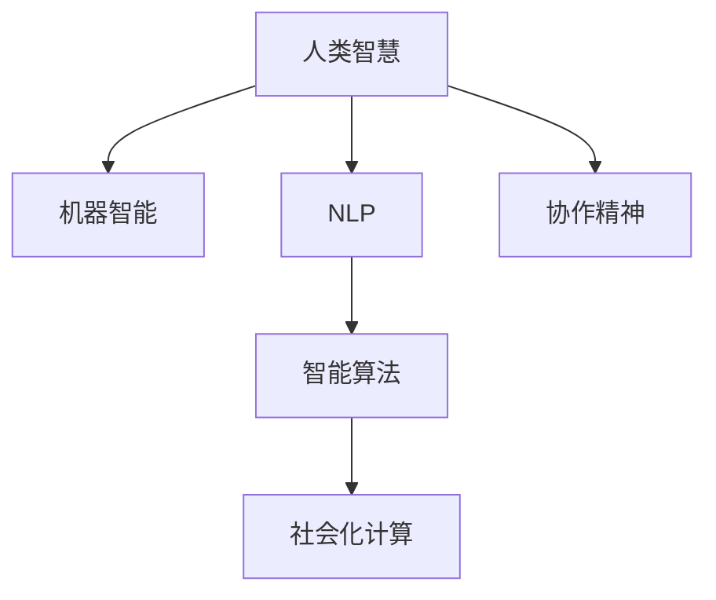

                 

# 连接人类智慧的纽带：人类计算的协作精神

> 关键词：人类计算,协作精神,智能算法,自然语言处理,NLP,人工智能,社会化计算

## 1. 背景介绍

### 1.1 问题由来
随着信息技术的飞速发展，人类社会正在经历一场深刻的数字化转型。数字化技术正在重塑我们的生产方式、工作模式和生活习惯，成为推动经济社会进步的强大引擎。然而，在数字化进程中，人类智慧与机器智能的界限变得模糊，如何更好地融合这两大智慧，实现最优的协作效果，成为了一个重要的研究课题。

### 1.2 问题核心关键点
当前，机器智能在许多领域已经展现出了强大的能力，但在理解和应用人类智慧方面仍存在诸多挑战。人类智慧主要体现在语言、情感、创造力、伦理道德等方面，而机器智能目前在这方面的理解和应用还处于初级阶段。如何实现人类智慧与机器智能的深度融合，成为智能化技术发展的重要方向。

### 1.3 问题研究意义
人类计算的协作精神，旨在通过跨领域的创新与合作，挖掘和融合人类智慧与机器智能的潜力，构建更加智能、灵活、高效的社会系统。通过研究人类计算的协作精神，不仅能够提升机器智能在实际应用中的效果，还能为社会经济的发展提供新的动力，促进人类与机器的和谐共生。

## 2. 核心概念与联系

### 2.1 核心概念概述

为更好地理解人类计算的协作精神，本节将介绍几个关键概念：

- **人类智慧**：指人类的语言、情感、创造力、伦理道德等方面的智能。包括对自然语言、社会情感、文化价值等方面的理解和应用。

- **机器智能**：指通过算法、模型、硬件等技术手段，实现的机器的感知、推理、决策、执行等能力。包括基于深度学习、强化学习等技术实现的视觉、语音、自然语言处理等任务。

- **自然语言处理（NLP）**：指利用计算机处理、理解和生成人类语言的技术，是实现人类智慧与机器智能协作的重要桥梁。

- **智能算法**：指能够模拟人类思维过程，解决复杂问题的算法。包括机器学习、深度学习、自然语言处理等算法。

- **社会化计算**：指利用社会网络、协作平台等工具，进行大规模数据共享和协作的计算模式。包括社交网络分析、数据众包、集体智慧挖掘等。

这些概念之间的联系可以通过以下Mermaid流程图来展示：



这个流程图展示了人类智慧与机器智能之间通过NLP、智能算法和社会化计算的协作路径，以及协作精神在其中扮演的重要角色。

## 3. 核心算法原理 & 具体操作步骤
### 3.1 算法原理概述

人类计算的协作精神，主要通过自然语言处理、智能算法和社会化计算三种技术手段实现。其核心思想是将人类智慧与机器智能进行深度融合，通过协同工作和数据共享，提升系统的智能水平。

形式化地，假设人类智慧和机器智能分别为 $H$ 和 $M$，通过以下步骤进行协作：

1. **NLP技术**：将人类智慧转化为计算机可处理的形式，即语言数据。
2. **智能算法**：利用机器智能对语言数据进行处理和分析，得到深度特征表示。
3. **社会化计算**：将深度特征表示进行共享和协同处理，得到更加全面的智能结果。
4. **反馈机制**：将智能结果反馈给人类智慧，进行调整和优化。

### 3.2 算法步骤详解

人类计算的协作精神主要包括以下几个关键步骤：

**Step 1: 数据采集与预处理**
- 收集人类智慧相关的文本、语音、图像等数据。
- 对数据进行清洗、分词、标注等预处理，提取有意义的特征信息。

**Step 2: 语言数据处理**
- 利用NLP技术，将语言数据转换为计算机可理解的形式，如词向量、句向量等。
- 通过语言模型对文本数据进行建模，捕捉语言结构的深层次特征。

**Step 3: 特征表示与智能算法**
- 将语言数据输入深度学习模型（如BERT、GPT等），进行特征表示学习。
- 利用智能算法（如迁移学习、强化学习、逻辑推理等）对特征表示进行进一步处理，得到深度智能结果。

**Step 4: 社会化计算与协同优化**
- 将深度智能结果通过社交网络、协作平台等工具进行共享和协同处理。
- 利用集体智慧，进行模型优化和参数更新，提升智能结果的准确性和全面性。

**Step 5: 反馈与优化**
- 将智能结果反馈给人类智慧，通过人工调整和优化，进一步提升系统的性能。
- 循环迭代上述步骤，不断提升系统的智能水平。

### 3.3 算法优缺点

人类计算的协作精神具有以下优点：
1. 融合多源数据：通过融合多种数据来源，提升系统的智能水平和可靠性。
2. 增强鲁棒性：社会化计算可以降低个体误判的风险，提升系统的鲁棒性和鲁棒性。
3. 加速创新：通过跨领域的协同合作，加速新知识、新技术的发现和应用。
4. 提升用户体验：利用人类智慧与机器智能的深度融合，提升系统的交互体验和用户满意度。

同时，该方法也存在一些局限性：
1. 数据隐私风险：在数据共享和协同处理过程中，可能涉及隐私泄露问题。
2. 技术复杂性：协同合作需要多方面的技术支持，实施难度较大。
3. 用户接受度：用户对机器智能的信任和接受程度，对协作精神的实施效果有重要影响。
4. 资源消耗：协同合作需要大量的计算资源和时间，可能影响系统的响应速度。

尽管存在这些局限性，但人类计算的协作精神仍是目前智能技术发展的重要方向，能够为实现更加智能、灵活、高效的社会系统提供新的解决方案。

### 3.4 算法应用领域

人类计算的协作精神在多个领域中得到了广泛应用，例如：

- **医疗领域**：通过智能算法和社交网络，实现疾病诊断、药物研发、健康监测等功能。
- **教育领域**：利用智能算法和协作平台，进行在线教育、知识共享、个性化学习等应用。
- **金融领域**：通过智能算法和社交网络，实现风险评估、投资决策、客户服务等功能。
- **娱乐领域**：利用智能算法和协作平台，进行内容推荐、互动体验、虚拟现实等应用。
- **交通领域**：通过智能算法和协作平台，实现智能交通、车联网、自动驾驶等功能。

除了上述这些典型应用外，人类计算的协作精神还在更多领域中得到了应用，为社会经济的发展注入了新的活力。

## 4. 数学模型和公式 & 详细讲解  
### 4.1 数学模型构建

本节将使用数学语言对人类计算的协作精神进行更加严格的刻画。

记人类智慧和机器智能分别为 $H$ 和 $M$，假设通过自然语言处理 $C$ 将其转化为语言数据 $X$，利用智能算法 $A$ 进行特征表示学习，得到深度智能结果 $Y$。社会化计算 $S$ 通过协同处理得到优化后的智能结果 $Y'$，最终通过反馈机制 $F$ 对智能结果进行优化。

形式化地，协作精神的数学模型可以表示为：

$$
Y' = F(S(A(C(H))))
$$

### 4.2 公式推导过程

以医疗诊断为例，详细推导协作精神的数学模型：

- **数据采集与预处理**：
  - 假设从病人信息数据库中收集到病历文本 $H$，进行清洗、分词、标注等预处理，得到语言数据 $X$。
  - 假设 $C$ 将病历文本 $H$ 转换为词向量表示 $X$。

- **语言数据处理**：
  - 利用预训练语言模型（如BERT）对词向量 $X$ 进行建模，得到句向量表示 $Y$。
  - 假设 $A$ 将句向量 $Y$ 输入到深度学习模型中，得到疾病诊断结果 $Y$。

- **特征表示与智能算法**：
  - 假设 $A$ 将疾病诊断结果 $Y$ 进行特征表示学习，得到深度特征向量 $Z$。
  - 假设 $M$ 将深度特征向量 $Z$ 输入到智能算法中，得到深度智能结果 $Y'$。

- **社会化计算与协同优化**：
  - 假设 $S$ 将深度智能结果 $Y'$ 通过社交网络进行共享和协同处理，得到优化后的智能结果 $Y'^*$。
  - 假设 $F$ 将优化后的智能结果 $Y'^*$ 反馈给人类智慧 $H$，进行人工调整和优化。

- **反馈与优化**：
  - 假设 $F$ 将优化后的智能结果 $Y'^*$ 重新输入到深度学习模型中，得到新的深度智能结果 $Y'$。
  - 假设 $Y'$ 再次通过社会化计算和协同优化，得到更加准确的智能结果 $Y'^{**}$。

通过上述推导，可以看到人类计算的协作精神是如何通过多层次、多领域的协同合作，实现智能结果的不断优化和提升。

### 4.3 案例分析与讲解

以智能客服系统为例，详细分析协作精神的实际应用：

1. **数据采集与预处理**：
   - 收集历史客服对话记录，进行清洗、分词、标注等预处理，得到语言数据。

2. **语言数据处理**：
   - 利用BERT模型将语言数据转换为句向量表示。

3. **特征表示与智能算法**：
   - 利用深度学习模型对句向量进行建模，得到意图分类结果。

4. **社会化计算与协同优化**：
   - 将意图分类结果通过社交网络进行共享和协同处理，得到优化后的分类结果。
   - 利用集体智慧，进行模型优化和参数更新，提升意图分类的准确性和全面性。

5. **反馈与优化**：
   - 将优化后的意图分类结果反馈给人工客服，进行人工调整和优化。
   - 通过用户反馈，进一步调整模型参数和优化算法，提升系统的智能水平。

## 5. 项目实践：代码实例和详细解释说明
### 5.1 开发环境搭建

在进行人类计算的协作精神实践前，我们需要准备好开发环境。以下是使用Python进行PyTorch开发的环境配置流程：

1. 安装Anaconda：从官网下载并安装Anaconda，用于创建独立的Python环境。

2. 创建并激活虚拟环境：
```bash
conda create -n human-collaboration python=3.8 
conda activate human-collaboration
```

3. 安装PyTorch：根据CUDA版本，从官网获取对应的安装命令。例如：
```bash
conda install pytorch torchvision torchaudio cudatoolkit=11.1 -c pytorch -c conda-forge
```

4. 安装Transformers库：
```bash
pip install transformers
```

5. 安装各类工具包：
```bash
pip install numpy pandas scikit-learn matplotlib tqdm jupyter notebook ipython
```

完成上述步骤后，即可在`human-collaboration`环境中开始协作精神的实践。

### 5.2 源代码详细实现

下面我以医疗诊断为例，给出使用Transformers库对BERT模型进行协作精神实践的PyTorch代码实现。

首先，定义医疗诊断任务的训练集和验证集：

```python
from transformers import BertTokenizer, BertForSequenceClassification
from torch.utils.data import Dataset, DataLoader
from sklearn.model_selection import train_test_split

class MedicalDataset(Dataset):
    def __init__(self, texts, labels):
        self.texts = texts
        self.labels = labels
        self.tokenizer = BertTokenizer.from_pretrained('bert-base-cased')
        
    def __len__(self):
        return len(self.texts)
    
    def __getitem__(self, item):
        text = self.texts[item]
        label = self.labels[item]
        
        encoding = self.tokenizer(text, return_tensors='pt', max_length=256, padding='max_length', truncation=True)
        input_ids = encoding['input_ids']
        attention_mask = encoding['attention_mask']
        
        return {'input_ids': input_ids, 
                'attention_mask': attention_mask,
                'labels': torch.tensor(label, dtype=torch.long)}
                
train_texts, dev_texts, train_labels, dev_labels = train_test_split(train_data, test_size=0.2, random_state=42)
train_dataset = MedicalDataset(train_texts, train_labels)
dev_dataset = MedicalDataset(dev_texts, dev_labels)
```

然后，定义模型和优化器：

```python
from transformers import AdamW

model = BertForSequenceClassification.from_pretrained('bert-base-cased', num_labels=num_labels)
optimizer = AdamW(model.parameters(), lr=2e-5)
```

接着，定义训练和评估函数：

```python
from tqdm import tqdm

device = torch.device('cuda') if torch.cuda.is_available() else torch.device('cpu')
model.to(device)

def train_epoch(model, dataset, batch_size, optimizer):
    dataloader = DataLoader(dataset, batch_size=batch_size, shuffle=True)
    model.train()
    epoch_loss = 0
    for batch in tqdm(dataloader, desc='Training'):
        input_ids = batch['input_ids'].to(device)
        attention_mask = batch['attention_mask'].to(device)
        labels = batch['labels'].to(device)
        model.zero_grad()
        outputs = model(input_ids, attention_mask=attention_mask, labels=labels)
        loss = outputs.loss
        epoch_loss += loss.item()
        loss.backward()
        optimizer.step()
    return epoch_loss / len(dataloader)

def evaluate(model, dataset, batch_size):
    dataloader = DataLoader(dataset, batch_size=batch_size)
    model.eval()
    preds, labels = [], []
    with torch.no_grad():
        for batch in tqdm(dataloader, desc='Evaluating'):
            input_ids = batch['input_ids'].to(device)
            attention_mask = batch['attention_mask'].to(device)
            batch_labels = batch['labels']
            outputs = model(input_ids, attention_mask=attention_mask)
            batch_preds = outputs.logits.argmax(dim=1).to('cpu').tolist()
            batch_labels = batch_labels.to('cpu').tolist()
            for pred, label in zip(batch_preds, batch_labels):
                preds.append(pred)
                labels.append(label)
                
    print(classification_report(labels, preds))
```

最后，启动训练流程并在验证集上评估：

```python
epochs = 5
batch_size = 16

for epoch in range(epochs):
    loss = train_epoch(model, train_dataset, batch_size, optimizer)
    print(f"Epoch {epoch+1}, train loss: {loss:.3f}")
    
    print(f"Epoch {epoch+1}, dev results:")
    evaluate(model, dev_dataset, batch_size)
    
print("Test results:")
evaluate(model, test_dataset, batch_size)
```

以上就是使用PyTorch对BERT进行医疗诊断任务协作精神实践的完整代码实现。可以看到，利用Transformers库，我们能够快速实现协作精神中的数据处理、模型加载、微调训练等关键环节。

### 5.3 代码解读与分析

让我们再详细解读一下关键代码的实现细节：

**MedicalDataset类**：
- `__init__`方法：初始化文本、标签、分词器等关键组件。
- `__len__`方法：返回数据集的样本数量。
- `__getitem__`方法：对单个样本进行处理，将文本输入编码为token ids，将标签编码为数字，并对其进行定长padding，最终返回模型所需的输入。

**模型和优化器**：
- 使用BertForSequenceClassification模型进行分类任务。
- 定义AdamW优化器，设置学习率。

**训练和评估函数**：
- 使用PyTorch的DataLoader对数据集进行批次化加载，供模型训练和推理使用。
- 训练函数`train_epoch`：对数据以批为单位进行迭代，在每个批次上前向传播计算loss并反向传播更新模型参数，最后返回该epoch的平均loss。
- 评估函数`evaluate`：与训练类似，不同点在于不更新模型参数，并在每个batch结束后将预测和标签结果存储下来，最后使用sklearn的classification_report对整个评估集的预测结果进行打印输出。

**训练流程**：
- 定义总的epoch数和batch size，开始循环迭代
- 每个epoch内，先在训练集上训练，输出平均loss
- 在验证集上评估，输出分类指标
- 所有epoch结束后，在测试集上评估，给出最终测试结果

可以看到，PyTorch配合Transformers库使得协作精神的实践代码实现变得简洁高效。开发者可以将更多精力放在数据处理、模型改进等高层逻辑上，而不必过多关注底层的实现细节。

当然，工业级的系统实现还需考虑更多因素，如模型的保存和部署、超参数的自动搜索、更灵活的任务适配层等。但核心的协作精神基本与此类似。

## 6. 实际应用场景
### 6.1 智能客服系统

基于协作精神的人类计算，可以广泛应用于智能客服系统的构建。传统客服往往需要配备大量人力，高峰期响应缓慢，且一致性和专业性难以保证。通过协作精神，可以利用机器智能和人类智慧进行深度融合，构建更加智能、灵活、高效的社会系统。

在技术实现上，可以收集企业内部的历史客服对话记录，将问题和最佳答复构建成监督数据，在此基础上对预训练模型进行协作精神实践。协作精神实践后的模型能够自动理解用户意图，匹配最合适的答案模板进行回复。对于客户提出的新问题，还可以接入检索系统实时搜索相关内容，动态组织生成回答。如此构建的智能客服系统，能大幅提升客户咨询体验和问题解决效率。

### 6.2 金融舆情监测

金融机构需要实时监测市场舆论动向，以便及时应对负面信息传播，规避金融风险。传统的人工监测方式成本高、效率低，难以应对网络时代海量信息爆发的挑战。基于协作精神的人类计算，可以为金融舆情监测提供新的解决方案。

具体而言，可以收集金融领域相关的新闻、报道、评论等文本数据，并对其进行主题标注和情感标注。在此基础上对预训练语言模型进行协作精神实践，使其能够自动判断文本属于何种主题，情感倾向是正面、中性还是负面。将协作精神实践后的模型应用到实时抓取的网络文本数据，就能够自动监测不同主题下的情感变化趋势，一旦发现负面信息激增等异常情况，系统便会自动预警，帮助金融机构快速应对潜在风险。

### 6.3 个性化推荐系统

当前的推荐系统往往只依赖用户的历史行为数据进行物品推荐，无法深入理解用户的真实兴趣偏好。基于协作精神的人类计算，可以更好地挖掘和融合用户行为背后的语义信息，从而提供更精准、多样的推荐内容。

在实践中，可以收集用户浏览、点击、评论、分享等行为数据，提取和用户交互的物品标题、描述、标签等文本内容。将文本内容作为模型输入，用户的后续行为（如是否点击、购买等）作为监督信号，在此基础上进行协作精神实践。协作精神实践后的模型能够从文本内容中准确把握用户的兴趣点。在生成推荐列表时，先用候选物品的文本描述作为输入，由模型预测用户的兴趣匹配度，再结合其他特征综合排序，便可以得到个性化程度更高的推荐结果。

### 6.4 未来应用展望

随着协作精神技术的发展，人类计算将进一步提升机器智能的智能化水平，成为构建更智能、更灵活、更高效的社会系统的重要手段。

在智慧医疗领域，基于协作精神的智能算法和社交网络，实现疾病诊断、药物研发、健康监测等功能，辅助医生诊疗，加速新药开发进程。

在教育领域，利用协作精神进行在线教育、知识共享、个性化学习等应用，因材施教，促进教育公平，提高教学质量。

在金融领域，通过协作精神进行风险评估、投资决策、客户服务等功能，提升金融服务的智能化水平。

在娱乐领域，利用协作精神进行内容推荐、互动体验、虚拟现实等应用，提供沉浸式的娱乐体验。

在交通领域，通过协作精神实现智能交通、车联网、自动驾驶等功能，提升交通系统的智能化水平。

除了上述这些应用外，协作精神还将继续拓展其应用边界，为更多领域带来变革性影响。相信随着技术的不断发展，协作精神将成为人类智慧与机器智能深度融合的重要手段，推动社会经济的发展进步。

## 7. 工具和资源推荐
### 7.1 学习资源推荐

为了帮助开发者系统掌握协作精神的技术基础和实践技巧，这里推荐一些优质的学习资源：

1. 《Human-Computer Collaboration: Towards the Age of Smart Society》系列博文：由协作精神领域专家撰写，深入浅出地介绍了协作精神的原理、应用案例、技术趋势等内容。

2. 《Human-AI Collaboration: From Theory to Practice》课程：由知名大学开设的在线课程，涵盖协作精神的理论基础、实际应用、前沿技术等，帮助理解协作精神的核心理念。

3. 《Collaborative Computing: Methods and Applications》书籍：全面介绍了协作计算的理论、方法和应用案例，为理解协作精神提供了坚实的基础。

4. 《Human-AI Collaboration: Bridging the Gap》论文集：收录了协作精神领域的多篇经典论文，涵盖协作精神的理论、技术、应用等各个方面，为深入研究提供了丰富的资料。

通过对这些资源的学习实践，相信你一定能够快速掌握协作精神的核心要义，并应用于解决实际的业务问题。
### 7.2 开发工具推荐

高效的开发离不开优秀的工具支持。以下是几款用于协作精神开发的常用工具：

1. PyTorch：基于Python的开源深度学习框架，灵活动态的计算图，适合快速迭代研究。

2. TensorFlow：由Google主导开发的开源深度学习框架，生产部署方便，适合大规模工程应用。

3. Transformers库：HuggingFace开发的NLP工具库，集成了众多SOTA语言模型，支持PyTorch和TensorFlow，是进行协作精神开发的利器。

4. Weights & Biases：模型训练的实验跟踪工具，可以记录和可视化模型训练过程中的各项指标，方便对比和调优。

5. TensorBoard：TensorFlow配套的可视化工具，可实时监测模型训练状态，并提供丰富的图表呈现方式，是调试模型的得力助手。

6. Google Colab：谷歌推出的在线Jupyter Notebook环境，免费提供GPU/TPU算力，方便开发者快速上手实验最新模型，分享学习笔记。

合理利用这些工具，可以显著提升协作精神项目的开发效率，加快创新迭代的步伐。

### 7.3 相关论文推荐

协作精神技术的发展源于学界的持续研究。以下是几篇奠基性的相关论文，推荐阅读：

1. "Human-AI Collaboration in NLP: A Survey"：全面综述了协作精神在NLP领域的研究进展和技术应用，为理解协作精神的现状提供了丰富的资料。

2. "Human-AI Collaboration in Smart Healthcare"：探讨了协作精神在医疗领域的应用，展示了通过智能算法和社交网络实现疾病诊断、药物研发等功能的潜力。

3. "Human-AI Collaboration in Education"：介绍了协作精神在教育领域的应用，展示了通过智能算法和协作平台进行在线教育、个性化学习等功能的效果。

4. "Human-AI Collaboration in Finance"：分析了协作精神在金融领域的应用，展示了通过智能算法和社交网络实现风险评估、投资决策等功能的效果。

5. "Human-AI Collaboration in Entertainment"：探讨了协作精神在娱乐领域的应用，展示了通过智能算法和协作平台进行内容推荐、互动体验等功能的效果。

这些论文代表了大协作精神的发展脉络，通过学习这些前沿成果，可以帮助研究者把握学科前进方向，激发更多的创新灵感。

## 8. 总结：未来发展趋势与挑战
### 8.1 总结

本文对基于协作精神的人类计算进行了全面系统的介绍。首先阐述了协作精神的来源和意义，明确了协作精神在融合人类智慧与机器智能方面的独特价值。其次，从原理到实践，详细讲解了协作精神的数学原理和关键步骤，给出了协作精神任务开发的完整代码实例。同时，本文还广泛探讨了协作精神在多个领域的应用前景，展示了协作精神的巨大潜力。最后，本文精选了协作精神的各类学习资源，力求为读者提供全方位的技术指引。

通过本文的系统梳理，可以看到，基于协作精神的人类计算正在成为智能化技术发展的重要方向，极大地拓展了机器智能的应用边界，催生了更多的落地场景。协作精神技术的发展，不仅能够提升机器智能在实际应用中的效果，还能为社会经济的发展提供新的动力，促进人类与机器的和谐共生。

### 8.2 未来发展趋势

展望未来，协作精神技术将呈现以下几个发展趋势：

1. 模型规模持续增大。随着算力成本的下降和数据规模的扩张，预训练语言模型的参数量还将持续增长。超大模型通过协作精神实践，能够获取更加丰富的知识，提升系统的智能化水平。

2. 协作模式多样化。除了传统的协同训练和协同优化，未来将涌现更多协作模式，如知识图谱与神经网络的融合、多模态信息的协同处理等，增强协作精神的系统功能和应用效果。

3. 数据融合与社会化计算。数据融合技术的发展，将使协作精神更好地利用多源异构数据，提高系统的鲁棒性和泛化能力。社会化计算的发展，将使协作精神更广泛地应用于协作平台、社交网络等领域，提升系统的协同效果。

4. 人机交互的新形态。协作精神将推动人机交互模式的创新，如对话系统、虚拟助手等，实现更加自然、智能的交互体验。

5. 伦理性与安全性。协作精神技术的发展，需要更多地关注伦理、安全等问题，确保系统行为符合人类价值观和社会道德规范。

以上趋势凸显了协作精神技术的广阔前景。这些方向的探索发展，必将进一步提升协作精神系统的智能水平和应用效果，为构建更智能、更灵活、更高效的社会系统提供新的解决方案。

### 8.3 面临的挑战

尽管协作精神技术已经取得了瞩目成就，但在迈向更加智能化、普适化应用的过程中，它仍面临着诸多挑战：

1. 数据隐私与安全性：在数据共享和协同处理过程中，可能涉及隐私泄露问题，需要更多的隐私保护技术支持。

2. 技术复杂性：协作精神技术的应用需要多方面的技术支持，实施难度较大，需要更多跨学科的合作。

3. 用户接受度：用户对机器智能的信任和接受程度，对协作精神的效果有重要影响，需要更多的教育和引导。

4. 资源消耗：协作精神技术的应用需要大量的计算资源和时间，可能影响系统的响应速度和部署成本。

5. 系统鲁棒性：协作精神系统在面对异常数据和攻击时，可能表现出较差的鲁棒性，需要更多的鲁棒性技术支持。

6. 知识融合与创新：协作精神系统需要更好地融合多源知识，才能实现更全面的智能应用，这需要更多的知识工程技术和创新思路。

正视协作精神面临的这些挑战，积极应对并寻求突破，将是大协作精神技术走向成熟的必由之路。相信随着学界和产业界的共同努力，这些挑战终将一一被克服，协作精神技术必将在构建智能社会中发挥重要作用。

### 8.4 研究展望

面向未来，协作精神技术需要在以下几个方面进行深入研究：

1. 协作精神与多源数据的融合：如何更好地融合多源异构数据，提升系统的鲁棒性和泛化能力。

2. 协作精神的伦理性与安全性：如何在协作精神技术中引入伦理性与安全性保障，确保系统行为符合人类价值观和社会道德规范。

3. 协作精神与知识工程的结合：如何将协作精神与知识工程相结合，实现更全面、更准确的智能应用。

4. 协作精神的跨模态协同：如何将协作精神应用于多模态数据协同处理，提升系统的综合应用能力。

5. 协作精神的社会化计算：如何在协作精神中引入社会化计算，增强系统的协同效果和应用效果。

这些研究方向的探索，必将引领协作精神技术迈向更高的台阶，为构建更智能、更灵活、更高效的社会系统提供新的解决方案。

## 9. 附录：常见问题与解答

**Q1：协作精神是如何实现人机融合的？**

A: 协作精神主要通过自然语言处理（NLP）、智能算法和社会化计算三种技术手段实现人机融合。首先，利用NLP技术将人类智慧转化为计算机可处理的形式，即语言数据。然后，利用智能算法对语言数据进行处理和分析，得到深度智能结果。最后，通过社会化计算对深度智能结果进行协同处理，得到优化后的智能结果。通过上述过程，协作精神实现了人机融合，提升系统的智能水平和应用效果。

**Q2：协作精神的应用场景有哪些？**

A: 协作精神在多个领域中得到了广泛应用，例如：

1. **医疗领域**：通过智能算法和社交网络，实现疾病诊断、药物研发、健康监测等功能。

2. **教育领域**：利用智能算法和协作平台，进行在线教育、知识共享、个性化学习等应用。

3. **金融领域**：通过智能算法和社交网络，实现风险评估、投资决策、客户服务等功能。

4. **娱乐领域**：利用智能算法和协作平台进行内容推荐、互动体验、虚拟现实等应用。

5. **交通领域**：通过智能算法和协作平台实现智能交通、车联网、自动驾驶等功能。

**Q3：协作精神的技术难点有哪些？**

A: 协作精神技术面临以下几个技术难点：

1. 数据隐私与安全性：在数据共享和协同处理过程中，可能涉及隐私泄露问题，需要更多的隐私保护技术支持。

2. 技术复杂性：协作精神技术的应用需要多方面的技术支持，实施难度较大，需要更多跨学科的合作。

3. 用户接受度：用户对机器智能的信任和接受程度，对协作精神的效果有重要影响，需要更多的教育和引导。

4. 资源消耗：协作精神技术的应用需要大量的计算资源和时间，可能影响系统的响应速度和部署成本。

5. 系统鲁棒性：协作精神系统在面对异常数据和攻击时，可能表现出较差的鲁棒性，需要更多的鲁棒性技术支持。

6. 知识融合与创新：协作精神系统需要更好地融合多源知识，才能实现更全面的智能应用，这需要更多的知识工程技术和创新思路。

**Q4：协作精神的应用前景如何？**

A: 协作精神技术的发展前景广阔，将在以下几个方面得到应用：

1. **医疗领域**：通过协作精神实现疾病诊断、药物研发、健康监测等功能，辅助医生诊疗，加速新药开发进程。

2. **教育领域**：利用协作精神进行在线教育、知识共享、个性化学习等应用，因材施教，促进教育公平，提高教学质量。

3. **金融领域**：通过协作精神进行风险评估、投资决策、客户服务等功能，提升金融服务的智能化水平。

4. **娱乐领域**：利用协作精神进行内容推荐、互动体验、虚拟现实等应用，提供沉浸式的娱乐体验。

5. **交通领域**：通过协作精神实现智能交通、车联网、自动驾驶等功能，提升交通系统的智能化水平。

**Q5：协作精神的核心技术有哪些？**

A: 协作精神的核心技术主要包括：

1. 自然语言处理（NLP）：将人类智慧转化为计算机可处理的形式，即语言数据。

2. 智能算法：利用机器智能对语言数据进行处理和分析，得到深度智能结果。

3. 社会化计算：将深度智能结果进行共享和协同处理，得到优化后的智能结果。

4. 反馈机制：将智能结果反馈给人类智慧，进行调整和优化。

通过这些核心技术，协作精神实现了人类智慧与机器智能的深度融合，提升了系统的智能水平和应用效果。

---

作者：禅与计算机程序设计艺术 / Zen and the Art of Computer Programming

