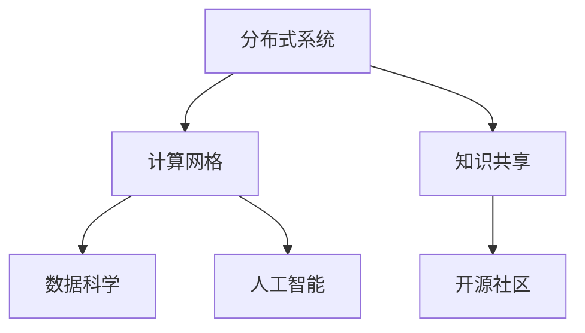

                 

# 连接人类智慧的网络：人类计算的协作精神

> 关键词：人类计算,协作精神,分布式系统,计算网格,数据科学,人工智能,知识共享,开源社区

## 1. 背景介绍

### 1.1 问题由来
随着数字化时代的到来，数据量的爆炸性增长和计算能力的指数级提升，使得人类在处理海量数据和复杂问题方面面临前所未有的机遇与挑战。人类智慧与机器计算的深度融合，引领了一场革命性的计算模式变革。如何高效、协作地进行大规模计算，成为当下亟待解决的难题。

人类计算（Human-Centered Computing）是指通过协作和共享，将人类智能与计算能力结合起来，解决复杂问题的新型计算范式。这一概念来源于MIT媒体实验室的Jocelyn D. Nielsen和Rajagopalan Chandrasekaran提出的计算网格（Computational Grid）思想，强调通过分布式计算资源和全球科研协作，实现高性能计算与知识共享的目标。

### 1.2 问题核心关键点
人类计算的核心在于通过网络协作，将分散在各地的计算资源和智慧连接起来，形成庞大的计算能力网络。其关键点在于：

1. **分布式计算**：通过将计算任务分解为更小的子任务，并在分布式系统中并行执行，以加速计算过程。
2. **协作与共享**：全球科研机构、企业和个人通过开放平台共享数据、算法和计算资源，形成知识与技术的共享社区。
3. **动态调度**：根据任务需求，动态调整计算资源分配，实现最优资源利用。
4. **安全性与隐私保护**：在共享与协作中，确保数据和算法的安全性和隐私性，防止不当使用。

## 2. 核心概念与联系

### 2.1 核心概念概述

为更好地理解人类计算的协作精神，本节将介绍几个密切相关的核心概念：

- **分布式系统（Distributed Systems）**：由多个地理位置分散的计算节点组成的系统，通过网络实现数据共享和协作计算。
- **计算网格（Computational Grid）**：通过分布式计算资源和网络，实现计算任务的协同处理，类似于互联网基础设施。
- **数据科学（Data Science）**：结合统计学、机器学习、数据挖掘和可视化技术，从数据中提取知识，解决实际问题。
- **人工智能（Artificial Intelligence）**：通过模拟人类智能，使计算机具备识别、推理、学习和决策的能力。
- **知识共享（Knowledge Sharing）**：通过平台和机制，促进知识、算法、技术等信息的共享与交流。
- **开源社区（Open Source Community）**：由开发者共同维护、协作开发的软件项目，源代码开放，旨在促进技术创新和知识共享。

这些核心概念之间的逻辑关系可以通过以下Mermaid流程图来展示：



这个流程图展示了几大核心概念之间的相互关系：

1. 分布式系统通过网络实现计算资源的分散部署，是计算网格的基础。
2. 计算网格通过分布式计算资源和网络，实现计算任务的协同处理。
3. 数据科学利用计算网格提供的强大计算能力，从海量数据中提取知识。
4. 人工智能通过数据科学提供的数据和计算能力，模拟人类智能。
5. 知识共享通过平台和机制，促进技术和知识的全球共享。
6. 开源社区为知识共享提供了丰富的资源和社区支持。

## 3. 核心算法原理 & 具体操作步骤
### 3.1 算法原理概述

人类计算的核心算法原理在于将复杂的计算任务分解为更小的子任务，并通过分布式系统协同处理。其基本流程如下：

1. **任务分解**：将一个大任务分解为多个子任务，每个子任务可以独立执行。
2. **分布式执行**：每个子任务在分布式系统中的某个节点上执行。
3. **结果汇总**：所有子任务的结果通过网络汇总，形成最终输出。
4. **调度管理**：动态调整计算资源，以优化任务的执行效率和成本。

### 3.2 算法步骤详解

以下是人类计算的具体操作步骤：

**Step 1: 任务划分与分配**

- 将复杂的计算任务划分为若干子任务，每个子任务独立可执行。
- 根据计算资源可用性和任务需求，将子任务分配到不同的计算节点上。

**Step 2: 任务执行**

- 每个计算节点独立执行分配给自己的子任务。
- 节点间通过网络通信，交换中间结果和控制信息。

**Step 3: 结果汇总与输出**

- 各节点将最终计算结果通过网络汇总到主节点。
- 主节点对结果进行合并处理，形成最终输出。

**Step 4: 动态调度与优化**

- 根据任务执行过程中资源使用情况，动态调整计算资源分配。
- 优化任务执行顺序和资源分配策略，提高系统整体效率。

### 3.3 算法优缺点

人类计算的优点在于：

1. **高效性**：通过分布式计算，可以显著加速复杂任务的执行。
2. **可扩展性**：可以动态扩展计算资源，适应任务需求的变化。
3. **灵活性**：灵活的任务分解和资源分配策略，提高系统适应性。

其缺点在于：

1. **通信开销**：节点间的数据通信会增加额外开销。
2. **复杂性**：系统设计和管理较为复杂，需要协调资源和任务。
3. **安全性**：分布式系统中的数据共享和协作可能存在安全风险。

### 3.4 算法应用领域

人类计算的应用领域非常广泛，涵盖计算机科学、数学、工程、物理、生物等多个学科。以下是几个典型应用场景：

1. **大规模科学计算**：如气候模拟、天体物理研究等，通过分布式计算网格，实现海量数据的处理和分析。
2. **生物信息学**：如基因组测序和分析，通过计算网格和知识共享平台，共享研究成果和算法。
3. **金融分析**：如高频交易和风险评估，利用分布式计算提高数据处理速度，优化算法性能。
4. **数据挖掘与机器学习**：如图像识别和自然语言处理，通过分布式系统加速模型训练和优化。
5. **分布式人工智能**：如协作机器人系统，通过计算网格实现任务分配和结果汇总。

## 4. 数学模型和公式 & 详细讲解 & 举例说明（备注：数学公式请使用latex格式，latex嵌入文中独立段落使用 $$，段落内使用 $)
### 4.1 数学模型构建

人类计算的数学模型构建，主要涉及以下几个关键概念：

- **并行计算模型**：将计算任务并行化，分解为多个子任务，并行执行。
- **调度算法**：根据任务需求和资源可用性，动态调整任务执行顺序和资源分配。
- **通信开销模型**：计算节点间通信的带宽和延迟，影响整体计算效率。

### 4.2 公式推导过程

以并行计算模型为例，假设有一个包含 $N$ 个子任务的计算任务，每个子任务需要 $C$ 个计算单位，任务在 $M$ 个计算节点上执行。任务划分和分配过程如下：

1. 任务分解：将任务分解为 $N$ 个子任务，每个子任务在某个节点上执行。
2. 节点分配：将 $N$ 个子任务分配到 $M$ 个节点上，每个节点分配的子任务数量为 $T$，满足 $T \times M = N$。

假设每个子任务在节点上的执行时间为 $C$，节点间的通信时间为 $T_C$，则总计算时间为：

$$
T_{total} = \sum_{i=1}^N C + \sum_{i=1}^M T_C
$$

### 4.3 案例分析与讲解

以大规模科学计算为例，假设一个气候模拟任务需要计算 $10^6$ 个数据点，每个数据点的计算量为 $10^3$ 个计算单位。任务在 $1000$ 个节点上执行，每个节点可同时执行 $10$ 个子任务。计算节点间通信时间为 $10^{-4}$ 秒，节点间距离为 $10$ 公里。则总计算时间为：

$$
T_{total} = 10^6 \times 10^3 + 1000 \times 10^{-4} \times 10
$$

可以看出，尽管每个子任务的计算量较大，但由于节点间通信时间有限，分布式计算可以显著提升整体计算效率。

## 5. 项目实践：代码实例和详细解释说明
### 5.1 开发环境搭建

在进行人类计算项目开发前，我们需要准备好开发环境。以下是使用Python进行PyTorch开发的环境配置流程：

1. 安装Anaconda：从官网下载并安装Anaconda，用于创建独立的Python环境。

2. 创建并激活虚拟环境：
```bash
conda create -n human-computing python=3.8 
conda activate human-computing
```

3. 安装PyTorch：根据CUDA版本，从官网获取对应的安装命令。例如：
```bash
conda install pytorch torchvision torchaudio cudatoolkit=11.1 -c pytorch -c conda-forge
```

4. 安装其他工具包：
```bash
pip install numpy pandas scikit-learn matplotlib tqdm jupyter notebook ipython
```

完成上述步骤后，即可在`human-computing`环境中开始人类计算的实践。

### 5.2 源代码详细实现

这里以一个简单的分布式计算任务为例，使用PyTorch进行实现。

首先，定义任务划分与分配函数：

```python
from torch.distributed import Tensor, ProcessGroup

def distribute_task(task, pg):
    # 将任务分解为多个子任务
    N = 4
    C = 1000
    T = N * C
    tensors = [Tensor(task) for _ in range(N)]
    
    # 将子任务分配到不同节点
    indices = torch.randperm(N)
    task_per_node = torch.split(tensors[0], C)
    for i in indices:
        tensors[i] = task_per_node[i]
    
    # 在分布式系统中执行任务
    output = [None] * N
    for i in indices:
        pg.broadcast(tensors[i], i)
        output[i] = torch.sum(tensors[i])
    
    return output
```

然后，定义分布式计算函数：

```python
from torch.distributed import init_process_group

def parallel_computation(task, rank, world_size):
    pg = init_process_group("nccl", rank=rank, world_size=world_size)
    output = distribute_task(task, pg)
    pg.destroy()
    return output
```

最后，启动分布式计算并输出结果：

```python
from torch.distributed import get_rank

if __name__ == '__main__':
    world_size = 4
    task = 1000000
    output = parallel_computation(task, get_rank(), world_size)
    print(f"Rank {get_rank()}: {output}")
```

### 5.3 代码解读与分析

让我们再详细解读一下关键代码的实现细节：

**distribute_task函数**：
- 将任务分解为多个子任务，每个子任务在某个节点上执行。
- 将子任务分配到不同节点，并启动节点间的广播通信。
- 在每个节点上执行子任务，并计算中间结果。

**parallel_computation函数**：
- 初始化分布式过程组，执行分布式计算任务。
- 通过广播通信，将计算结果汇总到主节点。
- 销毁过程组，释放资源。

**主程序**：
- 启动并行计算，每个节点输出自己的计算结果。
- 所有节点计算结果的总和，即为最终计算结果。

可以看到，通过简单的代码实现，我们就能构建一个基本的分布式计算任务。

## 6. 实际应用场景
### 6.1 大规模科学计算

人类计算在科学计算中的应用非常广泛。传统的科学计算往往需要超级计算机的高性能计算资源，而通过人类计算，可以充分利用分布式计算资源，加速科学计算任务。

以气候模拟为例，一个全球气候模型通常需要处理海量数据，并进行复杂的物理计算。利用分布式计算网格，将数据分布在不同节点上，进行并行计算，可以显著提高计算效率。

### 6.2 生物信息学

生物信息学领域需要处理和分析海量的生物数据，如基因组测序、蛋白质结构预测等。这些任务通常涉及复杂的计算，通过人类计算，可以实现高效的分布式计算。

例如，在基因组测序中，每个子任务可以独立进行DNA序列拼接和比对，然后通过分布式计算汇总结果，形成最终的基因序列。

### 6.3 金融分析

金融分析领域需要进行高频交易和风险评估，处理海量数据和复杂算法。利用人类计算，可以在分布式系统中进行并行计算，加速模型训练和优化。

例如，在高频交易中，可以通过分布式计算网络，对交易数据进行并行处理，实时生成交易信号。

### 6.4 数据挖掘与机器学习

数据挖掘和机器学习任务往往涉及复杂的算法，需要大量的计算资源。通过人类计算，可以在分布式系统中进行并行计算，加速模型训练和优化。

例如，在图像识别中，可以将图像数据分布在不同节点上，进行并行特征提取和训练，加速模型训练过程。

### 6.5 分布式人工智能

分布式人工智能是指通过分布式系统协同处理人工智能任务，如协作机器人系统。通过人类计算，可以实现任务分配和结果汇总，提高系统的协作效率。

例如，在协作机器人系统中，每个机器人可以独立执行任务，通过分布式计算网络，实现任务分配和结果汇总，提高协作效率。

## 7. 工具和资源推荐
### 7.1 学习资源推荐

为了帮助开发者系统掌握人类计算的理论基础和实践技巧，这里推荐一些优质的学习资源：

1. 《分布式系统设计与实现》系列博文：由大分布式系统专家撰写，深入浅出地介绍了分布式系统的设计原则和实现技术。

2. MIT媒体实验室的计算网格课程：斯坦福大学开设的分布式计算课程，涵盖分布式系统、数据科学、人工智能等多个领域的基础知识。

3. 《数据科学基础》书籍：Introduction to Data Science by DataCamp，全面介绍了数据科学的基本概念和技术，适合初学者入门。

4. GitHub的分布式计算开源项目：提供大量分布式计算的代码实现，适合学习和实践。

5. Google Cloud的分布式计算平台：提供强大的分布式计算资源，支持多种编程语言和框架。

通过对这些资源的学习实践，相信你一定能够快速掌握人类计算的精髓，并用于解决实际的计算问题。
###  7.2 开发工具推荐

高效的开发离不开优秀的工具支持。以下是几款用于人类计算开发的常用工具：

1. PyTorch：基于Python的开源深度学习框架，灵活动态的计算图，适合快速迭代研究。大部分分布式计算模型都有PyTorch版本的实现。

2. TensorFlow：由Google主导开发的开源深度学习框架，生产部署方便，适合大规模工程应用。同样有丰富的分布式计算资源。

3. Spark：Apache基金会开发的分布式计算框架，支持多种编程语言和数据类型，适合大规模数据处理。

4. Hadoop：Apache基金会开发的分布式计算平台，支持大规模数据存储和处理。

5. Dask：基于Python的分布式计算库，适合大规模数据计算和并行处理。

6. Jupyter Notebook：交互式编程环境，支持分布式计算和数据可视化，适合研究和实验。

合理利用这些工具，可以显著提升人类计算任务的开发效率，加快创新迭代的步伐。

### 7.3 相关论文推荐

人类计算的发展源于学界的持续研究。以下是几篇奠基性的相关论文，推荐阅读：

1. "The Grid Computing Environment: An Architecture for Cooperative High-Performance Computing" by C. K.arla, R. L. Green, A. I. Lugowski and B. W. Onarheim:提出计算网格的概念，强调分布式计算资源的协作与共享。

2. "A Survey of Distributed Machine Learning Algorithms" by J. Gonzalez and A. Gunawardana:全面综述了分布式机器学习的算法和实现技术，适合深入学习。

3. "Machine Learning in Hadoop: The Deployment, Storage, and Retrieval of a Machine Learning System" by J. S. Preston, M. M. Scowcroft, L. A. McMillan and T. U. Giese:介绍机器学习在Hadoop上的部署和应用，适合实际应用。

4. "Asynchronous, Distributed, Parallel Machine Learning Algorithms for Big Data" by C. C. Song and K. S. N. Murthy:综述了在大数据环境下分布式机器学习的算法和实现，适合实际应用。

这些论文代表了大分布式计算的研究方向和前沿成果。通过学习这些前沿成果，可以帮助研究者把握学科前进方向，激发更多的创新灵感。

## 8. 总结：未来发展趋势与挑战

### 8.1 总结

本文对人类计算的协作精神进行了全面系统的介绍。首先阐述了人类计算的概念和应用背景，明确了分布式计算在处理大规模计算任务中的重要作用。其次，从原理到实践，详细讲解了分布式计算的数学模型和操作步骤，给出了分布式计算任务开发的完整代码实例。同时，本文还广泛探讨了分布式计算在科学计算、生物信息学、金融分析等多个领域的应用前景，展示了分布式计算的巨大潜力。此外，本文精选了分布式计算的各类学习资源，力求为读者提供全方位的技术指引。

通过本文的系统梳理，可以看到，分布式计算通过网络协作，将分散的计算资源和智慧连接起来，形成庞大的计算能力网络。其高效性、可扩展性和灵活性，使其在科学计算、生物信息学、金融分析、数据挖掘与机器学习等多个领域具有广泛的应用前景。未来，伴随分布式计算技术的不断进步，相信其在更广泛的场景中，将发挥越来越重要的作用，推动人类智慧和计算能力的深度融合。

### 8.2 未来发展趋势

展望未来，分布式计算的发展趋势将呈现以下几个方向：

1. **云计算和边缘计算的融合**：云计算和边缘计算的融合，将使分布式计算更具灵活性和可扩展性，支持更广泛的计算任务。

2. **大数据与人工智能的深度融合**：大数据和人工智能技术的结合，将使分布式计算更具智能化和自动化，提高数据处理的效率和质量。

3. **区块链技术的应用**：区块链技术可以提供安全、透明的数据共享和协作机制，增强分布式计算系统的安全性和可靠性。

4. **超大规模计算资源的支持**：未来的计算资源将更加丰富和多样化，支持更大规模的分布式计算任务。

5. **软件即服务（SaaS）的普及**：分布式计算的SaaS化，将使计算资源更易于获取和使用，降低计算门槛。

6. **开源社区和标准化的发展**：开源社区和标准化的发展，将使分布式计算技术更易于共享和应用，促进技术的创新和普及。

以上趋势凸显了分布式计算技术的广阔前景。这些方向的探索发展，必将进一步提升分布式计算系统的性能和应用范围，为计算任务的协同处理和知识共享提供更强大的支持。

### 8.3 面临的挑战

尽管分布式计算技术已经取得了显著进展，但在迈向更加智能化、普适化应用的过程中，它仍面临着诸多挑战：

1. **通信开销**：节点间的数据通信会增加额外开销，尤其是在数据量较大时。如何降低通信开销，优化通信机制，是未来需要解决的关键问题。

2. **资源管理**：动态调整计算资源，实现最优资源利用，是分布式计算的核心挑战。如何优化资源管理策略，提高系统效率，是未来的研究重点。

3. **安全与隐私**：分布式系统中的数据共享和协作可能存在安全风险。如何保障数据和算法的安全性和隐私性，防止不当使用，是亟待解决的问题。

4. **算法复杂性**：分布式计算的算法复杂性较高，如何简化算法模型，提高可解释性，是未来的研究方向。

5. **计算效率**：分布式计算的计算效率受限于网络带宽和节点间的通信延迟。如何优化网络架构和通信协议，提高计算效率，是未来需要解决的关键问题。

6. **技术标准化**：分布式计算的技术标准化尚未完全成熟，如何制定统一的标准和规范，促进技术的普及和应用，是未来的研究重点。

### 8.4 研究展望

面对分布式计算面临的这些挑战，未来的研究需要在以下几个方面寻求新的突破：

1. **分布式算法优化**：开发更高效、更易理解和部署的分布式算法，简化分布式计算过程。

2. **边缘计算技术**：结合边缘计算技术，减少计算任务的网络传输开销，提高计算效率。

3. **分布式机器学习**：结合机器学习技术，实现更智能、更自动化的分布式计算。

4. **区块链技术**：利用区块链技术，实现更安全、更透明的数据共享和协作机制。

5. **分布式知识图谱**：结合知识图谱技术，实现更全面、更准确的分布式计算。

6. **分布式数据管理**：结合数据管理技术，实现更高效、更可靠的数据共享和协作。

这些研究方向的探索，必将引领分布式计算技术迈向更高的台阶，为构建高效、安全、可靠、智能的分布式计算系统提供新的动力。相信随着技术的不断发展，分布式计算技术将越来越成熟，为人类智慧和计算能力的深度融合提供更强大的支持。

## 9. 附录：常见问题与解答

**Q1：如何选择合适的分布式计算框架？**

A: 选择分布式计算框架时，需要考虑以下几个因素：

1. **功能和特性**：不同的框架具有不同的功能和特性，选择适合自己的框架。
2. **性能和效率**：考虑框架的性能和效率，满足计算需求。
3. **易用性和可扩展性**：考虑框架的易用性和可扩展性，支持未来的扩展需求。
4. **社区和支持**：考虑框架的社区和支持情况，是否有足够的资源和文档支持。

**Q2：分布式计算中如何避免数据丢失？**

A: 数据丢失是分布式计算中常见的问题，可以采用以下方法进行避免：

1. **数据冗余**：通过数据冗余技术，确保数据的多个副本，防止单点故障。
2. **数据备份**：定期对数据进行备份，防止数据丢失。
3. **错误检测与重试**：通过错误检测和重试机制，保证数据的完整性。
4. **分布式事务**：采用分布式事务技术，确保数据的一致性和完整性。

**Q3：分布式计算中的数据通信开销如何优化？**

A: 数据通信开销是分布式计算中的瓶颈，可以采用以下方法进行优化：

1. **数据压缩**：通过数据压缩技术，减少数据传输量，降低通信开销。
2. **数据分片**：将数据分成多个小块，并行传输，提高传输效率。
3. **网络优化**：优化网络架构，减少通信延迟和带宽占用。
4. **本地计算**：尽可能在本地进行计算，减少通信开销。

**Q4：分布式计算中的资源管理如何优化？**

A: 资源管理是分布式计算的核心挑战，可以采用以下方法进行优化：

1. **动态调度**：根据任务需求，动态调整计算资源分配，优化任务执行顺序。
2. **任务划分**：将任务分解为更小的子任务，减少资源浪费。
3. **资源监控**：实时监控计算资源的使用情况，优化资源管理策略。
4. **弹性扩展**：根据任务需求，动态扩展计算资源，提高系统效率。

**Q5：分布式计算中的安全和隐私如何保障？**

A: 分布式计算中的安全和隐私问题需要综合考虑，可以采用以下方法进行保障：

1. **数据加密**：对数据进行加密处理，防止数据泄露。
2. **访问控制**：对计算资源进行访问控制，防止未经授权的访问。
3. **审计和监控**：定期审计和监控系统操作，防止恶意行为。
4. **匿名化处理**：对数据进行匿名化处理，保护隐私。

这些方法可以结合使用，构建更加安全、可靠的分布式计算系统。

---

作者：禅与计算机程序设计艺术 / Zen and the Art of Computer Programming

