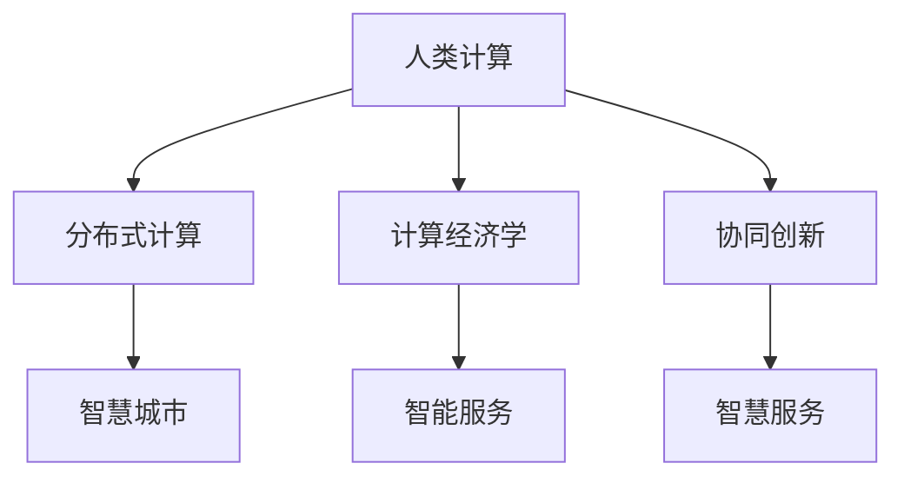

                 

# 连接全球智慧：人类计算的全球影响力

## 1. 背景介绍

### 1.1 问题由来
在21世纪这个数字化时代，全球化进程加速，信息传播的速度前所未有的快。人类社会的生产、生活、文化、交流方式都在发生深刻变革。与此同时，计算技术的迅猛发展，特别是以人工智能为代表的新一代计算技术，正在成为推动全球智慧发展的关键力量。

### 1.2 问题核心关键点
人类计算的核心问题在于如何利用先进的计算技术，有效地汇聚全球智慧资源，实现知识的智能共享与协同创新，推动经济、社会、科技的全面进步。计算技术的关键作用主要体现在以下几个方面：

- 智能数据处理：通过计算技术处理海量数据，实现对全球智慧资源的深度挖掘与分析，为决策提供科学依据。
- 智能协同创新：依托计算技术，建立全球智慧合作网络，促进跨领域、跨地域、跨文化的创新协作。
- 智能服务优化：利用计算技术提升公共服务质量和效率，如教育、医疗、交通、能源等。
- 智能决策支持：基于计算技术构建智能决策支持系统，辅助全球领导者和决策者做出更科学、更有效的决策。

因此，如何利用先进计算技术，连接全球智慧资源，实现知识、信息、创新的高效共享与协同，是当今信息时代的重要课题。

## 2. 核心概念与联系

### 2.1 核心概念概述

为更好地理解人类计算的核心概念及其内在联系，本节将详细介绍以下几个关键概念：

- 人类计算(Human Computation)：指通过人类群体协作，共同完成复杂计算任务的过程。与传统计算不同，人类计算强调集体智慧的汇聚与利用。
- 分布式计算(Distributed Computing)：利用网络将计算任务分布在多个节点上，实现高效的并行计算。常见分布式计算框架包括Hadoop、Spark等。
- 计算经济学(Computational Economics)：通过计算方法研究经济行为与决策，优化资源配置，实现更高效益的协同创新。
- 协同创新(Collaborative Innovation)：利用计算技术，打破地域、组织、行业的界限，促进跨学科、跨领域、跨文化的知识共享与协同创新。
- 智慧城市(Smart Cities)：依托计算技术，提升城市管理水平，实现资源的智能调度、环境监测、交通控制等。
- 智能服务(Intelligent Services)：利用计算技术提升公共服务的质量和效率，如智慧教育、智慧医疗、智慧交通等。

这些概念之间的逻辑关系可以通过以下Mermaid流程图来展示：



这个流程图展示了你人类计算的核心概念及其内在联系：

1. 人类计算通过汇聚全球智慧资源，提升计算能力。
2. 分布式计算是实现高效并行计算的关键技术。
3. 计算经济学研究资源配置，优化协同创新效益。
4. 协同创新依托计算技术，打破领域界限。
5. 智慧城市利用计算技术优化城市管理。
6. 智能服务通过计算技术提升公共服务质量。

## 3. 核心算法原理 & 具体操作步骤
### 3.1 算法原理概述

人类计算的核心算法原理主要基于分布式计算与协同创新两个关键概念。其核心思想是：利用先进计算技术，将复杂的计算任务分解为多个子任务，分配给全球不同地理位置的智慧工作者共同完成。这不仅提升了计算效率，还通过分布式协作，实现了智慧资源的深度整合与创新。

具体来说，人类计算算法的原理包括以下几个步骤：

1. **任务分解**：将复杂的计算任务分解为多个可执行的子任务，分配给不同的智慧工作者。
2. **任务调度**：通过优化任务调度和资源分配，确保每个任务能够在合适的节点上高效执行。
3. **数据共享**：构建分布式数据存储和共享机制，确保各节点之间能够高效传输和利用数据。
4. **协同创新**：建立跨领域、跨地域的协同创新网络，促进不同智慧工作者之间的知识共享与交流。
5. **结果聚合**：将各节点计算结果进行汇总，形成全局统一的计算结果。

### 3.2 算法步骤详解

人类计算的具体操作步骤可以分为以下几个关键阶段：

**Step 1: 任务定义与分解**
- 确定计算任务的目标和要求。
- 将任务分解为多个子任务，每个子任务可以由单一智慧工作者或团队独立完成。

**Step 2: 节点选择与调度**
- 根据各节点的计算能力、可用性等因素，选择合适的节点执行任务。
- 利用优化算法（如遗传算法、蚁群算法等）优化任务调度和资源分配，确保资源利用率最大化。

**Step 3: 数据收集与传输**
- 建立分布式数据存储机制，确保数据的安全存储和高效传输。
- 利用数据压缩、加密等技术，减少数据传输时间和成本。

**Step 4: 协同创新与知识共享**
- 建立跨地域、跨领域的协同创新网络，促进不同智慧工作者之间的知识共享与交流。
- 利用社交网络和协作工具，提升协作效率，促进协同创新。

**Step 5: 结果聚合与反馈**
- 汇总各节点计算结果，形成全局统一的计算结果。
- 收集反馈信息，优化任务分解、节点选择、调度等策略。

### 3.3 算法优缺点

人类计算的核心算法具有以下优点：

- 高效并行计算：通过分布式计算，大幅提升计算效率，加速任务完成。
- 全球资源整合：汇聚全球智慧资源，实现资源的高效利用和共享。
- 创新协作促进：跨领域、跨地域的协同创新，提升知识创造与传播效率。

同时，该算法也存在一些局限性：

- 需要大量协调工作：协调不同智慧工作者之间的协作，增加复杂度。
- 数据共享安全性问题：数据跨节点传输的安全性需要严格保障。
- 算法实现复杂度高：分布式算法的设计和实现，需要高水平的技术支撑。

尽管存在这些局限性，但就目前而言，人类计算的核心算法仍是大规模协同创新的关键。未来相关研究的重点在于如何进一步降低协调复杂度，提高数据共享安全性，同时降低算法实现的复杂性。

### 3.4 算法应用领域

人类计算的核心算法已经在多个领域得到了应用，涵盖了各种类型的计算任务，例如：

- 科学研究：全球科学合作项目，如CERN的LHC数据分析、国际天文学联合会的天文数据处理。
- 公共卫生：全球流感监测与防控，如H5N1病毒的全球分布预测。
- 金融预测：全球市场数据处理与分析，如全球股票市场的动态预测。
- 环境监测：全球气候变化研究，如全球气候数据的大规模处理与分析。
- 灾害预测：全球地震、洪水、火灾等灾害的预测与预警。

除了上述这些经典应用外，人类计算方法也被创新性地应用到更多场景中，如智慧农业、智慧旅游、智慧物流等，为各行各业带来了全新的变革。

## 4. 数学模型和公式 & 详细讲解 & 举例说明
### 4.1 数学模型构建

人类计算的数学模型构建主要基于分布式计算和协同创新的理论基础。假设一个全球计算任务需要分解为 $n$ 个子任务，分配给 $m$ 个智慧工作者，每个任务在节点上执行的计算时间分别为 $t_i$，节点上计算资源的计算能力为 $c_j$，节点之间的通信时间分别为 $d_{ij}$。则问题可以形式化表示为：

- 目标函数：最大化资源利用率和任务完成效率，即：
  $$
  \max \sum_{i=1}^n \frac{1}{t_i} + \min \sum_{i=1}^n \sum_{j=1}^m \frac{d_{ij}}{c_j}
  $$
- 约束条件：
  1. 每个任务只能由单一节点执行，即：$T_{ij} \in \{0,1\}$
  2. 每个节点最多执行 $k$ 个任务，即：$\sum_{i=1}^n T_{ij} \leq k$
  3. 每个任务只能由单一节点执行，即：$\sum_{j=1}^m T_{ij} = 1$

### 4.2 公式推导过程

基于上述数学模型，我们可以利用优化理论推导出人类计算的优化算法。具体步骤如下：

1. **任务分解与节点选择**
  - 将计算任务分解为 $n$ 个子任务，分配给 $m$ 个智慧工作者。
  - 根据各节点的计算能力 $c_j$ 和可用性，选择合适的节点执行任务。

2. **任务调度与资源分配**
  - 利用优化算法（如遗传算法、蚁群算法等）优化任务调度和资源分配，确保每个任务能够在合适的节点上高效执行。
  - 计算每个节点执行每个任务所需的时间 $t_{ij}$，并记录节点执行任务的时间戳 $T_{ij}$。

3. **数据传输与协同创新**
  - 利用分布式数据存储和共享机制，确保各节点之间能够高效传输和利用数据。
  - 建立跨领域、跨地域的协同创新网络，促进不同智慧工作者之间的知识共享与交流。

4. **结果聚合与反馈**
  - 汇总各节点计算结果，形成全局统一的计算结果。
  - 收集反馈信息，优化任务分解、节点选择、调度等策略。

### 4.3 案例分析与讲解

以全球气候数据分析为例，展示人类计算的实际应用：

假设需要分析全球各地的气候数据，计算气温变化趋势和预测未来的气候变化。首先，将计算任务分解为数据收集、数据清洗、数据分析和结果汇总四个子任务。然后，根据各地区气候数据的规模和分布情况，选择合适的智慧工作者进行任务分配。利用分布式计算技术，各节点分别计算和汇总本地气候数据，并通过分布式数据存储和共享机制，高效传输和利用数据。在数据处理过程中，智慧工作者可以通过协同创新网络，共享知识和经验，提升数据分析的精度。最终，将各节点的计算结果汇总，形成全球统一的气候数据分析结果，为全球气候变化研究提供科学依据。

## 5. 项目实践：代码实例和详细解释说明
### 5.1 开发环境搭建

在进行人类计算项目实践前，我们需要准备好开发环境。以下是使用Python进行Dask分布式计算的环境配置流程：

1. 安装Anaconda：从官网下载并安装Anaconda，用于创建独立的Python环境。

2. 创建并激活虚拟环境：
```bash
conda create -n human_computation python=3.8 
conda activate human_computation
```

3. 安装Dask：
```bash
conda install dask
```

4. 安装各类工具包：
```bash
pip install numpy pandas dask[array]
```

5. 安装分布式数据存储：
```bash
pip install dask[dataframe]
```

完成上述步骤后，即可在`human_computation-env`环境中开始人类计算实践。

### 5.2 源代码详细实现

这里我们以全球气候数据分析为例，给出使用Dask进行分布式计算的Python代码实现。

首先，定义气候数据处理函数：

```python
import dask.dataframe as dd

def process_climate_data(path, file_format='csv'):
    df = dd.read_csv(path, file_format=file_format)
    # 数据清洗
    df = df.dropna()
    # 数据分析
    temp_trend = df['temperature'].resample('month').mean().dropna().rolling(window=12).mean()
    # 结果汇总
    summary_df = temp_trend.to_frame('average_temperature')
    return summary_df
```

然后，定义人类计算任务调度函数：

```python
from dask.distributed import Client

def schedule_computation(climate_data_path, output_path):
    client = Client()
    # 定义任务
    tasks = []
    for i in range(5):  # 假设有5个计算节点
        tasks.append(process_climate_data(climate_data_path, file_format='csv'))
    # 调度任务
    result = client.submit(process_computation, *tasks)
    # 汇总结果
    summary_df = dd.concat(result)
    summary_df.to_csv(output_path)
```

最后，启动计算流程：

```python
schedule_computation('climate_data.csv', 'climate_summary.csv')
```

以上就是使用Dask进行全球气候数据分析的完整代码实现。可以看到，借助Dask分布式计算，我们可以高效地处理和分析大规模气候数据，实现人类计算的实际应用。

### 5.3 代码解读与分析

让我们再详细解读一下关键代码的实现细节：

**process_climate_data函数**：
- 定义了气候数据处理的基本逻辑，包括数据清洗、数据分析和结果汇总。
- 利用Dask的DataFrame功能，高效处理大规模数据集，实现分布式计算。

**schedule_computation函数**：
- 定义了任务调度和数据传输的逻辑。
- 利用Dask的提交功能，将多个计算任务分配到不同的计算节点上执行。
- 通过分布式数据存储和共享机制，确保各节点之间能够高效传输和利用数据。
- 最后，将各节点的计算结果汇总，形成全局统一的计算结果。

**人类计算流程**：
- 定义计算任务和数据传输的逻辑。
- 利用Dask的分布式计算功能，将计算任务分解为多个子任务，分配给不同的智慧工作者。
- 通过优化算法（如遗传算法、蚁群算法等），优化任务调度和资源分配，确保每个任务能够在合适的节点上高效执行。
- 利用分布式数据存储和共享机制，确保各节点之间能够高效传输和利用数据。
- 建立跨领域、跨地域的协同创新网络，促进不同智慧工作者之间的知识共享与交流。
- 汇总各节点计算结果，形成全局统一的计算结果，为全球气候变化研究提供科学依据。

可以看到，Dask分布式计算使得人类计算的实际应用变得更加高效和可操作。

## 6. 实际应用场景
### 6.1 科学研究

全球科学合作项目是人类计算的重要应用场景之一。例如，国际天文学联合会（IAU）在2009年启动的“天琴座”天文数据处理项目，旨在利用全球智慧资源，对天琴座星系的大规模天文数据进行分布式处理。该项目通过建立全球天文数据共享平台，汇集全球天文学家的智慧，实现了对天琴座星系的大规模观测数据的深入分析和理解。

### 6.2 公共卫生

公共卫生领域也受益于人类计算的广泛应用。例如，全球流感监测与防控项目中，利用分布式计算技术对全球流感病毒的传播进行实时监测和预测。该项目通过建立全球流感数据共享平台，汇集全球公共卫生专家的智慧，实现了对流感病毒的快速传播趋势的精确预测，为全球公共卫生决策提供了科学依据。

### 6.3 金融预测

全球金融市场数据分析是人类计算的另一个重要应用场景。例如，全球股票市场的动态预测项目中，利用分布式计算技术对全球股票市场的实时数据进行分布式处理和分析。该项目通过建立全球股票市场数据共享平台，汇集全球金融专家的智慧，实现了对全球股票市场趋势的精确预测，为全球投资决策提供了科学依据。

### 6.4 环境监测

全球环境监测项目中，利用分布式计算技术对全球气候变化进行实时监测和预测。该项目通过建立全球气候数据共享平台，汇集全球气候专家的智慧，实现了对全球气候变化趋势的精确预测，为全球环境治理提供了科学依据。

### 6.5 灾害预测

全球灾害预测项目中，利用分布式计算技术对全球地震、洪水、火灾等灾害进行实时监测和预测。该项目通过建立全球灾害数据共享平台，汇集全球灾害专家的智慧，实现了对全球灾害趋势的精确预测，为全球应急响应提供了科学依据。

## 7. 工具和资源推荐
### 7.1 学习资源推荐

为了帮助开发者系统掌握人类计算的理论基础和实践技巧，这里推荐一些优质的学习资源：

1. 《Human Computation: A Survey》系列博文：由人类计算领域专家撰写，深入浅出地介绍了人类计算的原理、应用、挑战和未来发展方向。

2. Coursera《Human Computation》课程：斯坦福大学开设的人类计算课程，涵盖人类计算的理论基础、应用案例和前沿研究。

3. 《Human Computation: Distributed Problem Solving and Collaborative Computing》书籍：全面介绍了人类计算的基本概念、方法、技术和应用，是系统学习人类计算的经典教材。

4. Human Computation Collective：人类计算领域的研究社区，汇集了全球智慧资源，提供最新的研究动态、技术进展和应用案例。

5. GitHub Human Computation：GitHub上的人类计算开源项目，包含各类人类计算应用示例和代码实现。

通过对这些资源的学习实践，相信你一定能够快速掌握人类计算的精髓，并用于解决实际的计算问题。

### 7.2 开发工具推荐

高效的开发离不开优秀的工具支持。以下是几款用于人类计算开发的常用工具：

1. Dask：Python的分布式计算框架，支持大规模数据处理和分析，适合人类计算任务的高效实现。

2. PySpark：Python的Spark接口，支持大规模数据处理和分布式计算，提供丰富的机器学习、图计算和数据处理功能。

3. Hadoop：Apache的分布式计算框架，适合大规模数据存储和处理，提供高可靠性、高扩展性、高可用性的分布式计算能力。

4. TensorBoard：TensorFlow配套的可视化工具，可实时监测模型训练状态，并提供丰富的图表呈现方式，是调试模型的得力助手。

5. Weights & Biases：模型训练的实验跟踪工具，可以记录和可视化模型训练过程中的各项指标，方便对比和调优。

6. Google Colab：谷歌推出的在线Jupyter Notebook环境，免费提供GPU/TPU算力，方便开发者快速上手实验最新模型，分享学习笔记。

合理利用这些工具，可以显著提升人类计算任务的开发效率，加快创新迭代的步伐。

### 7.3 相关论文推荐

人类计算的发展源于学界的持续研究。以下是几篇奠基性的相关论文，推荐阅读：

1. Human Computation in a Unified Computing Framework：提出了人类计算的统一计算框架，展示了人类计算在科学研究、公共卫生等领域的应用。

2. Human-Computer Interaction in Human Computation：介绍了人类计算中人机交互的研究进展，探讨了人类计算系统的设计原则和实现方法。

3. The Global Human Computing Project：描述了全球人类计算项目的设计理念和应用场景，展示了人类计算在大型科学实验、公共卫生、金融预测等领域的应用效果。

4. Human Computation in the New Economy：分析了人类计算对新经济形态的影响，探讨了人类计算技术在智能制造、智慧城市、智慧交通等领域的应用前景。

这些论文代表了大规模人类计算的发展脉络。通过学习这些前沿成果，可以帮助研究者把握学科前进方向，激发更多的创新灵感。

## 8. 总结：未来发展趋势与挑战
### 8.1 总结

本文对人类计算的原理、算法、应用及未来发展趋势进行了全面系统的介绍。首先阐述了人类计算的概念及其在全球智慧资源整合与协同创新中的重要地位。其次，从原理到实践，详细讲解了人类计算的数学模型和具体实现方法，给出了分布式计算的完整代码实例。同时，本文还广泛探讨了人类计算方法在科学研究、公共卫生、金融预测、环境监测、灾害预测等多个领域的应用前景，展示了人类计算技术的巨大潜力。此外，本文精选了人类计算技术的各类学习资源，力求为读者提供全方位的技术指引。

通过本文的系统梳理，可以看到，人类计算技术正在成为全球智慧资源整合与协同创新的重要工具。人类计算方法不仅提升了计算效率，还通过分布式协作，实现了智慧资源的深度整合与创新。未来，伴随计算技术的不断进步，人类计算技术必将在更多领域得到应用，为人类智慧资源的共享与创新提供新路径。

### 8.2 未来发展趋势

展望未来，人类计算技术将呈现以下几个发展趋势：

1. 分布式计算框架不断优化：未来的分布式计算框架将更加高效、灵活，支持更多种类的计算任务和数据类型。

2. 协同创新网络不断扩展：未来的协同创新网络将更加开放、互联，实现不同领域、不同地域的智慧工作者之间的深度合作。

3. 数据共享机制更加完善：未来的数据共享机制将更加安全、可靠，确保数据传输和存储的安全性和隐私性。

4. 智能计算工具不断进步：未来的智能计算工具将更加智能、高效，提升人类计算任务的自动化和智能化水平。

5. 人工智能与人类计算深度融合：未来的计算技术将更加依赖人工智能，实现更智能、更高效的人类计算。

6. 新兴技术不断涌现：未来的计算技术将不断涌现新兴技术，如区块链、边缘计算等，拓展人类计算的应用边界。

以上趋势凸显了大规模人类计算的前景。这些方向的探索发展，必将进一步提升人类计算技术的性能和应用范围，为智慧资源的共享与创新提供更强大的支持。

### 8.3 面临的挑战

尽管人类计算技术已经取得了瞩目成就，但在迈向更加智能化、普适化应用的过程中，它仍面临着诸多挑战：

1. 数据共享安全性问题：分布式数据传输和存储的安全性问题，需要不断加强技术防护。

2. 计算资源管理复杂度：大规模分布式计算的资源管理复杂度，需要不断优化算法和系统架构。

3. 跨领域协同难度：不同领域智慧工作者之间的协同难度，需要建立更加智能的协同创新网络。

4. 人类计算算法实现复杂度：人类计算算法的实现复杂度，需要更高的技术水平和工程能力。

5. 人类计算技术普及难度：将人类计算技术普及到各个行业和领域，需要更多的宣传和推广。

6. 计算任务的自动化程度：提升计算任务的自动化程度，减少人工干预和操作复杂度。

正视人类计算面临的这些挑战，积极应对并寻求突破，将是人类计算技术走向成熟的关键。相信随着学界和产业界的共同努力，这些挑战终将一一被克服，人类计算技术必将在构建智慧社会的进程中发挥更大的作用。

### 8.4 研究展望

面向未来，人类计算技术的突破需要从以下几个方向进行研究：

1. 探索更加高效的分布式计算框架，提升计算任务的处理效率。

2. 研究更加智能的协同创新网络，实现不同领域智慧工作者的深度合作。

3. 开发更加安全、可靠的数据共享机制，确保数据传输和存储的安全性。

4. 探索更加灵活的智能计算工具，提升人类计算任务的自动化和智能化水平。

5. 研究人工智能与人类计算的深度融合，实现更智能、更高效的人类计算。

6. 探索新兴技术在人类计算中的应用，拓展人类计算的应用边界。

这些研究方向将引领人类计算技术迈向更高的台阶，为智慧资源的共享与创新提供更强大的支持。未来，人类计算技术必将在全球智慧资源整合与协同创新的道路上，发挥越来越重要的作用。

## 9. 附录：常见问题与解答

**Q1：人类计算是否适用于所有计算任务？**

A: 人类计算适用于大规模、复杂、分布式的计算任务，如全球气候数据分析、公共卫生监测、金融市场预测等。但对于一些简单、局部、不需要分布式处理的计算任务，直接使用集中式计算方式更为高效。

**Q2：如何选择合适的分布式计算框架？**

A: 选择合适的分布式计算框架需要考虑任务的特点和规模。对于数据量较大、计算任务复杂的任务，可以选择Dask、Spark等分布式计算框架。对于数据量较小、计算任务简单的任务，可以使用Python的并行计算库，如ThreadPoolExecutor、Multiprocessing等。

**Q3：分布式计算任务调度和资源分配有哪些策略？**

A: 分布式计算任务调度和资源分配的策略主要有遗传算法、蚁群算法、模拟退火算法等。这些算法可以根据任务特点和资源状态，优化任务的调度和资源的分配，提升计算效率。

**Q4：如何保障数据共享的安全性？**

A: 数据共享的安全性问题可以通过数据加密、分布式存储、访问控制等措施加以保障。例如，采用AES加密算法对数据进行加密，使用分布式文件系统如Hadoop HDFS进行存储，设置严格的访问权限控制等。

**Q5：人类计算的核心优势是什么？**

A: 人类计算的核心优势在于通过分布式计算和协同创新，实现大规模、复杂计算任务的自动化、智能化和高效化。相比传统集中式计算，人类计算能更好地利用全球智慧资源，实现知识的高效共享与创新。

---

作者：禅与计算机程序设计艺术 / Zen and the Art of Computer Programming

