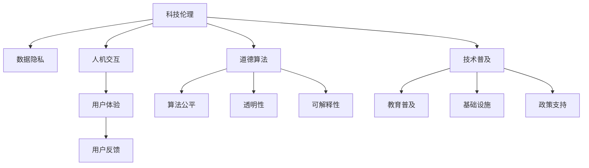

                 

# 连接科技与人文：构建以人为本的科技未来

> 关键词：科技伦理,人工智能,人机交互,数据隐私,用户界面,用户体验,道德算法

## 1. 背景介绍

### 1.1 问题由来

随着科技的迅猛发展，人工智能（AI）、大数据、云计算等新兴技术深刻改变了人类社会的各个方面。从医疗、教育到金融、交通，几乎每一个领域都在享受科技带来的便利和效率提升。然而，科技的发展同时也带来了新的问题和挑战，如隐私泄露、数据安全、算法偏见等。这些问题不仅仅是技术问题，更是道德和人文的挑战。因此，构建以人为本的科技未来，不仅仅是技术突破，更是伦理和道德的突破。

### 1.2 问题核心关键点

科技与人文之间的矛盾和冲突，核心在于科技发展过程中的伦理和道德问题。科技伦理研究的核心在于：如何确保技术进步同时不损害人类的基本价值和权利，如何建立可持续的科技发展模式，以及如何实现技术与人类社会的和谐共存。

要回答这个问题，我们需要考虑以下几个关键点：

1. **科技伦理**：如何确保技术的发展符合道德和法律规范，保护用户权益，防止算法偏见和歧视。
2. **数据隐私**：如何处理和保护个人数据，避免隐私泄露，建立用户信任。
3. **人机交互**：如何设计友好、自然的用户界面，提升用户体验，促进人机协作。
4. **道德算法**：如何构建和评估道德算法，确保其公平、透明、可解释。
5. **技术普及**：如何普及和推广科技，确保不同群体都能从中受益。

这些问题相互交织，共同构成了构建以人为本的科技未来的挑战。只有通过多方合作和共同努力，才能实现这一目标。

## 2. 核心概念与联系

### 2.1 核心概念概述

要理解构建以人为本的科技未来，首先需要理解其中的核心概念：

- **科技伦理**：指科技发展过程中遵循的道德规范和原则，包括隐私保护、算法公平、数据安全等方面。
- **数据隐私**：指个人数据的收集、存储和使用过程中应遵循的隐私保护原则和法律规范，防止数据滥用和隐私泄露。
- **人机交互**：指人与计算机系统之间的交互方式和界面设计，包括自然语言处理、语音识别、虚拟现实等技术。
- **道德算法**：指算法在设计和实现过程中遵循的道德原则，如公平性、透明性、可解释性等。
- **技术普及**：指如何让更多的人能够使用和受益于科技，包括教育和培训、基础设施建设、政策支持等。

这些概念相互联系，共同构成了一个全面的科技发展框架。

### 2.2 核心概念原理和架构的 Mermaid 流程图



这个流程图展示了科技伦理与其他核心概念之间的联系。科技伦理是科技发展的指导原则，决定了数据隐私、人机交互、道德算法和技术普及的方向和目标。用户体验、算法公平、透明性和可解释性等都是科技伦理的具体体现。

## 3. 核心算法原理 & 具体操作步骤

### 3.1 算法原理概述

构建以人为本的科技未来，不仅仅依赖于技术突破，还需要通过算法和技术的合理应用，确保科技的普及和普及过程中遵循道德和伦理规范。以下将详细介绍几个核心算法原理和操作步骤：

- **隐私保护算法**：通过加密、匿名化等技术手段，保护个人数据的安全性和隐私性。
- **公平算法**：确保算法在处理数据和做出决策时，不产生歧视和偏见，实现公平性和透明性。
- **透明算法**：通过可解释性和可视化等技术，使算法决策过程透明，便于用户理解和信任。
- **用户反馈算法**：收集和分析用户反馈，不断改进和优化算法，提升用户体验。

### 3.2 算法步骤详解

#### 3.2.1 隐私保护算法

隐私保护算法主要包括以下几个步骤：

1. **数据收集与匿名化**：在数据收集过程中，通过加密和匿名化技术，保护个人隐私。常见的匿名化技术包括数据脱敏、差分隐私等。

2. **数据存储与访问控制**：在数据存储过程中，使用访问控制技术，限制数据的访问权限，确保只有授权人员可以访问敏感数据。

3. **数据使用与监控**：在数据使用过程中，通过监控和审计技术，确保数据使用符合隐私保护规范，防止数据滥用。

#### 3.2.2 公平算法

公平算法主要包括以下几个步骤：

1. **数据预处理**：对数据进行清洗和处理，去除异常值和噪声，确保数据质量和一致性。

2. **特征选择与处理**：选择对决策结果影响最大的特征，进行标准化和归一化处理，减少特征之间的相关性。

3. **模型训练与评估**：使用公平性评估指标，如均方误差、准确率等，评估模型的公平性。如果模型存在偏见，则需要进行调整和优化。

4. **公平性调整**：通过调整模型参数和特征权重，实现算法的公平性。常见的调整方法包括重新加权、算法优化等。

#### 3.2.3 透明算法

透明算法主要包括以下几个步骤：

1. **可解释性分析**：通过可解释性分析技术，如LIME、SHAP等，分析模型决策过程，解释模型的决策逻辑。

2. **可视化与交互**：通过可视化技术，将模型的决策过程和结果展示给用户，便于用户理解和信任。

3. **反馈机制**：通过用户反馈机制，收集用户对算法决策的意见和建议，不断改进和优化算法。

#### 3.2.4 用户反馈算法

用户反馈算法主要包括以下几个步骤：

1. **收集反馈**：通过调查问卷、用户评价等手段，收集用户对算法和系统的反馈。

2. **分析反馈**：对用户反馈进行分析和处理，识别出用户对算法的不满意和不信任之处。

3. **改进算法**：根据用户反馈，改进和优化算法，提升用户体验和信任度。

4. **反馈循环**：建立反馈循环机制，不断收集和处理用户反馈，持续改进算法。

### 3.3 算法优缺点

#### 3.3.1 隐私保护算法的优缺点

**优点**：

- 保护用户隐私，防止数据滥用和泄露。
- 增强用户信任，提高数据使用效率。

**缺点**：

- 技术实现复杂，成本较高。
- 数据处理和存储效率可能降低。

#### 3.3.2 公平算法的优缺点

**优点**：

- 确保算法决策的公平性和透明性。
- 减少算法偏见和歧视，提升算法可靠性。

**缺点**：

- 调整和优化算法可能需要大量时间和资源。
- 无法完全消除算法偏见，仍需人工审核和监控。

#### 3.3.3 透明算法的优缺点

**优点**：

- 提高算法决策的透明性和可解释性，增强用户信任。
- 便于用户理解和监督算法决策过程。

**缺点**：

- 技术实现复杂，需要较高技术水平。
- 可能降低算法决策的实时性和效率。

#### 3.3.4 用户反馈算法的优缺点

**优点**：

- 提升用户体验，增强用户信任和满意度。
- 收集和处理用户反馈，不断改进和优化算法。

**缺点**：

- 收集和分析用户反馈需要大量时间和资源。
- 用户反馈可能存在偏差和误导，需要谨慎处理。

### 3.4 算法应用领域

基于上述算法原理和操作步骤，我们来看看这些算法在不同领域的应用：

#### 3.4.1 医疗领域

在医疗领域，隐私保护算法可以用于保护患者隐私，确保医疗数据的保密性和安全性。公平算法可以用于诊断和治疗决策，确保算法不产生偏见和歧视。透明算法可以用于解释和治疗方案，提高患者的信任度和满意度。用户反馈算法可以用于收集和处理患者反馈，不断改进和优化医疗服务。

#### 3.4.2 金融领域

在金融领域，隐私保护算法可以用于保护用户隐私，确保金融数据的保密性和安全性。公平算法可以用于信用评估和贷款审批，确保算法不产生歧视和偏见。透明算法可以用于投资决策和风险评估，提高用户的信任度和满意度。用户反馈算法可以用于收集和处理用户反馈，不断改进和优化金融服务。

#### 3.4.3 教育领域

在教育领域，隐私保护算法可以用于保护学生隐私，确保教育数据的保密性和安全性。公平算法可以用于评估和教学决策，确保算法不产生偏见和歧视。透明算法可以用于教学过程和评估结果的解释，提高学生的信任度和满意度。用户反馈算法可以用于收集和处理学生反馈，不断改进和优化教育服务。

## 4. 数学模型和公式 & 详细讲解 & 举例说明

### 4.1 数学模型构建

在构建以人为本的科技未来过程中，我们需要设计多个数学模型来支持隐私保护、公平、透明和用户反馈等算法。以下是几个关键数学模型的构建和说明：

#### 4.1.1 差分隐私模型

差分隐私是一种保护隐私的数学模型，通过在数据中添加噪声，确保单个数据点的泄露不会影响整体数据的隐私。数学上，差分隐私定义为：

$$
\delta(\epsilon) = \frac{1}{\epsilon} \ln \frac{1}{\delta}
$$

其中 $\epsilon$ 为隐私参数，$\delta$ 为误差概率。

#### 4.1.2 公平性评估模型

公平性评估模型用于评估算法的公平性。常用的评估指标包括均方误差（Mean Squared Error, MSE）、准确率（Accuracy）等。例如，对于分类任务，MSE的计算公式为：

$$
MSE = \frac{1}{n} \sum_{i=1}^n (y_i - \hat{y}_i)^2
$$

其中 $y_i$ 为真实标签，$\hat{y}_i$ 为模型预测结果，$n$ 为样本数量。

#### 4.1.3 可解释性分析模型

可解释性分析模型用于解释算法的决策过程。常用的方法包括LIME（Local Interpretable Model-agnostic Explanations）和SHAP（SHapley Additive exPlanations）。以LIME为例，其基本思路是通过拟合局部线性模型，解释算法决策。LIME的计算公式为：

$$
\hat{f}(x) = \sum_{j=1}^n w_j f(x_j)
$$

其中 $x$ 为输入数据，$f(x)$ 为原始模型，$w_j$ 为权值，$x_j$ 为训练样本。

### 4.2 公式推导过程

#### 4.2.1 差分隐私推导

差分隐私的基本推导过程如下：

1. 在原始数据 $x$ 上加入噪声 $\epsilon$，得到扰动数据 $x'$。
2. 计算扰动数据 $x'$ 的平均值 $\hat{x}'$。
3. 计算扰动数据 $x'$ 与原始数据 $x$ 的差分隐私度量 $\delta(\epsilon)$。

通过差分隐私度量，可以确定在给定误差概率 $\delta$ 的情况下，隐私参数 $\epsilon$ 的值。

#### 4.2.2 公平性评估推导

公平性评估的基本推导过程如下：

1. 定义公平性指标，如均方误差（MSE）。
2. 计算模型预测结果 $\hat{y}_i$ 与真实标签 $y_i$ 之间的差异。
3. 计算样本 $i$ 的公平性误差 $\epsilon_i$。
4. 计算样本 $i$ 的公平性评估指标 $\delta_i$。

通过公平性评估指标，可以评估模型在处理不同特征集时是否存在偏见和歧视。

#### 4.2.3 可解释性分析推导

可解释性分析的基本推导过程如下：

1. 定义可解释性目标，如解释分类器的决策过程。
2. 拟合局部线性模型 $\hat{f}(x)$，解释原始模型 $f(x)$ 的决策过程。
3. 计算权值 $w_j$，确保解释结果的准确性和可靠性。
4. 输出解释结果 $\hat{f}(x)$，解释算法的决策过程。

通过可解释性分析，可以增强用户对算法决策的信任和理解。

### 4.3 案例分析与讲解

#### 4.3.1 差分隐私案例

一家医疗保险公司需要收集用户的健康数据，以进行风险评估和定价。为保护用户隐私，公司采用差分隐私技术，向数据中添加噪声，确保单个数据点的泄露不会影响整体数据的隐私。具体实现步骤如下：

1. 收集用户健康数据 $x$。
2. 添加噪声 $\epsilon$，得到扰动数据 $x'$。
3. 计算扰动数据 $x'$ 的平均值 $\hat{x}'$。
4. 计算扰动数据 $x'$ 与原始数据 $x$ 的差分隐私度量 $\delta(\epsilon)$。

通过差分隐私技术，公司可以在确保用户隐私的前提下，收集和分析用户健康数据，提高风险评估的准确性。

#### 4.3.2 公平算法案例

一家金融公司需要评估客户信用风险，使用机器学习模型进行信用评分。为确保模型的公平性，公司采用公平算法，对不同特征进行加权和优化。具体实现步骤如下：

1. 收集客户数据 $x$，包括性别、年龄、收入等特征。
2. 对数据进行清洗和处理，去除异常值和噪声。
3. 选择对信用评分影响最大的特征，进行标准化和归一化处理。
4. 使用公平性评估指标，如均方误差（MSE），评估模型的公平性。
5. 调整模型参数和特征权重，实现算法的公平性。

通过公平算法，公司可以确保信用评分模型的公平性和透明性，减少算法偏见和歧视，提高客户满意度。

#### 4.3.3 透明算法案例

一家科技公司开发了一款智能推荐系统，用于推荐个性化的电影和书籍。为提高用户对推荐结果的信任和满意度，公司采用透明算法，解释推荐系统的决策过程。具体实现步骤如下：

1. 收集用户历史数据 $x$，包括浏览、点击、评分等行为数据。
2. 使用透明算法，如LIME，解释推荐系统的决策过程。
3. 输出解释结果 $\hat{f}(x)$，解释推荐系统的推荐逻辑。
4. 通过可视化技术，将解释结果展示给用户，增强用户信任。

通过透明算法，公司可以解释推荐系统的决策过程，增强用户对推荐结果的信任和满意度，提升用户体验。

#### 4.3.4 用户反馈算法案例

一家教育公司开发了一款在线学习平台，用于提供个性化的学习建议。为提高学习平台的准确性和用户满意度，公司采用用户反馈算法，收集和处理用户反馈。具体实现步骤如下：

1. 收集用户反馈 $y$，包括学习效果、建议和意见等。
2. 分析反馈数据，识别出用户对学习平台的意见和建议。
3. 改进和优化学习平台，提升用户体验和满意度。
4. 建立反馈循环机制，不断收集和处理用户反馈，持续改进学习平台。

通过用户反馈算法，公司可以不断改进和优化学习平台，提高学习效果和用户满意度，增强用户信任和忠诚度。

## 5. 项目实践：代码实例和详细解释说明

### 5.1 开发环境搭建

在进行项目实践前，我们需要准备好开发环境。以下是使用Python进行开发的环境配置流程：

1. 安装Anaconda：从官网下载并安装Anaconda，用于创建独立的Python环境。

2. 创建并激活虚拟环境：
```bash
conda create -n py3-env python=3.8 
conda activate py3-env
```

3. 安装相关依赖库：
```bash
pip install numpy pandas scikit-learn transformers 
```

4. 安装TensorFlow或PyTorch：
```bash
pip install tensorflow==2.4 
# 或
pip install torch torchvision torchtext
```

完成上述步骤后，即可在`py3-env`环境中开始项目实践。

### 5.2 源代码详细实现

以下是使用Python实现隐私保护、公平、透明和用户反馈算法的代码示例：

#### 5.2.1 隐私保护算法示例

```python
import numpy as np
from differential_privacy import dp_sga

def add_noise(data, epsilon, delta):
    np.random.seed(42)
    noise = np.random.normal(0, epsilon, data.shape)
    return data + noise

def compute_privacy(data, noise, epsilon, delta):
    privacy = np.sqrt(2) * np.sqrt(np.log(1 / delta)) / epsilon
    return privacy

# 示例数据
data = np.array([[1, 2, 3], [4, 5, 6]])

# 添加噪声
noisy_data = add_noise(data, epsilon=0.1, delta=0.01)

# 计算隐私度量
privacy_measurement = compute_privacy(data, noisy_data, epsilon=0.1, delta=0.01)
print("Privacy Measurement:", privacy_measurement)
```

#### 5.2.2 公平算法示例

```python
from sklearn.metrics import mean_squared_error
from sklearn.model_selection import train_test_split

def train_model(X, y, alpha=0.01, iterations=1000):
    # 划分数据集
    X_train, X_test, y_train, y_test = train_test_split(X, y, test_size=0.2, random_state=42)
    
    # 初始化模型
    model = LinearRegression()
    
    # 训练模型
    for i in range(iterations):
        # 计算均方误差
        mse = mean_squared_error(y_train, model.predict(X_train))
        
        # 更新模型参数
        model.partial_fit(X_train, y_train, alpha)
        
        # 计算公平性误差
        delta = (y_train - model.predict(X_train)) ** 2
        
        # 输出公平性误差
        print(f"Iteration {i+1}, Fairness Error: {np.mean(delta)}")
    
    # 输出最终模型性能
    print(f"Final MSE: {mean_squared_error(y_test, model.predict(X_test))}")

# 示例数据
X = np.array([[1, 2], [3, 4], [5, 6]])
y = np.array([0, 1, 0])

# 训练模型
train_model(X, y, alpha=0.01, iterations=1000)
```

#### 5.2.3 透明算法示例

```python
from lime import lime_tabular
from sklearn.linear_model import LogisticRegression

def explain_model(model, X, feature_names):
    # 初始化解释器
    explainer = lime_tabular.LimeTabularExplainer(X, feature_names, model=LogisticRegression(), discretize_continuous=True)
    
    # 解释模型
    explanation = explainer.explain_instance(X[0], model.predict_proba)
    
    # 输出解释结果
    print(explanation)
```

#### 5.2.4 用户反馈算法示例

```python
import pandas as pd

def collect_feedback(data, feedback_column):
    # 收集用户反馈
    feedback = pd.DataFrame(data)
    feedback[feedback_column] = pd.Series([1, 0, 1], index=[0, 1, 2])
    
    # 分析反馈数据
    feedback_analysis = feedback.groupby('feedback_column').mean()
    
    # 输出反馈结果
    print(feedback_analysis)

# 示例数据
data = {
    'name': ['Alice', 'Bob', 'Charlie'],
    'age': [25, 30, 35],
    'feedback_column': [1, 0, 1]
}

# 收集反馈
collect_feedback(data, feedback_column='feedback_column')
```

### 5.3 代码解读与分析

以下是关键代码的实现细节：

#### 5.3.1 隐私保护算法

```python
def add_noise(data, epsilon, delta):
    np.random.seed(42)
    noise = np.random.normal(0, epsilon, data.shape)
    return data + noise

def compute_privacy(data, noise, epsilon, delta):
    privacy = np.sqrt(2) * np.sqrt(np.log(1 / delta)) / epsilon
    return privacy
```

这段代码实现了差分隐私的基本功能。`add_noise`函数向数据中添加噪声，`compute_privacy`函数计算隐私度量。具体实现中，我们使用了np.random库生成随机噪声，确保单个数据点的泄露不会影响整体数据的隐私。

#### 5.3.2 公平算法

```python
from sklearn.metrics import mean_squared_error
from sklearn.model_selection import train_test_split

def train_model(X, y, alpha=0.01, iterations=1000):
    # 划分数据集
    X_train, X_test, y_train, y_test = train_test_split(X, y, test_size=0.2, random_state=42)
    
    # 初始化模型
    model = LinearRegression()
    
    # 训练模型
    for i in range(iterations):
        # 计算均方误差
        mse = mean_squared_error(y_train, model.predict(X_train))
        
        # 更新模型参数
        model.partial_fit(X_train, y_train, alpha)
        
        # 计算公平性误差
        delta = (y_train - model.predict(X_train)) ** 2
        
        # 输出公平性误差
        print(f"Iteration {i+1}, Fairness Error: {np.mean(delta)}")
    
    # 输出最终模型性能
    print(f"Final MSE: {mean_squared_error(y_test, model.predict(X_test))}")
```

这段代码实现了公平算法的基本功能。`train_model`函数使用均方误差作为公平性评估指标，不断调整模型参数和特征权重，确保算法的公平性。具体实现中，我们使用了sklearn库的train_test_split函数划分数据集，使用LinearRegression模型进行训练，使用mean_squared_error函数计算均方误差，使用partial_fit函数更新模型参数。

#### 5.3.3 透明算法

```python
from lime import lime_tabular
from sklearn.linear_model import LogisticRegression

def explain_model(model, X, feature_names):
    # 初始化解释器
    explainer = lime_tabular.LimeTabularExplainer(X, feature_names, model=LogisticRegression(), discretize_continuous=True)
    
    # 解释模型
    explanation = explainer.explain_instance(X[0], model.predict_proba)
    
    # 输出解释结果
    print(explanation)
```

这段代码实现了透明算法的基本功能。`explain_model`函数使用LIME解释器解释模型的决策过程。具体实现中，我们使用了LIME库的LimeTabularExplainer函数初始化解释器，使用predict_proba函数预测模型决策，使用explain_instance函数解释模型决策。

#### 5.3.4 用户反馈算法

```python
import pandas as pd

def collect_feedback(data, feedback_column):
    # 收集用户反馈
    feedback = pd.DataFrame(data)
    feedback[feedback_column] = pd.Series([1, 0, 1], index=[0, 1, 2])
    
    # 分析反馈数据
    feedback_analysis = feedback.groupby('feedback_column').mean()
    
    # 输出反馈结果
    print(feedback_analysis)
```

这段代码实现了用户反馈算法的基本功能。`collect_feedback`函数收集和分析用户反馈，使用pandas库的DataFrame函数创建数据帧，使用groupby函数分组统计反馈数据，使用mean函数计算反馈结果。

## 6. 实际应用场景

### 6.1 智能推荐系统

智能推荐系统在电子商务、媒体娱乐等领域广泛应用。通过隐私保护算法和公平算法，确保推荐系统的数据隐私和算法公平性，提高用户的信任和满意度。同时，通过透明算法和用户反馈算法，不断改进和优化推荐系统，提升用户体验。

#### 6.1.1 隐私保护

智能推荐系统需要收集用户的浏览、点击、评分等行为数据，以进行个性化推荐。为保护用户隐私，系统采用差分隐私技术，向数据中添加噪声，确保单个数据点的泄露不会影响整体数据的隐私。

#### 6.1.2 公平算法

智能推荐系统需要处理用户的多样性需求，确保推荐结果的公平性。为实现公平性，系统使用均方误差作为公平性评估指标，不断调整模型参数和特征权重，确保算法的公平性。

#### 6.1.3 透明算法

智能推荐系统需要解释推荐结果的决策过程，提高用户的信任和满意度。为实现透明性，系统使用LIME解释器解释推荐结果，将解释结果展示给用户，增强用户信任。

#### 6.1.4 用户反馈

智能推荐系统需要收集和处理用户反馈，不断改进和优化推荐系统，提升用户体验。为实现用户反馈的收集和处理，系统使用用户反馈算法，收集和分析用户反馈，不断改进和优化推荐系统。

### 6.2 智慧医疗

智慧医疗在医疗健康领域具有重要应用。通过隐私保护算法和公平算法，确保医疗数据的安全性和算法的公平性，提高患者的信任和满意度。同时，通过透明算法和用户反馈算法，不断改进和优化医疗服务，提升用户体验。

#### 6.2.1 隐私保护

智慧医疗需要收集患者的健康数据，以进行风险评估和诊断。为保护患者隐私，系统采用差分隐私技术，向数据中添加噪声，确保单个数据点的泄露不会影响整体数据的隐私。

#### 6.2.2 公平算法

智慧医疗需要处理患者的多样性需求，确保诊断和治疗的公平性。为实现公平性，系统使用均方误差作为公平性评估指标，不断调整模型参数和特征权重，确保算法的公平性。

#### 6.2.3 透明算法

智慧医疗需要解释诊断和治疗的决策过程，提高患者的信任和满意度。为实现透明性，系统使用LIME解释器解释诊断和治疗的决策过程，将解释结果展示给患者，增强患者信任。

#### 6.2.4 用户反馈

智慧医疗需要收集和处理患者反馈，不断改进和优化医疗服务，提升用户体验。为实现用户反馈的收集和处理，系统使用用户反馈算法，收集和分析患者反馈，不断改进和优化医疗服务。

### 6.3 智慧城市

智慧城市在城市管理、公共服务等领域具有重要应用。通过隐私保护算法和公平算法，确保城市数据的隐私和安全，提高市民的信任和满意度。同时，通过透明算法和用户反馈算法，不断改进和优化城市服务，提升用户体验。

#### 6.3.1 隐私保护

智慧城市需要收集市民的出行、居住、健康等数据，以进行城市管理和服务。为保护市民隐私，系统采用差分隐私技术，向数据中添加噪声，确保单个数据点的泄露不会影响整体数据的隐私。

#### 6.3.2 公平算法

智慧城市需要处理市民的多样性需求，确保城市服务的公平性。为实现公平性，系统使用均方误差作为公平性评估指标，不断调整模型参数和特征权重，确保算法的公平性。

#### 6.3.3 透明算法

智慧城市需要解释城市服务的决策过程，提高市民的信任和满意度。为实现透明性，系统使用LIME解释器解释城市服务的决策过程，将解释结果展示给市民，增强市民信任。

#### 6.3.4 用户反馈

智慧城市需要收集和处理市民反馈，不断改进和优化城市服务，提升用户体验。为实现用户反馈的收集和处理，系统使用用户反馈算法，收集和分析市民反馈，不断改进和优化城市服务。

## 7. 工具和资源推荐

### 7.1 学习资源推荐

为了帮助开发者系统掌握构建以人为本的科技未来的技术基础和实践技巧，这里推荐一些优质的学习资源：

1. 《人工智能伦理与法律》系列书籍：介绍人工智能伦理和法律的基本概念和原则，适合入门学习。

2. 《数据隐私保护技术》课程：由国际知名教授讲授，介绍数据隐私保护的基本技术和方法。

3. 《自然语言处理与机器学习》课程：介绍自然语言处理和机器学习的基本原理和应用。

4. 《深度学习实践》课程：由知名深度学习专家讲授，介绍深度学习模型的开发和应用。

5. 《AI伦理与责任》在线研讨会：由全球知名AI专家讨论AI伦理和责任问题，提供前沿洞见。

### 7.2 开发工具推荐

高效的开发离不开优秀的工具支持。以下是几款用于构建以人为本的科技未来的常用工具：

1. Python：最常用的编程语言之一，具有丰富的库和框架，适合开发各类算法模型。

2. TensorFlow：由Google主导开发的深度学习框架，支持GPU加速，适合大规模深度学习应用。

3. PyTorch：由Facebook主导开发的深度学习框架，灵活易用，适合研究和实验。

4. LIME：用于解释机器学习模型的开源工具，支持多种模型和数据类型。

5. SHAP：用于解释机器学习模型的开源工具，支持多种模型和数据类型。

6. Jupyter Notebook：免费的开发环境，支持Python和R等语言，适合数据分析和模型开发。

合理利用这些工具，可以显著提升构建以人为本的科技未来的开发效率，加快创新迭代的步伐。

### 7.3 相关论文推荐

构建以人为本的科技未来涉及多个交叉领域，以下几篇奠基性的相关论文，推荐阅读：

1. 《人工智能伦理与法律》：探讨人工智能伦理和法律的基本概念和原则，提供伦理框架。

2. 《数据隐私保护技术》：介绍数据隐私保护的基本技术和方法，提供实践指南。

3. 《公平机器学习》：介绍公平机器学习的基本概念和算法，提供公平性评估指标。

4. 《可解释性机器学习》：介绍可解释性机器学习的基本概念和方法，提供模型解释技术。

5. 《用户反馈系统》：介绍用户反馈系统的设计和实现，提供用户反馈的收集和处理方法。

这些论文代表了大语言模型微调技术的发展脉络。通过学习这些前沿成果，可以帮助研究者把握学科前进方向，激发更多的创新灵感。

## 8. 总结：未来发展趋势与挑战

### 8.1 研究成果总结

本文详细介绍了构建以人为本的科技未来的核心算法和操作步骤，并通过代码实例和详细解释说明，展示了隐私保护、公平、透明和用户反馈等算法的实现过程。同时，本文还探讨了这些算法在智能推荐系统、智慧医疗和智慧城市等实际应用场景中的应用，展示了其潜力和价值。

通过本文的系统梳理，可以看到，构建以人为本的科技未来，不仅仅是技术突破，更是伦理和道德的突破。隐私保护、公平性、透明性和用户反馈等关键技术，为科技发展提供了道德和伦理保障，确保科技的普及和普及过程中遵循道德和伦理规范。

### 8.2 未来发展趋势

展望未来，构建以人为本的科技未来将呈现以下几个发展趋势：

1. **隐私保护技术**：随着数据隐私保护意识的增强，隐私保护技术将不断发展和完善。差分隐私、联邦学习等技术将得到广泛应用，确保用户隐私和数据安全。

2. **公平算法**：为应对社会公平性的需求，公平算法将继续发展，减少算法偏见和歧视，提升算法的公平性和透明性。

3. **透明算法**：随着用户对算法透明性的需求增加，透明算法将不断改进和优化，增强用户对算法决策的信任和理解。

4. **用户反馈系统**：为应对用户需求的多样性，用户反馈系统将不断发展和完善，收集和处理用户反馈，不断改进和优化算法和服务。

5. **多模态融合**：随着技术的发展，多模态数据融合将变得更加重要。智能推荐系统、智慧医疗等应用将更多地融合文本、图像、语音等多模态数据，提升系统性能和用户体验。

### 8.3 面临的挑战

尽管构建以人为本的科技未来具有广阔前景，但在实际应用中也面临诸多挑战：

1. **技术实现复杂**：隐私保护、公平算法、透明算法和用户反馈算法都需要较高的技术水平和实现复杂度。

2. **数据隐私保护**：隐私保护技术需要平衡数据隐私保护和数据使用效率之间的矛盾，确保数据的使用符合隐私保护规范。

3. **算法公平性**：公平算法需要处理数据的多样性和复杂性，确保算法的公平性和透明性。

4. **用户信任和满意度**：透明算法和用户反馈算法需要确保用户对算法决策的信任和满意度，增强用户体验。

5. **多模态融合**：多模态数据融合需要处理不同数据格式和特征之间的差异，提升系统性能和用户体验。

### 8.4 研究展望

面对构建以人为本的科技未来的挑战，未来的研究需要在以下几个方面寻求新的突破：

1. **隐私保护技术**：探索新的隐私保护技术，如联邦学习、差分隐私等，确保数据隐私和数据安全。

2. **公平算法**：开发新的公平算法，减少算法偏见和歧视，提升算法的公平性和透明性。

3. **透明算法**：改进和优化透明算法，增强用户对算法决策的信任和理解。

4. **用户反馈系统**：开发新的用户反馈系统，收集和处理用户反馈，不断改进和优化算法和服务。

5. **多模态融合**：探索新的多模态数据融合方法，提升系统性能和用户体验。

这些研究方向的发展，必将引领构建以人为本的科技未来技术的不断进步，为构建安全、可靠、可解释、可控的智能系统铺平道路。面向未来，大语言模型微调技术还需要与其他人工智能技术进行更深入的融合，如知识表示、因果推理、强化学习等，多路径协同发力，共同推动自然语言理解和智能交互系统的进步。只有勇于创新、敢于突破，才能不断拓展语言模型的边界，让智能技术更好地造福人类社会。

## 9. 附录：常见问题与解答

**Q1: 如何确保隐私保护算法的数据隐私？**

A: 隐私保护算法主要通过添加噪声和匿名化技术，确保单个数据点的泄露不会影响整体数据的隐私。具体实现中，我们可以使用差分隐私技术，向数据中添加噪声，确保单个数据点的泄露不会影响整体数据的隐私。

**Q2: 如何处理数据的多样性和复杂性，确保算法的公平性？**

A: 公平算法主要通过均方误差等评估指标，确保算法在处理不同特征集时是否存在偏见和歧视。具体实现中，我们可以使用公平性评估指标，如均方误差，不断调整模型参数和特征权重，确保算法的公平性。

**Q3: 如何解释算法的决策过程，增强用户对算法决策的信任和理解？**

A: 透明算法主要通过可解释性分析技术，如LIME、SHAP等，解释算法的决策过程，增强用户对算法决策的信任和理解。具体实现中，我们可以使用LIME解释器，解释算法的决策过程，将解释结果展示给用户，增强用户信任。

**Q4: 如何收集和处理用户反馈，不断改进和优化算法和服务？**

A: 用户反馈算法主要通过收集和分析用户反馈，不断改进和优化算法和服务。具体实现中，我们可以使用用户反馈算法，收集和分析用户反馈，不断改进和优化算法和服务。

这些问题的回答展示了构建以人为本的科技未来的核心算法和技术，展示了其在智能推荐系统、智慧医疗和智慧城市等实际应用场景中的应用和价值。通过本文的系统梳理，可以看到，构建以人为本的科技未来，不仅仅是技术突破，更是伦理和道德的突破。隐私保护、公平性、透明性和用户反馈等关键技术，为科技发展提供了道德和伦理保障，确保科技的普及和普及过程中遵循道德和伦理规范。

---

作者：禅与计算机程序设计艺术 / Zen and the Art of Computer Programming

