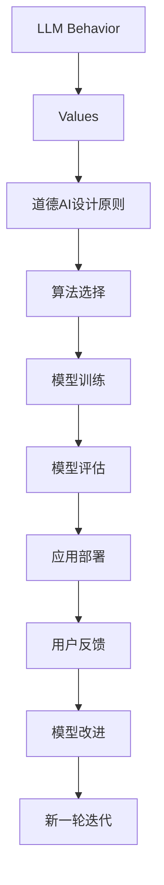

                 

## 1. 背景介绍

随着人工智能（AI）技术的快速发展和应用，人工智能大语言模型（Large Language Models, LLMs）逐渐进入公众视野，广泛应用于智能客服、自动摘要、自然语言理解等场景。然而，这些基于深度学习的语言模型在获取大量数据进行训练时，也带来了新的伦理挑战和道德困境。近年来，一系列负面事件的发生，如生成假新闻、损害隐私、种族歧视等，引起了广泛关注。因此，如何在智能技术的发展过程中，确保其行为符合人类价值观，成为亟待解决的问题。本文将探讨如何构建道德AI，让大语言模型在提升人类生活品质的同时，符合社会的伦理规范和道德准则。

## 2. 核心概念与联系

### 2.1 核心概念概述

要构建道德AI，首先需要理解以下核心概念：

1. **道德AI（Ethical AI）**：人工智能在设计和应用过程中，遵循社会伦理规范，保障用户隐私安全，避免歧视偏见，确保技术责任透明，不危害人类福祉。

2. **LLM行为（LLM Behavior）**：由大语言模型产生的结果和决策，如自然语言生成、信息推荐、智能问答等。

3. **价值观（Values）**：人类社会普遍认同和追求的道德原则和信念，如公正、诚实、尊重、隐私等。

4. **偏见（Bias）**：模型因训练数据偏差或设计缺陷，而产生的对某些人群或观念的不公平对待。

5. **透明性（Transparency）**：人工智能模型在决策过程中的可解释性和可审计性。

6. **可控性（Controllability）**：人工智能系统能被适当干预，避免失控或危害。

### 2.2 核心概念原理和架构的 Mermaid 流程图



## 3. 核心算法原理 & 具体操作步骤

### 3.1 算法原理概述

道德AI的构建需要结合人工智能的计算能力和伦理学的价值考量，以确保模型在执行任务时，不偏离人类社会的道德准则。核心算法包括以下几个步骤：

1. **价值观内嵌**：将人类价值观融入模型的训练和优化过程，引导模型学习符合伦理规范的行为。

2. **偏见检测和修正**：通过数据清洗、模型约束等方法，识别和消除模型中的偏见和歧视。

3. **透明性与可解释性**：通过可解释性技术，使模型决策过程透明，便于用户理解和审查。

4. **可控性与责任追责**：建立模型的干预机制和责任框架，确保其行为可控和行为主体的明确责任。

### 3.2 算法步骤详解

#### 3.2.1 价值观内嵌

价值观内嵌需要通过以下步骤实现：

1. **伦理设计**：在模型设计阶段，融入伦理规范和道德约束。如使用公平性约束、隐私保护设计等。

2. **数据过滤**：对训练数据进行清洗和过滤，去除可能含有歧视、虚假信息的数据。

3. **目标函数优化**：将人类价值观融入模型的目标函数，如最小化偏见、增强隐私保护等。

4. **约束引入**：在模型训练过程中，引入伦理约束条件，如公平性约束、隐私保护约束等。

#### 3.2.2 偏见检测和修正

偏见检测和修正是确保模型公正性的关键步骤：

1. **偏见评估**：利用公平性指标评估模型的偏见程度，如Demographic Parity、Equalized Odds等。

2. **数据分布**：通过样本重采样、数据增强等方法，平衡不同群体的数据分布。

3. **模型约束**：在模型训练中引入公平性约束，如对抗性公平训练、公平性惩罚机制等。

4. **后处理修正**：在模型部署后，对预测结果进行后处理，纠正偏见。

#### 3.2.3 透明性与可解释性

透明性和可解释性技术，使模型决策过程透明，便于审查：

1. **可解释性模型**：选择可解释性较高的模型，如决策树、线性模型等。

2. **可解释性技术**：利用可解释性技术，如LIME、SHAP等，分析模型决策过程。

3. **透明度要求**：在模型设计和开发过程中，满足透明度要求，如模型报告、透明性审核等。

4. **用户反馈机制**：建立用户反馈机制，及时收集用户对模型输出的意见，调整模型行为。

#### 3.2.4 可控性与责任追责

可控性和责任追责是确保模型行为可控和主体责任明确的重要措施：

1. **干预机制**：建立模型的干预机制，如模型停用、紧急回退等。

2. **责任主体**：明确模型行为的责任主体，如开发团队、应用机构等。

3. **合规审核**：建立合规审核机制，定期检查模型行为，确保其符合伦理规范。

4. **责任机制**：建立责任追责机制，对模型行为失当的情况，追究相关责任。

### 3.3 算法优缺点

#### 3.3.1 优点

1. **保障伦理安全**：确保大语言模型符合人类价值观，减少道德风险。

2. **提高用户信任**：通过透明的决策过程和公平性保证，增强用户信任感。

3. **降低法律风险**：明确模型行为的责任主体，减少法律纠纷。

#### 3.3.2 缺点

1. **复杂度增加**：在模型设计和训练过程中，需要额外考虑伦理约束，增加了复杂度。

2. **性能下降**：部分可解释性技术可能会影响模型的性能。

3. **资源消耗**：透明度和可解释性技术的实现，可能增加计算资源消耗。

## 4. 数学模型和公式 & 详细讲解 & 举例说明

### 4.1 数学模型构建

道德AI的构建涉及多个领域的数学模型，本文以公平性约束为例进行详细讲解：

假设模型输出的概率分布为 $p(y|x)$，其中 $y$ 为输出类别，$x$ 为输入特征。公平性约束可以通过以下公式实现：

$$
\min_{\theta} \mathcal{L}(p_{\theta}(y|x)) \text{ s.t. } p_{\theta}(y|x) \geq \alpha \text{ for all } y \text{ and } x
$$

其中 $\mathcal{L}$ 为模型的损失函数，$\alpha$ 为公平性阈值。

### 4.2 公式推导过程

公平性约束的推导过程如下：

1. **定义公平性指标**：
   - 在二分类任务中，定义 demographic parity 和 equalized odds 等公平性指标。
   - demographic parity 要求对每个类别 $y$，模型的预测概率 $p(y|x)$ 对任意特征 $x$ 不发生变化，即 $p(y|x) = p(y|x')$。
   - equalized odds 要求模型对不同类别的预测概率与真实标签的乘积相等，即 $p(y|x) \times \mathbb{1}(y = y^+) = p(y|x) \times \mathbb{1}(y = y^-)$。

2. **模型约束优化**：
   - 将公平性指标作为约束条件，引入惩罚项，优化目标函数。
   - 例如，在目标函数中加入 L1 正则化，惩罚预测概率的偏差，保证公平性。

3. **公平性惩罚机制**：
   - 在模型训练中引入公平性惩罚机制，如最大似然估计中的公平性惩罚项。
   - 例如，对于二分类问题，引入公平性惩罚项 $p_{\theta}(y|x) \times (1 - p_{\theta}(y|x))$，确保模型在两个类别上的概率均衡。

4. **后处理修正**：
   - 在模型输出后，通过后处理技术，修正预测结果中的偏差，实现公平性。
   - 例如，利用 Calibrated odds 方法，对预测概率进行修正，确保公平性。

### 4.3 案例分析与讲解

假设构建一个医疗诊断系统，用于判断疾病的发生概率。在数据集中，不同种族和性别的患者分布不均，可能导致模型诊断结果存在偏见。为了确保模型公平，可以采用以下方法：

1. **数据清洗**：过滤掉不平衡的训练数据，确保每个类别都有足够的样本。

2. **模型训练**：在目标函数中加入公平性约束，如 demographic parity 约束。

3. **后处理修正**：对模型输出的概率进行修正，确保不同群体的诊断结果公平。

4. **透明度报告**：定期发布模型的透明度报告，说明模型公平性指标和修正方法。

## 5. 项目实践：代码实例和详细解释说明

### 5.1 开发环境搭建

为了构建道德AI，需要以下开发环境：

1. **Python 环境**：使用 Python 3.8 及以上版本，推荐使用 Anaconda 创建虚拟环境。

2. **深度学习框架**：使用 PyTorch 或 TensorFlow，支持 GPU 加速。

3. **可解释性库**：安装 LIME 或 SHAP，用于模型解释和公平性评估。

4. **数据处理库**：安装 Pandas、NumPy 等，用于数据清洗和处理。

5. **伦理合规库**：安装 Ethical AI 相关的库，如 Fairness Indicators、AI4Demos 等。

### 5.2 源代码详细实现

以下是一个简单的道德AI构建示例，用于医疗诊断系统的公平性约束：

```python
import torch
import torch.nn as nn
from torch.nn import BCELoss, CrossEntropyLoss
from torch.optim import Adam
from fairing import Fairing

class FairModel(nn.Module):
    def __init__(self):
        super(FairModel, self).__init__()
        self.linear = nn.Linear(10, 2)
    
    def forward(self, x):
        y_pred = self.linear(x)
        return y_pred

# 构建模型
model = FairModel()
loss_fn = CrossEntropyLoss()
optimizer = Adam(model.parameters(), lr=0.001)

# 公平性约束
fairing = Fairing(model, metric='demographic_parity')
fairing.register_hook(lambda grad: grad * 0.5)

# 数据集
train_data = ...
train_loader = DataLoader(train_data, batch_size=32, shuffle=True)

# 训练模型
for epoch in range(10):
    for batch in train_loader:
        x, y = batch
        optimizer.zero_grad()
        y_pred = model(x)
        loss = loss_fn(y_pred, y)
        loss += fairing.fairness_loss
        loss.backward()
        optimizer.step()
```

### 5.3 代码解读与分析

1. **模型定义**：定义了一个简单的线性模型，用于疾病诊断。

2. **公平性约束**：通过 Fairing 库引入公平性约束，设置 demographic parity 约束。

3. **公平性惩罚**：在梯度更新过程中，加入公平性惩罚项，确保模型公平性。

4. **公平性评估**：通过公平性指标评估模型的公平性，确保训练过程中模型行为符合伦理规范。

5. **模型训练**：在训练过程中，同时最小化损失函数和公平性损失函数，确保模型输出公平。

### 5.4 运行结果展示

运行上述代码后，可以得到公平性约束的训练结果。通过可视化的公平性指标，可以评估模型的公平性，确保其符合道德规范。

## 6. 实际应用场景

### 6.1 智能客服系统

智能客服系统中，大语言模型需要处理大量用户的咨询请求，涉及隐私保护和公平性问题。为了确保系统符合伦理规范，可以采用以下措施：

1. **隐私保护**：采用差分隐私技术，确保用户信息不泄露。

2. **公平性约束**：在客服对话中，确保对不同群体的回复公平，避免歧视。

3. **透明性**：记录客服对话过程，提供客服回访和用户反馈机制。

4. **可控性**：设置紧急回退机制，确保在异常情况下，系统能够及时干预和恢复正常。

### 6.2 金融舆情监测系统

金融舆情监测系统需要实时监测市场舆情，避免负面信息传播，确保系统公平性和透明度。可以采用以下措施：

1. **数据清洗**：过滤掉虚假信息和有害内容，确保舆情监测的准确性。

2. **公平性约束**：对不同群体的舆情监测结果进行平衡，避免偏见。

3. **透明度报告**：定期发布舆情监测报告，公开监测结果和公平性指标。

4. **责任追责**：对舆情监测错误的情况，追究相关责任，确保系统可靠。

### 6.3 个性化推荐系统

个性化推荐系统中，大语言模型需要为用户推荐符合其兴趣的商品。为了确保系统符合伦理规范，可以采用以下措施：

1. **隐私保护**：采用差分隐私技术，确保用户数据不泄露。

2. **公平性约束**：在推荐过程中，确保对不同用户的推荐公平，避免歧视。

3. **透明性**：提供推荐理由，让用户了解推荐依据，增强信任感。

4. **可控性**：设置用户干预机制，允许用户自定义推荐偏好。

## 7. 工具和资源推荐

### 7.1 学习资源推荐

1. **《道德人工智能》（Ethical Artificial Intelligence）**：详细介绍了道德AI的设计和应用，涵盖公平性、透明性、可控性等多个方面。

2. **《人工智能伦理：设计、开发和应用》（AI Ethics: Designing, Developing, and Deploying AI Systems）**：从伦理学的角度，探讨了人工智能系统的设计、开发和应用中的伦理问题。

3. **公平性指标评估工具**：如 Fairness Indicators、Fairness 360 等，提供公平性指标评估和公平性修正工具。

4. **差分隐私库**：如 PySyft、Abacus 等，提供差分隐私算法和库，确保用户隐私保护。

5. **可解释性技术**：如 LIME、SHAP 等，提供可解释性模型和工具，增强模型透明度。

### 7.2 开发工具推荐

1. **Python 开发环境**：使用 Anaconda 创建虚拟环境，安装 PyTorch、TensorFlow、LIME、SHAP 等库。

2. **差分隐私库**：安装 PySyft、Abacus 等库，确保用户隐私保护。

3. **公平性指标评估工具**：安装 Fairness Indicators、Fairness 360 等工具，评估模型公平性。

4. **可解释性技术**：使用 LIME 或 SHAP 等库，分析模型决策过程。

### 7.3 相关论文推荐

1. **《公平机器学习》（Fair Machine Learning）**：详细介绍了公平性机器学习的基本概念和应用方法。

2. **《可解释AI》（Explainable AI）**：探讨了可解释AI的理论基础和实践方法，确保模型透明和可控。

3. **《差分隐私》（Differential Privacy）**：介绍了差分隐私的基本概念和算法，确保用户隐私保护。

4. **《道德AI设计》（Ethical AI Design）**：从设计和应用的角度，探讨了道德AI的设计和应用。

## 8. 总结：未来发展趋势与挑战

### 8.1 研究成果总结

本文探讨了如何构建道德AI，确保大语言模型在执行任务时符合人类价值观。通过公平性约束、隐私保护、透明性和可控性等措施，确保模型行为符合伦理规范，提高用户信任感和满意度。

### 8.2 未来发展趋势

1. **公平性技术进步**：随着公平性指标和算法的发展，未来将有更多高效公平性约束方法应用于模型训练。

2. **隐私保护技术创新**：差分隐私等隐私保护技术将不断进步，确保用户数据安全。

3. **可解释性技术发展**：可解释性技术将更加成熟，确保模型决策透明，便于用户审查和调试。

4. **可控性技术完善**：建立更加完善的可控性机制，确保模型行为可控，降低系统风险。

### 8.3 面临的挑战

1. **伦理规范制定**：如何制定和更新适应不同应用场景的伦理规范，是未来的一大挑战。

2. **公平性指标设计**：不同应用场景下的公平性指标设计复杂，需要进一步研究和实践。

3. **隐私保护技术应用**：隐私保护技术的应用成本高，如何在实际应用中平衡隐私保护和系统性能，需要更多的创新。

4. **透明性和可控性实现**：实现透明的决策过程和可控的系统行为，需要深入研究和工程技术支持。

### 8.4 研究展望

未来在道德AI的研究中，可以从以下几个方向进行探索：

1. **跨学科研究**：结合伦理学、社会学、心理学等学科，深入研究人工智能伦理问题，制定更为全面的伦理规范。

2. **自动化伦理审查**：开发自动化伦理审查工具，辅助伦理决策，提高伦理审查效率。

3. **伦理教育**：在人工智能教育中引入伦理课程，培养具备伦理意识的AI开发者和使用者。

4. **伦理技术集成**：将伦理技术和AI技术进行深度集成，开发具备伦理意识和行为可控的智能系统。

总之，道德AI的构建是人工智能技术发展的重要方向，需要在技术进步的同时，不断探索伦理规范的制定和应用。只有技术与人文并重，才能构建真正符合人类价值观的智能系统，实现人类与AI的和谐共存。

## 9. 附录：常见问题与解答

**Q1: 如何确保大语言模型的公平性？**

A: 确保大语言模型的公平性，可以采取以下措施：
1. 数据清洗：去除训练数据中的偏见，确保数据分布平衡。
2. 公平性约束：在模型训练中引入公平性约束，如 demographic parity、equalized odds 等。
3. 后处理修正：对模型输出的概率进行修正，确保不同群体的预测结果公平。
4. 透明度报告：定期发布模型公平性指标和修正方法，提高模型透明度。

**Q2: 如何提高大语言模型的可解释性？**

A: 提高大语言模型的可解释性，可以采取以下措施：
1. 选择可解释性较高的模型，如决策树、线性模型等。
2. 利用可解释性技术，如 LIME、SHAP 等，分析模型决策过程。
3. 提供透明的模型报告，说明模型的决策依据和逻辑。
4. 定期进行模型评估和审核，确保模型的透明性和可解释性。

**Q3: 如何设计道德AI的系统？**

A: 设计道德AI的系统，可以采取以下步骤：
1. 确定系统目标和伦理规范，确保系统符合道德标准。
2. 选择合适的技术架构和工具，确保系统的公平性、透明性和可控性。
3. 在模型设计和开发过程中，融入伦理规范和公平性约束。
4. 定期进行系统评估和审核，确保系统的伦理合规性。

**Q4: 如何处理大语言模型的偏见问题？**

A: 处理大语言模型的偏见问题，可以采取以下措施：
1. 数据清洗：去除训练数据中的偏见，确保数据分布平衡。
2. 模型约束：在模型训练中引入公平性约束，如 demographic parity、equalized odds 等。
3. 后处理修正：对模型输出的概率进行修正，确保不同群体的预测结果公平。
4. 定期进行模型评估和审核，确保模型的公平性和透明性。

作者：禅与计算机程序设计艺术 / Zen and the Art of Computer Programming

