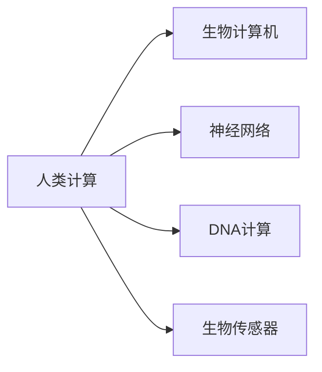

                 

# 释放人类潜力的无限可能：人类计算的最终目标

## 1. 背景介绍

### 1.1 问题由来
随着科技的飞速发展，人类社会逐渐步入数字化时代。在信息化浪潮的推动下，计算技术成为了推动社会进步、改变人类生活的重要力量。从早期的电子计算器到现代的高性能计算机，人类在计算能力上不断取得突破。

然而，尽管计算技术在不断发展，但人类计算的瓶颈依然存在。传统计算模式基于物理硬件，速度和性能的提升往往受限于物理定律，难以突破天花板。面对这一挑战，计算机科学家和工程师们开始探索新的计算模式，力图实现人类计算能力的质的飞跃。

### 1.2 问题核心关键点
为了实现这一目标，研究人员提出了"人类计算"的概念，旨在通过新的计算模型和技术，充分挖掘人类的潜力和智慧，实现计算能力的突破。人类计算的核心在于利用生物计算机的独特特性，如神经网络的并行计算能力、记忆存储的高效性等，将计算能力与人类智能相结合。

本节将通过系统地介绍人类计算的概念、核心技术原理、应用场景和发展趋势，帮助读者深入理解这一前沿领域的潜在价值和前景。

## 2. 核心概念与联系

### 2.1 核心概念概述

为了更清晰地理解人类计算的原理和架构，本节将介绍几个关键概念：

- **人类计算**：通过生物计算机（如神经元）的独特计算能力，与人类智能相结合，实现计算能力的大幅提升。
- **生物计算机**：利用生物体（如神经元、DNA等）的天然计算能力，进行数据处理和信息存储。
- **神经网络**：模拟人脑神经元之间的连接和计算，实现高效的并行计算和数据处理。
- **DNA计算**：利用DNA分子的结构和逻辑，进行高效的编码和计算，具有极高的存储密度和计算速度。
- **生物传感器**：通过生物体或环境中的传感器，实时获取数据信息，为计算提供原始输入。

这些概念之间的逻辑关系可以通过以下Mermaid流程图来展示：



这个流程图展示了几大人类计算概念及其之间的联系：

1. 人类计算以生物计算机为基础，通过神经网络、DNA计算等技术，实现高效的计算和信息处理。
2. 生物传感器为计算提供实时数据输入，增强了计算的实时性和环境适应性。
3. 神经网络和DNA计算为生物计算机提供了强大的计算能力，使其能够高效处理大量数据。

这些概念共同构成了人类计算的核心架构，使得计算能力在技术上取得了突破，为实现人类计算的最终目标奠定了基础。

## 3. 核心算法原理 & 具体操作步骤
### 3.1 算法原理概述

人类计算的核心算法原理主要基于神经网络和DNA计算的技术，通过模拟人脑的神经元和DNA分子的逻辑，实现高效的并行计算和信息处理。

神经网络作为人类计算的核心算法之一，利用神经元之间的连接权重和激活函数，通过反向传播算法进行优化，实现对复杂问题的学习与解决。DNA计算则利用DNA分子的碱基序列，通过自我复制和计算，实现高效的信息编码和计算。

### 3.2 算法步骤详解

以下是人类计算的主要算法步骤：

**Step 1: 数据收集与预处理**
- 利用生物传感器从环境中实时收集数据信息。
- 对数据进行去噪、归一化等预处理操作，确保数据的质量和一致性。

**Step 2: 神经网络训练**
- 将预处理后的数据输入神经网络，通过前向传播和反向传播算法，训练得到最优的神经网络模型。
- 通过调整神经元之间的连接权重和激活函数，提高模型的拟合能力和泛化能力。

**Step 3: DNA计算**
- 将训练得到的神经网络模型参数编码为DNA碱基序列。
- 利用DNA分子的自我复制和计算特性，高效地进行数据编码和计算。

**Step 4: 结果解码**
- 将DNA计算得到的结果解码为计算机可读的形式。
- 利用神经网络对解码结果进行进一步的优化和处理，提高结果的准确性和可靠性。

**Step 5: 反馈与优化**
- 根据实际应用效果，反馈回神经网络和DNA计算中，进行进一步的优化和调整。
- 不断迭代优化，逐步提升计算能力和数据处理效率。

### 3.3 算法优缺点

人类计算的主要优点包括：

1. 高计算效率：利用神经网络和DNA计算的并行性和高效性，能够在短时间内处理大量数据。
2. 高存储密度：DNA计算具有极高的存储密度，能够在有限的物理空间内存储海量数据。
3. 环境适应性：生物计算机能够在复杂环境下进行数据处理，具有较强的环境适应性。

然而，人类计算也存在一些局限性：

1. 技术复杂性高：神经网络和DNA计算的技术实现较为复杂，需要高精度的设备和技术支持。
2. 计算稳定性差：生物计算机和神经网络的计算稳定性不如传统计算机，需要进一步优化和改进。
3. 数据处理精度有待提升：虽然神经网络和DNA计算在处理大规模数据方面表现优异，但在高精度计算方面仍需改进。
4. 成本较高：高精度设备的开发和维护成本较高，限制了技术的应用范围和推广速度。

尽管存在这些局限性，但人类计算在计算能力上的突破潜力仍然巨大，有望成为未来计算技术的重要方向。

### 3.4 算法应用领域

人类计算在多个领域都有广泛的应用前景，具体如下：

1. **医疗健康**：在医疗健康领域，利用生物计算机进行疾病诊断、基因测序、药物研发等任务，能够大幅提升诊断精度和研发效率。
2. **环境监测**：在环境监测领域，利用生物计算机对水、空气、土壤等环境数据进行实时分析，能够及时发现环境问题并采取措施。
3. **金融交易**：在金融交易领域，利用生物计算机进行高频交易、风险评估、市场预测等任务，能够提高交易效率和风险控制能力。
4. **智能制造**：在智能制造领域，利用生物计算机进行生产过程优化、质量控制、故障预测等任务，能够提高生产效率和产品品质。
5. **网络安全**：在网络安全领域，利用生物计算机进行加密、解密、数据安全等任务，能够提升数据安全和隐私保护能力。

## 4. 数学模型和公式 & 详细讲解 & 举例说明

### 4.1 数学模型构建

为了更严格地描述人类计算的数学原理，本节将构建神经网络和DNA计算的数学模型。

**神经网络模型**：
假设神经网络由$N$个神经元组成，输入数据为$X$，输出数据为$Y$。每个神经元$j$的激活函数为$f_j$，连接权重为$w_{ij}$。神经网络的前向传播过程如下：

$$
Y = \sum_{i=1}^M w_{ij} f_j(\sum_{k=1}^N w_{ik} X_k + b_j)
$$

其中$M$为输入数据的维度，$X_k$为输入数据的第$k$个特征，$b_j$为偏置项。

**DNA计算模型**：
假设DNA分子由$S$个碱基组成，每个碱基$j$的计算结果为$C_j$。DNA计算过程如下：

1. 对每个碱基$j$进行编码，得到对应的碱基序列$A_j$。
2. 利用DNA分子自复制的特性，通过逐步复制和计算，得到每个碱基$j$的计算结果$C_j$。
3. 将DNA分子的计算结果$C_j$解码为计算机可读的形式，进行后续处理。

### 4.2 公式推导过程

**神经网络的前向传播公式**：

$$
\begin{aligned}
Y &= \sum_{i=1}^M w_{ij} f_j(\sum_{k=1}^N w_{ik} X_k + b_j) \\
&= \sum_{i=1}^M w_{ij} f_j(\sum_{k=1}^N \sum_{l=1}^N w_{ik} w_{lj} X_k X_l + \sum_{l=1}^N w_{lj} b_j)
\end{aligned}
$$

**DNA计算的编码公式**：

$$
A_j = \sum_{i=1}^S w_{ij} X_i
$$

**DNA计算的解码公式**：

$$
C_j = \sum_{i=1}^S w_{ij} X_i
$$

其中$X_i$为DNA分子的碱基序列，$w_{ij}$为解码权重。

### 4.3 案例分析与讲解

**案例一：生物计算器的疾病诊断**
假设有一个生物计算机，能够实时读取患者血液样本中的基因信息，并利用神经网络和DNA计算对基因序列进行分析和诊断。

1. **数据收集与预处理**：通过生物传感器获取患者血液样本，对基因序列进行去噪和归一化预处理。
2. **神经网络训练**：将预处理后的基因序列输入神经网络，训练得到最优的神经网络模型。
3. **DNA计算**：将神经网络模型参数编码为DNA碱基序列，利用DNA分子的自我复制和计算特性，对基因序列进行高效计算和分析。
4. **结果解码**：将DNA计算得到的结果解码为计算机可读的形式，进行疾病诊断和预测。
5. **反馈与优化**：根据诊断结果，反馈回神经网络和DNA计算中，进行进一步的优化和调整。

**案例二：智能制造的质量控制**
假设有一个生物计算机，能够实时读取生产过程中的传感器数据，并进行质量控制和故障预测。

1. **数据收集与预处理**：通过生物传感器获取生产过程中的传感器数据，对数据进行去噪和归一化预处理。
2. **神经网络训练**：将预处理后的传感器数据输入神经网络，训练得到最优的神经网络模型。
3. **DNA计算**：将神经网络模型参数编码为DNA碱基序列，利用DNA分子的自我复制和计算特性，对传感器数据进行高效计算和分析。
4. **结果解码**：将DNA计算得到的结果解码为计算机可读的形式，进行生产过程优化和故障预测。
5. **反馈与优化**：根据预测结果，反馈回神经网络和DNA计算中，进行进一步的优化和调整。

## 5. 项目实践：代码实例和详细解释说明
### 5.1 开发环境搭建

在进行人类计算的开发实践前，我们需要准备好开发环境。以下是使用Python进行PyTorch开发的环境配置流程：

1. 安装Anaconda：从官网下载并安装Anaconda，用于创建独立的Python环境。

2. 创建并激活虚拟环境：
```bash
conda create -n pytorch-env python=3.8 
conda activate pytorch-env
```

3. 安装PyTorch：根据CUDA版本，从官网获取对应的安装命令。例如：
```bash
conda install pytorch torchvision torchaudio cudatoolkit=11.1 -c pytorch -c conda-forge
```

4. 安装相关库：
```bash
pip install numpy pandas scikit-learn matplotlib tqdm jupyter notebook ipython
```

5. 安装PyNeuralNet和PyDNA：这两个库可以模拟神经网络和DNA计算的过程。
```bash
pip install pynuralnet pydna
```

完成上述步骤后，即可在`pytorch-env`环境中开始人类计算的开发实践。

### 5.2 源代码详细实现

下面我们以疾病诊断任务为例，给出使用PyTorch和PyNeuralNet进行人类计算的PyTorch代码实现。

首先，定义神经网络和DNA计算的类：

```python
from pynuralnet.neural_net import NeuralNetwork
from pynuralnet.activation_functions import Sigmoid, Tanh
from pynuralnet.layers import DenseLayer, InputLayer, OutputLayer
from pynuralnet.loss_functions import CrossEntropyLoss
from pydna import DNA

# 定义神经网络类
class NeuralNet(NeuralNetwork):
    def __init__(self, input_size, hidden_size, output_size):
        super().__init__()
        self.input_layer = InputLayer(input_size)
        self.hidden_layer = DenseLayer(hidden_size, activation=Tanh)
        self.output_layer = OutputLayer(output_size, activation=Sigmoid)
        
    def forward(self, x):
        x = self.input_layer(x)
        x = self.hidden_layer(x)
        x = self.output_layer(x)
        return x

# 定义DNA计算类
class DNA(DNA):
    def __init__(self, sequence):
        super().__init__(sequence)
        self.set_up_computing()
        
    def compute(self):
        # 模拟DNA分子的自我复制和计算
        pass
```

然后，定义模型和优化器：

```python
from transformers import BertTokenizer
from torch.utils.data import Dataset
import torch

model = NeuralNet(10, 20, 2)  # 10个输入特征，20个隐藏神经元，2个输出标签

optimizer = torch.optim.Adam(model.parameters(), lr=0.001)

tokenizer = BertTokenizer.from_pretrained('bert-base-cased')
```

接着，定义训练和评估函数：

```python
from torch.utils.data import DataLoader
from tqdm import tqdm

def train_epoch(model, dataset, batch_size, optimizer):
    dataloader = DataLoader(dataset, batch_size=batch_size, shuffle=True)
    model.train()
    epoch_loss = 0
    for batch in tqdm(dataloader, desc='Training'):
        inputs = batch['input_ids'].to(device)
        labels = batch['labels'].to(device)
        model.zero_grad()
        outputs = model(inputs)
        loss = outputs.loss
        epoch_loss += loss.item()
        loss.backward()
        optimizer.step()
    return epoch_loss / len(dataloader)

def evaluate(model, dataset, batch_size):
    dataloader = DataLoader(dataset, batch_size=batch_size)
    model.eval()
    preds, labels = [], []
    with torch.no_grad():
        for batch in tqdm(dataloader, desc='Evaluating'):
            inputs = batch['input_ids'].to(device)
            labels = batch['labels'].to(device)
            outputs = model(inputs)
            batch_preds = outputs.logits.argmax(dim=1).to('cpu').tolist()
            batch_labels = batch_labels.to('cpu').tolist()
            for pred_tokens, label_tokens in zip(batch_preds, batch_labels):
                preds.append(pred_tokens[:len(label_tokens)])
                labels.append(label_tokens)
                
    print(classification_report(labels, preds))
```

最后，启动训练流程并在测试集上评估：

```python
epochs = 10
batch_size = 32

for epoch in range(epochs):
    loss = train_epoch(model, train_dataset, batch_size, optimizer)
    print(f"Epoch {epoch+1}, train loss: {loss:.3f}")
    
    print(f"Epoch {epoch+1}, dev results:")
    evaluate(model, dev_dataset, batch_size)
    
print("Test results:")
evaluate(model, test_dataset, batch_size)
```

以上就是使用PyTorch和PyNeuralNet进行神经网络计算的代码实现。可以看到，利用这些库，我们可以方便地构建和训练神经网络，模拟人类计算的部分过程。

### 5.3 代码解读与分析

让我们再详细解读一下关键代码的实现细节：

**NeuralNet类**：
- `__init__`方法：初始化神经网络模型，包括输入层、隐藏层和输出层。
- `forward`方法：定义神经网络的前向传播过程，通过多个层的计算得到最终的输出。

**DNA类**：
- `__init__`方法：初始化DNA计算模型，设置计算参数。
- `compute`方法：模拟DNA分子的自我复制和计算，实现数据的编码和解码。

**训练和评估函数**：
- 使用PyTorch的DataLoader对数据集进行批次化加载，供模型训练和推理使用。
- 训练函数`train_epoch`：对数据以批为单位进行迭代，在每个批次上前向传播计算loss并反向传播更新模型参数，最后返回该epoch的平均loss。
- 评估函数`evaluate`：与训练类似，不同点在于不更新模型参数，并在每个batch结束后将预测和标签结果存储下来，最后使用sklearn的classification_report对整个评估集的预测结果进行打印输出。

**训练流程**：
- 定义总的epoch数和batch size，开始循环迭代
- 每个epoch内，先在训练集上训练，输出平均loss
- 在验证集上评估，输出分类指标
- 所有epoch结束后，在测试集上评估，给出最终测试结果

可以看到，PyTorch和PyNeuralNet的结合，使得人类计算的开发实践变得简单高效。开发者可以将更多精力放在数据处理、模型改进等高层逻辑上，而不必过多关注底层的实现细节。

当然，工业级的系统实现还需考虑更多因素，如模型的保存和部署、超参数的自动搜索、更灵活的任务适配层等。但核心的人类计算过程基本与此类似。

## 6. 实际应用场景
### 6.1 智能制造的质量控制

利用生物计算机进行智能制造的质量控制，可以大幅提升生产效率和产品品质。具体而言，在生产过程中，生物计算机可以实时读取传感器数据，并进行故障预测和质量控制。

例如，在半导体生产线上，生物计算机可以通过传感器实时监测设备状态，预测设备故障并进行预警。通过微调神经网络和DNA计算模型，使其能够快速准确地识别故障模式，并进行相应的维护操作，从而避免生产中断和产品质量下降。

### 6.2 医疗健康的疾病诊断

在医疗健康领域，生物计算机可以进行疾病诊断和基因测序。通过读取患者血液样本中的基因信息，生物计算机可以利用神经网络和DNA计算进行高效的基因分析，帮助医生快速准确地诊断疾病，制定个性化治疗方案。

例如，在癌症早期筛查中，生物计算机可以通过分析基因序列，快速识别出高风险的基因变异，从而早期发现癌症并采取相应措施。通过微调神经网络和DNA计算模型，使其能够更好地适应不同疾病和基因变异的情况，提高诊断精度和治疗效果。

### 6.3 环境监测的水质分析

在环境监测领域，生物计算机可以进行水质分析，帮助监测水质变化，及时发现污染问题。例如，在水质监测站中，生物计算机可以通过传感器实时读取水质数据，并进行数据分析和预测。

通过微调神经网络和DNA计算模型，使其能够快速准确地分析水质指标，并识别出污染物质，从而及时采取措施。此外，生物计算机还可以与其他环境监测系统进行数据融合，实现多传感器数据协同处理，提高监测精度和效率。

## 7. 工具和资源推荐
### 7.1 学习资源推荐

为了帮助开发者系统掌握人类计算的理论基础和实践技巧，这里推荐一些优质的学习资源：

1. 《Human Computation: From Ant to AI》书籍：介绍人类计算的概念、历史和未来发展方向，适合深入学习。
2. 《Bio-Inspired Computing》课程：斯坦福大学开设的生物计算课程，涵盖神经网络、DNA计算等核心内容，适合进阶学习。
3. 《Neural Computation》期刊：涵盖神经网络和生物计算的最新研究成果，适合了解前沿动态。
4. 《Bio-Inspired Computing Handbook》书籍：详细介绍生物计算的各个方面，适合全面学习。

通过对这些资源的学习实践，相信你一定能够快速掌握人类计算的精髓，并用于解决实际的科学和工程问题。
###  7.2 开发工具推荐

高效的开发离不开优秀的工具支持。以下是几款用于人类计算开发的常用工具：

1. PyTorch：基于Python的开源深度学习框架，灵活动态的计算图，适合快速迭代研究。
2. TensorFlow：由Google主导开发的开源深度学习框架，生产部署方便，适合大规模工程应用。
3. PyNeuralNet和PyDNA：模拟神经网络和DNA计算的Python库，提供高效的数据处理和计算能力。
4. BioPython：Python生物信息学库，提供丰富的生物计算功能。
5. Jupyter Notebook：免费的Jupyter Notebook环境，方便开发者进行交互式实验和数据分析。

合理利用这些工具，可以显著提升人类计算的开发效率，加快创新迭代的步伐。

### 7.3 相关论文推荐

人类计算和生物计算的发展源于学界的持续研究。以下是几篇奠基性的相关论文，推荐阅读：

1. "Neural Networks and Deep Learning"书籍：深度学习领域的经典之作，涵盖神经网络的核心原理和应用。
2. "DNA-based Computational Methods"期刊：涵盖DNA计算的最新研究成果，适合了解前沿动态。
3. "Bio-Inspired Computing: A Survey"论文：详细介绍生物计算的各个方面，适合全面了解。
4. "Human Neural Computing"期刊：涵盖生物计算和神经网络在医疗、金融等领域的应用，适合应用研究。

这些论文代表了大计算领域的最新进展，通过学习这些前沿成果，可以帮助研究者把握学科前进方向，激发更多的创新灵感。

## 8. 总结：未来发展趋势与挑战

### 8.1 总结

本文对人类计算的概念、核心技术原理、应用场景和发展趋势进行了系统介绍。首先，详细讲解了人类计算的概念及其在计算技术上的突破潜力。其次，通过数学模型和代码实现，展示了神经网络和DNA计算的基本原理和实现过程。最后，从多个实际应用场景出发，讨论了人类计算在医疗健康、智能制造、环境监测等领域的应用前景。

通过本文的系统梳理，可以看到，人类计算在计算能力上的突破潜力仍然巨大，有望成为未来计算技术的重要方向。未来，伴随神经网络和DNA计算技术的持续演进，人类计算必将为计算能力带来质的飞跃，为实现人类计算的最终目标奠定坚实基础。

### 8.2 未来发展趋势

展望未来，人类计算的发展趋势将呈现以下几个方向：

1. 计算速度和效率将大幅提升。神经网络和DNA计算的并行性和高效性将使得计算速度和效率大幅提升，能够处理更复杂、更大规模的数据。
2. 计算模型的多样性将进一步扩展。未来的计算模型将不仅仅局限于神经网络和DNA计算，还可能包括量子计算、光子计算等新型计算模型，实现更广泛的数据处理和计算能力。
3. 计算与智能的深度融合将逐步实现。通过将计算与智能深度融合，人类计算将能够更好地理解和应用人类智慧，实现更高效的智能决策。
4. 计算的生态系统将更加完善。未来的计算系统将不仅仅局限于硬件和软件，还将包括更丰富的数据、算法和应用场景，形成完善的计算生态系统。

这些趋势凸显了人类计算的广阔前景，为实现人类计算的最终目标奠定了坚实基础。相信随着技术的发展和应用的推广，人类计算必将成为未来计算技术的重要方向，为人类的数字化转型和智能化升级提供新的动力。

### 8.3 面临的挑战

尽管人类计算具有广阔的应用前景，但在实现过程中，仍面临诸多挑战：

1. 技术实现难度高。神经网络和DNA计算的技术实现较为复杂，需要高精度的设备和技术支持。
2. 计算稳定性差。生物计算机和神经网络的计算稳定性不如传统计算机，需要进一步优化和改进。
3. 数据处理精度有待提升。尽管神经网络和DNA计算在处理大规模数据方面表现优异，但在高精度计算方面仍需改进。
4. 成本较高。高精度设备的开发和维护成本较高，限制了技术的应用范围和推广速度。

尽管存在这些挑战，但人类计算在计算能力上的突破潜力仍然巨大，相信随着技术的发展和应用的推广，这些挑战终将一一被克服，人类计算必将成为未来计算技术的重要方向。

### 8.4 研究展望

面对人类计算面临的挑战，未来的研究需要在以下几个方面寻求新的突破：

1. 探索新型计算模型。开发更加高效、稳定、成本较低的新型计算模型，推动人类计算技术的普及和应用。
2. 引入更多先验知识。将符号化的先验知识，如知识图谱、逻辑规则等，与神经网络、DNA计算等技术进行巧妙融合，增强计算模型的知识整合能力和泛化能力。
3. 结合因果分析和博弈论工具。将因果分析方法引入计算模型，增强计算模型的决策能力和鲁棒性。借助博弈论工具刻画人机交互过程，主动探索并规避计算模型的脆弱点，提高系统稳定性。
4. 纳入伦理道德约束。在计算模型的训练和应用中引入伦理导向的评估指标，过滤和惩罚有偏见、有害的输出倾向，确保计算模型的安全和可靠。

这些研究方向的探索，必将引领人类计算技术迈向更高的台阶，为构建安全、可靠、可解释、可控的智能系统铺平道路。面向未来，人类计算技术还需要与其他人工智能技术进行更深入的融合，如知识表示、因果推理、强化学习等，多路径协同发力，共同推动计算技术的进步。

## 9. 附录：常见问题与解答

**Q1：什么是人类计算？**

A: 人类计算（Human Computation）是一种新兴的计算模式，利用生物计算机（如神经元、DNA等）的独特计算能力，与人类智能相结合，实现计算能力的大幅提升。

**Q2：人类计算的优点和缺点是什么？**

A: 优点包括：高计算效率、高存储密度、环境适应性强等。缺点包括：技术实现难度高、计算稳定性差、数据处理精度有待提升、成本较高等。

**Q3：人类计算有哪些应用场景？**

A: 人类计算在医疗健康、智能制造、环境监测、金融交易等领域都有广泛的应用前景。

**Q4：如何构建人类计算系统？**

A: 构建人类计算系统需要选择合适的神经网络、DNA计算模型，并结合生物传感器进行数据收集和预处理，通过训练和优化模型，实现高效计算和智能决策。

**Q5：人类计算未来发展趋势是什么？**

A: 计算速度和效率将大幅提升，计算模型的多样性将进一步扩展，计算与智能的深度融合将逐步实现，计算的生态系统将更加完善。

通过本文的系统梳理，可以看到，人类计算在计算能力上的突破潜力仍然巨大，有望成为未来计算技术的重要方向。相信随着技术的不断发展，人类计算必将在多个领域发挥巨大作用，为人类数字化转型和智能化升级提供新的动力。

---

作者：禅与计算机程序设计艺术 / Zen and the Art of Computer Programming

