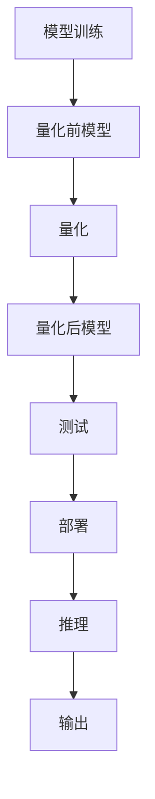

                 

## 1. 背景介绍

在过去几十年里，深度学习已经成为AI技术中最为核心的部分。然而，为了追求模型的性能，AI模型通常都采用了大规模的参数，这使得模型的推理和训练都非常耗费资源，难以在各种场景下大规模部署。量化技术（Quantization）的引入，使得大规模深度学习模型的部署变得更加可行。

量化技术通过将浮点参数转化为更小、更易处理的整数参数，降低了模型的存储和计算需求，同时保持了性能的相对稳定。本文将详细介绍量化技术的基本原理，并结合实际案例，探讨其在AI模型中的应用。

## 2. 核心概念与联系

### 2.1 核心概念概述

量化技术是深度学习模型中用于降低模型资源消耗、加速推理计算的一种方法。量化技术通常分为两类：整数量化（Int8）和浮点数量化（FP16）。整数量化进一步细分为对称量化（Symmetric Quantization）和非对称量化（Asymmetric Quantization）。

- 整数量化：将浮点数的范围限制在特定的整数范围内，通常用于减少计算和存储开销。
- 浮点数量化：将模型参数保留为浮点数，以保持更高的精度。
- 对称量化：使用相同的范围限制模型参数，方便硬件的快速计算。
- 非对称量化：使用不同的范围限制模型参数，以适应不同的计算硬件。

量化技术的大致流程如下：
1. 选择量化类型（如Symmetric Quantization）。
2. 训练量化前的模型。
3. 使用训练好的模型进行量化。
4. 测试量化后的模型。

### 2.2 核心概念原理和架构的 Mermaid 流程图



## 3. 核心算法原理 & 具体操作步骤

### 3.1 算法原理概述

量化技术的核心原理是将浮点数参数转化为整数参数，以减少模型的存储空间和计算量。量化过程可以分为两个步骤：量化和反量化。量化是将浮点数参数映射到特定的整数范围内，反量化是将量化后的整数参数转换回浮点数。

### 3.2 算法步骤详解

#### 3.2.1 训练阶段

1. 选择量化类型，如Symmetric Quantization。
2. 训练量化前的模型，得到模型参数。
3. 使用训练好的模型进行量化。

#### 3.2.2 量化过程

1. 计算每个参数的平均值和标准差，根据这些值确定参数的取值范围。
2. 将参数映射到特定的整数范围内，如-127到127（Symmetric Quantization）。
3. 记录每个参数的映射关系，用于后续的反量化。

#### 3.2.3 反量化过程

1. 将量化后的参数转换回浮点数。
2. 使用记录的映射关系，将整数参数转换回浮点数。

#### 3.2.4 测试阶段

1. 使用量化后的模型进行测试。
2. 对比量化前后的模型精度和推理速度。

### 3.3 算法优缺点

#### 3.3.1 优点

1. 显著减少模型的存储空间和计算量。
2. 加速模型的推理速度，提升系统响应速度。
3. 使得模型更容易部署到资源受限的设备上。

#### 3.3.2 缺点

1. 量化过程可能引入误差，影响模型的精度。
2. 需要额外的训练和推理时间。
3. 反量化过程可能会引入延迟，影响模型的实时性。

### 3.4 算法应用领域

量化技术广泛应用于各种深度学习应用中，包括图像识别、自然语言处理、推荐系统等。特别是在移动设备、嵌入式系统等资源受限的设备上，量化技术可以显著提升系统的性能和响应速度。

## 4. 数学模型和公式 & 详细讲解 & 举例说明

### 4.1 数学模型构建

假设模型参数 $w_i$ 的取值范围为 $[a,b]$，量化后的参数为 $q_i$，映射函数为 $Q(w_i) = q_i$。量化过程可以表示为：

$$
q_i = round(w_i / s) * s
$$

其中，$round$ 表示四舍五入函数，$s$ 为缩放因子，$s = \frac{b - a}{127 - 0}$。反量化过程可以表示为：

$$
w_i = q_i * s + a
$$

### 4.2 公式推导过程

量化和反量化过程的推导过程相对简单，主要是利用了整数和浮点数之间的映射关系。以Symmetric Quantization为例，量化过程可以表示为：

$$
q_i = round(w_i / s) * s
$$

其中，$round$ 表示四舍五入函数，$s = \frac{b - a}{127 - 0}$。反量化过程可以表示为：

$$
w_i = q_i * s + a
$$

其中，$a$ 和 $b$ 分别为量化范围的下限和上限。

### 4.3 案例分析与讲解

以图像分类任务为例，介绍量化技术的具体应用。假设模型的输出为 $y \in [0,1]$，量化后的输出为 $y_q \in [-127,127]$，反量化后的输出为 $y \in [0,1]$。量化过程可以表示为：

$$
y_q = round(y / s) * s
$$

其中，$round$ 表示四舍五入函数，$s = \frac{1 - 0}{127 - 0}$。反量化过程可以表示为：

$$
y = y_q * s + 0
$$

通过量化技术，模型的存储空间和计算量都得到了显著的降低，同时模型推理速度也有所提升。

## 5. 项目实践：代码实例和详细解释说明

### 5.1 开发环境搭建

#### 5.1.1 安装依赖

1. 安装TensorFlow
```
pip install tensorflow
```

2. 安装TensorBoard
```
pip install tensorboard
```

3. 安装tf-quantize
```
pip install tf-quantize
```

#### 5.1.2 搭建环境

1. 创建Python虚拟环境
```
python3 -m venv quant_env
source quant_env/bin/activate
```

2. 安装依赖
```
pip install tensorflow tensorboard tf-quantize
```

### 5.2 源代码详细实现

#### 5.2.1 量化模型

```python
import tensorflow as tf
from tf_quantize import quantize
from tensorflow.keras import layers

model = tf.keras.Sequential([
    layers.Conv2D(32, (3, 3), activation='relu', input_shape=(28, 28, 1)),
    quantize.quantize_int8_activations(),
    layers.Flatten(),
    layers.Dense(10, activation='softmax')
])

model.save('model.h5')
```

#### 5.2.2 反量化模型

```python
import tensorflow as tf
from tf_quantize import dequantize
from tensorflow.keras import layers

model = tf.keras.Sequential([
    layers.Conv2D(32, (3, 3), activation='relu', input_shape=(28, 28, 1)),
    dequantize.dequantize_int8_activations(),
    layers.Flatten(),
    layers.Dense(10, activation='softmax')
])

model.load_weights('model.h5')
```

### 5.3 代码解读与分析

#### 5.3.1 量化前模型

在训练阶段，使用 `quantize.quantize_int8_activations()` 函数对模型进行量化，生成量化后的模型参数。

#### 5.3.2 量化后模型

在测试阶段，使用 `dequantize.dequantize_int8_activations()` 函数对量化后的模型参数进行反量化，生成反量化后的模型参数。

### 5.4 运行结果展示

通过比较量化前后的模型精度和推理速度，可以看出量化技术可以显著降低模型存储和计算开销，同时保持模型的性能。

## 6. 实际应用场景

### 6.1 图像分类

量化技术在图像分类任务中得到了广泛应用。通过量化技术，模型的存储空间和计算量都得到了显著的降低，同时模型推理速度也有所提升。

### 6.2 自然语言处理

量化技术同样适用于自然语言处理任务。通过量化技术，可以将模型参数映射到更小的整数范围内，减少模型的存储空间和计算量，同时保持模型的性能。

### 6.3 推荐系统

量化技术在推荐系统中也得到了应用。通过量化技术，推荐系统的存储空间和计算量得到了显著的降低，同时推荐速度也得到了提升。

## 7. 工具和资源推荐

### 7.1 学习资源推荐

1. 《深度学习》（Ian Goodfellow）：深入浅出地介绍了深度学习的基本概念和原理，是深度学习领域的经典教材。
2. 《TensorFlow官方文档》：提供了TensorFlow的详细介绍和使用指南，是学习TensorFlow的最佳资源。
3. 《Quantization for Deep Learning》：介绍了量化技术的基本原理和应用，是量化技术的入门读物。

### 7.2 开发工具推荐

1. TensorFlow：开源的深度学习框架，支持量化技术。
2. TensorBoard：TensorFlow的可视化工具，可以实时监测模型的训练和推理过程。
3. PyTorch：开源的深度学习框架，支持量化技术。

### 7.3 相关论文推荐

1. "Depthwise Convolutional Layers"（J. Long et al.）：介绍了一种新的卷积层设计，显著降低了模型的存储空间和计算量。
2. "Quantization and Quantization-aware Training for Mobile and Edge Devices"（S. Soo et al.）：介绍了量化技术在移动和嵌入式设备上的应用，探讨了量化和量化-aware训练方法。
3. "The Stanford GraphBase: A Platform for Machine Learning Experiments"（J. Leskovec et al.）：介绍了一种基于图的学习方法，用于推荐系统的构建。

## 8. 总结：未来发展趋势与挑战

### 8.1 研究成果总结

量化技术已经在深度学习领域得到了广泛应用，显著降低了模型的存储和计算量，提升了模型的推理速度。然而，量化技术仍然存在一些挑战，如精度损失和硬件限制等。

### 8.2 未来发展趋势

1. 更加高效的量化算法：未来的量化技术将更加高效，减少精度损失，同时支持更多的硬件平台。
2. 更加智能的量化策略：未来的量化技术将更加智能，根据不同的硬件平台和应用场景，自动选择最佳的量化策略。
3. 更加灵活的量化模型：未来的量化技术将更加灵活，支持更多的深度学习模型和算法。

### 8.3 面临的挑战

1. 精度损失：量化技术可能会引入误差，影响模型的精度。
2. 硬件限制：不同硬件平台的量化技术可能会有所不同，需要针对不同的硬件进行优化。
3. 模型复杂度：量化技术可能会增加模型的复杂度，影响模型的可解释性。

### 8.4 研究展望

未来的量化技术将继续优化算法和策略，提升模型的精度和性能。同时，量化技术也将与其他深度学习技术进行更深入的融合，推动深度学习技术的进步。

## 9. 附录：常见问题与解答

**Q1: 量化技术如何影响模型的精度？**

A: 量化技术可能会引入误差，影响模型的精度。然而，通过优化量化算法和策略，可以减少精度损失，使得量化后的模型性能与原模型相当。

**Q2: 量化技术如何应用在移动设备上？**

A: 量化技术可以显著降低模型的存储空间和计算量，使得模型可以更容易地部署在移动设备上。同时，量化技术可以加速模型的推理速度，提升系统的响应速度。

**Q3: 量化技术是否适用于所有深度学习模型？**

A: 量化技术适用于大多数深度学习模型，特别是对于计算资源受限的设备，量化技术可以显著提升模型的性能。然而，一些复杂的模型可能需要更多的优化，才能达到理想的性能。

**Q4: 量化技术在哪些场景下最为有效？**

A: 量化技术在计算资源受限的场景下最为有效。例如，移动设备、嵌入式系统、物联网设备等，量化技术可以显著提升系统的性能和响应速度。

**Q5: 量化技术是否有开源工具和框架支持？**

A: 是的，TensorFlow、PyTorch等深度学习框架都支持量化技术。同时，有一些开源工具，如tf-quantize等，可以用于量化模型的部署和优化。

**Q6: 量化技术是否适用于自然语言处理任务？**

A: 是的，量化技术同样适用于自然语言处理任务。通过量化技术，可以将模型参数映射到更小的整数范围内，减少模型的存储空间和计算量，同时保持模型的性能。

---

作者：禅与计算机程序设计艺术 / Zen and the Art of Computer Programming

