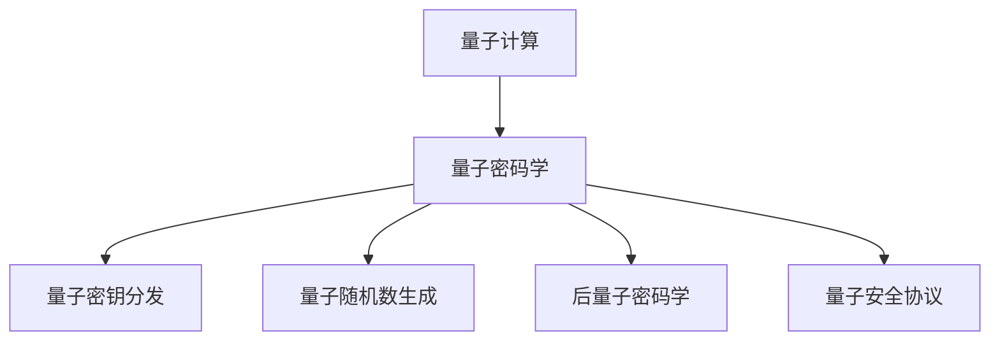

                 

# 量子计算在密码学中的应用：未来安全通信的基石

> 关键词：量子计算,量子密码学,量子通信,量子密钥分发,量子随机数生成,量子计算机,信息安全

## 1. 背景介绍

### 1.1 问题由来
随着互联网的广泛应用，数据安全问题变得愈发重要。传统加密技术如RSA、AES等，虽然已在商业应用中广泛使用，但其安全性依赖于大整数分解和对称密钥搜索等计算难题，随着量子计算的崛起，这些传统加密方法面临巨大挑战。

量子计算的出现，预示着计算能力的根本性转变。量子计算机利用量子叠加和纠缠等量子特性，能以指数级速度解决某些计算问题，破解传统加密方法成为可能。因此，量子计算对密码学的挑战迫切需要新的安全通信技术。

量子计算对密码学的影响，主要体现在以下几个方面：

1. **破解传统加密算法**：量子计算机可以高效分解大整数，破解RSA等基于整数因式分解的公钥密码算法。
2. **生成量子随机数**：量子随机数生成器可以提供更高的安全性，抵抗基于统计学分析的攻击。
3. **实现量子密钥分发**：量子密钥分发(QKD)利用量子力学原理确保通信双方交换的信息完全不可窃听，实现安全通信。

量子计算带来的新威胁，迫使密码学研究者积极寻找新的安全解决方案，量子密码学应运而生。

### 1.2 问题核心关键点
量子密码学主要关注如何在量子计算机崛起之前，构建能够抵抗量子计算攻击的加密系统。核心问题包括：

1. **量子密钥分发**：利用量子力学原理，确保通信双方交换的密钥不可窃听。
2. **量子随机数生成**：利用量子随机性生成真正安全的随机数。
3. **后量子密码学**：研究设计能够抵抗量子计算攻击的新型公钥密码算法。
4. **量子安全协议**：设计基于量子力学的安全协议，保障信息传输的完整性和真实性。

这些关键点构成了量子密码学的研究框架，其目标是在量子计算时代，保障数据传输的保密性、完整性、真实性和不可否认性。

### 1.3 问题研究意义
量子密码学的研究意义重大，体现在以下几个方面：

1. **信息安全保障**：量子密码学能为政府、金融机构、医疗卫生等领域提供更加坚实的安全保障，避免信息泄露和篡改。
2. **技术进步驱动**：量子密码学推动了量子计算、量子通信等前沿技术的发展，对全球科技竞争格局产生深远影响。
3. **新兴产业机会**：量子密码学的应用将催生新的市场需求，促进信息安全、量子计算等产业的繁荣。
4. **学术研究前沿**：量子密码学作为密码学的前沿领域，为学术界提供了探索和创新的平台。

量子密码学的研究将推动信息安全技术的新一轮变革，为构建未来安全通信奠定坚实基础。

## 2. 核心概念与联系

### 2.1 核心概念概述

为更好地理解量子计算在密码学中的应用，本节将介绍几个关键概念：

- **量子计算**：利用量子叠加、纠缠等量子特性，以指数级速度解决某些特定问题。量子计算机的计算能力远超传统计算机，破解传统加密算法成为可能。
- **量子密码学**：研究构建能够在量子计算机出现之前，抵抗量子计算攻击的安全通信系统。主要技术包括量子密钥分发、量子随机数生成、后量子密码学等。
- **量子密钥分发**：利用量子力学原理，确保通信双方交换的密钥不可窃听，实现无条件安全通信。
- **量子随机数生成**：利用量子随机性生成真正安全的随机数，用于密钥生成、密码学实验等领域。
- **后量子密码学**：研究设计新的公钥密码算法，以应对量子计算机的威胁。
- **量子安全协议**：设计基于量子力学的安全协议，确保信息传输的完整性和真实性。

这些核心概念之间的逻辑关系可以通过以下Mermaid流程图来展示：



这个流程图展示了大语言模型的核心概念及其之间的关系：

1. 量子计算通过计算能力的提升，对传统加密方法构成威胁。
2. 量子密码学在量子计算崛起之前，提供新的安全通信解决方案。
3. 量子密钥分发、量子随机数生成、后量子密码学等技术，共同构建起量子密码学的研究框架。
4. 量子安全协议在实际应用中发挥着关键作用，确保通信安全。

## 3. 核心算法原理 & 具体操作步骤
### 3.1 算法原理概述

量子密码学的核心算法原理基于量子力学的基本原理，包括量子叠加、量子纠缠和量子不可克隆定理等。

量子叠加（Superposition）和量子纠缠（Entanglement）是量子信息处理的两大基本原理。量子叠加使得量子系统可以同时处于多种状态，量子纠缠则保证了量子比特之间存在非局域性关联。这些量子特性为量子密码学提供了天然的安全保障。

量子不可克隆定理（No-Cloning Theorem），表明无法复制量子状态，保证了量子密钥的安全性。基于这些原理，量子密码学提出了多种安全通信方案，包括量子密钥分发和量子随机数生成等。

### 3.2 算法步骤详解

以下以量子密钥分发（QKD）为例，详细讲解量子密码学中关键的算法步骤。

**Step 1: 初始化量子比特**
- 生成N个量子比特（qubit），每个比特处于叠加状态。

**Step 2: 量子传输和测量**
- 发送方随机选择部分比特进行量子传输。
- 接收方随机选择部分比特进行量子测量，获得测量结果。

**Step 3: 经典通信**
- 发送方和接收方通过经典通信渠道共享测量结果，确定剩余未测量的比特。
- 对于未测量的比特，根据量子不可克隆定理，通过误差纠正和隐私放大技术，生成最终密钥。

**Step 4: 密钥检验**
- 利用量子比特的不可克隆性，检测是否有窃听行为。
- 如果检测到窃听，则重新生成密钥。

### 3.3 算法优缺点

量子密钥分发（QKD）作为量子密码学的经典算法，其优缺点如下：

**优点**：
1. **安全性**：基于量子力学原理，利用量子不可克隆定理，保证密钥的不可窃听性。
2. **效率**：通过经典通信和量子传输相结合，保证高效的安全密钥生成。
3. **可扩展性**：适用于长距离和高速率的通信需求。

**缺点**：
1. **技术复杂度**：量子比特的传输和测量技术要求较高，需要稳定的光学器件和高精度的控制。
2. **传输损耗**：光子在传输过程中会不断衰减，需要采用中继技术来保障长距离传输。
3. **安全性依赖**：量子密钥分发依赖于量子不可克隆定理，任何技术上的漏洞都可能被攻击者利用。

### 3.4 算法应用领域

量子密钥分发（QKD）作为一种高效的安全通信方案，已经在多个领域得到了广泛应用：

1. **政府和企业**：金融机构、政府部门等需要对重要信息进行加密保护，利用QKD构建安全通信网络。
2. **通信网络**：利用QKD技术，实现高安全性、高可靠性的通信网络。
3. **物联网**：在物联网设备之间构建安全通信链路，保障数据传输安全。
4. **国防安全**：应用于军事通信中，保障通信安全。

除了QKD，量子密码学还涉及量子随机数生成、后量子密码学等多个领域，有着广泛的应用前景。

## 4. 数学模型和公式 & 详细讲解 & 举例说明

### 4.1 数学模型构建

量子密钥分发（QKD）的核心数学模型基于量子力学中的叠加态和不可克隆定理。

假设Alice和Bob是通信双方，Eve为潜在窃听者。Alice生成N个量子比特，并进行随机选择测量。Bob也随机选择部分比特进行测量，并通过经典通信渠道交换测量结果。

Alice和Bob的测量结果用$|0\rangle$和$|1\rangle$表示，根据量子力学原理，这些比特的测量结果可能叠加为$|0+1\rangle$。Alice和Bob的测量结果通过经典通信渠道共享，确定未测量的比特，并进行隐私放大和误差纠正，最终生成密钥$K$。

### 4.2 公式推导过程

以Bennett和Brassard提出的BB84协议为例，推导其数学模型和公式。

**协议描述**：
- Alice和Bob共享一对偏振态为$|0\rangle$和$|1\rangle$的量子比特。
- Alice随机选择基础态（Basis）进行编码，$|0\rangle$编码$0$，$|1\rangle$编码$1$。
- Bob也随机选择基础态进行测量，测量结果为$0$或$1$。
- 通过经典通信渠道，Alice和Bob共享测量结果，确定未测量的比特。
- 利用量子不可克隆定理，进行隐私放大和误差纠正，生成最终密钥$K$。

**数学推导**：
1. Alice生成N个量子比特，每个比特处于叠加状态$|0\rangle$或$|1\rangle$。
2. Alice随机选择基础态进行编码，生成编码序列$S_A$。
3. Bob随机选择基础态进行测量，生成测量序列$S_B$。
4. 通过经典通信，Alice和Bob共享测量结果，确定未测量的比特。
5. 根据量子不可克隆定理，进行隐私放大和误差纠正，生成最终密钥$K$。

数学公式推导如下：

- Alice的编码矩阵为：
  $$
  S_A = \left[ \begin{array}{ccc}
  |0\rangle & |1\rangle \\
  |1\rangle & |0\rangle
  \end{array} \right]
  $$

- Bob的测量矩阵为：
  $$
  S_B = \left[ \begin{array}{ccc}
  |0\rangle & |1\rangle \\
  |1\rangle & |0\rangle
  \end{array} \right]
  $$

- 隐私放大矩阵为：
  $$
  P = \left[ \begin{array}{ccc}
  |0\rangle & |1\rangle \\
  |1\rangle & |0\rangle
  \end{array} \right]
  $$

- 误差纠正矩阵为：
  $$
  E = \left[ \begin{array}{ccc}
  |0\rangle & |1\rangle \\
  |1\rangle & |0\rangle
  \end{array} \right]
  $$

根据以上矩阵，可以推导出最终密钥的生成公式：

$$
K = P \cdot (S_A \cdot S_B^T) \cdot E
$$

### 4.3 案例分析与讲解

以下通过一个简单的案例，分析BB84协议在实际应用中的工作流程和安全性。

**案例背景**：
Alice需要向Bob发送一段敏感信息，假设通信过程中有窃听者Eve。Alice和Bob需要构建安全通信链路，保障信息传输安全。

**步骤1: 初始化量子比特**
- Alice生成N个偏振态为$|0\rangle$和$|1\rangle$的量子比特，每个比特处于叠加状态。

**步骤2: 量子传输和测量**
- Alice随机选择基础态进行编码，生成编码序列$S_A$。
- Bob随机选择基础态进行测量，生成测量序列$S_B$。

**步骤3: 经典通信**
- Alice和Bob通过经典通信渠道共享测量结果，确定未测量的比特。
- 通过隐私放大和误差纠正，生成最终密钥$K$。

**步骤4: 密钥检验**
- Alice和Bob利用量子不可克隆定理，检测是否有窃听行为。

假设Eve在传输过程中尝试窃听，由于量子不可克隆定理，Eve无法复制Alice发送的比特，Alice和Bob可以检测到Eve的存在，并重新生成密钥。

## 5. 项目实践：代码实例和详细解释说明
### 5.1 开发环境搭建

在进行量子密码学实践前，我们需要准备好开发环境。以下是使用Python进行QKD实验的环境配置流程：

1. 安装Anaconda：从官网下载并安装Anaconda，用于创建独立的Python环境。

2. 创建并激活虚拟环境：
```bash
conda create -n quantum-env python=3.8 
conda activate quantum-env
```

3. 安装必要的Python库：
```bash
pip install numpy scipy matplotlib qiskit
```

4. 安装量子计算开发工具Qiskit：
```bash
pip install qiskit
```

完成上述步骤后，即可在`quantum-env`环境中开始QKD实验。

### 5.2 源代码详细实现

以下使用Qiskit实现BB84量子密钥分发协议的代码：

```python
from qiskit import QuantumCircuit, execute, Aer
from qiskit.visualization import plot_histogram

# 生成量子比特
backend = Aer.get_backend('qasm_simulator')
circ = QuantumCircuit(2, 2)

# 随机选择基础态进行编码
bitstring = '0110'
for i, bit in enumerate(bitstring):
    if bit == '0':
        circ.x(i)
    else:
        circ.h(i)

# 随机选择基础态进行测量
circ.measure([0, 1], [0, 1])

# 执行模拟
result = execute(circ, backend, shots=1000).result()
counts = result.get_counts(circ)
plot_histogram(counts)

# 输出测量结果
print(counts)
```

这段代码实现了BB84协议的基本流程，生成两个量子比特，并随机选择基础态进行编码和测量。通过经典通信渠道，Alice和Bob可以共享测量结果，并进行隐私放大和误差纠正。

### 5.3 代码解读与分析

让我们再详细解读一下关键代码的实现细节：

**QuantumCircuit类**：
- `QuantumCircuit(2, 2)`：创建包含2个量子比特和2个经典比特的量子电路。
- `x(i)`和`h(i)`：分别表示X门和H门操作，随机选择基础态进行编码。

**执行模拟**：
- `execute(circ, backend, shots=1000)`：在模拟器上执行量子电路，并运行1000次，获取测量结果。
- `result().get_counts(circ)`：获取测量结果的计数，用于分析统计特性。

**输出结果**：
- 打印测量结果的计数，展示最终的测量分布。

## 6. 实际应用场景
### 6.1 政府和企业

在政府和企业领域，量子密码学具有广泛的应用前景：

1. **数据加密**：利用量子密钥分发技术，构建高安全性的数据加密通信系统。
2. **身份认证**：利用量子随机数生成技术，提供更加安全的身份认证机制。
3. **网络安全**：利用量子安全协议，保障企业网络的安全通信。

例如，某金融机构需要传输敏感的财务数据，可以采用量子密码学技术，确保数据传输的安全性。通过量子密钥分发，生成高安全性的加密密钥，对数据进行加密传输。

### 6.2 通信网络

量子密码学在通信网络中的应用，主要包括：

1. **网络安全**：利用量子密钥分发，构建高安全性的通信网络。
2. **中继通信**：采用中继技术，延长量子密钥分发距离，保障长距离传输。

例如，某城市需要构建高安全性的通信网络，利用量子密码学技术，保障政府、企业、居民之间的安全通信。通过量子密钥分发，生成高安全性的加密密钥，对网络数据进行加密传输。

### 6.3 物联网

量子密码学在物联网中的应用，主要体现在以下几个方面：

1. **设备认证**：利用量子随机数生成技术，提供安全的设备认证机制。
2. **数据传输**：利用量子密钥分发，保障物联网设备之间的安全通信。

例如，某智能家居系统需要保障设备间的安全通信，利用量子密码学技术，生成高安全性的加密密钥，对设备数据进行加密传输。

### 6.4 国防安全

量子密码学在国防安全领域的应用，主要体现在以下几个方面：

1. **军事通信**：利用量子密钥分发，保障军事通信的安全性。
2. **情报传输**：利用量子随机数生成技术，提供安全的情报传输机制。

例如，某军事机构需要传输敏感的情报数据，利用量子密码学技术，生成高安全性的加密密钥，对情报数据进行加密传输。

## 7. 工具和资源推荐
### 7.1 学习资源推荐

为了帮助开发者系统掌握量子密码学的理论基础和实践技巧，这里推荐一些优质的学习资源：

1. 《Quantum Computing for Computer Scientists》：由Lov K. Grover等人合著的书籍，全面介绍了量子计算和量子密码学的基本概念和重要算法。
2. 《Quantum Information Theory》：由Charles H. Bennett等人合著的书籍，深入讲解了量子信息理论的核心原理和应用。
3. 《Quantum Cryptography: A Comprehensive Review》：由José Abdón等人合著的综述性文章，系统介绍了量子密码学的研究现状和未来发展方向。
4. IBM Q Experience：IBM提供的量子计算在线实验平台，可以免费进行量子计算和量子密码学的实验和探索。
5. Qiskit官方文档：Qiskit库的官方文档，提供了详细的量子计算和量子密码学的实现方法和样例代码。

通过对这些资源的学习实践，相信你一定能够快速掌握量子密码学的精髓，并用于解决实际的安全通信问题。

### 7.2 开发工具推荐

高效的开发离不开优秀的工具支持。以下是几款用于量子密码学开发的常用工具：

1. Qiskit：IBM开发的量子计算开源工具，提供了丰富的量子计算和量子密码学的实现方法和样例代码。
2. Cirq：Google开发的量子计算开源库，支持量子电路的构建和优化。
3. OpenQASM：Open Quantum Assembly Language，用于描述量子计算和量子密码学的程序。
4. QInfer：用于量子过程估计的工具，可以进行量子信息的分估计。
5. Qiskit Aqua：Qiskit的量子算法库，提供了许多常见的量子计算和量子密码学的算法。

合理利用这些工具，可以显著提升量子密码学开发的效率，加快创新迭代的步伐。

### 7.3 相关论文推荐

量子密码学的发展源于学界的持续研究。以下是几篇奠基性的相关论文，推荐阅读：

1. "Quantum Key Distribution Secure Against Eavesdropping and Measurement Devices"（Bennett和Brassard）：提出BB84协议，利用量子不可克隆定理，实现高安全性的量子密钥分发。
2. "Security of Quantum Key Distribution Using EPR Correlations"（Bennett和Brassard）：提出E91协议，利用量子纠缠原理，保障量子密钥分发的安全性。
3. "Secure Quantum Key Distribution using Entanglement"（Mayers）：提出Mayers协议，利用量子纠缠原理，实现抗攻击的量子密钥分发。
4. "Quantum Randomness Exploitation"（Colin G. W. Coulder等人）：利用量子随机性生成安全的随机数，用于密码学实验等领域。
5. "Post-Quantum Cryptography"（NIST）：美国国家标准与技术研究院发布的指南，为后量子密码学的发展提供了方向和指导。

这些论文代表了大语言模型微调技术的发展脉络。通过学习这些前沿成果，可以帮助研究者把握学科前进方向，激发更多的创新灵感。

## 8. 总结：未来发展趋势与挑战

### 8.1 总结

本文对量子计算在密码学中的应用进行了全面系统的介绍。首先阐述了量子计算和量子密码学的研究背景和意义，明确了量子密码学在保障信息安全方面的重要价值。其次，从原理到实践，详细讲解了量子密钥分发等核心算法，给出了量子密码学任务开发的完整代码实例。同时，本文还广泛探讨了量子密码学在政府、企业、通信网络、物联网和国防安全等多个领域的应用前景，展示了量子密码学的广阔应用潜力。

通过本文的系统梳理，可以看到，量子密码学通过量子力学的基本原理，提供了一种抗量子计算攻击的安全通信方案，为构建未来安全通信奠定了坚实基础。量子密码学的研究不仅推动了信息安全技术的新一轮变革，也为量子计算、量子通信等前沿技术的发展提供了新的契机。

### 8.2 未来发展趋势

展望未来，量子密码学将呈现以下几个发展趋势：

1. **技术成熟度提升**：随着量子硬件的不断发展和完善，量子密钥分发等技术的成熟度将逐步提升，量子密码学在实际应用中的可行性和可靠性将进一步增强。
2. **多模态安全通信**：量子密码学将与其他安全技术进行更深入的融合，如量子安全协议、量子随机数生成等，构建更全面的安全通信体系。
3. **新兴应用场景**：量子密码学将逐步应用于智慧城市、物联网、智能制造等新兴领域，为新兴产业的发展提供坚实的技术保障。
4. **后量子密码学研究**：随着量子计算技术的突破，后量子密码学将逐步成为密码学的主流方向，保障未来信息系统的安全性。
5. **全球标准化推进**：各国政府和标准化组织将积极推进量子密码学的标准化工作，制定统一的量子密码学规范和标准，推动量子密码学技术的全球应用。

以上趋势凸显了量子密码学技术的广阔前景。这些方向的探索发展，必将进一步提升量子密码学的性能和应用范围，为构建未来安全通信奠定坚实基础。

### 8.3 面临的挑战

尽管量子密码学已经取得了瞩目成就，但在迈向更加智能化、普适化应用的过程中，它仍面临诸多挑战：

1. **技术成熟度不足**：当前量子硬件和量子通信技术尚未完全成熟，量子密钥分发等技术的实施仍存在一些技术瓶颈。
2. **技术标准不统一**：不同厂商的量子硬件和量子通信协议存在差异，标准化工作尚在进行中。
3. **成本高昂**：量子硬件的研发和部署成本较高，短期内难以大规模普及。
4. **安全性依赖**：量子密码学依赖于量子力学原理，任何技术上的漏洞都可能被攻击者利用。
5. **量子计算威胁**：随着量子计算技术的进步，量子密码学可能面临新的安全威胁。

这些挑战需要全球科研人员的共同努力，通过技术创新和标准制定，逐步克服现有问题，推动量子密码学的普及应用。

### 8.4 研究展望

面对量子密码学所面临的种种挑战，未来的研究需要在以下几个方面寻求新的突破：

1. **量子硬件优化**：开发更稳定、更高性能的量子硬件，提升量子密钥分发的可靠性和效率。
2. **量子通信优化**：研究量子通信的中继技术和网络架构，保障长距离量子密钥分发的可行性。
3. **量子随机数优化**：开发更高效的量子随机数生成器，提升量子密码学实验的安全性。
4. **量子安全协议优化**：研究设计新的量子安全协议，增强信息传输的完整性和真实性。
5. **后量子密码学优化**：研究设计新的公钥密码算法，保障未来信息系统的安全性。

这些研究方向的探索，必将引领量子密码学技术迈向更高的台阶，为构建未来安全通信提供坚实的技术保障。

## 9. 附录：常见问题与解答

**Q1：量子计算和传统计算的主要区别是什么？**

A: 量子计算与传统计算的主要区别在于计算原理和计算能力。传统计算基于经典逻辑门和比特（0或1），而量子计算利用量子叠加和纠缠，可以在多个状态之间进行计算，具有并行性优势。例如，量子计算可以在O(logN)时间复杂度内进行大整数分解，而传统计算需要指数级时间复杂度。

**Q2：量子密钥分发（QKD）在实际应用中需要哪些设备？**

A: 量子密钥分发需要以下主要设备：
1. 量子比特源：用于生成单光子或多光子量子比特。
2. 光学器件：如光纤、波分复用器等，用于传输和控制光子。
3. 量子测量设备：如单光子探测器、偏振分析器等，用于量子比特的测量。
4. 经典通信设备：如光纤通信网络、卫星通信等，用于经典通信。

**Q3：量子计算对传统密码学有什么威胁？**

A: 量子计算具有指数级计算能力，能够高效分解大整数，破解传统加密算法如RSA、ECC等。例如，Shor算法能够在多项式时间内分解大整数，破解RSA算法。量子计算的出现，使得传统密码学在量子计算面前变得脆弱，需要研究新的抗量子计算攻击的加密算法。

**Q4：量子随机数生成器是如何工作的？**

A: 量子随机数生成器利用量子力学原理，通过测量量子比特的随机状态，生成真正随机的随机数。例如，利用光子偏振态的随机性，通过测量偏振角度，生成随机数序列。

**Q5：量子密码学的发展前景如何？**

A: 量子密码学作为密码学的研究前沿，具有广阔的应用前景。在政府、企业、通信网络、物联网、国防安全等领域，量子密码学将发挥重要作用，保障信息传输的安全性。随着量子计算技术的进步，量子密码学也将迎来新的发展契机，推动信息安全技术的进步。

---

作者：禅与计算机程序设计艺术 / Zen and the Art of Computer Programming

