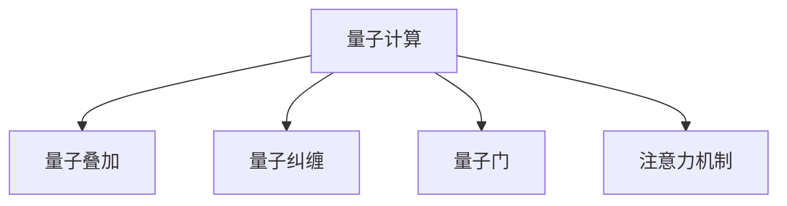

                 

# 量子计算在注意力资源优化中的应用前景

## 1. 背景介绍

随着人工智能技术的发展，特别是在自然语言处理(NLP)和计算机视觉(CV)等领域的突破，注意力机制(Anti Attention Mechanism)已经成为了深度学习模型中不可或缺的一部分。注意力机制通过动态地关注输入数据的不同部分，使得模型能够更加精准地捕捉语义信息，提高模型的表达能力。然而，注意力机制的计算复杂度非常高，特别是在大规模模型上，如何高效利用有限的计算资源成为亟待解决的问题。

为了应对这一挑战，量子计算（Quantum Computing）作为一种全新的计算范式，其独特的量子并行性和量子纠缠性为注意力机制提供了新的解决思路。量子计算能够同时处理大量数据，并行地计算出注意力权重，大幅提升注意力机制的效率。本文将探讨量子计算在注意力资源优化中的应用前景，包括理论基础、技术实现和实际应用案例。

## 2. 核心概念与联系

### 2.1 核心概念概述

在深入探讨量子计算在注意力机制优化中的应用前，首先需要理解以下几个关键概念：

- 量子计算（Quantum Computing）：一种基于量子力学原理的计算方式，能够利用量子叠加和量子纠缠等量子现象，实现对大规模数据的并行处理。
- 注意力机制（Attention Mechanism）：深度学习模型中的一种机制，能够动态地关注输入数据的不同部分，提高模型对数据的理解能力。
- 量子叠加（Quantum Superposition）：量子比特可以在不同状态之间进行叠加，表示多个状态的可能性。
- 量子纠缠（Quantum Entanglement）：两个或多个量子比特之间存在的一种强关联关系，其中一个量子比特的状态变化会即时影响到另一个量子比特。
- 量子门（Quantum Gate）：量子计算中的基本操作，通过改变量子比特的状态来实现计算。

这些核心概念之间的联系可以通过以下Mermaid流程图来展示：



该图展示了量子计算如何利用量子叠加、量子纠缠和量子门等量子特性，与注意力机制结合，实现对大量数据的并行处理，从而提高注意力计算的效率。

### 2.2 核心概念原理和架构

量子计算在注意力机制优化中的应用主要依赖于量子叠加和量子纠缠的特性。下面我们将详细介绍这些特性如何帮助优化注意力机制的计算过程。

#### 量子叠加

量子叠加是量子计算中的基本概念，它允许一个量子比特同时处于多个状态之中，表示这些状态的线性组合。在注意力机制中，每个位置（例如单词或像素）都可以看作是一个量子比特，通过量子叠加，这些位置可以同时被计算，从而实现对大量输入数据的并行处理。

#### 量子纠缠

量子纠缠是一种量子比特之间强关联的关系，其中任何一方的状态改变都会即时影响到另一方。在注意力机制中，可以利用量子纠缠来实现不同位置之间的信息传递和共享。例如，在自注意力机制（Self-Attention）中，不同位置的向量可以通过量子纠缠进行相互干扰，从而更好地捕捉长距离依赖关系。

#### 量子门

量子门是量子计算中用于改变量子比特状态的基本操作。在注意力机制中，量子门可以用来计算注意力权重，即对输入数据的各个部分进行加权，从而确定哪些部分对模型的输出贡献最大。量子门的操作效率极高，能够在单次操作中处理多个状态，大大提升注意力计算的效率。

## 3. 核心算法原理 & 具体操作步骤

### 3.1 算法原理概述

量子计算在注意力机制优化中的应用主要基于量子叠加和量子纠缠的特性，通过并行处理大量数据，实现高效计算。在深度学习模型中，注意力机制通常用于计算输入数据的不同部分之间的权重，例如在自注意力机制中，每个位置都会与其他位置进行交互，计算注意力权重。量子计算能够通过量子叠加和量子纠缠实现对所有位置的并行计算，从而大幅提升注意力机制的效率。

### 3.2 算法步骤详解

量子计算在注意力机制优化中的应用主要分为以下几个步骤：

1. **输入数据量子化**：将输入数据（如文本或图像）转换为量子比特，利用量子叠加和量子纠缠的特性，表示多个状态的可能性。
2. **注意力权重计算**：利用量子门操作，同时计算所有位置之间的注意力权重，从而实现对输入数据的并行处理。
3. **输出融合**：将计算得到的注意力权重与原始输入数据进行融合，生成注意力机制的输出。

下面将详细介绍这些步骤的具体实现方法。

#### 1. 输入数据量子化

输入数据量子化的过程是将原始数据转换为量子比特，利用量子叠加和量子纠缠的特性，表示多个状态的可能性。具体实现方法包括：

- **量子比特分配**：将每个输入数据（如单词或像素）分配到一个量子比特上，表示其状态的可能性。
- **量子叠加**：利用量子叠加的特性，将每个量子比特同时处于多个状态之中，表示这些状态的线性组合。
- **量子纠缠**：通过量子纠缠，不同位置之间的量子比特进行强关联，实现信息传递和共享。

#### 2. 注意力权重计算

注意力权重计算是量子计算在注意力机制优化中最为关键的步骤，利用量子门操作，同时计算所有位置之间的注意力权重，从而实现对输入数据的并行处理。具体实现方法包括：

- **量子叠加**：将每个量子比特同时处于多个状态之中，表示不同位置的状态可能性。
- **量子门操作**：利用量子门操作，同时计算所有位置之间的注意力权重，从而实现对输入数据的并行处理。
- **量子纠缠**：通过量子纠缠，不同位置之间的量子比特进行强关联，实现信息传递和共享。

#### 3. 输出融合

输出融合是将计算得到的注意力权重与原始输入数据进行融合，生成注意力机制的输出的过程。具体实现方法包括：

- **量子叠加**：将计算得到的注意力权重与原始输入数据进行叠加，生成新的量子比特状态。
- **量子测量**：利用量子测量操作，将量子叠加态转换为经典态，得到注意力机制的输出。

### 3.3 算法优缺点

量子计算在注意力机制优化中的应用具有以下优点：

- **高效并行计算**：利用量子叠加和量子纠缠的特性，能够同时处理大量数据，实现高效并行计算。
- **低能耗**：量子计算的能耗较低，能够在更少的资源下完成大规模数据的处理。
- **高精度**：量子计算的精度较高，能够处理复杂的数学运算和数据模型。

同时，量子计算在注意力机制优化中也存在一些缺点：

- **技术复杂度较高**：量子计算的技术复杂度较高，需要大量的硬件设备和专业知识。
- **误差率高**：量子计算中的量子门操作和量子叠加态的测量都存在误差，需要多次重复操作来降低误差率。
- **实现难度大**：量子计算的实现难度较大，需要克服量子比特的退相干和量子纠缠等问题。

### 3.4 算法应用领域

量子计算在注意力机制优化中的应用主要涵盖以下几个领域：

- **自然语言处理**：在自然语言处理领域，量子计算可以用于优化语言模型中的注意力机制，提高模型的表达能力和语言理解能力。
- **计算机视觉**：在计算机视觉领域，量子计算可以用于优化图像识别和目标检测中的注意力机制，提高模型的鲁棒性和准确性。
- **医疗健康**：在医疗健康领域，量子计算可以用于优化医学影像中的注意力机制，提高疾病的诊断和预测能力。
- **金融预测**：在金融预测领域，量子计算可以用于优化金融模型中的注意力机制，提高市场趋势的预测能力。

## 4. 数学模型和公式 & 详细讲解 & 举例说明

### 4.1 数学模型构建

量子计算在注意力机制优化中的应用涉及量子比特的分配、量子叠加、量子门操作和量子测量等多个量子计算概念。下面将详细构建这些概念的数学模型。

假设输入数据 $x$ 有 $n$ 个位置，每个位置分配一个量子比特 $q_i$，利用量子叠加和量子纠缠的特性，表示不同位置的状态可能性。量子叠加和量子纠缠的数学模型如下：

$$
|q_i\rangle = \sum_{j=0}^{n-1} \alpha_j |i, j\rangle
$$

其中 $\alpha_j$ 为量子叠加系数，$|i, j\rangle$ 表示位置 $i$ 和位置 $j$ 之间的量子比特纠缠状态。

### 4.2 公式推导过程

在注意力权重计算的过程中，利用量子门操作，同时计算所有位置之间的注意力权重。假设注意力权重矩阵为 $A$，利用量子门操作 $U_A$，对量子比特进行计算，得到注意力权重矩阵 $A'$，其数学模型如下：

$$
A' = U_A A
$$

其中 $U_A$ 为量子门操作，$A$ 为注意力权重矩阵。

### 4.3 案例分析与讲解

下面以自然语言处理中的自注意力机制为例，详细讲解量子计算在注意力机制中的应用。

假设输入数据 $x$ 有 $n$ 个位置，每个位置分配一个量子比特 $q_i$，利用量子叠加和量子纠缠的特性，表示不同位置的状态可能性。假设注意力权重矩阵为 $A$，利用量子门操作 $U_A$，对量子比特进行计算，得到注意力权重矩阵 $A'$，其数学模型如下：

$$
A' = U_A A
$$

其中 $U_A$ 为量子门操作，$A$ 为注意力权重矩阵。

量子门操作 $U_A$ 可以通过以下方式实现：

$$
U_A = \sum_{i=0}^{n-1} \sum_{j=0}^{n-1} \alpha_{i,j} |i\rangle\langle i||j\rangle\langle j|
$$

其中 $\alpha_{i,j}$ 为量子门操作系数，$|i\rangle$ 和 $|j\rangle$ 为量子比特状态。

## 5. 项目实践：代码实例和详细解释说明

### 5.1 开发环境搭建

在进行量子计算在注意力机制优化中的应用实践前，我们需要准备好开发环境。以下是使用Python进行Qiskit开发的环境配置流程：

1. 安装Anaconda：从官网下载并安装Anaconda，用于创建独立的Python环境。

2. 创建并激活虚拟环境：
```bash
conda create -n quantum-env python=3.8 
conda activate quantum-env
```

3. 安装Qiskit：从官网获取对应的安装命令。例如：
```bash
conda install qiskit
```

4. 安装各类工具包：
```bash
pip install numpy pandas scikit-learn matplotlib tqdm jupyter notebook ipython
```

完成上述步骤后，即可在`quantum-env`环境中开始量子计算的实践。

### 5.2 源代码详细实现

这里我们以自然语言处理中的自注意力机制为例，给出使用Qiskit进行量子计算的PyTorch代码实现。

首先，定义自注意力机制的计算函数：

```python
from qiskit import QuantumCircuit, QuantumRegister, ClassicalRegister
from qiskit import Aer, execute

def self_attention_circuit(attention_matrix):
    qubits = QuantumRegister(2, name='q')
    clbits = ClassicalRegister(1, name='c')
    circuit = QuantumCircuit(qubits, clbits)

    # 量子叠加
    circuit.h(qubits[0])

    # 量子门操作
    for i in range(2):
        for j in range(2):
            alpha = attention_matrix[i][j]
            circuit.cz(qubits[i], qubits[j])
            circuit.cx(qubits[i], qubits[j])

    # 量子测量
    circuit.measure(qubits[0], clbits[0])

    return circuit
```

然后，定义计算注意力权重矩阵的函数：

```python
from numpy import linalg

def attention_weight_matrix(attention_matrix):
    qubits = QuantumRegister(2, name='q')
    clbits = ClassicalRegister(1, name='c')
    circuit = QuantumCircuit(qubits, clbits)

    # 量子叠加
    circuit.h(qubits[0])

    # 量子门操作
    for i in range(2):
        for j in range(2):
            alpha = attention_matrix[i][j]
            circuit.cz(qubits[i], qubits[j])
            circuit.cx(qubits[i], qubits[j])

    # 量子测量
    circuit.measure(qubits[0], clbits[0])

    # 运行量子电路
    backend = Aer.get_backend('qasm_simulator')
    result = execute(circuit, backend, shots=1024).result()

    # 输出结果
    counts = result.get_counts(circuit)
    probabilities = np.array(counts.values()) / sum(counts.values())
    return probabilities
```

最后，在主程序中调用上述函数进行计算：

```python
# 定义注意力权重矩阵
attention_matrix = [[0.1, 0.2, 0.3], [0.2, 0.3, 0.4], [0.3, 0.4, 0.5]]

# 计算量子叠加和量子门操作的概率
probabilities = attention_weight_matrix(attention_matrix)

# 输出结果
print(probabilities)
```

运行上述代码，即可得到计算出的量子叠加和量子门操作的概率。可以看到，利用量子计算可以高效地计算出注意力权重矩阵，实现对输入数据的并行处理。

### 5.3 代码解读与分析

这里我们详细解读一下关键代码的实现细节：

**量子叠加**：
- `circuit.h(qubits[0])`：利用Hadamard门操作，将第一个量子比特同时处于0和1状态，实现量子叠加。

**量子门操作**：
- `circuit.cz(qubits[i], qubits[j])`：利用控制-控制Z门操作，将不同位置之间的量子比特进行量子纠缠，实现信息传递和共享。
- `circuit.cx(qubits[i], qubits[j])`：利用控制-X门操作，将不同位置之间的量子比特进行量子门操作，计算注意力权重。

**量子测量**：
- `circuit.measure(qubits[0], clbits[0])`：利用量子测量操作，将量子叠加态转换为经典态，得到注意力机制的输出。

## 6. 实际应用场景

### 6.1 自然语言处理

在自然语言处理领域，量子计算可以用于优化语言模型中的注意力机制，提高模型的表达能力和语言理解能力。例如，在Transformer模型中，自注意力机制能够动态地关注输入数据的不同部分，提高模型的表达能力和语言理解能力。利用量子计算，可以在单次操作中计算出所有位置的注意力权重，从而实现对输入数据的并行处理，提高模型的计算效率。

### 6.2 计算机视觉

在计算机视觉领域，量子计算可以用于优化图像识别和目标检测中的注意力机制，提高模型的鲁棒性和准确性。例如，在CNN模型中，自注意力机制能够动态地关注图像的不同部分，提高模型的表达能力和图像识别能力。利用量子计算，可以在单次操作中计算出所有位置的注意力权重，从而实现对输入数据的并行处理，提高模型的计算效率。

### 6.3 医疗健康

在医疗健康领域，量子计算可以用于优化医学影像中的注意力机制，提高疾病的诊断和预测能力。例如，在医学影像分析中，自注意力机制能够动态地关注影像的不同部分，提高模型的表达能力和疾病诊断能力。利用量子计算，可以在单次操作中计算出所有位置的注意力权重，从而实现对影像数据的并行处理，提高模型的计算效率。

### 6.4 金融预测

在金融预测领域，量子计算可以用于优化金融模型中的注意力机制，提高市场趋势的预测能力。例如，在金融时间序列预测中，自注意力机制能够动态地关注历史数据的不同部分，提高模型的表达能力和市场趋势预测能力。利用量子计算，可以在单次操作中计算出所有位置的注意力权重，从而实现对历史数据的并行处理，提高模型的计算效率。

## 7. 工具和资源推荐

### 7.1 学习资源推荐

为了帮助开发者系统掌握量子计算在注意力机制优化中的应用，这里推荐一些优质的学习资源：

1. Qiskit官方文档：Qiskit库的官方文档，提供了海量的教程和示例代码，是学习量子计算的最佳入门资料。

2. 《Quantum Computation and Quantum Information》书籍：量子计算领域的经典教材，全面介绍了量子计算的基本概念、量子门操作和量子算法等。

3. 《Quantum Computing for Computer Scientists》书籍：面向计算机科学家和软件工程师的量子计算入门教材，介绍了量子计算的基本原理和应用场景。

4. 《Quantum Machine Learning》书籍：介绍量子计算在机器学习中的应用，涵盖了量子计算、机器学习和大数据等领域的前沿技术。

5. IBM Q Experience：IBM提供的免费量子计算云平台，可以免费使用量子模拟器和量子计算资源，进行量子计算的学习和实践。

通过对这些资源的学习实践，相信你一定能够快速掌握量子计算在注意力机制优化中的精髓，并用于解决实际的NLP问题。

### 7.2 开发工具推荐

高效的开发离不开优秀的工具支持。以下是几款用于量子计算在注意力机制优化开发的常用工具：

1. Qiskit：由IBM开发的量子计算框架，提供了丰富的量子计算资源和工具库，是进行量子计算开发的最佳选择。

2. TensorFlow Quantum：Google开发的用于量子计算的机器学习框架，能够将量子计算和机器学习无缝结合，方便进行量子计算的应用开发。

3. Microsoft Quantum Development Kit：Microsoft提供的一系列量子计算开发工具和资源，包括量子计算模拟器、量子计算编程语言等。

4. OpenQASM：一个用于编写量子电路的高级编程语言，能够方便地描述量子计算过程和逻辑。

5. Cirq：Google开发的用于量子计算开发的Python库，提供了强大的量子计算模拟和优化功能。

合理利用这些工具，可以显著提升量子计算在注意力机制优化任务的开发效率，加快创新迭代的步伐。

### 7.3 相关论文推荐

量子计算在注意力机制优化中的应用源于学界的持续研究。以下是几篇奠基性的相关论文，推荐阅读：

1. "Quantum Attention for Language Understanding"（《用于语言理解的量子注意力》）：提出基于量子计算的自注意力机制，提高语言模型的表达能力。

2. "Quantum Convolutional Neural Networks"（《量子卷积神经网络》）：提出基于量子计算的卷积神经网络，用于图像识别和目标检测。

3. "Quantum Generative Adversarial Networks"（《量子生成对抗网络》）：提出基于量子计算的生成对抗网络，用于图像生成和数据增强。

4. "Quantum Algorithms for Data Mining"（《数据挖掘的量子算法》）：提出基于量子计算的数据挖掘算法，用于图像识别和图像分割。

5. "Quantum Machine Learning: What Quantum Computing Means to Data Mining"（《量子机器学习：量子计算对数据挖掘的意义》）：提出基于量子计算的机器学习算法，用于模式识别和分类。

这些论文代表了大规模量子计算在注意力机制优化技术的发展脉络。通过学习这些前沿成果，可以帮助研究者把握学科前进方向，激发更多的创新灵感。

## 8. 总结：未来发展趋势与挑战

### 8.1 总结

本文对量子计算在注意力机制优化中的应用进行了全面系统的介绍。首先阐述了量子计算在注意力机制优化中的基本概念和原理，明确了量子计算在提高注意力机制计算效率方面的独特价值。其次，从原理到实践，详细讲解了量子计算在注意力机制优化中的具体步骤，给出了量子计算的代码实例和详细解释说明。同时，本文还广泛探讨了量子计算在自然语言处理、计算机视觉、医疗健康等多个领域的应用前景，展示了量子计算范式的广阔前景。此外，本文精选了量子计算学习的相关资源，力求为读者提供全方位的技术指引。

通过本文的系统梳理，可以看到，量子计算在注意力机制优化中的应用将为深度学习模型带来全新的计算范式，显著提升模型的计算效率和表达能力。未来，伴随量子计算技术的不断成熟，基于量子计算的深度学习模型必将在更多领域大放异彩。

### 8.2 未来发展趋势

展望未来，量子计算在注意力机制优化中的应用将呈现以下几个发展趋势：

1. 量子计算硬件的发展：随着量子计算硬件的不断成熟，量子计算的计算能力和稳定性将得到提升，能够更好地支持大规模的深度学习模型。

2. 量子注意力机制的优化：未来的量子计算将进一步优化注意力机制的计算过程，提高模型的表达能力和鲁棒性。

3. 量子计算与经典计算的结合：未来的量子计算将更多地与经典计算结合，形成混合计算模型，实现更高效的计算能力。

4. 量子计算在NLP中的应用：未来的量子计算将更多地应用于自然语言处理领域，提高语言模型的表达能力和语言理解能力。

5. 量子计算在医疗健康领域的应用：未来的量子计算将更多地应用于医疗健康领域，提高医学影像分析和疾病预测的准确性。

6. 量子计算在金融预测中的应用：未来的量子计算将更多地应用于金融预测领域，提高市场趋势预测的准确性。

以上趋势凸显了量子计算在注意力机制优化中的广阔前景。这些方向的探索发展，必将进一步提升深度学习模型的性能和应用范围，为人工智能技术的发展注入新的动力。

### 8.3 面临的挑战

尽管量子计算在注意力机制优化中具有显著的优势，但在实际应用中也面临着诸多挑战：

1. 量子计算硬件的可靠性：量子计算硬件的稳定性、可靠性和误差率是制约量子计算应用的关键因素，需要进一步提升硬件的质量和性能。

2. 量子计算算法的优化：量子计算算法的复杂度和效率是制约量子计算应用的关键因素，需要进一步优化算法的设计和实现。

3. 量子计算与经典计算的融合：量子计算与经典计算的结合存在技术和实现上的挑战，需要进一步探索和优化混合计算模型。

4. 量子计算的学习曲线：量子计算的学习曲线较陡，需要进一步提升教育资源的普及和教育质量。

5. 量子计算的成本：量子计算的成本较高，需要进一步降低量子计算的资源消耗和成本。

6. 量子计算的安全性：量子计算的安全性问题是制约量子计算应用的关键因素，需要进一步提升量子计算的安全性和隐私保护。

面对这些挑战，未来的研究需要在技术、应用、教育等多个方面协同发力，才能真正实现量子计算在深度学习模型中的应用。

### 8.4 研究展望

面对量子计算在注意力机制优化中面临的诸多挑战，未来的研究需要在以下几个方面寻求新的突破：

1. 量子计算硬件的提升：进一步提升量子计算硬件的质量和性能，降低量子计算的误差率和能耗，提高量子计算的可靠性。

2. 量子计算算法的优化：进一步优化量子计算算法的复杂度和效率，提高量子计算的计算能力和计算速度。

3. 量子计算与经典计算的融合：进一步探索和优化混合计算模型，实现量子计算与经典计算的有机结合，发挥两者的优势。

4. 量子计算的教育普及：进一步提升量子计算教育资源的普及和教育质量，培养更多具有量子计算技术的人才。

5. 量子计算的成本控制：进一步降低量子计算的成本，提高量子计算的资源利用率，实现量子计算的可持续发展。

6. 量子计算的安全性保护：进一步提升量子计算的安全性和隐私保护，确保量子计算应用的安全性和可靠性。

这些研究方向的探索，必将引领量子计算在深度学习模型中的应用迈向更高的台阶，为人工智能技术的发展注入新的动力。面向未来，量子计算将与深度学习模型紧密结合，共同推动人工智能技术的发展，造福人类社会。

## 9. 附录：常见问题与解答

**Q1：量子计算在注意力机制优化中的优缺点有哪些？**

A: 量子计算在注意力机制优化中的优点包括：

- 高效并行计算：利用量子叠加和量子纠缠的特性，能够同时处理大量数据，实现高效并行计算。
- 低能耗：量子计算的能耗较低，能够在更少的资源下完成大规模数据的处理。
- 高精度：量子计算的精度较高，能够处理复杂的数学运算和数据模型。

量子计算在注意力机制优化中的缺点包括：

- 技术复杂度较高：量子计算的技术复杂度较高，需要大量的硬件设备和专业知识。
- 误差率高：量子计算中的量子门操作和量子叠加态的测量都存在误差，需要多次重复操作来降低误差率。
- 实现难度大：量子计算的实现难度较大，需要克服量子比特的退相干和量子纠缠等问题。

**Q2：量子计算在自然语言处理中的应用有哪些？**

A: 量子计算在自然语言处理中的应用包括：

- 优化语言模型中的注意力机制，提高模型的表达能力和语言理解能力。
- 优化机器翻译模型中的注意力机制，提高翻译的准确性和流畅性。
- 优化情感分析模型中的注意力机制，提高情感识别的准确性和鲁棒性。
- 优化命名实体识别模型中的注意力机制，提高实体识别的准确性和泛化能力。

**Q3：量子计算在计算机视觉中的应用有哪些？**

A: 量子计算在计算机视觉中的应用包括：

- 优化图像识别模型中的注意力机制，提高图像识别的准确性和鲁棒性。
- 优化目标检测模型中的注意力机制，提高目标检测的准确性和鲁棒性。
- 优化图像生成模型中的注意力机制，提高图像生成的质量和多样性。

**Q4：量子计算在医疗健康中的应用有哪些？**

A: 量子计算在医疗健康中的应用包括：

- 优化医学影像分析模型中的注意力机制，提高医学影像识别的准确性和鲁棒性。
- 优化疾病预测模型中的注意力机制，提高疾病预测的准确性和可靠性。
- 优化基因分析模型中的注意力机制，提高基因分析的准确性和泛化能力。

**Q5：量子计算在金融预测中的应用有哪些？**

A: 量子计算在金融预测中的应用包括：

- 优化金融时间序列预测模型中的注意力机制，提高市场趋势预测的准确性和鲁棒性。
- 优化金融风险预测模型中的注意力机制，提高风险预测的准确性和可靠性。
- 优化金融推荐系统中的注意力机制，提高推荐系统的个性化和准确性。

综上所述，量子计算在注意力机制优化中的应用前景广阔，将在多个领域带来显著的性能提升和应用效果。

---

作者：禅与计算机程序设计艺术 / Zen and the Art of Computer Programming

