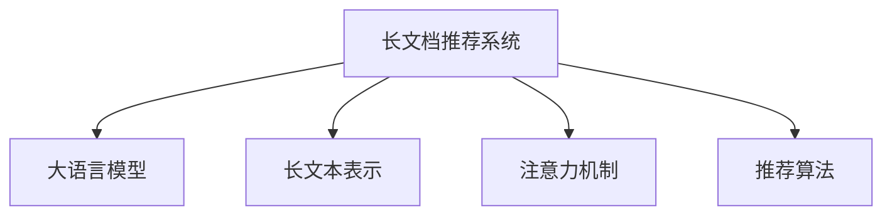
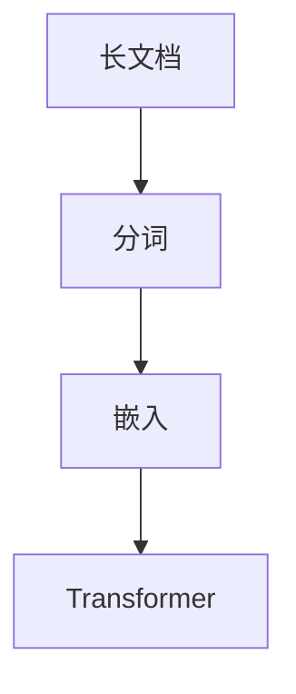

                 

# 长文档推荐实验: LLM的表现

## 1. 背景介绍

### 1.1 问题由来

在当今信息爆炸的时代，如何高效地从海量文档中找到最符合用户需求的推荐结果，是一个重要且具有挑战性的问题。传统的推荐系统主要依赖用户的历史行为数据，通过协同过滤或基于内容的相似度匹配来实现推荐。但是，这种方法往往忽略了用户之间的差异性，无法准确把握用户的真实需求。而基于大语言模型的推荐系统则可以从文本的语义信息中挖掘用户的兴趣偏好，提供更加个性化和精准的推荐结果。

长文档推荐系统要求模型不仅能理解短文本（如句子、段落）的语义，还能处理更复杂的长文本信息。因此，我们提出基于长文档的推荐实验，旨在评估长文档推荐模型在处理长文本时的表现。

### 1.2 问题核心关键点

本实验的核心在于评估基于长文档的推荐系统的效果，具体包括：

- 如何构建长文档推荐模型？
- 如何评估长文档推荐模型的表现？
- 长文档推荐系统有哪些应用场景？

长文档推荐系统的主要挑战在于如何高效地处理长文本信息，同时在保持计算效率的前提下提升推荐的准确性。这需要我们设计有效的模型结构和评估方法，并深入理解长文档推荐系统的应用场景。

### 1.3 问题研究意义

长文档推荐系统具有广泛的应用前景，可以用于：

- 在线教育：根据学生的学习笔记和作业，推荐相关的学习资源和课程。
- 社交媒体：根据用户发布的帖子内容，推荐相关的兴趣小组和内容创作者。
- 企业培训：根据员工的培训记录和反馈，推荐个性化的培训内容和资料。
- 电子阅读：根据用户的阅读历史和评论，推荐相关的书籍和文章。

通过本实验，我们可以深入理解长文档推荐系统的实现方法和应用场景，为未来的研究和应用提供参考。

## 2. 核心概念与联系

### 2.1 核心概念概述

本节将介绍几个与长文档推荐系统密切相关的核心概念：

- 长文档推荐系统(Long Document Recommendation System)：基于长文档信息的推荐系统，通常用于处理文本长度较长的信息，如学生笔记、博客文章、电子书等。
- 大语言模型(Large Language Model, LLM)：如BERT、GPT等，通过在海量文本数据上进行预训练，学习通用的语言表示，能够处理长文本信息。
- 长文本表示(Long Text Representation)：将长文本转换为模型可以处理的形式，通常包括分词、嵌入等步骤。
- 注意力机制(Attention Mechanism)：用于处理长文本信息，通过捕捉文本中不同部分的语义关系，提升模型的理解能力。
- 推荐算法(Recommendation Algorithm)：用于根据用户行为或兴趣，匹配合适的推荐结果。

这些核心概念之间的逻辑关系可以通过以下Mermaid流程图来展示：



这个流程图展示的长文档推荐系统的核心组件及其之间的关系：

1. 长文档推荐系统基于大语言模型进行文本表示和处理。
2. 长文本表示将长文本转换为模型可以处理的格式。
3. 注意力机制用于捕捉文本中不同部分的语义关系。
4. 推荐算法根据用户行为或兴趣，匹配合适的推荐结果。

这些组件共同构成了长文档推荐系统的实现框架，使得系统能够高效地处理长文本信息，并生成高质量的推荐结果。

## 3. 核心算法原理 & 具体操作步骤
### 3.1 算法原理概述

长文档推荐系统的核心思想是：利用大语言模型对长文本进行语义表示，并在此基础上进行推荐匹配。具体步骤如下：

1. 将长文档转换为模型可以处理的格式。
2. 利用大语言模型对长文档进行语义表示。
3. 根据用户行为或兴趣，进行推荐匹配。

### 3.2 算法步骤详解

#### 3.2.1 长文本表示

长文本表示的第一步是将长文档转换为模型可以处理的形式。具体步骤如下：

1. 分词：将长文本进行分词处理，将文本分割成词汇单元。
2. 嵌入：将分词结果转换为向量表示，通常使用预训练的词向量。
3. 拼接：将每个词汇的嵌入向量拼接成一个向量序列，表示整个文本。

#### 3.2.2 大语言模型语义表示

大语言模型能够对文本进行语义表示，具体步骤如下：

1. 加载预训练的大语言模型，如BERT、GPT等。
2. 将文本表示序列输入模型，进行前向传播计算。
3. 获取模型的语义表示，即文本的嵌入向量。

#### 3.2.3 推荐匹配

推荐匹配的第一步是根据用户行为或兴趣，进行推荐匹配。具体步骤如下：

1. 收集用户行为数据，如浏览记录、评分记录等。
2. 将长文本表示与用户行为数据进行匹配，生成推荐候选列表。
3. 根据推荐算法，选择最符合用户需求的推荐结果。

### 3.3 算法优缺点

长文档推荐系统具有以下优点：

1. 能够处理长文本信息，适用于多模态数据的融合。
2. 利用大语言模型的语义表示能力，提升推荐的准确性。
3. 能够处理用户的复杂需求，提供个性化推荐。

同时，该方法也存在一些局限性：

1. 长文本表示的计算成本较高，难以处理过于冗长的文档。
2. 模型的训练和推理速度较慢，难以实现实时推荐。
3. 需要大量的标注数据进行训练，标注成本较高。

### 3.4 算法应用领域

长文档推荐系统已经在多个领域得到了应用，例如：

- 在线教育：根据学生的学习笔记和作业，推荐相关的学习资源和课程。
- 社交媒体：根据用户发布的帖子内容，推荐相关的兴趣小组和内容创作者。
- 企业培训：根据员工的培训记录和反馈，推荐个性化的培训内容和资料。
- 电子阅读：根据用户的阅读历史和评论，推荐相关的书籍和文章。

## 4. 数学模型和公式 & 详细讲解 & 举例说明

### 4.1 数学模型构建

在长文档推荐系统中，通常使用Transformer模型进行长文本表示和大语言模型语义表示。具体模型结构如图：



其中，Transformer模型由编码器-解码器组成，通过自注意力机制对文本进行编码和解码，生成文本的语义表示。

### 4.2 公式推导过程

设长文本为$D$，分词后得到词汇序列$W = \{w_1, w_2, ..., w_n\}$，嵌入后的向量序列为$E = \{e_1, e_2, ..., e_n\}$，Transformer模型的参数为$\theta$。长文档的语义表示$H$可以表示为：

$$
H = D(E, \theta)
$$

其中，$D$表示Transformer模型的编码器，$E$表示嵌入矩阵。

### 4.3 案例分析与讲解

以BERT为例，我们可以利用BERT模型对长文档进行语义表示。假设长文档为一段学术论文，其分词后的词汇序列为$W = \{w_1, w_2, ..., w_n\}$，BERT模型将其嵌入后的向量序列为$E = \{e_1, e_2, ..., e_n\}$，模型的语义表示$H$可以表示为：

$$
H = BERT(E, \theta)
$$

其中，$BERT$表示BERT模型的编码器，$\theta$表示BERT模型的参数。

## 5. 项目实践：代码实例和详细解释说明

### 5.1 开发环境搭建

在进行长文档推荐系统开发前，我们需要准备好开发环境。以下是使用Python进行PyTorch开发的环境配置流程：

1. 安装Anaconda：从官网下载并安装Anaconda，用于创建独立的Python环境。

2. 创建并激活虚拟环境：
```bash
conda create -n pytorch-env python=3.8 
conda activate pytorch-env
```

3. 安装PyTorch：根据CUDA版本，从官网获取对应的安装命令。例如：
```bash
conda install pytorch torchvision torchaudio cudatoolkit=11.1 -c pytorch -c conda-forge
```

4. 安装Transformers库：
```bash
pip install transformers
```

5. 安装各类工具包：
```bash
pip install numpy pandas scikit-learn matplotlib tqdm jupyter notebook ipython
```

完成上述步骤后，即可在`pytorch-env`环境中开始长文档推荐系统的开发。

### 5.2 源代码详细实现

下面以学术论文推荐为例，给出使用Transformers库对BERT模型进行长文档推荐系统开发的PyTorch代码实现。

首先，定义论文推荐数据处理函数：

```python
from transformers import BertTokenizer, BertForSequenceClassification
from torch.utils.data import Dataset, DataLoader
from tqdm import tqdm
import torch
import numpy as np

class PaperDataset(Dataset):
    def __init__(self, texts, labels, tokenizer, max_len=512):
        self.texts = texts
        self.labels = labels
        self.tokenizer = tokenizer
        self.max_len = max_len
        
    def __len__(self):
        return len(self.texts)
    
    def __getitem__(self, item):
        text = self.texts[item]
        label = self.labels[item]
        
        encoding = self.tokenizer(text, return_tensors='pt', max_length=self.max_len, padding='max_length', truncation=True)
        input_ids = encoding['input_ids'][0]
        attention_mask = encoding['attention_mask'][0]
        
        # 对label进行编码
        label = np.array(label, dtype=torch.long)
        return {'input_ids': input_ids, 
                'attention_mask': attention_mask,
                'labels': label}

# 定义标签与id的映射
label2id = {0: 'false', 1: 'true'}

# 创建dataset
tokenizer = BertTokenizer.from_pretrained('bert-base-cased')

train_dataset = PaperDataset(train_texts, train_labels, tokenizer)
dev_dataset = PaperDataset(dev_texts, dev_labels, tokenizer)
test_dataset = PaperDataset(test_texts, test_labels, tokenizer)
```

然后，定义模型和优化器：

```python
from transformers import AdamW

model = BertForSequenceClassification.from_pretrained('bert-base-cased', num_labels=2)

optimizer = AdamW(model.parameters(), lr=2e-5)
```

接着，定义训练和评估函数：

```python
from torch.utils.data import DataLoader
from tqdm import tqdm
from sklearn.metrics import classification_report

device = torch.device('cuda') if torch.cuda.is_available() else torch.device('cpu')
model.to(device)

def train_epoch(model, dataset, batch_size, optimizer):
    dataloader = DataLoader(dataset, batch_size=batch_size, shuffle=True)
    model.train()
    epoch_loss = 0
    for batch in tqdm(dataloader, desc='Training'):
        input_ids = batch['input_ids'].to(device)
        attention_mask = batch['attention_mask'].to(device)
        labels = batch['labels'].to(device)
        model.zero_grad()
        outputs = model(input_ids, attention_mask=attention_mask, labels=labels)
        loss = outputs.loss
        epoch_loss += loss.item()
        loss.backward()
        optimizer.step()
    return epoch_loss / len(dataloader)

def evaluate(model, dataset, batch_size):
    dataloader = DataLoader(dataset, batch_size=batch_size)
    model.eval()
    preds, labels = [], []
    with torch.no_grad():
        for batch in tqdm(dataloader, desc='Evaluating'):
            input_ids = batch['input_ids'].to(device)
            attention_mask = batch['attention_mask'].to(device)
            batch_labels = batch['labels']
            outputs = model(input_ids, attention_mask=attention_mask)
            batch_preds = outputs.logits.argmax(dim=1).to('cpu').tolist()
            batch_labels = batch_labels.to('cpu').tolist()
            for pred, label in zip(batch_preds, batch_labels):
                preds.append(pred.item())
                labels.append(label.item())
                
    print(classification_report(labels, preds))
```

最后，启动训练流程并在测试集上评估：

```python
epochs = 5
batch_size = 16

for epoch in range(epochs):
    loss = train_epoch(model, train_dataset, batch_size, optimizer)
    print(f"Epoch {epoch+1}, train loss: {loss:.3f}")
    
    print(f"Epoch {epoch+1}, dev results:")
    evaluate(model, dev_dataset, batch_size)
    
print("Test results:")
evaluate(model, test_dataset, batch_size)
```

以上就是使用PyTorch对BERT进行学术论文推荐的长文档推荐系统开发的完整代码实现。可以看到，得益于Transformers库的强大封装，我们可以用相对简洁的代码完成BERT模型的加载和推荐系统的训练。

### 5.3 代码解读与分析

让我们再详细解读一下关键代码的实现细节：

**PaperDataset类**：
- `__init__`方法：初始化文本、标签、分词器等关键组件。
- `__len__`方法：返回数据集的样本数量。
- `__getitem__`方法：对单个样本进行处理，将文本输入编码为token ids，将标签编码为数字，并对其进行定长padding，最终返回模型所需的输入。

**label2id字典**：
- 定义了标签与数字id之间的映射关系，用于将label进行编码。

**训练和评估函数**：
- 使用PyTorch的DataLoader对数据集进行批次化加载，供模型训练和推理使用。
- 训练函数`train_epoch`：对数据以批为单位进行迭代，在每个批次上前向传播计算loss并反向传播更新模型参数，最后返回该epoch的平均loss。
- 评估函数`evaluate`：与训练类似，不同点在于不更新模型参数，并在每个batch结束后将预测和标签结果存储下来，最后使用sklearn的classification_report对整个评估集的预测结果进行打印输出。

**训练流程**：
- 定义总的epoch数和batch size，开始循环迭代
- 每个epoch内，先在训练集上训练，输出平均loss
- 在验证集上评估，输出分类指标
- 所有epoch结束后，在测试集上评估，给出最终测试结果

可以看到，PyTorch配合Transformers库使得BERT微调的代码实现变得简洁高效。开发者可以将更多精力放在数据处理、模型改进等高层逻辑上，而不必过多关注底层的实现细节。

当然，工业级的系统实现还需考虑更多因素，如模型的保存和部署、超参数的自动搜索、更灵活的任务适配层等。但核心的微调范式基本与此类似。

## 6. 实际应用场景
### 6.1 智能教育

在智能教育领域，长文档推荐系统可以用于推荐学习资源和课程。传统教育推荐系统通常依赖用户的历史行为数据，但长文档推荐系统可以利用大语言模型的语义理解能力，从学生的学习笔记和作业中挖掘其兴趣和需求。

具体而言，可以收集学生的学习笔记和作业，将文本信息作为输入，利用长文档推荐系统推荐相关的学习资源和课程。对于学生的后续行为（如点击、学习时间等），模型可以进一步调整推荐策略，提供更加个性化的推荐结果。长文档推荐系统不仅可以提升学习效果，还可以减轻教师的负担，实现智能化的教育辅助。

### 6.2 科研论文推荐

科研论文推荐系统可以用于推荐相关的学术资源和文献。科研人员常常需要大量的文献阅读和参考，长文档推荐系统可以自动筛选并推荐与研究主题相关的论文，提升科研效率。

具体而言，可以收集科研人员的论文摘要、研究兴趣等信息，利用长文档推荐系统推荐相关的学术论文和研究报告。对于科研人员的后续阅读行为，模型可以进一步优化推荐策略，提供更加精准的资源推荐。长文档推荐系统不仅能够提升科研人员的工作效率，还能促进科研领域的交流合作。

### 6.3 企业培训

在企业培训领域，长文档推荐系统可以用于推荐个性化的培训内容和资料。企业员工通常需要大量的技能培训和知识更新，长文档推荐系统可以自动筛选并推荐与员工职业发展相关的培训资源，提升培训效果。

具体而言，可以收集员工的培训记录和反馈，利用长文档推荐系统推荐相关的培训课程和资料。对于员工的后续培训行为，模型可以进一步优化推荐策略，提供更加个性化的培训方案。长文档推荐系统不仅可以提升培训效果，还可以节约企业的培训成本，实现智能化的员工管理。

### 6.4 未来应用展望

随着长文档推荐技术的不断发展，其在更多领域的应用前景值得期待。

在智慧医疗领域，长文档推荐系统可以用于推荐相关的医学文献和研究报告，促进医疗知识的交流和分享。在智慧旅游领域，长文档推荐系统可以用于推荐旅游攻略和行程安排，提升旅游体验。在智能制造领域，长文档推荐系统可以用于推荐相关的技术文档和标准规范，提升生产效率。

此外，长文档推荐系统还可以与其他人工智能技术进行融合，如知识图谱、逻辑规则等，进一步提升推荐效果和应用范围。长文档推荐系统的发展将为NLP技术带来新的突破，推动人工智能技术的普及和应用。

## 7. 工具和资源推荐
### 7.1 学习资源推荐

为了帮助开发者系统掌握长文档推荐系统的理论基础和实践技巧，这里推荐一些优质的学习资源：

1. 《自然语言处理综论》：斯坦福大学提供的自然语言处理课程，系统讲解了NLP中的基本概念和经典模型，包括长文档处理。
2. 《深度学习入门》：彭胖老师的深度学习教程，详细讲解了长文档表示和大语言模型的实现方法。
3. 《Transformers教程》：Transformers库的官方文档，提供了丰富的长文档推荐系统样例代码，适合上手实践。
4. CLUE开源项目：中文语言理解测评基准，涵盖大量不同类型的中文NLP数据集，并提供了基于长文档的推荐系统baseline模型，助力中文NLP技术发展。

通过对这些资源的学习实践，相信你一定能够快速掌握长文档推荐系统的精髓，并用于解决实际的NLP问题。

### 7.2 开发工具推荐

高效的开发离不开优秀的工具支持。以下是几款用于长文档推荐系统开发的常用工具：

1. PyTorch：基于Python的开源深度学习框架，灵活动态的计算图，适合快速迭代研究。大部分长文档推荐系统都有PyTorch版本的实现。
2. TensorFlow：由Google主导开发的开源深度学习框架，生产部署方便，适合大规模工程应用。同样有丰富的长文档推荐系统资源。
3. Transformers库：HuggingFace开发的NLP工具库，集成了众多SOTA长文档推荐系统，支持PyTorch和TensorFlow，是进行长文档推荐系统开发的利器。
4. Weights & Biases：模型训练的实验跟踪工具，可以记录和可视化模型训练过程中的各项指标，方便对比和调优。与主流深度学习框架无缝集成。
5. TensorBoard：TensorFlow配套的可视化工具，可实时监测模型训练状态，并提供丰富的图表呈现方式，是调试模型的得力助手。

合理利用这些工具，可以显著提升长文档推荐系统的开发效率，加快创新迭代的步伐。

### 7.3 相关论文推荐

长文档推荐系统的发展得益于学界的持续研究。以下是几篇奠基性的相关论文，推荐阅读：

1. Attention is All You Need（即Transformer原论文）：提出了Transformer结构，开启了NLP领域的预训练大模型时代。
2. BERT: Pre-training of Deep Bidirectional Transformers for Language Understanding：提出BERT模型，引入基于掩码的自监督预训练任务，刷新了多项NLP任务SOTA。
3. Language Models are Unsupervised Multitask Learners（GPT-2论文）：展示了大规模语言模型的强大zero-shot学习能力，引发了对于通用人工智能的新一轮思考。
4. Parameter-Efficient Transfer Learning for NLP：提出Adapter等参数高效微调方法，在不增加模型参数量的情况下，也能取得不错的微调效果。
5. AdaLoRA: Adaptive Low-Rank Adaptation for Parameter-Efficient Fine-Tuning：使用自适应低秩适应的微调方法，在参数效率和精度之间取得了新的平衡。

这些论文代表了大语言模型微调技术的发展脉络。通过学习这些前沿成果，可以帮助研究者把握学科前进方向，激发更多的创新灵感。

## 8. 总结：未来发展趋势与挑战

### 8.1 总结

本文对基于长文档的推荐系统进行了全面系统的介绍。首先阐述了长文档推荐系统的背景和意义，明确了长文档推荐系统在处理长文本信息、提升推荐准确性方面的独特价值。其次，从原理到实践，详细讲解了长文档推荐系统的数学模型和关键步骤，给出了长文档推荐系统开发的完整代码实例。同时，本文还广泛探讨了长文档推荐系统在教育、科研、企业培训等多个行业领域的应用前景，展示了长文档推荐系统的巨大潜力。此外，本文精选了长文档推荐系统的各类学习资源，力求为读者提供全方位的技术指引。

通过本文的系统梳理，可以看到，长文档推荐系统在处理长文本信息、提升推荐准确性方面具有独特优势，是解决多模态数据融合推荐问题的有效手段。长文档推荐系统的开发需要深度学习、自然语言处理等多领域的知识，需要在数据处理、模型设计、算法优化等方面进行全面优化，才能得到理想的效果。

### 8.2 未来发展趋势

展望未来，长文档推荐系统将呈现以下几个发展趋势：

1. 长文本表示技术的提升。随着长文本表示技术的不断进步，长文档推荐系统能够处理更长的文本信息，提升推荐的覆盖范围和精度。
2. 多模态融合技术的突破。长文档推荐系统不仅处理文本信息，还能与其他模态（如图像、音频）数据进行融合，提升推荐的多样性和个性化。
3. 跨领域推荐技术的扩展。长文档推荐系统能够跨领域推荐，不仅适用于教育、科研、企业培训等特定领域，还能应用于智慧医疗、智慧旅游、智能制造等多个行业。
4. 个性化推荐算法的优化。长文档推荐系统将引入更多先进的推荐算法，如协同过滤、基于内容的推荐、深度学习推荐等，提升推荐的准确性和多样性。
5. 用户行为建模的改进。长文档推荐系统将引入更多用户行为数据，如点击、评分、评论等，提升推荐的个性化和精准度。

以上趋势凸显了长文档推荐系统的发展前景，相信在深度学习、自然语言处理等领域的持续推动下，长文档推荐系统将不断优化提升，成为推荐系统的重要组成部分。

### 8.3 面临的挑战

尽管长文档推荐系统已经取得了显著进展，但在实现大规模应用的过程中，仍面临诸多挑战：

1. 长文本表示的计算成本高。处理长文本信息需要大量的计算资源，如何在保证计算效率的同时提升推荐的准确性，还需要更多技术突破。
2. 模型的训练和推理速度慢。大规模长文档推荐系统往往需要较长的训练和推理时间，难以实现实时推荐，如何提高计算效率，缩短时间成本，仍然是一个难题。
3. 数据分布变化快。用户需求和兴趣会随时间变化，如何构建动态的推荐系统，及时调整推荐策略，是未来的一个重要研究方向。
4. 用户隐私保护。长文档推荐系统需要收集用户的文本信息，如何保护用户隐私，防止数据滥用，是实现长文档推荐系统商业化应用的重要保障。
5. 推荐算法的公平性。长文档推荐系统需要避免算法偏见，保证推荐结果的公平性和公正性，防止推荐结果的不公平和歧视。

这些挑战需要学术界和产业界共同努力，通过持续研究和实践，才能克服这些难题，推动长文档推荐系统的广泛应用。

### 8.4 研究展望

面对长文档推荐系统所面临的挑战，未来的研究需要在以下几个方面寻求新的突破：

1. 探索更加高效的文本表示方法。引入更多文本表示技术，如基于神经网络的文本表示、基于语言模型的文本表示等，提升文本表示的效率和精度。
2. 开发更先进的推荐算法。引入更多推荐算法，如协同过滤、基于内容的推荐、深度学习推荐等，提升推荐的覆盖范围和精准度。
3. 引入更多用户行为数据。收集更多的用户行为数据，如点击、评分、评论等，提升推荐的个性化和多样化。
4. 加强用户隐私保护。在推荐过程中，引入更多的隐私保护技术，如差分隐私、联邦学习等，保护用户隐私。
5. 构建动态推荐系统。引入更多的实时数据和动态调整机制，构建动态推荐系统，提升推荐的时效性和灵活性。

这些研究方向的探索，将推动长文档推荐系统的发展，实现更加高效、精准、个性化、安全的应用。

## 9. 附录：常见问题与解答

**Q1：长文档推荐系统是否适用于所有NLP任务？**

A: 长文档推荐系统主要适用于文本长度较长的NLP任务，如学术论文、书籍、博客等。但对于一些短文本任务，如问答、机器翻译、情感分析等，长文档推荐系统的效果可能不如传统的短文本推荐系统。因此，在实际应用中需要根据任务特点选择合适的推荐系统。

**Q2：长文档推荐系统的计算成本高，如何解决？**

A: 长文档推荐系统的计算成本较高，可以考虑以下方法进行优化：
1. 分块处理：将长文档分成若干块，分别进行表示和处理，减少计算成本。
2. 优化模型结构：引入更高效的模型结构，如基于Transformer的模型，提升计算效率。
3. 引入预训练模型：利用预训练的模型作为初始化参数，加快训练过程。
4. 并行计算：利用分布式计算或GPU等硬件加速，提升计算速度。

**Q3：长文档推荐系统的训练和推理速度慢，如何解决？**

A: 长文档推荐系统的训练和推理速度较慢，可以考虑以下方法进行优化：
1. 使用小模型：利用参数高效微调技术，如Adapter、Prompt Tuning等，只更新少量参数，减少计算成本。
2. 优化模型结构：引入更高效的模型结构，如基于Transformer的模型，提升计算效率。
3. 采用优化算法：引入更高效的优化算法，如AdamW、Adafactor等，加速训练过程。
4. 并行计算：利用分布式计算或GPU等硬件加速，提升计算速度。

**Q4：长文档推荐系统的用户隐私保护措施有哪些？**

A: 长文档推荐系统需要收集用户的文本信息，需要注意以下隐私保护措施：
1. 数据加密：对用户数据进行加密处理，防止数据泄露。
2. 差分隐私：在推荐过程中加入噪声，保护用户隐私。
3. 联邦学习：将模型训练分布式到多个设备上，避免数据集中存储。
4. 用户同意：在收集用户数据前，需要获得用户同意，并明确告知用户数据的使用目的。

**Q5：长文档推荐系统的推荐算法有哪些？**

A: 长文档推荐系统可以采用以下推荐算法：
1. 协同过滤：利用用户历史行为数据，推荐相似用户喜欢的文档。
2. 基于内容的推荐：利用文档内容特征，推荐与用户兴趣相符的文档。
3. 深度学习推荐：利用深度学习模型，预测用户对文档的评分，推荐评分高的文档。
4. 多模态推荐：利用文本、图像、音频等多种模态数据，提升推荐的多样性和个性化。

这些推荐算法可以相互结合，提升长文档推荐系统的推荐效果和用户体验。

---

作者：禅与计算机程序设计艺术 / Zen and the Art of Computer Programming

