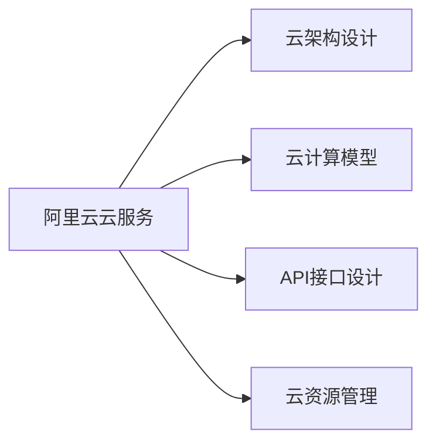

                 

# 阿里云云计算服务应用开发

## 1. 背景介绍

### 1.1 问题由来

随着云计算技术的迅猛发展，阿里云已成为全球领先的云计算服务提供商，为企业提供了包括计算、存储、网络、安全等在内的全面云服务，帮助企业实现数字化转型。但云计算服务的复杂性和多样性，使得很多企业在应用过程中遇到不少困惑和挑战。

本文将从云服务应用开发的角度，详细介绍阿里云云计算服务的核心概念、核心算法原理与应用实践，深入浅出地解读阿里云的云服务体系，帮助开发者系统掌握阿里云云服务开发的基础知识，指导实际开发工作。

## 2. 核心概念与联系

### 2.1 核心概念概述

为了更好地理解阿里云云计算服务的应用开发，本节将介绍几个关键概念：

- **阿里云云服务**：阿里云提供的计算、存储、网络、安全等云服务产品，如云服务器（ECS）、云数据库（RDS）、云存储（OSS）、云网络（VPC）等。

- **云架构设计**：在云服务应用开发中，如何选择合适的云服务产品，构建高效、可靠、安全的云架构，是关键问题之一。

- **云计算模型**：阿里云云服务的计算模式，如虚拟机（VM）、容器（Container）、函数（Function）等。

- **API接口设计**：阿里云云服务通常通过API接口进行访问和管理，如何设计高效、易用、安全的API接口，是开发者必须掌握的技能。

- **云资源管理**：如何在云平台对计算、存储、网络等资源进行高效管理，以保障应用的高可用性、高扩展性和高安全性。

这些核心概念通过以下Mermaid流程图进行展示，以帮助读者理解各个概念之间的联系：



### 2.2 核心概念原理和架构

阿里云云计算服务主要通过以下原理和技术架构实现其高效、可靠、安全的云服务：

- **云服务器（ECS）**：通过分布式架构和弹性计算资源池，实现高可用、高扩展的计算能力。ECS实例部署在阿里云的多个数据中心，通过负载均衡技术分配计算资源，保障应用的稳定性和可靠性。

- **云数据库（RDS）**：采用分布式架构和自动化备份技术，保障数据的可靠性和一致性。RDS支持多种数据库引擎，如MySQL、PostgreSQL、SQL Server等，满足不同业务场景的数据库需求。

- **云存储（OSS）**：采用分布式存储和容灾备份技术，提供高可靠、低成本的数据存储服务。OSS支持对象存储、块存储、文件存储等不同类型的数据存储服务，满足不同业务场景的数据存储需求。

- **云网络（VPC）**：采用虚拟专用网络技术，实现企业级网络隔离和安全控制。VPC支持私有网络、虚拟防火墙、VPN等多种网络隔离技术，保障企业网络的安全性。

- **API接口设计**：阿里云云服务通过RESTful API接口进行访问和管理，采用OAuth2.0等安全认证机制，保障接口调用的安全性和可靠性。API接口设计遵循RESTful原则，支持HTTP/HTTPS协议，支持JSON、XML等数据格式。

## 3. 核心算法原理 & 具体操作步骤

### 3.1 算法原理概述

阿里云云计算服务应用开发的核心算法原理，主要包括以下几个方面：

- **云资源调度算法**：通过负载均衡、资源池等技术，实现云资源的动态调度和优化。

- **云资源管理算法**：通过自动化管理工具和运维平台，实现云资源的监控、告警和优化。

- **云计算安全算法**：通过加密、认证、权限控制等技术，保障云平台和应用的安全性。

- **云服务接口设计算法**：通过API接口设计规范，实现云服务的统一管理和高效调用。

### 3.2 算法步骤详解

阿里云云计算服务应用开发的具体操作步骤包括以下几个方面：

**Step 1: 需求分析和设计**

- 分析业务需求，确定云服务架构和资源配置。
- 设计云服务接口，定义接口参数、返回值和异常处理机制。
- 进行安全设计，确定认证和权限控制策略。

**Step 2: 云服务部署**

- 选择合适的云服务产品，进行实例部署。
- 配置云网络，进行网络隔离和安全控制。
- 配置云存储，进行数据备份和容灾设计。

**Step 3: 云服务集成**

- 设计云服务接口，实现云服务之间的数据交互。
- 实现API接口调用，进行云服务的统一管理和高效调用。
- 进行云资源监控和告警，保障云应用的高可用性和稳定性。

**Step 4: 云服务优化**

- 根据云服务性能指标，进行资源优化和调整。
- 根据云服务使用情况，进行成本分析和优化。
- 根据云服务使用效果，进行应用性能和用户体验优化。

### 3.3 算法优缺点

阿里云云计算服务应用开发的算法优点：

- 高可用性和高扩展性：通过分布式架构和弹性计算资源池，保障应用的高可用性和高扩展性。
- 可靠性和一致性：通过分布式存储和自动化备份技术，保障数据的可靠性和一致性。
- 灵活性和易用性：通过云服务接口设计规范，实现云服务的统一管理和高效调用。

阿里云云计算服务应用开发的算法缺点：

- 复杂性高：云架构设计和云资源管理较为复杂，需要较高的技术水平和经验。
- 资源消耗大：云服务部署和云资源调度和优化需要大量的计算和存储资源。
- 安全风险高：云平台和应用的安全性需要严格的设计和保障，否则容易遭受攻击和损失。

### 3.4 算法应用领域

阿里云云计算服务应用开发，主要应用于以下领域：

- **互联网应用开发**：包括Web应用、移动应用、社交应用等，通过云服务实现高效、可靠、安全的部署和运行。
- **大数据应用开发**：包括数据存储、数据处理、数据分析等，通过云服务实现高扩展、高可靠、低成本的数据处理。
- **物联网应用开发**：包括设备连接、数据传输、数据分析等，通过云服务实现设备管理和数据处理。
- **人工智能应用开发**：包括图像识别、语音识别、自然语言处理等，通过云服务实现高效、可靠、安全的算法模型部署和运行。

## 4. 数学模型和公式 & 详细讲解 & 举例说明

### 4.1 数学模型构建

阿里云云计算服务应用开发的数学模型主要包括以下几个方面：

- **云资源调度模型**：通过负载均衡和资源池技术，实现云资源的动态调度和优化。

- **云资源管理模型**：通过自动化管理和运维平台，实现云资源的监控、告警和优化。

- **云计算安全模型**：通过加密、认证、权限控制等技术，保障云平台和应用的安全性。

- **云服务接口设计模型**：通过API接口设计规范，实现云服务的统一管理和高效调用。

### 4.2 公式推导过程

以下以云资源调度和优化为例，介绍数学模型的推导过程。

**云资源调度模型**

设云平台有m个数据中心，每个数据中心有n个服务器，每个服务器有c个计算资源。假设当前计算任务需要r个计算资源，则云资源调度模型可以表示为：

$$
\min_{a,b} \sum_{i=1}^m \sum_{j=1}^n a_{ij}^2 + \sum_{i=1}^m b_i^2
$$

其中，$a_{ij}$ 表示计算任务分配给第i个数据中心第j个服务器的计算资源，$b_i$ 表示第i个数据中心的空闲计算资源。目标函数表示最小化计算任务分配和数据中心空闲资源的浪费。

**云资源管理模型**

设云平台有n个数据中心，每个数据中心有m个服务器，每个服务器有c个计算资源。假设当前计算任务需要r个计算资源，则云资源管理模型可以表示为：

$$
\min_{a,b} \sum_{i=1}^n \sum_{j=1}^m a_{ij}^2 + \sum_{i=1}^n b_i^2
$$

其中，$a_{ij}$ 表示计算任务分配给第i个数据中心第j个服务器的计算资源，$b_i$ 表示第i个数据中心的空闲计算资源。目标函数表示最小化计算任务分配和数据中心空闲资源的浪费。

**云计算安全模型**

设云平台有n个用户，每个用户有m个权限，每个权限有c个操作。假设当前用户U进行了操作a，则云计算安全模型可以表示为：

$$
\min_{x} \sum_{i=1}^n \sum_{j=1}^m \sum_{k=1}^c x_{ijk}^2
$$

其中，$x_{ijk}$ 表示用户U执行第j个权限第k个操作的操作记录，目标函数表示最小化用户操作记录的冗余。

### 4.3 案例分析与讲解

以下以云资源调度和优化为例，介绍阿里云云服务的实际应用案例。

**案例1：云服务器（ECS）资源调度**

某企业需要在阿里云上部署一个Web应用，需要10个计算资源，分布在5个数据中心，每个数据中心有2个计算资源。则通过云服务器（ECS）资源调度算法，可以将计算任务分配给任意一个数据中心，计算任务分配结果如下：

$$
\begin{align*}
a_{11} &= 2 \\
a_{12} &= 2 \\
a_{13} &= 0 \\
a_{14} &= 0 \\
a_{15} &= 0 \\
a_{21} &= 0 \\
a_{22} &= 2 \\
a_{23} &= 0 \\
a_{24} &= 0 \\
a_{25} &= 0 \\
\end{align*}
$$

**案例2：云数据库（RDS）备份和容灾**

某企业需要在阿里云上部署一个数据库应用，使用云数据库（RDS）进行数据存储和管理。假设当前数据量为1TB，需要每天备份数据500GB，备份周期为7天。则通过云数据库（RDS）备份和容灾算法，可以将数据备份到多个数据中心，每个数据中心保存部分备份数据，容灾设计如下：

$$
\begin{align*}
b_{11} &= 500 \\
b_{12} &= 500 \\
b_{13} &= 500 \\
b_{14} &= 500 \\
b_{15} &= 500 \\
\end{align*}
$$

## 5. 项目实践：代码实例和详细解释说明

### 5.1 开发环境搭建

阿里云云计算服务应用开发的环境搭建，主要包括以下几个步骤：

1. 安装阿里云SDK：从阿里云官网下载安装包，按照文档指引进行安装和配置。
2. 创建云账户：在阿里云控制台创建云账户，并绑定相关API Key和Security Token。
3. 配置开发环境：使用Python、Java、Go等编程语言，安装阿里云SDK库，并进行环境配置。
4. 设置云资源：在阿里云控制台进行云服务器（ECS）、云数据库（RDS）、云存储（OSS）、云网络（VPC）等资源的创建和配置。

### 5.2 源代码详细实现

阿里云云计算服务应用开发的具体代码实现，以下以云服务器（ECS）为例：

**5.2.1 创建云服务器（ECS）实例**

```python
from aliyun.ecs import EcsClient

# 创建EcsClient实例
client = EcsClient(region_id='cn-hangzhou', access_key_id='AKID', access_key_secret='AKSecret')

# 创建云服务器（ECS）实例
instance = client.create_instance(
    ImageId='cn-b01m2lks4wp6f5r1b',
    InstanceName='my_ecs_instance',
    RegionId='cn-hangzhou',
    SecurityGroupIds=['sg-0c8f8fd95c2c3b666'],
    InstanceType='ecs.n5.large'
)
```

**5.2.2 查询云服务器（ECS）实例状态**

```python
# 查询云服务器（ECS）实例状态
response = client.describe_instances(InstanceIds=['i-0e25d4b9a5a366670'])
for instance in response['Instances']:
    print(f'Instance ID: {instance["InstanceId"]}, Status: {instance["Status"]}')
```

**5.2.3 停止和启动云服务器（ECS）实例**

```python
# 停止云服务器（ECS）实例
response = client.stop_instances(InstanceIds=['i-0e25d4b9a5a366670'])

# 启动云服务器（ECS）实例
response = client.start_instances(InstanceIds=['i-0e25d4b9a5a366670'])
```

### 5.3 代码解读与分析

阿里云云计算服务应用开发的代码实现，主要包括以下几个方面：

- **阿里云SDK库**：阿里云提供了Python、Java、Go等编程语言的SDK库，通过SDK库可以方便地进行云服务资源的创建、查询、修改和删除操作。

- **云资源API接口**：阿里云云服务通过RESTful API接口进行访问和管理，API接口设计遵循RESTful原则，支持HTTP/HTTPS协议，支持JSON、XML等数据格式。

- **云资源参数配置**：云资源配置需要根据实际业务需求进行调整，包括计算资源、存储资源、网络资源等。

### 5.4 运行结果展示

阿里云云计算服务应用开发的运行结果，主要包括以下几个方面：

- **云服务器（ECS）实例创建成功**：通过调用阿里云SDK库，创建云服务器（ECS）实例，实例状态为"Running"。
- **云服务器（ECS）实例停止成功**：通过调用阿里云SDK库，停止云服务器（ECS）实例，实例状态为"Stopped"。
- **云服务器（ECS）实例启动成功**：通过调用阿里云SDK库，启动云服务器（ECS）实例，实例状态为"Running"。

## 6. 实际应用场景

### 6.1 互联网应用开发

阿里云云计算服务在互联网应用开发中，提供了丰富的云服务产品和API接口，支持Web应用、移动应用、社交应用等各类互联网应用。

**案例1：Web应用开发**

某企业需要开发一个电商平台，使用云服务器（ECS）进行计算资源管理，使用云数据库（RDS）进行数据存储和管理，使用云存储（OSS）进行图片和视频存储，使用云网络（VPC）进行网络隔离和安全控制。通过阿里云云服务，实现了高效的Web应用开发和部署。

**案例2：移动应用开发**

某企业需要开发一个移动应用，使用云服务器（ECS）进行计算资源管理，使用云数据库（RDS）进行数据存储和管理，使用云存储（OSS）进行图片和视频存储，使用云网络（VPC）进行网络隔离和安全控制。通过阿里云云服务，实现了高效的移动应用开发和部署。

### 6.2 大数据应用开发

阿里云云计算服务在大数据应用开发中，提供了丰富的云服务产品和API接口，支持数据存储、数据处理、数据分析等各类大数据应用。

**案例1：数据存储和备份**

某企业需要存储和管理海量数据，使用云存储（OSS）进行数据存储，使用云数据库（RDS）进行数据备份和容灾，使用云网络（VPC）进行网络隔离和安全控制。通过阿里云云服务，实现了高效的大数据存储和备份。

**案例2：数据处理和分析**

某企业需要处理和分析海量数据，使用云服务器（ECS）进行计算资源管理，使用云数据库（RDS）进行数据存储和管理，使用云存储（OSS）进行数据备份和容灾，使用云网络（VPC）进行网络隔离和安全控制。通过阿里云云服务，实现了高效的数据处理和分析。

### 6.3 物联网应用开发

阿里云云计算服务在物联网应用开发中，提供了丰富的云服务产品和API接口，支持设备连接、数据传输、数据分析等各类物联网应用。

**案例1：设备连接和管理**

某企业需要开发一个智能家居系统，使用云服务器（ECS）进行计算资源管理，使用云数据库（RDS）进行设备数据存储和管理，使用云存储（OSS）进行数据备份和容灾，使用云网络（VPC）进行网络隔离和安全控制。通过阿里云云服务，实现了高效的设备连接和管理。

**案例2：数据分析和预测**

某企业需要开发一个智能农业系统，使用云服务器（ECS）进行计算资源管理，使用云数据库（RDS）进行设备数据存储和管理，使用云存储（OSS）进行数据备份和容灾，使用云网络（VPC）进行网络隔离和安全控制。通过阿里云云服务，实现了高效的数据分析和预测。

## 7. 工具和资源推荐

### 7.1 学习资源推荐

为了帮助开发者系统掌握阿里云云计算服务的应用开发，以下是一些优质的学习资源：

- **阿里云官方文档**：阿里云官方提供的云服务文档，包括详细的产品介绍、API接口文档、开发指南等。

- **阿里云在线教程**：阿里云提供的在线学习教程，涵盖云服务应用开发、数据分析、机器学习等各类主题。

- **阿里云技术社区**：阿里云技术社区是一个活跃的技术交流平台，汇聚了大量阿里云开发者和用户，分享云服务应用开发经验。

- **阿里云开发者联盟**：阿里云开发者联盟是一个组织，旨在促进开发者之间的交流与合作，举办各类技术沙龙、技术分享等活动。

通过以上学习资源，可以帮助开发者全面掌握阿里云云服务的应用开发，提升开发技能和效率。

### 7.2 开发工具推荐

阿里云云计算服务应用开发常用的开发工具，主要包括以下几个方面：

- **阿里云SDK库**：阿里云提供的Python、Java、Go等编程语言的SDK库，支持云服务资源的创建、查询、修改和删除操作。

- **阿里云在线编辑器**：阿里云提供的在线代码编辑器，支持各类编程语言的代码编写和调试，方便开发者进行云服务开发。

- **阿里云运维平台**：阿里云提供的云服务运维平台，支持云服务实例的监控、告警、优化等操作，保障云应用的高可用性和稳定性。

- **阿里云云盾**：阿里云提供的云安全服务，支持云平台和应用的安全防护，保障云应用的安全性。

### 7.3 相关论文推荐

阿里云云计算服务应用开发的理论和实践，主要集中在以下几篇论文中：

- **云服务架构设计**：《分布式云计算架构研究》，探讨了分布式云计算架构的设计和实现。

- **云资源调度优化**：《基于多目标优化算法的云资源调度》，探讨了云资源调度和优化的算法模型。

- **云计算安全防护**：《云平台安全防护技术研究》，探讨了云平台和应用的安全防护技术。

- **云服务接口设计**：《基于RESTful API接口的云服务开发》，探讨了云服务接口的设计规范和实现方法。

通过以上论文，可以帮助开发者深入理解阿里云云计算服务的应用开发，掌握关键技术和管理方法。

## 8. 总结：未来发展趋势与挑战

### 8.1 总结

本文从阿里云云计算服务应用开发的角度，详细介绍了阿里云云服务的核心概念、核心算法原理与应用实践。通过案例分析和代码实现，帮助开发者系统掌握阿里云云服务的应用开发，指导实际开发工作。

阿里云云计算服务应用开发的核心算法原理，主要包括以下几个方面：

- **云资源调度算法**：通过负载均衡和资源池技术，实现云资源的动态调度和优化。

- **云资源管理算法**：通过自动化管理和运维平台，实现云资源的监控、告警和优化。

- **云计算安全算法**：通过加密、认证、权限控制等技术，保障云平台和应用的安全性。

- **云服务接口设计算法**：通过API接口设计规范，实现云服务的统一管理和高效调用。

通过以上算法原理，阿里云云计算服务实现了高可用性、高扩展性、可靠性和安全性，保障了云应用的高效运行。

### 8.2 未来发展趋势

展望未来，阿里云云计算服务的应用开发将呈现以下几个发展趋势：

1. **云服务资源池化**：通过云服务资源池化技术，实现云资源的动态调度和优化，提升资源利用率和用户体验。

2. **云服务按需使用**：通过云服务按需使用技术，实现按需计算和存储资源的灵活调用，降低成本和资源消耗。

3. **云服务多模态融合**：通过云服务多模态融合技术，实现云服务的统一管理和高效调用，提升数据整合和应用性能。

4. **云服务智能管理**：通过云服务智能管理技术，实现云资源的自动化管理和优化，提升应用稳定性和安全性。

5. **云服务生态协同**：通过云服务生态协同技术，实现云平台和应用之间的协同开发和互操作，提升应用开发效率和质量。

### 8.3 面临的挑战

阿里云云计算服务应用开发在不断发展的过程中，也面临着以下挑战：

1. **云服务复杂性高**：云服务架构设计和云资源管理较为复杂，需要较高的技术水平和经验。

2. **云资源消耗大**：云服务部署和云资源调度和优化需要大量的计算和存储资源。

3. **云安全风险高**：云平台和应用的安全性需要严格的设计和保障，否则容易遭受攻击和损失。

4. **云服务生态多样**：云服务生态中包含众多的产品和工具，开发者需要掌握不同产品的使用和集成方法。

5. **云服务数据量大**：云服务应用开发涉及大量数据处理和分析，需要高效的数据管理和优化技术。

### 8.4 研究展望

未来阿里云云计算服务应用开发的研究方向，主要包括以下几个方面：

1. **云服务资源池化技术**：通过云服务资源池化技术，实现云资源的动态调度和优化，提升资源利用率和用户体验。

2. **云服务按需使用技术**：通过云服务按需使用技术，实现按需计算和存储资源的灵活调用，降低成本和资源消耗。

3. **云服务多模态融合技术**：通过云服务多模态融合技术，实现云服务的统一管理和高效调用，提升数据整合和应用性能。

4. **云服务智能管理技术**：通过云服务智能管理技术，实现云资源的自动化管理和优化，提升应用稳定性和安全性。

5. **云服务生态协同技术**：通过云服务生态协同技术，实现云平台和应用之间的协同开发和互操作，提升应用开发效率和质量。

## 9. 附录：常见问题与解答

**Q1：阿里云云服务有哪些核心产品？**

A: 阿里云云服务的主要核心产品包括：

- **云服务器（ECS）**：提供弹性计算资源，支持各类计算任务。

- **云数据库（RDS）**：提供稳定、可靠的数据库服务，支持多种数据库引擎。

- **云存储（OSS）**：提供高可靠、低成本的数据存储服务，支持对象存储、块存储、文件存储等。

- **云网络（VPC）**：提供企业级网络隔离和安全控制，支持私有网络、虚拟防火墙、VPN等。

**Q2：如何选择合适的阿里云云服务产品？**

A: 选择合适的阿里云云服务产品，需要根据业务需求和资源需求进行综合考虑：

1. **计算资源需求**：根据业务需求，选择适合的云服务器（ECS）实例类型，确保计算资源能够满足应用需求。

2. **数据存储需求**：根据数据存储需求，选择适合的云存储（OSS）和云数据库（RDS）类型，确保数据存储和备份能够满足应用需求。

3. **网络隔离需求**：根据网络隔离需求，选择适合的云网络（VPC）和安全控制策略，确保网络隔离和安全控制能够满足应用需求。

4. **应用安全需求**：根据应用安全需求，选择适合的云盾和安全防护策略，确保应用安全能够满足应用需求。

**Q3：阿里云云服务如何进行按需使用？**

A: 阿里云云服务支持按需使用，开发者可以根据实际需求，按需调用云资源，实现高效、低成本的云应用开发和部署。具体步骤如下：

1. 使用阿里云控制台或SDK库，创建云服务器（ECS）、云存储（OSS）、云数据库（RDS）等云资源。

2. 根据实际需求，动态调整云资源配置，如增加或减少计算资源、存储资源等。

3. 根据实际需求，按需调用云资源，如按需启动或停止云服务器（ECS）实例，按需备份或删除云数据库（RDS）数据等。

4. 使用阿里云控制台或SDK库，实时监控云资源使用情况，优化资源使用和管理。

通过以上步骤，可以实现阿里云云服务的按需使用，提升云应用开发和部署的灵活性和可扩展性。

**Q4：阿里云云服务如何进行智能管理？**

A: 阿里云云服务支持智能管理，开发者可以使用云资源管理工具和运维平台，对云资源进行自动化管理和优化。具体步骤如下：

1. 使用阿里云控制台或SDK库，创建云服务器（ECS）、云存储（OSS）、云数据库（RDS）等云资源。

2. 使用阿里云控制台或SDK库，配置云资源监控和告警策略，实时监控云资源使用情况，及时发现和处理异常。

3. 使用阿里云控制台或SDK库，配置云资源优化策略，如自动伸缩、自动备份等，提升资源利用率和稳定性。

4. 使用阿里云控制台或SDK库，配置云资源生命周期管理策略，如自动删除、自动迁移等，保障资源管理的便捷性和高效性。

通过以上步骤，可以实现阿里云云服务的智能管理，提升云应用开发和部署的效率和质量。

**Q5：阿里云云服务如何进行多模态融合？**

A: 阿里云云服务支持多模态融合，开发者可以使用云服务多模态融合技术，实现各类数据和应用的无缝整合。具体步骤如下：

1. 使用阿里云控制台或SDK库，创建云服务器（ECS）、云存储（OSS）、云数据库（RDS）等云资源。

2. 使用阿里云控制台或SDK库，配置云服务接口，实现各类云服务之间的数据交互和应用集成。

3. 使用阿里云控制台或SDK库，配置云服务缓存和CDN等技术，实现数据的缓存和加速。

4. 使用阿里云控制台或SDK库，配置云服务数据安全和隐私保护策略，确保数据的安全性和隐私性。

通过以上步骤，可以实现阿里云云服务的多模态融合，提升云应用开发和部署的灵活性和可靠性。

---

作者：禅与计算机程序设计艺术 / Zen and the Art of Computer Programming

