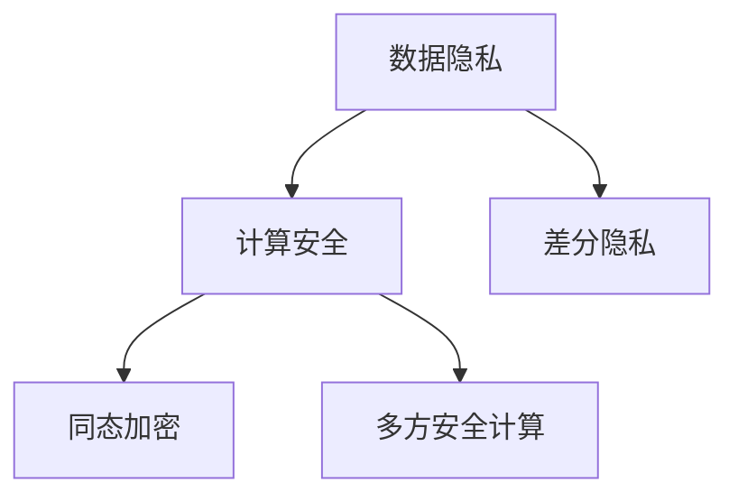

                 

# 隐私安全：为人类计算保驾护航

在数字时代，计算能力已经无所不在，渗透到了人们生活的方方面面。然而，计算的力量在带来便利的同时，也引发了一系列隐私和安全问题。如何在保障隐私的前提下，让计算发挥最大的价值，成为当前科技界和政策界亟待解决的重要课题。本文将深入探讨隐私安全的核心概念、技术原理、实际应用，并展望未来的发展趋势与挑战。

## 1. 背景介绍

### 1.1 问题由来

随着信息技术的发展，数据已成为最重要的生产要素之一。无论是商业交易、社交互动还是科学研究，数据都在起着至关重要的作用。然而，数据的大量使用也带来了隐私和安全的隐患。个人信息被非法获取、滥用甚至公开交易，不仅侵犯了个人的合法权益，也给社会稳定和经济发展带来了负面影响。因此，如何保护数据隐私、维护计算安全，已经成为全球关注的热点。

### 1.2 问题核心关键点

隐私安全的核心在于如何在不泄露个人信息的前提下，提供高效、安全的计算服务。主要包括以下几个关键点：

- **数据隐私保护**：保护个人数据的隐私，防止数据泄露、滥用和非法交易。
- **计算安全**：确保计算过程不受外部攻击和内部恶意软件的威胁，保证计算结果的正确性和可靠性。
- **合规性**：遵循各国法律法规，如GDPR、CCPA等，确保数据使用的合法性。

## 2. 核心概念与联系

### 2.1 核心概念概述

为更好地理解隐私安全的核心概念，本节将介绍几个关键概念及其联系：

- **数据隐私**：指个人信息或数据在被收集、存储、处理、传输和共享过程中，未被未经授权的个人或组织获取和利用的状态。
- **计算安全**：指保护计算过程和计算结果免受未授权的访问和篡改，防止信息泄露、数据篡改和拒绝服务攻击等。
- **差分隐私**：一种隐私保护技术，通过向查询结果中添加噪声，使得个体数据的隐私得到保护，同时尽可能保留数据的统计特性。
- **同态加密**：一种加密技术，允许在加密数据上进行计算，而无需解密，从而实现数据的隐私保护。
- **多方安全计算**：指多个参与方共同计算一个函数，每个参与方只掌握部分数据，最终结果对所有参与方都是可用的，但每个参与方都无法单独获得完整结果，从而保护参与方的数据隐私。

这些概念之间的关系可以通过以下Mermaid流程图来展示：



### 2.2 核心概念原理和架构

隐私安全的核心原理基于对计算过程和数据存储的全面保护。数据隐私保护通常通过数据匿名化、加密和差分隐私等技术实现。计算安全则通过身份认证、访问控制、安全协议等手段实现。

以同态加密为例，其基本原理是通过加密算法将明文转换为密文，使得在密文上进行计算的结果仍为加密形式，无需解密即可得到结果。同态加密分为全同态加密和半同态加密两种类型，分别支持任意运算和加法运算。


在实际应用中，同态加密通常用于云计算、物联网、区块链等场景，保护数据隐私的同时，也提升了计算效率和安全性。

## 3. 核心算法原理 & 具体操作步骤

### 3.1 算法原理概述

隐私安全的核心算法原理主要包括以下几种：

- **差分隐私**：通过向查询结果中添加噪声，确保个体数据的隐私得到保护，同时尽可能保留数据的统计特性。
- **同态加密**：允许在加密数据上进行计算，而无需解密，从而实现数据的隐私保护。
- **多方安全计算**：多个参与方共同计算一个函数，每个参与方只掌握部分数据，最终结果对所有参与方都是可用的，但每个参与方都无法单独获得完整结果，从而保护参与方的数据隐私。

### 3.2 算法步骤详解

#### 3.2.1 差分隐私

差分隐私的核心步骤如下：

1. **定义隐私预算**：确定允许的最大隐私损失，通常以ε-δ隐私预算表示。
2. **添加噪声**：在查询结果中添加噪声，以掩盖个体数据的影响。
3. **重新计算**：使用噪声化后的数据重新计算查询结果。
4. **输出结果**：将噪声化后的结果作为最终输出。

具体实现中，可以使用Laplace机制或Gaussian机制来添加噪声，分别适用于计数查询和连续查询。

#### 3.2.2 同态加密

同态加密的核心步骤如下：

1. **加密数据**：使用同态加密算法将数据加密。
2. **计算密文**：在加密数据上进行计算。
3. **解密结果**：将计算结果解密得到明文。

具体实现中，可以使用全同态加密算法（如GGH加密）或半同态加密算法（如Paillier加密），分别支持任意运算和加法运算。

#### 3.2.3 多方安全计算

多方安全计算的核心步骤如下：

1. **分割数据**：将数据分割为多个部分，每个参与方只掌握其中一部分数据。
2. **计算中间结果**：每个参与方在自己的数据上计算中间结果，并将结果传输到中心节点。
3. **合并结果**：中心节点将各个中间结果合并，计算最终结果。
4. **结果传输**：将最终结果传输给所有参与方。

具体实现中，可以使用Yao加密和GMW加密等协议，确保计算过程中的数据隐私。

### 3.3 算法优缺点

隐私安全算法具有以下优点：

- **数据隐私保护**：通过加密、匿名化等技术，确保数据不被非法获取和使用。
- **计算安全性**：通过安全协议和访问控制，确保计算过程和结果的安全性。
- **灵活性**：适用于多种计算场景，如云计算、物联网、区块链等。

同时，隐私安全算法也存在以下缺点：

- **计算复杂度高**：加密和解密过程消耗大量计算资源，导致计算效率降低。
- **实时性差**：加密和解密过程增加延迟，导致实时性下降。
- **安全风险**：存在计算过程被攻破或泄露的风险，尤其是在算法实现和协议设计上。

### 3.4 算法应用领域

隐私安全算法在以下领域得到了广泛应用：

- **医疗**：保护患者隐私，确保医疗数据的安全存储和传输。
- **金融**：保护用户隐私，确保交易数据的安全性和完整性。
- **政府**：保护公民隐私，确保公共数据的安全和合规性。
- **企业**：保护客户隐私，确保业务数据的保密性和完整性。
- **科研**：保护研究数据，确保科学数据的隐私和共享。

## 4. 数学模型和公式 & 详细讲解

### 4.1 数学模型构建

隐私安全模型的数学模型通常包括数据的输入、中间计算和输出三个部分。以差分隐私为例，数学模型如下：

- **输入**：原始数据集 $D$ 和查询函数 $f$。
- **中间计算**：在数据集 $D$ 上执行查询函数 $f$，得到结果 $Y$。
- **输出**：向 $Y$ 添加噪声，得到差分隐私保护后的结果 $\hat{Y}$。

数学公式为：

$$
\hat{Y} = f(D) + \Delta
$$

其中 $\Delta$ 表示噪声，通常为Laplace分布或Gaussian分布。

### 4.2 公式推导过程

以Laplace机制为例，推导差分隐私保护公式：

1. **隐私预算**：定义隐私预算 $ε$，表示允许的最大隐私损失。
2. **添加噪声**：在查询结果 $Y$ 中添加噪声 $\Delta$，其中 $\Delta \sim Laplace(\mu=0, \sigma=\frac{ε}{\delta})$。
3. **输出结果**：将噪声化后的结果 $\hat{Y} = Y + \Delta$ 作为最终输出。

具体推导如下：

- **差分隐私定义**：对于任意两个相邻的数据集 $D$ 和 $D'$，差分隐私要求满足如下条件：
  $$
  P[|f(D) - f(D')| > ε] \leq \delta
  $$
  其中 $ε$ 和 $\delta$ 为隐私预算参数。

- **Laplace噪声**：添加Laplace噪声 $\Delta \sim Laplace(\mu=0, \sigma=\frac{ε}{\delta})$，使得：
  $$
  P[|f(D) - f(D')| > ε] = \frac{1}{ε}e^{-ε}
  $$

- **差分隐私保护**：将Laplace噪声 $\Delta$ 添加到查询结果 $Y$ 中，得到差分隐私保护后的结果 $\hat{Y} = Y + \Delta$，满足差分隐私的要求。

### 4.3 案例分析与讲解

以医疗数据隐私保护为例，分析差分隐私的实际应用：

1. **原始数据**：医疗数据集 $D$，包含患者姓名、年龄、病历、诊断结果等信息。
2. **查询函数**：查询函数 $f$，用于统计某种疾病的患病率。
3. **噪声添加**：在查询结果 $Y$ 中添加Laplace噪声，确保个体数据的隐私。
4. **输出结果**：差分隐私保护后的结果 $\hat{Y}$，提供患病率的统计数据。

通过差分隐私，医疗数据的安全性和隐私性得到了保障，同时数据的统计特性得以保留。

## 5. 项目实践：代码实例和详细解释说明

### 5.1 开发环境搭建

在进行隐私安全项目实践前，我们需要准备好开发环境。以下是使用Python进行差分隐私开发的Python环境配置流程：

1. 安装Anaconda：从官网下载并安装Anaconda，用于创建独立的Python环境。

2. 创建并激活虚拟环境：
```bash
conda create -n dp-env python=3.8 
conda activate dp-env
```

3. 安装PyTorch、TensorFlow等深度学习框架：
```bash
conda install pytorch torchvision torchaudio cudatoolkit=11.1 -c pytorch -c conda-forge
conda install tensorflow
```

4. 安装隐私保护库：
```bash
pip install privacy-pandas
```

5. 安装各类工具包：
```bash
pip install numpy pandas scikit-learn matplotlib tqdm jupyter notebook ipython
```

完成上述步骤后，即可在`dp-env`环境中开始隐私安全项目实践。

### 5.2 源代码详细实现

下面以差分隐私保护为例，给出使用隐私保护库对医疗数据集进行差分隐私保护的PyTorch代码实现。

首先，定义医疗数据集：

```python
import pandas as pd
from privacy_pandas import DPDataFrame

# 读取原始数据
df = pd.read_csv('medical_data.csv')

# 构建差分隐私数据集
dp_df = DPDataFrame(df)
```

然后，定义查询函数：

```python
def calculate_disease_rate(df):
    # 计算某种疾病的患病率
    disease_count = df['disease'].value_counts()[1]
    total_count = df.shape[0]
    return disease_count / total_count
```

接着，进行差分隐私保护：

```python
from privacy_pandas import differential_privacy

# 定义隐私预算参数
epsilon = 0.1
delta = 0.01

# 应用差分隐私保护
dp_model = differential_privacy DPDataFrame(df)
dp_result = dp_model.calculate(calculate_disease_rate, epsilon, delta)
```

最后，输出差分隐私保护结果：

```python
print(dp_result)
```

以上就是使用差分隐私保护医疗数据的完整代码实现。可以看到，通过隐私保护库，我们能够简单高效地实现差分隐私保护，保障数据隐私的同时，保留了数据的统计特性。

### 5.3 代码解读与分析

让我们再详细解读一下关键代码的实现细节：

**DPDataFrame类**：
- `__init__`方法：初始化数据集和隐私预算参数。
- `calculate`方法：执行查询函数并应用差分隐私保护。

**隐私预算参数**：
- 定义了差分隐私预算参数 $ε$ 和 $\delta$，控制隐私损失的强度。

**查询函数**：
- 定义了一个简单的查询函数，用于计算某种疾病的患病率。

**差分隐私保护**：
- 使用隐私保护库对数据集进行差分隐私保护，将查询函数应用到差分隐私数据集上。

**输出结果**：
- 最终输出差分隐私保护后的结果，保留了数据的统计特性。

可以看出，隐私保护库的使用大大简化了差分隐私保护的实现过程，开发者只需关注具体的查询函数和隐私预算参数，即可实现差分隐私保护。

当然，工业级的系统实现还需考虑更多因素，如模型的保存和部署、超参数的自动搜索、更灵活的隐私预算组合等。但核心的差分隐私保护过程基本与此类似。

## 6. 实际应用场景

### 6.1 医疗数据隐私保护

在医疗领域，隐私数据保护尤为重要。医疗数据包含大量的敏感信息，如病历、诊断结果等，一旦泄露将对患者隐私造成极大威胁。

通过差分隐私保护，可以在不泄露个体数据的前提下，统计分析医疗数据。例如，医院可以统计某种疾病的患病率，分析流行病趋势，优化诊疗方案。

### 6.2 金融数据隐私保护

金融数据涉及用户的个人收入、消费记录、交易记录等敏感信息，一旦泄露将给用户带来巨大的经济损失。

通过同态加密，金融机构可以在不解密的情况下，处理和分析用户数据。例如，银行可以计算用户的信用评分，评估贷款风险，同时保护用户的隐私。

### 6.3 政府数据隐私保护

政府数据包含大量的公共信息，如人口普查、税收记录、社会福利等，一旦泄露将对国家安全和社会稳定造成威胁。

通过多方安全计算，政府部门可以在不泄露数据的情况下，联合多个部门进行数据分析和决策。例如，政府可以联合公安、税务等部门，分析社会犯罪趋势，优化社会管理。

### 6.4 未来应用展望

随着隐私保护技术的不断发展，隐私安全将在更多领域得到应用，为社会带来更多的福利和保障。

在智慧城市治理中，隐私安全技术可以应用于交通流量监测、公共安全监控等环节，提高城市管理的自动化和智能化水平，构建更安全、高效的未来城市。

在智能家居领域，隐私安全技术可以应用于视频监控、语音识别等场景，保护用户隐私的同时，提供智能化的家居服务。

在智能医疗领域，隐私安全技术可以应用于电子病历、远程诊疗等场景，保护患者隐私的同时，提升医疗服务的便捷性和可及性。

此外，在教育、旅游、物流等众多领域，隐私安全技术也将不断涌现，为各行业带来全新的变革和机遇。

## 7. 工具和资源推荐

### 7.1 学习资源推荐

为了帮助开发者系统掌握隐私安全技术，这里推荐一些优质的学习资源：

1. **《隐私保护技术基础》**：介绍差分隐私、同态加密、多方安全计算等隐私保护技术的基础知识。
2. **《安全计算：理论与实践》**：详细讲解隐私保护技术的理论基础和实际应用。
3. **《数据隐私与安全》课程**：斯坦福大学开设的隐私保护课程，涵盖隐私保护技术和实际应用案例。
4. **《隐私保护技术》书籍**：介绍隐私保护技术的原理、实现和应用，适合初学者和从业者。
5. **Kaggle隐私保护竞赛**：通过实战项目，学习隐私保护技术的实际应用，积累实践经验。

通过对这些资源的学习实践，相信你一定能够快速掌握隐私安全技术的精髓，并用于解决实际的隐私保护问题。

### 7.2 开发工具推荐

高效的开发离不开优秀的工具支持。以下是几款用于隐私安全开发的常用工具：

1. **Python**：灵活的编程语言，拥有丰富的隐私保护库和数据处理工具。
2. **TensorFlow**：强大的深度学习框架，支持隐私保护技术的实现和应用。
3. **PyTorch**：灵活的深度学习框架，支持隐私保护技术的研究和实践。
4. **隐私保护库**：如隐私-pandas、dp-learn等，提供多种隐私保护算法的实现和应用。
5. **可视化工具**：如TensorBoard、Weights & Biases等，监控和分析隐私保护模型的训练过程和结果。

合理利用这些工具，可以显著提升隐私安全项目的开发效率，加快创新迭代的步伐。

### 7.3 相关论文推荐

隐私保护技术的发展源于学界的持续研究。以下是几篇奠基性的相关论文，推荐阅读：

1. **Differential Privacy**：提出差分隐私保护技术，成为隐私保护领域的经典算法。
2. **Homomorphic Encryption**：提出同态加密算法，使得加密数据上进行计算成为可能。
3. **Secure Multiparty Computation**：提出多方安全计算协议，保护多个参与方的数据隐私。
4. **Federated Learning**：提出联邦学习技术，保护用户数据的同时，实现模型的分布式训练。
5. **Privacy-Preserving Machine Learning**：介绍隐私保护机器学习技术，保障数据隐私的同时，提高模型的性能。

这些论文代表了大数据隐私保护技术的发展脉络。通过学习这些前沿成果，可以帮助研究者把握学科前进方向，激发更多的创新灵感。

## 8. 总结：未来发展趋势与挑战

### 8.1 总结

本文对隐私安全的核心概念、技术原理和实际应用进行了全面系统的介绍。首先阐述了隐私安全的背景和重要性，明确了隐私保护在数据处理、计算安全、合规性等方面的关键作用。其次，从原理到实践，详细讲解了差分隐私、同态加密、多方安全计算等隐私保护算法的实现过程，给出了隐私保护项目开发的完整代码实例。同时，本文还广泛探讨了隐私安全技术在医疗、金融、政府等众多领域的应用前景，展示了隐私安全技术的巨大潜力。此外，本文精选了隐私保护技术的各类学习资源，力求为读者提供全方位的技术指引。

通过本文的系统梳理，可以看到，隐私安全技术正在成为数据处理和计算安全的重要范式，极大地保障了数据的隐私和安全。未来，伴随隐私保护技术的不断演进，相信计算安全将得到更加全面的保障，数据隐私将在各个行业得到更好的保护。

### 8.2 未来发展趋势

展望未来，隐私安全技术将呈现以下几个发展趋势：

1. **隐私预算优化**：随着数据的复杂性和多样性增加，隐私预算的优化成为隐私保护的重要研究方向。通过更智能的隐私预算分配，实现隐私保护和数据统计的平衡。
2. **隐私保护算法融合**：将差分隐私、同态加密、多方安全计算等算法进行融合，提升隐私保护的效率和效果。
3. **隐私保护技术标准化**：隐私保护技术的发展离不开标准化和规范化。通过制定隐私保护标准，统一隐私保护算法和实现，推动隐私保护技术的普及和应用。
4. **隐私保护技术普及**：隐私保护技术将成为各种应用场景的标配，从云计算、物联网到区块链，各行业都将广泛应用隐私保护技术。
5. **隐私保护技术协同**：隐私保护技术需要与区块链、联邦学习等新兴技术进行协同，提升隐私保护的全面性和安全性。

以上趋势凸显了隐私安全技术的广阔前景。这些方向的探索发展，必将进一步提升隐私保护的效果和应用范围，为数据安全提供更强大的保障。

### 8.3 面临的挑战

尽管隐私安全技术已经取得了瞩目成就，但在迈向更加智能化、普适化应用的过程中，它仍面临着诸多挑战：

1. **计算资源消耗**：隐私保护算法的实现需要大量的计算资源，尤其是在大规模数据集上。如何降低计算复杂度，提升隐私保护效率，是未来研究的重要方向。
2. **安全性和隐私性平衡**：隐私保护技术的实现需要在安全性和隐私性之间找到平衡点，防止过度保护导致数据无法使用。如何设计合理的隐私预算，保障数据隐私的同时，提供高效的数据统计服务，是未来研究的重点。
3. **隐私保护算法多样性**：现有的隐私保护算法主要集中在差分隐私、同态加密等方面，多样性不足。如何引入新的隐私保护算法，提升隐私保护效果，是未来研究的重要方向。
4. **隐私保护技术的普及**：隐私保护技术的推广和普及还面临诸多障碍，如算法实现复杂、设备资源限制等。如何简化隐私保护算法的实现过程，提升其可操作性，是未来研究的重要方向。
5. **隐私保护技术的协同**：隐私保护技术需要与其他技术进行协同，如区块链、联邦学习等新兴技术。如何设计协同机制，提升隐私保护的效果和可靠性，是未来研究的重要方向。

正视隐私安全面临的这些挑战，积极应对并寻求突破，将是大数据隐私保护技术走向成熟的必由之路。相信随着学界和产业界的共同努力，隐私保护技术必将不断创新和突破，为数据安全提供更强大的保障。

### 8.4 研究展望

面对隐私安全面临的种种挑战，未来的研究需要在以下几个方面寻求新的突破：

1. **隐私预算优化算法**：设计更智能的隐私预算分配算法，提升隐私保护的效率和效果。
2. **隐私保护算法多样性**：引入新的隐私保护算法，提升隐私保护的效果和可靠性。
3. **隐私保护技术协同**：设计隐私保护技术与区块链、联邦学习等新兴技术的协同机制，提升隐私保护的效果和可靠性。
4. **隐私保护技术标准化**：制定隐私保护标准，统一隐私保护算法和实现，推动隐私保护技术的普及和应用。
5. **隐私保护技术普及**：简化隐私保护算法的实现过程，提升其可操作性，促进隐私保护技术的普及和应用。

这些研究方向的探索，必将引领隐私安全技术迈向更高的台阶，为数据安全提供更强大的保障。面向未来，隐私安全技术还需要与其他人工智能技术进行更深入的融合，如知识表示、因果推理、强化学习等，多路径协同发力，共同推动隐私保护技术的发展。只有勇于创新、敢于突破，才能不断拓展隐私保护技术的边界，让数据安全更好地保障人类社会的稳定和进步。

## 9. 附录：常见问题与解答

**Q1：隐私保护算法是否会降低数据的可用性？**

A: 隐私保护算法的实现通常需要在数据上添加噪声或加密，这会导致数据的统计特性受到影响。然而，通过合理设计隐私预算和隐私保护算法，可以在保证数据隐私的同时，尽可能保留数据的统计特性，从而提升数据的可用性。

**Q2：隐私保护技术是否会增加计算成本？**

A: 隐私保护算法的实现需要消耗大量的计算资源，尤其是在大规模数据集上。然而，随着技术的发展，计算成本正在逐渐降低。同时，通过优化算法和硬件设备，也可以有效降低计算成本。

**Q3：隐私保护技术是否会增加数据传输成本？**

A: 隐私保护技术通常需要在数据传输过程中进行加密和解密，这会增加一定的传输成本。然而，随着硬件设备的提升和算法优化，数据传输成本正在逐渐降低。

**Q4：隐私保护技术是否会降低模型的性能？**

A: 隐私保护技术可能会降低模型的性能，尤其是在高复杂度的情况下。然而，通过合理设计隐私保护算法和超参数，可以在保证隐私保护的前提下，提升模型的性能。

**Q5：隐私保护技术是否会降低系统的实时性？**

A: 隐私保护技术的实现通常会增加一定的计算延迟，从而降低系统的实时性。然而，通过优化算法和硬件设备，可以有效提升系统的实时性。

总之，隐私保护技术需要开发者根据具体应用场景，不断迭代和优化模型、数据和算法，方能得到理想的效果。通过合理设计隐私预算、优化算法和硬件设备，可以在保障隐私的前提下，实现数据的有效利用，提升系统的性能和实时性。

---

作者：禅与计算机程序设计艺术 / Zen and the Art of Computer Programming

