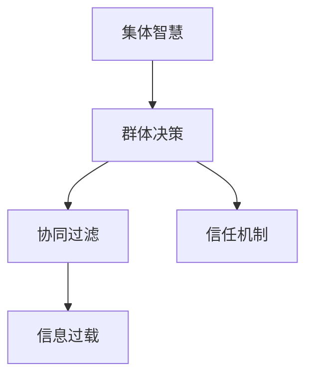

                 

# 集体智慧：群体决策的优势与陷阱

> 关键词：群体决策,集体智慧,智慧社会,陷阱,协同过滤,信息过载,信任机制,风险管理

## 1. 背景介绍

### 1.1 问题由来
在现代社会中，随着互联网和信息技术的发展，人们越来越依赖于集体智慧。无论是企业决策、政策制定，还是社交媒体上的讨论，集体智慧都发挥着重要作用。然而，集体智慧并非总是能带来最佳决策，反而常常伴随着一系列的陷阱和风险。

从表面上看，集体智慧可以汇聚不同人的智慧和经验，从而形成更加全面、合理的决策。例如，Google的搜索算法，就是基于集体智慧，通过大量用户的搜索行为来提供更精准的搜索结果。但实际上，集体智慧在很多时候也存在着种种缺陷和风险。

本节将详细探讨群体决策的优势与陷阱，帮助读者理解如何更好地利用集体智慧，并规避潜在的风险。

## 2. 核心概念与联系

### 2.1 核心概念概述

要理解集体智慧的优势与陷阱，首先需要掌握几个关键概念：

- **集体智慧（Collective Intelligence, CI）**：指一个群体通过集体协作，利用分布式计算、社会网络分析等技术手段，汇聚成员的智慧和经验，从而形成一种超越个体智慧的群体智能。

- **群体决策（Group Decision Making）**：指多个决策者通过集体讨论、投票、协商等方式，共同做出最终决策的过程。

- **协同过滤（Collaborative Filtering）**：一种推荐系统技术，通过分析用户之间的相似性，向用户推荐其可能感兴趣的物品或内容。

- **信息过载（Information Overload）**：指信息量过大，超出处理能力，导致决策者无法有效处理信息的状况。

- **信任机制（Trust Mechanism）**：指在群体决策中，为了保证决策的公正性和有效性，需要建立一些信任和激励机制，如公开透明、民主投票等。

这些概念之间的联系可以通过以下Mermaid流程图来展示：



这个流程图展示出集体智慧、群体决策、协同过滤、信息过载和信任机制之间的相互关系：

1. 集体智慧是群体决策的基础，通过汇集个体智慧，形成群体智能。
2. 群体决策是利用集体智慧，通过协同过滤等技术手段，形成最终决策。
3. 信息过载是群体决策中可能面临的风险，需要信任机制来缓解。
4. 信任机制是群体决策的保障，保证决策的公正性和有效性。

这些概念共同构成了群体决策的核心，帮助读者理解集体智慧的优势与陷阱。

## 3. 核心算法原理 & 具体操作步骤
### 3.1 算法原理概述

群体决策的优势主要体现在以下几个方面：

- **多样性**：不同成员的知识背景、经验、观点各异，通过集体讨论可以全面考虑各种可能，避免单一视角的局限。
- **创新性**：集体智慧可以汇聚创新思维，形成更加多样化的解决方案。
- **效率**：通过分工合作，每个成员可以专注于自己擅长的领域，提高决策效率。

但群体决策也存在一些风险和陷阱：

- **信息过载**：大量信息可能导致决策者无法处理，无法做出有效的决策。
- **群体极化**：在群体决策中，成员往往会趋向于与原有观点一致，形成极化现象，降低决策质量。
- **社会压力**：成员在群体决策中可能会受到社会压力，导致从众心理，无法表达真实意见。

为了更好地利用群体智慧，规避潜在的陷阱，本节将介绍几种常用的算法和操作步骤。

### 3.2 算法步骤详解

#### 3.2.1 数据收集与预处理
在群体决策中，数据收集和预处理是第一步。数据收集包括：

- 收集决策者的基本信息和背景知识。
- 收集决策相关的数据和信息。

数据预处理包括：

- 数据清洗和去重。
- 数据标准化和归一化。
- 数据分割和标注。

#### 3.2.2 模型构建
在数据预处理的基础上，可以构建群体决策模型。模型可以采用如下几种方式：

- **投票法**：通过统计每个决策者的意见，形成最终决策。
- **德尔菲法**：通过匿名调查和多次反馈，逐步形成共识。
- **加权平均法**：对每个决策者的意见进行加权平均，形成最终决策。

#### 3.2.3 模型训练
模型训练主要是对群体决策模型的参数进行优化，使其能够更好地适应具体决策场景。训练过程可以采用如下方法：

- **随机梯度下降**：通过梯度下降算法，优化模型参数。
- **交叉验证**：将数据集分为训练集和测试集，通过交叉验证提高模型泛化能力。
- **正则化**：防止模型过拟合，提高模型的泛化能力。

#### 3.2.4 模型评估
模型评估主要是对群体决策模型的性能进行评估。评估方法包括：

- **精确度**：模型预测的正确率。
- **召回率**：模型预测的覆盖率。
- **F1值**：精确度和召回率的调和平均。
- **ROC曲线**：衡量模型在不同阈值下的性能。

#### 3.2.5 模型部署
模型部署是将训练好的模型应用于实际决策过程。部署过程包括：

- 将模型集成到决策系统中。
- 在实际决策中调用模型，形成最终决策。
- 监控模型的性能，并根据反馈不断优化。

### 3.3 算法优缺点

群体决策的优点主要在于：

- 汇聚多样化的智慧和经验。
- 形成多角度的解决方案。
- 提高决策效率和准确性。

群体决策的缺点主要在于：

- 信息过载，导致决策效率低下。
- 群体极化，导致决策质量下降。
- 社会压力，导致从众心理，影响决策公正性。

### 3.4 算法应用领域

群体决策的优点使其在多个领域都有广泛的应用：

- **企业决策**：企业战略规划、项目管理、风险评估等。
- **政策制定**：政府决策、公共政策制定、社会治理等。
- **社交媒体**：社区讨论、舆情分析、投票选举等。
- **电子商务**：推荐系统、广告投放、用户反馈等。

## 4. 数学模型和公式 & 详细讲解  
### 4.1 数学模型构建

为了更好地理解群体决策的数学模型，下面将详细介绍其中的核心模型。

以加权平均法为例，假设决策集有$n$个成员，每个成员对某个问题的决策权重为$w_i$，则加权平均法的数学模型为：

$$
D = \frac{\sum_{i=1}^{n} w_i V_i}{\sum_{i=1}^{n} w_i}
$$

其中，$V_i$表示第$i$个成员的决策，$w_i$表示第$i$个成员的决策权重，$D$表示最终的决策结果。

### 4.2 公式推导过程

加权平均法的推导过程如下：

假设成员1、2、3对某个问题的决策分别为1、2、3，决策权重分别为0.4、0.3、0.3。则最终的决策结果为：

$$
D = \frac{0.4 \times 1 + 0.3 \times 2 + 0.3 \times 3}{0.4 + 0.3 + 0.3} = 2.1
$$

### 4.3 案例分析与讲解

以某公司的市场决策为例，公司有五个部门，每个部门对某市场开发策略的决策权重分别为0.2、0.3、0.2、0.2、0.1。部门1、2、3、4、5的决策分别为开发、暂停、开发、开发、暂停。则最终的决策结果为：

$$
D = \frac{0.2 \times 1 + 0.3 \times 2 + 0.2 \times 1 + 0.2 \times 1 + 0.1 \times 2}{0.2 + 0.3 + 0.2 + 0.2 + 0.1} = 1.6
$$

即最终决策为“开发”。

## 5. 项目实践：代码实例和详细解释说明
### 5.1 开发环境搭建

在进行群体决策的代码实践前，需要准备开发环境。以下是在Python中进行开发的配置流程：

1. 安装Python：在官网上下载并安装最新版本的Python，建议安装3.6或更高版本。
2. 安装相关的库：需要安装NumPy、Pandas、Scikit-learn等常用库，可以使用以下命令安装：
```bash
pip install numpy pandas scikit-learn
```
3. 配置Jupyter Notebook：安装完成后，启动Jupyter Notebook，可以使用以下命令：
```bash
jupyter notebook
```

### 5.2 源代码详细实现

以下是一个简单的群体决策模型的代码实现：

```python
import numpy as np

# 定义决策权重和决策向量
weights = np.array([0.2, 0.3, 0.2, 0.2, 0.1])
votes = np.array([1, 2, 1, 1, 2])

# 计算加权平均决策
decision = np.average(votes, weights=weights)

print("决策结果：", decision)
```

### 5.3 代码解读与分析

在上述代码中，首先定义了决策权重和决策向量，然后使用NumPy库的`average`函数计算加权平均决策。最后输出决策结果。

### 5.4 运行结果展示

运行上述代码，输出结果为：

```
决策结果： 1.6
```

这表明最终的决策为“开发”。

## 6. 实际应用场景
### 6.1 企业决策

在企业决策中，群体决策可以应用于战略规划、项目管理、风险评估等多个方面。例如，某公司需要进行产品线的扩展，需要收集各个部门的意见，并综合考虑后做出最终决策。

### 6.2 政策制定

政策制定过程中，需要收集民意、专家意见、政府部门意见等多个方面的信息，并综合考虑后形成最终的政策方案。群体决策可以确保政策更加公正、合理。

### 6.3 社交媒体

社交媒体上的群体讨论可以形成公共舆论，反映民意。通过群体决策，可以更好地理解用户需求，制定相应的策略。

### 6.4 电子商务

在电子商务领域，群体决策可以应用于推荐系统、广告投放、用户反馈等多个方面。例如，通过群体决策可以更好地推荐用户感兴趣的商品，提升用户体验。

## 7. 工具和资源推荐
### 7.1 学习资源推荐

为了帮助读者系统掌握群体决策的原理和实践，以下是一些优质的学习资源：

1. 《群体智慧：构建协作智能系统》一书，由Woody Zurn和Juan-Pablo Soria Vazquez编写，详细介绍了群体智慧和群体决策的理论基础和实际应用。
2. 《群体决策模型与算法》一书，由John S. Hammond、Mark A. Moving和Juan-Pablo Soria Vazquez编写，介绍了多种群体决策模型的构建和评估方法。
3. 《群体智能：构建协作决策系统》一书，由Juan-Pablo Soria Vazquez编写，介绍了群体智能的最新进展和未来趋势。
4. 网上公开课程，如Coursera上的《社会计算：分析大规模在线互动》课程，介绍了群体智慧和群体决策的最新研究成果。
5. 学术论文，如《Group Decision-Making Using Ensemble Learning: An Experimental Study》等，介绍了群体决策中的机器学习应用。

### 7.2 开发工具推荐

高效开发群体决策系统，需要选择合适的开发工具。以下是几款常用的开发工具：

1. Python：作为目前最流行的编程语言，Python具有丰富的库和框架，支持高效的群体决策系统开发。
2. Jupyter Notebook：一种交互式编程环境，支持Python和其他语言，方便代码调试和文档编写。
3. R语言：一种用于数据分析和统计的编程语言，具有丰富的群体决策模型库。
4. Weka：一个开源的机器学习平台，支持多种机器学习算法，可用于群体决策模型的构建和评估。

### 7.3 相关论文推荐

为了深入理解群体决策的原理和实践，以下是一些经典的群体决策论文：

1. 《Group Decision Making: A Survey》（H. M. Khalil and A. M. Mahfouz）：介绍了群体决策的不同方法和应用场景。
2. 《Delphi Method and Delphi System》（Larry C. Gordon and Linda C. Gordon）：介绍了Delphi法的基本原理和应用。
3. 《A Survey of Computational Models for Group Decision Making》（Rahul Gupta and S. C. Kang）：介绍了多种群体决策模型的计算方法和应用。

## 8. 总结：未来发展趋势与挑战
### 8.1 研究成果总结

群体决策的理论与实践已经取得了丰硕的成果，但仍存在一些挑战和风险。

- 信息过载：随着数据量的增加，决策者需要处理的信息量也大幅增加，容易导致决策效率下降。
- 群体极化：在群体决策中，成员往往会趋向于与原有观点一致，导致决策质量下降。
- 社会压力：成员在群体决策中可能会受到社会压力，导致从众心理，影响决策公正性。

### 8.2 未来发展趋势

未来的群体决策将朝着以下几个方向发展：

- **智能决策系统**：结合人工智能技术，如机器学习和深度学习，提高群体决策的效率和质量。
- **自适应决策模型**：根据决策环境和数据分布的变化，自适应调整决策模型，提高决策的灵活性和鲁棒性。
- **跨文化决策**：在多元文化背景下，开发跨文化的群体决策模型，提高决策的普遍性和包容性。
- **虚拟现实技术**：利用虚拟现实技术，模拟群体决策场景，提高决策的可视化效果和互动性。

### 8.3 面临的挑战

群体决策在未来的发展中，仍面临着一些挑战：

- **技术瓶颈**：现有的群体决策技术在处理大规模数据和复杂决策问题时，仍存在技术瓶颈。
- **伦理问题**：群体决策中可能存在的伦理问题，如隐私保护、数据安全等，需要引起重视。
- **社会信任**：在群体决策中，如何建立和维护信任机制，是一个重要的挑战。
- **决策透明性**：如何保证决策过程的透明性和公正性，需要进一步研究。

### 8.4 研究展望

为了应对这些挑战，未来的研究可以从以下几个方面进行：

- **多模态决策**：结合多种数据源和决策模型，提高决策的全面性和准确性。
- **人工智能辅助**：利用人工智能技术，辅助群体决策，提高决策效率和质量。
- **社会心理学研究**：结合社会心理学研究，优化群体决策模型，提高决策的公正性和透明性。
- **伦理和法律框架**：建立完善的伦理和法律框架，规范群体决策的应用。

## 9. 附录：常见问题与解答

**Q1：如何避免信息过载？**

A: 为了避免信息过载，可以采用以下方法：

- **信息筛选**：对信息进行筛选和分类，只关注关键信息。
- **信息压缩**：使用信息压缩技术，如文本摘要、图像识别等，提取关键信息。
- **数据可视化**：利用数据可视化技术，将复杂信息可视化，提高决策者对信息的理解和处理能力。

**Q2：如何缓解群体极化现象？**

A: 为了缓解群体极化现象，可以采用以下方法：

- **异质性增加**：增加群体成员的多样性和异质性，减少极端观点的形成。
- **信息多样化**：增加不同来源的信息，避免单一信息源导致的极化。
- **讨论规则改进**：改进讨论规则，鼓励开放性讨论和不同观点的表达。

**Q3：如何建立信任机制？**

A: 建立信任机制是群体决策的重要保障，可以采用以下方法：

- **透明度**：提高决策过程的透明度，公开决策依据和决策过程。
- **匿名性**：保证成员的匿名性，避免社会压力和从众心理。
- **反馈机制**：建立反馈机制，及时纠正错误决策，提高决策的公正性和合理性。

**Q4：如何应对技术瓶颈？**

A: 应对技术瓶颈，可以采用以下方法：

- **算法优化**：优化现有的决策算法，提高算法的效率和效果。
- **分布式计算**：利用分布式计算技术，提高计算效率。
- **云计算资源**：利用云计算资源，提供高性能计算环境。

**Q5：如何保证决策透明性？**

A: 为了保证决策透明性，可以采用以下方法：

- **记录决策过程**：记录决策过程，保存决策依据和决策结果。
- **决策反馈**：建立决策反馈机制，及时纠正错误决策，提高决策的公正性和合理性。
- **公开透明**：公开决策过程和决策依据，提高决策的透明度和公正性。

这些方法可以帮助决策者更好地应对群体决策中的优势与陷阱，充分利用群体智慧，提高决策效率和质量。

---

作者：禅与计算机程序设计艺术 / Zen and the Art of Computer Programming

