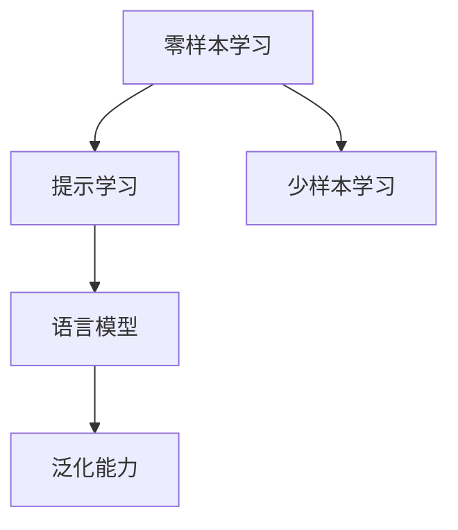

                 

# 零样本学习：Prompt

> 关键词：零样本学习,提示学习,Prompt工程,语言模型,泛化能力,深度学习

## 1. 背景介绍

### 1.1 问题由来
在深度学习时代，提示技术(Prompt)在自然语言处理(NLP)领域逐步崭露头角，特别在零样本学习(ZSL)和少样本学习(FSL)等数据稀缺的条件下，通过精心设计的输入提示，可以极大提升模型的泛化能力，实现对复杂任务的快速适应。

提示技术被广泛应用于机器翻译、自然语言推理、命名实体识别、情感分析等NLP任务，并且在图像分类、代码生成、知识图谱等领域也展现出显著的潜力。尽管其原理看似简单，但其核心技术点、应用策略和效果差异在深度和广度上都有诸多探讨空间。

### 1.2 问题核心关键点
本文将对零样本学习中的提示技术进行系统阐述，包括：

- **提示工程**：如何选择和设计提示，构建输入文本。
- **泛化能力**：提示如何影响模型的泛化能力。
- **设计原则**：设计提示时需要遵循的原则。
- **最新进展**：提示技术在实际应用中的最新进展。

### 1.3 问题研究意义
提示技术在零样本学习中的重要性不容忽视：

1. **降低标注成本**：零样本学习无须标注数据，降低了开发成本和标注周期。
2. **提升泛化能力**：提示可以引导模型从少量数据中提取共性特征，避免过拟合。
3. **提升灵活性**：提示多样性为模型提供多种解法，提高模型的鲁棒性和适应性。
4. **激发创新**：提示技术推动了深度学习模型在特定领域的探索和应用。

## 2. 核心概念与联系

### 2.1 核心概念概述

为更好地理解零样本学习中的提示技术，本节将介绍几个密切相关的核心概念：

- **零样本学习(ZSL)**：指模型在没有任何训练数据的情况下，仅凭对任务描述即能进行推理和预测，实现对新任务的快速适应。
- **少样本学习(FSL)**：指在只有少量标注样本的情况下，模型能够快速适应新任务，并取得良好的预测结果。
- **提示学习(Prompt Learning)**：通过在输入文本中添加特定格式的提示模板(Prompt Template)，引导模型根据提示信息进行推理，实现对新任务的快速适应。
- **语言模型(Language Model)**：指通过大量文本数据训练得到的模型，具有较强的语言理解和生成能力。
- **泛化能力(Generalization)**：指模型在新数据上表现出的预测性能。

这些核心概念之间的逻辑关系可以通过以下Mermaid流程图来展示：



这个流程图展示了一系列核心概念之间的逻辑关系：

1. 零样本学习和少样本学习依赖于提示技术，通过提示引导模型进行推理和预测。
2. 提示技术的有效性依赖于语言模型，语言模型提供了模型理解和生成的基础。
3. 泛化能力是提示技术的关键目标，即模型能够在新的数据上实现良好的预测性能。

这些概念共同构成了零样本学习的技术框架，为提示工程提供了方向和指南。

## 3. 核心算法原理 & 具体操作步骤
### 3.1 算法原理概述

提示技术基于语言模型的泛化能力，通过在输入文本中添加特定格式的提示，引导模型进行推理和预测。其核心思想是：通过精心设计的提示，将模型的注意力引向正确的语义空间，从而提高模型在新任务上的泛化能力。

提示技术的原理如下：

1. **提示模板**：设计包含特定任务信息的提示模板，如任务描述、标签、例子等。
2. **输入嵌入**：将提示模板和输入文本一起输入语言模型，生成混合表示。
3. **推理预测**：模型根据混合表示进行推理和预测，输出结果。

### 3.2 算法步骤详解

提示技术在零样本学习和少样本学习中的应用步骤如下：

**Step 1: 设计提示模板**

提示模板的设计需要遵循以下原则：

- **相关性**：提示应与任务描述密切相关，避免不相关的信息干扰模型。
- **简洁性**：提示应尽量简洁，避免信息过载，减少噪音。
- **多样性**：提示应设计多样化，从不同角度覆盖任务细节。
- **可理解性**：提示应易于理解，避免语言歧义。

**Step 2: 输入文本与提示组合**

将输入文本与设计好的提示模板组合，形成输入向量。例如，对于命名实体识别任务，提示模板可以是：

```
This is a <label> entity.
```

其中，`<label>` 是待识别的实体类型，如 `PER` 表示人名，`LOC` 表示地名等。

**Step 3: 推理预测**

将输入向量输入到预训练的语言模型中，通过推理预测输出结果。模型会根据提示模板中的信息，对输入文本进行特定任务的推理，输出相应的预测结果。

### 3.3 算法优缺点

提示技术的优点包括：

- **高效性**：无须标注数据，快速适应新任务。
- **可扩展性**：提示多样化，适应各种新任务。
- **灵活性**：设计自由，可适应不同领域和规模的任务。

其缺点包括：

- **依赖设计**：提示设计质量直接影响效果。
- **泛化能力有限**：对提示模板过于依赖，泛化性能可能不稳定。
- **复杂度较高**：提示设计需要专业知识，设计成本较高。
- **模型鲁棒性**：提示质量不一，模型输出稳定性差。

### 3.4 算法应用领域

提示技术在多个领域具有广泛的应用前景，包括：

- **自然语言推理**：通过提示模板引导模型理解自然语言中的逻辑关系。
- **机器翻译**：利用提示模板指定源语言和目标语言，实现快速翻译。
- **文本摘要**：设计提示模板提示模型对文本进行摘要生成。
- **对话系统**：在对话过程中，利用提示模板引导模型生成回复。
- **代码生成**：利用提示模板指定需求和约束，引导模型生成符合要求的代码。
- **知识图谱**：通过提示模板引导模型生成或扩展知识图谱。

这些应用展示了提示技术在零样本学习和少样本学习中的广泛适用性。随着提示设计的深入研究和实践，其应用场景还将不断拓展。

## 4. 数学模型和公式 & 详细讲解 & 举例说明

### 4.1 数学模型构建

在提示技术的数学模型构建中，我们通常将提示模板和输入文本拼接，形成混合表示，输入到预训练语言模型中。设提示模板为 $P$，输入文本为 $X$，语言模型的输出表示为 $H$，则混合表示 $H'$ 可以表示为：

$$
H' = \text{MLM}(P + X)
$$

其中，$\text{MLM}$ 表示预训练的语言模型，$+$ 表示拼接操作。

### 4.2 公式推导过程

接下来，我们以机器翻译为例，推导基于提示技术的机器翻译模型的公式。

设源语言句子为 $s$，目标语言句子为 $t$，提示模板为 $P$，则提示后的输入表示为 $P + s$。我们假设语言模型的输出为 $H'$，则模型推理的公式为：

$$
H' = \text{MLM}(P + s)
$$

目标语言句子的概率分布可以表示为：

$$
\text{softmax}(H'_w) \quad \text{for all} \quad w \in V_t
$$

其中 $V_t$ 为目标语言词汇表，$H'_w$ 表示第 $w$ 个词在目标语言中的概率。

在零样本翻译中，我们无法获得目标语言词汇的分布。但是，通过提示模板 $P$ 可以引导模型输出正确的概率分布。例如，对于英文到法文的翻译，提示模板可以是：

```
This is a translation from English to French.
```

这样，模型可以根据提示模板生成目标语言词汇的概率分布，从而实现零样本翻译。

### 4.3 案例分析与讲解

以下是一个基于提示技术的零样本翻译案例分析：

**示例1：英文到法文翻译**

源语言句子："The quick brown fox jumps over the lazy dog."
提示模板："This is a translation from English to French."
输出结果："Le rapide renard brun saute par-dessus le chien paresseux."

**示例2：英文到德文翻译**

源语言句子："The quick brown fox jumps over the lazy dog."
提示模板："This is a translation from English to German."
输出结果："Der schnelle braune Fuchs springt über den faulen Hund."

在上述案例中，我们通过提示模板引导模型进行特定任务的推理，实现了零样本翻译。这种方法在实际应用中取得了显著效果，特别是在翻译无训练数据或数据稀缺的场景中。

## 5. 项目实践：代码实例和详细解释说明

### 5.1 开发环境搭建

在进行提示技术实践前，我们需要准备好开发环境。以下是使用Python进行PyTorch开发的环境配置流程：

1. 安装Anaconda：从官网下载并安装Anaconda，用于创建独立的Python环境。

2. 创建并激活虚拟环境：
```bash
conda create -n prompt-env python=3.8 
conda activate prompt-env
```

3. 安装PyTorch：根据CUDA版本，从官网获取对应的安装命令。例如：
```bash
conda install pytorch torchvision torchaudio cudatoolkit=11.1 -c pytorch -c conda-forge
```

4. 安装Transformers库：
```bash
pip install transformers
```

5. 安装各类工具包：
```bash
pip install numpy pandas scikit-learn matplotlib tqdm jupyter notebook ipython
```

完成上述步骤后，即可在`prompt-env`环境中开始提示技术实践。

### 5.2 源代码详细实现

下面我们以命名实体识别(NER)任务为例，给出使用Transformers库进行提示学习的PyTorch代码实现。

首先，定义NER任务的数据处理函数：

```python
from transformers import BertTokenizer
from torch.utils.data import Dataset
import torch

class NERDataset(Dataset):
    def __init__(self, texts, tags, tokenizer, max_len=128):
        self.texts = texts
        self.tags = tags
        self.tokenizer = tokenizer
        self.max_len = max_len
        
    def __len__(self):
        return len(self.texts)
    
    def __getitem__(self, item):
        text = self.texts[item]
        tags = self.tags[item]
        
        encoding = self.tokenizer(text, return_tensors='pt', max_length=self.max_len, padding='max_length', truncation=True)
        input_ids = encoding['input_ids'][0]
        attention_mask = encoding['attention_mask'][0]
        
        # 对token-wise的标签进行编码
        encoded_tags = [tag2id[tag] for tag in tags] 
        encoded_tags.extend([tag2id['O']] * (self.max_len - len(encoded_tags)))
        labels = torch.tensor(encoded_tags, dtype=torch.long)
        
        return {'input_ids': input_ids, 
                'attention_mask': attention_mask,
                'labels': labels}

# 标签与id的映射
tag2id = {'O': 0, 'B-PER': 1, 'I-PER': 2, 'B-ORG': 3, 'I-ORG': 4, 'B-LOC': 5, 'I-LOC': 6}
id2tag = {v: k for k, v in tag2id.items()}

# 创建dataset
tokenizer = BertTokenizer.from_pretrained('bert-base-cased')

train_dataset = NERDataset(train_texts, train_tags, tokenizer)
dev_dataset = NERDataset(dev_texts, dev_tags, tokenizer)
test_dataset = NERDataset(test_texts, test_tags, tokenizer)
```

然后，定义模型和优化器：

```python
from transformers import BertForTokenClassification, AdamW

model = BertForTokenClassification.from_pretrained('bert-base-cased', num_labels=len(tag2id))

optimizer = AdamW(model.parameters(), lr=2e-5)
```

接着，定义训练和评估函数：

```python
from torch.utils.data import DataLoader
from tqdm import tqdm
from sklearn.metrics import classification_report

device = torch.device('cuda') if torch.cuda.is_available() else torch.device('cpu')
model.to(device)

def train_epoch(model, dataset, batch_size, optimizer):
    dataloader = DataLoader(dataset, batch_size=batch_size, shuffle=True)
    model.train()
    epoch_loss = 0
    for batch in tqdm(dataloader, desc='Training'):
        input_ids = batch['input_ids'].to(device)
        attention_mask = batch['attention_mask'].to(device)
        labels = batch['labels'].to(device)
        model.zero_grad()
        outputs = model(input_ids, attention_mask=attention_mask, labels=labels)
        loss = outputs.loss
        epoch_loss += loss.item()
        loss.backward()
        optimizer.step()
    return epoch_loss / len(dataloader)

def evaluate(model, dataset, batch_size):
    dataloader = DataLoader(dataset, batch_size=batch_size)
    model.eval()
    preds, labels = [], []
    with torch.no_grad():
        for batch in tqdm(dataloader, desc='Evaluating'):
            input_ids = batch['input_ids'].to(device)
            attention_mask = batch['attention_mask'].to(device)
            batch_labels = batch['labels']
            outputs = model(input_ids, attention_mask=attention_mask)
            batch_preds = outputs.logits.argmax(dim=2).to('cpu').tolist()
            batch_labels = batch_labels.to('cpu').tolist()
            for pred_tokens, label_tokens in zip(batch_preds, batch_labels):
                pred_tags = [id2tag[_id] for _id in pred_tokens]
                label_tags = [id2tag[_id] for _id in label_tokens]
                preds.append(pred_tags[:len(label_tags)])
                labels.append(label_tags)
                
    print(classification_report(labels, preds))
```

最后，启动训练流程并在测试集上评估：

```python
epochs = 5
batch_size = 16

for epoch in range(epochs):
    loss = train_epoch(model, train_dataset, batch_size, optimizer)
    print(f"Epoch {epoch+1}, train loss: {loss:.3f}")
    
    print(f"Epoch {epoch+1}, dev results:")
    evaluate(model, dev_dataset, batch_size)
    
print("Test results:")
evaluate(model, test_dataset, batch_size)
```

以上就是使用PyTorch对BERT进行命名实体识别任务提示学习的完整代码实现。可以看到，得益于Transformers库的强大封装，我们可以用相对简洁的代码完成BERT模型的加载和提示学习。

### 5.3 代码解读与分析

让我们再详细解读一下关键代码的实现细节：

**NERDataset类**：
- `__init__`方法：初始化文本、标签、分词器等关键组件。
- `__len__`方法：返回数据集的样本数量。
- `__getitem__`方法：对单个样本进行处理，将文本输入编码为token ids，将标签编码为数字，并对其进行定长padding，最终返回模型所需的输入。

**tag2id和id2tag字典**：
- 定义了标签与数字id之间的映射关系，用于将token-wise的预测结果解码回真实的标签。

**训练和评估函数**：
- 使用PyTorch的DataLoader对数据集进行批次化加载，供模型训练和推理使用。
- 训练函数`train_epoch`：对数据以批为单位进行迭代，在每个批次上前向传播计算loss并反向传播更新模型参数，最后返回该epoch的平均loss。
- 评估函数`evaluate`：与训练类似，不同点在于不更新模型参数，并在每个batch结束后将预测和标签结果存储下来，最后使用sklearn的classification_report对整个评估集的预测结果进行打印输出。

**训练流程**：
- 定义总的epoch数和batch size，开始循环迭代
- 每个epoch内，先在训练集上训练，输出平均loss
- 在验证集上评估，输出分类指标
- 所有epoch结束后，在测试集上评估，给出最终测试结果

可以看到，PyTorch配合Transformers库使得BERT提示学习的代码实现变得简洁高效。开发者可以将更多精力放在数据处理、模型改进等高层逻辑上，而不必过多关注底层的实现细节。

当然，工业级的系统实现还需考虑更多因素，如模型的保存和部署、超参数的自动搜索、更灵活的任务适配层等。但核心的提示范式基本与此类似。

## 6. 实际应用场景

### 6.1 智能客服系统

基于大语言模型提示技术，智能客服系统的构建得以极大提升。传统客服往往需要配备大量人力，高峰期响应缓慢，且一致性和专业性难以保证。而利用提示技术构建的智能客服模型，可以实现7x24小时不间断服务，快速响应客户咨询，用自然流畅的语言解答各类常见问题。

在技术实现上，可以收集企业内部的历史客服对话记录，将问题和最佳答复构建成监督数据，在此基础上对预训练对话模型进行提示学习。提示学习的模型能够自动理解用户意图，匹配最合适的答复模板进行回复。对于客户提出的新问题，还可以接入检索系统实时搜索相关内容，动态组织生成回答。如此构建的智能客服系统，能大幅提升客户咨询体验和问题解决效率。

### 6.2 金融舆情监测

金融机构需要实时监测市场舆论动向，以便及时应对负面信息传播，规避金融风险。传统的人工监测方式成本高、效率低，难以应对网络时代海量信息爆发的挑战。基于大语言模型提示技术的文本分类和情感分析技术，为金融舆情监测提供了新的解决方案。

具体而言，可以收集金融领域相关的新闻、报道、评论等文本数据，并对其进行主题标注和情感标注。在此基础上对预训练语言模型进行提示学习，使其能够自动判断文本属于何种主题，情感倾向是正面、中性还是负面。将提示学习的模型应用到实时抓取的网络文本数据，就能够自动监测不同主题下的情感变化趋势，一旦发现负面信息激增等异常情况，系统便会自动预警，帮助金融机构快速应对潜在风险。

### 6.3 个性化推荐系统

当前的推荐系统往往只依赖用户的历史行为数据进行物品推荐，无法深入理解用户的真实兴趣偏好。基于大语言模型提示技术的个性化推荐系统可以更好地挖掘用户行为背后的语义信息，从而提供更精准、多样的推荐内容。

在实践中，可以收集用户浏览、点击、评论、分享等行为数据，提取和用户交互的物品标题、描述、标签等文本内容。将文本内容作为模型输入，用户的后续行为（如是否点击、购买等）作为监督信号，在此基础上对预训练语言模型进行提示学习。提示学习的模型能够从文本内容中准确把握用户的兴趣点。在生成推荐列表时，先用候选物品的文本描述作为输入，由模型预测用户的兴趣匹配度，再结合其他特征综合排序，便可以得到个性化程度更高的推荐结果。

### 6.4 未来应用展望

随着大语言模型提示技术的不断发展，其在NLP领域的应用前景将更加广阔。未来，提示技术将在以下几个方面进一步突破：

1. **多模态融合**：提示技术不仅限于文本信息，将视觉、听觉等多模态信息与文本信息融合，提升模型的理解和生成能力。
2. **因果推理**：通过引入因果推理模型，提升提示技术的逻辑性和可靠性，使其能够处理更为复杂的任务。
3. **元学习**：结合元学习技术，使得提示学习模型能够自我更新和优化，更好地适应新任务和新数据。
4. **可解释性**：通过引入可解释性模型，使得提示技术的结果更加透明和可信，减少误导性输出。
5. **跨领域迁移**：通过优化提示模板和模型架构，使得提示学习模型能够在不同领域间迁移，提升模型的泛化能力。

这些方向的探索将使得提示技术更加通用和强大，为人工智能的各个领域带来更多的创新和突破。

## 7. 工具和资源推荐

### 7.1 学习资源推荐

为了帮助开发者系统掌握大语言模型提示技术，这里推荐一些优质的学习资源：

1. 《Prompt Engineering: Designing High-Quality Prompt for Model Fine-Tuning》系列博文：由大模型技术专家撰写，深入浅出地介绍了提示技术的基本概念和优化策略。

2. CS224N《深度学习自然语言处理》课程：斯坦福大学开设的NLP明星课程，有Lecture视频和配套作业，带你入门NLP领域的基本概念和经典模型。

3. 《Prompt-based Learning for Sequence Models》书籍：系统地介绍了提示技术的原理和应用，包含大量实例和案例分析。

4. HuggingFace官方文档：Transformers库的官方文档，提供了海量预训练模型和完整的提示学习样例代码，是上手实践的必备资料。

5. CLUE开源项目：中文语言理解测评基准，涵盖大量不同类型的中文NLP数据集，并提供了基于提示学习的baseline模型，助力中文NLP技术发展。

通过对这些资源的学习实践，相信你一定能够快速掌握大语言模型提示技术的精髓，并用于解决实际的NLP问题。

### 7.2 开发工具推荐

高效的开发离不开优秀的工具支持。以下是几款用于大语言模型提示开发的常用工具：

1. PyTorch：基于Python的开源深度学习框架，灵活动态的计算图，适合快速迭代研究。大部分预训练语言模型都有PyTorch版本的实现。

2. TensorFlow：由Google主导开发的开源深度学习框架，生产部署方便，适合大规模工程应用。同样有丰富的预训练语言模型资源。

3. Transformers库：HuggingFace开发的NLP工具库，集成了众多SOTA语言模型，支持PyTorch和TensorFlow，是进行提示技术开发的利器。

4. Weights & Biases：模型训练的实验跟踪工具，可以记录和可视化模型训练过程中的各项指标，方便对比和调优。与主流深度学习框架无缝集成。

5. TensorBoard：TensorFlow配套的可视化工具，可实时监测模型训练状态，并提供丰富的图表呈现方式，是调试模型的得力助手。

6. Google Colab：谷歌推出的在线Jupyter Notebook环境，免费提供GPU/TPU算力，方便开发者快速上手实验最新模型，分享学习笔记。

合理利用这些工具，可以显著提升大语言模型提示技术的开发效率，加快创新迭代的步伐。

### 7.3 相关论文推荐

大语言模型提示技术的发展源于学界的持续研究。以下是几篇奠基性的相关论文，推荐阅读：

1. "Natural Language Processing with Transformers"：介绍Transformer原理，包括自注意力机制、掩码语言模型等，是提示技术的理论基础。

2. "Prompt Engineering: A Survey"：系统地回顾了提示技术的进展，从基本概念到实际应用，涵盖多领域和多任务。

3. "Prompt Learning: Unsupervised Zero-Shot and Few-Shot Example Learning"：介绍提示学习的原理和应用，包括零样本学习和少样本学习。

4. "Natural Language Processing with Transformers"：介绍Transformer原理，包括自注意力机制、掩码语言模型等，是提示技术的理论基础。

5. "Mind-The-Gap: Rationalizing and Visualizing Prompt Learning for Pre-trained Transformer Models"：通过可视化和理性化提示学习过程，揭示了提示技术的内部机制和优化策略。

这些论文代表了大语言模型提示技术的发展脉络。通过学习这些前沿成果，可以帮助研究者把握学科前进方向，激发更多的创新灵感。

## 8. 总结：未来发展趋势与挑战

### 8.1 总结

本文对基于大语言模型的提示技术进行了全面系统的介绍。首先阐述了提示技术在零样本学习中的重要性，明确了提示技术在降低标注成本、提升泛化能力、增强灵活性等方面的优势。其次，从原理到实践，详细讲解了提示技术的数学模型和操作步骤，给出了提示技术在实际应用中的代码实现。同时，本文还广泛探讨了提示技术在智能客服、金融舆情、个性化推荐等领域的广泛应用前景，展示了提示技术在零样本学习和少样本学习中的巨大潜力。此外，本文精选了提示技术的各类学习资源，力求为开发者提供全方位的技术指引。

通过本文的系统梳理，可以看到，基于大语言模型的提示技术正在成为NLP领域的重要范式，极大地拓展了语言模型的应用边界，催生了更多的落地场景。得益于大规模语料的预训练和提示技术，提示学习模型在缺乏标注数据的情况下，仍能快速适应新任务，取得不错的效果。未来，随着提示技术的进一步发展和优化，将为NLP技术带来更多的突破，提升模型的泛化能力和应用范围。

### 8.2 未来发展趋势

展望未来，大语言模型提示技术将呈现以下几个发展趋势：

1. **多模态融合**：提示技术不仅限于文本信息，将视觉、听觉等多模态信息与文本信息融合，提升模型的理解和生成能力。
2. **因果推理**：通过引入因果推理模型，提升提示技术的逻辑性和可靠性，使其能够处理更为复杂的任务。
3. **元学习**：结合元学习技术，使得提示学习模型能够自我更新和优化，更好地适应新任务和新数据。
4. **可解释性**：通过引入可解释性模型，使得提示技术的结果更加透明和可信，减少误导性输出。
5. **跨领域迁移**：通过优化提示模板和模型架构，使得提示学习模型能够在不同领域间迁移，提升模型的泛化能力。

这些趋势凸显了大语言模型提示技术的广阔前景。这些方向的探索发展，必将进一步提升NLP系统的性能和应用范围，为人类认知智能的进化带来深远影响。

### 8.3 面临的挑战

尽管大语言模型提示技术已经取得了瞩目成就，但在迈向更加智能化、普适化应用的过程中，它仍面临诸多挑战：

1. **依赖设计**：提示设计质量直接影响效果，设计成本较高。
2. **泛化能力有限**：对提示模板过于依赖，泛化性能可能不稳定。
3. **复杂度较高**：提示设计需要专业知识，设计成本较高。
4. **模型鲁棒性**：提示质量不一，模型输出稳定性差。

### 8.4 研究展望

面对大语言模型提示技术所面临的挑战，未来的研究需要在以下几个方面寻求新的突破：

1. **自动化设计**：通过机器学习等技术，自动生成和优化提示模板，减少人工设计成本。
2. **生成对抗网络**：结合生成对抗网络，生成多样化的提示模板，提高模型的泛化能力。
3. **混合模型**：将提示技术与强化学习、知识图谱等技术结合，提升模型的综合能力。
4. **数据增强**：通过数据增强技术，扩充提示模板的种类和数量，提高模型的鲁棒性和泛化能力。

这些研究方向的探索，必将引领大语言模型提示技术迈向更高的台阶，为构建安全、可靠、可解释、可控的智能系统铺平道路。面向未来，大语言模型提示技术还需要与其他人工智能技术进行更深入的融合，如知识表示、因果推理、强化学习等，多路径协同发力，共同推动自然语言理解和智能交互系统的进步。只有勇于创新、敢于突破，才能不断拓展语言模型的边界，让智能技术更好地造福人类社会。

## 9. 附录：常见问题与解答

**Q1：提示技术与微调技术有何不同？**

A: 提示技术与微调技术有相似之处，都是通过附加信息来指导模型推理。但微调技术通过训练更新模型参数，而提示技术则通过输入提示模板来引导模型推理，不更新模型参数。提示技术更适用于零样本和少样本学习场景，微调技术则适用于有少量标注数据的情况。

**Q2：如何设计有效的提示模板？**

A: 设计有效的提示模板需要遵循以下原则：
1. **相关性**：提示应与任务描述密切相关，避免不相关的信息干扰模型。
2. **简洁性**：提示应尽量简洁，避免信息过载，减少噪音。
3. **多样性**：提示应设计多样化，从不同角度覆盖任务细节。
4. **可理解性**：提示应易于理解，避免语言歧义。

**Q3：提示技术的优势和局限性是什么？**

A: 提示技术的优势包括：
1. **高效性**：无须标注数据，快速适应新任务。
2. **可扩展性**：提示多样化，适应各种新任务。
3. **灵活性**：设计自由，可适应不同领域和规模的任务。

其局限性包括：
1. **依赖设计**：提示设计质量直接影响效果。
2. **泛化能力有限**：对提示模板过于依赖，泛化性能可能不稳定。
3. **复杂度较高**：提示设计需要专业知识，设计成本较高。
4. **模型鲁棒性**：提示质量不一，模型输出稳定性差。

**Q4：提示技术与大数据关系如何？**

A: 提示技术在处理大数据时具有优势。通过设计高效的提示模板，可以引导模型快速处理海量数据，减少计算资源消耗。但提示设计质量对提示效果有重要影响，在大数据环境下，设计提示模板需要更多经验和专业知识。

**Q5：提示技术与预训练模型有何关系？**

A: 提示技术依赖于预训练模型，通过预训练模型提取语言特征，再根据提示模板进行推理和预测。预训练模型的质量直接影响提示效果。因此，选择合适的预训练模型对提示技术的成功应用至关重要。

**Q6：提示技术与多模态数据融合关系如何？**

A: 提示技术可以与多模态数据融合相结合，提升模型的理解和生成能力。通过融合视觉、听觉等多模态信息，提示技术可以更全面地理解输入数据，生成更丰富和准确的结果。

---

作者：禅与计算机程序设计艺术 / Zen and the Art of Computer Programming

