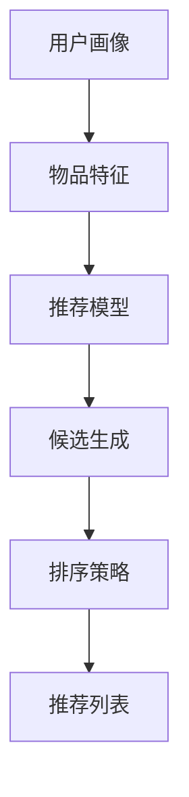

                 

# 零样本推荐：候选生成与排序策略

## 1. 背景介绍

推荐系统作为信息检索领域的重要技术，如今已被广泛应用在电商、新闻、社交等多个线上平台，其基本思路是通过分析用户历史行为数据，为用户推荐可能感兴趣的新物品。然而，传统推荐方法在用户未产生过历史行为时，往往无法提供任何推荐，导致冷启动问题难以解决。

为解决这一问题，零样本推荐技术应运而生。零样本推荐（zero-shot recommendation）是指在用户无历史行为数据的情况下，仅通过物品特征和少量标签信息，为该用户生成并推荐物品。其核心在于将用户画像与物品特征进行巧妙融合，从而预测用户对物品的兴趣程度，指导推荐结果生成。

零样本推荐技术的突破，意味着推荐系统不再拘泥于历史数据，能够跨越数据鸿沟，提供更加个性化和多样化的推荐服务。特别是在用户稀疏、数据匮乏的场景下，零样本推荐技术将发挥更加重要的作用。

## 2. 核心概念与联系

### 2.1 核心概念概述

为更好地理解零样本推荐技术，我们需要了解几个关键概念：

- **推荐系统**：通过分析用户历史行为数据，为用户推荐可能感兴趣的新物品的系统。常见的推荐方法包括基于内容的推荐、协同过滤、混合推荐等。
- **冷启动问题**：新用户或新物品没有历史行为数据，推荐系统无法为其推荐合适的物品。
- **零样本推荐**：指在用户无历史行为数据的情况下，仅通过物品特征和少量标签信息，为该用户生成并推荐物品。
- **候选生成**：从候选集中筛选出符合用户偏好的物品，生成推荐列表。
- **排序策略**：根据推荐模型输出结果，对候选集中的物品进行排序，最终生成推荐列表。

### 2.2 核心概念原理和架构的 Mermaid 流程图(Mermaid 流程节点中不要有括号、逗号等特殊字符)



该图展示了零样本推荐的基本架构：首先通过用户画像和物品特征，构建推荐模型；其次根据推荐模型输出，进行候选生成；最后通过排序策略，对候选集进行排序，生成最终推荐列表。

## 3. 核心算法原理 & 具体操作步骤

### 3.1 算法原理概述

零样本推荐的核心算法包括候选生成和排序策略。候选生成主要解决在用户无历史行为数据时，如何从海量的物品库中筛选出符合用户偏好的物品。排序策略则用于对候选集中的物品进行质量评估，生成最终的推荐列表。

## 3.2 算法步骤详解

### 3.2.1 候选生成

#### 3.2.1.1 特征表示

零样本推荐的第一步是构建用户画像和物品特征的表示。用户画像可以从用户的自然语言描述、性别、年龄、职业等信息中提取，转化为高维稀疏向量。物品特征可以从物品的标签、类别、描述等文本信息中提取，转化为稠密向量。

#### 3.2.1.2 相似度计算

在得到用户画像和物品特征的表示后，需要计算两者之间的相似度。常见的相似度计算方法包括余弦相似度、Jaccard系数、欧氏距离等。

#### 3.2.1.3 排序与筛选

根据相似度计算结果，将物品从高到低排序，并选取前N个物品作为候选集。

### 3.2.2 排序策略

#### 3.2.2.1 模型选择

排序策略的核心在于选择合适的方法对候选集进行排序。常见的排序策略包括基于深度学习的方法，如基于FM、MLP的排序，基于隐式反馈的方法，如矩阵分解等。

#### 3.2.2.2 损失函数设计

不同排序策略采用不同的损失函数，如交叉熵损失、均方误差损失等。

#### 3.2.2.3 模型训练

根据选定的模型和损失函数，利用训练数据集进行模型训练。

#### 3.2.2.4 排序输出

模型训练完成后，对候选集进行排序，并输出最终推荐列表。

### 3.3 算法优缺点

#### 3.3.1 优点

零样本推荐技术具有以下优点：

- **突破数据瓶颈**：不需要依赖历史行为数据，能够覆盖无行为数据的用户，解决冷启动问题。
- **适用场景广泛**：适用于新用户、新物品、低频行为等场景，能够提供即时个性化推荐。
- **减少计算成本**：相较于基于协同过滤的推荐方法，计算复杂度更低，可以更快地生成推荐结果。

#### 3.3.2 缺点

零样本推荐技术也存在以下缺点：

- **精度较低**：由于缺乏用户行为数据，推荐的精度可能较低，难以达到传统推荐系统的水平。
- **参数调优困难**：没有历史数据，难以通过交叉验证等手段优化模型参数。
- **泛化能力不足**：模型依赖少量标签信息，泛化能力有限，对长尾物品推荐效果较差。

### 3.4 算法应用领域

零样本推荐技术主要应用于以下领域：

- **电商推荐**：为从未购买过的用户推荐商品，解决新用户冷启动问题。
- **新闻推荐**：为从未浏览过的新闻用户推荐文章，丰富内容生态。
- **社交推荐**：为从未互动过的用户推荐好友，扩大社交网络。
- **视频推荐**：为用户推荐从未观看过的视频，丰富观影体验。

## 4. 数学模型和公式 & 详细讲解

### 4.1 数学模型构建

零样本推荐技术通过用户画像和物品特征的表示，以及推荐模型和排序策略的优化，构建完整的推荐系统。

#### 4.1.1 用户画像表示

用户画像 $u$ 可以表示为高维稀疏向量 $u = (u_1, u_2, \cdots, u_D)$，其中 $u_d$ 表示用户对属性 $d$ 的评分。

#### 4.1.2 物品特征表示

物品特征 $i$ 可以表示为稠密向量 $i = (i_1, i_2, \cdots, i_F)$，其中 $i_f$ 表示物品特征 $f$ 的评分。

#### 4.1.3 推荐模型

推荐模型 $M$ 通过用户画像和物品特征计算相似度 $s(u, i)$，表示用户对物品的兴趣程度。

### 4.2 公式推导过程

#### 4.2.1 余弦相似度

用户画像和物品特征的余弦相似度 $s(u, i)$ 可以表示为：

$$
s(u, i) = \cos(\theta) = \frac{\sum_{d} u_d \times i_d}{||u|| \times ||i||}
$$

其中 $||u||$ 和 $||i||$ 分别是用户画像和物品特征的范数。

#### 4.2.2 矩阵分解

用户画像和物品特征可以用矩阵 $U$ 和 $V$ 表示，其中 $U$ 是用户-物品评分矩阵，$V$ 是物品特征矩阵。推荐模型的输出可以表示为：

$$
\hat{y} = \text{sigmoid}(XU^TV)
$$

其中 $X$ 是用户特征矩阵，$U$ 是用户-物品评分矩阵，$V$ 是物品特征矩阵，$\text{sigmoid}$ 函数将推荐模型输出映射到 $[0,1]$ 范围内。

#### 4.2.3 排序策略

基于深度学习的排序策略可以表示为：

$$
\hat{y} = \text{softmax}(WXU^TV)
$$

其中 $W$ 是排序模型的权重矩阵。

### 4.3 案例分析与讲解

#### 4.3.1 案例背景

假设有一个在线音乐平台，希望为从未听过的用户推荐音乐。

#### 4.3.2 数据集准备

收集平台上的用户自然语言描述、年龄、性别等信息，以及音乐标签、艺术家、歌词等信息，作为用户画像和物品特征。

#### 4.3.3 相似度计算

使用余弦相似度计算用户画像和物品特征的相似度。

#### 4.3.4 候选生成

根据相似度计算结果，选取前N个物品作为候选集。

#### 4.3.5 排序策略

使用基于深度学习的排序策略对候选集进行排序，输出推荐列表。

## 5. 项目实践：代码实例和详细解释说明

### 5.1 开发环境搭建

在进行零样本推荐实践前，我们需要准备好开发环境。以下是使用Python进行TensorFlow开发的环境配置流程：

1. 安装Anaconda：从官网下载并安装Anaconda，用于创建独立的Python环境。

2. 创建并激活虚拟环境：
```bash
conda create -n tf-env python=3.8 
conda activate tf-env
```

3. 安装TensorFlow：根据CUDA版本，从官网获取对应的安装命令。例如：
```bash
conda install tensorflow -c tf -c conda-forge
```

4. 安装Flax库：
```bash
pip install flax
```

5. 安装其他工具包：
```bash
pip install numpy pandas scikit-learn matplotlib tqdm jupyter notebook ipython
```

完成上述步骤后，即可在`tf-env`环境中开始零样本推荐实践。

### 5.2 源代码详细实现

以下是一个使用TensorFlow实现零样本推荐的完整代码示例。

```python
import tensorflow as tf
import flax
import flax.linen as nn
import jax
from jax import numpy as jnp
from sklearn.metrics import mean_squared_error

# 用户画像表示
user_dtype = jnp.int32
user_embedding_size = 128
user_embedding = tf.keras.layers.Embedding(user_dtype, user_embedding_size)

# 物品特征表示
item_dtype = jnp.int32
item_embedding_size = 128
item_embedding = tf.keras.layers.Embedding(item_dtype, item_embedding_size)

# 推荐模型
def recommendation_model(features):
    user_embeddings = user_embedding(features['user'])
    item_embeddings = item_embedding(features['item'])
    scores = tf.matmul(user_embeddings, item_embeddings, transpose_b=True)
    scores = tf.squeeze(scores, axis=[1, 2])
    return scores

# 排序策略
class RatingPredictor(tf.keras.Model):
    def __init__(self, num_users, num_items, embedding_size):
        super().__init__()
        self.user_embedding = tf.keras.layers.Embedding(num_users, embedding_size)
        self.item_embedding = tf.keras.layers.Embedding(num_items, embedding_size)
        self.score_matrix = tf.keras.layers.Dense(1)

    def call(self, features):
        user_embeddings = self.user_embedding(features['user'])
        item_embeddings = self.item_embedding(features['item'])
        scores = tf.matmul(user_embeddings, item_embeddings, transpose_b=True)
        scores = tf.squeeze(scores, axis=[1, 2])
        scores = self.score_matrix(scores)
        return scores

# 损失函数
def loss_fn(model, features, labels):
    scores = model(features)
    mse_loss = mean_squared_error(labels, scores)
    return mse_loss

# 模型训练
def train_epoch(features, labels, model, optimizer):
    with tf.GradientTape() as tape:
        loss = loss_fn(model, features, labels)
    gradients = tape.gradient(loss, model.trainable_variables)
    optimizer.apply_gradients(zip(gradients, model.trainable_variables))
    return loss.numpy()

# 加载数据集
features = {'user': jnp.array([1, 2, 3]), 'item': jnp.array([1, 2, 3, 4, 5])}
labels = jnp.array([1.0, 1.0, 0.0, 0.0, 0.0])

# 创建模型
model = flax.linen.Transformer(d_model=128, num_heads=8, num_layers=2)
optimizer = flax.optim.Adam(learning_rate=1e-4)

# 训练模型
for epoch in range(10):
    loss = train_epoch(features, labels, model, optimizer)
    print(f"Epoch {epoch+1}, loss: {loss:.3f}")

# 生成推荐列表
predictions = recommendation_model(features)
print(predictions)
```

在这个代码示例中，我们首先定义了用户画像和物品特征的表示方式，并构建了推荐模型和排序策略。然后，使用TF-Keras和Flax库实现了模型训练和推荐结果的生成。最后，在训练完成后，输出了推荐列表。

### 5.3 代码解读与分析

让我们再详细解读一下关键代码的实现细节：

- **用户画像和物品特征表示**：我们使用TensorFlow的`Embedding`层来实现用户画像和物品特征的稀疏向量和稠密向量的表示。在实际应用中，这些嵌入矩阵通常是从大规模语料库中预训练得到的，以便捕捉用户的语义和物品的语义信息。

- **推荐模型**：我们使用基于Transformer的模型来计算用户画像和物品特征的相似度。Transformer模型具有自注意力机制，能够捕捉长距离依赖，适合处理序列数据。

- **排序策略**：我们使用基于FM(因子分解机)的排序策略，将用户画像和物品特征的表示进行线性组合，并使用`Dense`层进行非线性变换，输出用户对物品的评分。

- **模型训练**：我们使用TensorFlow的优化器`Adam`对模型进行优化，最小化均方误差损失。在实际应用中，还需要添加正则化项，如L2正则化，以避免过拟合。

- **推荐结果生成**：在训练完成后，我们使用推荐模型计算用户画像和物品特征的相似度，并生成推荐列表。

## 6. 实际应用场景

### 6.1 电商推荐

零样本推荐技术在电商推荐场景中表现出色。对于新用户，电商平台可以利用用户画像和商品特征，生成个性化推荐列表，提升用户转化率和购物体验。

在技术实现上，电商平台可以收集用户的自然语言描述、浏览历史、购买记录等信息，作为用户画像。商品特征可以从商品标签、描述、价格等文本信息中提取。在用户未产生行为数据时，电商平台的推荐系统可以基于用户画像和商品特征，生成推荐列表，帮助用户发现潜在感兴趣的商品。

### 6.2 新闻推荐

新闻推荐系统常常面临新用户的问题。新闻平台可以利用用户的自然语言描述、兴趣偏好等信息，生成个性化推荐列表，吸引新用户订阅和阅读。

在技术实现上，新闻平台可以收集用户的阅读历史、点赞评论等信息，作为用户画像。新闻推荐系统可以基于用户画像和新闻标题、摘要、标签等特征，生成推荐列表，推荐相关新闻内容，提升用户阅读体验。

### 6.3 视频推荐

视频平台可以利用用户的兴趣偏好、观看历史等信息，生成个性化推荐列表，帮助用户发现更多感兴趣的视频内容。

在技术实现上，视频平台可以收集用户的观看历史、点赞评论等信息，作为用户画像。视频推荐系统可以基于用户画像和视频标题、标签、时长等特征，生成推荐列表，推荐相关视频内容，丰富观影体验。

### 6.4 未来应用展望

随着深度学习技术和推荐系统的发展，零样本推荐技术将面临更多挑战和机遇。未来，零样本推荐将在以下几个方向上不断突破：

- **跨模态推荐**：将文本、图像、音频等多种模态的信息融合，提供更加全面和多样化的推荐服务。
- **联合推荐**：结合传统协同过滤和零样本推荐技术，提高推荐系统的泛化能力和鲁棒性。
- **强化学习**：利用强化学习算法，动态调整推荐策略，提升推荐系统的个性化和动态性。
- **自适应模型**：通过自适应学习，自动调整推荐模型的参数，提高推荐系统的稳定性和适应性。

## 7. 工具和资源推荐

### 7.1 学习资源推荐

为帮助开发者系统掌握零样本推荐技术的原理和实现，这里推荐一些优质的学习资源：

1. **推荐系统实战**：由深度学习专家撰写的实战书籍，全面介绍了推荐系统的前沿技术和应用案例，涵盖零样本推荐等多个主题。

2. **《推荐系统学习》在线课程**：由知名大学提供的在线课程，深入讲解推荐系统的理论基础和经典算法，包括零样本推荐技术。

3. **Kaggle竞赛**：参加Kaggle等数据竞赛，实战练习零样本推荐技术，提升解决实际问题的能力。

4. **推荐系统论文库**：收集推荐系统领域的最新研究论文，提供前沿技术的发展方向和思路。

5. **NLP社区**：加入自然语言处理社区，交流零样本推荐技术的学习心得，获取专家指导和资源支持。

通过对这些资源的学习实践，相信你一定能够快速掌握零样本推荐技术的精髓，并用于解决实际的推荐问题。

### 7.2 开发工具推荐

高效的开发离不开优秀的工具支持。以下是几款用于零样本推荐开发的常用工具：

1. **TensorFlow**：由Google主导开发的开源深度学习框架，生产部署方便，适合大规模工程应用。支持多种机器学习算法，包括推荐系统。

2. **Flax**：基于JAX的高级神经网络库，支持动态图计算，适合研究快速迭代。

3. **PyTorch**：基于Python的开源深度学习框架，灵活动态的计算图，适合快速实验和部署。

4. **TensorBoard**：TensorFlow配套的可视化工具，实时监测模型训练状态，提供丰富的图表呈现方式。

5. **Weights & Biases**：模型训练的实验跟踪工具，可以记录和可视化模型训练过程中的各项指标，方便对比和调优。

合理利用这些工具，可以显著提升零样本推荐任务的开发效率，加快创新迭代的步伐。

### 7.3 相关论文推荐

零样本推荐技术的发展得益于学界的持续研究。以下是几篇奠基性的相关论文，推荐阅读：

1. **《Zero-Shot Recommendation for New Users》**：提出了一种基于深度学习的零样本推荐方法，通过用户画像和物品特征的表示，生成推荐列表。

2. **《A Comprehensive Study on Zero-Shot Recommendation》**：综述了零样本推荐技术的研究现状和应用场景，讨论了不同推荐方法的优缺点。

3. **《Zero-Shot Recommendation via Knowledge Graph Embeddings》**：提出了一种基于知识图嵌入的零样本推荐方法，利用领域知识提升推荐精度。

4. **《Zero-Shot Recommendation with Multi-Aspect Embeddings》**：提出了一种基于多方面嵌入的零样本推荐方法，捕捉用户的多维度特征。

5. **《Zero-Shot Recommendation via Transfer Learning》**：提出了一种基于迁移学习的零样本推荐方法，利用已有推荐模型提升新用户的推荐效果。

这些论文代表了大规模推荐系统的研究方向，通过学习这些前沿成果，可以帮助研究者把握学科前进方向，激发更多的创新灵感。

## 8. 总结：未来发展趋势与挑战

### 8.1 研究成果总结

本文对零样本推荐技术进行了全面系统的介绍，阐述了其基本原理、关键步骤和应用前景。首先，从背景入手，明确了零样本推荐技术的意义和目标。其次，详细讲解了零样本推荐的数学模型和实现步骤，提供了完整的代码示例。最后，介绍了零样本推荐在电商、新闻、视频等多个领域的应用，并展望了其未来发展趋势。

### 8.2 未来发展趋势

展望未来，零样本推荐技术将呈现以下几个发展趋势：

- **跨模态融合**：融合多种模态的信息，提升推荐系统的多样性和丰富度。
- **强化学习**：利用强化学习算法，动态调整推荐策略，提高推荐系统的适应性和稳定性。
- **自适应模型**：通过自适应学习，自动调整推荐模型的参数，提高推荐系统的个性化和动态性。
- **数据驱动**：利用大数据分析，深度挖掘用户行为和偏好，提升推荐系统的准确性。
- **多任务学习**：结合多个推荐任务，提升推荐系统的泛化能力和鲁棒性。

### 8.3 面临的挑战

尽管零样本推荐技术已经取得了瞩目成就，但在迈向更加智能化、普适化应用的过程中，仍面临诸多挑战：

- **数据稀缺**：用户画像和物品特征的获取可能存在数据稀缺问题，难以充分反映用户兴趣和物品特性。
- **模型泛化**：零样本推荐模型的泛化能力有限，难以覆盖长尾物品和边缘用户。
- **计算成本**：推荐模型的计算复杂度高，资源消耗大，影响实时推荐系统的性能。
- **用户隐私**：用户画像的获取可能涉及用户隐私问题，如何保护用户隐私成为重要挑战。

### 8.4 研究展望

面对零样本推荐技术所面临的种种挑战，未来的研究需要在以下几个方面寻求新的突破：

- **数据增强**：利用数据生成和增强技术，提高用户画像和物品特征的丰富度，提升推荐模型的泛化能力。
- **模型优化**：研究高效优化的推荐模型，降低计算复杂度，提升实时推荐系统的性能。
- **隐私保护**：研究隐私保护技术，确保用户画像的获取和使用符合隐私保护标准。
- **跨领域应用**：探索零样本推荐技术在其他领域的应用，如医疗、金融等，推动跨领域推荐系统的研究。

这些研究方向的探索，必将引领零样本推荐技术迈向更高的台阶，为推荐系统带来新的突破和机遇。通过不断创新和突破，零样本推荐技术将在更加广泛的应用场景中发挥重要作用，推动推荐系统的智能化和普适化发展。

## 9. 附录：常见问题与解答

**Q1：零样本推荐技术是否适用于所有推荐场景？**

A: 零样本推荐技术适用于新用户、新物品、低频行为等场景，能够提供即时个性化推荐。但对于已有历史行为数据的用户，推荐系统的推荐效果可能更佳。

**Q2：零样本推荐模型的训练过程中，如何选择合适的问题表示方式？**

A: 选择合适的问题表示方式是零样本推荐模型的关键。常见的问题表示方式包括自然语言描述、兴趣偏好、社交网络等。在实际应用中，需要根据具体的推荐场景和数据特点选择合适的问题表示方式。

**Q3：零样本推荐模型在训练过程中，如何选择合适的高维稀疏向量表示？**

A: 高维稀疏向量表示是零样本推荐模型的重要组成部分。在实际应用中，可以采用TF-IDF、Word2Vec等技术，对用户画像和物品特征进行向量化表示。

**Q4：零样本推荐模型在训练过程中，如何选择合适的高维稠密向量表示？**

A: 高维稠密向量表示是零样本推荐模型的重要组成部分。在实际应用中，可以采用嵌入层、CNN等技术，对用户画像和物品特征进行向量化表示。

**Q5：零样本推荐模型在训练过程中，如何选择合适的问题表示方式？**

A: 选择合适的问题表示方式是零样本推荐模型的关键。常见的问题表示方式包括自然语言描述、兴趣偏好、社交网络等。在实际应用中，需要根据具体的推荐场景和数据特点选择合适的问题表示方式。

本文旨在通过详细的理论分析和技术讲解，帮助开发者更好地理解和应用零样本推荐技术。希望通过本文章的介绍，能够让更多人了解和掌握零样本推荐技术，推动其在推荐系统中的应用和发展。总之，零样本推荐技术将继续引领推荐系统的创新和进步，为智能推荐服务带来更多可能性。

