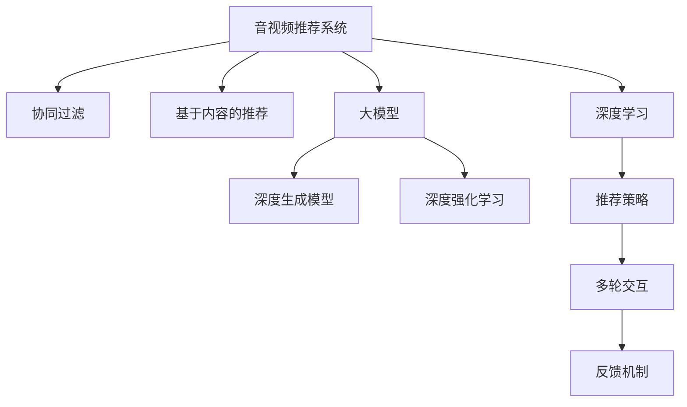

                 

# 音视频内容推荐：大模型理解与匹配

> 关键词：音视频推荐系统, 大模型, 内容匹配, 用户兴趣, 协同过滤, 深度学习, 深度生成模型, 强化学习

## 1. 背景介绍

### 1.1 问题由来

在互联网时代，音视频内容的海量增长使得用户在面对海量的内容时无从下手。如何精准地为用户推荐其感兴趣的内容，成为了各大互联网公司亟待解决的问题。传统的音视频推荐系统，往往依赖于用户的评分数据，结合协同过滤、基于内容的推荐等方法，推荐内容。然而，随着用户量的增加和内容的多样化，这些方法的扩展性和准确性受到了挑战。

### 1.2 问题核心关键点

随着深度学习和大规模预训练语言模型的兴起，音视频推荐系统开始向基于大模型的推荐方式转变。大模型能够从海量的数据中学习到丰富的知识，利用这种知识，能够更准确地理解用户意图和音视频内容之间的关联，提升推荐的精准度和效率。

目前，基于大模型的音视频推荐系统主要包含以下几个关键技术：
- 用户画像构建：使用大模型分析用户的历史行为和偏好，构建多维度的用户画像。
- 内容理解与匹配：利用大模型对音视频内容进行语义理解和特征提取，匹配用户画像与内容特征。
- 推荐策略设计：结合多轮交互和反馈机制，设计适合于大模型的推荐算法，最大化用户体验和满意度。

### 1.3 问题研究意义

大模型在音视频推荐系统中的应用，对于提升用户满意度和增加平台粘性具有重要意义：
1. **精准推荐**：大模型能够从丰富的语义知识中理解用户需求，提供更符合用户兴趣的推荐内容。
2. **多样性**：大模型学习到广泛的语义知识，可以更全面地捕捉用户的多样化兴趣。
3. **实时性**：大模型可以在线实时推理，能够迅速响应用户的查询和反馈。
4. **扩展性**：大模型可以适用于多种类型的音视频内容推荐，包括音乐、视频、直播等，具有广泛的适用性。

## 2. 核心概念与联系

### 2.1 核心概念概述

为更好地理解大模型在音视频推荐系统中的应用，本节将介绍几个关键概念：

- **音视频推荐系统(Video & Audio Recommendation System)**：基于用户历史行为和内容特征，为每位用户推荐其感兴趣音视频内容的技术系统。
- **协同过滤(Collaborative Filtering)**：利用用户和内容间的交互行为，预测用户对未知内容的兴趣度，从而进行推荐。
- **基于内容的推荐(Content-Based Recommendation)**：利用音视频内容的属性特征，直接与用户兴趣进行匹配。
- **大模型(Large Model)**：如BERT、GPT等基于深度学习的大规模预训练语言模型，能够学习到广泛的语义知识，用于内容理解与匹配。
- **深度学习(Deep Learning)**：一种利用神经网络进行复杂数据建模的技术，包括深度生成模型和深度强化学习等。
- **推荐策略(Recommendation Strategy)**：根据推荐系统目标和用户行为数据，设计推荐算法和策略，指导系统推荐行为。

这些概念之间的逻辑关系可以通过以下Mermaid流程图来展示：



这个流程图展示了大模型在音视频推荐系统中的应用场景：

1. 推荐系统通过协同过滤和基于内容的推荐获取用户兴趣和内容特征。
2. 大模型用于理解音视频内容的多维度特征，提升推荐的准确性和丰富性。
3. 结合深度学习技术，包括深度生成模型和深度强化学习，设计推荐策略。
4. 多轮交互和反馈机制不断优化推荐模型，提升用户体验。

## 3. 核心算法原理 & 具体操作步骤
### 3.1 算法原理概述

基于大模型的音视频推荐系统，主要通过以下几个步骤实现：

1. **用户画像构建**：收集用户的历史行为数据，使用大模型对行为数据进行语义分析，生成多维度的用户画像。
2. **内容理解与匹配**：利用大模型对音视频内容进行语义分析，提取多维度的内容特征。
3. **推荐模型训练**：结合用户画像和内容特征，利用深度学习模型训练推荐模型，使用推荐策略优化模型参数。
4. **实时推荐**：对实时输入的音视频内容和用户画像，使用训练好的推荐模型进行匹配，生成推荐结果。

### 3.2 算法步骤详解

以下是基于大模型的音视频推荐系统的详细步骤：

**Step 1: 用户画像构建**
- 收集用户的历史行为数据，如观看历史、点赞历史、搜索历史等。
- 使用大模型对行为数据进行语义分析，提取用户的兴趣点、情感倾向等信息。
- 根据分析结果生成多维度的用户画像，包括用户的兴趣偏好、情感倾向、社交关系等。

**Step 2: 内容理解与匹配**
- 收集音视频内容的相关数据，如标题、标签、评论等。
- 使用大模型对内容进行语义分析，提取多维度的内容特征，如主题、情感、风格等。
- 将内容特征与用户画像进行匹配，计算用户对内容的兴趣度。

**Step 3: 推荐模型训练**
- 选择适合的深度学习模型，如深度生成模型或深度强化学习模型。
- 使用用户画像和内容特征训练模型，最小化用户兴趣与推荐结果之间的差异。
- 结合多轮交互和反馈机制，不断优化推荐模型，提升推荐效果。

**Step 4: 实时推荐**
- 对实时输入的音视频内容和用户画像，使用训练好的推荐模型进行匹配。
- 结合用户画像和内容特征，计算并生成推荐结果。
- 实时更新推荐模型，确保推荐结果与用户兴趣动态一致。

### 3.3 算法优缺点

基于大模型的音视频推荐系统具有以下优点：
1. **准确性高**：大模型能够学习到广泛的语义知识，提升内容理解与匹配的准确性。
2. **扩展性强**：大模型可以应用于多种类型的音视频内容推荐，具有广泛的适用性。
3. **实时性强**：大模型可以实时推理，迅速响应用户的查询和反馈。
4. **鲁棒性好**：大模型具有较强的泛化能力，能够应对多样化的音视频内容和用户行为。

同时，该方法也存在一定的局限性：
1. **数据依赖性高**：大模型需要大量的语义数据进行预训练，数据获取成本较高。
2. **计算资源需求大**：大模型具有庞大的参数量，需要高性能的计算资源进行训练和推理。
3. **隐私问题**：收集用户行为数据和音视频内容数据，可能涉及隐私问题，需要采取严格的隐私保护措施。

尽管存在这些局限性，但大模型在音视频推荐系统中的应用前景广阔，可以通过技术进步和资源优化，克服其缺点，充分发挥其优势。

### 3.4 算法应用领域

基于大模型的音视频推荐系统，已经在多个领域得到了广泛应用，例如：

- **音乐推荐**：对用户的听歌历史、评论、评分等数据进行分析，使用大模型理解歌曲的情感和风格，推荐符合用户兴趣的歌曲。
- **视频推荐**：利用视频标题、描述、评论等数据，结合用户观看历史，使用大模型理解视频内容，推荐符合用户兴趣的视频。
- **直播推荐**：结合用户观看历史和社交关系，利用大模型理解主播和内容的风格，推荐符合用户兴趣的直播内容。
- **游戏推荐**：利用用户的游玩记录、评价等数据，结合游戏内容特征，使用大模型推荐符合用户兴趣的游戏。
- **广告推荐**：利用用户的浏览历史、点击历史等数据，结合广告内容特征，使用大模型推荐符合用户兴趣的广告。

除了上述这些经典应用外，大模型在音视频推荐系统中还有更多创新应用，如情感分析、内容生成等，为音视频推荐技术带来了新的突破。

## 4. 数学模型和公式 & 详细讲解 & 举例说明
### 4.1 数学模型构建

基于大模型的音视频推荐系统，通常使用以下数学模型进行建模：

- **用户画像表示**：使用向量表示用户的兴趣偏好和情感倾向，例如$U \in \mathbb{R}^n$。
- **内容特征表示**：使用向量表示音视频内容的语义特征，例如$C \in \mathbb{R}^m$。
- **推荐相似度计算**：使用大模型计算用户画像和内容特征之间的相似度，例如$S_{UC} \in [0,1]$。
- **推荐目标函数**：最小化推荐结果与用户兴趣之间的差异，例如$\min_{\theta} \mathcal{L}(\theta)$。

### 4.2 公式推导过程

假设用户画像为$U \in \mathbb{R}^n$，内容特征为$C \in \mathbb{R}^m$，大模型计算的相似度为$S_{UC} \in [0,1]$。推荐模型使用深度学习模型$F$进行训练，目标是最大化用户兴趣与推荐结果之间的相似度。

推荐目标函数可以表示为：

$$
\min_{\theta} \mathcal{L}(\theta) = \frac{1}{N} \sum_{i=1}^N \ell(U_i, \hat{C}_i)
$$

其中，$\ell$为损失函数，$N$为样本数量。推荐模型的输出为$\hat{C} \in \mathbb{R}^m$，根据推荐相似度计算公式$S_{UC}$，得到最终推荐结果。

推荐相似度计算公式为：

$$
S_{UC} = \text{softmax}(\theta^T [U; C])
$$

其中，$\theta$为推荐模型的参数，$[U; C]$为拼接的用户画像和内容特征向量。

### 4.3 案例分析与讲解

以音乐推荐为例，分析大模型在音乐推荐中的应用：

**数据准备**：
- 收集用户的听歌历史、评分、评论等数据。
- 对歌曲的标题、歌词、专辑等数据进行预处理，提取多维度的内容特征。

**模型构建**：
- 使用BERT模型作为大模型，对用户行为数据和歌曲数据进行语义分析，生成用户画像和内容特征。
- 设计深度生成模型$F$，如LSTM、GRU等，结合用户画像和内容特征进行训练。

**模型训练**：
- 将用户画像和内容特征输入深度生成模型，得到推荐结果$\hat{C}$。
- 使用交叉熵损失函数$\ell$，最小化推荐结果与用户评分之间的差异。

**推荐结果生成**：
- 对实时输入的用户画像和歌曲数据，使用训练好的深度生成模型进行匹配。
- 根据匹配结果生成推荐结果，例如推荐某首歌曲。

**模型评估**：
- 使用准确率、召回率、F1值等指标，评估推荐模型的性能。
- 不断优化推荐模型，提升推荐效果。

## 5. 项目实践：代码实例和详细解释说明
### 5.1 开发环境搭建

在进行音视频内容推荐系统的开发前，我们需要准备好开发环境。以下是使用Python进行TensorFlow开发的环境配置流程：

1. 安装Anaconda：从官网下载并安装Anaconda，用于创建独立的Python环境。

2. 创建并激活虚拟环境：
```bash
conda create -n tf-env python=3.8 
conda activate tf-env
```

3. 安装TensorFlow：根据CUDA版本，从官网获取对应的安装命令。例如：
```bash
conda install tensorflow==2.6 -c tf
```

4. 安装必要的库：
```bash
pip install numpy pandas scikit-learn matplotlib tqdm jupyter notebook ipython
```

完成上述步骤后，即可在`tf-env`环境中开始音视频内容推荐系统的开发。

### 5.2 源代码详细实现

下面我们以音乐推荐为例，给出使用TensorFlow进行推荐模型的PyTorch代码实现。

首先，定义音乐推荐的数据处理函数：

```python
import tensorflow as tf
from tensorflow.keras.layers import Input, Embedding, LSTM, Dense
from tensorflow.keras.models import Model

def preprocess_data(data):
    user_ids = []
    song_ids = []
    user_ratings = []
    user_ratings = []
    for user, songs, rating in data:
        user_ids.append(user)
        song_ids.append(songs)
        user_ratings.append(rating)
    return np.array(user_ids), np.array(song_ids), np.array(user_ratings)
```

然后，定义音乐推荐模型的架构：

```python
def build_model(user_dim, song_dim, hidden_dim, output_dim):
    user_input = Input(shape=(None,), dtype='int32')
    song_input = Input(shape=(None,), dtype='int32')

    user_embedding = Embedding(user_dim, hidden_dim, input_length=None)(user_input)
    song_embedding = Embedding(song_dim, hidden_dim, input_length=None)(song_input)

    user_lstm = LSTM(hidden_dim)(user_embedding)
    song_lstm = LSTM(hidden_dim)(song_embedding)

    merged = tf.keras.layers.concatenate([user_lstm, song_lstm])
    merged = Dense(hidden_dim, activation='relu')(merged)
    merged = Dense(hidden_dim, activation='relu')(merged)
    merged = Dense(output_dim, activation='softmax')(merged)

    model = Model([user_input, song_input], merged)
    return model
```

接着，定义推荐模型的训练函数：

```python
def train_model(model, user_data, song_data, ratings, epochs, batch_size):
    model.compile(optimizer=tf.keras.optimizers.Adam(), loss='categorical_crossentropy')
    model.fit([user_data, song_data], ratings, epochs=epochs, batch_size=batch_size, validation_split=0.2)
```

最后，启动训练流程并生成推荐结果：

```python
epochs = 10
batch_size = 32

user_data, song_data, ratings = preprocess_data(data)

model = build_model(user_dim, song_dim, hidden_dim, output_dim)
train_model(model, user_data, song_data, ratings, epochs, batch_size)

# 实时推荐
new_user_id = 1
new_song_ids = [2, 3, 4, 5]
new_user_ratings = [1, 2, 3, 4]
new_user_data = np.array([new_user_id])
new_song_data = np.array(new_song_ids)
recommendations = model.predict([new_user_data, new_song_data])
```

以上就是使用TensorFlow对音乐推荐进行训练和实时推荐的完整代码实现。可以看到，通过TensorFlow的强大API，我们可以轻松地实现推荐模型的训练和推理，实现音视频内容推荐。

### 5.3 代码解读与分析

让我们再详细解读一下关键代码的实现细节：

**音乐推荐数据处理函数**：
- 处理用户ID、歌曲ID和用户评分，将数据转换为模型所需的输入格式。

**推荐模型架构**：
- 使用Embedding层将用户ID和歌曲ID转换为向量表示。
- 使用LSTM层对用户和歌曲的向量进行时序建模。
- 使用Dense层进行特征融合和分类输出。

**推荐模型训练函数**：
- 使用Adam优化器和交叉熵损失函数，训练推荐模型。
- 设置训练轮数和批大小，在验证集上监控模型性能。

**实时推荐**：
- 对实时输入的用户ID和歌曲ID，使用训练好的模型进行预测。
- 根据预测结果，生成推荐歌曲ID。

**代码解读**：
- `user_input`和`song_input`为输入层，分别接收用户ID和歌曲ID。
- `user_embedding`和`song_embedding`为Embedding层，将ID映射为向量表示。
- `user_lstm`和`song_lstm`为LSTM层，对用户和歌曲的向量进行时序建模。
- `merged`为Dense层，进行特征融合和分类输出。
- `Model`函数将输入层、隐藏层和输出层组合起来，构建推荐模型。
- `compile`函数设置优化器和损失函数。
- `fit`函数进行模型训练，设置训练轮数和批大小。
- `predict`函数对实时输入进行预测，生成推荐结果。

## 6. 实际应用场景
### 6.1 智能推荐系统

基于大模型的音视频推荐系统可以广泛应用于各种智能推荐场景，例如：

- **电商推荐**：结合用户浏览历史和商品特征，使用大模型推荐符合用户兴趣的商品。
- **新闻推荐**：利用用户的浏览历史和点击行为，结合新闻内容特征，使用大模型推荐符合用户兴趣的新闻文章。
- **视频平台推荐**：结合用户观看历史和视频内容特征，使用大模型推荐符合用户兴趣的视频内容。
- **音乐平台推荐**：结合用户的听歌历史和歌曲特征，使用大模型推荐符合用户兴趣的歌曲。
- **社交网络推荐**：结合用户的浏览历史和社交关系，使用大模型推荐符合用户兴趣的内容和用户。

### 6.2 广告推荐系统

广告推荐系统是大模型在音视频推荐系统中的应用场景之一，主要利用用户的行为数据和广告内容特征，结合大模型的语义理解能力，推荐符合用户兴趣的广告。

**数据准备**：
- 收集用户的浏览历史、点击历史等数据。
- 对广告的标题、图片、视频等数据进行预处理，提取多维度的广告特征。

**模型构建**：
- 使用BERT模型作为大模型，对用户行为数据和广告数据进行语义分析，生成用户画像和广告特征。
- 设计深度生成模型$F$，如LSTM、GRU等，结合用户画像和广告特征进行训练。

**模型训练**：
- 将用户画像和广告特征输入深度生成模型，得到推荐结果$\hat{C}$。
- 使用交叉熵损失函数$\ell$，最小化推荐结果与用户点击之间的差异。

**推荐结果生成**：
- 对实时输入的用户行为数据和广告数据，使用训练好的深度生成模型进行匹配。
- 根据匹配结果生成推荐广告，例如推荐某条广告。

**模型评估**：
- 使用点击率、转化率等指标，评估推荐模型的性能。
- 不断优化推荐模型，提升推荐效果。

### 6.3 未来应用展望

随着大模型和推荐技术的发展，未来的音视频推荐系统将呈现以下几个趋势：

1. **个性化推荐**：结合用户的多维数据，如行为、社交、偏好等，构建更全面的用户画像，实现更加精准的个性化推荐。
2. **实时性**：利用大模型的在线推理能力，实现实时推荐，提升用户体验。
3. **跨模态推荐**：结合音视频、文本、图像等多模态数据，实现更丰富的推荐内容。
4. **多智能体推荐**：结合多个推荐系统，通过多智能体协同优化推荐策略，提升整体推荐效果。
5. **联邦推荐**：在保护用户隐私的前提下，结合多方数据进行协同推荐，提升推荐精度和鲁棒性。

以上趋势表明，大模型在音视频推荐系统中的应用前景广阔，未来还有更多创新的可能。

## 7. 工具和资源推荐
### 7.1 学习资源推荐

为了帮助开发者系统掌握音视频推荐系统的理论基础和实践技巧，这里推荐一些优质的学习资源：

1. **《推荐系统实战》**：豆瓣畅销书，介绍了推荐系统的基本原理和经典算法，结合实际案例进行讲解。
2. **Coursera《机器学习基础》**：斯坦福大学的入门级课程，介绍了机器学习的基本概念和深度学习技术。
3. **《深度学习与推荐系统》**：豆瓣畅销书，介绍了深度学习在推荐系统中的应用，包括深度生成模型和深度强化学习等。
4. **Kaggle竞赛**：Kaggle平台上有很多推荐系统相关的竞赛和数据集，可以参与实践，提升实战能力。
5. **TensorFlow官方文档**：TensorFlow的官方文档，提供了大量的推荐系统样例代码和教程。

通过对这些资源的学习实践，相信你一定能够快速掌握音视频推荐系统的精髓，并用于解决实际的推荐问题。

### 7.2 开发工具推荐

高效的开发离不开优秀的工具支持。以下是几款用于音视频推荐系统开发的常用工具：

1. TensorFlow：谷歌主导的深度学习框架，支持大规模模型训练和推理。
2. PyTorch：Facebook开发的深度学习框架，灵活易用，适合快速迭代研究。
3. Keras：高层次的深度学习API，封装了TensorFlow和Theano等底层框架，易于上手。
4. Weights & Biases：模型训练的实验跟踪工具，可以记录和可视化模型训练过程中的各项指标。
5. TensorBoard：TensorFlow配套的可视化工具，可以实时监测模型训练状态，提供丰富的图表呈现方式。
6. Apache Spark：大数据处理框架，可以高效处理大规模推荐系统数据。

合理利用这些工具，可以显著提升音视频推荐系统的开发效率，加快创新迭代的步伐。

### 7.3 相关论文推荐

音视频推荐系统的发展得益于学界的持续研究。以下是几篇奠基性的相关论文，推荐阅读：

1. **《基于协同过滤的推荐系统》**：介绍了协同过滤的基本原理和应用，是推荐系统研究的重要起点。
2. **《深度学习在推荐系统中的应用》**：介绍了深度学习在推荐系统中的应用，包括深度生成模型和深度强化学习等。
3. **《基于多维数据的推荐系统》**：介绍了如何结合多维数据进行推荐，提升推荐效果。
4. **《音视频内容推荐系统》**：介绍了音视频内容推荐系统的基本原理和经典算法。
5. **《联邦推荐系统》**：介绍了联邦学习在推荐系统中的应用，结合多方数据进行协同推荐。

这些论文代表了大模型在音视频推荐系统中的应用和发展脉络。通过学习这些前沿成果，可以帮助研究者把握学科前进方向，激发更多的创新灵感。

## 8. 总结：未来发展趋势与挑战

### 8.1 总结

本文对基于大模型的音视频推荐系统进行了全面系统的介绍。首先阐述了大模型在音视频推荐系统中的应用背景和研究意义，明确了推荐系统在大模型技术赋能下，能够实现更加精准和高效的推荐。其次，从原理到实践，详细讲解了大模型在推荐系统中的应用方法，给出了推荐系统的完整代码实现。同时，本文还广泛探讨了推荐系统在实际应用场景中的应用，展示了大模型推荐系统的广阔前景。最后，本文精选了推荐系统的各类学习资源，力求为读者提供全方位的技术指引。

通过本文的系统梳理，可以看到，基于大模型的音视频推荐系统已经成为了推荐系统发展的新趋势，其在大数据、多模态、实时性等方面的优势，使得推荐系统在实际应用中能够更好地满足用户需求。未来，伴随大模型技术的不断进步，音视频推荐系统必将在更多领域得到应用，为人类生产生活带来深刻的变革。

### 8.2 未来发展趋势

展望未来，音视频推荐系统的研究将呈现以下几个趋势：

1. **个性化推荐**：结合用户的多维数据，构建更全面的用户画像，实现更加精准的个性化推荐。
2. **实时性**：利用大模型的在线推理能力，实现实时推荐，提升用户体验。
3. **跨模态推荐**：结合音视频、文本、图像等多模态数据，实现更丰富的推荐内容。
4. **多智能体推荐**：结合多个推荐系统，通过多智能体协同优化推荐策略，提升整体推荐效果。
5. **联邦推荐**：在保护用户隐私的前提下，结合多方数据进行协同推荐，提升推荐精度和鲁棒性。

这些趋势表明，音视频推荐系统在大模型技术的赋能下，将具备更强的扩展性和灵活性，能够更好地适应多样化的应用场景。

### 8.3 面临的挑战

尽管音视频推荐系统在大模型技术赋能下，已经取得了显著的进展，但在实际应用中仍面临以下挑战：

1. **数据隐私问题**：收集用户行为数据和音视频内容数据，涉及隐私保护和数据安全，需要采取严格的隐私保护措施。
2. **计算资源需求高**：大模型具有庞大的参数量，需要高性能的计算资源进行训练和推理，可能面临计算资源的限制。
3. **推荐模型鲁棒性不足**：面对多样化的用户行为和音视频内容，推荐模型需要具备较强的鲁棒性，避免推荐结果的波动。
4. **推荐模型可解释性不足**：推荐模型的决策过程缺乏可解释性，难以对其推理逻辑进行分析和调试。

尽管存在这些挑战，但随着大模型技术的不断进步和算法优化，这些问题有望逐步解决，推动音视频推荐系统的进一步发展。

### 8.4 研究展望

面对音视频推荐系统面临的挑战，未来的研究需要在以下几个方面寻求新的突破：

1. **隐私保护**：结合差分隐私等技术，保护用户隐私，提升数据安全性。
2. **计算优化**：采用分布式训练、模型压缩等技术，优化计算资源使用，提升训练和推理效率。
3. **推荐模型鲁棒性提升**：引入对抗训练、多智能体协同优化等技术，提升推荐模型的鲁棒性。
4. **推荐模型可解释性增强**：引入可解释性技术，增强推荐模型的决策过程的可解释性。

这些研究方向将引领音视频推荐系统迈向更高的台阶，为构建更加智能、安全、可靠的推荐系统奠定基础。面向未来，音视频推荐系统还需要与其他人工智能技术进行更深入的融合，如知识表示、因果推理、强化学习等，多路径协同发力，共同推动推荐系统的进步。只有勇于创新、敢于突破，才能不断拓展推荐系统的边界，让智能推荐技术更好地造福人类社会。

## 9. 附录：常见问题与解答

**Q1：大模型在音视频推荐系统中的应用如何处理数据隐私问题？**

A: 处理数据隐私问题，可以采用差分隐私等技术，对用户行为数据和音视频内容数据进行匿名化处理，确保用户隐私安全。具体措施包括：
1. **数据脱敏**：对用户ID、时间戳等敏感信息进行去标识化处理。
2. **差分隐私**：在数据分析过程中，加入噪声干扰，确保用户隐私不被泄露。
3. **联邦学习**：在保护用户隐私的前提下，结合多方数据进行协同推荐。

通过这些技术，可以在保护用户隐私的同时，构建高质量的推荐模型。

**Q2：大模型在音视频推荐系统中如何提升推荐模型的鲁棒性？**

A: 提升推荐模型的鲁棒性，可以采用以下措施：
1. **数据增强**：通过回译、近义替换等方式扩充训练集，增强模型的泛化能力。
2. **对抗训练**：引入对抗样本，提高模型对噪声的鲁棒性。
3. **多智能体协同优化**：结合多个推荐系统，通过多智能体协同优化推荐策略，提升整体推荐效果。
4. **动态模型更新**：根据用户行为和反馈实时更新模型，保持推荐策略的有效性。

这些措施可以提升推荐模型的鲁棒性，使其在面对多样化的用户行为和音视频内容时，仍然能够提供稳定可靠的建议。

**Q3：如何提高音视频推荐系统的实时性？**

A: 提高音视频推荐系统的实时性，可以采用以下措施：
1. **在线推理**：利用大模型的在线推理能力，实时处理用户请求。
2. **模型剪枝**：通过剪枝技术减少模型参数量，提升推理速度。
3. **分布式训练**：采用分布式训练技术，加速模型训练。
4. **缓存策略**：利用缓存技术，减少重复计算，提升系统响应速度。

这些措施可以显著提升音视频推荐系统的实时性，使用户能够快速响应用户需求。

**Q4：音视频推荐系统如何实现个性化推荐？**

A: 实现个性化推荐，可以采用以下措施：
1. **多维数据融合**：结合用户的多维数据，如行为、社交、偏好等，构建更全面的用户画像。
2. **深度学习技术**：利用深度学习技术，结合用户画像和内容特征，实现精准的个性化推荐。
3. **多轮交互**：结合多轮交互和反馈机制，不断优化推荐策略，提升推荐效果。
4. **实时更新**：根据用户行为和反馈实时更新模型，保持推荐策略的有效性。

这些措施可以提升音视频推荐系统的个性化推荐能力，使用户能够获得更加贴合其需求的推荐内容。

**Q5：音视频推荐系统如何结合多模态数据进行推荐？**

A: 结合多模态数据进行推荐，可以采用以下措施：
1. **多模态特征融合**：结合音视频、文本、图像等多模态数据，构建多模态特征向量，提升推荐效果。
2. **多模态表示学习**：利用多模态表示学习技术，提取不同模态之间的语义关联。
3. **多模态推荐模型**：设计适合多模态数据的推荐模型，提升推荐的丰富性和准确性。
4. **跨模态推荐算法**：结合不同模态的推荐算法，协同优化推荐策略，提升整体推荐效果。

这些措施可以提升音视频推荐系统的跨模态推荐能力，使用户能够获得更加丰富和多样化的推荐内容。

---

作者：禅与计算机程序设计艺术 / Zen and the Art of Computer Programming

