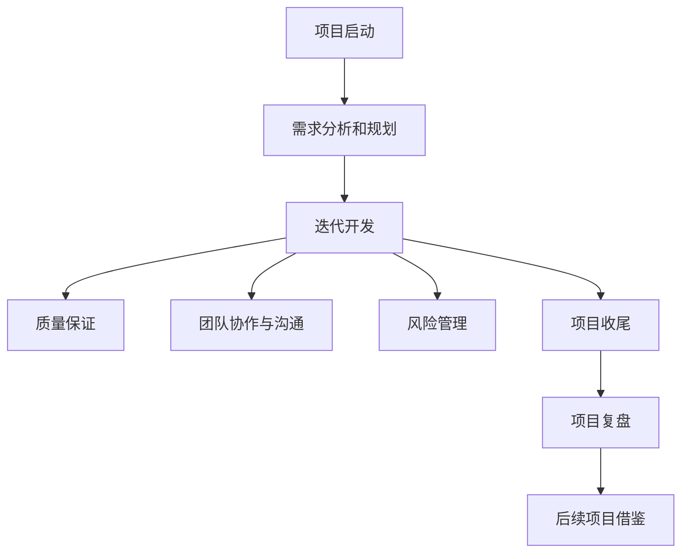

                 

# 项目管理：从启动到收尾的全流程指南

> 关键词：项目管理,敏捷开发,Scrum,迭代,质量保证,风险管理,项目收尾,项目复盘

## 1. 背景介绍

### 1.1 问题由来
项目管理是任何组织或团队实现其目标的关键环节。在当今快速变化、竞争激烈的商业环境中，高效的项目管理能够帮助企业快速响应市场变化，推动业务创新。然而，项目管理的复杂性、动态性以及多变性，使得许多项目经理面临诸多挑战。

项目管理涉及诸多要素，包括项目规划、资源调配、进度监控、风险管理、团队协作等多个方面。传统的项目管理方法如瀑布模型，虽然结构清晰、易于管理，但在复杂、快速变化的项目环境中，显得不够灵活和高效。

敏捷开发方法（如Scrum）的提出，为项目管理提供了一种灵活、迭代、适应性强的新思路。敏捷开发倡导以用户为中心、快速迭代、持续交付、反馈驱动等原则，通过团队协作、持续改进的方式，提高项目的成功率。

### 1.2 问题核心关键点
敏捷项目管理强调以迭代为基础，小步快跑，持续交付价值，根据反馈不断调整项目方向。其核心流程包括：

1. **项目启动**：明确项目目标、范围和预期成果，组建项目团队，制定初步计划。
2. **需求分析和规划**：定义项目需求、优先级，制定详细的产品路线图。
3. **迭代开发**：将项目分解为多个迭代周期，每个周期完成一定的功能或任务，通过迭代逐步构建完整的项目。
4. **质量保证**：在每个迭代周期内进行测试和质量评审，确保产品符合质量标准。
5. **团队协作与沟通**：通过每日站会、产品待办事项、版本控制等工具，促进团队协作和沟通。
6. **风险管理**：识别、评估和应对项目风险，确保项目顺利推进。
7. **项目收尾**：项目交付、总结、复盘和归档，为后续项目提供借鉴和经验教训。

## 2. 核心概念与联系

### 2.1 核心概念概述

为更好地理解敏捷项目管理方法，本节将介绍几个密切相关的核心概念：

- **敏捷开发（Agile Development）**：一种以人为核心、迭代、增量的软件开发方法。
- **Scrum（Scrum Framework）**：敏捷项目管理的一种标准流程，包括Sprint、Product Backlog、Daily Standup等关键元素。
- **迭代（Iteration）**：将项目分解为多个阶段，每个阶段（Sprint）完成特定目标，通过迭代逐步构建完整项目。
- **质量保证（Quality Assurance, QA）**：通过严格的质量管理过程，确保产品符合预期的质量标准。
- **风险管理（Risk Management）**：识别、评估和控制项目风险，确保项目顺利推进。
- **项目收尾（Project Closure）**：项目交付、总结、复盘和归档，为后续项目提供借鉴和经验教训。
- **项目复盘（Project Retrospective）**：对项目进行回顾和总结，提出改进建议，提升团队效能。

这些核心概念之间的逻辑关系可以通过以下Mermaid流程图来展示：



这个流程图展示了的敏捷项目管理方法的核心流程：

1. 项目启动确定目标和团队，初步规划项目范围。
2. 需求分析和规划定义产品路线图和优先级，明确产品目标。
3. 迭代开发通过多个Sprint逐步构建项目功能。
4. 质量保证确保每个Sprint产出符合质量标准。
5. 团队协作与沟通促进团队合作和信息传递。
6. 风险管理识别和控制项目风险，保障项目顺利进行。
7. 项目收尾完成项目交付、总结和归档。
8. 项目复盘回顾项目过程，提出改进建议，为后续项目提供参考。

## 3. 核心算法原理 & 具体操作步骤
### 3.1 算法原理概述

敏捷项目管理以迭代为基础，强调快速响应变化、持续交付价值和反馈驱动的持续改进。其核心思想是通过小步快跑的方式，逐步构建和交付产品，并在每个迭代周期内不断优化和调整，以达到最佳的项目效果。

敏捷项目管理的关键算法原理包括：

1. **迭代周期（Sprint）**：将项目分解为多个迭代周期，每个周期完成一定的功能或任务。迭代周期通常为2-4周，并严格遵循时间限制，以保持项目的快速推进。
2. **产品待办事项（Product Backlog）**：定义项目需求和优先级，由业务方和开发团队共同维护。产品待办事项根据项目进展和优先级，不断调整和更新。
3. **每日站会（Daily Standup）**：团队成员每天进行短暂的站会，回顾前一天的工作进展、今日计划和遇到的障碍，确保团队协作和信息同步。
4. **任务拆分（Task Breakdown）**：将产品待办事项细化为具体的可执行任务，每个任务分配给具体的团队成员。
5. **反馈循环（Feedback Loop）**：在每个迭代周期内，通过持续的反馈和调整，不断优化项目方向和产出。
6. **持续交付（Continuous Delivery）**：在每个迭代周期内完成产品功能开发和测试，确保产品快速交付和上线。

### 3.2 算法步骤详解

敏捷项目管理的具体操作步骤包括：

**Step 1: 项目启动**
- 定义项目目标和范围，明确项目交付物和预期成果。
- 组建项目团队，包括产品经理、开发人员、测试人员等关键角色。
- 制定初步计划，包括项目时间表、里程碑和关键节点。

**Step 2: 需求分析和规划**
- 与业务方和利益相关者进行沟通，明确项目需求和优先级。
- 根据需求定义产品路线图，确定项目的主要功能模块和关键特性。
- 分解产品路线图为具体的用户故事和需求点，并根据优先级排序。

**Step 3: 迭代开发**
- 划分多个迭代周期，每个周期（Sprint）通常为2-4周。
- 在每个迭代周期内，制定Sprint计划，明确Sprint目标和任务分配。
- 进行任务拆分，将需求点细化为具体的可执行任务，并分配给具体的团队成员。
- 每日站会，团队成员汇报工作进展和遇到的障碍，确保信息同步和协作。
- 每个迭代周期结束时，进行Sprint评审，展示Sprint成果和下一迭代任务。

**Step 4: 质量保证**
- 在每个迭代周期内，进行代码审查和功能测试，确保产品符合质量标准。
- 根据测试结果，进行Bug修复和功能优化，确保产品质量。
- 在每个迭代周期结束时，进行Sprint评审，展示Sprint成果和质量评估。

**Step 5: 团队协作与沟通**
- 使用敏捷工具如Jira、Trello等，管理产品待办事项和任务分配。
- 使用版本控制工具如Git，确保代码安全和版本管理。
- 定期组织回顾会议，总结经验教训，提出改进建议。

**Step 6: 风险管理**
- 识别和评估项目风险，制定应对策略，确保项目顺利进行。
- 定期进行风险评估，更新风险登记表，跟踪风险状态。

**Step 7: 项目收尾**
- 完成项目交付，确保项目符合预期成果。
- 总结项目过程，评估项目效果和团队表现。
- 进行项目复盘，回顾项目历程，提出改进建议。
- 归档项目文档和资料，为后续项目提供参考。

### 3.3 算法优缺点

敏捷项目管理具有以下优点：
1. 灵活适应变化：通过迭代和持续改进的方式，能够快速响应项目变化，保持项目灵活性。
2. 快速交付价值：每个迭代周期内完成特定任务，通过持续交付，快速实现用户需求。
3. 强调团队协作：每日站会和定期回顾会议，促进团队协作和信息同步。
4. 高效风险管理：识别和评估项目风险，制定应对策略，保障项目顺利进行。
5. 持续改进：通过反馈循环和回顾会议，持续优化项目过程和产出。

同时，该方法也存在一定的局限性：
1. 需要高度的团队自治能力：敏捷管理要求团队高度自治和自我管理，对团队能力有较高要求。
2. 需要持续的沟通和协作：每日站会和回顾会议需要持续的沟通和协作，对团队文化有较高要求。
3. 初期启动成本较高：敏捷管理需要组建团队和制定计划，初期启动成本较高。
4. 风险管理可能存在不足：敏捷管理通过持续改进的方式管理风险，可能无法在早期识别和控制高风险问题。
5. 可能面临团队分裂风险：敏捷管理强调个人责任和团队协作，可能造成团队分裂和冲突。

尽管存在这些局限性，但就目前而言，敏捷项目管理方法仍是最主流、最有效的项目管理范式。未来相关研究的重点在于如何进一步优化团队协作、提升风险管理能力、降低启动成本等，以实现更加高效的敏捷项目管理。

### 3.4 算法应用领域

敏捷项目管理方法在软件开发、产品设计、项目管理等领域得到了广泛应用。以下是几个典型的应用场景：

1. **软件开发**：敏捷项目管理在软件开发领域被广泛应用于开发新产品、改进现有产品和维护现有产品。敏捷团队能够快速响应需求变化，快速迭代开发，确保产品及时交付。
2. **产品设计**：敏捷项目管理在产品设计阶段，通过快速迭代和持续反馈，能够快速验证和优化产品设计，提升用户体验。
3. **项目管理**：敏捷项目管理在项目管理和流程改进中，能够提升团队协作效率，快速响应变化，提高项目成功率。
4. **产品化工程**：敏捷项目管理在产品化工程中，能够快速开发、测试和发布产品，确保产品市场竞争力。

除了上述这些场景外，敏捷项目管理还被创新性地应用于更多领域中，如智能制造、智能物流、智慧城市等，为各行各业带来了全新的变革和提升。

## 4. 数学模型和公式 & 详细讲解  
### 4.1 数学模型构建

本节将使用数学语言对敏捷项目管理方法进行更加严格的刻画。

假设项目总时间为 $T$，共有 $n$ 个迭代周期，每个周期时间长度为 $t$。设 $p_i$ 为第 $i$ 个迭代周期结束时的进度，$i=1,2,...,n$。项目完成条件为 $p_i=1$，其中 $p_i$ 满足以下线性增长模型：

$$
p_i = p_{i-1} + \frac{t}{T} \times \text{Sprint Velocity}
$$

其中，$\text{Sprint Velocity}$ 为每个迭代周期的任务完成速度，通常为团队在迭代周期内完成的任务数量或产品功能点。

### 4.2 公式推导过程

以下我们通过数学推导，求解每个迭代周期结束时的进度 $p_i$，并给出具体的计算步骤。

假设初始进度为 $p_0=0$，总时间为 $T$，共有 $n$ 个迭代周期，每个周期时间长度为 $t$。设 $\text{Sprint Velocity}$ 为每个迭代周期的任务完成速度，则有：

$$
p_1 = \frac{t}{T} \times \text{Sprint Velocity}
$$

$$
p_2 = p_1 + \frac{t}{T} \times \text{Sprint Velocity} = \frac{2t}{T} \times \text{Sprint Velocity}
$$

$$
p_3 = p_2 + \frac{t}{T} \times \text{Sprint Velocity} = \frac{3t}{T} \times \text{Sprint Velocity}
$$

$$
\cdots
$$

$$
p_n = p_{n-1} + \frac{t}{T} \times \text{Sprint Velocity} = \frac{n}{T} \times \text{Sprint Velocity}
$$

根据上述公式，可以得出每个迭代周期结束时的进度，从而计算项目总完成时间。

### 4.3 案例分析与讲解

考虑一个软件开发项目，总时间为6个月，即 $T=6$，共有4个迭代周期，每个周期时间为1个月，即 $t=1$。假设每个迭代周期内，开发团队完成20个任务，即 $\text{Sprint Velocity}=20$。根据上述线性增长模型，计算每个迭代周期结束时的进度，结果如下：

| 迭代周期 | 进度 $p_i$ | Sprint Velocity |
| --- | --- | --- |
| 1 | $1 \times \frac{1}{6} \times 20 = \frac{20}{6}$ | 20 |
| 2 | $1 \times \frac{2}{6} \times 20 = \frac{40}{6}$ | 20 |
| 3 | $1 \times \frac{3}{6} \times 20 = \frac{60}{6}$ | 20 |
| 4 | $1 \times \frac{4}{6} \times 20 = \frac{80}{6}$ | 20 |

根据上述计算，可以得出项目总完成时间为 $T=6$ 个月，项目在第四个月时已完成80%的任务。

## 5. 项目实践：代码实例和详细解释说明
### 5.1 开发环境搭建

在进行敏捷项目管理实践前，我们需要准备好开发环境。以下是使用Jira和Git进行敏捷项目管理的环境配置流程：

1. 安装Jira：从官网下载并安装Jira软件，创建新的项目空间。

2. 创建并激活虚拟环境：
```bash
conda create -n pytorch-env python=3.8 
conda activate pytorch-env
```

3. 安装Jira API开发包：
```bash
pip install jira
```

4. 安装Git：下载并安装Git客户端，并配置用户名和邮箱。

完成上述步骤后，即可在`pytorch-env`环境中开始敏捷项目管理实践。

### 5.2 源代码详细实现

下面我们以敏捷开发流程为例，给出使用Jira和Git进行敏捷项目管理的基本代码实现。

首先，定义Jira API接口，用于获取和更新项目信息：

```python
import jira

class JiraManager:
    def __init__(self, jira_url, username, password):
        self.jira = jira.Jira(self.jira_url, username, password)
    
    def get_sprints(self, project_key):
        sprints = self.jira.search_issues(
            jql=f'project={project_key} AND sprint in open'
        )
        return sprints
    
    def update_sprint(self, sprint_id, sprint_name):
        self.jira.scrum.update_sprint(sprint_id, name=sprint_name)
```

然后，定义Git命令，用于版本控制和代码推送：

```python
import subprocess

class GitManager:
    def __init__(self, repo_url):
        self.repo_url = repo_url
        
    def clone_repository(self):
        subprocess.run(['git', 'clone', self.repo_url])
    
    def commit_changes(self, commit_msg):
        subprocess.run(['git', 'add', '.'])
        subprocess.run(['git', 'commit', f'-m {commit_msg}'])
    
    def push_changes(self):
        subprocess.run(['git', 'push', 'origin', 'master'])
```

接着，定义任务拆分和迭代规划：

```python
class TaskManager:
    def __init__(self, jira_manager, git_manager):
        self.jira_manager = jira_manager
        self.git_manager = git_manager
    
    def plan_sprint(self, sprint_name, sprint_duration):
        sprints = self.jira_manager.get_sprints('ABC123')
        current_sprint = sprints[-1]
        self.jira_manager.update_sprint(current_sprint.id, sprint_name)
        
        self.git_manager.clone_repository()
        
        for i in range(sprint_duration):
            task_id = self.jira_manager.get_next_task(current_sprint.id)
            task_name = self.jira_manager.get_task_name(task_id)
            self.git_manager.commit_changes(f'Task {i+1}: {task_name}')
        
        self.git_manager.push_changes()
```

最后，启动敏捷项目管理流程：

```python
jira_manager = JiraManager('https://your-jira-url.com', 'your-username', 'your-password')
git_manager = GitManager('https://your-git-repo.com')
task_manager = TaskManager(jira_manager, git_manager)

sprint_name = 'Sprint 1'
sprint_duration = 4

task_manager.plan_sprint(sprint_name, sprint_duration)
```

以上就是使用Jira和Git进行敏捷项目管理的基本代码实现。可以看到，通过使用Jira和Git，能够高效地进行任务拆分、迭代规划和代码管理，确保敏捷项目的顺利推进。

### 5.3 代码解读与分析

让我们再详细解读一下关键代码的实现细节：

**JiraManager类**：
- `__init__`方法：初始化Jira客户端，并创建Jira API接口。
- `get_sprints`方法：使用Jira API获取开放状态的Sprint列表。
- `update_sprint`方法：使用Jira API更新Sprint的名称。

**GitManager类**：
- `__init__`方法：初始化Git仓库信息。
- `clone_repository`方法：使用Git命令行克隆项目仓库。
- `commit_changes`方法：使用Git命令行提交代码变更。
- `push_changes`方法：使用Git命令行推送代码变更到远程仓库。

**TaskManager类**：
- `__init__`方法：初始化Jira和Git管理器的实例。
- `plan_sprint`方法：根据Sprint名称和时长，拆分任务并提交代码变更。

**任务拆分和迭代规划**：
- `plan_sprint`方法：获取开放的Sprint列表，更新Sprint名称。
- 克隆项目仓库，为每个迭代周期拆分任务并提交代码变更。
- 提交代码变更并推送到远程仓库。

可以看到，通过Jira和Git的集成使用，能够高效地进行敏捷项目管理，确保任务拆分和代码管理的流畅。但工业级的系统实现还需考虑更多因素，如任务优先级调整、风险管理、质量保证等。但核心的敏捷项目管理流程基本与此类似。

## 6. 实际应用场景
### 6.1 智能制造

敏捷项目管理在智能制造领域的应用，能够显著提升生产效率和产品质量。智能制造项目涉及设备升级、工艺优化、流程改进等多个环节，通常需要多部门协作，周期较长。通过敏捷管理，能够快速响应生产需求，优化流程，确保项目按时交付。

在技术实现上，可以采用敏捷项目管理方法，对智能制造项目进行迭代开发和持续改进。通过每日站会、Sprint评审、产品待办事项等方式，促进团队协作和信息同步。在每个迭代周期内，完成特定的设备升级、工艺优化和流程改进任务，并通过持续反馈和优化，确保项目顺利推进。

### 6.2 智能物流

敏捷项目管理在智能物流领域的应用，能够显著提升物流效率和客户满意度。智能物流项目涉及货物追踪、仓储管理、配送优化等多个环节，需要与多个部门协作，周期较长。通过敏捷管理，能够快速响应市场需求，优化流程，确保项目按时交付。

在技术实现上，可以采用敏捷项目管理方法，对智能物流项目进行迭代开发和持续改进。通过每日站会、Sprint评审、产品待办事项等方式，促进团队协作和信息同步。在每个迭代周期内，完成特定的货物追踪、仓储管理和配送优化任务，并通过持续反馈和优化，确保项目顺利推进。

### 6.3 智慧城市

敏捷项目管理在智慧城市治理中的应用，能够显著提升城市管理效率和公共服务水平。智慧城市项目涉及城市基础设施、公共服务、社区管理等多个环节，需要与多个部门协作，周期较长。通过敏捷管理，能够快速响应城市需求，优化流程，确保项目按时交付。

在技术实现上，可以采用敏捷项目管理方法，对智慧城市项目进行迭代开发和持续改进。通过每日站会、Sprint评审、产品待办事项等方式，促进团队协作和信息同步。在每个迭代周期内，完成特定的城市基础设施、公共服务和社区管理任务，并通过持续反馈和优化，确保项目顺利推进。

### 6.4 未来应用展望

随着敏捷项目管理方法的不断演进，其在更多领域得到应用，为各行各业带来了新的变革和提升。

在智慧医疗领域，敏捷项目管理能够提升医疗服务的智能化水平，辅助医生诊疗，加速新药开发进程。在智慧教育领域，敏捷项目管理能够促进教育公平，提高教学质量。在智慧城市治理中，敏捷项目管理能够提高城市管理的自动化和智能化水平，构建更安全、高效的未来城市。

此外，在企业生产、社会治理、文娱传媒等众多领域，敏捷项目管理也将不断涌现，为传统行业数字化转型升级提供新的技术路径。相信随着技术的日益成熟，敏捷项目管理必将在构建人机协同的智能时代中扮演越来越重要的角色。

## 7. 工具和资源推荐
### 7.1 学习资源推荐

为了帮助开发者系统掌握敏捷项目管理的理论基础和实践技巧，这里推荐一些优质的学习资源：

1. 《敏捷项目管理：敏捷方法论及实践》书籍：详细介绍了敏捷项目管理的理论基础和实践方法，是敏捷项目管理入门的必备书籍。

2. Scrum.org官方课程：Scrum.org开设的Scrum认证课程，系统讲解Scrum框架和敏捷项目管理方法。

3. Agile Alliance网站：Agile Alliance提供的敏捷项目管理资源和社区支持，提供大量的敏捷项目管理文章和实践案例。

4. Scrum Master认证培训：Scrum Master认证培训课程，系统讲解Scrum框架和敏捷项目管理方法，帮助项目经理提升技能。

5. Scrum官方文档：Scrum.org提供的Scrum框架和敏捷项目管理方法文档，是学习和实践Scrum框架的重要参考。

通过对这些资源的学习实践，相信你一定能够快速掌握敏捷项目管理的精髓，并用于解决实际的项目管理问题。

### 7.2 开发工具推荐

高效的开发离不开优秀的工具支持。以下是几款用于敏捷项目管理开发的常用工具：

1. Jira：敏捷项目管理工具，提供任务管理、Sprint规划、每日站会等功能，支持自定义工作流和报告。

2. Trello：敏捷项目管理工具，提供看板视图、任务卡片、每日站会等功能，适合小型团队使用。

3. Asana：敏捷项目管理工具，提供任务管理、Sprint规划、每日站会等功能，支持自定义项目模板。

4. Slack：团队协作工具，提供即时通讯、文件共享、频道等功能，支持集成Jira和Git。

5. Git：版本控制工具，提供代码管理、版本控制、协作开发等功能，是敏捷开发的基础工具。

合理利用这些工具，可以显著提升敏捷项目管理的开发效率，加快创新迭代的步伐。

### 7.3 相关论文推荐

敏捷项目管理的发展源于学界的持续研究。以下是几篇奠基性的相关论文，推荐阅读：

1. Agile Manifesto：敏捷宣言，阐述敏捷项目管理的核心理念和价值观。

2. Agile Software Development: Principles, Patterns, and Practices：敏捷软件开发：原则、模式和实践，介绍了敏捷开发的核心原则和实践方法。

3. Scrum: The Art of Doing Twice the Work in Half the Time：Scrum：在半时间内完成两倍的工作，介绍了Scrum框架的详细实现和实践经验。

4. Agile Project Management with Scrum：敏捷项目管理与Scrum，详细介绍了Scrum框架和敏捷项目管理方法。

5. Agile Project Management: A Practical Guide and Toolbox：敏捷项目管理：实用指南和工具包，提供了丰富的敏捷项目管理工具和实践案例。

这些论文代表了大敏捷项目管理的发展脉络。通过学习这些前沿成果，可以帮助研究者把握学科前进方向，激发更多的创新灵感。

## 8. 总结：未来发展趋势与挑战

### 8.1 总结

本文对敏捷项目管理方法进行了全面系统的介绍。首先阐述了敏捷项目管理的研究背景和意义，明确了敏捷管理在项目管理中的重要性。其次，从原理到实践，详细讲解了敏捷管理的核心思想和关键步骤，给出了敏捷项目管理任务开发的完整代码实例。同时，本文还广泛探讨了敏捷项目管理在智能制造、智能物流、智慧城市等多个行业领域的应用前景，展示了敏捷管理的巨大潜力。

通过本文的系统梳理，可以看到，敏捷项目管理方法在项目管理中的作用日益凸显。通过快速迭代、持续改进和反馈驱动的方式，敏捷管理能够提高项目的成功率和交付质量，成为项目管理的核心范式。未来，伴随敏捷项目管理方法的持续演进，敏捷项目管理必将在更多领域得到应用，为各行各业带来新的变革和提升。

### 8.2 未来发展趋势

展望未来，敏捷项目管理技术将呈现以下几个发展趋势：

1. 敏捷管理的普及应用：敏捷管理将成为企业项目管理的主流方法，被广泛应用于软件开发、产品设计、项目流程改进等多个领域。
2. 敏捷管理的工具化：敏捷管理将更加依赖于各种项目管理工具的支持，通过工具化实现敏捷管理的高效实施。
3. 敏捷管理的持续改进：敏捷管理将持续关注团队协作、持续改进和反馈循环，不断优化项目管理方法。
4. 敏捷管理的标准化：敏捷管理将逐步形成标准化的框架和方法，帮助项目经理提升技能和水平。
5. 敏捷管理与其他管理方法的融合：敏捷管理将与更广泛的管理方法如精益管理、六西格玛等进行融合，提升项目管理效果。

以上趋势凸显了敏捷项目管理技术的广阔前景。这些方向的探索发展，必将进一步提升敏捷项目管理的效果，为各行各业带来新的变革和提升。

### 8.3 面临的挑战

尽管敏捷项目管理方法已经取得了瞩目成就，但在迈向更加智能化、普适化应用的过程中，它仍面临诸多挑战：

1. 团队自治能力不足：敏捷管理要求团队高度自治和自我管理，对团队能力有较高要求。
2. 持续改进的动力不足：敏捷管理需要持续的反馈和优化，团队可能面临动力不足的问题。
3. 敏捷工具的限制：敏捷管理依赖于各种项目管理工具的支持，工具的限制可能影响敏捷管理的效果。
4. 项目管理的复杂性：敏捷管理需要综合考虑多个因素，项目管理的复杂性可能导致管理难度增加。
5. 风险管理的不足：敏捷管理通过持续改进的方式管理风险，可能无法在早期识别和控制高风险问题。

尽管存在这些挑战，但随着敏捷管理方法论的不断成熟和完善，未来相关研究的重点在于如何进一步优化团队协作、提升持续改进能力、降低管理难度、提高风险管理能力等，以实现更加高效的敏捷项目管理。

### 8.4 研究展望

面向未来，敏捷项目管理技术需要在以下几个方面寻求新的突破：

1. 探索无监督和半监督敏捷项目管理方法。摆脱对大量标注数据的依赖，利用自监督学习、主动学习等无监督和半监督范式，最大限度利用非结构化数据，实现更加灵活高效的敏捷项目管理。
2. 研究持续改进和反馈驱动的敏捷项目管理方法。通过引入因果推断和对比学习思想，增强敏捷项目管理建立稳定因果关系的能力，学习更加普适、鲁棒的项目管理方法。
3. 引入更多先验知识。将符号化的先验知识，如知识图谱、逻辑规则等，与敏捷项目管理方法进行巧妙融合，引导项目管理过程学习更准确、合理的项目管理方法。

这些研究方向的探索，必将引领敏捷项目管理技术迈向更高的台阶，为构建安全、可靠、可解释、可控的项目管理范式提供新的思路。面向未来，敏捷项目管理技术还需要与其他项目管理技术进行更深入的融合，如精益管理、六西格玛等，多路径协同发力，共同推动项目管理技术的进步。

## 9. 附录：常见问题与解答

**Q1：敏捷项目管理适用于所有项目类型吗？**

A: 敏捷项目管理方法适用于敏捷开发的项目，包括软件开发、产品设计、项目流程改进等多个领域。但对于一些特定的项目类型，如基础设施建设、传统制造业等，敏捷管理可能不太适用。此外，对于一些需要严格控制风险的项目，敏捷管理也需要根据具体情况进行调整。

**Q2：如何选择合适的敏捷管理工具？**

A: 选择合适的敏捷管理工具，需要考虑以下几个因素：
1. 团队规模：工具的复杂度和功能应与团队规模相匹配，避免过度复杂导致使用困难。
2. 项目需求：工具应支持自定义工作流、任务管理、报告生成等功能，满足项目需求。
3. 团队协作：工具应提供即时通讯、文件共享、频道等功能，促进团队协作和信息同步。
4. 集成能力：工具应支持与其他项目管理工具和开发工具的集成，提高效率。
5. 使用成本：工具的成本应与团队的经济实力相匹配，避免过高的成本投入。

**Q3：敏捷项目管理中如何进行风险管理？**

A: 敏捷项目管理中的风险管理包括以下步骤：
1. 风险识别：通过团队讨论、历史数据分析等方式，识别项目中可能存在的风险。
2. 风险评估：对识别的风险进行评估，确定风险发生的可能性和影响程度。
3. 风险规划：制定应对策略，分配风险责任，明确风险应对措施。
4. 风险监控：定期跟踪风险状态，及时调整风险应对策略。
5. 风险响应：一旦风险发生，立即启动应对措施，控制风险影响。

**Q4：敏捷项目管理中的每日站会如何设计？**

A: 每日站会应包括以下几个关键环节：
1. 回顾前一天的工作进展：团队成员汇报前一天完成的任务和遇到的问题。
2. 汇报今日计划：团队成员汇报今日的任务计划和目标。
3. 汇报遇到的障碍：团队成员汇报遇到的障碍和挑战，寻求团队支持。
4. 反馈和改进：团队成员提供反馈，提出改进建议，促进团队协作和信息同步。

**Q5：敏捷项目管理中如何进行质量保证？**

A: 敏捷项目管理中的质量保证包括以下几个关键环节：
1. 代码审查：团队成员进行代码审查，确保代码质量和可维护性。
2. 功能测试：团队成员进行功能测试，确保产品功能符合预期。
3. 持续集成：通过持续集成工具，自动化测试和集成，确保产品快速交付和上线。
4. 定期回顾：团队定期进行回顾会议，总结经验教训，提出改进建议。

通过这些质量保证措施，敏捷项目管理能够确保产品符合质量标准，提升交付质量。

---

作者：禅与计算机程序设计艺术 / Zen and the Art of Computer Programming

