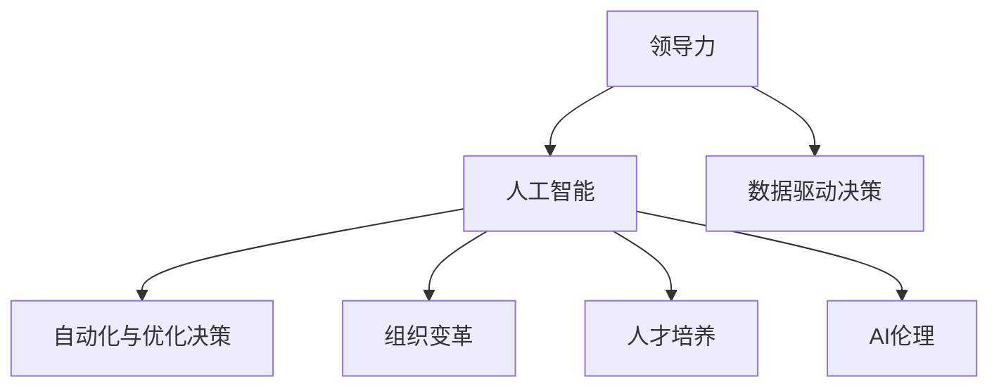
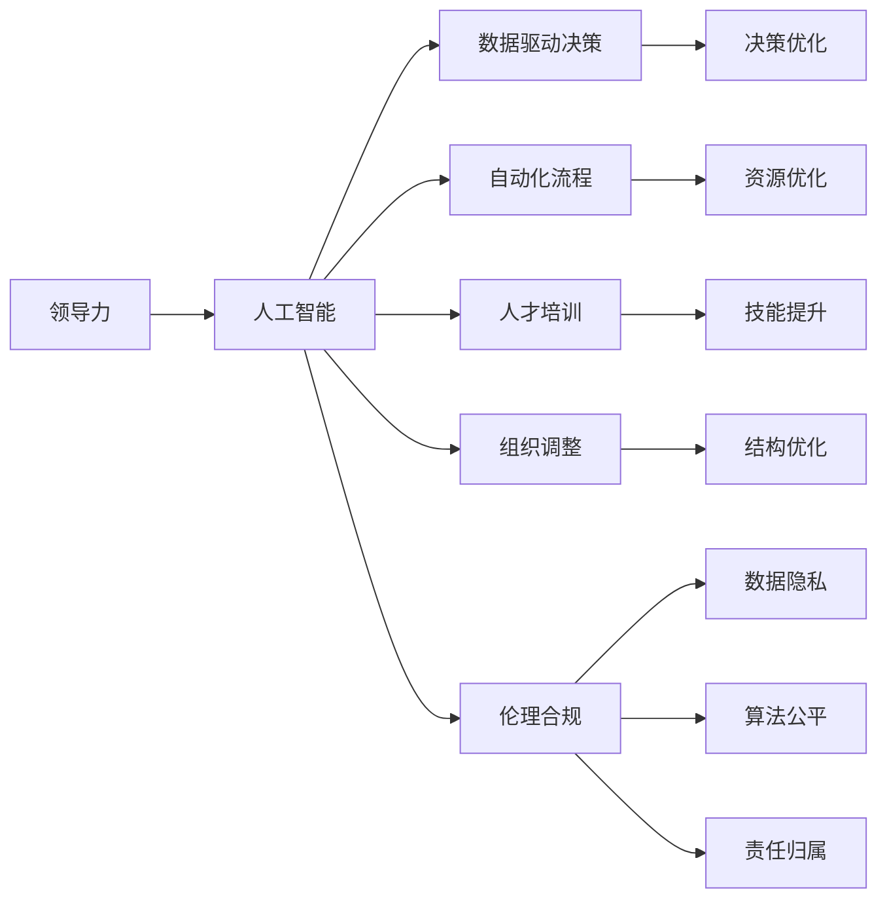

                 

# 领导力与 AI：有效利用人工智能

> 关键词：领导力, AI, 人工智能, 机器学习, 深度学习, 数据驱动决策, 创新, 自动化, 优化决策, 组织变革, 人才培养, 人工智能伦理

## 1. 背景介绍

### 1.1 问题由来

随着科技的迅猛发展，人工智能（AI）已成为各行各业的核心竞争力。然而，AI技术要真正发挥其潜力，必须与领导力相融合，才能实现技术与组织的协同进化。当前，企业在应用AI时面临多重挑战，如技术选型、人才储备、组织变革、伦理考量等。本文将深入探讨领导力与AI的结合，帮助企业有效利用AI，驱动业务创新和组织转型。

### 1.2 问题核心关键点

领导力与AI结合的核心关键点在于：
1. **战略导向**：如何通过AI技术实现企业战略目标。
2. **资源配置**：如何合理配置技术资源、人才资源、资本资源。
3. **组织变革**：如何调整组织架构、流程和角色，以适应AI技术的应用。
4. **人才培养**：如何提升员工AI素养，培育未来领导力。
5. **伦理与合规**：如何在应用AI时遵守伦理规范和法律法规。

### 1.3 问题研究意义

领导力与AI的结合，对于提升企业创新能力、优化决策过程、加速业务增长具有重要意义：

1. **提升决策质量**：通过数据驱动的AI技术，帮助决策者获得更全面、准确的信息，减少偏见和主观判断，提升决策科学性。
2. **加速业务创新**：利用AI技术对市场趋势、客户需求进行深度分析，推动产品和服务创新，增强企业竞争力。
3. **优化资源配置**：AI技术能够自动监控和优化资源配置，提高运营效率，降低成本。
4. **促进组织变革**：AI技术的应用促进组织结构、流程的变革，提升组织灵活性和适应性。
5. **培养未来领导力**：通过AI技术的普及和应用，培养具备跨学科能力的未来领导者。
6. **遵守伦理与合规**：确保AI应用符合伦理规范和法律法规，保护数据隐私和安全。

## 2. 核心概念与联系

### 2.1 核心概念概述

为了更好地理解领导力与AI的结合，我们需要先明确几个核心概念：

- **领导力**：指通过影响力引领团队、实现组织目标的能力。领导者不仅要管理团队，还要促进组织变革和创新。
- **人工智能**：指使用算法和模型自动处理数据、做出决策的技术。AI的核心在于模型学习和数据驱动的决策。
- **数据驱动决策**：指基于数据分析和AI模型结果进行决策的过程，强调数据的准确性和模型的可靠性。
- **自动化与优化决策**：指使用AI技术自动执行任务、优化决策过程，提高效率和质量。
- **组织变革**：指通过技术创新、流程优化、人才调整等方式，推动组织结构和文化的改变。
- **人才培养**：指通过培训、教育、激励等方式，提升员工的技术能力和领导力。
- **AI伦理**：指在使用AI技术时，应遵守的伦理规范和法律法规，如数据隐私、算法公平、责任归属等。

这些概念之间的关系可以用以下Mermaid流程图来展示：



### 2.2 核心概念原理和架构的 Mermaid 流程图

以下是详细的Mermaid流程图，展示领导力与AI结合的核心概念原理和架构：



这个流程图展示了从领导力到人工智能的应用链条，以及各个环节的关键技术和操作。

## 3. 核心算法原理 & 具体操作步骤

### 3.1 算法原理概述

领导力与AI的结合，主要涉及以下几个核心算法原理：

- **数据预处理**：对原始数据进行清洗、特征提取、标准化处理，为AI模型提供高质量的输入数据。
- **模型选择与训练**：根据业务需求选择合适的AI模型，使用历史数据对其进行训练，获得最佳模型参数。
- **模型集成与优化**：通过集成多个模型、调整超参数等方式，优化模型性能，提升决策质量。
- **结果解释与可视化**：利用可解释性模型、交互式可视化工具，帮助决策者理解AI结果，做出科学决策。
- **自动化流程与监控**：将AI模型嵌入到业务流程中，实现自动化决策，同时实时监控模型性能，及时调整。
- **组织与人才管理**：通过培训、教育、激励等方式，提升员工AI素养和领导力，促进组织变革。

### 3.2 算法步骤详解

以下是对各个算法步骤的详细介绍：

#### 3.2.1 数据预处理

数据预处理包括数据清洗、特征提取、数据标准化等步骤。以客户满意度调查数据为例，数据预处理步骤如下：

1. **数据清洗**：删除或修正异常数据、缺失值、重复数据。
2. **特征提取**：提取客户满意度指标、服务质量指标、客户属性等特征。
3. **数据标准化**：对特征进行标准化处理，使其符合模型要求。

#### 3.2.2 模型选择与训练

根据业务需求选择合适的模型，使用历史数据进行训练。以预测客户流失为例，步骤如下：

1. **模型选择**：选择逻辑回归、决策树、随机森林等模型。
2. **数据划分**：将数据划分为训练集和测试集。
3. **模型训练**：使用训练集对模型进行训练，获得最佳参数。
4. **模型评估**：在测试集上评估模型性能，选择最佳模型。

#### 3.2.3 模型集成与优化

模型集成与优化主要包括：

1. **模型集成**：将多个模型的预测结果进行集成，提高预测准确率。
2. **超参数优化**：使用网格搜索、贝叶斯优化等方法调整模型超参数，提升模型性能。

#### 3.2.4 结果解释与可视化

结果解释与可视化主要通过：

1. **可解释性模型**：选择可解释性模型，如决策树、线性回归等。
2. **交互式可视化**：使用Tableau、Power BI等工具，将AI结果可视化，帮助决策者理解。

#### 3.2.5 自动化流程与监控

自动化流程与监控主要包括：

1. **流程嵌入**：将AI模型嵌入到业务流程中，实现自动化决策。
2. **性能监控**：实时监控模型性能，及时调整模型参数。

#### 3.2.6 组织与人才管理

组织与人才管理主要通过：

1. **培训教育**：提供AI相关的培训课程，提升员工AI素养。
2. **激励机制**：建立激励机制，鼓励员工使用AI技术。
3. **文化建设**：营造开放包容的AI文化，促进技术创新。

### 3.3 算法优缺点

领导力与AI结合的算法具有以下优点：

1. **提升决策质量**：通过数据驱动的AI技术，帮助决策者获得更全面、准确的信息，减少偏见和主观判断，提升决策科学性。
2. **加速业务创新**：利用AI技术对市场趋势、客户需求进行深度分析，推动产品和服务创新，增强企业竞争力。
3. **优化资源配置**：AI技术能够自动监控和优化资源配置，提高运营效率，降低成本。
4. **促进组织变革**：AI技术的应用促进组织结构、流程的变革，提升组织灵活性和适应性。
5. **培养未来领导力**：通过AI技术的普及和应用，培养具备跨学科能力的未来领导者。
6. **遵守伦理与合规**：确保AI应用符合伦理规范和法律法规，保护数据隐私和安全。

同时，该算法也存在以下局限性：

1. **数据质量依赖**：AI模型的性能高度依赖于数据质量，数据偏差和噪声可能导致模型效果不佳。
2. **技术复杂度高**：AI技术的应用需要较高的技术门槛，对于中小企业而言，可能存在一定难度。
3. **人才缺乏**：AI技术的应用需要具备相关专业知识的人才，如何培养和引进人才是一大挑战。
4. **伦理与合规风险**：AI应用可能涉及数据隐私、算法公平等伦理问题，如何合规使用是一大难题。

### 3.4 算法应用领域

领导力与AI结合的算法在多个领域都有广泛应用，例如：

- **金融行业**：利用AI进行风险评估、信用评分、投资决策等。
- **医疗健康**：使用AI进行疾病诊断、医疗影像分析、个性化治疗等。
- **制造业**：通过AI优化生产流程、预测设备故障、提高质量控制等。
- **零售行业**：利用AI进行客户细分、需求预测、个性化推荐等。
- **交通运输**：使用AI进行交通流量预测、车辆调度、自动驾驶等。

## 4. 数学模型和公式 & 详细讲解 & 举例说明

### 4.1 数学模型构建

领导力与AI结合的数学模型主要涉及以下内容：

1. **数据预处理模型**：数据清洗、特征提取、数据标准化等。
2. **机器学习模型**：选择和训练模型，如线性回归、决策树、随机森林等。
3. **模型集成与优化模型**：模型集成、超参数优化等。
4. **结果解释与可视化模型**：可解释性模型、交互式可视化工具。
5. **自动化流程与监控模型**：流程嵌入、性能监控等。
6. **组织与人才管理模型**：培训教育、激励机制、文化建设等。

### 4.2 公式推导过程

以下是几个关键公式的推导过程：

#### 4.2.1 数据标准化公式

数据标准化公式为：

$$
\frac{x_i - \mu}{\sigma}
$$

其中，$x_i$ 表示第 $i$ 个样本，$\mu$ 表示均值，$\sigma$ 表示标准差。

#### 4.2.2 线性回归模型公式

线性回归模型公式为：

$$
y = \beta_0 + \beta_1 x_1 + \beta_2 x_2 + \ldots + \beta_n x_n
$$

其中，$y$ 表示因变量，$x_i$ 表示自变量，$\beta_i$ 表示回归系数。

#### 4.2.3 决策树模型公式

决策树模型公式为：

$$
\text{Decision Tree} = \sum_{i=1}^N (y_i - \hat{y}_i)^2
$$

其中，$y_i$ 表示真实值，$\hat{y}_i$ 表示预测值。

#### 4.2.4 可解释性模型公式

可解释性模型公式为：

$$
\text{Explainable Model} = \frac{\partial \mathcal{L}(\theta)}{\partial \theta}
$$

其中，$\mathcal{L}(\theta)$ 表示损失函数，$\theta$ 表示模型参数。

### 4.3 案例分析与讲解

以客户流失预测为例，分析领导力与AI结合的数学模型：

1. **数据预处理**：对客户历史数据进行清洗、特征提取、数据标准化等处理。
2. **模型选择**：选择逻辑回归模型。
3. **模型训练**：使用历史数据对模型进行训练，获得最佳参数。
4. **模型评估**：在测试集上评估模型性能，选择最佳模型。
5. **模型集成**：将多个模型的预测结果进行集成，提高预测准确率。
6. **超参数优化**：使用网格搜索方法调整模型超参数，提升模型性能。
7. **结果解释**：利用可解释性模型分析模型结果，解释决策过程。
8. **自动化流程**：将模型嵌入到业务流程中，实现自动化决策。
9. **性能监控**：实时监控模型性能，及时调整模型参数。

## 5. 项目实践：代码实例和详细解释说明

### 5.1 开发环境搭建

要进行领导力与AI结合的项目实践，首先需要搭建开发环境。以下是使用Python进行TensorFlow和Keras开发的环境配置流程：

1. 安装Anaconda：从官网下载并安装Anaconda，用于创建独立的Python环境。

2. 创建并激活虚拟环境：
```bash
conda create -n tensorflow-env python=3.8 
conda activate tensorflow-env
```

3. 安装TensorFlow和Keras：
```bash
conda install tensorflow==2.8.0 
conda install keras==2.8.0
```

4. 安装各类工具包：
```bash
pip install numpy pandas scikit-learn matplotlib tqdm jupyter notebook ipython
```

完成上述步骤后，即可在`tensorflow-env`环境中开始项目实践。

### 5.2 源代码详细实现

下面我们以客户流失预测项目为例，给出使用TensorFlow和Keras进行开发的完整代码实现。

首先，定义数据处理函数：

```python
import pandas as pd
from sklearn.model_selection import train_test_split
from sklearn.preprocessing import StandardScaler

def load_data(file_path):
    data = pd.read_csv(file_path)
    # 数据清洗
    data = data.dropna()
    # 特征提取
    features = data[['age', 'income', 'education', 'marital_status', 'occupation', 'relationship', 'gender', 'residence', 'loan', 'contact', 'balance', 'duration', 'campaign', 'pdays', 'previous', 'poutcome']]
    labels = data['status']
    # 数据标准化
    scaler = StandardScaler()
    features = scaler.fit_transform(features)
    # 数据划分
    X_train, X_test, y_train, y_test = train_test_split(features, labels, test_size=0.2, random_state=42)
    return X_train, X_test, y_train, y_test
```

然后，定义模型和优化器：

```python
from tensorflow.keras.models import Sequential
from tensorflow.keras.layers import Dense
from tensorflow.keras.optimizers import Adam

model = Sequential()
model.add(Dense(64, input_dim=13, activation='relu'))
model.add(Dense(32, activation='relu'))
model.add(Dense(1, activation='sigmoid'))

optimizer = Adam(learning_rate=0.001)
```

接着，定义训练和评估函数：

```python
from tensorflow.keras.utils import to_categorical

def train_model(model, X_train, y_train, X_test, y_test, epochs):
    model.compile(loss='binary_crossentropy', optimizer=optimizer, metrics=['accuracy'])
    history = model.fit(X_train, y_train, validation_data=(X_test, y_test), epochs=epochs, batch_size=32)
    test_loss, test_acc = model.evaluate(X_test, y_test, verbose=0)
    return history, test_loss, test_acc

def evaluate_model(model, X_test, y_test):
    y_pred = model.predict(X_test)
    y_pred = (y_pred > 0.5).astype(int)
    y_test = to_categorical(y_test)
    print(classification_report(y_test, y_pred))
```

最后，启动训练流程并在测试集上评估：

```python
epochs = 50

X_train, X_test, y_train, y_test = load_data('customer_churn.csv')
history, test_loss, test_acc = train_model(model, X_train, y_train, X_test, y_test, epochs)

print(f'Test Loss: {test_loss:.4f}')
print(f'Test Accuracy: {test_acc:.4f}')

evaluate_model(model, X_test, y_test)
```

以上就是使用TensorFlow和Keras进行客户流失预测项目开发的完整代码实现。可以看到，TensorFlow和Keras使得模型构建和训练过程变得简单高效，大大降低了开发难度。

### 5.3 代码解读与分析

让我们再详细解读一下关键代码的实现细节：

**load_data函数**：
- 从CSV文件中加载数据，并进行数据清洗、特征提取、数据标准化等处理。
- 数据清洗：删除或修正异常数据、缺失值、重复数据。
- 特征提取：提取与客户流失相关的特征。
- 数据标准化：对特征进行标准化处理，使其符合模型要求。
- 数据划分：将数据划分为训练集和测试集。

**train_model函数**：
- 构建模型：使用Keras API构建多层感知机模型。
- 编译模型：选择损失函数、优化器和评价指标。
- 训练模型：在训练集上使用Adam优化器进行梯度下降，训练模型。
- 评估模型：在测试集上评估模型性能。

**evaluate_model函数**：
- 使用模型对测试集进行预测，生成预测结果。
- 将预测结果与真实标签进行比较，生成分类报告。

**训练流程**：
- 定义总的epoch数，开始循环迭代。
- 每个epoch内，先在训练集上训练，输出训练损失和准确率。
- 在测试集上评估，输出测试损失和准确率。
- 所有epoch结束后，在测试集上评估，给出最终测试结果。

可以看到，TensorFlow和Keras使得模型构建和训练过程变得简洁高效。开发者可以将更多精力放在数据处理、模型改进等高层逻辑上，而不必过多关注底层的实现细节。

当然，工业级的系统实现还需考虑更多因素，如模型的保存和部署、超参数的自动搜索、更灵活的任务适配层等。但核心的模型构建和训练过程基本与此类似。

## 6. 实际应用场景

### 6.1 智能客服系统

基于领导力与AI结合的智能客服系统，可以大幅提升客户服务质量，减少人力成本，提高客户满意度。系统通过AI技术自动分析客户意图，匹配最合适的回复，实现7x24小时不间断服务。领导力则通过系统优化、人员培训、激励机制等方式，推动智能客服系统的全面应用。

在技术实现上，可以收集客服历史对话数据，使用机器学习模型进行客户意图识别，设计自然语言处理(NLP)模块，生成回复内容。同时，通过定期监控系统性能，及时调整模型参数，确保系统稳定运行。

### 6.2 金融风险管理

AI技术在金融行业中的应用，如风险评估、信用评分、投资决策等，能够提升决策的科学性和准确性。领导力在此过程中起到关键作用，通过制定明确的战略目标，选择合适的AI技术，合理配置资源，优化流程，推动AI技术的落地应用。

在风险管理方面，可以使用AI技术对历史数据进行深度学习，构建风险评估模型，实时监控金融市场动态，预测风险事件。领导力则需要制定全面的风险管理策略，协调技术团队与业务团队，确保AI技术的应用符合法规和伦理规范。

### 6.3 医疗诊断系统

在医疗诊断系统中，AI技术可以辅助医生进行疾病诊断、医疗影像分析、个性化治疗等。领导力在此过程中起到关键作用，通过制定医疗信息化战略，选择合适的AI技术，合理配置资源，优化流程，推动AI技术的落地应用。

在疾病诊断方面，可以使用AI技术对医学影像进行深度学习，辅助医生进行诊断。领导力则需要制定全面的医疗信息化策略，协调技术团队与业务团队，确保AI技术的应用符合法规和伦理规范，保护患者隐私。

### 6.4 未来应用展望

随着AI技术的发展，领导力与AI结合的应用场景将不断扩展，带来更多的创新和变革：

1. **智慧城市**：AI技术在城市管理中的应用，如交通流量预测、智能安防、环保监测等，能够提升城市管理效率和居民生活质量。领导力则需要制定智慧城市战略，协调各方资源，推动AI技术的落地应用。

2. **教育培训**：AI技术在教育培训中的应用，如个性化教学、智能评估、知识推荐等，能够提升教学质量和学生学习效果。领导力则需要制定教育信息化战略，选择合适的AI技术，优化教育流程，提升教育质量。

3. **农业生产**：AI技术在农业生产中的应用，如精准农业、智能监测、自动化作业等，能够提升农业生产效率和质量。领导力则需要制定农业信息化战略，协调技术团队与农业团队，推动AI技术的落地应用。

4. **工业制造**：AI技术在工业制造中的应用，如质量控制、设备维护、供应链优化等，能够提升制造效率和产品质量。领导力则需要制定工业信息化战略，选择合适的AI技术，优化生产流程，提升制造水平。

未来，随着AI技术的普及和应用，领导力与AI结合将带来更多的创新和变革，推动各行各业的智能化转型。

## 7. 工具和资源推荐

### 7.1 学习资源推荐

为了帮助开发者系统掌握领导力与AI结合的理论基础和实践技巧，这里推荐一些优质的学习资源：

1. **《深度学习》书籍**：由Ian Goodfellow等作者所著，深入浅出地介绍了深度学习的基本概念和前沿技术，是学习AI的必读之作。

2. **Coursera《深度学习专项课程》**：由Andrew Ng等名师主讲的深度学习课程，涵盖深度学习的基本原理、常用技术、项目实战等。

3. **Kaggle竞赛平台**：全球最大的数据科学竞赛平台，提供丰富的竞赛项目和数据集，帮助你练习和提升AI技能。

4. **《AI领导力》系列文章**：由AI专家撰写，深入浅出地介绍了AI技术在各行业中的应用，如何提升组织和领导力。

5. **《AI思维》书籍**：由李开复等作者所著，探讨了AI技术的本质和应用，如何塑造未来的AI思维。

通过学习这些资源，相信你一定能够快速掌握领导力与AI结合的精髓，并用于解决实际的业务问题。

### 7.2 开发工具推荐

高效的开发离不开优秀的工具支持。以下是几款用于领导力与AI结合开发的常用工具：

1. **TensorFlow**：由Google主导开发的深度学习框架，支持分布式训练、自动微分、模型优化等。

2. **Keras**：基于TensorFlow的高层API，简单易用，适合快速开发原型和实验。

3. **PyTorch**：由Facebook主导开发的深度学习框架，灵活高效，支持动态图和静态图。

4. **Jupyter Notebook**：交互式的编程环境，支持多种语言和库，适合数据分析和模型训练。

5. **Tableau**：数据可视化工具，支持复杂数据集的可视化，便于理解AI结果。

6. **Power BI**：微软推出的数据可视化工具，支持实时数据更新，适合商业智能应用。

合理利用这些工具，可以显著提升领导力与AI结合的开发效率，加快创新迭代的步伐。

### 7.3 相关论文推荐

领导力与AI结合的研究涉及多个领域，以下是几篇奠基性的相关论文，推荐阅读：

1. **《领导力与人工智能：未来的领导力挑战》**：探讨了AI技术对未来领导力的挑战和机遇，如何适应AI时代的领导需求。

2. **《人工智能与组织变革》**：探讨了AI技术对组织结构、流程和文化的变革，如何利用AI提升组织效率。

3. **《人工智能伦理》**：探讨了AI技术在应用中面临的伦理问题，如数据隐私、算法公平、责任归属等。

4. **《深度学习在金融风险管理中的应用》**：探讨了AI技术在金融风险评估、信用评分等方面的应用，如何提升金融决策的科学性和准确性。

5. **《深度学习在医疗诊断中的应用》**：探讨了AI技术在医疗影像分析、疾病诊断等方面的应用，如何提升医疗服务的质量和效率。

这些论文代表了大领导力与AI结合的发展脉络。通过学习这些前沿成果，可以帮助研究者把握学科前进方向，激发更多的创新灵感。

## 8. 总结：未来发展趋势与挑战

### 8.1 研究成果总结

领导力与AI结合的研究已经取得了显著进展，主要体现在以下几个方面：

1. **AI技术应用广泛**：AI技术在各行各业的应用已经取得显著成效，提升了决策质量、业务效率和客户满意度。

2. **领导力与AI融合**：领导力在AI技术的应用中起到关键作用，通过战略导向、资源配置、组织变革等方式，推动AI技术的落地应用。

3. **人才培养和伦理规范**：AI技术的应用需要具备相关专业知识的人才，同时要遵守伦理规范和法律法规，保护数据隐私和安全。

### 8.2 未来发展趋势

未来，领导力与AI结合的发展趋势将体现在以下几个方面：

1. **跨领域应用普及**：AI技术将在更多领域得到应用，如智慧城市、教育培训、农业生产、工业制造等，推动各行业的智能化转型。

2. **技术手段多样**：AI技术的应用手段将更加多样化，如深度学习、强化学习、迁移学习等，推动技术的全面创新。

3. **数据质量提升**：数据质量是AI技术应用的关键，未来将更多关注数据清洗、特征提取、数据标准化等预处理技术，提升数据质量。

4. **算法模型优化**：算法模型的优化将更加精细化，如模型集成、超参数优化、模型压缩等，提升模型性能和效率。

5. **决策过程透明**：AI决策过程的透明性将更加重要，如可解释性模型、可视化工具等，帮助决策者理解AI结果。

6. **伦理规范完善**：AI技术的应用将更多关注伦理规范和法律法规，如数据隐私、算法公平、责任归属等，确保技术应用的合规性。

### 8.3 面临的挑战

尽管领导力与AI结合的研究已经取得了显著进展，但在实际应用中仍面临多重挑战：

1. **技术复杂度高**：AI技术的应用需要较高的技术门槛，如何降低技术门槛，提升应用的普及率是一大挑战。

2. **人才缺乏**：AI技术的应用需要具备相关专业知识的人才，如何培养和引进人才是一大难题。

3. **数据质量依赖**：AI模型的性能高度依赖于数据质量，如何获取高质量数据是一大挑战。

4. **伦理规范风险**：AI应用可能涉及数据隐私、算法公平等伦理问题，如何合规使用是一大难题。

5. **技术瓶颈**：AI技术的应用可能遇到硬件瓶颈、软件瓶颈等技术瓶颈，如何突破瓶颈是一大挑战。

6. **组织变革难度**：AI技术的应用需要组织结构、流程的调整，如何推动组织变革是一大难题。

### 8.4 研究展望

面对领导力与AI结合面临的挑战，未来的研究需要在以下几个方面寻求新的突破：

1. **提升数据质量**：改进数据预处理技术，获取高质量的数据集，提升模型性能。

2. **降低技术门槛**：开发简单易用的AI开发平台，降低技术门槛，提升应用的普及率。

3. **培养专业人才**：通过培训、教育、激励等方式，提升员工AI素养，培育具备跨学科能力的专业人才。

4. **遵守伦理规范**：制定全面的伦理规范和法律法规，确保AI技术的应用符合伦理要求，保护数据隐私和安全。

5. **优化决策过程**：提升AI决策过程的透明性，通过可解释性模型、可视化工具等方式，帮助决策者理解AI结果，做出科学决策。

6. **推动组织变革**：制定全面的组织变革策略，协调技术团队与业务团队，推动AI技术的落地应用。

这些研究方向的探索，必将引领领导力与AI结合技术迈向更高的台阶，为构建安全、可靠、可解释、可控的智能系统铺平道路。面向未来，领导力与AI结合技术还需要与其他人工智能技术进行更深入的融合，如知识表示、因果推理、强化学习等，多路径协同发力，共同推动自然语言理解和智能交互系统的进步。只有勇于创新、敢于突破，才能不断拓展领导力与AI结合的边界，让智能技术更好地造福人类社会。

## 9. 附录：常见问题与解答

**Q1：领导力与AI结合的优势是什么？**

A: 领导力与AI结合的优势在于：

1. **提升决策质量**：通过数据驱动的AI技术，帮助决策者获得更全面、准确的信息，减少偏见和主观判断，提升决策科学性。
2. **加速业务创新**：利用AI技术对市场趋势、客户需求进行深度分析，推动产品和服务创新，增强企业竞争力。
3. **优化资源配置**：AI技术能够自动监控和优化资源配置，提高运营效率，降低成本。
4. **促进组织变革**：AI技术的应用促进组织结构、流程的变革，提升组织灵活性和适应性。
5. **培养未来领导力**：通过AI技术的普及和应用，培养具备跨学科能力的未来领导者。
6. **遵守伦理与合规**：确保AI应用符合伦理规范和法律法规，保护数据隐私和安全。

**Q2：领导力与AI结合的难点是什么？**

A: 领导力与AI结合的难点在于：

1. **技术复杂度高**：AI技术的应用需要较高的技术门槛，对于中小企业而言，可能存在一定难度。
2. **人才缺乏**：AI技术的应用需要具备相关专业知识的人才，如何培养和引进人才是一大挑战。
3. **数据质量依赖**：AI模型的性能高度依赖于数据质量，数据偏差和噪声可能导致模型效果不佳。
4. **伦理与合规风险**：AI应用可能涉及数据隐私、算法公平等伦理问题，如何合规使用是一大难题。

**Q3：如何提升AI决策过程的透明性？**

A: 提升AI决策过程的透明性，可以通过以下方式：

1. **使用可解释性模型**：选择可解释性模型，如决策树、线性回归等，便于理解模型决策过程。
2. **生成解释性报告**：生成模型决策报告，解释关键特征和决策路径。
3. **可视化决策过程**：利用可视化工具，展示模型决策过程，便于理解。

**Q4：如何推动组织变革？**

A: 推动组织变革，可以通过以下方式：

1. **制定变革策略**：制定全面的组织变革策略，明确变革目标、路径和措施。
2. **引入AI技术**：引入AI技术，优化业务流程，提升工作效率。
3. **培训员工**：通过培训、教育、激励等方式，提升员工AI素养，适应变革需求。
4. **调整组织结构**：调整组织结构，优化资源配置，提升组织灵活性。
5. **文化建设**：营造开放包容的AI文化，促进技术创新。

**Q5：如何培养具备跨学科能力的专业人才？**

A: 培养具备跨学科能力的专业人才，可以通过以下方式：

1. **培训课程**：提供AI相关的培训课程，提升员工AI素养。
2. **联合培养**：与高校、科研机构联合培养，提升人才综合能力。
3. **激励机制**：建立激励机制，鼓励员工使用AI技术，提升学习动力。
4. **实战项目**：通过实战项目，积累经验，提升能力。
5. **跨部门合作**：促进技术团队与业务团队的合作，提升跨学科协作能力。

这些问题的解答，旨在帮助读者深入理解领导力与AI结合的精髓，更好地应用于实际业务中。

---

作者：禅与计算机程序设计艺术 / Zen and the Art of Computer Programming

