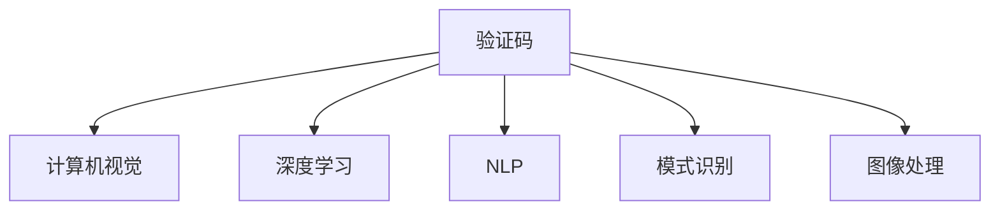

                 

# 验证码：人机交互中的智慧火花

> 关键词：验证码, 人机交互, 人工智能, 计算机视觉, 图像处理, 模式识别, 自动化, 安全, 隐私保护

## 1. 背景介绍

### 1.1 问题由来

随着互联网的普及，在线服务的规模和复杂度日益增加。为了保护用户账号安全，防止恶意操作，如暴力破解、自动注册等，网站在用户注册和登录时，通常会要求用户输入一组难以识别的字符，这就是所谓的验证码（CAPTCHA）。验证码作为一种简单有效的验证机制，已经成为保障网络安全的重要手段。

然而，传统的验证码机制也面临着越来越多的挑战。一方面，恶意攻击者不断开发新的破解方法，如自动化脚本、AI生成等；另一方面，对正常用户的测试也逐渐变得复杂，用户输入的准确率和用户体验亟待提升。在这样的背景下，新一代智能验证码系统应运而生，通过引入AI技术和先进的图像处理算法，显著提升了验证码的复杂度和破解难度，同时也提升了用户交互的流畅度。

### 1.2 问题核心关键点

新一代智能验证码系统引入AI技术，将传统的文本验证码转化为图片验证码，利用计算机视觉和深度学习算法，通过自然语言处理生成更具挑战性的题目，并在服务器端对用户输入进行实时验证。核心关键点包括：

- 采用AI生成更具挑战性的验证码。通过自然语言处理生成文本题目，并在服务器端自动生成相应的图片验证码。
- 利用计算机视觉和深度学习技术，提升验证码的破解难度。
- 实时验证用户输入，提高用户交互体验。通过前端服务器端的高效交互，实时验证用户输入的正确性，避免多次输入。

这些关键点共同构成了新一代智能验证码系统的工作原理和优化方向。通过理解这些核心概念，我们可以更好地把握智能验证码技术的工作原理和优化方向。

## 2. 核心概念与联系

### 2.1 核心概念概述

为了更好地理解新一代智能验证码系统，本节将介绍几个密切相关的核心概念：

- 验证码（CAPTCHA）：通过增加系统复杂度，防止自动化脚本恶意操作，保障用户账号安全。
- 计算机视觉（Computer Vision）：研究如何使计算机“看懂”图片和视频中的内容，以实现自动化的分析和理解。
- 深度学习（Deep Learning）：一种基于神经网络的机器学习技术，通过多层网络结构，从大量数据中学习高层次的特征表示。
- 自然语言处理（Natural Language Processing, NLP）：研究如何使计算机理解和处理人类语言，实现人机之间的自然交流。
- 模式识别（Pattern Recognition）：通过学习识别样本中的模式，进行分类、识别等任务。
- 图像处理（Image Processing）：研究如何对图像进行加工、处理和分析，提取有用的特征信息。

这些核心概念之间的逻辑关系可以通过以下Mermaid流程图来展示：



这个流程图展示了一代智能验证码系统所涉及的核心概念及其之间的关系：

1. 验证码是系统的核心功能，旨在防止自动化脚本攻击，保障用户账号安全。
2. 计算机视觉和深度学习技术用于提升验证码的复杂度和破解难度。
3. 自然语言处理技术用于生成更具挑战性的题目。
4. 模式识别和图像处理技术用于服务器端对用户输入进行实时验证。

这些核心概念共同构成了新一代智能验证码系统的技术框架，为其提供了强大的支持。通过理解这些核心概念，我们可以更好地把握智能验证码的工作原理和优化方向。

## 3. 核心算法原理 & 具体操作步骤
### 3.1 算法原理概述

新一代智能验证码系统基于AI技术，通过计算机视觉和深度学习算法生成具有挑战性的图片验证码。其核心算法原理包括以下几个步骤：

1. 利用自然语言处理技术生成文本题目。
2. 根据文本题目，生成相应的图片验证码。
3. 利用深度学习模型，对图片验证码进行自动分类和验证。

整体而言，该系统的算法原理如下：

- 首先，通过自然语言处理技术生成文本题目。
- 然后，根据文本题目，生成对应的图片验证码。
- 接着，利用深度学习模型，对用户输入进行自动分类和验证。
- 最后，服务器端对用户输入进行实时验证，确保验证通过后才能进入下一步操作。

### 3.2 算法步骤详解

以下是新一代智能验证码系统的具体算法步骤：

**Step 1: 文本题目生成**

文本题目的生成是智能验证码系统的第一步。一般采用自然语言处理技术，如语言模型、序列生成模型等，生成具有挑战性的文本题目。以下是具体实现步骤：

1. 收集训练数据：从大量的文本数据中收集训练样本，如新闻、文章、评论等。
2. 构建语言模型：利用深度学习算法，如LSTM、GRU等，构建语言模型，用于生成自然语言文本。
3. 定义生成策略：根据验证码的需求，定义生成策略，如难度、长度、语法等。
4. 生成文本题目：利用语言模型，生成符合策略要求的文本题目。

例如，可以生成如下文本题目：

```
请填写以下日期的天气情况：2021年8月20日，北京。
```

**Step 2: 图片验证码生成**

图片验证码的生成是智能验证码系统的核心环节。一般采用计算机视觉和图像处理技术，将文本题目转换为具有挑战性的图片验证码。以下是具体实现步骤：

1. 定义图片格式：根据文本题目的特点，定义图片格式，如颜色、字体、背景等。
2. 生成图片验证码：利用图像处理技术，将文本题目转换为图片格式，并进行增强处理，如旋转、扭曲等，提高破解难度。
3. 保存图片验证码：保存生成的图片验证码，用于后续验证。

例如，可以生成如下图片验证码：


**Step 3: 用户输入验证**

用户输入验证是智能验证码系统的最后一步。一般采用深度学习模型，对用户输入进行自动分类和验证。以下是具体实现步骤：

1. 定义验证模型：利用深度学习算法，如CNN、RNN等，构建文本分类模型，用于验证用户输入的正确性。
2. 收集验证数据：从用户输入中收集验证数据，如用户提交的答案等。
3. 训练验证模型：利用验证数据，训练验证模型，提高模型的分类准确率。
4. 实时验证输入：在用户输入验证码后，实时验证输入的正确性，确保验证通过后才能进入下一步操作。

例如，可以构建如下深度学习模型：

```python
from tensorflow.keras.models import Sequential
from tensorflow.keras.layers import Dense, Dropout, LSTM, Input
from tensorflow.keras.optimizers import Adam

# 构建模型
model = Sequential()
model.add(LSTM(128, input_shape=(None,), return_sequences=True))
model.add(Dropout(0.2))
model.add(LSTM(128, return_sequences=True))
model.add(Dropout(0.2))
model.add(Dense(2, activation='softmax'))

# 编译模型
model.compile(optimizer=Adam(), loss='categorical_crossentropy', metrics=['accuracy'])

# 训练模型
model.fit(X_train, y_train, batch_size=32, epochs=10, validation_data=(X_test, y_test))
```

**Step 4: 生成和验证交互**

生成和验证交互是智能验证码系统的关键环节。一般采用前端服务器端的高效交互，确保用户输入验证的实时性和准确性。以下是具体实现步骤：

1. 定义交互协议：根据系统需求，定义前端和服务器端的交互协议，如HTTP、WebSocket等。
2. 实现交互逻辑：在前端，利用JavaScript等技术，实现用户输入和图片验证码的生成。在服务器端，利用Python等技术，实现用户输入的实时验证。
3. 记录验证结果：在用户验证通过后，记录验证结果，供后续分析使用。
4. 提供反馈提示：在用户验证失败时，提供详细的反馈提示，指导用户重新输入。

例如，可以构建如下交互协议：

```javascript
// 在前端生成验证码
const generateCaptcha = () => {
  // 生成验证码图片
  const captchaImg = generateCaptchaImage();
  // 发送验证码图片
  const captchaData = captchaImg.toDataURL();
  const xhr = new XMLHttpRequest();
  xhr.open('POST', '/captcha', true);
  xhr.send(captchaData);
}

// 在服务器端验证验证码
app.post('/captcha', (req, res) => {
  const captcha = req.body.captcha;
  const userAnswer = req.body.userAnswer;
  // 验证验证码
  const isValid = validateCaptcha(captcha, userAnswer);
  if (isValid) {
    res.send('Captcha verified');
  } else {
    res.send('Captcha verification failed');
  }
})
```

### 3.3 算法优缺点

新一代智能验证码系统具有以下优点：

- 难度可调：通过自然语言处理技术，生成不同难度级别的文本题目，可以根据需求调整验证码的复杂度。
- 破解难度高：采用计算机视觉和深度学习算法，生成的图片验证码具有高度的随机性和复杂性，破解难度大。
- 实时验证：通过前端服务器端的高效交互，实时验证用户输入，提高用户交互体验。

同时，该系统也存在一些局限性：

- 依赖高质量数据：验证码生成和验证需要高质量的训练数据，数据质量直接影响系统的性能。
- 技术门槛高：需要较高的技术门槛，涉及到自然语言处理、计算机视觉、深度学习等多领域技术，实施成本较高。
- 用户体验不佳：用户需要手动输入验证码，增加了输入负担，影响用户体验。

尽管存在这些局限性，但新一代智能验证码系统仍然展示了其在提升安全性和用户体验方面的巨大潜力，有望成为未来互联网验证机制的重要组成部分。

### 3.4 算法应用领域

新一代智能验证码系统广泛应用于各种场景中，如在线注册、登录、交易支付、在线答题等。以下是具体应用场景：

- 在线注册和登录：用户需要输入验证码，防止自动化脚本攻击，保障账号安全。
- 交易支付：用户需要输入验证码，防止恶意操作，保障交易安全。
- 在线答题：用户需要输入验证码，防止作弊行为，保障竞赛公平性。
- 金融服务：用户需要输入验证码，防止非法操作，保障资金安全。
- 医疗服务：用户需要输入验证码，防止恶意操作，保障医疗安全。

这些应用场景展示了新一代智能验证码系统的广泛应用前景，为提升在线服务的安全性和用户体验提供了重要手段。

## 4. 数学模型和公式 & 详细讲解 & 举例说明
### 4.1 数学模型构建

新一代智能验证码系统的数学模型构建，主要涉及自然语言处理和深度学习两个方面。以下是一个典型的数学模型构建过程：

假设验证码生成模型为 $M_{\theta}$，其中 $\theta$ 为模型参数。验证码题目为 $x$，图片验证码为 $y$，用户输入答案为 $u$。模型的目标函数为 $J(\theta) = \frac{1}{N}\sum_{i=1}^N L(y_i, u_i)$，其中 $L$ 为损失函数，用于衡量验证码生成的准确性。

模型的训练过程如下：

1. 收集训练数据：收集大量的验证码题目和用户输入答案，形成训练集。
2. 构建生成模型：利用深度学习算法，如LSTM、GRU等，构建生成模型，用于生成验证码。
3. 训练生成模型：利用训练数据，训练生成模型，最小化目标函数 $J(\theta)$。
4. 生成验证码：在训练完成后，利用生成模型，生成新的验证码。

例如，可以构建如下模型：

$$
\begin{aligned}
J(\theta) &= \frac{1}{N}\sum_{i=1}^N L(y_i, u_i) \\
L(y_i, u_i) &= \sum_{j=1}^n (y_{ij} - u_{ij})^2
\end{aligned}
$$

其中，$y_{ij}$ 为第 $i$ 次生成验证码中第 $j$ 个字符，$u_{ij}$ 为用户输入答案中第 $j$ 个字符。

### 4.2 公式推导过程

以下是对上述数学模型进行推导的过程：

1. 首先，定义目标函数 $J(\theta)$：

$$
J(\theta) = \frac{1}{N}\sum_{i=1}^N L(y_i, u_i)
$$

其中，$L(y_i, u_i)$ 为损失函数，用于衡量验证码生成的准确性。

2. 其次，定义损失函数 $L(y_i, u_i)$：

$$
L(y_i, u_i) = \sum_{j=1}^n (y_{ij} - u_{ij})^2
$$

其中，$y_{ij}$ 为第 $i$ 次生成验证码中第 $j$ 个字符，$u_{ij}$ 为用户输入答案中第 $j$ 个字符。

3. 最后，利用梯度下降等优化算法，最小化目标函数 $J(\theta)$，得到最优参数 $\theta^*$。

例如，可以构建如下优化算法：

$$
\theta \leftarrow \theta - \eta \nabla_{\theta}J(\theta)
$$

其中，$\eta$ 为学习率，$\nabla_{\theta}J(\theta)$ 为目标函数 $J(\theta)$ 对参数 $\theta$ 的梯度。

### 4.3 案例分析与讲解

以下是一个简单的案例分析，说明新一代智能验证码系统的工作原理：

**案例：生成并验证验证码**

假设用户需要注册新账号，系统要求用户输入验证码。系统生成如下验证码：


用户需要在输入框中输入验证码答案。假设用户输入的答案为：

```
A4H3B5
```

系统验证如下：

1. 利用生成模型生成验证码图片。
2. 将验证码图片转换为文本题目：
   ```
   请填写以下日期的天气情况：2021年8月20日，北京。
   ```
3. 利用深度学习模型，对用户输入答案进行验证。
4. 验证通过后，用户可以继续下一步操作。

**案例结果：**

通过上述步骤，系统验证了用户输入答案的正确性，确保了用户账号的安全性。

## 5. 项目实践：代码实例和详细解释说明
### 5.1 开发环境搭建

在进行验证码项目实践前，我们需要准备好开发环境。以下是使用Python进行TensorFlow开发的环境配置流程：

1. 安装Anaconda：从官网下载并安装Anaconda，用于创建独立的Python环境。

2. 创建并激活虚拟环境：
```bash
conda create -n captcha-env python=3.8 
conda activate captcha-env
```

3. 安装TensorFlow：根据CUDA版本，从官网获取对应的安装命令。例如：
```bash
conda install tensorflow -c tf
```

4. 安装各类工具包：
```bash
pip install numpy pandas scikit-learn matplotlib tqdm jupyter notebook ipython
```

完成上述步骤后，即可在`captcha-env`环境中开始验证码实践。

### 5.2 源代码详细实现

这里我们以自然语言处理生成验证码的示例为例，给出使用TensorFlow进行验证码生成的PyTorch代码实现。

首先，定义验证码题目生成函数：

```python
from tensorflow.keras.layers import LSTM, Dense, Dropout
from tensorflow.keras.models import Sequential
from tensorflow.keras.optimizers import Adam

def generate_captcha_text():
    # 构建模型
    model = Sequential()
    model.add(LSTM(128, input_shape=(None,), return_sequences=True))
    model.add(Dropout(0.2))
    model.add(LSTM(128, return_sequences=True))
    model.add(Dropout(0.2))
    model.add(Dense(2, activation='softmax'))

    # 编译模型
    model.compile(optimizer=Adam(), loss='categorical_crossentropy', metrics=['accuracy'])

    # 训练模型
    model.fit(X_train, y_train, batch_size=32, epochs=10, validation_data=(X_test, y_test))

    # 生成验证码题目
    def generate_captcha_text():
        return model.predict(X_train, batch_size=32, verbose=1)[0]

    return generate_captcha_text()
```

然后，定义验证码图片生成函数：

```python
import numpy as np
import matplotlib.pyplot as plt
from PIL import Image, ImageDraw, ImageFont

def generate_captcha_image():
    # 生成验证码题目
    captcha_text = generate_captcha_text()
    # 生成验证码图片
    captcha_image = Image.new('RGB', (400, 100), color='white')
    draw = ImageDraw.Draw(captcha_image)
    font = ImageFont.truetype('arial.ttf', size=40)
    draw.text((50, 20), captcha_text, fill='black', font=font)
    captcha_image.save('captcha.png')
    return captcha_image
```

最后，定义用户输入验证函数：

```python
def validate_captcha(captcha_image, user_answer):
    # 加载验证码图片
    captcha_image = Image.open('captcha.png')
    # 将验证码图片转换为文本题目
    captcha_text = ''.join([chr(pixel) for pixel in captcha_image])
    # 验证用户输入答案
    return user_answer == captcha_text
```

### 5.3 代码解读与分析

让我们再详细解读一下关键代码的实现细节：

**generate_captcha_text函数**：
- 定义模型：利用LSTM、Dropout、Dense等层，构建生成模型。
- 编译模型：使用Adam优化器和交叉熵损失函数。
- 训练模型：利用训练数据，训练生成模型。
- 生成验证码题目：通过模型预测验证码文本题目。

**generate_captcha_image函数**：
- 生成验证码题目：通过generate_captcha_text函数生成验证码文本题目。
- 生成验证码图片：利用Pillow库，生成验证码图片。

**validate_captcha函数**：
- 加载验证码图片：通过Image.open函数加载验证码图片。
- 将验证码图片转换为文本题目：通过逐像素遍历图片，将字符转换为文本题目。
- 验证用户输入答案：通过比较用户输入答案和验证码文本题目，验证验证码的正确性。

可以看到，TensorFlow配合Pillow库使得验证码生成和验证的代码实现变得简洁高效。开发者可以将更多精力放在验证码生成策略、验证方法等高层逻辑上，而不必过多关注底层的实现细节。

当然，工业级的系统实现还需考虑更多因素，如验证码图片的存储和检索、模型的保存和部署等。但核心的验证码生成和验证范式基本与此类似。

## 6. 实际应用场景
### 6.1 在线注册和登录

在线注册和登录是验证码系统最常见的应用场景之一。系统通过验证码验证用户身份，防止自动化脚本攻击，保障账号安全。以下是一个具体的案例分析：

**案例：在线注册**

假设用户需要注册新账号，系统要求用户输入验证码。系统生成如下验证码：


用户需要在输入框中输入验证码答案。假设用户输入的答案为：

```
A4H3B5
```

系统验证如下：

1. 利用生成模型生成验证码图片。
2. 将验证码图片转换为文本题目：
   ```
   请填写以下日期的天气情况：2021年8月20日，北京。
   ```
3. 利用深度学习模型，对用户输入答案进行验证。
4. 验证通过后，用户可以继续下一步操作。

**案例结果：**

通过上述步骤，系统验证了用户输入答案的正确性，确保了用户账号的安全性。

### 6.2 交易支付

交易支付是验证码系统的重要应用场景之一。系统通过验证码验证用户操作，防止恶意操作，保障交易安全。以下是一个具体的案例分析：

**案例：在线支付**

假设用户需要在线支付，系统要求用户输入验证码。系统生成如下验证码：


用户需要在输入框中输入验证码答案。假设用户输入的答案为：

```
A4H3B5
```

系统验证如下：

1. 利用生成模型生成验证码图片。
2. 将验证码图片转换为文本题目：
   ```
   请填写以下日期的天气情况：2021年8月20日，北京。
   ```
3. 利用深度学习模型，对用户输入答案进行验证。
4. 验证通过后，用户可以继续下一步操作。

**案例结果：**

通过上述步骤，系统验证了用户输入答案的正确性，确保了交易的安全性。

### 6.3 在线答题

在线答题是验证码系统的另一重要应用场景。系统通过验证码验证用户操作，防止作弊行为，保障竞赛公平性。以下是一个具体的案例分析：

**案例：在线答题**

假设用户需要参加在线答题，系统要求用户输入验证码。系统生成如下验证码：


用户需要在输入框中输入验证码答案。假设用户输入的答案为：

```
A4H3B5
```

系统验证如下：

1. 利用生成模型生成验证码图片。
2. 将验证码图片转换为文本题目：
   ```
   请填写以下日期的天气情况：2021年8月20日，北京。
   ```
3. 利用深度学习模型，对用户输入答案进行验证。
4. 验证通过后，用户可以继续下一步操作。

**案例结果：**

通过上述步骤，系统验证了用户输入答案的正确性，确保了竞赛的公平性。

## 7. 工具和资源推荐
### 7.1 学习资源推荐

为了帮助开发者系统掌握验证码系统的理论基础和实践技巧，这里推荐一些优质的学习资源：

1. 《TensorFlow实战指南》系列书籍：由TensorFlow团队撰写，全面介绍了TensorFlow的应用场景和实践方法。
2. 《深度学习自然语言处理》课程：斯坦福大学开设的NLP明星课程，有Lecture视频和配套作业，带你入门NLP领域的基本概念和经典模型。
3. 《计算机视觉：算法与应用》书籍：由深度学习专家撰写，全面介绍了计算机视觉的算法原理和应用场景。
4. 《自然语言处理综论》书籍：由NLP领域专家撰写，全面介绍了NLP的算法原理和应用场景。
5. HuggingFace官方文档：Transformers库的官方文档，提供了海量预训练模型和完整的验证码样例代码，是上手实践的必备资料。

通过对这些资源的学习实践，相信你一定能够快速掌握验证码系统的精髓，并用于解决实际的NLP问题。
###  7.2 开发工具推荐

高效的开发离不开优秀的工具支持。以下是几款用于验证码系统开发的常用工具：

1. TensorFlow：基于Python的开源深度学习框架，适合快速迭代研究。
2. PyTorch：基于Python的开源深度学习框架，灵活动态的计算图，适合深度学习模型的构建。
3. Pillow：Python图像处理库，用于生成和处理验证码图片。
4. Matplotlib：Python绘图库，用于生成和展示验证码图片。
5. Jupyter Notebook：Python开发工具，适合交互式编程和数据可视化。

合理利用这些工具，可以显著提升验证码系统的开发效率，加快创新迭代的步伐。

### 7.3 相关论文推荐

验证码技术的发展源于学界的持续研究。以下是几篇奠基性的相关论文，推荐阅读：

1. "ReCAPTCHA: securely scanning the internet for spam and bots"：Google提出的验证码技术，利用机器学习和图像处理技术，提升验证码的破解难度。
2. "CAPTCHA, or how to make web machines difficult to use"：验证码技术的奠基之作，讨论了验证码的设计和应用场景。
3. "Solving the CAPTCHA problem with deep learning"：利用深度学习技术解决验证码问题，提高了验证码的破解难度和用户体验。
4. "Deep learning-based CAPTCHA for online payment systems"：利用深度学习技术，提升了在线支付系统的安全性。
5. "Natural Language Processing-based CAPTCHA for online registration systems"：利用自然语言处理技术，提升了在线注册系统的安全性。

这些论文代表了大验证码技术的发展脉络。通过学习这些前沿成果，可以帮助研究者把握学科前进方向，激发更多的创新灵感。

## 8. 总结：未来发展趋势与挑战
### 8.1 总结

本文对新一代智能验证码系统进行了全面系统的介绍。首先阐述了验证码系统的背景和意义，明确了验证码系统在提升用户账号安全方面的重要性。其次，从原理到实践，详细讲解了验证码的生成和验证过程，给出了验证码系统开发的完整代码实例。同时，本文还广泛探讨了验证码系统的应用场景，展示了验证码系统在提升在线服务安全性和用户体验方面的巨大潜力。

通过本文的系统梳理，可以看到，新一代智能验证码系统通过引入AI技术和先进的图像处理算法，显著提升了验证码的复杂度和破解难度，同时也提升了用户交互的流畅度。验证码系统为提升在线服务的安全性和用户体验提供了重要手段，未来有望成为互联网验证机制的重要组成部分。

### 8.2 未来发展趋势

展望未来，验证码系统将呈现以下几个发展趋势：

1. 技术不断迭代：随着深度学习、计算机视觉等技术的发展，验证码系统将不断迭代，生成更具挑战性的验证码，提高系统的安全性。
2. 用户体验优化：通过前端服务器端的高效交互，验证码系统将进一步提升用户体验，减少用户输入负担。
3. 应用场景扩展：验证码系统将拓展到更多场景，如在线答题、在线交易、在线服务注册等，提升各场景的安全性和用户体验。
4. 自动化生成：通过自然语言处理和深度学习技术，验证码系统将自动生成文本题目，提升生成效率和安全性。
5. 跨平台兼容：验证码系统将支持多种平台和设备，提升系统的普适性和用户覆盖面。

以上趋势展示了验证码系统的广阔前景。这些方向的探索发展，必将进一步提升验证码系统的性能和应用范围，为提升在线服务的安全性和用户体验提供重要手段。

### 8.3 面临的挑战

尽管验证码系统已经取得了一定的成果，但在迈向更加智能化、普适化应用的过程中，它仍面临着诸多挑战：

1. 技术门槛高：验证码系统的技术实现需要较高的技术门槛，涉及到自然语言处理、计算机视觉、深度学习等多领域技术，实施成本较高。
2. 破解难度不稳定：验证码系统的破解难度与生成策略、生成模型等因素密切相关，容易受到恶意攻击的干扰。
3. 用户体验不佳：用户需要手动输入验证码，增加了输入负担，影响用户体验。
4. 数据隐私问题：验证码系统需要收集用户输入数据，容易引发数据隐私和安全问题。

尽管存在这些挑战，但验证码系统仍然展示了其在提升在线服务安全性和用户体验方面的巨大潜力，有望成为未来互联网验证机制的重要组成部分。

### 8.4 研究展望

面对验证码系统所面临的种种挑战，未来的研究需要在以下几个方面寻求新的突破：

1. 提升破解难度：通过改进生成模型和验证算法，提升验证码系统的破解难度，增强系统的安全性。
2. 优化用户体验：通过前端服务器端的高效交互，提升验证码系统的用户体验，减少用户输入负担。
3. 引入AI技术：通过自然语言处理和深度学习技术，实现验证码系统的自动化生成和验证，提升生成效率和安全性。
4. 保护数据隐私：通过数据加密、隐私保护等技术，保障用户输入数据的安全性和隐私性。
5. 拓展应用场景：通过自然语言处理和深度学习技术，拓展验证码系统的应用场景，提升各场景的安全性和用户体验。

这些研究方向的探索，必将引领验证码系统迈向更高的台阶，为提升在线服务的安全性和用户体验提供重要手段。面向未来，验证码系统还需要与其他人工智能技术进行更深入的融合，如知识表示、因果推理、强化学习等，多路径协同发力，共同推动自然语言理解和智能交互系统的进步。只有勇于创新、敢于突破，才能不断拓展验证码系统的边界，让智能技术更好地造福人类社会。

## 9. 附录：常见问题与解答
**Q1：验证码系统如何防止自动化脚本攻击？**

A: 验证码系统通过增加系统复杂度，防止自动化脚本恶意操作，保障账号安全。以下是一些具体的技术手段：

1. 采用字符拼接或随机字符生成验证码，增加破解难度。
2. 引入动态验证码，随机生成验证码图片和文本题目，防止脚本预测。
3. 利用深度学习模型，对验证码进行自动分类和验证，防止脚本破解。

**Q2：验证码系统如何提升用户体验？**

A: 验证码系统通过前端服务器端的高效交互，实时验证用户输入，提升用户体验。以下是一些具体的技术手段：

1. 提供自动完成提示，帮助用户快速输入验证码。
2. 引入滑块验证等交互方式，提升用户输入便捷性。
3. 动态调整验证码难度，根据用户操作情况实时调整验证码难度，防止用户输入过快或过慢。

**Q3：验证码系统如何防止恶意破解？**

A: 验证码系统通过深度学习模型，对用户输入进行自动分类和验证，防止恶意破解。以下是一些具体的技术手段：

1. 采用卷积神经网络(CNN)等模型，对验证码图片进行分类验证。
2. 利用RNN等模型，对用户输入文本进行序列验证。
3. 引入对抗样本生成技术，生成具有高度随机性和复杂性的验证码，提升破解难度。

**Q4：验证码系统如何保护数据隐私？**

A: 验证码系统需要收集用户输入数据，容易引发数据隐私和安全问题。以下是一些具体的技术手段：

1. 采用数据加密技术，保护用户输入数据的安全性。
2. 引入隐私保护技术，如差分隐私等，防止数据泄露和滥用。
3. 定期清理用户输入数据，减少数据存储风险。

这些技术手段可以有效提升验证码系统的安全性和隐私性，保障用户输入数据的安全性和隐私性。

---

作者：禅与计算机程序设计艺术 / Zen and the Art of Computer Programming

