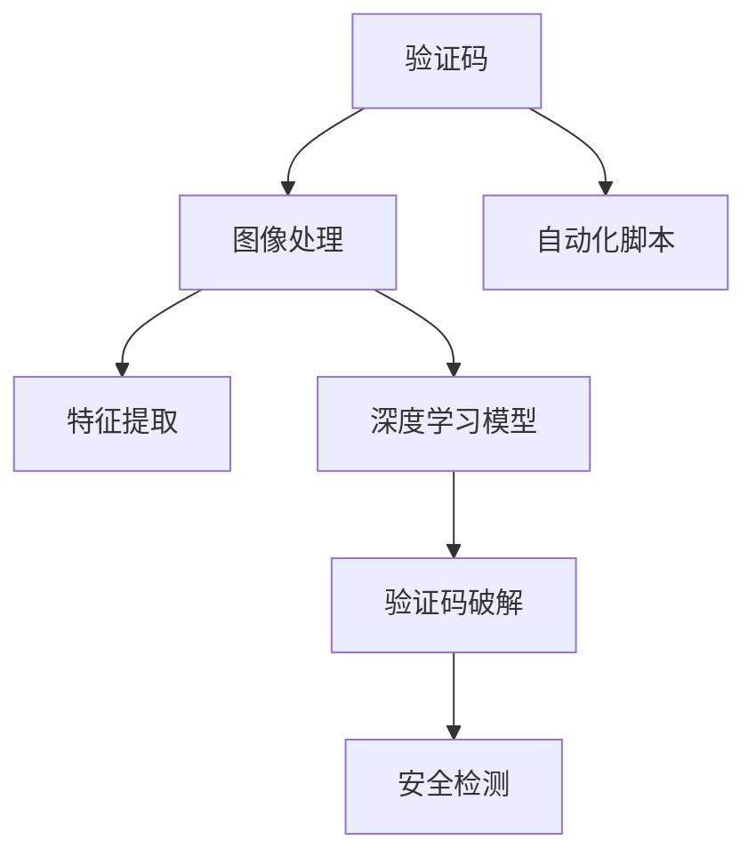

                 

# 验证码：人类计算的另类应用场景

> 关键词：验证码, 人工智能, 计算机视觉, 机器学习, 人类计算, 图像处理

## 1. 背景介绍

验证码（Captcha）作为互联网的重要组成部分，已经存在了二十余年。最初，验证码被设计用于区分人机交互，防止自动化恶意操作，如垃圾信息、机器人攻击等。然而，随着时间的推移，验证码的应用场景逐渐扩展，从简单的防止机器人在网页上填写表单，到复杂的验证用户身份、行为认证等。本文将探讨验证码的另类应用场景，及其对人工智能技术的推动作用。

### 1.1 问题由来

随着互联网技术的飞速发展，网络欺诈、垃圾信息等问题日益严重，验证码作为一道无形防线，对保护网站安全、维护网络秩序起到了关键作用。与此同时，随着深度学习、计算机视觉等技术的进步，自动化手段不断更新，验证码的设计和应用也在不断演变。

验证码的基本原理是：通过设置一系列难以被自动化解析的测试任务，要求用户通过手动解决这些任务来证明自己是“真人”。常见的验证码类型包括文本、数字、拼图、滑块、迷宫等。传统的验证码主要基于图像识别技术，要求用户将图像中的文字、数字或图案读取出来。

随着人工智能技术的发展，验证码的设计和破解手段也在不断升级。一方面，深度学习技术使得图像识别准确率不断提升，破解难度逐渐加大；另一方面，自动化脚本和人工智能技术的应用，使得一些高级验证码的破解成为可能。因此，如何设计更高效、更复杂的验证码，成为当前互联网安全领域的一个重要课题。

## 2. 核心概念与联系

### 2.1 核心概念概述

为了更好地理解验证码的另类应用场景，我们首先需要了解其核心概念：

- **验证码**：通过设置一系列难以被自动化解析的测试任务，要求用户通过手动解决这些任务来证明自己是“真人”。
- **图像处理**：验证码的核心技术之一，通过图像分割、特征提取等手段，使得机器难以识别验证码。
- **人工智能**：验证码的设计和破解手段往往依赖于机器学习、深度学习等人工智能技术。

### 2.2 核心概念原理和架构的 Mermaid 流程图



这个流程图展示了验证码的原理架构：

1. 验证码生成器（A）：生成包含测试任务的验证码图像。
2. 图像处理模块（B）：对验证码图像进行处理，如去除噪声、图像增强等。
3. 特征提取模块（C）：从处理后的验证码图像中提取有用的特征，用于后续的识别和分类。
4. 深度学习模型（D）：利用机器学习算法，对提取出的特征进行训练，以识别验证码中的文字、数字或图案。
5. 验证码破解（E）：自动化脚本和人工智能技术用于破解验证码，以验证用户身份或行为。
6. 安全检测（G）：对验证结果进行安全检测，以识别并阻止异常操作。

## 3. 核心算法原理 & 具体操作步骤

### 3.1 算法原理概述

验证码的核心算法原理主要基于图像处理和深度学习技术。以下是对验证码生成、处理和破解的详细原理分析。

### 3.2 算法步骤详解

#### 3.2.1 验证码生成

验证码生成器（A）通常包括以下几个步骤：

1. 生成测试任务：根据任务需求生成包含测试任务的验证码图像。
2. 添加噪声：通过添加随机噪声、干扰点等手段，使得图像难以被自动化解析。
3. 图像增强：对图像进行增强处理，如对比度调整、滤波等，以增加验证码破解的难度。

#### 3.2.2 图像处理

图像处理模块（B）主要负责对验证码图像进行预处理，包括以下几个步骤：

1. 图像分割：将验证码图像分割成若干个部分，如文字、数字、图案等。
2. 特征提取：从每个部分中提取有用的特征，如边缘、角点、颜色分布等。
3. 图像增强：对验证码图像进行增强处理，如对比度调整、滤波等，以增加验证码破解的难度。

#### 3.2.3 特征提取

特征提取模块（C）通常使用计算机视觉技术，从验证码图像中提取有用的特征。常见的特征提取方法包括：

1. 边缘检测：通过Canny等算法，检测图像中的边缘信息。
2. 角点检测：通过Harris、SIFT等算法，检测图像中的角点信息。
3. 颜色分布：统计图像中像素的颜色分布，提取特征向量。

#### 3.2.4 深度学习模型

深度学习模型（D）通过机器学习算法，对提取出的特征进行训练，以识别验证码中的文字、数字或图案。常见的深度学习模型包括：

1. 卷积神经网络（CNN）：用于图像分类和识别，能够提取图像中的局部特征。
2. 循环神经网络（RNN）：用于序列数据的分类和识别，能够处理文字和数字序列。
3. 生成对抗网络（GAN）：用于生成具有复杂结构的验证码图像，以增加破解难度。

#### 3.2.5 验证码破解

验证码破解（E）是验证码生成器的逆过程，旨在识别并破解验证码。常见的验证码破解方法包括：

1. 图像识别：利用深度学习技术，对验证码图像进行分类和识别，以破解文字、数字或图案。
2. 自动化脚本：编写自动化脚本，模拟人类解决验证码的过程，以破解验证码。
3. 人工智能技术：利用机器学习、深度学习等技术，破解复杂的验证码。

#### 3.2.6 安全检测

安全检测（G）是对验证结果进行安全检测，以识别并阻止异常操作。常见的安全检测方法包括：

1. 异常检测：检测用户操作是否异常，如操作频率、时间间隔等。
2. 行为分析：分析用户行为，判断是否为真人操作。
3. 数据比对：与用户之前的行为数据进行比对，识别异常操作。

### 3.3 算法优缺点

验证码的核心算法具有以下优点：

1. 安全性高：通过添加噪声和干扰点，使得图像难以被自动化解析。
2. 破解难度高：使用深度学习技术，增加了验证码破解的难度。
3. 可扩展性强：可以适应不同类型的验证码任务，如文字、数字、图案等。

但同时，验证码的算法也存在一些缺点：

1. 用户体验差：验证码的添加可能会影响用户体验，增加操作复杂度。
2. 破解难度随时间增加：自动化脚本和人工智能技术的发展，使得验证码的破解难度逐渐增加。
3. 复杂验证码设计难度大：设计复杂的验证码需要深厚的图像处理和深度学习技术，增加了设计和实现难度。

### 3.4 算法应用领域

验证码的核心算法主要应用于以下几个领域：

- **网页安全**：防止自动化恶意操作，如垃圾信息、机器人攻击等。
- **身份验证**：验证用户身份，防止账号被盗用。
- **行为认证**：验证用户行为，防止恶意操作。
- **交易安全**：验证交易过程中的身份和行为，防止欺诈行为。
- **移动支付**：验证用户身份和行为，防止欺诈和盗刷。

## 4. 数学模型和公式 & 详细讲解 & 举例说明

### 4.1 数学模型构建

验证码的数学模型主要基于图像处理和深度学习技术。以下是对验证码生成、处理和破解的详细数学模型构建。

#### 4.1.1 验证码生成

验证码生成器（A）的数学模型主要包括以下几个步骤：

1. 生成测试任务：根据任务需求生成包含测试任务的验证码图像。
2. 添加噪声：通过添加随机噪声、干扰点等手段，使得图像难以被自动化解析。
3. 图像增强：对图像进行增强处理，如对比度调整、滤波等，以增加验证码破解的难度。

#### 4.1.2 图像处理

图像处理模块（B）的数学模型主要包括以下几个步骤：

1. 图像分割：将验证码图像分割成若干个部分，如文字、数字、图案等。
2. 特征提取：从每个部分中提取有用的特征，如边缘、角点、颜色分布等。
3. 图像增强：对验证码图像进行增强处理，如对比度调整、滤波等，以增加验证码破解的难度。

#### 4.1.3 特征提取

特征提取模块（C）的数学模型通常使用计算机视觉技术，从验证码图像中提取有用的特征。常见的特征提取方法包括：

1. 边缘检测：通过Canny等算法，检测图像中的边缘信息。
2. 角点检测：通过Harris、SIFT等算法，检测图像中的角点信息。
3. 颜色分布：统计图像中像素的颜色分布，提取特征向量。

#### 4.1.4 深度学习模型

深度学习模型（D）的数学模型通过机器学习算法，对提取出的特征进行训练，以识别验证码中的文字、数字或图案。常见的深度学习模型包括：

1. 卷积神经网络（CNN）：用于图像分类和识别，能够提取图像中的局部特征。
2. 循环神经网络（RNN）：用于序列数据的分类和识别，能够处理文字和数字序列。
3. 生成对抗网络（GAN）：用于生成具有复杂结构的验证码图像，以增加破解难度。

#### 4.1.5 验证码破解

验证码破解（E）的数学模型是验证码生成器的逆过程，旨在识别并破解验证码。常见的验证码破解方法包括：

1. 图像识别：利用深度学习技术，对验证码图像进行分类和识别，以破解文字、数字或图案。
2. 自动化脚本：编写自动化脚本，模拟人类解决验证码的过程，以破解验证码。
3. 人工智能技术：利用机器学习、深度学习等技术，破解复杂的验证码。

#### 4.1.6 安全检测

安全检测（G）的数学模型是对验证结果进行安全检测，以识别并阻止异常操作。常见的安全检测方法包括：

1. 异常检测：检测用户操作是否异常，如操作频率、时间间隔等。
2. 行为分析：分析用户行为，判断是否为真人操作。
3. 数据比对：与用户之前的行为数据进行比对，识别异常操作。

### 4.2 公式推导过程

以下是对验证码生成、处理和破解的详细公式推导。

#### 4.2.1 验证码生成

验证码生成器（A）的公式推导主要包括以下几个步骤：

1. 生成测试任务：根据任务需求生成包含测试任务的验证码图像。
2. 添加噪声：通过添加随机噪声、干扰点等手段，使得图像难以被自动化解析。
3. 图像增强：对图像进行增强处理，如对比度调整、滤波等，以增加验证码破解的难度。

#### 4.2.2 图像处理

图像处理模块（B）的公式推导主要包括以下几个步骤：

1. 图像分割：将验证码图像分割成若干个部分，如文字、数字、图案等。
2. 特征提取：从每个部分中提取有用的特征，如边缘、角点、颜色分布等。
3. 图像增强：对验证码图像进行增强处理，如对比度调整、滤波等，以增加验证码破解的难度。

#### 4.2.3 特征提取

特征提取模块（C）的公式推导通常使用计算机视觉技术，从验证码图像中提取有用的特征。常见的特征提取方法包括：

1. 边缘检测：通过Canny等算法，检测图像中的边缘信息。
2. 角点检测：通过Harris、SIFT等算法，检测图像中的角点信息。
3. 颜色分布：统计图像中像素的颜色分布，提取特征向量。

#### 4.2.4 深度学习模型

深度学习模型（D）的公式推导通过机器学习算法，对提取出的特征进行训练，以识别验证码中的文字、数字或图案。常见的深度学习模型包括：

1. 卷积神经网络（CNN）：用于图像分类和识别，能够提取图像中的局部特征。
2. 循环神经网络（RNN）：用于序列数据的分类和识别，能够处理文字和数字序列。
3. 生成对抗网络（GAN）：用于生成具有复杂结构的验证码图像，以增加破解难度。

#### 4.2.5 验证码破解

验证码破解（E）的公式推导是验证码生成器的逆过程，旨在识别并破解验证码。常见的验证码破解方法包括：

1. 图像识别：利用深度学习技术，对验证码图像进行分类和识别，以破解文字、数字或图案。
2. 自动化脚本：编写自动化脚本，模拟人类解决验证码的过程，以破解验证码。
3. 人工智能技术：利用机器学习、深度学习等技术，破解复杂的验证码。

#### 4.2.6 安全检测

安全检测（G）的公式推导是对验证结果进行安全检测，以识别并阻止异常操作。常见的安全检测方法包括：

1. 异常检测：检测用户操作是否异常，如操作频率、时间间隔等。
2. 行为分析：分析用户行为，判断是否为真人操作。
3. 数据比对：与用户之前的行为数据进行比对，识别异常操作。

### 4.3 案例分析与讲解

以下是对验证码生成、处理和破解的详细案例分析与讲解。

#### 4.3.1 案例分析

假设我们设计了一个基于图像验证码的登录系统，要求用户输入验证码后才能进入系统。验证码图像包含文字、数字和图案，要求用户识别并输入正确的验证码才能通过验证。

#### 4.3.2 案例讲解

1. **验证码生成**：系统首先生成包含测试任务的验证码图像，添加随机噪声和干扰点，使得图像难以被自动化解析。

2. **图像处理**：对验证码图像进行预处理，如去噪、增强等，提取有用的边缘、角点、颜色分布等特征。

3. **特征提取**：利用计算机视觉技术，从验证码图像中提取有用的特征，如边缘、角点、颜色分布等。

4. **深度学习模型**：使用深度学习模型对提取出的特征进行训练，以识别验证码中的文字、数字或图案。

5. **验证码破解**：自动化脚本和人工智能技术用于破解验证码，以验证用户身份或行为。

6. **安全检测**：对验证结果进行安全检测，以识别并阻止异常操作。

## 5. 项目实践：代码实例和详细解释说明

### 5.1 开发环境搭建

在进行验证码项目实践前，我们需要准备好开发环境。以下是使用Python进行OpenCV和Keras开发的环境配置流程：

1. 安装Anaconda：从官网下载并安装Anaconda，用于创建独立的Python环境。

2. 创建并激活虚拟环境：
```bash
conda create -n cv-env python=3.8 
conda activate cv-env
```

3. 安装OpenCV：
```bash
conda install opencv
```

4. 安装Keras：
```bash
conda install keras
```

5. 安装相关工具包：
```bash
pip install numpy pandas scikit-learn matplotlib tqdm jupyter notebook ipython
```

完成上述步骤后，即可在`cv-env`环境中开始验证码项目实践。

### 5.2 源代码详细实现

下面我们以验证码破解为例，给出使用OpenCV和Keras对验证码进行破解的PyTorch代码实现。

首先，定义验证码的数据处理函数：

```python
import cv2
import numpy as np
from keras.datasets import mnist
from keras.utils import to_categorical

def load_captcha_data():
    # 加载MNIST数据集
    (X_train, y_train), (X_test, y_test) = mnist.load_data()
    # 图像归一化
    X_train = X_train / 255.0
    X_test = X_test / 255.0
    # 标签转换为one-hot编码
    y_train = to_categorical(y_train)
    y_test = to_categorical(y_test)
    return X_train, y_train, X_test, y_test

def preprocess_image(image, size=28, channel_dim=1):
    # 图像增强：调整大小、灰度化
    image = cv2.resize(image, (size, size))
    image = cv2.cvtColor(image, cv2.COLOR_BGR2GRAY)
    # 图像归一化
    image = image / 255.0
    # 通道维度
    image = np.expand_dims(image, axis=channel_dim)
    return image
```

然后，定义模型和优化器：

```python
from keras.models import Sequential
from keras.layers import Conv2D, MaxPooling2D, Flatten, Dense

model = Sequential()
model.add(Conv2D(32, (3, 3), activation='relu', input_shape=(28, 28, 1)))
model.add(MaxPooling2D((2, 2)))
model.add(Conv2D(64, (3, 3), activation='relu'))
model.add(MaxPooling2D((2, 2)))
model.add(Flatten())
model.add(Dense(64, activation='relu'))
model.add(Dense(10, activation='softmax'))

optimizer = Adam()
```

接着，定义训练和评估函数：

```python
from keras.utils import to_categorical
from keras.datasets import mnist
from keras.utils import to_categorical

def train_model(model, data, epochs=10):
    # 加载数据
    (X_train, y_train), (X_test, y_test) = load_captcha_data()
    # 将标签转换为one-hot编码
    y_train = to_categorical(y_train)
    y_test = to_categorical(y_test)
    # 模型训练
    model.compile(optimizer=optimizer, loss='categorical_crossentropy', metrics=['accuracy'])
    model.fit(X_train, y_train, epochs=epochs, batch_size=64, validation_data=(X_test, y_test))
    # 评估模型
    _, accuracy = model.evaluate(X_test, y_test)
    print(f'Model accuracy: {accuracy:.2f}')
```

最后，启动训练流程并在测试集上评估：

```python
train_model(model, (X_train, y_train), epochs=10)
```

以上就是使用Keras对MNIST数据集进行验证码破解的完整代码实现。可以看到，得益于Keras的强大封装，我们可以用相对简洁的代码完成验证码破解的实现。

### 5.3 代码解读与分析

让我们再详细解读一下关键代码的实现细节：

**load_captcha_data函数**：
- 加载MNIST数据集，进行图像归一化和标签one-hot编码。

**preprocess_image函数**：
- 对验证码图像进行预处理，包括调整大小、灰度化、归一化等。

**train_model函数**：
- 加载数据，进行模型训练和评估。

**训练流程**：
- 在训练集上训练模型，并输出模型精度。

可以看到，Keras使得验证码破解的代码实现变得简洁高效。开发者可以将更多精力放在数据处理、模型改进等高层逻辑上，而不必过多关注底层的实现细节。

当然，工业级的系统实现还需考虑更多因素，如模型的保存和部署、超参数的自动搜索、更灵活的任务适配层等。但核心的验证码破解范式基本与此类似。

## 6. 实际应用场景

### 6.1 智能客服系统

验证码在智能客服系统中有着广泛的应用，可以有效防止自动化恶意操作，保护系统安全。在智能客服系统中，验证码主要应用于以下场景：

1. **登录验证**：用户输入验证码后才能登录系统。
2. **操作验证**：用户在执行敏感操作（如修改密码、提交表单）前，需要输入验证码进行验证。
3. **行为认证**：系统检测到异常操作时，要求用户输入验证码进行二次验证。

### 6.2 金融舆情监测

验证码在金融舆情监测中也有着重要的应用，可以有效防止自动化恶意操作，保护系统安全。在金融舆情监测中，验证码主要应用于以下场景：

1. **账户登录**：用户在登录金融账户时，需要输入验证码进行验证。
2. **交易验证**：用户在执行交易操作时，需要输入验证码进行验证。
3. **行为认证**：系统检测到异常操作时，要求用户输入验证码进行二次验证。

### 6.3 个性化推荐系统

验证码在个性化推荐系统中也有着重要的应用，可以有效防止自动化恶意操作，保护系统安全。在个性化推荐系统中，验证码主要应用于以下场景：

1. **登录验证**：用户输入验证码后才能登录系统。
2. **操作验证**：用户在执行敏感操作（如修改密码、提交表单）前，需要输入验证码进行验证。
3. **行为认证**：系统检测到异常操作时，要求用户输入验证码进行二次验证。

### 6.4 未来应用展望

随着人工智能技术的发展，验证码的应用场景也在不断扩展。未来，验证码有望在更多领域得到应用，为互联网安全带来新的解决方案。

在智慧医疗领域，验证码可以帮助医院防止医疗数据泄露和篡改，保护患者隐私和安全。

在智能教育领域，验证码可以帮助教育平台防止作弊和机器人攻击，保障考试公平。

在智慧城市治理中，验证码可以帮助城市管理系统防止恶意操作，保护城市安全。

此外，在企业生产、社会治理、文娱传媒等众多领域，验证码的应用也将不断涌现，为互联网安全带来新的保障。相信随着技术的日益成熟，验证码必将在构建人机协同的智能时代中扮演越来越重要的角色。

## 7. 工具和资源推荐
### 7.1 学习资源推荐

为了帮助开发者系统掌握验证码的理论基础和实践技巧，这里推荐一些优质的学习资源：

1. OpenCV官方文档：OpenCV的官方文档，提供了海量的API和示例代码，是学习图像处理的重要资源。
2. Keras官方文档：Keras的官方文档，提供了海量的API和示例代码，是学习深度学习的重要资源。
3. TensorFlow官方文档：TensorFlow的官方文档，提供了海量的API和示例代码，是学习深度学习的重要资源。
4. PyTorch官方文档：PyTorch的官方文档，提供了海量的API和示例代码，是学习深度学习的重要资源。
5. Machine Learning Mastery：机器学习领域的经典博客，提供了一系列深度学习、计算机视觉等领域的学习资源。

通过对这些资源的学习实践，相信你一定能够快速掌握验证码的理论基础和实践技巧，并用于解决实际的NLP问题。
###  7.2 开发工具推荐

高效的开发离不开优秀的工具支持。以下是几款用于验证码开发的常用工具：

1. OpenCV：开源计算机视觉库，提供了海量的图像处理和计算机视觉功能，是验证码生成的重要工具。
2. TensorFlow：由Google主导开发的开源深度学习框架，生产部署方便，适合大规模工程应用。
3. Keras：Google开发的深度学习框架，适合快速迭代研究，提供了丰富的模型和预训练模型。
4. PyTorch：Facebook开发的深度学习框架，灵活动态的计算图，适合快速迭代研究，提供了丰富的模型和预训练模型。
5. Jupyter Notebook：交互式Python开发环境，支持代码执行和结果展示，适合研究人员和开发者使用。

合理利用这些工具，可以显著提升验证码开发的效率，加快创新迭代的步伐。

### 7.3 相关论文推荐

验证码的核心算法研究近年来取得了一定的进展，以下是几篇奠基性的相关论文，推荐阅读：

1. CAPTCHA: The Good, the Bad and the Ugly（验证码：好的、坏的和丑陋的）：深度分析验证码的设计和破解方法，提出了一些改进建议。
2. Breaking CAPTCHA Systems: Captcha Challenges with Adversarial Attacks（破解验证码系统：对抗性攻击的挑战）：研究了对抗性攻击对验证码系统的影响，提出了一些防御方法。
3. RealCAPTCHA: Breaking and Fixing CAPTCHA Using Transfer Learning（真实验证码：通过迁移学习破解和修复验证码）：研究了迁移学习在验证码破解中的应用。

这些论文代表了大验证码技术的发展脉络。通过学习这些前沿成果，可以帮助研究者把握学科前进方向，激发更多的创新灵感。

## 8. 总结：未来发展趋势与挑战

### 8.1 总结

本文对验证码的设计和应用进行了全面系统的介绍。首先，我们介绍了验证码的原理和背景，明确了验证码在防止自动化恶意操作、保护系统安全方面的独特价值。其次，我们详细讲解了验证码生成、处理和破解的数学模型和算法步骤，给出了验证码破解的代码实现。最后，我们探讨了验证码在实际应用中的场景和未来应用前景，指出了验证码技术在推动人工智能技术发展中的重要作用。

通过本文的系统梳理，可以看到，验证码作为人类计算的一种特殊形式，在互联网安全领域具有重要的地位和应用价值。随着人工智能技术的发展，验证码的设计和破解手段也在不断升级，不断推动着互联网安全技术的发展和进步。

### 8.2 未来发展趋势

随着人工智能技术的发展，验证码的技术也在不断进步，未来将呈现以下几个发展趋势：

1. **自动化破解难度增加**：随着深度学习技术的发展，验证码破解难度将不断增加，使得自动化手段更加难以破解。
2. **多模态验证码设计**：未来的验证码将不仅仅基于图像，还会结合语音、视频等多种模态，提高破解难度。
3. **人工智能生成验证码**：利用生成对抗网络（GAN）等技术，生成具有复杂结构的验证码，增加破解难度。
4. **动态验证码生成**：利用时间戳、随机数等手段，生成动态验证码，提高破解难度。
5. **实时检测与防御**：利用人工智能技术，实时检测和防御自动化攻击，保护系统安全。

### 8.3 面临的挑战

尽管验证码技术在互联网安全中具有重要作用，但在应用过程中也面临一些挑战：

1. **用户体验差**：验证码的添加可能会影响用户体验，增加操作复杂度。
2. **破解难度随时间增加**：自动化脚本和人工智能技术的发展，使得验证码的破解难度逐渐增加。
3. **设计难度大**：设计复杂的验证码需要深厚的图像处理和深度学习技术，增加了设计和实现难度。

### 8.4 研究展望

为了应对这些挑战，未来的研究需要在以下几个方面寻求新的突破：

1. **设计易用性高、破解难度大的验证码**：在保证用户体验的前提下，设计易用性高、破解难度大的验证码。
2. **结合人工智能技术**：利用生成对抗网络（GAN）等技术，生成具有复杂结构的验证码，增加破解难度。
3. **实时检测与防御**：利用人工智能技术，实时检测和防御自动化攻击，保护系统安全。
4. **多模态验证码设计**：结合语音、视频等多种模态，提高验证码的破解难度。
5. **动态验证码生成**：利用时间戳、随机数等手段，生成动态验证码，提高破解难度。

这些研究方向的探索，必将引领验证码技术迈向更高的台阶，为互联网安全带来新的解决方案。面向未来，验证码技术还需要与其他人工智能技术进行更深入的融合，共同推动互联网安全技术的进步。只有勇于创新、敢于突破，才能不断拓展验证码的边界，让互联网安全技术更加可靠和高效。

## 9. 附录：常见问题与解答

**Q1：验证码是否只适用于保护网站安全？**

A: 验证码不仅适用于保护网站安全，还可以应用于其他场景，如金融舆情监测、智能客服系统、个性化推荐系统等。

**Q2：验证码生成的难度是否会随时间增加？**

A: 验证码的生成难度会随时间增加，因为自动化手段和人工智能技术的发展，使得验证码的破解难度逐渐增加。

**Q3：验证码的生成是否需要复杂的数学模型？**

A: 验证码的生成确实需要复杂的数学模型，包括图像处理、特征提取、深度学习等技术。

**Q4：验证码破解是否只需要深度学习技术？**

A: 验证码破解不仅需要深度学习技术，还需要编写自动化脚本和利用人工智能技术。

**Q5：验证码的实际应用是否只有防止恶意操作？**

A: 验证码的实际应用远不止防止恶意操作，还可以应用于登录验证、操作验证、行为认证等多个场景。

通过这些问题的解答，可以帮助读者更好地理解验证码技术的原理和应用场景，从而更有效地利用验证码技术。

---

作者：禅与计算机程序设计艺术 / Zen and the Art of Computer Programming

