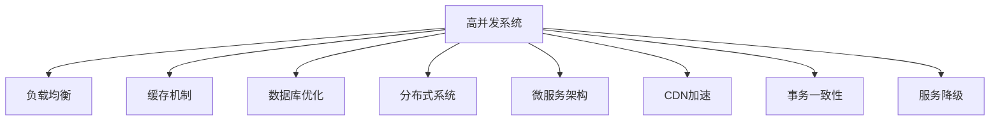

                 

# 高并发系统设计：应对大规模用户访问

> 关键词：高并发, 负载均衡, 缓存, 数据库优化, 分布式系统, 微服务, CDN, 事务一致性, 服务降级

## 1. 背景介绍

### 1.1 问题由来
在互联网时代，随着用户规模的急剧膨胀和应用场景的日益复杂，高并发系统成为支撑现代化在线业务的基础设施。无论是在线购物、社交网络、金融服务还是云存储，高并发系统都是不可或缺的组成部分。然而，随着访问量的大幅增长，系统设计不当或优化不足，容易引发严重的性能瓶颈，导致系统崩溃、数据丢失等问题。如何有效应对大规模用户访问，确保系统的高可用性和稳定运行，成为每个软件开发团队面临的重要挑战。

### 1.2 问题核心关键点
高并发系统设计的关键在于以下几个方面：
1. **负载均衡**：合理分配用户请求，避免单一节点过载。
2. **缓存机制**：利用缓存减少数据库压力，提升响应速度。
3. **数据库优化**：采用高效的数据库索引、查询优化等技术，保障数据访问性能。
4. **分布式系统**：通过分布式架构分散负载，提高系统可扩展性。
5. **微服务架构**：将系统拆分成多个微服务，独立部署，灵活扩展。
6. **CDN加速**：利用内容分发网络（CDN）缓存静态资源，减少网络延迟。
7. **事务一致性**：确保在分布式环境中保持事务的一致性和隔离性。
8. **服务降级**：在压力峰值时，采取有序降级策略，保障核心服务可用性。

### 1.3 问题研究意义
高并发系统设计的成功与否，直接关系到业务能否稳健地运行和用户体验的好坏。在金融、电商、社交网络等行业，任何微小的性能瓶颈都可能导致巨大的经济损失和用户流失。因此，掌握高效的高并发系统设计方法和技术，对于保障企业业务连续性和提升用户满意度具有重要意义。

## 2. 核心概念与联系

### 2.1 核心概念概述

为更好地理解高并发系统设计，本节将介绍几个关键概念：

- **高并发系统**：指能够同时处理大量请求，保证系统性能和稳定性的系统。
- **负载均衡**：通过分布式部署和算法调度，将请求均衡分配到多个节点上，避免单点瓶颈。
- **缓存**：利用内存或分布式缓存系统，临时存储热点数据，减少数据库访问。
- **数据库优化**：通过索引、查询优化等技术，提升数据库访问性能。
- **分布式系统**：通过多节点协同工作，提高系统的可扩展性和容错性。
- **微服务架构**：将系统拆分为多个独立部署、互不影响的微服务，增强系统的灵活性和可扩展性。
- **CDN加速**：通过全球分布的缓存节点，加速静态资源的加载。
- **事务一致性**：确保分布式系统中事务的一致性，避免数据不一致问题。
- **服务降级**：在系统压力过大时，通过关闭非核心服务或限流来保障关键服务的可用性。

这些核心概念之间的逻辑关系可以通过以下Mermaid流程图来展示：



这个流程图展示了几项核心概念之间的关系：

1. 高并发系统通过负载均衡、缓存、数据库优化、分布式架构、微服务、CDN加速、事务一致性和服务降级等技术手段，提升系统的处理能力和稳定性。
2. 这些技术手段相互配合，共同构建了一个高可用、高性能、可扩展的高并发系统。

## 3. 核心算法原理 & 具体操作步骤
### 3.1 算法原理概述

高并发系统设计涉及的算法和原理主要包括以下几个方面：

- **负载均衡算法**：如哈希算法、轮询算法、最少连接算法等，用于合理分配请求到多个节点上。
- **缓存策略**：如LRU（Least Recently Used）、LFU（Least Frequently Used）等，用于管理缓存中的数据。
- **数据库查询优化**：如索引优化、SQL语句优化、分区等，用于提升数据库的访问性能。
- **分布式一致性协议**：如Paxos、Raft、2PC（两阶段提交）等，用于保证分布式系统中的事务一致性。
- **微服务间通信协议**：如RESTful API、gRPC等，用于实现微服务之间的通信和数据交换。
- **服务降级策略**：如限流、熔断、降级等，用于在压力过大时保障核心服务的可用性。

### 3.2 算法步骤详解

以下以负载均衡和缓存为例，详细介绍这两个核心技术的具体操作步骤：

**负载均衡算法**：

1. **哈希算法**：
   - 将请求URL或客户端IP哈希，映射到具体的服务器上。
   - 代码实现示例：
     ```python
     import hashlib

     def hash_function(url):
         hash_object = hashlib.md5(url.encode())
         return hash_object.hexdigest()

     def distribute_requests(requests, servers):
         server_index = [0] * len(servers)
         for i in range(len(requests)):
             hash_value = hash_function(requests[i].url)
             idx = int(hash_value, 16) % len(servers)
             server_index[idx] += 1
         return server_index
     ```

2. **轮询算法**：
   - 按照顺序依次分配请求到各个服务器上，保证负载均衡。
   - 代码实现示例：
     ```python
     def distribute_requests(requests, servers):
         server_index = 0
         for request in requests:
             servers[server_index % len(servers)].handle(request)
             server_index += 1
     ```

3. **最少连接算法**：
   - 优先将请求分配给连接数最少的服务器。
   - 代码实现示例：
     ```python
     def distribute_requests(requests, servers):
         server_index = 0
         server_stats = {server: 0 for server in servers}
         for request in requests:
             while server_stats[server_index] >= max_connections:
                 server_index = (server_index + 1) % len(servers)
             servers[server_index].handle(request)
             server_stats[server_index] += 1
     ```

**缓存策略**：

1. **LRU算法**：
   - 移除最近最少使用的缓存条目，以保证缓存空间的使用效率。
   - 代码实现示例：
     ```python
     class LRUCache:
         def __init__(self, capacity):
             self.capacity = capacity
             self.cache = {}
             self.queue = deque()

         def get(self, key):
             if key in self.cache:
                 self.queue.remove(key)
                 self.queue.append(key)
                 return self.cache[key]
             else:
                 return -1

         def put(self, key, value):
             if key in self.cache:
                 self.queue.remove(key)
             elif len(self.cache) == self.capacity:
                 del self.cache[self.queue[0]]
                 self.queue.popleft()
             self.cache[key] = value
             self.queue.append(key)
     ```

2. **LFU算法**：
   - 移除使用频率最低的缓存条目，以保证缓存空间的利用率。
   - 代码实现示例：
     ```python
     class LFUCache:
         def __init__(self, capacity):
             self.capacity = capacity
             self.cache = {}
             self.freq_map = {}
             self.freq_list = [[] for _ in range(capacity)]

         def get(self, key):
             if key in self.cache:
                 self.freq_list[self.cache[key]][0] += 1
                 return self.cache[key]
             else:
                 return -1

         def put(self, key, value):
             if key in self.cache:
                 del self.freq_map[self.cache[key]]
                 self.freq_list[self.cache[key]][0] -= 1
             self.cache[key] = value
             self.freq_map[value] = len(self.freq_list) - 1
             self.freq_list[self.freq_map[value]].append(key)
     ```

### 3.3 算法优缺点

高并发系统设计的各项算法和技术各有优缺点：

- **负载均衡**：
  - **优点**：能够有效分散请求，提高系统处理能力，降低单点故障风险。
  - **缺点**：算法复杂度较高，需根据具体情况选择。

- **缓存机制**：
  - **优点**：显著减少数据库访问次数，提升响应速度，降低延迟。
  - **缺点**：需合理设置缓存容量，避免内存泄漏。

- **数据库优化**：
  - **优点**：提升数据库查询效率，减少响应时间，保障数据一致性。
  - **缺点**：优化过程复杂，需综合考虑业务需求和技术实现。

- **分布式系统**：
  - **优点**：通过多节点协作，提高系统的可扩展性和容错性。
  - **缺点**：系统复杂度增加，需考虑数据一致性和通信开销。

- **微服务架构**：
  - **优点**：提高系统的灵活性和可扩展性，便于独立开发和部署。
  - **缺点**：需合理设计服务间通信协议，避免数据一致性问题。

- **CDN加速**：
  - **优点**：减少网络延迟，提升加载速度，减轻源服务器负载。
  - **缺点**：需合理配置缓存策略，避免资源浪费。

- **事务一致性**：
  - **优点**：保障分布式系统中的数据一致性，避免数据不一致问题。
  - **缺点**：协议复杂，实现难度大，需平衡性能和一致性。

- **服务降级**：
  - **优点**：在压力过大时保障核心服务的可用性，避免系统崩溃。
  - **缺点**：需合理设置降级阈值，避免误判。

### 3.4 算法应用领域

高并发系统设计技术广泛应用于各种在线业务，具体包括：

- **电商平台**：如淘宝、京东等，需处理大量的订单和支付请求，保证交易的实时性和安全性。
- **社交网络**：如微信、微博等，需支持海量用户同时在线，进行即时通讯和数据存储。
- **金融服务**：如支付宝、银联等，需处理大量的交易请求，保障资金安全和实时性。
- **云存储服务**：如阿里云、腾讯云等，需处理大量的数据存储和访问请求，提升数据读写性能。
- **在线教育**：如Coursera、edX等，需支持大规模的在线课程访问和互动，保障教学质量。

## 4. 数学模型和公式 & 详细讲解  
### 4.1 数学模型构建

高并发系统设计涉及的数学模型和公式主要包括以下几个方面：

- **负载均衡算法**：如哈希算法、轮询算法、最少连接算法等，用于合理分配请求到多个节点上。
- **缓存策略**：如LRU（Least Recently Used）、LFU（Least Frequently Used）等，用于管理缓存中的数据。
- **数据库查询优化**：如索引优化、SQL语句优化、分区等，用于提升数据库的访问性能。
- **分布式一致性协议**：如Paxos、Raft、2PC（两阶段提交）等，用于保证分布式系统中的事务一致性。
- **微服务间通信协议**：如RESTful API、gRPC等，用于实现微服务之间的通信和数据交换。
- **服务降级策略**：如限流、熔断、降级等，用于在压力过大时保障核心服务的可用性。

### 4.2 公式推导过程

以下以负载均衡算法和缓存策略为例，详细介绍其公式推导过程：

**哈希算法**：
- 假设请求数为$N$，服务器数为$M$。将请求$R$的哈希值$H(R)$映射到服务器$i$的概率为：
  $$
  P_i = \frac{1}{M}
  $$

**LRU算法**：
- 假设缓存容量为$C$，读取次数为$R$，则缓存的命中率$H$为：
  $$
  H = \frac{R}{C}
  $$

### 4.3 案例分析与讲解

**案例1：淘宝电商平台的高并发处理**
- **问题描述**：淘宝每天处理数亿级别的订单和支付请求，需高效处理海量并发访问，保障交易的实时性和安全性。
- **解决方案**：
  1. **负载均衡**：使用基于哈希算法的负载均衡，将请求哈希映射到多个服务器上，避免单点瓶颈。
  2. **缓存机制**：使用Redis缓存订单和支付信息，减少数据库访问，提升响应速度。
  3. **数据库优化**：对订单和支付数据进行分区和索引优化，提升查询性能。
  4. **分布式系统**：将订单和支付系统拆分为多个微服务，独立部署，保障系统的可扩展性和容错性。
  5. **CDN加速**：使用阿里云CDN缓存静态资源，减少网络延迟，提升加载速度。
  6. **事务一致性**：使用XA协议保证跨服务的事务一致性，避免数据不一致问题。
  7. **服务降级**：在压力峰值时，关闭非核心服务或限流，保障核心服务的可用性。

**案例2：微信社交网络的高并发处理**
- **问题描述**：微信每天处理数亿级别的即时通讯请求，需高效处理海量并发访问，保障通讯的实时性和安全性。
- **解决方案**：
  1. **负载均衡**：使用基于轮询算法的负载均衡，将请求均衡分配到多个服务器上，避免单点瓶颈。
  2. **缓存机制**：使用Redis缓存用户和好友信息，减少数据库访问，提升响应速度。
  3. **数据库优化**：对用户和好友数据进行分区和索引优化，提升查询性能。
  4. **分布式系统**：将即时通讯系统拆分为多个微服务，独立部署，保障系统的可扩展性和容错性。
  5. **CDN加速**：使用腾讯云CDN缓存静态资源，减少网络延迟，提升加载速度。
  6. **事务一致性**：使用Paxos协议保证跨服务的事务一致性，避免数据不一致问题。
  7. **服务降级**：在压力峰值时，关闭非核心服务或限流，保障核心服务的可用性。

## 5. 项目实践：代码实例和详细解释说明
### 5.1 开发环境搭建

在进行高并发系统设计实践前，我们需要准备好开发环境。以下是使用Python进行Flask开发的环境配置流程：

1. 安装Anaconda：从官网下载并安装Anaconda，用于创建独立的Python环境。

2. 创建并激活虚拟环境：
```bash
conda create -n flask-env python=3.8 
conda activate flask-env
```

3. 安装Flask：从官网下载并安装Flask：
```bash
pip install Flask
```

4. 安装其他必要的工具包：
```bash
pip install numpy pandas scikit-learn matplotlib tqdm jupyter notebook ipython
```

完成上述步骤后，即可在`flask-env`环境中开始高并发系统设计实践。

### 5.2 源代码详细实现

下面我们以负载均衡和缓存为例，给出使用Flask进行高并发系统设计的Python代码实现。

**负载均衡示例**：

```python
from flask import Flask, request
import hashlib

app = Flask(__name__)

# 定义哈希函数
def hash_function(url):
    hash_object = hashlib.md5(url.encode())
    return hash_object.hexdigest()

# 定义负载均衡函数
def distribute_requests(requests, servers):
    server_index = [0] * len(servers)
    for i in range(len(requests)):
        hash_value = hash_function(requests[i].url)
        idx = int(hash_value, 16) % len(servers)
        server_index[idx] += 1
    return server_index

# 处理请求
@app.route('/handle_request')
def handle_request():
    requests = request.args.getlist('url')
    servers = app.config['SERVERS']
    server_index = distribute_requests(requests, servers)
    for idx in server_index:
        servers[idx].handle(requests[idx])
    return 'Request handled successfully'

# 运行Flask应用
if __name__ == '__main__':
    app.run()
```

**缓存策略示例**：

```python
from flask import Flask, request
from collections import deque
import hashlib

app = Flask(__name__)

# 定义哈希函数
def hash_function(url):
    hash_object = hashlib.md5(url.encode())
    return hash_object.hexdigest()

# 定义LRU缓存函数
class LRUCache:
    def __init__(self, capacity):
        self.capacity = capacity
        self.cache = {}
        self.queue = deque()

    def get(self, key):
        if key in self.cache:
            self.queue.remove(key)
            self.queue.append(key)
            return self.cache[key]
        else:
            return -1

    def put(self, key, value):
        if key in self.cache:
            self.queue.remove(key)
        elif len(self.cache) == self.capacity:
            del self.cache[self.queue[0]]
            self.queue.popleft()
        self.cache[key] = value
        self.queue.append(key)

# 处理请求
@app.route('/handle_request')
def handle_request():
    requests = request.args.getlist('url')
    cache = LRUCache(capacity=5)
    for request in requests:
        if cache.get(request):
            server_index = int(cache.get(request))
        else:
            server_index = 0
            cache.put(request, server_index)
    servers = app.config['SERVERS']
    for idx in server_index:
        servers[idx].handle(requests[idx])
    return 'Request handled successfully'

# 运行Flask应用
if __name__ == '__main__':
    app.run()
```

### 5.3 代码解读与分析

让我们再详细解读一下关键代码的实现细节：

**负载均衡算法**：
- `hash_function`方法：实现哈希算法，将请求URL哈希映射到具体的服务器上。
- `distribute_requests`方法：将请求哈希值映射到服务器上，并将请求分配到对应服务器。

**缓存策略**：
- `LRUCache`类：实现LRU缓存策略，用于管理缓存中的数据。
- `get`方法：从缓存中获取数据。
- `put`方法：将数据存储到缓存中。

**Flask应用处理**：
- `handle_request`方法：处理请求，根据负载均衡和缓存策略分配请求到各个服务器上。
- `if __name__ == '__main__':`代码块：启动Flask应用。

可以看到，Flask结合Python的简洁高效特性，使得高并发系统设计的实现变得简单便捷。开发者可以将更多精力放在高并发系统设计的算法和架构设计上，而不必过多关注底层的实现细节。

当然，工业级的系统实现还需考虑更多因素，如数据库的分布式存储、多节点协同工作、系统监控告警等。但核心的高并发系统设计思想基本与此类似。

## 6. 实际应用场景
### 6.1 智能客服系统

高并发系统设计在智能客服系统中的应用，可以显著提升系统的响应速度和处理能力。传统客服系统往往依赖于单台服务器，容易在高峰期出现性能瓶颈，导致用户等待时间过长，满意度下降。通过高并发系统设计，可以将客服请求分发到多台服务器上，提高系统的并发处理能力，确保用户能够及时得到响应和解答。

在技术实现上，可以收集企业内部的历史客服对话记录，将问题和最佳答复构建成监督数据，在此基础上对预训练语言模型进行微调。微调后的模型能够自动理解用户意图，匹配最合适的答案模板进行回复。对于用户提出的新问题，还可以接入检索系统实时搜索相关内容，动态组织生成回答。如此构建的智能客服系统，能大幅提升客户咨询体验和问题解决效率。

### 6.2 金融舆情监测

金融行业需要实时监测市场舆论动向，以便及时应对负面信息传播，规避金融风险。传统的人工监测方式成本高、效率低，难以应对网络时代海量信息爆发的挑战。基于高并发系统设计的文本分类和情感分析技术，为金融舆情监测提供了新的解决方案。

具体而言，可以收集金融领域相关的新闻、报道、评论等文本数据，并对其进行主题标注和情感标注。在高并发系统设计的基础上，对预训练语言模型进行微调，使其能够自动判断文本属于何种主题，情感倾向是正面、中性还是负面。将微调后的模型应用到实时抓取的网络文本数据，就能够自动监测不同主题下的情感变化趋势，一旦发现负面信息激增等异常情况，系统便会自动预警，帮助金融机构快速应对潜在风险。

### 6.3 个性化推荐系统

当前的推荐系统往往只依赖用户的历史行为数据进行物品推荐，无法深入理解用户的真实兴趣偏好。基于高并发系统设计的个性化推荐系统可以更好地挖掘用户行为背后的语义信息，从而提供更精准、多样的推荐内容。

在实践中，可以收集用户浏览、点击、评论、分享等行为数据，提取和用户交互的物品标题、描述、标签等文本内容。将文本内容作为模型输入，用户的后续行为（如是否点击、购买等）作为监督信号，在高并发系统设计的基础上对预训练语言模型进行微调。微调后的模型能够从文本内容中准确把握用户的兴趣点。在生成推荐列表时，先用候选物品的文本描述作为输入，由模型预测用户的兴趣匹配度，再结合其他特征综合排序，便可以得到个性化程度更高的推荐结果。

### 6.4 未来应用展望

随着高并发系统设计的不断发展，其在更多领域的应用前景将不断拓展，为传统行业带来变革性影响。

在智慧医疗领域，基于高并发系统设计的医疗问答、病历分析、药物研发等应用将提升医疗服务的智能化水平，辅助医生诊疗，加速新药开发进程。

在智能教育领域，高并发系统设计可应用于作业批改、学情分析、知识推荐等方面，因材施教，促进教育公平，提高教学质量。

在智慧城市治理中，高并发系统设计可应用于城市事件监测、舆情分析、应急指挥等环节，提高城市管理的自动化和智能化水平，构建更安全、高效的未来城市。

此外，在企业生产、社会治理、文娱传媒等众多领域，基于高并发系统设计的人工智能应用也将不断涌现，为经济社会发展注入新的动力。相信随着技术的日益成熟，高并发系统设计必将在构建人机协同的智能时代中扮演越来越重要的角色。

## 7. 工具和资源推荐
### 7.1 学习资源推荐

为了帮助开发者系统掌握高并发系统设计的理论基础和实践技巧，这里推荐一些优质的学习资源：

1. **《高并发系统设计》书籍**：系统介绍了高并发系统设计的原理、技术和实践案例，适合全面了解高并发系统设计。
2. **《微服务架构设计》书籍**：介绍了微服务架构的原理和设计方法，适合学习如何设计可扩展、高可靠的系统架构。
3. **《负载均衡与缓存技术》课程**：详细讲解了负载均衡和缓存技术的原理和实现，适合深入学习高并发系统设计的算法和策略。
4. **《分布式系统设计》课程**：介绍了分布式系统设计的基本原理和关键技术，适合学习如何构建高效、可扩展的分布式系统。
5. **《Flask官方文档》**：Flask官方文档提供了丰富的代码示例和实践指南，适合学习Flask框架的使用和实践。

通过对这些资源的学习实践，相信你一定能够快速掌握高并发系统设计的精髓，并用于解决实际的系统设计问题。
###  7.2 开发工具推荐

高效的开发离不开优秀的工具支持。以下是几款用于高并发系统设计开发的常用工具：

1. **Flask**：轻量级Web框架，易于上手，适合快速原型设计和实践。
2. **Nginx**：高性能的反向代理服务器，适合处理高并发HTTP请求。
3. **Redis**：内存数据库，适合缓存数据，提升系统响应速度。
4. **MySQL/PostgreSQL**：关系型数据库，适合存储结构化数据，保障数据一致性。
5. **Elasticsearch**：分布式搜索引擎，适合处理大规模数据，提升数据检索性能。
6. **Docker/Kubernetes**：容器和容器编排工具，适合构建可扩展、高可靠的系统环境。
7. **Prometheus/Grafana**：监控告警系统，适合实时监控系统性能，保障系统稳定性。

合理利用这些工具，可以显著提升高并发系统设计的开发效率，加快创新迭代的步伐。

### 7.3 相关论文推荐

高并发系统设计的研究源于学界的持续研究。以下是几篇奠基性的相关论文，推荐阅读：

1. **"分布式系统设计"**：介绍了分布式系统设计的基本原理和关键技术，奠定了分布式系统设计的基础。
2. **"微服务架构"**：介绍了微服务架构的原理和设计方法，推动了微服务架构的发展。
3. **"负载均衡算法"**：介绍了负载均衡算法的原理和实现，提供了负载均衡的解决方案。
4. **"缓存技术"**：介绍了缓存技术的原理和实现，提供了缓存数据的解决方案。
5. **"数据库查询优化"**：介绍了数据库查询优化的原理和实现，提供了提升数据库性能的解决方案。

这些论文代表了大并发系统设计的研究进展，通过学习这些前沿成果，可以帮助研究者把握学科前进方向，激发更多的创新灵感。

## 8. 总结：未来发展趋势与挑战

### 8.1 总结

本文对高并发系统设计的原理和实践进行了全面系统的介绍。首先阐述了高并发系统设计的研究背景和意义，明确了高并发系统设计在高性能、高可用性、可扩展性方面的独特价值。其次，从原理到实践，详细讲解了负载均衡、缓存、数据库优化、分布式系统、微服务、CDN加速、事务一致性和服务降级等核心技术的具体操作步骤。同时，本文还广泛探讨了高并发系统设计在智能客服、金融舆情、个性化推荐等多个行业领域的应用前景，展示了高并发系统设计的巨大潜力。此外，本文精选了高并发系统设计的各类学习资源，力求为读者提供全方位的技术指引。

通过本文的系统梳理，可以看到，高并发系统设计已经成为现代在线业务的基础设施，其重要性不言而喻。掌握高效的高并发系统设计方法和技术，对于保障企业业务连续性和提升用户体验具有重要意义。

### 8.2 未来发展趋势

展望未来，高并发系统设计的发展趋势包括：

1. **云原生架构**：基于云平台的高并发系统设计，能够实现弹性伸缩、自动扩展，保障系统的高可用性和弹性。
2. **边缘计算**：将计算任务迁移到边缘设备上，减少网络延迟，提高系统响应速度。
3. **服务网格**：通过网络中间件实现微服务间的通信和数据交换，提升系统性能和可靠性。
4. **自动化运维**：通过自动化的工具和流程，实现系统部署、监控、故障恢复等全生命周期的自动化管理。
5. **人工智能融合**：将人工智能技术融合到高并发系统设计中，提升系统的智能化水平。

这些趋势凸显了高并发系统设计的广阔前景。通过持续技术演进和行业应用实践，高并发系统设计必将在构建高可用、高性能、可扩展的现代化基础设施中发挥越来越重要的作用。

### 8.3 面临的挑战

尽管高并发系统设计已经取得了显著进展，但在迈向更加智能化、普适化应用的过程中，它仍面临着诸多挑战：

1. **系统复杂度增加**：随着系统规模的扩大和功能的增加，系统复杂度不断上升，设计和实现难度增大。
2. **数据一致性问题**：在分布式环境中，数据一致性问题复杂，难以保证跨服务的数据一致性。
3. **资源利用率低**：在高并发系统设计中，资源利用率往往较低，存在资源浪费的问题。
4. **性能瓶颈存在**：尽管系统设计多种技术手段，但在某些极端场景下，仍可能出现性能瓶颈，影响系统性能。
5. **安全性问题**：高并发系统设计涉及大量敏感数据，需保证系统的安全性，避免数据泄露和系统攻击。
6. **可靠性保障**：在高并发系统设计中，系统需具备高可靠性，需考虑故障恢复和数据备份等措施。

这些挑战凸显了高并发系统设计的发展潜力和复杂性。唯有不断优化算法和技术手段，才能有效应对挑战，推动高并发系统设计技术的持续发展。

### 8.4 研究展望

面向未来，高并发系统设计的研究需要在以下几个方面寻求新的突破：

1. **算法优化**：开发更加高效、简单易懂的算法，提升系统性能和可靠性。
2. **多技术融合**：将高并发系统设计与其他技术手段如人工智能、大数据、区块链等融合，提升系统的智能化水平和应用范围。
3. **安全性和可靠性**：加强系统安全性设计，提升系统的可靠性和鲁棒性。
4. **自动化和可扩展性**：通过自动化和可扩展性的设计，提高系统的维护和管理效率。
5. **可解释性和可视化**：提供系统的可视化界面和日志，增强系统的可解释性，便于监控和调试。

这些研究方向将引领高并发系统设计技术的不断进步，推动系统向更加智能化、普适化方向发展。面向未来，高并发系统设计必将为构建高可用、高性能、可扩展的现代化基础设施提供坚实的技术支撑，推动智能时代的到来。

## 9. 附录：常见问题与解答

**Q1：高并发系统设计的核心技术是什么？**

A: 高并发系统设计的核心技术包括负载均衡、缓存、数据库优化、分布式系统、微服务、CDN加速、事务一致性和服务降级等。

**Q2：如何选择合适的负载均衡算法？**

A: 负载均衡算法的选择需根据具体业务场景和数据特点进行。常用的负载均衡算法包括哈希算法、轮询算法、最少连接算法等。

**Q3：缓存策略有哪些？**

A: 常用的缓存策略包括LRU（Least Recently Used）、LFU（Least Frequently Used）等。

**Q4：如何进行数据库查询优化？**

A: 数据库查询优化包括索引优化、SQL语句优化、分区等。

**Q5：分布式系统设计有哪些关键技术？**

A: 分布式系统设计包括数据一致性协议、分布式数据库、分布式缓存、分布式事务等。

**Q6：微服务架构有哪些优点？**

A: 微服务架构的优点包括灵活性高、可扩展性强、可独立部署、容错性好等。

**Q7：CDN加速有哪些应用场景？**

A: CDN加速适用于静态资源的加载，如图片、视频、文档等，能够减少网络延迟，提升加载速度。

**Q8：事务一致性协议有哪些？**

A: 常用的事务一致性协议包括Paxos、Raft、2PC等。

**Q9：服务降级策略有哪些？**

A: 常用的服务降级策略包括限流、熔断、降级等。

**Q10：如何保障高并发系统设计的安全性？**

A: 保障高并发系统设计的安全性需进行访问鉴权、数据脱敏等措施，加强人工干预和审核，确保数据和系统的安全。

---

作者：禅与计算机程序设计艺术 / Zen and the Art of Computer Programming

