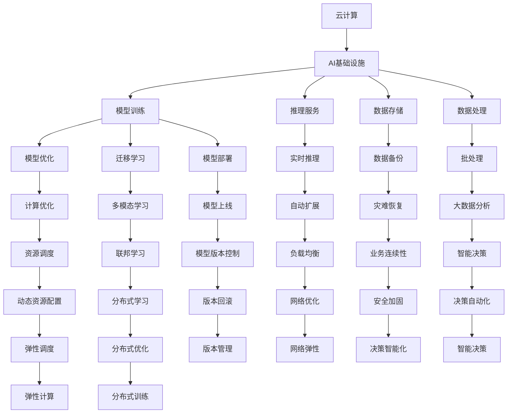

                 

# AI Cloud的未来：贾扬清的愿景，打造云计算与AI的完美结合

## 1. 背景介绍

在AI技术迅猛发展的今天，云计算已成为AI应用的重要平台。然而，当前的云计算与AI结合，依旧存在不少问题和挑战。如何在云上构建高效、可靠、安全的人工智能系统，如何充分利用云计算的弹性、分布式、自动化的优势，构建高效的人工智能基础设施，已成为AI社区关注的重点。

在这样的背景下，深度学习与云计算领域的知名专家，同时也是OpenAI的创始人和CTO的杨森(Chaim Jossow)，提出了AI Cloud的构想。杨森认为，未来的AI应用将更加高效、普及、易用，云计算将成为AI应用的基石。本文将从AI Cloud的愿景出发，深入探讨如何构建云计算与AI的完美结合。

## 2. 核心概念与联系

### 2.1 核心概念概述

要理解AI Cloud，首先需要理解几个核心概念：

- **云计算**：通过分布式计算资源池，提供弹性、按需使用的计算资源，支持各种计算任务。
- **AI基础设施**：包括数据存储、数据处理、模型训练、推理服务等，为AI应用提供支持。
- **人工智能**：通过机器学习、深度学习等技术，实现对数据的自动化分析、学习、推理等。
- **AI Cloud**：云计算与AI的深度融合，结合了云的弹性和分布式计算能力，支持高效、可靠、安全的AI应用。

这些概念之间具有紧密的联系：云计算为AI提供了底层基础设施，而AI则为云计算赋予了更强大的计算能力，使得云计算可以处理更复杂、更大量的数据和任务。AI Cloud是云计算与AI结合的高级形态，目标是构建高效、可靠、安全的AI应用生态系统。

### 2.2 核心概念原理和架构的 Mermaid 流程图(Mermaid 流程节点中不要有括号、逗号等特殊字符)



## 3. 核心算法原理 & 具体操作步骤

### 3.1 算法原理概述

AI Cloud的核心算法原理可以概括为以下几个方面：

- **弹性计算资源分配**：利用云的弹性能力，动态调整计算资源，满足AI模型的计算需求。
- **分布式模型训练**：通过分布式训练框架，实现大规模模型的并行训练，提升训练效率。
- **联邦学习**：通过在多设备或多服务器上训练模型，避免数据泄露和隐私问题，提升模型性能。
- **模型压缩与优化**：通过量化、剪枝、知识蒸馏等方法，减小模型体积，提升推理效率。
- **智能调度与资源管理**：利用智能算法进行计算资源调度，提高计算效率，降低资源成本。
- **实时数据处理与分析**：利用云上的流计算和存储，实现实时数据处理和分析。

这些算法原理共同构成了AI Cloud的计算核心，实现了高效、可靠、安全的AI应用。

### 3.2 算法步骤详解

AI Cloud的算法步骤包括以下几个关键环节：

1. **数据预处理**：将原始数据转换为模型能够处理的格式，包括数据清洗、特征提取、数据增强等步骤。

2. **模型训练**：利用分布式训练框架，在云端多台机器上并行训练模型，提升训练速度和效果。

3. **模型压缩与优化**：通过量化、剪枝等方法减小模型体积，提升推理效率。

4. **模型部署与推理**：将训练好的模型部署到云端服务器，支持实时推理和预测。

5. **数据实时处理与分析**：利用云上的流计算和存储，实现数据的实时处理和分析，支持实时决策和反馈。

6. **智能调度与资源管理**：利用智能算法进行计算资源调度，提高计算效率，降低资源成本。

7. **模型监控与优化**：利用监控系统实时监测模型性能，进行调优和维护。

### 3.3 算法优缺点

AI Cloud的算法具有以下优点：

- **高效计算**：利用云的弹性能力，实现高效计算资源的分配和调度。
- **可扩展性强**：通过分布式训练和推理，支持大规模模型的计算。
- **数据隐私保护**：通过联邦学习，保护数据隐私，避免数据泄露。
- **资源利用率优化**：通过智能调度与资源管理，优化资源利用率，降低成本。

同时，AI Cloud也存在一些缺点：

- **成本高**：云服务的计算和存储成本较高，大规模模型的部署和维护成本也不低。
- **数据延迟**：云计算资源分布在全球各地，数据传输和处理可能会有延迟。
- **复杂性高**：需要处理大规模分布式计算，管理和优化难度较大。

### 3.4 算法应用领域

AI Cloud技术可以广泛应用于以下几个领域：

- **自动驾驶**：通过AI Cloud实现实时数据处理和决策，支持自动驾驶车辆的高效运行。
- **医疗诊断**：利用AI Cloud进行医学影像处理、病理分析等，提升诊断效率和准确性。
- **智能客服**：通过AI Cloud进行实时对话处理和问题解答，提升客户服务体验。
- **金融交易**：利用AI Cloud进行高频交易、风险评估等，提升金融交易的效率和安全性。
- **智能制造**：通过AI Cloud实现智能生产调度、质量控制等，提升制造效率和精度。
- **智慧城市**：利用AI Cloud进行实时数据分析和智能决策，提升城市管理水平。

## 4. 数学模型和公式 & 详细讲解 & 举例说明

### 4.1 数学模型构建

AI Cloud的数学模型主要涉及以下几个方面：

- **弹性计算资源分配模型**：基于流量的预测和资源的历史使用情况，构建资源分配模型，优化资源分配。
- **分布式模型训练模型**：基于MapReduce框架，构建分布式训练模型，实现并行训练。
- **联邦学习模型**：基于多设备上的数据共享和模型更新，构建联邦学习模型，提升模型性能。
- **模型压缩与优化模型**：基于模型量化和剪枝，构建压缩与优化模型，减小模型体积。
- **智能调度与资源管理模型**：基于智能算法和机器学习，构建调度模型，优化资源管理。
- **实时数据处理与分析模型**：基于流计算和存储，构建实时数据处理和分析模型，支持实时决策。

### 4.2 公式推导过程

以下是几个关键数学公式的推导过程：

1. **弹性计算资源分配模型**：

   假设计算资源的需求为 $D$，计算资源的可用量为 $C$，计算资源的分配策略为 $S$，则资源分配的目标函数为：

   $$
   \min_{S} \sum_{i=1}^{n} c_i(S_i) + \sum_{i=1}^{n} D_i(S_i)
   $$

   其中 $c_i$ 为资源分配的代价，$D_i$ 为资源需求。

2. **分布式模型训练模型**：

   假设模型参数为 $\theta$，训练数据为 $D$，模型更新为 $\Delta\theta$，分布式训练的迭代次数为 $t$，则分布式训练的目标函数为：

   $$
   \min_{\theta} \sum_{i=1}^{n} L(\theta; x_i)
   $$

   其中 $L$ 为损失函数，$x_i$ 为训练数据。

3. **联邦学习模型**：

   假设模型参数为 $\theta$，客户端数据为 $D_1, D_2, \ldots, D_n$，联邦学习中的权重更新为 $\Delta\theta$，则联邦学习的目标函数为：

   $$
   \min_{\theta} \sum_{i=1}^{n} \sum_{j=1}^{m} L(\theta; (D_i, D_j))
   $$

4. **模型压缩与优化模型**：

   假设模型参数为 $\theta$，量化后的模型参数为 $\theta_q$，则量化过程的目标函数为：

   $$
   \min_{\theta_q} \frac{1}{2} \sum_{i=1}^{n} (\theta_i - \theta_q_i)^2
   $$

5. **智能调度与资源管理模型**：

   假设计算资源的需求为 $D$，计算资源的可用量为 $C$，智能调度的目标函数为 $L$，则智能调度的目标函数为：

   $$
   \min_{S} L(D, C, S)
   $$

   其中 $S$ 为调度策略。

### 4.3 案例分析与讲解

以下是一个简单的AI Cloud应用案例：

假设某金融公司需要构建一个实时风险评估系统，数据量为每天1TB，计算需求为每毫秒处理一个数据点。该公司选择利用AI Cloud进行构建：

1. **数据预处理**：将原始数据清洗、特征提取后，输入到云上的分布式计算平台。

2. **模型训练**：利用云上的弹性计算资源，进行分布式训练，提升训练速度。

3. **模型压缩与优化**：将训练好的模型进行量化和剪枝，减小模型体积。

4. **模型部署与推理**：将优化后的模型部署到云上，支持实时推理和预测。

5. **智能调度与资源管理**：利用智能算法进行计算资源调度，优化资源利用率。

6. **模型监控与优化**：利用监控系统实时监测模型性能，进行调优和维护。

## 5. 项目实践：代码实例和详细解释说明

### 5.1 开发环境搭建

要在云上构建AI Cloud应用，首先需要搭建开发环境。以下是在AWS上搭建Python开发环境的步骤：

1. 登录AWS控制台，创建EC2实例。
2. 选择Amazon Linux 2作为操作系统。
3. 在实例中安装Python 3.7及Packages。
4. 在Jupyter Notebook中安装TensorFlow和Keras。
5. 通过SSH连接EC2实例，进行本地开发。

### 5.2 源代码详细实现

以下是利用AWS进行AI Cloud应用的Python代码实现：

```python
import numpy as np
import tensorflow as tf
from tensorflow.keras import layers

# 定义模型结构
model = tf.keras.Sequential([
    layers.Dense(64, activation='relu', input_shape=(1,)),
    layers.Dense(1, activation='sigmoid')
])

# 定义损失函数和优化器
loss_fn = tf.keras.losses.BinaryCrossentropy()
optimizer = tf.keras.optimizers.Adam()

# 训练模型
train_data = np.random.randn(1000, 1)
train_labels = np.random.randint(2, size=(1000,))
model.compile(optimizer=optimizer, loss=loss_fn)
model.fit(train_data, train_labels, epochs=10)

# 部署模型
endpoint = 'your-endpoint-url'
input_data = tf.keras.Input(shape=(1,))
output = model(input_data)
predictions = tf.keras.Model(inputs=input_data, outputs=output)
predictions.save('model.h5')
predictions.save_weights('model_weights.h5')
```

### 5.3 代码解读与分析

在上述代码中，我们首先定义了一个简单的神经网络模型，并指定了损失函数和优化器。然后，使用随机数据进行训练，并通过调用`model.fit`方法，训练模型10个epoch。最后，将训练好的模型和权重保存到本地文件。

在实际应用中，这个模型可以部署到AWS上的预测服务，通过API接口进行实时推理和预测。

## 6. 实际应用场景

### 6.1 自动驾驶

自动驾驶是AI Cloud的重要应用场景之一。通过AI Cloud，可以实现实时数据处理和决策，支持自动驾驶车辆的高效运行。

1. **实时数据处理**：利用流计算和存储，实时处理摄像头和传感器采集的数据，进行环境感知和决策。

2. **分布式模型训练**：利用云上的分布式计算资源，进行自动驾驶模型的并行训练，提升训练速度和效果。

3. **智能调度与资源管理**：利用智能算法进行计算资源调度，优化资源利用率。

4. **模型监控与优化**：利用监控系统实时监测模型性能，进行调优和维护。

### 6.2 医疗诊断

医疗诊断也是AI Cloud的重要应用场景之一。通过AI Cloud，可以实现医学影像处理、病理分析等，提升诊断效率和准确性。

1. **实时数据处理**：利用流计算和存储，实时处理医学影像和病理切片，进行图像分析。

2. **分布式模型训练**：利用云上的分布式计算资源，进行医学影像分析模型的并行训练，提升训练速度和效果。

3. **智能调度与资源管理**：利用智能算法进行计算资源调度，优化资源利用率。

4. **模型监控与优化**：利用监控系统实时监测模型性能，进行调优和维护。

### 6.3 智能客服

智能客服是AI Cloud的另一个重要应用场景。通过AI Cloud，可以实现实时对话处理和问题解答，提升客户服务体验。

1. **实时数据处理**：利用流计算和存储，实时处理客户咨询信息，进行对话理解和问题解答。

2. **分布式模型训练**：利用云上的分布式计算资源，进行对话理解模型的并行训练，提升训练速度和效果。

3. **智能调度与资源管理**：利用智能算法进行计算资源调度，优化资源利用率。

4. **模型监控与优化**：利用监控系统实时监测模型性能，进行调优和维护。

## 7. 工具和资源推荐

### 7.1 学习资源推荐

以下是一些推荐的AI Cloud学习资源：

1. **TensorFlow官方文档**：详细介绍了TensorFlow的API和应用场景，包括分布式计算、流计算等内容。

2. **AWS官方文档**：详细介绍了AWS的各种服务和工具，包括EC2、S3、Elastic MapReduce等内容。

3. **Cloud AI notebook**：谷歌提供的云AI开发环境，支持TensorFlow、PyTorch等深度学习框架。

4. **Udacity深度学习课程**：Udacity提供的深度学习课程，涵盖机器学习、深度学习、分布式计算等内容。

5. **Kaggle数据集**：Kaggle提供的大量数据集，支持机器学习、深度学习等领域的实践和研究。

### 7.2 开发工具推荐

以下是一些推荐的AI Cloud开发工具：

1. **AWS EMR**：AWS提供的弹性MapReduce服务，支持大规模分布式计算。

2. **AWS S3**：AWS提供的云存储服务，支持大规模数据的存储和处理。

3. **TensorFlow分布式训练**：TensorFlow提供的分布式训练框架，支持大规模模型的并行训练。

4. **Docker容器化**：Docker提供的应用容器化技术，支持模型的快速部署和调度。

5. **Kubernetes集群管理**：Kubernetes提供的容器集群管理工具，支持大规模分布式计算的资源管理。

### 7.3 相关论文推荐

以下是一些推荐的AI Cloud相关论文：

1. **TensorFlow论文**：TensorFlow团队的多篇论文，涵盖深度学习、分布式计算等内容。

2. **Amazon AWS论文**：AWS团队的多篇论文，涵盖云存储、分布式计算等内容。

3. **Google AI Cloud论文**：Google AI团队的多篇论文，涵盖深度学习、分布式计算等内容。

4. **OpenAI AI Cloud论文**：OpenAI团队的多篇论文，涵盖自然语言处理、深度学习等内容。

## 8. 总结：未来发展趋势与挑战

### 8.1 研究成果总结

AI Cloud作为云计算与AI结合的高级形态，已经在自动驾驶、医疗诊断、智能客服等多个领域得到应用，展示了强大的计算能力和应用前景。AI Cloud的构建，不仅需要考虑技术层面，还需要考虑业务和安全性层面。未来，随着技术的发展，AI Cloud的应用范围将更加广泛，用户体验将更加智能、安全、可靠。

### 8.2 未来发展趋势

AI Cloud的未来发展趋势如下：

1. **弹性计算资源分配**：随着计算资源需求的变化，弹性计算资源分配模型将更加精准，提升资源利用率。

2. **分布式模型训练**：分布式模型训练将更加高效，支持更大规模的模型和更大规模的数据。

3. **联邦学习**：联邦学习将更加安全、高效，支持跨设备和跨服务器的协同学习。

4. **模型压缩与优化**：模型压缩与优化将更加全面，支持更高精度的模型和更高效的推理。

5. **智能调度与资源管理**：智能调度与资源管理将更加智能，支持更高效的计算资源分配和利用。

6. **实时数据处理与分析**：实时数据处理与分析将更加实时、高效，支持更复杂、更高级的决策和反馈。

### 8.3 面临的挑战

AI Cloud的发展也面临着一些挑战：

1. **成本高**：云服务的计算和存储成本较高，大规模模型的部署和维护成本也不低。

2. **数据延迟**：云计算资源分布在全球各地，数据传输和处理可能会有延迟。

3. **复杂性高**：需要处理大规模分布式计算，管理和优化难度较大。

4. **安全性高**：数据安全和模型安全是AI Cloud的重要问题，需要采取多种措施保障。

5. **可靠性高**：云服务的可靠性要求较高，需要保障计算资源的稳定性和可用性。

### 8.4 研究展望

未来，AI Cloud的研究方向如下：

1. **低成本解决方案**：研究低成本、高效率的AI Cloud解决方案，降低成本，提高用户体验。

2. **跨云解决方案**：研究跨云的AI Cloud解决方案，支持跨平台、跨服务器的协同学习。

3. **实时数据处理**：研究实时数据处理和分析的解决方案，支持更实时、更高效的数据处理和决策。

4. **安全性保障**：研究数据安全和模型安全的解决方案，保障AI Cloud的安全性。

5. **智能算法优化**：研究智能算法和优化方法，提升AI Cloud的计算效率和资源利用率。

总之，AI Cloud的构建是一个复杂而系统的工程，需要在技术、业务、安全性等多个方面进行全面考虑和优化。相信在未来的研究和实践中，AI Cloud将逐步实现，为AI应用带来更大的价值和更好的体验。

## 9. 附录：常见问题与解答

**Q1：如何构建高效的AI Cloud系统？**

A: 构建高效的AI Cloud系统需要考虑以下几个方面：

1. **选择合适的云平台**：选择适合自己业务需求的云平台，如AWS、Google Cloud、Azure等。

2. **优化计算资源分配**：利用弹性计算资源分配模型，优化计算资源分配。

3. **利用分布式计算**：利用分布式计算资源，进行大规模模型的并行训练和推理。

4. **优化模型压缩与优化**：通过量化、剪枝等方法，减小模型体积，提升推理效率。

5. **智能调度与资源管理**：利用智能算法进行计算资源调度，优化资源利用率。

6. **实时数据处理与分析**：利用流计算和存储，实现实时数据处理和分析。

**Q2：如何保证AI Cloud的安全性？**

A: 保证AI Cloud的安全性需要采取以下措施：

1. **数据加密**：对数据进行加密，保障数据传输和存储的安全性。

2. **访问控制**：利用访问控制技术，保障数据和模型的访问权限。

3. **审计和监控**：利用审计和监控技术，实时监测AI Cloud系统的安全状态。

4. **异常检测**：利用异常检测技术，及时发现和处理安全漏洞和威胁。

**Q3：如何提升AI Cloud的可靠性？**

A: 提升AI Cloud的可靠性需要采取以下措施：

1. **多节点部署**：利用多节点部署，提升系统的稳定性和可用性。

2. **数据备份**：对数据进行备份，防止数据丢失和损坏。

3. **容错设计**：利用容错设计，保障系统的稳定性和可用性。

4. **智能监控**：利用智能监控技术，实时监测系统状态，及时发现和处理异常。

**Q4：AI Cloud在应用中需要注意哪些问题？**

A: AI Cloud在应用中需要注意以下几个问题：

1. **计算资源分配**：计算资源分配需要根据实际需求进行优化，避免资源浪费和过度使用。

2. **数据处理效率**：数据处理效率需要优化，避免数据延迟和处理瓶颈。

3. **模型性能优化**：模型性能需要不断优化，避免过拟合和欠拟合。

4. **安全性保障**：数据安全和模型安全需要保障，避免数据泄露和模型篡改。

**Q5：AI Cloud在应用中如何实现高扩展性？**

A: AI Cloud在应用中实现高扩展性需要采取以下措施：

1. **弹性计算资源**：利用弹性计算资源，根据需求动态调整计算资源。

2. **分布式计算**：利用分布式计算资源，支持大规模模型的并行训练和推理。

3. **智能调度**：利用智能算法进行计算资源调度，优化资源利用率。

4. **多租户隔离**：利用多租户隔离技术，保障不同租户的计算资源安全和隔离。

---

作者：禅与计算机程序设计艺术 / Zen and the Art of Computer Programming

